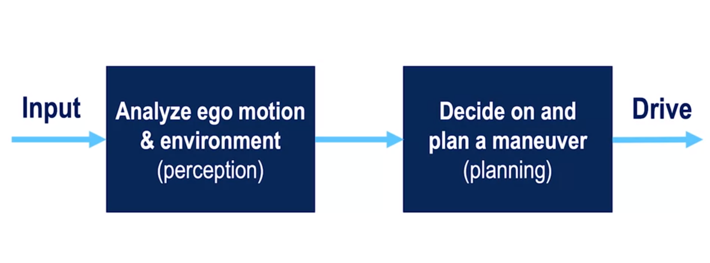

# Course 1 - W1 : Welcome to the Self-Driving Cars Specialization

## Overview 
This course will introduce you to the terminology, design considerations and safety assessment of self-driving cars

  **Course Objectives :**
- Understand commonly used hardware used for self-driving cars
- Identify the main components of the self-driving software stack
- Program vehicle modelling and control  
- Analyze the safety frameworks and current industry practices for vehicle development
  
## MODULE 0 : Welcome to Self-Driving Specialization

  This module will introduce you to the main concepts and advances in safety and performance metrics in the field of autonomous vehicles over the past two decades. It will highlight the major players and their contributions to the field.
      
  **Module Objectives :**
  - Review the layout of the courses in the Specialization
  - Review the main projects offered in this course
  - Examine the state of the self-driving industry

### Introduction to Self-Driving Cars
---
- **Welcome to the Self-Driving Cars Specialization**

Instructors : `Steve Waslander` and `Jonathan Kelly` both Associate professor in Aerospace studies at [University of Toronto](https://www.utoronto.ca/).

`Self-driving cars` is a sleeping geant which can change everything
  - road safety
  - mobility for everyone
  - reduce the cost of driving 
  - Steve and Jonathan built a self-driving car for research porpose :`Autonomoose`

Global overview and requirements for each of four courses which are already described in the introduction section of each course.

Autonomous driving is a constantly and changing field : 
- Self-driving
- Robotics
- AI and ML
---

- **Welcome to the Course**

By the end of this course : 
- Learn about the elements of drving : perception, prediction, decision making
- Understand how to design the software(sw) and hardware(hw) stack to do autonomous driving 
- Understand common safety pratices for autonomous driving
- Learn the basics of vehicle modeling and control, and controllers to do speed regulation, path following(finding)
- State of the art of the model predictive trajectory controllers for precisely executing challenging maneuvers
- Use these concepts to help navigate a self driving car in CARLA(test the limits of the vehicles performances...)
---
- **Course Prerequisites: Knowledge, Hardware & Software**

  - [Prerequisites notes](https://github.com/afondiel/Self-Driving-Cars-Specialization-Coursera/blob/main/Course1-Introduction-to-Self-Driving-Cars/resources/Course-Prerequisites-Knowledge-Hardware-Software.md)

---
- **The Story of Autonomous Vehicles**
  
- More than **94%** of road accidents are caused by some kind of human error
- The Ambition/dream/motivation behind the self-driving cars technology is to minimize or reduce human errors and driving deaths `out of the picture` through the **automation**. 
- Other advantages : 
  - replace the driving tasks/controls and focus on the eat, relax. Make the morning more productive : send emails for instance.
  
- `1925` : Francis Udina(A Mechanic Engineer) demostrated a remote control car `The American Wonder` drove in the street of Manhattan with an empty drivers seat
- `1956` : GM promoted a campaign of self-driving car to be arrived by 1976
- `1980s` in Europe : pionniers have been working on self-driving for 40 years. Early vehicles were partially autonomous and operating in a low speed
- `1986`: Ernst Dickens(Germany) : created a robotic van that could drive fully autonomously without traffic
- `1987` : Dickens van drove it speeds up to 60km/h
- `1990s` : Dickens's team worked on the Eurka Prometheus project, and develop an autonomous Daimler Benz using psychotic computer vision that focusing on points of interest in the environment. 
  - They used over 50 transporters
  - The latest microprocessors of the day
  - same probabilistic approach used in robotics and some sensors 
  - React road situation in the real time
  - Diamond Bends drove 1600Km in traffic from Munich to Copenhagen : 
    - mean distance : btw human intervension of 9km
- `1986` In US : Carnegie University Navlab team created the **Navlab1**, their first autonomous vehicle
  - Managed to drive 30km/h on the road using mutliple sun 
- `1990s` : Navlab2 was born, a modified Humvee which could perform autonomously both off than on-road. With speed of 110 km/h on the road
- `1996` :  Navlab2 drove 4800 km route across the America with no hands, with **98.2%** to autonomous driving.
- UC Berkerley developped a path project of autonomous platoons of vehicles operating on dedicated HOV lanes on the I5
  - `1992`: four of their vehicles drove a convoy at highway speed relying on magnetic markers for precise relative positioning saving on fuels costs and reduces wing drag ? 
  - `1997`: the project continues with alot of sucessful tests with use of new technologies like : RADAR station and V2V communication
    - Leading to advances such as : Adaptive cruise control and emergency braking systems
- `2002` : DARPA (The Defense Advanced Research Projects Agency) created the DARPA challenge for self-driving cars for universities
- `2004`: The event was a competition to build an autonomous vehicle capable to navigate 142miles(228,527Km) through the Mojave Desert(Stanford win the next year followed by Carnegie Mellon)
- `2007`: DARPA Urban Challenge took place on busy roads. The vehicles were much more equiped with GPS and other adavanced sensors. 
  - This was a jumping point in the tech industry that a new market was openning and race was on 
  - google reacted and hired the tech lead from both Carnigie Mellon and Stanford (Chris Thomposon and Mike Monte-Carlo) to push their design in public roads
- `2010`: Google cars had logged over thousand miles in california. Thus, they believed they could cut the number of road death by half (in US)
- `2018` :  Google logged over 10 million miles  
- Around the same time `Viz Lab` started an autonomous testing campaign with tow orange van and competed the international autonomous challenge driving th entire road from the University of Parma Italy to Shanghai China about 15000km w/ almost no driver intervention 

- `2019` : Volvo launched the Road Train concept which one vehicle could control several other vehicles behind it, by reducing road congestion and improving driver comfort
- `2012`: The Nevada Department of Motor Vehicles issued Google the first ever autonomous vehicle testing license (Google now test their self-driving cars in public roads) and California was next
- `2013`: Mercedes Benz demostrated their self-driving capabilities after 125 year since their first self-driving Betha Bens covering the entir 106 km autonomously.
- CES in Nevada (Las Vegas) become the annual show case for the greatest self-driving tech and automobile industries
- `2014` : Google demoed, firefly 'concept' car
  - Specs : 40km/h speeds, no steering wheels and pedals
- `2015` : Tesla introduced the `autopilot`
- `2016` : Autopilot could self park and be summoned by a button
- The research carried on, Autonomous taxi startups wecame popular like zoox and nuTonomy(first operational in Singapure) leading the way.
  
- Even though we have logged million miles of datas there is still alot of challenges and setbacks:
- `2016` :  Tesla Model S first fatal accident in Florida(due to a camera and radar sensor failure)
- `2018` : Uber self-driving Taxi fatal accident in Arizona. As consequence of that Uber suspended his self-driving cars testing for a while
- We should see more and more outcome services in year 2020s like : Robotaxi and driveless delivery.
-  The cost of self-driving car still high but prices will fall quicly as economies of scale takeover.
- There still so much to be done and as the Industry will to continue to grow, Outstanding Engineers will be needed to **produce innovative solution for driving**.

---
- **How to Use Discussion Forums**
  - OK

---
- **Get to Know Your Classmates**
  - OK

---
- **Glossary of Terms**
  - [here](./resources/glossary.md) ! 
---
- **How to Use Supplementary Readings in This Course**
  - OK 
---

### Meeting the Self-Driving Car Experts

---
- **Meet the Instructor, Steven Waslander**
  - Background : 
    - Actual job : 
      - Associate professor, Aerospace studies
    - Before : 
      - Aerospace Engineer, worked in safety & testing
        - passionate about : problem solving, sw dev, robots, drones, **disturbance rejection**, **motion planning**  
  - research work : 
    - building self-driving features at University of Toronto **Lab**
    - where the focus on testing safety features to be applied to real self-driving products and many other problems
    - working in the lab allows to explore lots of solutions scenarios of a specific problems `faster` than in the industry
  - Self-driving building prototyping approach: 
    - start by turning the automobile into a Drive-by-wire vehicule 
    - send commands to control steering, brakes, throttle ...
    - add sensors and computation devices

  - study requisites : fundamentals of robotics, computer vision, neural nets & machine learning
    - these knowledges can also be applied into another area or industries : 
      - cellphone cameras systems
      - improve features for taking videos, drones flights and object tracking...
---
- **Meet the Instructor, Jonathan Kelly**
  - Background : 
    - Passionate about space, engineering and technology
    - problem solving driven
  - Work : 
    - Assistant professor, at the Institute for Aerospace Studies at the UTC
  - Motivation  : 
    - Improve technologies to serve people
---
- **Meet Diana, Firmware Engineer at Zoox**
  -  Background : 
     - Bachelor's of **mechatronics** engineering at University of Waterloo
     - worked on Robotics at Peloton Technology (semi-autonomous trucks)
  - Work : 
    - Now : Firmware Engineer at Zoox
        - main motion control units : controls vehicle function such as breaking, steering commands
        - build drivers for high level interfaces
        - testing on HIL systems (Hardware-In-Loop) : simulation & validation
  - Motivation : Robotics
---
- **Meet Winston, Software Engineer**
  - Background: 
    - Worked at GM and SAE (Society of Automotive Engineer) program called "Auto Drive"
      - project spec : build a level 4, self-driving car
  - work : 
    - Now : Software Engineer and localization and mapping 
  - Motivation : 
    - From building computer vision systems for drones to trajectory planning algorithm for level 4, self-driving car 
    - working on cutting edge technologies
---
- **Meet Andy, Autonomous Systems Architect**
  - Background : 
    - studied robotics since high schools
    - vehicle controls in Dynamics at university 
  - Work :  
    - co-founded robotic team
    - currently systems level engineer for new generation of self-driving platform
    - works w/ differents team : sw during perception and motion control sw
      - hw engineers designing sensors and vehicle platforms
  - Motivation : 
    - robotics
    - create impact on the quality of human lives: improving safety, save human lives, re-shape how we think about transportation
---
- **Meet Paul Newman, Founder, Oxbotica & Professor at University of Oxford**
  - Background : 
    - CTO and founder of **Oxbotica** & Professor at University of Oxford
  - Work : 
    - build sw for autonomous vehicles from sensors to all stacks (perception, mapping, planning and control)
    - working on hard problem of autonomy & robotics
  - Motivation :
    - trigger : SLAM problem : cars has to find its location without a given map
    - build and find Engineer solutions
    - save lives
    - we shouldn't be dependent on infrastructures (city, traffic light ... ) to build an efficient self-driving cars
---
- **Why Should You Take This Course?**
  - self-driving general statement: the moral, safety, efficiency, transportation
  - very complex problem to solve
  - exciting career to be in, we're at the start of it and it'll last quite time
  - what's to learn : 
    - flexible, knowledgeable about this field
    - anyone wants to work in this industry
---

## MODULE 1 : The requirements for Autonomy 

Self-driving cars present an extremely rich and inter-disciplinary problem. 
This module introduces the language and structure of the problem definition, defining the most salient elements of the driving task and the driving environment.

> Learning Objectives : 
> - Identify perception, prediction and planning requirements for driving
> - Define the environmental elements that influence driving
> - Breakdown the task of driving into elemental decisions and actions
> - Assess the effects of driving conditions on the driving task
---
### Driving Taxonomy, Perception and Driving Decisions
#### **Lesson 1**: Taxonomy of Driving 

- The driving task : tasks that are performed constantly while driving a vehicle
  - `Perception` : perceiving the environment that we're driving in 
    - tracking car motion
    - identifying the various elements around the car (road surface, roads signs, vehicles, pedestrians ...)
    - track all the objects and predicts the future motions, in order to drive safely and accurately
  - `Motion Planning`: planning how to reach from point A to B
  - `Controlling the vehicle` : allows to take the appropriate streering, break and acceleration decisions, to control the vehicle's position and velocity on the road
- **Operation Design Domain (ODD)** : operating conditions under which a given system is designed to function : environmental, time of day, roadways and other characteristics under which the car will perform *reliably*
  - It might designed clearly to ensuring the safety of the system
  - The ODD shall be planned out carefully in advance
  
- How to classify driving system automation ? 
  - Driver attention requirements when driving the car : 
    - watching a movie while driving to work?
    - keep the attention in the steering wheel all the time?
  - Driver Action requirements : 
    - Do the driver need to steer ?
    - does the car take care of the speed and the driver controls it as well ?
    - can the driver controls lanes or the car stays in the current lane w/out any intervention? 
  - What exactly makes up a driving task (for automation) ? 
    - we use [SAE J3016](https://www.sae.org/blog/sae-j3016-update) created in 2014
      - **Lateral control** : Steering
        - steering and navigating laterally on the road : turning left, right, going straight or tracking a curve and so on
      - **Longitudinal control** : braking, accelerating
        - control of the position or velocity of the car along the roadway
      - **Object and Event Detection and Response** (OEDR) : detection, reaction ...
        - hability to detect objects and events that immediately affect the driving task and to react to them appropriately
        - encompasses a large portion of autonomous driving
        - used together with the ODD to categorize current self-driving systems
      - **Planning** : part of OEDR, intedend to travel to a destination or execute maneuvers such as : *lane changes* and *intersection crossings*
        - Long term
        - Short term 
      - **Miscellaneous** : tasks that people do while driving
        - signaling with indicators, hand-waving, interacting with other drivers and so on
  - Autonomous Capabilities
    - Automated lateral control : can the system handle steering tasks or lateral control ?
    - Automated longitudinal control : can perform the vehicle perform accelaration, braking and velocity manipulation tasks or longitudinal control 
    - OEDR : can the system perform object and event detection and response and to what degree ?
      - crutially, can the system handle emergency situations by itself or does it always need a driver to be attentive during emergencies?
    - Complete vs Restricted ODD : 
      - can the system perftom in all scenarios and all conditions ? 
      - does it have a limited ODD or set of operating conditions that it can handle **safety** ? 
- The level of automation based on [SAE J3016](https://www.sae.org/blog/sae-j3016-update)
  - **Level 0 - No automation** : everything is done by the driver
    - Regular vehicles, no automation
  - **Level 1 - Driving Assistance** : system that assists the driver on Longitudinal Control or Lateral Control tasks(either, but not both)
    - Ex1: Adaptive Cruise Control (ACC) : the system can control the speed of the car but is the driver that performs the steering 
    - Ex2 : Lane keeping assist systems : the system helps the driver to stay in the lane and warns when the car is drifting towards the boundaries
      - visual detection of lanes boundaries + lane centering lateral control
  - **Level 2 - Partial Driving Automation** : the system performs both Longitudinal and Lateral Control tasks in a specific driving scenarios, but the driver monitoring assistance is always required
    - ex1 : GM Super Cruise
    - ex2 : Nissan's Pro Pilot Assist
    - ex3 : OEM offering L2 : Audi, tesla, and Huyndai

  - **Level 3 - Conditional Driving Automation** : Longitudinal and Lateral control + OEDR
    - Includes automated objects and event detection and response
    - In case of failure the control must be taken by the driver
    - the driver does not need to pay attention in specific situation as the vehicule shall alert the driver in time to intervene
    - sometimes the sytems doesnot know when it is experiencing a failure
    - ex1 : Audi A8 Luxuary Sedan
  
  - **Level 4 - high Driving Automation** : L3 + Fallback - handles emergencies autonomously, driver can entirely focus on other tasks.
    - may ask to take over to avoid pulling over to the side of the road unnecessarily
    - the driver can watch a movie, check his phone
    - still permits self-driving systems with a limited ODD
    - ex1 : Only [Waymo](https://waymo.com/) has depoyed vehicles for public transport with this level of autonomy
  
  - **Level 5 - Full autonomation**: L4 + Unlimited ODD
    - the systems can operate under any condition necessary
    - infrastructure, society transformation : driveless taxis or robotaxis ...
  
  - Limitations of this taxonomy
  - ODD and safety record are more important 

#### Lesson 1 Supplementary Reading: Taxonomy of Driving
- [Taxonomy and Definitions for Terms Related to Driving Automation Systems for On-Road Motor Vehicles J3016_201806](https://www.sae.org/standards/content/j3016_201806/)
#### Practice Quiz
- OK 
  
#### **Lesson 2**: Requirements for Perception

Any task can be broken down into two components : 
  - understand the environment 
  - make a driving decision

Any driving task requires some kind of OEDR : 

- identify the objects around us
- recognizes events happening near us
- respond to it

To build a self-driving car, we neeed to be able to perform OEDR

- What is perception ?
  - We want to make sens of the environment and ourselves
  - two ways : 
    - identification (what it is?) : a car, cyclist and bus ...
    - understanding the motion (the way it moves and what he will do next )
  - Why ?
    - recognize the same patterns as we do as humans, as quickly possible
    - to inform our driving decisions

- Goals for perception
  - identify **statitc** objects : 
    - road and lane markings (on-road)
    - curbs(off-road)
    - traffic lights(off-road)
    - Road signs (off-road)
    - contruction signs, obstructions, and more(on-road)
  - identify **Dynamic** objects(on-road)
    - vehicles : 
      - 4 wheelers (cars, bus, trucks)
      - 2 wheelers (motorbikes, bicycles...)
    - Pedestrians
  - Ego localization : where we are and how we're moving at any point in time
    - Position
    - Velocity, acceleration
    - Orientation, angular motion 
    - Data come from sensors : **GPS**, **IMU** (Inertial Measurement Unit), **Odometry** and are combined together to generate a coherent picture of our position

- Challenges to perception
  - Robust detection and segmentation : 
    - through modern ML methods, but the reliability and performance shall be improve to achieve human level capability
      - more **training data** is one of key of improvements, but it's very challenging to label all the datas
  - Sensor uncertainty
    - visibility, **GPS**, **LiDAR** measurement corrupted
  - Occlusion, reflection on cameras 
  - Illumination, lens flare
  - Weather, precipitation (can correlate input data)

#### Lesson 2 Supplementary Reading: Requirements for Perception
- [Welcome to the KITTI Vision Benchmark Suite!](https://www.cvlibs.net/datasets/kitti/)

#### Practice Quiz
- OK

#### **Lesson 3**: Driving Decisions and Actions
- Making `decisions` : 
  - `Long term` : 
    - question  : How to navigate from New York to Los Angeles ? 
    - answer : we have a mission plan => A high level plan for the entire driving task.
      - Mapping the application used today : **type of road to take, lane** to be in so on
  - `Short term` 
    - Question : Is it safe to change lane now? or when should I execute a left turn at an intersection ?  
    - answer : ?
  - `Immediate` (reactions) : involves control and trajectory planning
    - Question : 
      - Can I stay on track on this curved road ? what's steering input should I apply?
      - Can I accelerate or brake, by how much ?
    - answer ? 
    
  - Example case : turning left at an intersection 
    - alot of complex scenarios to deal with
    - A simple maneuver, yet it takes 3-4 levels of decision and control to execute
    - consider how many rules would it take to drive : 
      - safely
      - efficiently
      - following all listed traffic rules
      - Only follow those rules everyone else is following ...  
    - **Driving Decision making is complicated** 
- **Rule Based Planning or reactive planning** (from software prespective)
  - One method to address the challenge of multilevel decision-making is **reactive planning**
    - It takes into account `the current state` of ego and other objects and give decisions
    - Examples : 
      - If there is a pedestrian on the road, stop!
      - If speed limit changes, adjust speed to match it.

What other types of planning are there ? 
- **Predictive planning** : 
  - we make predictions on how other **agents** in the **environment** (other vehicle and pedestrians), then use these predictions to inform our decisions
  - Example: 
    - That car has been stopped for the last 10 seconds. It is going to be stopped for the next few seconds
    - Pedestrian is jaywalking. She will enter our lane by the time we reach her.
  - More natural way to think and closed to how humans operate vehicles
  - Predicts where other objects will be in the `future` before we make our decisions
    - depends on the accurate predictions of the actions of the other actors in the environment (more complexity layer for preception tasks)
    - more used in self-driving cars in nowadays
#### Lesson 3 Supplementary Reading: Driving Decisions and Actions

- [Motion planning and other high-level behaviour](https://ieeexplore.ieee.org/abstract/document/7490340)
- [Mixed planning systems- winner of the DARPA Urban Challenge](https://onlinelibrary.wiley.com/doi/abs/10.1002/rob.20255)
### Learn from Industry Expert 

#### Advice for Breaking into the Self-Driving Cars Industry
-  Engineering Degree
-  CS degree 
   -  C++, Python...
   -  ML
-  Get familar w/ Hardware systems, mechanics and programming and robotics
-  Communication skills
   - Problem solving w/ [First principle](https://en.wikipedia.org/wiki/First_principle)
   - Debbuging skills
- Build pratical projects : Test first on `simulators` to get the first results ...
- See Self-driving problem similar to robotics ? 
  - Practice alot
  - Fail and try new approaches
  
### Weekly Assignment
- Quiz

# References

- [DARPA Grand Challenge](https://en.wikipedia.org/wiki/DARPA_Grand_Challenge)
- [DARPA Grand Challenge - 2007 edition](https://en.wikipedia.org/wiki/DARPA_Grand_Challenge_(2007))
