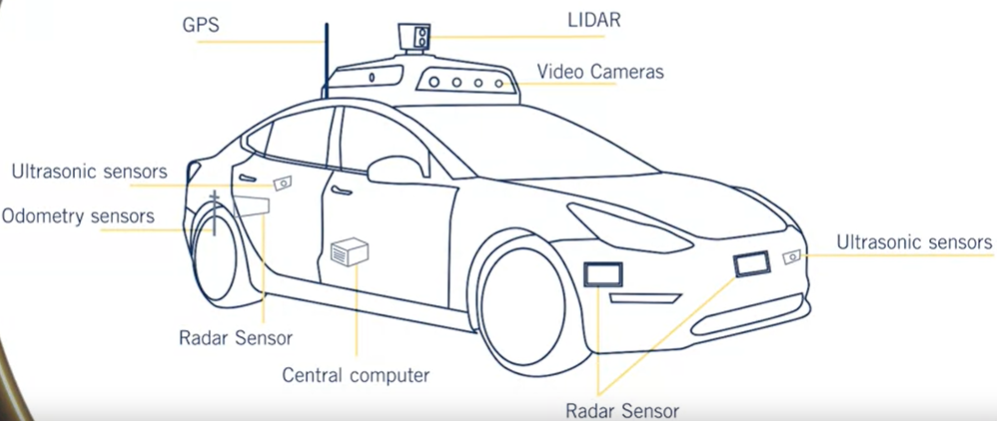

# Course 1 - W2 : Self-Driving Hardware and Software Architectures

## Overview 
- System architectures for self-driving vehicles are extremely diverse, as no standardized solution has yet emerged. 
- This module describes both the hardware and software architectures commonly used and some of the tradeoffs in terms of **cost**, **reliability**, **performance** and **complexity** that constrain autonomous vehicle design.

  **Course Objectives :**
- Design an omni-directional multi-sensor system for an autonomous vehicle
- Describe the basic architecture of a typical self-driving software system
- Break down the mapping requirements for self-driving cars based on their intended uses.

## MODULE 2: Self-Driving Hardware and Software Architectures

### Lesson 1: Sensors and Computing Hardware
**Sensors** : device that measures or detects a property of the environment, or changes to a/another property overtime.

- categorization : 
  - **exteroceptive** : extero=surroundings => they record the property of the environment
  - **proprioceptive** : proprio=internal => they record the property of the `ego-vehicule`

Sensors for perception : 
- `Exteroceptive`
  - **Cameras** : essential for correctly perceiving.
    - *Passive* & light-collecting sensors that are used for capturing rich detailed infromation about a scene
    - Comparison metrics:
      - `Resolution` (quality of the image) : number of pixels that create the image (l x w)
      - `Field of view (FOV)` : the horizontal and vertical angular extent that is *visible* to the camera (depending lens selection and zoom)
      - `Dynamic Range` : the difference btw the **darkest** and **lightest** tones in an image
        - High Dynamic range (HDR) is essential for self-driving vehicles to navigate in variable lighting conditions, particularly at night.
    - Trade-off btw resolution and FOV ?
      - Wilder `field of view` allows a larger viewing region in the environment but fewer pixels that absorb light from one particular object
      - FOV increases, the resolution needs to be increases as well, to still be able to perceive with the same quality
      - other properties that affect perception : 
        - focal length, depth of field and frame rate
        - further explanation **on course 3 : visual perception**
    - Cameras types :
      - Exteroceptive STEREO Camera: the combination of two cameras with overlapping FOVs and aligned image planes.
      - enables depth estimation from image data (synchronized image pairs)
      - Pixel values from image can be matched to the other image producing a disparity map of the scene then be used to estimate depth at each pixel
  - **LiDAR (Light Detection And Ranging)** : involves shooting light beams into the environment and measuring the reflet return
    - by measuring the amount of returned light and time of flight (TOF) of the beam based on intensity and range to the reflecting object can be estimated
    - LIDAR : includes a spinning element with multiple stacked light sources and outputs a detailed 3D scene geometry from LIDAR point cloud
    - Active sensor w/ it's own light sources therefore not affected by the environments lighting
    - different behavior than camera when operating in poor or variable lighting conditions
    - Comparison metrics:
      - **Number of beams** (of sources) : most common sizes 8, 26, 32, 64 
      - **Points per second** : the faster the point collection, the more detailed the 3D point cloud can be.
      - **Rotation Rate** : The higher this rate, the faster the 3D point clouds are updated 
      - **Detection Range** : dictated by the power output of the light source
      - **FOV**
    - Upcoming : Solid state LIDAR ! 
      - High-Resolution Solid-state LIDAR : without a rotational component from typical LIDAR
        - Extremely low-cost and reliable
  - **RADAR (Radio Detection And Ranging)** : old than Lidars and robustly detects **large** objects in the environment
    - They are particularly useful in adverse weather(fog and rain) as they are mostly unaffected by precipitation (poor visibility)
    - Comparison metrics:
      - **Detection Range** 
      - **FOV** 
      - **Position and speed accuracy**
    - Configurations : 
      - Short range : Wide FOV 
      - Long range : Narrow FOV 
  - **ULTRASONIC/SONARS(Sound Navigation and Ranging)** : measures range using sound waves
    - Short-range all weather distance measurement  
    - applications : 
      - good for low-cost parking scenarios, where ego-vehicle needs to make movement very close to other cars
    -  Unaffected by lighting, precipitation
    - Comparison metrics:
      - Range : The maximum Range they can measure
      - FOV :
      - Cost
  
- `Proprioceptive` : 
  - **GNSS (Global Navigation Satellite Systems)** : 
    - GPS (Global Positioning System) with variable Range  : 5 to 10m
    - Galileo : more accurated than GPS
    - GNSS receivers are used to measure ego vehicle position, velocity and heading
      - varying accuracies: RTK, PPP, DGPS
      - the accuracy depends a lot on the actual positioning methods and the corrections used
  
  - **IMU (Inertial Measurement Units)** :   
    - angular rotation rate
    - acceleration 
    - heading (IMU, GPS) : the most important of vehicle control
    - combined measurements can be used to estimate the 3D orientation of the vehicle
  
  - **WHEEL ODOMETRY** : 
    - Tracks wheel velocities and orientation
    - Uses these to calculate overall speed and orientation of car
      - Speed accuracy
      - position drift (heading rate)
      - tracks the mileage on the vehicle

**Computing Hardware** : the most crucial part is the **computing brain** and the main decision making unit of the car
- Takes in all sensor data
- computes actions
- Already existing advanced systems that do self driving car processing
  - Eg : NVIDIA Drive Px/AGX, Intel & Mobileye EyeQ
- computer brain needs both serial and parallel compute modules 
  - Image LiDAR processing: to do segmentation, Object detection, Mapping
    - GPUs : Graphic Processing Unit 
    - FPGAs : Field Programmable Gate Array
    - ASICs: Application Specific Integrated Chip
- HW synchronization : 
  - To synchronize different modules and provide **common clock**
  - sensor measurements must be timestamped with consitent times for `Sensor Fusion` to function correctly
  - GPS relies on extremely accurate timing and act as an appropriate reference clock when available

### Lesson 1 Supplementary Reading: Sensors and Computing Hardware

### Lesson 2: Hardware Configuration Design
### Lesson 2 Supplementary Reading: Hardware Configuration Design

### Lesson 3: Software Architecture
### Lesson 3 Supplementary Reading: Software Architecture

### Lesson 4: Environment Representation
### Lesson 4 Supplementary Reading: Environment Representation

### The Future of Autonomous Vehicles