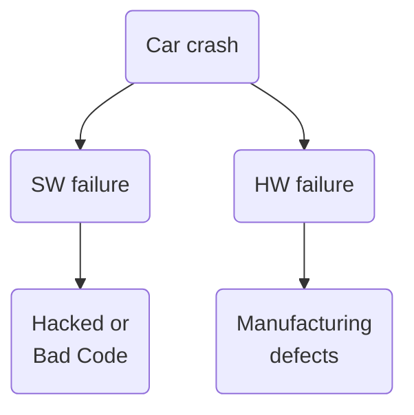

# Course 1 - W3 - MODULE 3: Safety Assurance for Autonomous Vehicles

## Overview 

- As the self-driving domain matures, the requirement for safety assurance on public roads become more critical to self-driving developers. 
- You will evaluate the challenges and approaches employed to date to tackle the immense challenge of assuring the safe operation of autonomous vehicles in an uncontrolled public road driving environment.

**Learning Objectives**
- Assess the primary contributions to the overall safety system for self-driving cars
- Investigate the main causes of prominent autonomous driving failures recorded to date
- Employ safety assessment methods for analysis of specific scenarios and hazards for self-driving.
- Describe analytical and empirical approaches to safety assessment.

## Safety for Self-driving Cars

### Lesson 1: Safety Assurance for Self-Driving Vehicles
**Examples of Automated Vehicle Crashes** 
-  `March 2016` : A Google Self-Driving Car (now Waymo) ran into side of the bus
    - Causes : lateral distance btw the bus and the self-driving car lane was too narrow (bad estimation/computing by the self-driving sw)
    - Due to that, the self-driving car thought the bus wouldn't pass/overtake
    - By the time the car computes a new measuremnt but was too late to react

- `In 2017` : Uber self-driving vehicle overreacted during a minor collision caused by the another car and ended up overturning
  - Causes : The dynamic models don't assume disturbance forces from other vehicles acting on the car 
  - Integration of robustness into the control system
  - More exploratory testing that covers as many foreseeable events as possible

- `Late 2017` (Law Suit Case) : A GM Cruise Chevy Bolt knocked over a motorcyclist afer it aborted a lane change maneuver
  - Causes : gap in adjacent lane closed rapidly and vehicle aborted the maneuver and knocked over the motorcyclist
  - During the abort the motorcyclist was alrealy forward alongside the vehicle and the vehicle was stuck in a dilemma to colide w/ the motorcyclist or to crash into both cars in the adjacent lane
  - The vehicle didn't anticipate this scenario and knocked over the motorcyclist 
  - Unexpected/Future events still a big decision-making challenge in self-driving cars

- `March 2018` : Uber self-driving Taxi fatal accident in Arizona. As consequence of that Uber suspended his self-driving cars testing for a while
  - Causes : the incident occured on a wide multilane divided road at night where a pedestrian was walk her bicycle across the street in an unmarked area
  - Multiple Thing Gones Wrong : 
    - No real time checks on safety drivers (no real-time monitoring system)
    - After the woman was detected on the road (6 sec before the impact)
      - first classified as unkown object
      - the misclassified as a vehicle 
      - then a bicycle
    - Possible assumption : the vehicle aborted the detection because too unreliable
    - 1.3 sec before, Volvo system tried to do emergency braking maneuver
      - The Volvo system wa disable by Uber when in autonomous mode because not possible to have multiple collision avoidance systems operating simultaneouly during the testing
    
    - In Summary :  `Perception system failure` & `planning system` to avoid the detective object even though its class was uncertain & lack of human or emergency braking backup
 
**Basic Safety Terms**
- Harm : refer to the physical harm to a living thing
- Risk (Probability + Severity) : describes the probability than an event occurs combined with the severity of the harm that the event can cause
- safety : **absence of unreasonable** risk of harm to a living thing
  - Ex: Driving into an intersection when the traffic signal is red would be unsafe as it leads to unreasonable risk to harm of the occupant of the vehicles and other vehicles

- Hazard : potential source of unreasonale risk of harm (treat to safety)
  - Ex : software bug that could potentially cause an accident

Major Hazard Sources :
-  Mechanical : incorrect assembly of a break system causing a premature failure
- Electrical : faulty internal wiring leading to a loss of indicator lighting
- Hardware : failure of computing hardware chips used for autonomous driving
- Software : errors/bugs in the autonomy software
- Sensors : bad/noisy sensor data or inaccurate perception
- Behavioral : incorrect planning or decision-making regarding a behavior selection for a specific scenarion wasn't designed correctly 
- Fallback :  fallback to human driver fails by not providing enough warning to the driver to resume responsability 
- Cybersecurity : self-driving gets hacked 

**Important questions about self-driving cars safety** 

1. How do we ensure our self-driving car is truly safe? 
2. How do we take the complex task of driving and the many hazards that can occur, and define a **safety assessment framework** for a complete self-driving system ?

**NHTSA : Safety Framework**
- In US, the National Highway Transportation Safety Administration(NHTSA) : suggested 12 - part safety framework to structure safety assessment for autonomous driving (Not mandatory in the industry) 

      1. System engineering approach to safety 
      2. Autonomy Design
         1. ODD
         2. OEDR
         3. Fallback
         4. traffic Laws
         5. Cybersecurity
         6. HMI
      3. Testing & Crash Mitigation 
         1. Testing 
         2. Crashworthiness
         3. Post crash
         4. Data recording
         5. Consummer education & training 
      
      Src : A vision for safety 2.0 (2017)

### Lesson 1 - Supplementary Reading: Safety Assurance for Self-Driving Vehicles

- [NTSB's Report on the 2018 Uber Crash](https://www.ntsb.gov/investigations/AccidentReports/Reports/HAR1903.pdf).

- [paper on WISE Drive: Requirements Analysis Framework for Automated Driving Systems by Dr. Krzysztof Czarnecki ](https://uwaterloo.ca/waterloo-intelligent-systems-engineering-lab/projects/wise-drive-requirements-analysis-framework-automated-driving) 

- [The NHTSA - Automated Driving Systems: A Vision for Safety 2.0 report](https://www.nhtsa.gov/sites/nhtsa.gov/files/documents/13069a-ads2.0_090617_v9a_tag.pdf) 

### Lesson 2: Industry Methods for Safety Assurance and Testing

**Waymo safety Perpective (released in 2017**
- Waymo coverage all 12 part of NHTSA but organizes them into 5 level safety approach
  - `Behavioral Safety` : wide range of scanarios within the ODD and maintain vehicle safety through it.
  - `Functional Safety` : the systems have backups and redundancies allowing the car to switch into a secondary component or a backup process to minimize the severity of failures and return the vehicle to a safe state
  - `Crash Safety` : to ensure minimum damage to people inside the car during a crash
  - `Operational Safety` : interfaces are usable and convenient and intuitive. Allowing the passengers to have some level of control over the vehicle but in ways that maintain system safety
  - `Non collision safety` : minime the danger to people that may interact with the systemin some ways : first responders, mechanics, Engineers and so on 

**Waymo: Safety Processes**
- Identify hazard scenarions & potential mitigations (attenuations)
- Use Hazard assessment methods to define safety requirements
  - Preliminary analysis
  - Fault tree
  - Design Failure Modes & Effects Analyses
- Conduct extensive testing to make sure safety requirement are met 

**Waymo: Level of testing to ensure safety**
- Simulation testing : more than 10 million miles of simulation per day
  - high & continuous computational cost
  - to be complianced to safety requirements for the system
  - Actions : 
    - Test rigorously with simulation, thousands of variations, fuzzing of neighbouring vehicles 
      - change the position and velocity parameters of the other vehicles and pedestrians ramdomly to test if the ego-vehicle behaves safely throughout all of them
      - defined to find hard edge cases
      - hard to resolve time gaps for merging or crossing intersections
- Closed-course testing : test on private tracks
  -  Follow 28 core by UC Berkeley + 19 additional scenario competencies on private test tracks
  -  Focus on four most common crashes : 
     - Rear-end, intersection, road departure, lane change
     - This covers over 84% of all crashes

- Real world driving
  - street driving test in place like : Mountain View California (near Google campus)
  - Start with small fleet, expand steadily
  - Already testing thousands of vehicle, with more on the way

**GM - Cruise : Safey strategy**

- GM acquired Cruise Automation in 2016
- Address all 12 elements of NHTSA Safety Framework
  - Iterative Design model
  

  - Control car production 
    >- Unlike [Waymo](https://waymo.com/) who relies on OEMs (car manufacturer) to design its vehicles and only discusses mechanical and electrical hazards related to its autonomy HW, [GM](https://www.gm.com/) manufactures their cars entirely themselves. Therefore GM can enforece and control their design better
  
- Safety through Comprehensive Risk Management and Deep Integration
  - Identify and address risks, validate solutions
  - prioritize elimination of risks, not just mitigation
- All hardware, software systems meet
  - self-set standards for performance, crash protection, reliability, serviceability, security, safety

**GM : Safety Process**
- Deductive Analysis
  - fault tree analysis
- Inductive Analysis
  - Design & Process FMEA(Failure, Mode and Effect Analyis)
- Exploratory Analysis
  - HAZOP : Hazard & Operability Study
  
**GM: Safety Thresholds**
All GM vehicles are equipped with two key safety thresholds
- **Fail safes** - There is redundant functionality (second controllers, backup systems etc) such that even if primary systems fail, the vehicle can stop normally
- **SOTIF** - All critical functionalities are evaluated for unpredictable scenarios

**GM : Testing**
- **Performance testing** at different levels
- **Requirements validation** of components, levels
- **Fault injection testing** of safety critical functionality
- **Intrusive testing** such as electromagnetic interference, etc
- **Durability testing** and **simulation based testing**

> Is it truly precisely assess whether and autonomous car is safe Or at least safer than a human driver?
- Two approaches tries to answer this question : 
  - `Analytical Safety`
  - `Data-driven`

**Analytical vs Data-driven : Definitions**
- Analytical Safety : ensuring the systems work in the theory and meets safety requirements found by hazard assessment
  - Ex: Space shuffle : where analytical failures were pegged at 1/100k flights
  - Analytical Safety : can only provide guidance on safety performance of the self-driving systems due to the their complexity and variety situations/scenarios 

- Data-driven safety (through experiences): guarantee due to the fact that the system has performed autonomously without fail on the roads for a very larger numbers of kms
  - based on human lvel driven performance aiming to reduce accidents by 10x or 100x onver the performance of today's drivers

**Are Autonomous cars safer ?**
- Driving is still Dangerous ! 
- Car accidents are mostly caused due to human errors (NHTSA, 2015)
- Humans are also good at driving : 
  - In US, on average
    - 1 fatal collion per 146 million km
    - 1 injury collision per 2.1 million km
    - ~ 1 collision per 400k km
  - **Src** : [NMVCSS 2005-2007](https://crashstats.nhtsa.dot.gov/Api/Public/ViewPublication/811366)

- Consider California disengagement rates: 
  - In 2017, Waymo had:
    - Driven 563k km autonomously in California
    - 63 disengagements
      - Causes : unwanted vehicle manoeuvres, perception discrepancies, hw issues, a single case of a reckless road user.
    - 1 disengagement every 9000 km

  - In 2017, GM had:
    - Driven 210k km autonomously in California
    - 105 disengagements
    - 1 disengagement every 2000 km
  
  - The numbers has improved sinced then
  - In conclusion : these are hard numbers to relate to in the terms of human performance but roughly mean that a computer driving will only intervene `once a year` for failure of the autonomy system.
  - Enormous progress but still away further from a 400k km btw crashes that humans achieve on trillions of miles every year

**Dilemma**
- **Question** : How amny miles(years) would autonomous vehicles have to be driven to demonstrate with 95% confidence their failure rate to within 20% of the true rate of 1 fatality per 4 milion km ? 
- **Answer** : ~400 years, with a fleet of 100 vehicles travelling all the time (toatl ~8 billion miles)

### Lesson 2 Supplementary Reading: Industry Methods for Safety Assurance and Testing

- [Waymo Safety Report](https://waymo.com/safety/)
- [GM Safety Report, 2018](https://www.gm.com/content/dam/company/docs/us/en/gmcom/gmsafetyreport.pdf)
- [Ford Safety Report, 2018](https://media.ford.com/content/dam/fordmedia/pdf/Ford_AV_LLC_FINAL_HR_2.pdf)
- [Uber Safety Report, 2018](https://uber.app.box.com/v/UberATGSafetyReport)
- [NHTSA Crash Statistics, 2015](https://crashstats.nhtsa.dot.gov/Api/Public/ViewPublication/812115)

- [Autonomoose: Towards All Weather Driving in Canada, Steven’s presentation, University of Toronto & University of Waterloo (June 15, 2018)](https://d3c33hcgiwev3.cloudfront.net/JZA8XCfuEemm8wp4g3TKTg_25dd4a7027ee11e98ed3dfcfdba7c72b_2018_06-Autonomoose-Driving-in-Canada.pdf?Expires=1674604800&Signature=PP9jH6RkRT~QMxPUfWPHr2RJTnv4sf8hAQ8oKvedaEQJEzLIxkeYwdRWrZBxa2HxdgmvkmNBlUa-QotF49akRx443hONAI8azX6dKC2HuWavluMJAPQSh61IRQGGZqrkz9oPeCV5E-iOyOWz4ap-h-RkivCB3TUsdFrOOL401EU_&Key-Pair-Id=APKAJLTNE6QMUY6HBC5A)
  
- [How Many Miles of Driving Would It Take to Demonstrate Autonomous Vehicle Reliability?](https://www.rand.org/pubs/research_reports/RR1478.html); Rand Corporation Report, 2016

### Lesson 3: Safety Frameworks for Self-Driving

**Generic Safety Frameworks**
- Fault Tree Analysis : identifies all ways in which it can occur(probability) from events and failures at lower levels of the system
  - Top down deductive failure analysis
  - The top node in a fault tree is the root or top event
  - The intermediate nodes in the fault tree are logic gates
  - combination of the probabilities using the **laws of Boolean logic**

**Probabilistic Fault Tree Analysis**
- Assign probabilities to fault "leaves"
- Use logic gates to construct failure tree
  - P(A) +/or P(B)
  - P(A) ./and P(B)
    - where : the OR and AND probas will be the sum or product of children node probabilities
  - the probabilities are includes at the leaf nodes
- Ex in industries : 
  - Aerospace and nuclear industries 
  - Can also be applied in Self-Driving vehicles
    - The challenge will be in building a comprehensive tree and incorrectly identifying the **probabilities of the leaf nodes events**
  
**Failure Mode and Effects Analyses (FMEA)**
- Bottom up process to identify all the effects of faults in a system
- FTA and FMEA are used together to assess safety critical systems
- **Failure Mode** : Modes or ways in which a component of the system may fail
- **Effects Analyses** : Analyzing effects of the future modes on the operation of the system

- FMEA : Idea
  - Categorize failure modes by priority
    - How serious are their effects ? 
    - How frequency do they happen ? 
    - How easily can they be detected ? 
  - Eliminate or reduce failures, starting with top priority 

- FMEA : Steps
  1. Discuss with field experts : Create FMEA table
  2. List failure modes/probabilities
  3. For each failure mode => identify effects => **Severity?** (S), from 1 to 10(most severe)
  4. For each root cause => **Occurence?** (O), from 1 and 10
  5. For each prevention method => **Detection?** (D), from 1 and 10
  6. Get Risk Priority Number : $RPN = S.O.D$
      - **The high RPN, the high the priority is**
- We modify our implementation of the system until we reduce the risks to an acceptable level
- the FMEA can also be performed by the failure probabilities as in fault tree analysis
  - the method doesnot change but the number and the complexity of completing the entire analysis

- FMEA example :
  - Consider following failure mode
      - System encounters gravel, controller failure
      - **Severity** : physical crash (S = 10)
      - **Occurrence** : whenever construction encountered, out of ODD, so somewhat likely (O = 4)
      - **Detection** : can check status monitor to identify if this happens with certainty (D =10)
      - RPN = 10x4x10 = 400
  - Other Similar failure modes  : 
    - sign perception failure (RPN = 100)
    - GPS synchronization failure (RPN = 300)
    - Incorrect motion prediction (RPN=150)
  - Final RPN List : 
    - Control failure
    - GPS failure
    - Motion prediction
    - sign perception  

FMEA a quantitave process

**HAZOP - a variation on FMEA**
- Hazard and operability study (HAZOP)
- Qualitative brainstorming process, needs "imagination"
- Uses guide words to trigger brainstorming (not, more, less etc.)
- used earlier in the design process to guide the conceptual design phase .
  - Applied to complex 'processes'
    - Sufficient design information is available, and not likely to change significantly
- Simplified ongoing FMEA brainstorming approach

**Automotive Safety Frameworks**
- ISO 26262 - Functional Safety Standard
- ISO/PAR 21448.1 - Safety of Intended Functionality
- Functional Safety is defined as  : 
  - safety due to absence of unreasonable risk
  - only concerned about malfunctioning systems
  - addresses only the hardware and software hazards that can affect autonomous vehicle safety
- ISO26262 defines (four) Automotive Safety Integrity Levels (ASIL)
  - ASIL-D most stringent, ASIL-A least stringent 

Functional Safety Process :  
- Follows a **V-shaped** flow
  - The final step is a **Summary Functional Safety assessment** 
    - evaluate residual risk and determine if our system has reached an acceptable level of safety
  - At the start of the functional V : 
    - Hazard And Risk Assessment (HARA): identifies and categorize hazardous events and specify requirements to avoid unreasonable risk.
    - Identify faults
      - This is where FMEA or HAZOP are used in the framework and leads to a specific set of hazards to our system
    - Identify scenarios 
      - the system must operate in drawing on our ODD to create this list
    - Assess risks
      - combines hazards and situations into hazards events, describe expected damages to calculate numerical values of potential risk for each combination of situation and hazard
    - Define worst-case scenarios 
  - You focus on worst-case requirements and the implement HW & SW that can handle these worst-case requirements

**Safety of the Intended Functionality (SOTIF)**
- ISO/PAS 21448.1
- Failures due to performance limitations and misuse
  - sensor limitations
  - Algorithm failures/insufficiencies
  - User misuse - overload, confusion 
- Designed for level 0-2 autonomy
- Extension of FuSa
  - V-shaped process
  - Employs HARA  

### Lesson 3 Supplementary Reading

- [Failure Modes and Effects Analyses - asq.org](https://asq.org/quality-resources/fmea)
- [ISO 26262-1:2018 - Functional Safety for Road Vehicles](https://www.iso.org/standard/68383.html)
- [Keeping safe on the roads: series of standards for vehicle electronics functional safety just updated](https://www.iso.org/news/ref2358.html)
- [ISO/PAS 21448 - Safety of the intended functionality for Road Vehicles](https://www.iso.org/standard/70939.html)

### **Reading: How Many Miles of Driving Would It Take to Demonstrate Autonomous Vehicle Reliability?**

- [RAND Corporation Report on Driving to Safety](https://www.rand.org/pubs/research_reports/RR1478.html)

## Learning from Industry Expert
### Meet Professor Krzysztof Czarnecki, Safety Assurance Expert
- Self-driving garage at University of Walerloo
- Background : 
  - Worked for DAIMLER Reasearch for abour 16 years
  - worked on automotive software and safety topics at Walerloo
- Now : 
  - Working on safety : Architecture, the design methodologies, ML and vehicle behavior in traffic
### Prof. Krzysztof Czarnecki on Assessing and Validating Autonomous Safety: An Impossible Task?

- Identify the hazard :
  - Design
  - Implementation
  - operation of a system 
- Identify the mechanism (the way these hazard can occur) 
  - address : 
    - design
    - implementation
    - operation
- Testing and Validation is important
  - collect a large number of miles is a tough task => but having a large enough fleet can solve the problem => but you'll so need to solve/build the system before ?  
    - That's why testing has to be done in a incremental fashion
    - in a feedback loop to get to learn about the system in pratic: the risks and make improvement them
  - **Validation testing & Verification testing**
  - In verification testing, when a system is changed we don't need to collect all the kms and retest every single part part of the system
    - the kms are there defined in the requirements and can be used to verify which part of the system can be retested in the road or in a simulation or in a closed-circuit
    - 
### Prof. Krzysztof Czarnecki's Lessons from Aerospace: Can the AV Industry Collaborate on Safety?
-  `Zero fatality` it's what safety is aimed for ? 
   -  but still have a long way to go
   -  Automotive industry can learn from aerospace industry
### Paul Newman on the Trolley Problem
- Safety is a society problem NOT only Engineering problem
- Society has to engage in and lawmakers have to decide how the vehicle has to behave in a `No win situation` ?
  - Ethical issues ? 
  - How should the vehicle act ? 
  - Are there laws which cover these scenarios? 
- After we solve/define these questions then Engineer can start to address the problem

### How Companies Approach Autonomous Vehicle Safety
- Benefits of self-driving cars :
  - better safety
  - congestion goes down
  - improve mobity expercience (ppl who can driver and dont reason to do so...)
- Before deployment, multiple stages of testing are :
    - In **simulation**
    - cover edge cases
    - Private track  
    - the public road
  - SAFETY is the main advantage of self-driving (reduce 94% of crash and accident statistic number by human drivers)
- Real world testing and computer testing
  - Simulation 
  - miles accumulation (learn from it) 
  - day time :
    - Camera
  - night time : 
    - Radar
    - Lidar
- We can re-learn how to be a better driver from accumulated/recording data from previous driving 
## Assignment 
- OK 
## References

- [Waymo Safety Report](https://storage.googleapis.com/waymo-uploads/files/documents/safety/2021-12-waymo-safety-report.pdf)
- [Waymo Safety in numbers](https://waymo.com/safety/)
- [GM 2018 SELF-DRIVING SAFETY REPORT](https://www.gm.com/content/dam/company/docs/us/en/gmcom/gmsafetyreport.pdf)
- [Cruise : 2018 Self-Driving Safety Report PDF](https://www.gm.com/content/dam/company/docs/us/en/gmcom/2018%20Self-Driving%20Safety%20Report%20Appendix%20A_DIGITAL_180614b.pdf)

- Glossary : 
  - SW : SoftWare
  - HW : HardWare

