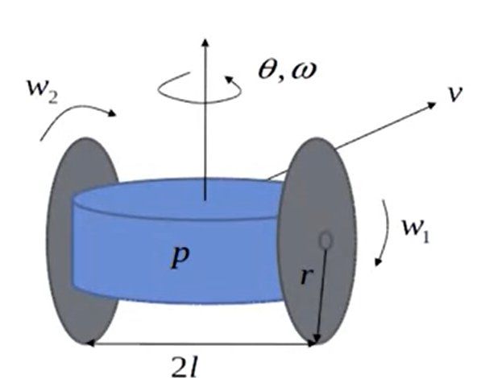
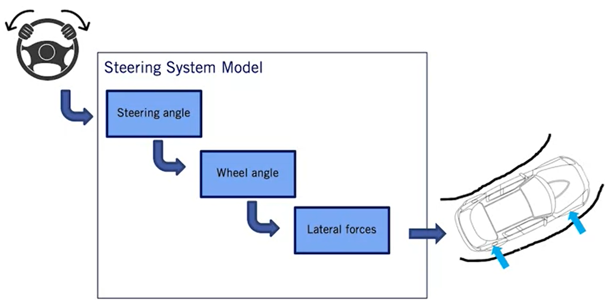
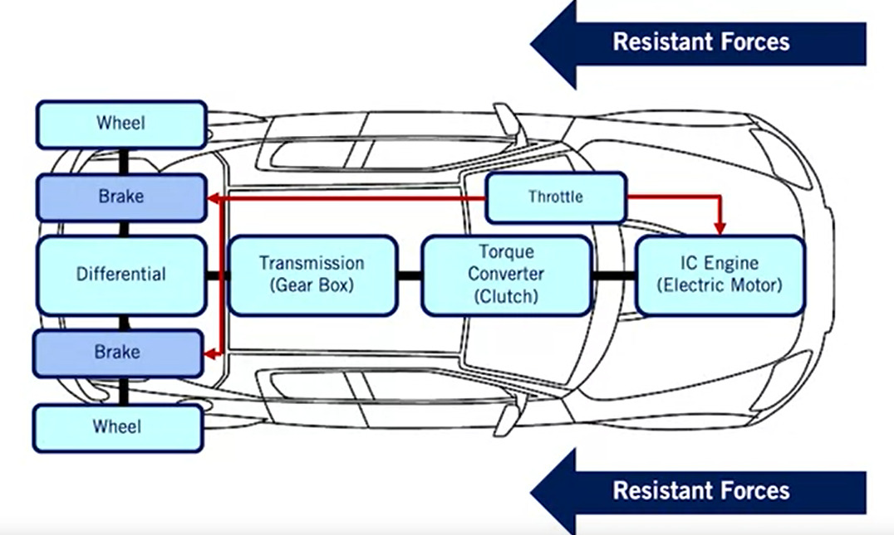

# Course 1 - W4 - MODULE 4: Vehicle Dynamic Modeling (VDM)

## Overview 

- The first task for automating an driverless vehicle is to define a model for how the vehicle moves given steering, throttle and brake commands. 
- This module progresses through a sequence of increasing fidelity physics-based models that are used to design vehicle controllers and motion planners that adhere to the limits of vehicle capabilities.

**Learning Objectives**
- Develop a kinematic bicycle model of a car with velocity and steering angle inputs
- Develop a dynamic bicycle models of a car with velocity and steering angle inputs
- Differentiate between models of tire forces
- Develop a model for actuation in a car, from pedal and steering wheel to tire forces

## Dynamic Modeling (DM)
### Lesson 1: Kinematic Modeling in 2D
Generally vehicle motion can be modeled in two ways: 
- dynamic constraint that define its motion 
- considerring all the forces and moments acting on the vehicle

**Kinematic vs Dynamic Model**
- `Kinematic Model` : At low speeds (less significant/low acceleration), it is often sufficient to look only at kinematic models of vehicles
  - Examples : Two wheeled robot, Bicycles model
- `Dynamic Model` : is more involved, but captures vehicle behavior (motion) more precisely over a wide operating range (Also more involved and developed than Kinematic Model)
  - Examples : Dynamic vehicle model

**Coordinate Frames**
- Right handed by convention
- **Inertial frame**
  - Fixed, usually relative to earth
    - ENU (Est: X; North : Y; Z: Up) relative to a reference point nearby
    - Earth-Centered Earth fixed (ECEFG), used in GNSS systems
- **Body frame**
  - Attached to vehicle, origin at vehicle center of gravity, or center of rotation 
    - Example : the center of gravity of the vehicle or the center point of the rear axle
- **Sensor frame**
  - Attached to sensor, convenient for expressing sensor measurements 

**Why We Need Coordinate Transformation**
- In robotics applications: 
  - Coordinates are attached to the moving system also to represent elements from these frames in the inertial frame
  - To do so, we need to transform variables from one coordinate frame to the other (Body => Inertial frame)


A two wheeled robot with a single sensor has 3 frames

- Vehicle Frame has multiple sensor frame
  


**Vectors** 
- Vectors are variables with both magnitude and direction
  


- $\displaystyle v$ is a vector, in a 2D plane and can be define in two coordinates frame: 
-  `body frame`  : { $b1$, $b2$ }
-  `inertial frame` : { $e1$, $e2$ } 
-  Both coordinates define two different coordinate frames $F_{B}$ and $F_{E}$ 

**Rotation Matrices in 2D**


The frames $e$ and $b$ have the same origin, but $b$ is rotated by angle $\theta$ relative to frame $e$

$$
C_{EB} =  
\begin{bmatrix} 
\cos(\theta) & \sin(\theta) \\
-\sin(\theta) & \cos(\theta) 
\end{bmatrix}
$$


$$
C_{BE} =  
\begin{bmatrix} 
\cos(\theta) & -\sin(\theta) \\ 
\sin(\theta) & \cos(\theta) 
\end{bmatrix}
$$

where : 
- $C_{EB}$ : transforms vectors from $b$ to the frame $e$ 
- $C_{BE}$ : projects the frame $e$ onto $b$ using the angle $\theta$

**Coordinate Transformation Application example: Two wheeled robot**


Problem : 
- Represent the position of the point $P$ observed by the robot body frame $B$ w/ respect to the inertial frame $e$
- the **position** of the robot w/ respect to the inertial frame is x and y
- the **orientation** of the robot is $\theta$

Solution : 
- Conversion between Inertial frame and Body cordinates is done with `translation vector` and a `rotation matrix`
  - Location of the point $P$ in Body Frame $B$
  
$P_{B} = C_{EB}( \theta ) P_{E} + O_{EB}$

  - Location of the Point(P) in Inertial Frame(E) 
  
$P_{E} = C_{BE}( \theta ) P_{B} + O_{BE}$


where : 
- $O_{EB} / O_{BE}$ : translation of the axis
- $C_{EB} / C_{BE}$ : the rotation of the axis

**Homogenous Coordinate Form**

- A 2D vector in homogeneous form

$$
P = 
\begin{bmatrix} 
x \\ 
y         
\end{bmatrix}
\to
\bar{P} = 
\begin{bmatrix} 
X \\ 
Y \\ 
1         
\end{bmatrix}
$$

- Transforming a point from body to inertial coordinates with homogeneous coordinates

$$
\bar{P_{E}} = 
\begin{bmatrix} 
C_{EB}( \theta ) & | & O_{EB} 
\end{bmatrix}
\bar{P_{B}}
$$

**2D Kinematic Modeling**


- The Kinematic constraint is **nonholonomic** 
  - It restricts the rate of change of the position of the robot
  - the robot can only move forward because its wheels point in this direction
    - `the robot can roll forward and turn while rolling but cannot move sideways directly`
  - A constraint on rate of change of degrees of freedom (dof)
  - Vehicle velocity always tangent to current path

> ## $\frac{dy}{dx} = tan \theta = \frac {sin \theta}{cos \theta}$

- Nonholonomic constraint
   
> ## $\dot{y} cos \theta - \dot{x} sin \theta = 0$

- Velocity components
> ## $\dot{x} = vcos \theta$ 
> ## $\dot{y} = vsin \theta$

**Simple Robot Motion Kinematics**


$$
\begin{matrix} 
\dot{y} = vcos \theta \\ 
\dot{x} = vsin \theta \\
\dot{\theta} = \omega 
\end{matrix} 
$$

```
where :
- Inputs : [v, w] , the velocity and rotation rate
- Output : [x, y, theta], the position of the robot and its the orientation / heading 
- State : is a set of variables often arranged in the form of vectors that fully describe the system at the current time
```

**Two-Wheeled Robot Kinematic Model**
- Assume control inputs are wheel speeds : 



```
where : 
  - p : center of the robot
  - l : wheel to center
  - r : wheel radius
  - w1, w2 : wheel rotation rates
```
- Kinematic constraint 


> ## $vi = rwi$

assuming no slip btw the wheel and the surface


> ## $v = \frac{v1 + v2}{2} = \frac{rw1 + rw2}{2}$

The robot moves in a curved path about some Instantaneous Center of Rotation (ICR)
- ICR == robot kinematic model 


- Use the instantaneous center of rotation (ICR)
- Equivalent triangle give the angular rate of rotation

> ## $w = \frac{-v2}{\rho} = \frac{-(v2 -v1)}{2l} = \frac{(rw1-rw2)}{2l}$


**Kinematic Model of a Simple 2D Robot**

- **Continuous time model** : 

> ## $\dot{x} = [(\frac{rw1 + rw2}{2})cos \theta]$ 
   
> ## $\dot{y} = [(\frac{rw1 + rw2}{2})sin \theta]$

> ## $\dot{\theta} = (\frac{rw1 - rw2}{2*l})$

- **Discrete time model** : enable to convert the model from differentiel to finite difference form (FDF) for control design & simulation

> ## $x_{k+1}= x_{k} + [(\frac{rw_{1,k} + rw_{2,k}}{2})cos \theta] \Delta t$

> ##  $y_{k+1} = y_{k} + [(\frac{rw_{1,k} + rw_{2,k}}{2})sin \theta] \Delta t$

> ## $\theta_{k+1} = \theta_{k} + (\frac{rw_{1,k} - rw_{2,k}}{2*l}) \Delta t$

```
where : 
  - k :  value of the variable in the current time step
  - k + 1 : value of the variable in the next time step
```


### Supplementary Readings for Module 4

Read more about **2D plan motion and coordinate frames** in the PDF below:
 
[Chapter 2 - "Models of Mobile Robots in the Plane" B.A. Francis and M. Maggiore, Flocking and Rendezvous in Distributed Robotics, SpringerBriefs in Control, Automation and Robotics (2016)](https://edisciplinas.usp.br/pluginfile.php/5679996/mod_resource/content/5/Models-of-Mobile-Robots-in-the-Plane.pdf)


### Lesson 2: The Kinematic Bicycle Model

**Bicycle Kinematic Model** : has been used as suitable `control-oriented model` for representing vehicles.
- 2D bicycle model (*simplified model of four-wheel car*)
- Nonholonomic constraints of a car
- Front wheel steering model (similar to cars in 2D plane inertial frame (FI))


**Rear Wheel Reference Point**


- Apply Instantaneous Center of Rotation (ICR)
  
  $\displaystyle \dot{\theta} = \omega = \frac{v}{R}$

- Similar triangles
  
  $\displaystyle \tan \delta = \frac{L}{R}$
  
- Rotation rate equation

  $\displaystyle \dot{\theta} = \omega = \frac{v.tan \delta}{L}$

where : 

- $\displaystyle v$ : the velocity
- $\displaystyle R$ : the radius
- $\displaystyle \theta$ : the heading of bicycle
- $\displaystyle \delta$ : the steering angle  
- $\displaystyle \omega$  : the angular/rotation rate of the bicycle
- $\displaystyle L$ : the gap/length between the two wheels
- $\displaystyle x, y$ : the front/rear axle reference point

**Rear Axle bicycle Model**

- If the desired point is at the center of the rear axle : 


$\displaystyle \dot{x}_{r} = v cos \theta$ 
   
$\displaystyle \dot{y}_{r}  = vsin \theta$

$\displaystyle \dot{\theta} = \frac{v.tan \delta}{L}$

**Front Axle bicycle Model**

- If the desired point is at the center of the front axle : 


$\displaystyle \dot{x}_{f} = v cos(\theta + \delta)$ 
   
$\displaystyle \dot{y}_{f}  = vsin(\theta + \delta)$

$\displaystyle \dot{\theta} = \frac{v.sin \delta}{L}$

**Center of Gravity (CG) - Model**

- If the desired point is at the center of gravity: 


---
$\displaystyle \dot{x}_{c} = v cos(\theta + \beta)$ 
   
$\displaystyle \dot{y}_{c}  = vsin(\theta + \beta)$

$\displaystyle \dot{\theta} = \frac{v.cos \beta .tan \delta}{L}$

$\displaystyle \beta = tan^-1 (\frac{lr.tan \delta}{L})$

---

where :  

$\displaystyle \beta$ - is the side slip angle

$\displaystyle lr$ - the distance from rear wheel to the cg

**State - Space Representation**

- It is instantaneously not possible to change the steering angle ( $\delta$ ) of the vehicle from one extreme of its range to another but it's possible with our kinematic model. 
- If we assume we can only control the `rate of change` of the new steering angle ( $\phi$ )
- Modify CG kinematic bicycle model to use steering rate input
  - Inputs : $[v, \phi]^T$ (steering rate phi as our modified input)
  - State: $[x, y, \theta, \delta]^T$ (extended version with delta as a state)
---
$\displaystyle \dot{x}_{c} = v cos(\theta + \beta)$ 
   
$\displaystyle \dot{y}_{c}  = vsin(\theta + \beta)$

$\displaystyle \dot{\theta} = \frac{v.cos \beta .tan \delta}{L}$


$\displaystyle \dot{\delta} = \phi$

---
Where : 
- $\phi$ - is the modified Input: **rate of change** of steering angle
- This model satisfies the no slip condition

### Lesson 2 Supplementary Reading: The Kinematic Bicycle Model

Read more about **the Kinematic Bicycle Model (pages 15-26)** in the PDF below: 

[Chapter 2 - "Models of Mobile Robots in the Plane" B.A. Francis and M. Maggiore, Flocking and Rendezvous in Distributed Robotics, SpringerBriefs in Control, Automation and Robotics (2016)](https://edisciplinas.usp.br/pluginfile.php/5679996/mod_resource/content/5/Models-of-Mobile-Robots-in-the-Plane.pdf)

### Lesson 3: Dynamic Modeling in 2D

**Dynamic Modeling**

- Why Dynamic Modeling is important ?
  - At higher speed and slippery roads, vehicles do not satisfy no slip condition
  - Forces such as drag, road friction govern required throttle inputs
  - By modeling the balance of forces in moments acting on the vehicle allows to determine the accelerations the vehicle is experiencing and use them to model the vehicle motion 
  
- Steps to build a typical dynamic model : 
```
1. Coordinate frames
2. Lumped dynamic elements
3. Free Body Diagram
4. Dynamic Equations
```

**Dynamic Modeling - Translation Systems**
- Deals with forces and torques
- Roughly, need to equate all forces
- Governed by **Newton's Second Law** ( $\displaystyle \Sigma \overrightarrow{F} {i} = M\overrightarrow{a}$ )


- Example: Vehicle Shock Absorver (Suspension)

**Dynamic Modeling - Rotation Systems**
- Very common in the automobile : 
  - Ex : Internal combustion engine chap, gear boxes, converters and tires etc
  


```
- Inertia, J
- Torsion force, T
- Forces resisting that torsionanl force
  - Spring force
  - Damping force
  - Inertia force
```

**Full Vehicle Modeling**

- All components, forces and moments in 3D
  - Pitch, roll, normal forces
  - Suspension, drivetrain, components models


Dynamic models of vehicles are useful for multiple applications : 
  - Improvement of state estimation methods in **sensor fusion** to track motion
  - trajectory path tracking
  - help define the limits of vehicle performance : unsafe trajectories that car cannot track

- A Full 3D vehicle modeling is very complex due to all components, forces and moments ... 
- One of the 'easiest' way is to split the model into two 2D models : 
  - steering control
  - Throttle and brake control problem

**2D Dynamics - Vehicle Longitudinal Motion**


**2D Dynamics - Vehicle Lateral Motion**


- In both model There are several forces acting in the vehicles

### Lesson 3 Supplementary Reading: Dynamic Modeling in 3D

**General Dynamics**:

- Ardema, Mark D. Newton-Euler Dynamics, Springer: Santa Clara University, Santa Clara (2005).

- [Tong,  David. Classical Dynamics University of Cambridge Course Notes (2004)](http://www.damtp.cam.ac.uk/user/tong/dynamics/clas.pdf)  

**Vehicle Modeling**:

- Rajamani, Rajesh. Vehicle dynamics and control, Springer Science & Business Media (2011).

- [Jacobson, Bengt, et al. Vehicle Dynamics, Vehicle Dynamics Group, Division of Vehicle and Autonomous Systems, Department of Applied Mechanics, Chalmers University of Technology (2016)](https://publications.lib.chalmers.se/records/fulltext/244369/244369.pdf)


### Lesson 4: Longitudinal Vehicle Modeling
Based on the dynamic of the vehicle that generated **forward motion**


Where : 

```
- Faero : Aerodynamic drag force
- Fxf, Fxr : Front and rear tire forces
- Rxf, Rxr : Rolling 
- mgsin(alpha) : force of gravity where alpha is the local road slope
```
Based on `Newton 2nd Law` :

---
$\displaystyle m\ddot{x} = F_{xf} + F_{xr} - F_{aero} - R_{xf} - R_{xr} -mg \sin \alpha$

---
The imbalance btw these forces defines the acceleration of the vehicle in the longitudinal direction ( $\ddot{x}$ )

**The Simplified Longitudinal Dynamics**

- The full eq. : 
  - $\displaystyle m\ddot{x} = F_{xf} + F_{xr} - F_{aero} - R_{xf} - R_{xr} -mg \sin \alpha$

- Let $F_{x}$ - `total longitudinal force` : $F_{x} = F_{xf} + F_{xr}$
- Let $R_{x}$ - `total rolling force` : $R_{x} = R_{xf} + R_{xr}$
- Assume $\alpha$ is a small angle (small road inclinations): $\sin \alpha = \alpha$
- Then the simplified longitudinal dynamics become

  - $\displaystyle m\ddot{x} = F_{x} - F_{aero} - R_{x} - mg \alpha$

- where then  : 
  
```
  - x : inertial term for longitudinal acceleration
  - Fx : the traction Force generated by the powertrain
  - (Faero - Rx - mgalpha) : the Total Resistance Forces (Fload)
```
> `Each force` in the equation has a separated model associated to it.

**Simple Resistance Force Models**

- Total **resistance load** : 
  - $\displaystyle F_{load} = F_{aero} + R_{x} + mg \alpha$
      - We already built a model for the effects on gravity in the previsous lesson above
- The **aerodynamic force** can depend on air density, frontal area, on the speed of the vehicle
  - $\displaystyle F_{aero} = 1/2 C_{\alpha} \rho A \dot{x}^2$
  - Given a fixed vehicle shaped and standard atmospheric pressure : 
    - $\displaystyle F_{aero} = C_{\alpha}\dot{x}^2$
  - where : 

```
- C_alpha : lumped Coefficient
- Rho : Air density
- A : front area of the vehicle/vehicle coef of friction?
- x (.) = current speed of the vehicle 
```
- The **Rolling resistance** can depend on the tire normal force (N), tire pressures and vehicle speed : 
  - $\displaystyle R_{x} = N (\hat{C_{r,0}} + \hat{C_{r,1}} |\dot{x}| + \hat{C_{r,2}} \dot{x}^2)$
  
  - If we assume nominal operating conditions, and dropping the 2nd-order terms for simplicity we get a `linear rolling model`: 
  - $\displaystyle R_{x} \approx {C}_{r,1} |\dot{x}|$

where  : 
```
- Cr1 : linear rolling coef resistance
```
Notice this an approximative model. In pratice the accuracy required of the controller or the **simulation environment**.

**Powertrain Modeling**


- The force generated to conquered the resistance forces comes from the power train, 
- They can be modeled as being generated by series of components 
- the power provided by `combustion in gasoline/diesel engines`, `electrochemical reactions in batteries for electric/hybrid vehicles` flow to the `driveline` providing a torque to the wheels

- The **driveline** refers to the sequences of components btw the engine and the wheels : 
  - the torque converter/clutch
  - the transmission/gearbox
  - differentials

- The connection btw wheel and engine when in gear it is possible to model the relationship wheel speed - engine speed as a `kinematic constraint` 

  - Rotational Coupling : 
    - $\displaystyle \omega_{w} = GR \omega_{t} = GR \omega_{e}$

where  : 
```
- Ww : wheel angular speed (provided by the differential axle)
- Wt : turbine angular speed
- We : engine angular speed
- GR : Combined gear ratios (changes depending on the powertrain components state)
```
- The vehicle forward velocity is proportional to the wheel angle speed times the effective tire radius
  - Longitudinal velocity : 
    - $\displaystyle \dot{x} = r_{eff} \omega{w}$
 
where  : 
```
- Ww : wheel angular speed (provided by the differential axle)
- reff : effective tire radius
```
  - Longitudinal acceleration
    - $\displaystyle \ddot{x} = r_{eff} GR \dot{\omega}_{e}$

**Power flow in the PowerTrain**


where 

```
- Ie, Iw, It : are the Inertia for each component
```


where 
```
- Je : Powertrain Inertia which is the sum of all inertial
- GRr_effF_load : total Load Torque (T_load)
```
### Lesson 4 Supplementary Reading: Longitudinal Vehicle Modeling

To learn more about longitudinal dynamics and vehicle drivetrain, read **Chapter 4**  in the textbook below:

- [Rajamani R. (2012) "Longitudinal Vehicle Dynamics." In: Vehicle Dynamics and Control. Mechanical Engineering Series. Springer, Boston, MA.](http://link.springer.com/content/pdf/10.1007%2F978-1-4614-1433-9_4.pdf)


### Lesson 5: Lateral Dynamics of Bicycle Model

**Vehicle Model to bicycle Model**


- Assumptions : 
  - Longitudinal velocity is constant(allows to modeling inaccuracies when acceleration/decelerating out of curves)
  - Left and right axle are lumped into a single wheel (bicyle model)
  - Suspension movement, road inclination and aerodynamic influences are neglected

**Lateral Dynamics**

- Lateral dynamics can be written as 


**Tire Slip Angles**
- Many different tire slip models
- For small tire slip angles, the lateral tire forces are approximated as a linear function of tire slip angle
- Tire variables
  - Front tire slip angle, $\alpha f$
  - Rear tire slip angle, $\alpha r$

**Front and Rear Tire Forces**


- The cornering stiffness of the tire is defined by theits ability tp resist deformation while the vehicle corners

Cf : linearized cornering stiffness of the front wheel


Cr : linearized cornering stiffness of the rear wheel


**Lateral and Yaw Dynamics**

- From the previous slide formulations :


Where : 

```
  - Beta-dot : the vehicle slip angle 
  - Psi-dot : the rate of change of the yaw rate
```
**Standard State Space Representation**

- State Vectors :


- System Dynamic Matrices A & B, are **time-invariant** if the forward speed $V$ is constant


- Linear Dynamic Model : is also suitable with **Kalman filter** (Course 2)


where : 
```
  - Delta : the driver steering angle command
```

### Lesson 5 Supplementary Reading: Lateral Dynamics of Bicycle Model
Read more about the Lateral Dynamics of Bicycle Model (pages 27-44) in the PDF below: 

- [R. Rajamani (2012), "Lateral Vehicle Dynamics" In: Vehicle Dynamics and Control, Mechanical Engineering Series ](https://d3c33hcgiwev3.cloudfront.net/vjVDuyDXEemj-RKX93anOA_be4b8ab020d711e9a1134155eeec67a0_Lateral-Vehicle-Dynamics.pdf?Expires=1675468800&Signature=MiUi73gB5UHC58iE06HH9A5wlVgJaXQZU2DhABqbfYAgP3NDjmzikZ-ELqzDmU6w2IP3JkNXfxChSAGQPa9LKjZwY5j8YX8ksgy4S0XC53k0xsX0CIjyUI3itfzQQeDFNquKmWOXZt7brHHuyQyb27gEkKXF1VhShphC8uiCuPE_&Key-Pair-Id=APKAJLTNE6QMUY6HBC5A)


### Lesson 6: Vehicle Actuation

**Coupled Lateral & Longitudinal**


- Notice that the lateral dynamics and the longitudinal dynamics can affect each other
- `Main Control Task` : 
  - Provide suitable **steering angle** , **throttle** and **brake** commands
  - To keep the vehicle on the defined path at the desired **velocity**

**Assumption** : 
- The desired elements are provided by **the motion planning system** (i.e. Course 4.)

**Steering** : the driver's cmd to turn the vehicle to the left or right 



- **Simple Steering Model**
  


  - The wheel angle $\delta_s$ is proportional to the steering angle $\delta$
  
where
```
  - C : the steering coefficient 
```  
- This model can now be used in simulation & as a starting point for non-agressive driving  


- **Actual Steering System**
  - Supplementary reading on : Vehicle steering system.


- **PowerTrain (Drive line)** : the vehicle powertrain determines the vehicle forward velocity and acceleration
  - Throtlle and brake commands affect torque balance


  
  - In automatic transmission cars, a driver/autonomy has two inputs to accelerate or decelerate the car: 
    - the gas
    - brake
  - In order to convert the driver commands into wheel motions : 
```
    - the power flow starts from the power generation unit (PGU) (internal combustion engine/electric motor)
    - the throttle depal position drives the torque produced by the PGU
    - then passed to the transmission system 
      - in the automatic transmission the fluid coupling system/torque converter is placed btw the engine shafts and the gearbox unit and based on operating mode/ desired speeds the GB changes the gear as needed 
        - `Gear 1 & 2`, are the `torque modes` and the higher gears are the `speed modes`
    - Then the power flows to the wheels through a differential and generates the wheel torques which generate traction forces
      - the traction force might be higher than the resistance force (Faero + road friction) to accelerate the vehicle forward in the longitudinal direction
```

**Throttle (Accelerating)**


- The driver puts their foot on the gas pedal to define the level of torque demand needed to accelerate the vehicle
- The actual response is a bit more complex and depends on the type of the PGU.

- **Accelerating Model**


- PGUs are differents based on the source and we use the `Torque`-`Speed` diagram to represent their characteristics for power units
  - Characteristics Plots  
  - 


  - Gasoline Engines : higher operating speed range : [2000, 3000] RPM for passager vehicle
    - suitable for small/city vehicles
  - Diesel Engines : more consistent torque generation over a wider range of speeds
    - suitable for heavy-duty vehicles
  - Electric Motors : more efficient at lower RPMs such as 1500 RMP not very effecient at higher RPM
    - Hybrid vehicles can be the solution to compensated the loss and improve performance at higher speeds

  - **Typical torque curves for Gasoline Engines**

  - 

**Brake (Decelerating)**


- The Brake pressure results in a braking force on the brake disc or drum, which then becomes a braking wheel torque at the wheel
- the braking torque on the wheel creates a negative longitudinal force to decelerate the vehicle
- Very predictable response because of the braking management system

- **Braking Model**
  


- A simple linear mapping from pedal position to brake torque can use used for modeling

- **Braking System**
  - Basic functionality of braking includes : 
    - Shorten stopping distance
    - Steerability during braking through ABS systems
    - Stability during braking to avoid overturning  

### Lesson 6 Supplementary Reading: Vehicle Actuation

- Read more about vehicle steering system in the Journal article below:
  - Reimann G., Brenner P., Büring H. (2015) "Steering Actuator Systems". In: Winner H., Hakuli S., Lotz F., Singer C. (eds) Handbook of Driver Assistance Systems. Springer, Cham

- Read more about vehicle driveline (throttling and braking system) in the textbook below: 
  - Mashadi, B., Crolla, D, Vehicle Powertrain Systems. Wiley (2012)

### Lesson 7: Tire Slip and Modeling

**Importance of Tire Modeling**

- The tire is the interface btw the vehicle and road


- Vehicle Actuation (Steering, Throttle, Brake) is the input of the Tire Model
- The external forces that are exerted on the vehicle are entirely defined by the tire's abilities to genrate them
- A good controller based on dynamics model depends on the efficiency of the tires model to capture the force-generating behivior of the tire thoughtout its operating range
  
**Vehicle Slip Angle vs Slip Ratio** 

- Slip Angle ( $\beta$ ) is the angle btw the forward direction of the vehicle in the actual direction of its motion


- Vehicle(Bicycle) Slip Angle 


where : 

```
  - Vy :  the lateral velocity
  - Vx : Longitudnal velocity 
```

**Tire Slip Angles**
- the angle btw the direction in which a wheel is pointing and the direction in which it is actually travelling


where : 
```
- Ar, Af : tire slip angle for the front and rea wheels
```
- **Slip Ratios**
  - Longitudinal slip (also called slip ratio)
  - The slip ratio captures the relationship between the deformation of the tire and the longitudinal forces acting upon it. 
  - When accelerating or breaking, the observed angular velocity of the tire does not match the expected velocity for the pure rolling motion, which means there is sliding between the tire and the road in addition to rolling


**Tire Modeling**


- Additional inputs can improve accuracy : 
  - Camber angle
  - Tire properties

- 3 types of modeling :  
  - Analytical - ex : Brush, Fiala, Linear
    - Tire physical parameters are explicitly employed
    - Low precision, but simple
  - Numerical
    - Look up tables instead of mathematical equations
    - No explitic mathematical form
    - Geometry and material property of tire are considered
  - Parameterized models
    - Need experiments for each specific tire
    - Formed by fitting model with experimental data
    - Match experimental data very well
    - Used widely for vehicle dynamics simulation studies and control design

**Liner Tire Parameterized Model**

- Assumption : the relationship btw slip angle and force is linear


**Pacejka Tire Model**
- Also called Magic Formula tire model
  - widely used in model-based control development.


where
```
- Fz : tire vertical force
- B, C, D, E : varying Friction coefficient (differ to one tire to another)
```

**Force vs Slip Ratio**
- These datas are collected from tire road testing
- Both models are good representations of the data in the low slip regions but the linear does poorly as the lip increases
- Tire modeling is often diffucult task as the spread measured forces is quite pronounced relative to the models


**Force vs Slip Angle**


- Both models are extremely useful for creating `simulated vehicles` whose dynamics can be computed efficiently and for developing control laws based on the dynamic models of the vehicle and its many .


### Lesson 7 Supplementary Reading: Tire Slip and Modeling

Read more about different tire model and formulation in the PDF below:

- [A new linear tire model with varying parameters by Moad Kissai, Bruno Monsuez, Adriana Tapus, Didier Martinez](https://hal.archives-ouvertes.fr/hal-01690792/)

## Learn from Industry Expert
-  New industry
   -  New different way to solve problem
- Challenge to build a scalable algorithms
  - various wider inputs
    - complexity interactions w/ the env
- Do/try several experiments : 
  - Collecting datas
  - trying all sensors (Strenghts vs Weakness)     
  
### Challenges for the Industry
## Weekly assignment
- OK 
  
## References

- [Holonomic vs. Nonholonomic Constraints for Robots](https://www.mecharithm.com/holonomic-nonholonomic-constraints-robots/)
- [Analytical Mechanics](https://en.wikipedia.org/wiki/Analytical_mechanics)
- [Odometrie](https://fr.wikipedia.org/wiki/Odom%C3%A9trie)
- [Modern robotics book by Kevin Lynch](https://github.com/afondiel/cs-books/blob/main/robotics/Modern-Robotics-by-Kevin-Lynch-Frank-Park-2017.pdf)
- [Python for scientific computing - FR](https://fr.wikibooks.org/wiki/Python_pour_le_calcul_scientifique)
- [ISO 8855:2011 - Road vehicles — Vehicle dynamics and road-holding ability — Vocabulary](https://www.iso.org/standard/51180.html)


## Appendices

- Configurations space (C-space) : the space of all configurations, representations of all the positions of the robot
- Degree of freedom (dof) : the dimension of C-space
  - $dof = \Sigma n - k$
    - where : 
      - $n$ is the number of coordinates
      - k : the independent constraint 
- `Holonomic Constraint` : 
  - constraint on configuration (C-space)  
  - reduces the `dof` of the C-space of the robot
- `Non-Holonomic Constraint` (Non integrable): 
  - constraint on velocity
  - reduces the the space of possibles velocities, but doesnot reduce the C-space 
- [State-space representation](https://en.wikipedia.org/wiki/State-space_representation)
- [Kinematic Model blog article by Yan Ding](https://www.shuffleai.blog/blog/Simple_Understanding_of_Kinematic_Bicycle_Model.html)


- Vehicle Dynamics Control (VDC) sytems in the market :
  - functions : 
    - types of maneuvers
      - longitudinal maneuvers
      - lateral maneuvers 
    - `inputs`:
      - brakes, steering,  ...
    - `output`: 
      - correct understeers (front wheels) / overstreer (rear wheels)
      - safety, stability, comfort
  - usage  : 
    - sudden maneuvers affecting the control of vehicle body such as : brakes, steering,  ...
    - the driving conditions are poor (slippery, wet, dangerous, etc.).
  - technologies : 
    - Anti-lock Braking Systems (ABS): Prevent wheel lock during braking
    - Electronic Stability Control/Program (ESC/P) / Dynamic Stability Control(DSC): Enhances **lateral** vehicle stability
      - Braking based technique
    - 4 Wheel steering (4WS): Enhances steerability
      - Adding additional steering angle
    - Adaptive Cruise Control (ACC ) ?


