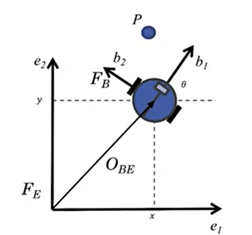

# Course 1 - W4 - MODULE 4: Vehicle Dynamic Modeling (VDM)

## Overview 

- The first task for automating an driverless vehicle is to define a model for how the vehicle moves given steering, throttle and brake commands. 
- This module progresses through a sequence of increasing fidelity physics-based models that are used to design vehicle controllers and motion planners that adhere to the limits of vehicle capabilities.

**Learning Objectives**
- Develop a kinematic bicycle model of a car with velocity and steering angle inputs
- Develop a dynamic bicycle models of a car with velocity and steering angle inputs
- Differentiate between models of tire forces
- Develop a model for actuation in a car, from pedal and steering wheel to tire forces

## Dynamic Modeling (DM)
### Lesson 1: Kinematic Modeling in 2D
Generally vehicle motion can be modeled in two ways: 
- dynamic constraint that define its motion 
- considerring all the forces and moments acting on the vehicle

**Kinematic vs Dynamic Model**
- `Kinematic Model` : At low speeds (less significant/low acceleration), it is often sufficient to look only at kinematic models of vehicles
  - Examples : Two wheeled robot, Bicycles model
- `Dynamic Model` : is more involved, but captures vehicle behavior (motion) more precisely over a wide operating range (Also more involved and developed than Kinematic Model)
  - Examples : Dynamic vehicle model

**Coordinate Frames**
- Right handed by convention
- **Inertial frame**
  - Fixed, usually relative to earth
    - ENU (Est: X; North : Y; Z: Up) relative to a reference nearby
    - Or Earth-Centered Earth fixed (ECEFG), used in GNSS systems
- **Body frame**
  - Attached to vehicle, origin at vehicle center of gravity, or center of rotation 
    - Example : the center of gravity of the vehicle or the center point of the rear axle
- **Sensor frame**
  - Attached to sensor, convenient for expressing sensor measurements 

**Why We Need Coordinate Transformation**
- In robotics applications: 
  - Coordinates are attached to the moving system also to represent elements from these frames in the inertial frame
  - To do so, we need to transform variables from one coordinate frame to the other (Body => Inertial frame)


A two wheeled robot with a single sensor has 3 frames

- Vehicle Frame has multiple sensor frame
  


**Vectors** 
- Vectors are variables with both magnitude and direction
  


- $v$ is a vector, in a 2D plane, it can be projected both in a body frame and inertial frame
- The vectors {$b1$, $b2$}, {$e1$, $e2$} define two different coordinate frames, $Fb$ and $Fe$ 

**Rotation Matrices in 2D**

frame $e$ and $b$ have the same origin, but $b$ is rotated by angle $\theta$ relative to frame $e$

```
          [cos(theta) sin(theta)]
    Ceb = [-sin(theta) cos(theta)]
```
```
          [cos(theta) -sin(theta)]
    Cbe = [sin(theta) cos(theta)]
```
where : 
- **Ceb** is thansform vectors from **b** to the frame **e** 
- **Cbe** projects the frame **e** onto **b** using the angle $\theta$

**Coordinate Transformation Application example: Two wheeled robot**



Problem : 
- Represent the position of the `point P` observed by the robot body frame $b$ w/ respect to the inertial frame $e$
- the **position** of the robot w/ respect to the inertial frame is x and y
- the **orientation** of the robot is $\theta$

Solution : 
- Conversion between Inertial frame and Body cordinates is done with a translation vector and a rotation matrix
  - Location of the point $P$ in Body Frame (B)
  
```
Pb = Ceb(Theta)Pe + Oeb
```
  - Location of the Point(P) in Inertial Frame(E) 
  
```
Pe = Cbe(Theta)Pb + Obe
```
```
where : 
  Oeb/Obe - translation of the axis
  Ceb/Cbe - the rotation of the axis
```

**Homogenous Coordinate Form**

- A 2D vector in homogeneous form

```             [X]
P = [x] => P'=  [Y]
    [y]         [1]
```
- Transforming a point from body to inertial coordinates with homogeneous coordinates

```
P'e = [Ceb(theta) | Oeb]P'b
```

**2D Kinematic Modeling**


- The Kinematic constraint is nonholonomic
  - A constraint on rate of change of degrees of freedom
  - Vehicle velocity always tangent to current path

> ## $\frac{dy}{dx} = tan \theta = \frac {sin \theta}{cos \theta}$

- Nonholonomic constraint
   
> ## $\dot{y} cos \theta - \dot{x} sin \theta$

- Velocity components
> ## $\dot{y} = vcos \theta$ 
> ## $\dot{x} = vsin \theta$

**Simple Robot Motion Kinematics**


> ## $\dot{y} = vcos \theta$ 
> ## $\dot{x} = vsin \theta$
> ## $\dot{\theta} = \omega$

```
where :
- Inputs : [v, w] , the velocity and rotation rate
- Output : [theta, x, y], theta, x and y, the orientation, position of the robot and its heading 
``` 

> **State** is a set of variables often arranged in the form of vectors that fully describe the system at the current time

**Two-Wheeled Robot Kinematic Model**
- Assume control inputs are wheel speeds : 


```
where : 
  - p : center of the robot
  - l : wheel to center
  - r : wheel radius
  - w1, w2 : wheel rotation rates
```
- Kinematic constraint 


> ## $vi = rwi$

assuming no slip btw the wheel and the surface


> ## $v = \frac{v1 + v2}{2} = \frac{rw1 + rw2}{2}$

The robot moves in a curved path about some Instantaneous Center of Rotation (ICR)
- ICR == robot kinematic model 


- Use the instantaneous center of rotation (ICR)
- Equivalent triangle give the angular rate of rotation

> ## $w = \frac{-v2}{\rho} = \frac{-(v2 -v1)}{2l} = \frac{(rw1-rw2)}{2l}$


**Kinematic Model of a Simple 2D Robot**

- **Continuous time model** : 

> ## $\dot{x} = [(\frac{rw1 + rw2}{2})cos \theta]$ 
   
> ## $\dot{y} = [(\frac{rw1 + rw2}{2})sin \theta]$

> ## $\dot{\theta} = (\frac{rw1 - rw2}{2*l})$

- **Discrete time model** : enable to convert the model from differentiel to finite difference form (FDF) for control design & simulation

> ## $x_{k+1}= x_{k} + [(\frac{rw_{1,k} + rw_{2,k}}{2})cos \theta] \Delta t$

> ##  $y_{k+1} = y_{k} + [(\frac{rw_{1,k} + rw_{2,k}}{2})sin \theta] \Delta t$

> ## $\theta_{k+1} = \theta_{k} + (\frac{rw_{1,k} - rw_{2,k}}{2*l}) \Delta t$

```
where : 
  - k :  value of the variable in the current time step
  - k + 1 : value of the variable in the next time step
```


### Supplementary Readings for Module 4

Read more about **2D plan motion and coordinate frames** in the PDF below:
 
[Chapter 2 - "Models of Mobile Robots in the Plane" B.A. Francis and M. Maggiore, Flocking and Rendezvous in Distributed Robotics, SpringerBriefs in Control, Automation and Robotics (2016)](https://edisciplinas.usp.br/pluginfile.php/5679996/mod_resource/content/5/Models-of-Mobile-Robots-in-the-Plane.pdf)


### Lesson 2: The Kinematic Bicycle Model

**Bicycle Kinematic Model** : has been used as suitable `control-oriented model` for representing vehicles.
- 2D bicycle model (simplified car model)
- Nonholonomic constraints of a car
- Front wheel steering model (similar to cars in 2D plane inertial frame (FI))


**Rear Wheel Reference Point**


- Apply Instantaneous Center of Rotation (ICR)
  
  $\displaystyle \dot{\theta} = \omega = \frac{v}{R}$

- Similar triangles
  
  $\displaystyle \tan \delta = \frac{L}{R}$
  
- Rotation rate equation

  $\displaystyle \dot{\theta} = \omega = \frac{v.tan \delta}{L}$

where : 

- $\displaystyle v$ : the velocity
- $\displaystyle R$ : the radius
- $\displaystyle \theta$ : the heading of bicycle
- $\displaystyle \delta$ : the steering angle  
- $\displaystyle \omega$  : the angular/rotation rate of the bicycle
- $\displaystyle L$ : the gap/length between the two wheels
- $\displaystyle x, y$ : the front/rear axle reference point

**Rear Axle bicycle Model**

- If the desired point is at the center of the rear axle : 


$\displaystyle \dot{x}_{r} = v cos \theta$ 
   
$\displaystyle \dot{y}_{r}  = vsin \theta$

$\displaystyle \dot{\theta} = \frac{v.tan \delta}{L}$

**Front Axle bicycle Model**

- If the desired point is at the center of the front axle : 


$\displaystyle \dot{x}_{f} = v cos(\theta + \delta)$ 
   
$\displaystyle \dot{y}_{f}  = vsin(\theta + \delta)$

$\displaystyle \dot{\theta} = \frac{v.sin \delta}{L}$

**Center of the Gravity (CG) Model**

- If the desired point is at the center of the front axle : 


---
$\displaystyle \dot{x}_{c} = v cos(\theta + \beta)$ 
   
$\displaystyle \dot{y}_{c}  = vsin(\theta + \beta)$

$\displaystyle \dot{\theta} = \frac{v.cos \beta .tan \delta}{L}$

$\displaystyle \beta = tan^-1 (\frac{v.cos \beta .tan \delta}{L})$

---

where :  

$\displaystyle \beta$ - is the side slip angle

$\displaystyle lr$ - the distance from rear wheel to the cg

**State - Space Representation**

It is 'hard' to instantaneously change the steering angle ( $\delta$ ) of the vehicle from one extreme of its range to another but it's possible with our kinematic model. If we assume we can only control the `rate of change` of the new steering angle ( $\phi$ )
- Modify CG kinematic bicycle model to use steering rate input
  - Inputs : $[v, \phi]^T$ (steering rate phi as our modified input)
  - State: $[x, y, \theta, \delta]^T$ (extended version with delta as a state)
---
$\displaystyle \dot{x}_{c} = v cos(\theta + \beta)$ 
   
$\displaystyle \dot{y}_{c}  = vsin(\theta + \beta)$

$\displaystyle \dot{\theta} = \frac{v.cos \beta .tan \delta}{L}$


$\displaystyle \dot{\delta} = \phi$

---
where : $\phi$ - is the modified Input: **rate of change** of steering angle

### Lesson 2 Supplementary Reading: The Kinematic Bicycle Model

Read more about **the Kinematic Bicycle Model (pages 15-26)** in the PDF below: 

[Chapter 2 - "Models of Mobile Robots in the Plane" B.A. Francis and M. Maggiore, Flocking and Rendezvous in Distributed Robotics, SpringerBriefs in Control, Automation and Robotics (2016)](https://edisciplinas.usp.br/pluginfile.php/5679996/mod_resource/content/5/Models-of-Mobile-Robots-in-the-Plane.pdf)

### Lesson 3: Dynamic Modeling in 2D

**Dynamic Modeling**

- Why Dynamic Modeling is important ?
  - At higher speed and slippery roads, vehicles do not satisfy no slip condition
  - Forces such as drag, road friction govern required throttle inputs
- Steps to build a typical dynamic model  : 
```
1. Coordinate frames
2. Lumped dynamic elements
3. Free Body Diagram
4. Dynamic Equations
```
**Dynamic Modeling - Translation Systems**
- Deals with forces and torques
- Roughly, need to equate all forces
- Governed by **Newton's Second Law** ( $\displaystyle \Sigma \overrightarrow{F} {i} = M\overrightarrow{a}$ )


- Example: Vehicle Shock Absorver (Suspension)
**Dynamic Modeling - Translation Systems**

**Dynamic Modeling - Rotation Systems**
- Very common in the automobile : 
  - Ex : Internal combustion engine chap, gear boxes, converters and tires etc
  


```
- Inertia, J
- Torsion force, T
- Forces resisting that torsionanl force
  - Spring force
  - Damping force
  - Inertia force
```

**Full Vehicle Modeling**

- All components, forces and moments in 3D
  - Pitch, roll, normal forces
  - Suspension, drivetrain, components models


Dynamic models of vehicles are useful for multiple applications : 
  - Improvement of state estimation methods in **sensor fusion** to track motion
  - trajectory path tracking
  - help define the limits of vehicle performance : unsafe trajectories that car cannot track

- A Full 3D vehicle modeling is very complex due to all components, forces and moments ... 
- One of the 'easiest' way is to split the model into two 2D models : 
  - steering control
  - Throttle and brake control problem

**2D Dynamics - Vehicle Longitudinal Motion**


**2D Dynamics - Vehicle Lateral Motion**


- In both model There are several forces acting in the vehicles

### Lesson 3 Supplementary Reading: Dynamic Modeling in 3D

**General Dynamics**:

- Ardema, Mark D. Newton-Euler Dynamics, Springer: Santa Clara University, Santa Clara (2005).

- [Tong,  David. Classical Dynamics University of Cambridge Course Notes (2004)](http://www.damtp.cam.ac.uk/user/tong/dynamics/clas.pdf)  

**Vehicle Modeling**:

- Rajamani, Rajesh. Vehicle dynamics and control, Springer Science & Business Media (2011).

- [Jacobson, Bengt, et al. Vehicle Dynamics, Vehicle Dynamics Group, Division of Vehicle and Autonomous Systems, Department of Applied Mechanics, Chalmers University of Technology (2016)](https://publications.lib.chalmers.se/records/fulltext/244369/244369.pdf)


### Lesson 4: Longitudinal Vehicle Modeling
### Lesson 4 Supplementary Reading: Longitudinal Vehicle Modeling
### Lesson 5: Lateral Dynamics of Bicycle Model
### Lesson 5 Supplementary Reading: Lateral Dynamics of Bicycle Model
### Lesson 6: Vehicle Actuation
### Lesson 6 Supplementary Reading: Vehicle Actuation
### Lesson 7: Tire Slip and Modeling
### Lesson 7 Supplementary Reading: Tire Slip and Modeling

## Learn from Industry Expert
### Challenges for the Industry
## Weekly assignment
- OK 
## References