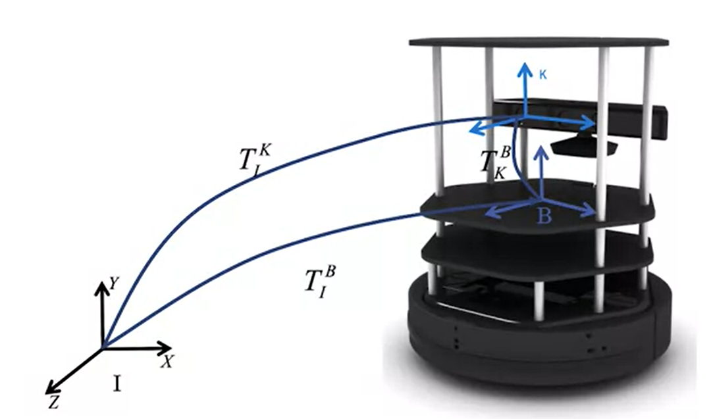

# Course 1 - W4 - MODULE 4: Vehicle Dynamic Modeling (VDM)

## Overview 

- The first task for automating an driverless vehicle is to define a model for how the vehicle moves given steering, throttle and brake commands. 
- This module progresses through a sequence of increasing fidelity physics-based models that are used to design vehicle controllers and motion planners that adhere to the limits of vehicle capabilities.

**Learning Objectives**
- Develop a kinematic bicycle model of a car with velocity and steering angle inputs
- Develop a dynamic bicycle models of a car with velocity and steering angle inputs
- Differentiate between models of tire forces
- Develop a model for actuation in a car, from pedal and steering wheel to tire forces

## Dynamic Modeling (DM)
### Lesson 1: Kinematic Modeling in 2D
Generally vehicle motion can be modeled in two ways: 
- dynamic constraint that define its motion 
- considerring all the forces and moments acting on the vehicle

**Kinematic vs Dynamic Model**
- `Kinematic Model` : At low speeds (less significant/low acceleration), it is often sufficient to look only at kinematic models of vehicles
  - Examples : Two wheeled robot, Bicycles model
- `Dynamic Model` : is more involved, but captures vehicle behavior (motion) more precisely over a wide operating range (Also more involved and developed than Kinematic Model)
  - Examples : Dynamic vehicle model

**Coordinate Frames**
- Right handed by convention
- **Inertial frame**
  - Fixed, usually relative to earth
    - ENU (Est: X; North : Y; Z: Up) relative to a reference nearby
    - Or Earth-Centered Earth fixed (ECEFG), used in GNSS systems
- **Body frame**
  - Attached to vehicle, origin at vehicle center of gravity, or center of rotation 
    - Example : the center of gravity of the vehicle or the center point of the rear axle
- **Sensor frame**
  - Attached to sensor, convenient for expressing sensor measurements 

**Why We Need Coordinate Transformation**
- In robotics applications: 
  - Coordinates are attached to the moving system also to represent elements from these frames in the inertial frame
  - To do so, we need to transform variables from one coordinate frame to the other (Body => Inertial frame)



A two wheeled robot with a single sensor has 3 frames

- Vehicle Frame has multiple sensor frame
  


**Vectors** 
- Vectors are variables with both magnitude and direction
  


- *v* is a vector, in a 2D plane, it can be projected both in a body frame and inertial frame
- The vectors {b1, b2}, {e1, e2} define two different coordinate frames, Fb and Fe 

**Rotation Matrices in 2D**

frame e and b have the same origin, but b is rotated by angle $\theta$ relative to frame e

```
          [cos(theta) sin(theta)]
    Ceb = [-sin(theta) cos(theta)]
```
```
          [cos(theta) -sin(theta)]
    Cbe = [sin(theta) cos(theta)]
```
where : 
- **Ceb** is thansform vectors from **b** to the frame **e** 
- **Cbe** projects the frame **e** onto **b** using the angle $\theta$

**Coordinate Transformation Application example: Two wheeled robot**


Problem : 
- Represent the position of the `point P` observed by the robot body frame b w/ respect to the inertial frame e
- the **position** of the robot w/ respect to the inertial frame is x and y
- the **orientation** of the robot is $\theta$

Solution : 
- Conversion between Inertial frame and Body cordinates is done with a translation vector and a rotation matrix
  - Location of the point P in Body Frame (B)
  
```
Pb = Ceb(Theta)Pe + Oeb
```
  - Location of the Point(P) in Inertial Frame(E) 
  
```
Pe = Cbe(Theta)Pb + Obe
```
```
where : 
  Oeb/Obe - translation of the axis
  Ceb/Cbe - the rotation of the axis
```

**Homogenous Coordinate Form**

- A 2D vector in homogeneous form

```             [X]
P = [x] => P'=  [Y]
    [y]         [1]
```
- Transforming a point from body to inertial coordinates with homogeneous coordinates

```
P'e = [Ceb(theta) | Oeb]P'b
```

**2D Kinematic Modeling**


- The Kinematic constraint is nonholonomic
  - A constraint on rate of change of degrees of freedom
  - Vehicle velocity always tangent to current path

> ## $\frac{dy}{dx} = tan \theta = \frac {sin \theta}{cos \theta}$

- Nonholonomic constraint
   
> ## $\dot{y} cos \theta - \dot{x} sin \theta$

- Velocity components
> ## $\dot{y} = vcos \theta$ 
> ## $\dot{x} = vsin \theta$

**Simple Robot Motion Kinematics**


> ## $\dot{y} = vcos \theta$ 
> ## $\dot{x} = vsin \theta$
> ## $\dot{\theta} = \omega$

### Supplementary Readings for Module 4

Read more about 2D plan motion and coordinate frames in the PDF below:
 
[Chapter 2 - "Models of Mobile Robots in the Plane" B.A. Francis and M. Maggiore, Flocking and Rendezvous in Distributed Robotics, SpringerBriefs in Control, Automation and Robotics (2016),](https://d3c33hcgiwev3.cloudfront.net/csKJTCDXEemj-RKX93anOA_72d8f77020d711e9ace9b31057616ac0_Models-of-Mobile-Robots-in-the-Plane.pdf?Expires=1674864000&Signature=KFVMAXxr8u3qJUTn100JMblpu3Wkgs6mWDKfiV8AhbgEHtAPmD~lk2bmUNJie1U57nWepebGd55tFTub23AxLfNj798fReusTlPpTGeRVKuoOY0J1ghjcgESGGEsMMX79zwbyr84ORxycJKML4WTMK3DAydubVFgHqALPDb1Png_&Key-Pair-Id=APKAJLTNE6QMUY6HBC5A)


### Lesson 2: The Kinematic Bicycle Model
### Lesson 2 Supplementary Reading: The Kinematic Bicycle Model
### Lesson 3: Dynamic Modeling in 2D
### Lesson 3 Supplementary Reading: Dynamic Modeling in 3D
### Lesson 4: Longitudinal Vehicle Modeling
### Lesson 4 Supplementary Reading: Longitudinal Vehicle Modeling
### Lesson 5: Lateral Dynamics of Bicycle Model
### Lesson 5 Supplementary Reading: Lateral Dynamics of Bicycle Model
### Lesson 6: Vehicle Actuation
### Lesson 6 Supplementary Reading: Vehicle Actuation
### Lesson 7: Tire Slip and Modeling
### Lesson 7 Supplementary Reading: Tire Slip and Modeling

## Learn from Industry Expert
### Challenges for the Industry
## Weekly assignment
- OK 
## References