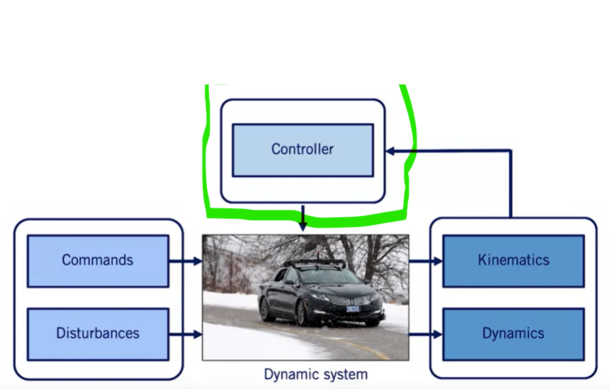

# Course 1 - W5 - MODULE 5: Vehicle Longitudinal Control

## Overview 

- Longitudinal control of an autonomous vehicle involves tracking a speed profile along a fixed path, and can be achieved with reasonable accuracy using classic control techniques. 
- This week, you will learn how to develop a baseline controller that is applicable for a significant subset of driving conditions, which include most non-evasive or highly-dynamic motions.

**Learning Objectives**
- Design a PID controller for a linear system
- Decompose a coupled nonlinear vehicle model and extract a linear decoupled longitudinal model
- Develop a feedforward controller for longitudinal vehicle control

## Proportional-Integral-Derivative (PID)
### Lesson 1: Proportional-Integral-Derivative (PID) Control

**Control Development**



- the role of the control is to regulate some of these states of the vehicle by sensing the current state variables and the generating actuator signals to satisfy the commands provided
- for the longitudinal control, the controller `sensing the vehicle speed` and `adjust the throttle and break` commands to match the desired speed set by the autonomous motion planning sytem.

**Plant System or Process**

- The Controller can be seen as mathematical algorithm that generates actuator signals so that the error signal is `minimized` and the Plant state variables approach the desired state variables. 

- System representation: 
  - The plant system could be linear or nonlinear
  - Plan representation: `state-space` form and transfer functions
  - Linear time-invariant systems can be expressed using trnasfer functions

- Transfer Function
  - A transfer function $G$ is a relation btw input $U$ and output $Y$
    - $\displaystyle Y(s) = G(s)U(s)$
  - where  : $\displaystyle s = \sigma + j\omega$
    - $s$ : complex variable in $L$aplace domain 
  - The system is defined in $L$aplace domain
  - We $L$aplace transform to go from time domain to the $S$ domain
  - it allows easier analysis of an `input-output` relation and useful to understand control performance
  - Expressed in the $L$aplace domain, as a function of $s$, a complex variable
    - $\displaystyle Y(s) = G(s)U(s)=\frac{N(s)}{D(s)}U(s)$
    - the roots of the tranfer funtion provide powerful insight into the response of a system to input functions
    - the roots of the numerator
    -  are called `zeros` of the system
    - the roots of the denominator are called `poles` of the system
  
**Controller and compensator**
- Control algorithms can vay from simple to complex

- Some simple algorithms, widely used in industry : 
  - Lead-lag controllers
  - PID controllers
- More complex algorithms
  - Nonlinear methods: Feedback linearization, Backstepping, Sliding mode
  - Optimization methods: Model predictive control(very used in self-driving cars)

Proportional-Integral-Derivative Controller (PID)
- In the time domain:
  
$$
\displaystyle u(t) =
K_{P}*e(t) + K_{I} \int_0^t \mathrm{e}(t)\, \mathrm{d}t + K_{D}*\dot{e}(t)
$$

where :
```
- e : the error function/signal
- u : the response/input signal
- Kp : the proportional gain
- Ki : the integral gain
- Kd : the derivative gain
```
- In the $L$aplace domain: 

$$
\displaystyle U(s)=
G_{C}(s)*E(s) = (K_{P} + \frac{K_{I}}{s} + K_{D}*s)E(s) = ( \frac{K_{D}*s^2 + K_{p}*s + K_{I}}{s})E(s)
$$

where :
```
- Gc : is the transfer the function 
```
- Important notes: 
  - multiplying by $S$ in $L$aplace domain is equivalent to taking a derivative in time domain
  - dividing by $S$ is equivalent to taking the integral in the time domain
  - Not all gains need to be used for the all systems, if one or more of the PID gains are set to zero the controller can referred to as $P$, $Pd$ or $Pi$

$$
\displaystyle G_{C}(s) = 
\frac{K_{D}*s^2 + K_{p}*s + K_{I}}{s}
$$

- In $G$ function, Two zeros and one pole added added
- The pole is at the origin
- The zeros can be arbitrary places on the complex plane
- PID controller design selects zero locations, by selecting $P$, $I$, and $D$ gains
- There are several algorithms to select the PID gains (e.g. Zeigler-Nichols)

**Characteristics of $P$, $I$, and $D$ gains**

|Closed Loop response|Rise Time |Overshoot|Settling Time|Steady State Error|
|---|---|---|---|---|
|Increase Kp|Decrease|Increase|Small change | Decrease|
|Increase Ki|Decrease|Increase|Increase|Eliminate|
|Increase Kd|Small change|Decrease| Decrease | Small change|

- **Closed loop response**: denotes the response of a system when the controller decides the inputs to apply to the plant model
- **Rise time** : the time it takes to reach 90% of the reference value
- **Overshoot** : the maximum percentage the output exceeds this reference
- **Settling Time** : the time to settle to within 5% of the reference 
- **Steady State Error** : error btw the output and the reference as steady-state

**Example: Second Order System**


where : 
```
- m : the mass 
- b : spring constant
- k : damping coeffient 
```

**Open-Loop Step Response**
- Let m=1, b=10, k= 20, F=1 (unit step)


- We excite the system by using a **unit step unit**
- This is the first step to evaluate the dynamic characteristics of a plant
- This system is called a `open-loop-response` since there is `no controller applied` to the system

**Closed-loop Response**
- For the unity feedback, i.e., $H(s)$ = 1, the closed loop system is given by, 
 
$
\displaystyle \frac {Y(s)}{R(s)} = 
\frac {G(s)*G_{C}(s)}{1 + G(s)*G_{C}(s)}
$


- the poles in the open loop system define the characteristics of the closed-loop response
- root-locus, Bode and Nyquist design techniques are used to select controller that meet specific output specifications


- The dashed horizontal line is the reference out (consigne), and the controllers goal is to keep the actual output close to this reference
- the simple $PI$ control is an excellent design for spring-mass damper system. 

**Step Response for PID Control**


- The all PID controllers increase flexibility in designing the step response
- By carefully `tuning` the controller gains, we can use the benefits of all three to eliminate **overshoot** and still maintain very short rise and settling times
- As can be seen in the plot, the system approaches the reference at much more quickly without any overshoot with PID control

### Lesson 1 Supplementary Reading: Proportional-Integral-Derivative (PID) Control

If you need to review Laplace transforms, check out these videos on Coursera: 

- [DifferentialEq: Laplace (Georgia Tech)](https://www.coursera.org/learn/fe-exam/lecture/3SGqB/)
- [Laplace transform. Calculation of an expectation of a counting process 1 (Higher School of Economics)](https://www.coursera.org/learn/stochasticprocesses/lecture/rfgc6/) 
- [Laplace transform. Calculation of an expectation of a counting process 2 (Higher School of Economics)](https://www.coursera.org/learn/stochasticprocesses/lecture/01OwB/) 
- [Laplace transform. Calculation of an expectation of a counting process 3 (Higher School of Economics)](https://www.coursera.org/learn/stochasticprocesses/lecture/jwk3s/)
- [Classical control: Textbook by Prof. Bruce Francis (University of Toronto), covers Laplace - Transforms, Bode Diagrams, Nyquist Plots](http://www.scg.utoronto.ca/~francis/main.pdf)

### Lesson 2: Longitudinal Speed Control with PID
### Lesson 2 Supplementary Reading: Longitudinal Speed Control with PID
### Lesson 3: Feedforward Speed Control
### Lesson 3 Supplementary Reading: Feedforward Speed Control

## Learn from Industry Experts
### Zoox's Approach to Self-Driving Cars
## Lab 
## Graded Quiz


## References
- [PID Control triangle - FR](https://raw.githubusercontent.com/afondiel/Self-Driving-Cars-Specialization-Coursera/main/Course1-Introduction-to-Self-Driving-Cars/resources/correction-des-sys-lineaire-asservis-ensea-1er-annee.png)
- [Simple Examples of PID Control by Brian Douglas](https://www.youtube.com/watch?v=XfAt6hNV8XM) 

## Appendices


