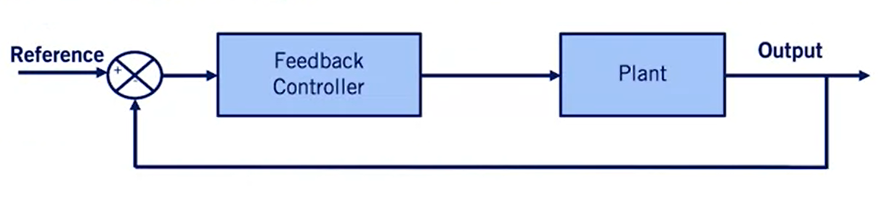

# Course 1 - W5 - MODULE 5: Vehicle Longitudinal Control

## Overview 

- Longitudinal control of an autonomous vehicle involves tracking a **speed profile** along a fixed path, and can be achieved with reasonable accuracy using **classic control techniques**. 
- This week, you will learn how to develop a baseline controller that is applicable for a significant subset of driving conditions, which include most non-evasive or highly-dynamic motions.

**Learning Objectives**
- Design a PID controller for a linear system
- Decompose a coupled nonlinear vehicle model and extract a linear decoupled longitudinal model
- Develop a feedforward controller for longitudinal vehicle control

## Proportional-Integral-Derivative (PID)
### Lesson 1: Proportional-Integral-Derivative (PID) Control

**Control Development**


- the role of the control is to **regulate** some of these states of the vehicle by sensing the current state variables and the generating actuator signals to satisfy the commands provided
- for the longitudinal control, the controller `sensing the vehicle speed` and `adjust the throttle and break` commands to match the desired speed set by the autonomous `motion planning sytem`.

**Plant System or Process**

- The Controller can be seen as mathematical algorithm that generates actuator signals so that the error signal is `minimized` and the Plant state variables approach the desired state variables. 

- System representation: 
  - The plant system could be linear or nonlinear
  - Plan representation: `state-space` form and transfer functions
  - Linear time-invariant systems can be expressed using trnasfer functions

- Transfer Function
  - A transfer function $G$ is a relation btw input $U$ and output $Y$
    - $\displaystyle Y(s) = G(s)U(s)$
  - where  : $\displaystyle s = \sigma + j\omega$
    - $s$ : complex variable in Laplace domain 
  - The system is defined in Laplace domain
  - We Laplace transform to go from time domain to the $S$ domain
  - it allows easier analysis of an `input-output` relation and useful to understand control performance
  - Expressed in the Laplace domain, as a function of $s$, a complex variable
    - $\displaystyle Y(s) = G(s)U(s)=\frac{N(s)}{D(s)}U(s)$
    - the roots of the tranfer funtion provide powerful insight into the response of a system to input functions
    - the roots of the numerator
    -  are called `zeros` of the system
    - the roots of the denominator are called `poles` of the system
  
**Controller and compensator**
- Control algorithms can vay from simple to complex

- Some simple algorithms, widely used in industry : 
  - Lead-lag controllers
  - PID controllers
- More complex algorithms
  - Nonlinear methods: Feedback linearization, Backstepping, Sliding mode
  - Optimization methods: Model predictive control(very used in self-driving cars)

Proportional-Integral-Derivative Controller (PID)
- In the time domain:
  
$$
\displaystyle u(t) =
K_{P}*e(t) + K_{I} \int_0^t e(t)dt + K_{D} * \dot{e}(t)
$$

where :
```
- e : the error function/signal
- u : the response/input signal
- Kp : the proportional gain
- Ki : the integral gain
- Kd : the derivative gain
```
- In the Laplace domain: 

$$
\displaystyle U(s)=
G_{C}(s)*E(s) = 
(K_{P} + \frac{K_{I}}{s} + K_{D}*s)E(s) = 
(\frac{K_{D}*s^2 + K_{P}*s + K_{I}}{s})E(s)
$$

where :
```
- Gc : is the transfer the function 
```
- Important notes: 
  - multiplying by $S$ in Laplace domain is equivalent to taking a derivative in time domain
  - dividing by $S$ is equivalent to taking the integral in the time domain
  - Not all gains need to be used for the all systems, if one or more of the PID gains are set to zero the controller can referred to as $P$, $Pd$ or $Pi$

$$
\displaystyle G_{C}(s) = 
\frac{K_{D}*s^2 + K_{p}*s + K_{I}}{s}
$$

- In $G$ function, Two zeros and one pole added added
- The pole is at the origin
- The zeros can be arbitrary places on the complex plane
- PID controller design selects zero locations, by selecting $P$, $I$, and $D$ gains
- There are several algorithms to select the PID gains (e.g. Zeigler-Nichols)

**Characteristics of $P$, $I$, and $D$ gains**

|Closed Loop response|Rise Time |Overshoot|Settling Time|Steady State Error|
|---|---|---|---|---|
|Increase Kp|Decrease|Increase|Small change | Decrease|
|Increase Ki|Decrease|Increase|Increase|Eliminate|
|Increase Kd|Small change|Decrease| Decrease | Small change|

- **Closed loop response**: denotes the response of a system when the controller decides the inputs to apply to the plant model
- **Rise time** : the time it takes to reach 90% of the reference value
- **Overshoot** : the maximum percentage the output exceeds this reference
- **Settling Time** : the time to settle to within 5% of the reference 
- **Steady State Error** : error btw the output and the reference as steady-state

**Example: Second Order System**


where : 
```
- m : the mass 
- b : spring constant
- k : damping coeffient 
```

**Open-Loop Step Response**
- Let m=1, b=10, k= 20, F=1 (unit step)


- We excite the system by using a **unit step unit**
- This is the first step to evaluate the dynamic characteristics of a plant
- This system is called a `open-loop-response` since there is `no controller applied` to the system

**Closed-loop Response**
- For the unity feedback, i.e., $H(s)$ = 1, the closed loop system is given by, 
 
$$
\displaystyle \frac {Y(s)}{R(s)} = 
\frac {G(s)*G_{C}(s)}{1 + G(s)*G_{C}(s)}
$$


- the poles in the open loop system define the characteristics of the closed-loop response
- root-locus, Bode and Nyquist design techniques are used to select controller that meet specific output specifications


- The dashed horizontal line is the reference out (consigne), and the controllers goal is to keep the actual output close to this reference
- the simple $PI$ control is an excellent design for spring-mass damper system. 

**Step Response for PID Control**


- The all PID controllers increase flexibility in designing the step response
- By carefully `tuning` the controller gains, we can use the benefits of all three to eliminate **overshoot** and still maintain very short rise and settling times
- As can be seen in the plot, the system approaches the reference at much more quickly without any overshoot with PID control

### Lesson 1 Supplementary Reading: Proportional-Integral-Derivative (PID) Control

If you need to review Laplace transforms, check out these videos on Coursera: 

- [DifferentialEq: Laplace (Georgia Tech)](https://www.coursera.org/learn/fe-exam/lecture/3SGqB/)
- [Laplace transform. Calculation of an expectation of a counting process 1 (Higher School of Economics)](https://www.coursera.org/learn/stochasticprocesses/lecture/rfgc6/) 
- [Laplace transform. Calculation of an expectation of a counting process 2 (Higher School of Economics)](https://www.coursera.org/learn/stochasticprocesses/lecture/01OwB/) 
- [Laplace transform. Calculation of an expectation of a counting process 3 (Higher School of Economics)](https://www.coursera.org/learn/stochasticprocesses/lecture/jwk3s/)
- [Classical control: Textbook by Prof. Bruce Francis (University of Toronto), covers Laplace - Transforms, Bode Diagrams, Nyquist Plots](http://www.scg.utoronto.ca/~francis/main.pdf)

### Lesson 2: Longitudinal Speed Control with PID


- `Perception Layer` : is captured by sensors and generates the input references for our system.
- `Reference Generation Layer` : also known as `the drive circle` generated through the motion planning process
- `Control Layer` : defines the setpoints, acceleration and deceleration to be tracked precisely. the main task that needs to  be perfomed by Bboth Longitudinal and Lateral control is to `follow th plan`as well as minimizing the error btw the actual and reference path and speed
- `Actuation Layer` : generates the input commands or actuator signals for the vehicle

**Longitudinal Speed Control**

- Cruise control : 
  


  - Speed of the vehicle is controlled (by throttling and braking, accelerating/decelerating) to be kept at the reference speed as requested by the driver
  - When the vehicle is subjected to different loads and resistances, the throttle angle will be changed by the the cruise controller accordingly 
  - Applications examples already in the market: 
    - Adaptative Cruise Control: vary the reference point based on measurements of lead vehicle and semi autonomous systems 
    - Traffic jam assist : operated throughout the vehicle speed range and create spacing gaps for merging vehicles


**High Level Controller**


- Determines the desired acceleration for the vehicle (based on the reference and actual velocity).

$$ 
\displaystyle \ddot{x}_{des} = 
K_{P}(\dot{x}_{ref} - \dot{x}) + K_{I} \int_0^t (\dot{x}_{ref} - \dot{x}) dt + K_{D}*\frac{d(\dot{x}_{ref} - \dot{x})}{dt} 
$$

where : 

- $\displaystyle  \ddot{x}_{des}$ : desired acceleration
- $\displaystyle K_{P}, K_{I}, K_{D}$ : PID gains
- $\displaystyle \dot{x}_{ref}$ : reference velocity
- $\displaystyle \dot{x}$ : vehicle velocity


**Lower Level Controller**


- Generates the throttle input is calculated such that the vehicle track the desired acceleration determined by the upper level controller
- Assumptions (to simplify the current problem) : 
  - Only throttle actuations is considered (no braking)
  - The torque converter is locked (gear 3+) => the torque from engine passes directly throught the tansmission without loss
  - The tire slip is small (gentle longitudinal maneuvers)

- The low-level controlles seeks to generate the desired acceleration from the high level controller by increasing/descreasing the torque produced by the engine.
- This is controlled by throttle angle and governed by the powertrain dynamics and the **engine map**
  - resulting in a nonlinear problem that can be a challenge for classic control methods 
- Solution : 
  - The `desired acceleration` is translated to a `torque demand` then to a `throttle angle` command. 


- Using the second order equation from [Module 4](https://github.com/afondiel/Self-Driving-Cars-Specialization-Coursera/blob/main/Course1-Introduction-to-Self-Driving-Cars/course1-w4-notes.md), we can determine the desired engine torque!

- The steady-state engine map is used to determine the throlle angle to produce the amount of torque required
- The desired torque and the current engine torque in the standard map define the required throttle position(can be interpolated if needed)
- This approach is a `data-driven approximation`

**Simulation Example**


- Controllers response


**Conlusions** : 
```
- The PID gains are tuned by trial and error so that the vehicle speed follow the reference velocity of 30m/s or 180km/h
- In the result plot on the left we have the commanded throttle
- on the right, we see how the velocity envolves overtime to reaches the reference velocity after a settling time
- because of the engine map `non-linearity` we can see some artifacts as vehicle response as it closes in on the reference speed 
```

### Lesson 2 Supplementary Reading: Longitudinal Speed Control with PID

For a deeper dive into longitudinal control, read Chapter 5 (pp. 123-150) in the textbook below:

- [R. Rajamani, "Introduction to Longitudinal Control " In: Vehicle Dynamics and Control, Mechanical Engineering Series](https://github.com/afondiel/cs-books/blob/main/automotive/self-driving-cars/vehicle-dynamics-and-control-2nd-edition-rajesh-rajamani-2012.pdf) 


### Lesson 3: Feedforward Speed Control

**Feedforward (FF) vs Feedback(FB) Control**

>Feedforward - Open Loop


- The reference signal is directly fed into the feedforward controller, which generates the input to the plant/system
- FF controllers create their plant inputs by modeling the plant process (like in [w3](course1-w3-notes.md)) by applying the appropriate input directly

>Feedback - Closed Loop



- The current output is compared to a reference signal
- And the error btw the two is fed into the feedback controller which generates the input to the plant/process

**Combined FeedForward and Feedback Control**

- Feedforward and feedback are often used together: 
  - Feedforward controller provides predicte response, non-zero offset
  - Feedback controller corrects the response, compensating for disturbances and errors in the model


**Vehicle and Speed Control**
- Throttling & Braking : 
  - The output of the feedforward and feedback control blocks are the throttling or braking signals to accelerate or decelerate the vehicle (plant) to keep the vehicle velocity close to the reference velocity
- `Note` : 
  - No low-level controller included in this block diagram, it's now replaceded by the Feedforward block

**Controller Actuators**

- Actuators (throttle angle) : 
  - The feedward controller generates the actuator signal ( $\displaystyle u_{ff}$ ) based on the predifined table and the feedback controller generates the actuator signal ( $\displaystyle u_{fb}$ ) based on the velocity error.


- convert the entire longitudinal dynamics model => fixed lookup table/ref map
- this approach works well at steady-state but ignores the internal dynamics of the vehicle powertrain and relies on also on the current vehicle state to solve some of the forces and dynamic model used 


**Feedforward Table**


**Feedfoward Simulation Results**


**Conclusions**
```
- Same simulation parameters as in the lesson 2 simulation

- The key difference between the two responses is visible as the reference speed changes. 
  
- Because the PID controller needs `errors` to exist before it can correct them, its response lags the feedforward approach, which immediately applies the relevant input reference values
  
- The feedforward tracking is still not perfect, however, as the vehicle response is ultimately 
governed by its inertia, and the feedforward approach we've presented relies on steady state - modeling of the car

-  As the feedforward model becomes more precise, the feedback components can focus purely on disturbance rejection, and speed profile tracking can be done with consistent precision.
```
### Lesson 3 Supplementary Reading: Feedforward Speed Control

To learn more about the **feedforward speed control**, read the PDF below:

[Sailan, K., Kuhnert, K.D., "Modeling and Design of Cruise Control System with Feedforward For All Terrain Vehicles", Computer Science & Information Technology (CS & IT). 2013](https://d3c33hcgiwev3.cloudfront.net/fdEeaiDvEem3Cw5hhdQCGg_7e168b3020ef11e99a25a9f602841cc7_Feedforward-speed-control.pdf?Expires=1677628800&Signature=IU2RHRcbuodv8Fli1H73a5jGv2zgSLHO5E0qj2LG3IOmt2WLmv22p3Kg~QI1Z5GZkNrDuuAmP-gLsBb4FbokwNElwHkNrkVjNBzmiScLqh7xIY351BNH0rogi-Esh7v4pp90NnFaCL4d2cqDPM-t8OfWf-5cLl0CBSWteOseRCo_&Key-Pair-Id=APKAJLTNE6QMUY6HBC5A)

## Learn from Industry Experts
### Zoox's Approach to Self-Driving Cars
- zoox founders : 
  - Tim Kentley-Klay
  - Jesse Levinson
    - initial vision : invent a different build approach for autonomous vehicles
      - building the vehicle from ground up/tackle
- Main challenge : drive in all conditions and predict unexpected actions/behavior in the environment
- zoox cars are : 
  - bi-directionals
  - social seating (face to face)
  - AWD powertrain
## Graded Quiz


## References
- [PID Control triangle - FR](https://raw.githubusercontent.com/afondiel/Self-Driving-Cars-Specialization-Coursera/main/Course1-Introduction-to-Self-Driving-Cars/resources/correction-des-sys-lineaire-asservis-ensea-1er-annee.png)
- [Simple Examples of PID Control by Brian Douglas](https://www.youtube.com/watch?v=XfAt6hNV8XM) 

## Appendices


