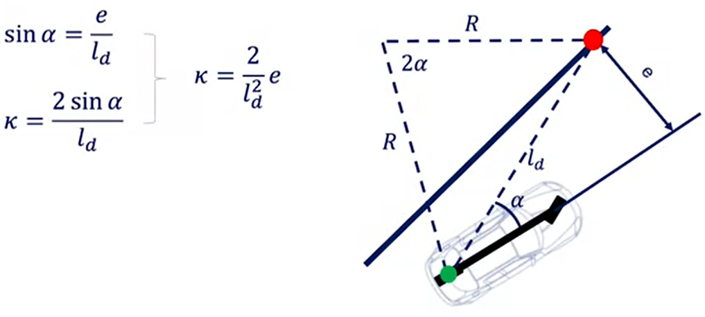
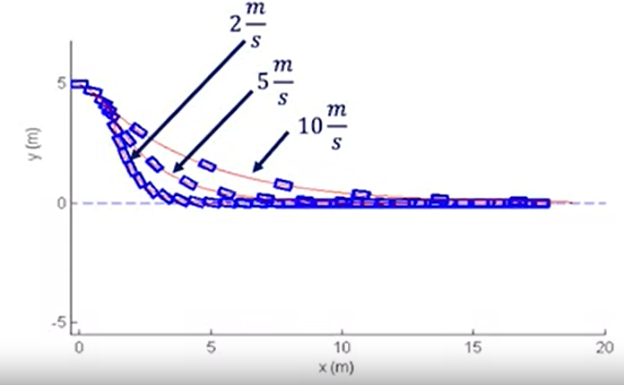

# Course 1 - W6 - MODULE 6: Vehicle Lateral Control

## Overview 

- This week, you will learn about how lateral vehicle control ensures that a fixed path through the environment is tracked accurately.
- You will see how to define geometry of the path following control problem and develop both a simple geometric control and a dynamic model predictive control approach.

**Learning Objectives**
- Define the geometry of the lateral control problem, including heading and cross track errors
- Design a geometric steering controller to track a straight line segment
- Identify the limits of geometric controllers as wheel slip increases
- Explore options for dynamic control, including model predictive control

## Lateral Control
- learning objectives : 
  - Explore lateral vehicle control definitions
  - Design two geometric path following controllers
  - Discuss model predictive control for autonomous driving
### Lesson 1: Introduction to Lateral Vehicle Control (LVC)
- Problem : 
  - ensuring the vehicle can precisely follow a predefined path, execution the motion plan devised in the higher level planning module
- Solution:
  - Lateral Vehicle Control
    - select the **steering angle** required to correct any errors that accumulates and track changes in the path direction as they appear

**Lateral Control Design**

- Lateral control for an automotive
  - Define error relative to desired path
  - Select a control law that drives errors to zero and satisfies input contraints (max lateral acceleration and min jerk)
  - Add dynamic considerations to manage forces and moments acting on vehicle

**The Reference Path**
- Track
  - Straight line segment
  
  
    
      - very compact and easy to construct
      - points are very well space in the environment allows for mostly straight line motion (Manhattan grid of roadways)
      - this path has heading discontinuities which make precise tracking a challegence with a steered vehicle
  
  - Waypoints
  
  
    
      - a refinement of the line segment approach is to provide a series of tightly spaced waypoints
      - spacing usually fixed in terms of distance or travel time
      - the relative position of the waypoints can be restrictedd to satisfy an approximate curvature constraint
      - very common, easy to work with and can be directly constructed from state estimate or GPS waypoints collected in earlier runs of a particular route
  
  - Parameterized curves

  

      - a sequence of continuous parameterized curves, 
      - drawn from a fixed set of motions primitives or can be identified through optimization during planning
      - the curves provides the benefit of continuously carying motion
      - can be constructed to have smooth derivatives to aid in consistency of error and error rate calcultations.
  
> - In all cases of path following the controller tries to eliminate the offset of the vehicle to desired path and to align the vehicle heading with the path heading
> - for each of those paths definitions the direction of travel along the path is also provided, which can be encoded with the point ordering or cureve ordering

- Main goals: 
  - Heading path alignment
  - Elimination of offset to path

**Two Types of Control Design**
- Geometric Controllers : geometry of the desired path + kinematic models of the vehicle
  - Pure pursuit (carrot following)
  - Stanley

- Dynamic Controllers
  - Model Predictive controller (MPC) control : performs a finite horizon optimization to identify the control command to apply
    - the most advanced controller
    - able to handle a wide variety of constrainsts and identify optimized solution that consider more than just the current errors
  - Other control systems
    - Sliding mode, feedback linearization
  
**Plant Model**
- Vehicle (bicycle) model & parameters
  - All states variables and inputs defined relative to the centre of front axle
   


**Driving Controller**
- Controller error terms : 
  - `Heading error`
    - Component of velocity perpendicular to trajectory divided by the ICR radius
    - Desired heading is zero (because the ref heading is not time-varying for a straight line) 


  - where : $\dot{\psi}(t)$ is the rate of heading and allows to understand how the heading error evolves overtime 

- `Crosstrack error (e)` : 
   - Distance from center of front axle to the closest point on path

- `Rate of change of crosstrack error` ( $\dot{e}$ ) : 
  - $\displaystyle \dot{e}(t) =  v_{f}(t) \sin( \psi(t) - \delta(t))$


> - Both errors must converge to `zero` for vehicle to properly tracking the desired path
> - Both errors are hard to deal with in the curved path and add some additional complexities, as it's not immediately clear where the ref point should lie


### Lesson 1 Supplementary Reading: Introduction to Lateral Vehicle Control

To learn more about the lateral control of autonomous vehicles, read the article below: 

- [J. Jiang and A. Astolfi, "Lateral Control of an Autonomous Vehicle," in IEEE Transactions on Intelligent Vehicles, vol. 3, no. 2, pp. 228-237, June 2018.](http://ieeexplore.ieee.org/stamp/stamp.jsp?tp=&arnumber=8286943&isnumber=8363076)

To compute the minimum distance to a curved path defined by a spline: 

- [Wang, H., Kearney, J., & Atkinson, K. (2002, June). Robust and efficient computation of the closest point on a spline curve. In Proceedings of the 5th International Conference on Curves and Surfaces (pp. 397-406).](http://homepage.divms.uiowa.edu/~kearney/pubs/CurvesAndSurfaces_ClosestPoint.pdf) 

### Lesson 2: Geometric Lateral Control - Pure Pursuit

**Geometric path tracking** : tracks a reference path using only the geometry of the vehicle kinematic and the reference path
- type of lateral Controller that ignores dynamics forces in the vehicle and assumes the `no slip condition` holds at the wheels.
- it relies on a kinematic bicycle model and the error measures to construct a steering command rule that achives path tracking

- One of the most popular classes of path tracking in robotics and autonomous vehicle
  - Exploits geometric relationship btw the vehicle and the path resulting in `compact control law solutions` to the path tracking problem
  - Use of reference point(in red) on path to measure error of the vehicle, can be ahead of the vehicle

- The downside of this approach is that, its performance suffers when the vehicle motion does not match the no-slip assumption like in the `agressive vehicle maneuvers` with high lateral accelarelation 
  


**Pure pursuit**
  
- Pure pursuit method consists of geometrically calculating the trajectory curvature
  - the idea is that, a reference point is placed on the path a fixed distance ahead of the vehicle and the steering commands needed to intersect with it, using a constant steering angle can be computed
  - As the vehicle turns towards the path to follow this curve, the point continue to move forward reducing the steering angle and gently bringing the vehicle towards the path

- Connect the centre of rear axle location to a target point on the path ahead of the vehicle


where : 
- $\alpha$ : is the angle btw the vehicle body heading and the look-ahead line 
  
**Pure Pursuit Formulation**
- Steering angle determined by target point location and angle btw the vehicle's heading direction and lookahead direction
  


- Using the bicycle model the steering angle is calculated as :
  


- Crosstrack error (e) is defined here as the lateral distance btw the heading vector and the target point so : 
  


- Pure pursuit is a proportional controller of the steering angle operating on a crosstrack error some look ahead distance in front of the vehicle
- The proportional gain $2/t^2_{d}$ can be tuned at different speeds (the $l_{d}$ ) being assigned as a function of the vehicle speed

- Lookahead $l_{d}$ is assigned as a linear function of vehicle speed : $l_{d} = K*\nu_{f}$


### Lesson 2 Supplementary Reading: Geometric Lateral Control - Pure Pursuit

To learn more about Pure Pursuit Control, read the PDF listed below:

- [Snider, J. M., "Automatic Steering Methods for Autonomous Automobile Path Tracking", Robotics Institute, Carnegie Mellon University, Pittsburg (February 2009)](https://www.ri.cmu.edu/pub_files/2009/2/Automatic_Steering_Methods_for_Autonomous_Automobile_Path_Tracking.pdf)


### Lesson 3: Geometric Lateral Control - Stanley


> Stanford University's Darpa Grand Challenge team

**Stanley Controller Approach** (Originally developed by Dr. Gabe Hoffman from Stanford University)
- Stanley method is the path tracking approach used by Stanford University's Darpa Grand Challenge team
>  1. Uses the center of `the front axle` as a reference point 
>  2. Look at both the error in heading and the in position relative to the closest point on the path
>  3. Define an intuitive steering law to  :
>     1. Correct heading error
>     2. Correct position error
>     3. Obey max steering angle bounds

**Heading Control Law**


Combine three requirements :
- Steer to align heading with desired heading (proportional to heading error)

$$
\delta(t) = \psi(t)
$$

- Steer to eliminate crosstrack error
  - Essentially proportional to error
  - Inversely proportional to speed
  - Limit effect for large errors with inverse tan
  - Gain $k$ determined experimentally

$$
\displaystyle \delta(t) = 
\tan-1(\frac{k_{e}(t)}{\nu_{f}(t)})
$$

- Maximum and minimum steering angles
  
$$\displaystyle 
\delta(t) \in [\delta_{min}, \delta_{max} ]
$$

- Stanley Controller scales its gains by the forward speed in the same way as pure pursuit control and has the same inverse tangent of the proportional control signal

**Combined Control Law** 

- Stanley Control Law

$$
\displaystyle \delta(t) = 
\psi(t) + \tan-1(\frac{k_{e}(t)}{\nu_{f}(t)}) 
 , \delta(t) \in [\delta_{min}, \delta_{max} ] 
$$

- For large heading error, steer in opposite direction
  - The larger the heading error, the larger the steering correction
  - Fixed at limit beyond maximum steering angle, assuming no crosstrack error


- For larger positive crosstrack error
  - 
  - $\displaystyle \tan-1(\frac{k_{e}(t)}{\nu_{f}(t)}) \approx \frac{\pi}{2} \to \delta(t) \approx \psi(t) + \frac{\pi}{2}$ 
  - As heading changes due to steering angle, the heading correction counteracts the crosstrack correction, and drives the steering angle back to zero 
  - 
   
   - The  vehicle approaches the path, crosstrack error drops, and steering command starts to correct heading alignment
   - 
  
**Error Dynamics**

- The error dynamics when not at maximum steering angle are:

$$ \displaystyle  \dot{e}(t) = 
-\nu_{f}(t)\sin(\psi(t) - \delta(t)) = -\nu_{f}(t)\sin(\tan-1(\frac{k_{e}(t)}{\nu_{f}(t)}))  = \frac{-k_{e}(t)}{\sqrt{1 + (\frac{k_{e}(t)}{\nu_{f}(t)})^2}}
$$

  For small crosstrack errors, leads to exponential decay characteristics (assuming the quadratic term is negligible)

$$
\displaystyle 
\dot{e}(t) = -k.{e}(t)
$$

  - we can say, that the cross track error evolution follows a first-order differential equation, and the solution of this ODE is an exponential
  - since $k$ is positive, we can see that the error decays exponentially to 0
  - the decay rate is completely independent of the speed
    - faster vehicles travel farther while converging to the path, at the same time as slower moving vehicles

**Case Study**

- Two scenarios : 
  - Large initial crosstrack error
  - Large initial heading error
  


**Case Study 1**
- Large initial crosstrack error
  - Crosstrack error of 5 meters
  - Max steer $\delta = 25°$ , forward speed of $\nu_{f} = 5 \frac{m}{s}$
  - Gain $k = 2.5$, lenght $L = 1 m$
  - Effect of speed variation 
    - $\nu_{f} = 2\frac{m}{s}, 5\frac{m}{s}, 10\frac{m}{s}$
  



**Simulations results:**
-  In all cases, the turn towards the path, straight line progress and the exponential decay to the path are visible
-  The higher the speed the further the car travels before reaching the path
-  But at the end, the small cross track error convergence takes the same amount of time in each case

**Case Study 2**
- Large initial heading error 
  - Max steer $\delta = 25°$ , forward speed of $\nu = 5{m}{s}$
  - Gain $k = 2.5$, lenght : $L = 1m$
- same parameters as the case 1, but the vehicle starts out on the path pointing very much in the **wrong direction**
  


**Simulations results:**
- The results show the heading error is corrected by the Stanley control law 
- First, the steering command is up against its limit as the heading error is corrected
- Then, as the cross track error starts to grow, the steering commands continue to correct the of the car beyond the alignment with the path
- Finally, the car enters the exponetial convergence segment as before
- The Stanley controller corrects arbitrarily `large errors`
  - No matter what the initial conditions, it will guide the car back to its path

**Limit of Stanley Controller**

 - In practice however, the Stanley controller is still a geometric path tracking controller, and as such `does not consider many different aspects of real self-driving car`. 
 - For example, it does not consider **noisy measurements, actuator dynamics or tire force effects**, all of which can cause undesirable ride characteristics during maneuvers. 
> - It is possible, however, to make a few adjustments to the geometric path tracking controllers that help mitigate some of these most undesirable effects

**Adjustment**

- Low speed operation (when confronted w/ noisy velocity estimates)
  - Inverse speed can cause numerical instability (velocity in the denominator)
    - wild swings in the steering wheel (not desirable for rider `comfort`)
  - Add a positive softening constant ( $k_{s}$ ) to controller (to assure that the denominator always has a minimum value)

$$
\displaystyle \delta(t) = 
\psi(t) + \tan-1(\frac{k_{e}(t)}{k_{s} + \nu_{f}(t)}) 
$$

- Higher speed - Extra damping on heading 
  - Becomes an issue at higher speed in real vehicle
  - This converts the heading error control portion to a PD controller (same approach for pure pursuit control of curvature)

- Steer into constant radius curves
  - Improves tracking on curves by adding a feedforward term on heading
### Lesson 3 Supplementary Reading: Geometric Lateral Control - Stanley

To learn more about the Stanley Control, check out the PDF listed below:

- [Snider, J. M., "Automatic Steering Methods for Autonomous Automobile Path Tracking", Robotics Institute, Carnegie Mellon University, Pittsburg (February 2009)](https://www.ri.cmu.edu/pub_files/2009/2/Automatic_Steering_Methods_for_Autonomous_Automobile_Path_Tracking.pdf)

### Lesson 4: Advanced Steering Control - MPC

**Model Predictive Control (MPC)**
  


- Model Predictive Control (MPC)
  - Numerically solving an optimization problem at each time step (can be long/time consumming)
    - originally appied to slow processes such as industrial chemical processing
    - Because of the improving performance of todays computing hardward has made MPC a viable approach even on embedded hardware
    - **(Some) Automotive applications :**    
    - way to improve performance and expand operating range for a suite of different embedded controllers
        - from traction control and stability control
        - to emission reduction, and idle speed control 
      - Longitudinal and lateral control for autonomous vehicles is another extremely suitable application for MPC
  - Receding horizon approach
    - the controller generates an actuator signal based on a fixed finite length horizon at each time-step which receives as time moves forward 

- Adavantages of MPC  (to solve online optimization) 

  

       - requires the definition of an objective function and relavant constraints 
    - well-established solvers can optimize these constraints
  - Explicitly handles constraints
    - the `states` and `control signals` can be constrained to stay within safe operating bounds and controls can be selected to maximized multiple objectives simustaneously(hard constraints and soft penalties can be employed to reinforce the solution)  
  - Applicable to linear or nonlinear models

- Disadavantages of MPC
  
  
  
  - Computationally expensive 
    -  requires more resources than `Static Control Law`

**Receding horizon Control** 

- Method that determines the best control inputs for a vehicle by solving an **optimization problem** at each time-step based on the current state and objectives.


- Receding Horizon Control Algorithm : 
>  - Pick receding horizon length ( $T$ )
>  - for each time step, $t$
>  - Set initial state to predicted state, $X_{t}$
>    - Perform optimization over finite horizon $t$ to $T$ while traveling from $X_{t-1}$ to $X_{t}$
>    - Apply first control command, $u_{t}$, from optimization at time $t$ 
  
**MPC structure**


**Linear MPC formulation**

- Linear time-invariant discrete time model (state-space) : 

$$
\displaystyle x_{t+1} = 
Ax_{t} + Bu_{t}
$$  

```
where : A, B are the coefficient matrices and are assumed to be time-invariant
```
- MPC seeks to find control policy U : 
  
$$
\displaystyle U = (u_{t|t},u_{t+1|t},u_{t+2|t}, ...)
$$  

- Objective function - `regulation` : 


$$
\displaystyle J(x(t), U) =
\sum_{j=t}^{t+T-1} (x_{j|t})^T Qx_{j|t} + (u_{j|t})^T Ru_{j|t}
$$  

- Objective function - `tracking` : 

$$
\displaystyle 
\delta x_{j|t} = x_{j|t,des} - x_{j|t} ,
$$  

$$
\displaystyle J(x(t), U) =
\sum_{j=t}^{t+T-1} \delta (x_{j|t})^TQ\delta x_{j|t} + (u_{j|t})^TRu_{j|t}
$$  

**Linear MPC SOLUTION**
- Unconstrained, finite horizon, discrete time problem formulation:
  


- Linear quadratic regulator, provides a closed form solution
  - Full state feedback: $u_{t} = -Kx_{t}$
  - Control  gain K is a matrix
  - Refer to supplemental materials

**Non-linear MPC formulation**

- Constrained (non)linear finite horizon discrete time case


- No closed form solution, must be solved numerically


**Vehicle Lateral Control**
- MPC controller example for trajectory tracking


**Model Predictive Controller**
- Cost Function - Minimize
  - Deviation from desired trajectory
  - Minimization of control command magnitude

- Constraints - Subject to : 
  - Longitudinal and lateral dynamic models
  - Tire force limits

- Can incorporate low level controller, adding constraints for : 
  - Engine map
  - Full dynamic vehicle model
  - Actuator models
  - Tire force models

**Vehicle Lateral Control**

- Vehicle trajectory (**double lane change**)
  - Scenario description : 
    - where the vehicle first accelerates to a steady-state speed of 17 m/s or 60 km/h
    - then maneuvers 4m to the left, and returns 4m to the right immediately thereafter
  
  - Plot results of the simulated maneuver with MPC control of : **Distance, Longitudinal and lateral velocity Tires forces, Yaw rate**


- The performance of MPC is excellent
- lagging slightly, but without overshoot or oscillation
- MPC is  a promising control technique for Autonomous driving
- can be used without modification for a wide range of operating conditions and a large variety of scenarios
- This flexibility and convenience comes at the **cost of increased computational requirements** and relies on the availability of robust optimization solvers to always return feasible solutions in the available time window 
  
### Lesson 4 Supplementary Reading: Advanced Steering Control - MPC
To learn more about Model Predictive Control (MPC) for vehicle control, read the ar below:

- [Falcone, P. et al., "Predictive Active Steering Control for Autonomous Vehicle Systems", IEEE (2007)](https://ieeexplore.ieee.org/document/4162483)


## References

- [Vehicle Dynamic Control by Rajesh Rajamani - Ch2 & 3](https://github.com/afondiel/cs-books/blob/main/automotive/self-driving-cars/vehicle-dynamics-and-control-2nd-edition-rajesh-rajamani-2012.pdf)
## Appendices

- [Vehicle Lateral control Stanley - Tutorial with MATLAB](https://www.mathworks.com/help/driving/ug/lateral-control-tutorial.html)

- [Automated Driving Toolbox by MathWorks](https://www.mathworks.com/help/driving/index.html)

- Three types of lateral systems in the market that address lane departure accidents: 
  - Lane departure warning systems (LDWS)
    - Ex : AutoVue LDW system by [Iteris](https://www.iteris.com/news/iteris-announces-introduction-industry-first-lane-departure-warning-data-collection-product) 
  - Lane keeping systems (LKS)
  - Yaw stability control systems
