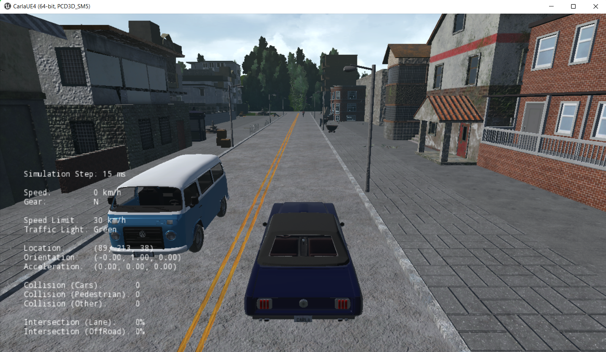

# Carla Simulator Easy Installation on Windows





## Requirements

- [Download anaconda distribution for wondows](https://www.anaconda.com/products/distribution)

- download CarlaSimulator essential files from my google drive : 
  - [](https://drive.google.com/file/d/1b2ad2KKJLMg_3XJvMWAavsX9IS56XWt7/view?usp=share_link)

- install visual studio 2019 or more recent version
  

## Installation 

- create a new environment for python3.5 or 3.6 (in my case I used python3.6)

1. add Carla path env variable

```
set Path = < your path\CarlaSimulator>
```

2. create a python 3.6 environment on conda

```py
conda create --name py36 python=3.6
```

3. activate env

```py
conda activate py36
```


4. install dependencies for client

```py
python -m pip install -r "path\requirements.txt" --user
```

## Testing Carla Simulator

Loading the Simulator with the Default Map

```
"carla-simulator-root-path\CarlaUE4.exe" -windowed -carla-no-networking
```


