# Course-2 - W1 - MODULE 0 : State Estimation and Localization for Self-Driving Cars

## Overview 
- This module introduces you to the main concepts discussed in the course and presents the layout of the course. 
- The module describes and motivates the problems of state estimation and localization for self-driving cars. 
- An accurate estimate of the vehicle state and its position on the road is required at all times to drive safely.
  
**Course Objectives :**
- Understand the problem of state estimation and its relationship to vehicle localization
- Review the types of sensors introduced througout the course
- Review the main project offered in this course


## Introduction to State Estimation and Localization for Self-driving Cars

### Welcome to the Self-Driving Cars Specialization
- Ok => [course 1 - w1](..\Course1-Introduction-to-Self-Driving-Cars/course1-w1-notes.md)  
### Welcome to the Course


- Learn about sensors for state estimation & localization
- `state estimation` is the process of determining the best value of some physical quantity from what are typically **noisy measurements**
- measurements are noisy because sensors are not perfect (random results for the same input signal)
- state estimation is fundamental to any device with `sensor`  
- Localization is one the most important types of state estimation for self-driving cars
- `Localization:` is the process of determining `where` the car is in world and `how` is moving

**Course overview**

- Understand the method of least squares for parameter and state estimation
- Apply the linear Kalman filter and its nonlinear variants, the extended and unscented Kalman filters, to state estimation problems
- Develop models for typical localization sensors like GPS receivers, inertial sensors, and LIDAR range sensors
- Learn about LIDAR scan matching and the iterate closest point (ICP) algorithm
- Use these tools to fuse data from multiple sensors streams into a single state estimate for self-driving car
- `Final Project:` A full vehicle state estimator for self-driving cars using the CARLA simulator.

### Course Prerequisites: Knowledge, Hardware & Software
- [Course Prerequisites](../Course1-Introduction-to-Self-Driving-Cars/resources/Course-Prerequisites-Knowledge-Hardware-Software.md)
### How to Use Discussion Forums
- OK
### Get to Know Your Classmates
- OK
### How to Use Supplementary Readings in This Course
- OK
## Meet the Self-Driving Car Experts

### Meet the Instructor, Jonathan Kelly 
- OK
### Meet the Instructor, Steven Waslander 
- OK 
### Meet Diana, Firmware Engineer
- Ok
### Meet Winston, Software Engineer 
- OK 
### Meet Andy, Autonomous Systems Architect 
- OK 
### Meet Paul Newman, Founder, Oxbotica & Professor at University of Oxford - OK 
- All already done [course 1 - w1](..\Course1-Introduction-to-Self-Driving-Cars/course1-w1-notes.md)
### The Importance of State Estimation
- Why is state estimation so critical for self-drving cars ? 
  - you need to know where you are
  - all you get as input is sensor data 
  - the state is an answer to where the car is, how it is moving, how fast it is turning
  - state estimation allows to process sensor data at highest level
  - state estimation is a challenging problem to solve because the sensor datas are often foul and noisy 
# Module 1: Least Squares

## Overview 

- The method of least squares, developed by Carl Friedrich Gauss in 1795, is a well known technique for estimating parameter values from data. 
- This module provides a review of least squares, for the cases of unweighted and weighted observations. 
- There is a deep connection between least squares and maximum likelihood estimators (when the observations are considered to be Gaussian random variables) and this  connection is established and explained. 
- Finally, the module develops a technique to transform the traditional 'batch' least squares estimator to a recursive form,  suitable for online, real-time estimation applications.

**Course Objectives:**

- Understand the squared error optimization criterion and its use
- Explain how least squares is employed in parameter estimation problems
- Apply the unweighted and weighted least squares methods to parameter estimation
- Apply a recursive version of least squares to update parameter estimates as new measurements arrive
- Explain how Jacobian matrices are used

### Lesson 1 (Part 1): Squared Error Criterion and the Method of Least Squares

- `Localization:` is the process of determining `where` the car is in world and `how` is moving
- `state estimation` is the process of determining the best value of some physical quantity from set of measurements, what are typically **noisy measurements**

- An accurate localization is a key component of any self-driving car sw stack and state estimation is the way of doing so.
- Any real world measurements will be imprecise
- State estimation is the idea of `parameter estimation`
  - `state:` physical quantity that changes overtime (ex: position and orientation)
  - `parameter:` is constant over time  (ex: electric resistor)

**Least Squares**

- Develped by Carl F. Gauss (1809)
- Theorem : 

```
The most probable value of the unknown quantities will be that in which the sum of squares of the differences btw the actually observed and the computed values multiplied by numbers that measure the degree of precision is minimum. 
```
**Study system : Estimating Resistance value (ohms)**


- Assumptions : 
  - Our multimeter is particular poor
  - The tester(person who does the measurement) is not particular careful
  - Also, we use a $1k \Omega$ w/ +/-5% of tolerance variation

- Measurement model : 

$$
\displaystyle y_{i} = 
x + \nu_{i}
$$

- where :
  - $y$ : measurements  
  - $i$ : the number of experiments / independent measurements
  - $x$ : actual resistance (constant value) or **parameter estimation**
  - $\nu$ : measurement noise 
  
- Experimentation scenarion : 
  - After 4 measurements 
  - We define a scalar noise term that is independent of the noise terms
  - Statistically, we say the noise is **independent and indentically distributed (IID)**
  - We define error btw each measurement and the actual value of the resistance $x$

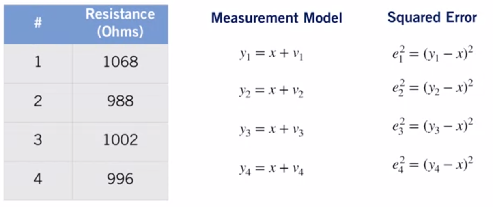

- The value of $x$ still unknown, to find $x$ we square the errors to arrive at an equation that's a `function of the measurements`
- **The square error criterion/cost or loss function** : 

$$
\displaystyle \hat{x}_{LS} = 
argmin_{x}(e_{1}^2 + e_{2}^2 +e_{3}^2 +e_{4}^2) = 
J_{LS}(x)
$$

- The `best` estimate of resistance is the one that minimize the sum of sqaured errors 

**Minimizing the Squared Error Criterion (SEC)**

- To minimize the SEC, we rewrite the errors in matrix notation 

$$
\displaystyle \hat{x}_{LS} = 
argmin_{x}(e_{1}^2 + e_{2}^2 +e_{3}^2 +e_{4}^2) = 
J_{LS}(x)
$$

- Useful when dealing with thousands/larges numbers of measurements 

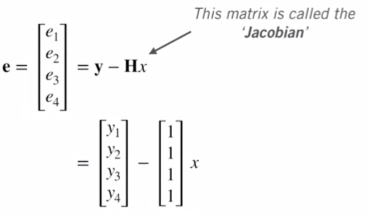

where : 
- $e$ : is the error vector
- $y$ : the measurements/function of observations
- $H$ : the Jacobian matrix 
  - $dim(H) = m*n$
    - $m$ : numbers of measurements, 
    - $n$ : nb of unkown/parameters to be estimated
- $x$ : the resistance (a single scalar but can also be a vector) 

We can now express our criterion as follows

$$
\displaystyle J_{LS}(x) =
e^Te = (y - Hx)^T(y - Hx) = y^Ty - x^TH^Ty - y^THx + x^TH^THx
$$

- To minimize this, we can compute `the partial derivative` with respect to our parameter, set to `zero`, and solve for extremum:


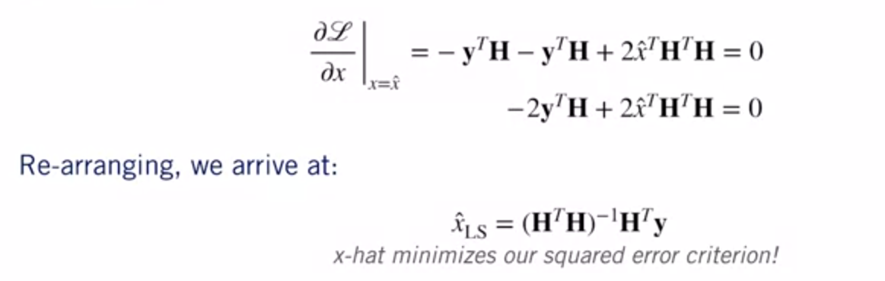

> We will only be able to solve for $\hat{x}$ if $(H^TH)^-1$ exits, i.e : $H$ has an inverse

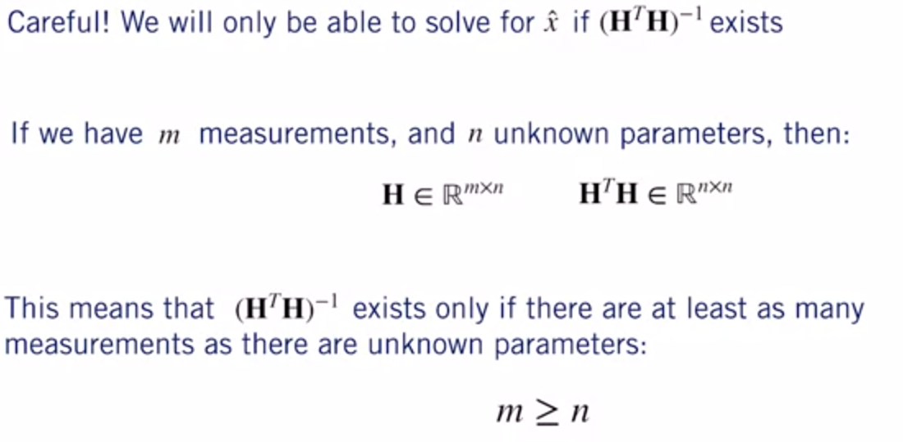

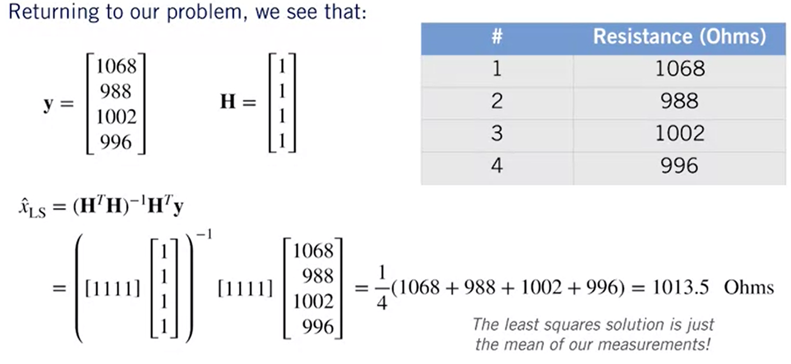

**Assumptions**

- Our measurement model, $y = x + \nu$ , is linear
- Measurements are **equally weighted** (we do not suspect that some have more noise than others)


### Lesson 1 (Part 2): Squared Error Criterion and the Method of Least Squares

**Method of Weighted Least Squares (WLS)**

- One of the reason we may want to trust certain measurements more than others is that they may come from a better sensor
- Ex: In the resistance estimation we could use a much better and expensive multi-meter in order to get a better measurement accurancy

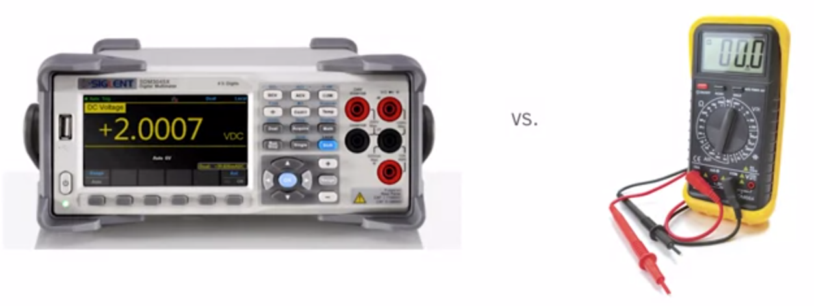

- From now on, we also drop the assumption that we're only estimate one parameter and derive the more general normal equations.
- This allows to estimate multiple parameters at one time

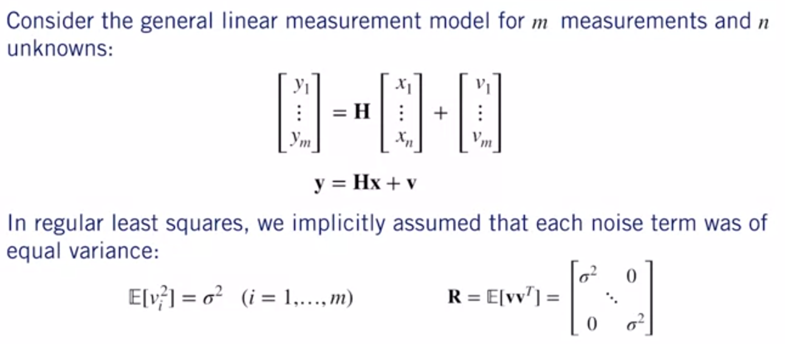

- where : 
  - $\sigma$ is the standard deviation (écart-type)
  - $R$ is the measurement **variance matrix**

If we instead assume that each noise term has a different variance : 

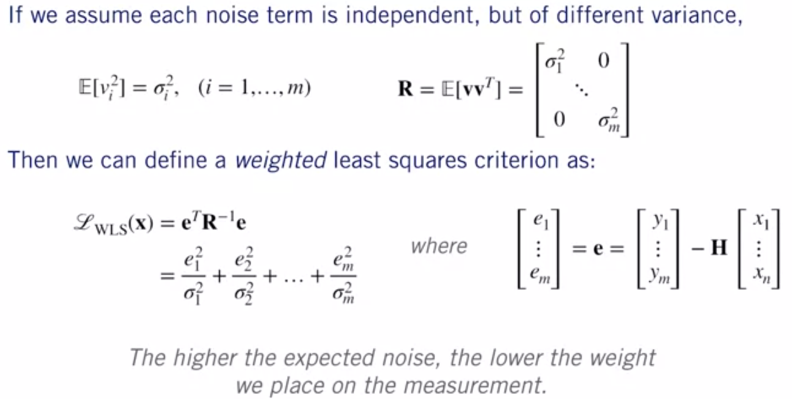

- The lower the variance of the noise, the more stronger associated error term will be weighted in the loss function

**Re-deriving Regular Least Square**

- What happen if all of our variances are the same ? 
  
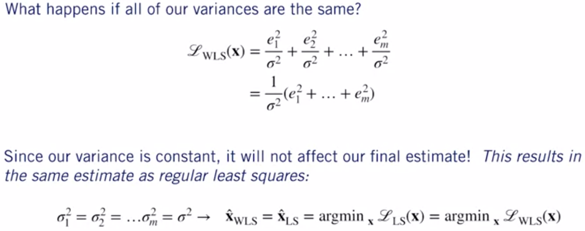

- In the case of equal variances, the same parameters that minimize our weighted least squares criterion will also minimize our ordinary least squares criterion as expected

**Minimizing the Weighted Least Square Criterion**

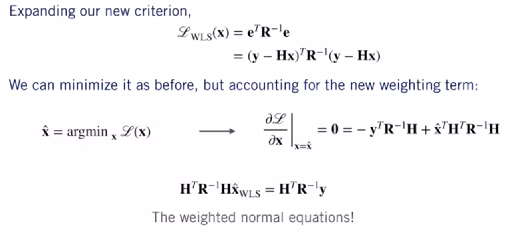

- Where the derivative is a `Gradient` 
- Solving this derivative we then solve for our best or optimal parameter vector $\hat{x}$ .

**How Method of Weighted Least Square works ?**

- From the weighted normal equations : 

$$
\displaystyle \hat{x} = 
(H^TR^-1H)^-1*H^TR^-1y
$$

Assuming that the last two measurements were actually taken with a multimeter that had a much smaller noise variance

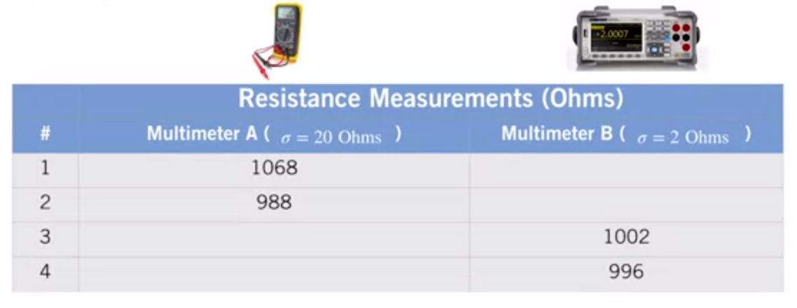

We can see (below) that the final resistance value we get is much closer to what the more accurate multimeter measured as expected

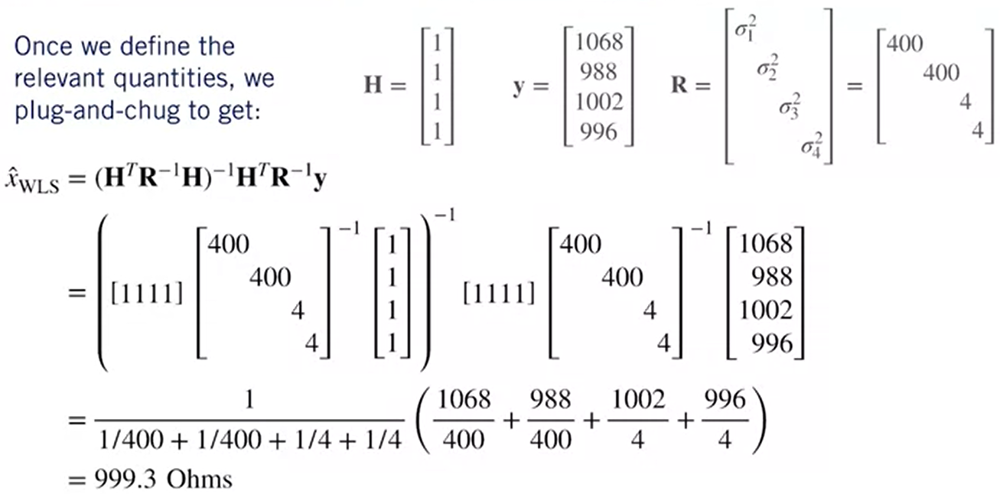

**Ordinary  vs Weighted Least Squares**

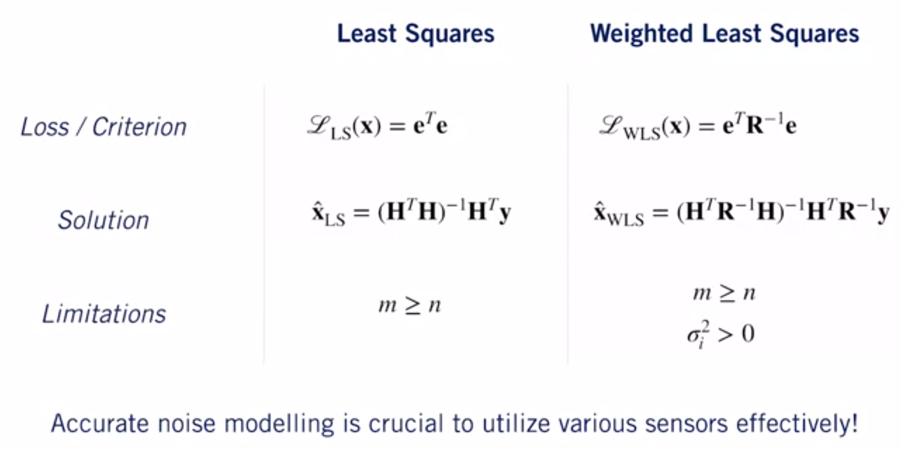


### Lesson 1 Supplementary Reading: The Squared Error Criterion and the Method of Least Squares

To learn more about the squared error criterion and least squares, check out some of the resources below: 

- [Here's an interactive least squares fitting simulator provided by the PhET Interactive Simulations project at the University of Colorado](https://phet.colorado.edu/sims/html/least-squares-regression/latest/least-squares-regression_en.html)

- [You can find an overview of the Method of Least Squares in the Georgia Tech online textbook](https://textbooks.math.gatech.edu/ila/least-squares.html)

- [Read more about least squares on Wikipedia](https://en.wikipedia.org/wiki/Least_squares)

- [Read Chapter 3, Sections 1 and 2 of Dan Simon, Optimal State Estimation (2006)](https://onlinelibrary.wiley.com/doi/book/10.1002/0470045345)

### Lesson 1: Practice Quiz
### Lesson 1 Practice Notebook: Least Squares

## Recursive Squares 
- A technique to compute least square on the "fly"

### Lesson 2: Recursive Least Squares (RLS)

**Batch Least Squares**

- Back to our resistance estimation problem(unkonwn but constant parameter from sets of measurement)
- We assumed, we had all of the data at hand (available) or a `batch of measurements` and wanted to use those measurement to compute our estimated quantities of interest (more reasonable approach)

`Batch solution` : 

$$
\displaystyle \hat{x} = 
(H^TR^-1H)^-1*H^TR^-1y
$$

- where : $R$ is the measurement **variance matrix**

**Recursive Estimation**

- What happens if we have a *stream* of data? Do we need to re-solve for our solution every time? Can we do something smarter?
- For ex: we have a multimeter that can measure a resistance 10 times per second

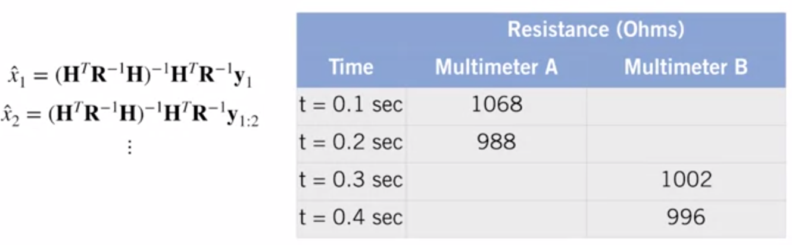

- Ideally, we would like to use as many measurements as possible to get an accurate estimate of the resistance 
- The computational resources required to solve our normal equation will increase with the size of the measurement vector when using the **least squares method**
- alternatevely, we can use the **recursive method** one that keep a running estimate of the optimal parameter for all the measurements that we collected up to the previous time step and update that estimate given the measurement at the current time step

**Linear Recursive Estimator**

- We can use a linear recursive estimator
- Suppose we have an optimal estimate, $\hat{x}_{k-1}$, of our unkown parameters at time $k - 1$
- Then we obtain a new measurement at time $k: y_{k} = H_{k}x + v_{k}$ model with additive Gaussian noise

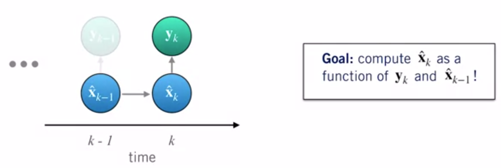

- We can use a linear recursive update: 

$$
\displaystyle \hat{x}_{k} =
\hat{x}_{k-1} + K_{k}(y_{k} - H_{k}\hat{x}_{k-1}) 
$$

- where, $K$ is the estimator `gain matrix`
- the term in the () is called the `innovation`: it quantifies how well our current measurement matches our previous best estimate
- We update our new state as a linear combination of the previous best guess and the current measurement residual(or error), weighted by a gain matrix $K_{k}$
- If $(y_{k} - H_{k}\hat{X}_{k-1}) == 0$ the old estimate does not change at all.

**Recursive Leat Squares Criterion**

- But what is the gain matrix $K_{k}$ ?
- We can compute it by minimizing a similar least squares criterion, but this time we'll use a `probabilistic formulation`
- We wish to minimize the **expected value of the sum of squared errors** of our current estimate at time step $k$

$$
\displaystyle J_{RLS} = 
E[(x_{k} - \hat{x}_{k} )^2] = \sigma_{k}^2 
$$

- If we have $n$ unknown parameters at time step $k$, we generalize this to :  

$$
\displaystyle J_{RLS} = 
E[(x_{1k} - \hat{x}_{1k})^2 + ... + (x_{nk} - \hat{x}_{nk})^2] = Trace(P_{k}) 
$$

- where : $P_{k}$ is the estimator covariance
- Same as least squares, but now introduce the `expectation`
- Instead of minimizing the error directly, we minimized its `expected value` == estimator variance
- The lower the variance, the more the estimate is accurate


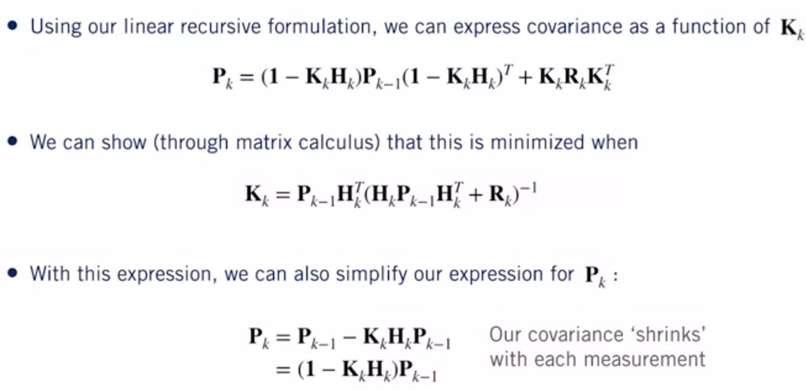

-  `first eq`: recursive definition for the state covariance matrix $P_{k}$ by using matrix calculs and taking derivatives
-  `second eq`: This criterion is minimized based on value of $K_{k}$
-  `third eq`: the larger our gain matrix $K$,  the smaller the estimator covariance will be.  

> The gain matrix can be seen as balancing the information we get from our `prior estimate` and the information received from our `new measurement`


**Recursive Least squares Algorithm**

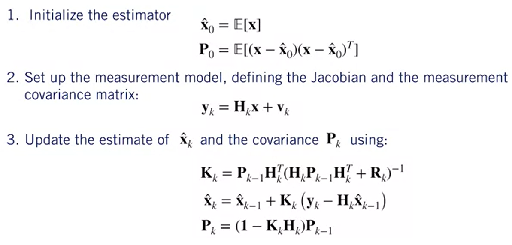

- We initialises the algorithm w/ Estimate of the unknown parameters and its covariance matrix 
  - initial guess can come from the first measurement
  - the covariance could come from technical specification

Why a Recursive Least squares Algorithm important?
- It enables us to minimize computational effort in our estimation process which is always a good thing 
- Recursive least squares forms the `update step` of the `linear Kalman filter`.  

**Summary**
- RLS produces a `running estimate` of parameters(s) for a stream of measurements (without having the entier batch of measurements at hand)
- RLS is a linear recursive estimator that minimizes the (co)variance of the parameters at the current time

### Lesson 2 Practice Notebook: Recursive Least Squares
### Lesson 2 Supplementary Reading: Recursive Least Squares

To learn more about Recursive Least Squares, check out the resources below:

- [Read the article about recursive least squares on Wikipedia](https://en.wikipedia.org/wiki/Recursive_least_squares_filter)

- [Read Chapter 3, Section 3 of Dan Simon, Optimal State Estimation (2006)](https://onlinelibrary.wiley.com/doi/book/10.1002/0470045345)


### Lesson 3: Least Squares and the Method of Maximum Likelihood

**Revisiting the Least Squares Criterion**
- Finds the best estimates of the unknown but constant parameters by determining the values that minimize the sum of the sqaures errors based on the measurements
   
- Recall the least squares criterion :   

$$
\displaystyle J_{LS} = 
(y_{1} - x)^2 + (y_{2} - x)^2 +...+ (y_{m} - x)^2
$$

- We've said that optimal estimate, $\hat{x}$, is the one that minimizes this `loss` : 

$$
\displaystyle \hat{x}_{LS} = 
argmin J_{LS}(x) = argmin(e_{1}^2 + e_{2}^2 + ... + e_{m}^2)
$$

- Why squared errors ?

1. Squared errors allow us to solve for the optimal parameters with relatively straightforward algebra. If the measurement model is **linear**, minimizing the squared error criterion amounts to solving a linear system of equations. 
2. It has to do with **probability** and a deep connection between `least squares` and `maximum likelihood estimators` under the assumption of Gaussian noise

**The Method of Maximum Likelihood**
- We can ask which $x$ makes our measurement most likely, Or, in other words, which $x$ maximizes the conditional probability of $y$ : 
- assumption : we keep a single scalar parametes for explanation
$$
\displaystyle \hat{x} = 
argmax p(y | x)
$$

- Which $x$ is the most likely given the measurement?

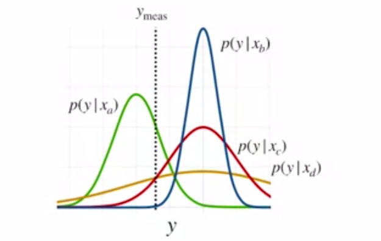

- $x_{a}$, because `The green` has the maximum probability density

**Measurement Model**
- Recall our simple measurement model : 

$$
\displaystyle y = 
x + \nu
$$

- We can convert this into a conditiona probability on our measurement, by assuming some probability density for $\nu$, for ex, if 

$$
\nu \sim N(0, \sigma^2)
$$ 

- Then : 

$$
p(y|x) = N(x, \sigma^2)
$$

when the parameter $x$ becomes the minimum of the density ( $y = x$ ), the variance is simply our noise variance

**Least Squares and Maximum Likelihood**

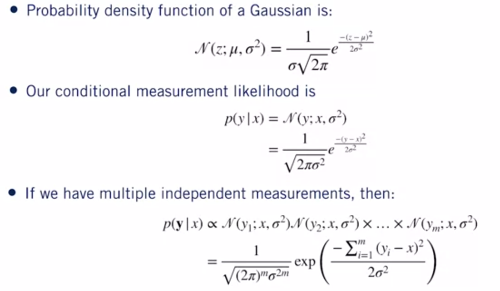

- The maximal likelihood estimate (MLE) is given by

$$
\displaystyle \hat{x}_{MLE} = 
argmax p(y | x)
$$

- Instead of trying to optimize the likelihood directly, we can take its logarithm: 

$$
\displaystyle \hat{x}_{MLE} = 
argmax (p(y | x)) = 
argmax (log (p(y | x))) 
$$

- The logarithm is monotonically increasing
- Resulting in : 

$$
\displaystyle log (p(y | x)) = - \frac{1}{2R}((y_{1} - x)^2 +...+ (y_{m} - x)^2) + C 
$$

where the constant $C$ refers to terms that are not function of $x$

- Last step : 

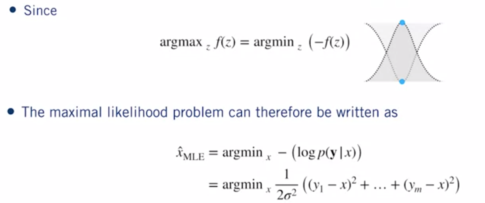

- So : 

$$
\displaystyle \hat{x}_{MLE}= 
argmin_{x}\frac{1}{2\sigma}((y_{1} - x)^2 +...+ (y_{m} - x)^2) 
$$

- Finally, if we assume each measurement has different variance, wa can derive : 

$$
\displaystyle \hat{x}_{MLE} = 
argmin_{x}\frac{1}{2}(\frac{(y_{1} - x)^2}{\sigma_{1}^2} +...+ \frac{(y_{m} - x)^2}{\sigma_{m}^2})
$$


$$
\displaystyle \hat{x}_{MLE} =
\hat{x}_{LS} = 
argmin_{x} J_{LS}(x) = argmax J_{MLE}(x)
$$

- The maximum likelihood estimate given additive `Gaussian noise` is equivalent to the least square or the Weighted least squares solutions we derived ealier


**The Central Limit Theorem**

- Why this is so important ? 
  - The Self-driving car will have to deal w/ many different sources of errors, very difficult model

```
Centreal Limit Theorem: when independent random variables are added, their normalized sum tends towards a normal distribution 
```
- Why use the method of least squares ? 
1. Centreal Limit Theorem: sum of different errors will tend be `Gaussian-ish`
2. Least squares is equivalent to maximum likelihood under Gaussian noise 

**Least Squares - Some Caveats**

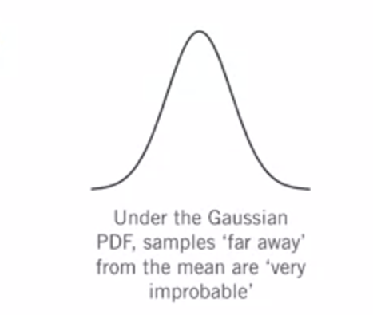

- `Poor` measurements(e.g. outliers) have a significant effect on the method of LS.
- It's important to check that the measurements roughly follow a ;`Gaussian distribution` 

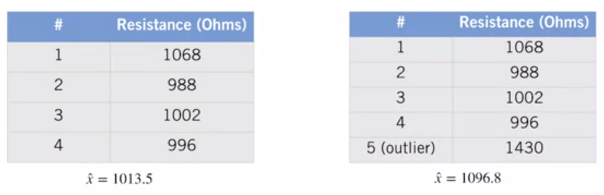


### Lesson 2: Practice Quiz
### Lesson 3 Supplementary Reading: Least Squares and the Method of Maximum Likelihood

To learn more about Least Squares and Maximum Likelihood, check out the resources below:

- Explore this [interactive explanation](http://mfviz.com/central-limit/) of the Central Limit Theorem by Michael Freeman. 

- Read more about maximum likelihood on the [STAT 414/415](https://newonlinecourses.science.psu.edu/stat414/node/191/) website from Penn State - not available

- [The Epic Story of Maximum Likelihood - Stephen M. Stigler - 2008](https://arxiv.org/pdf/0804.2996.pdf) 

### Module 1: Graded Quiz


# References

[Least square for estimate theta - line 3321](https://github.com/afondiel/research-notes/blob/master/datascience-notes/courses/certificates/coursera/ibm/ds-ibm-notes.txt)

# Appendices

**Wikipedia resources :**

- [Statistics](https://en.wikipedia.org/wiki/Statistics)
  - [Descriptive statistics](https://en.wikipedia.org/wiki/Descriptive_statistics)
  - [Statistical inference](https://en.wikipedia.org/wiki/Statistical_inference)
- [Probability theory](https://en.wikipedia.org/wiki/Probability_theory)
- [Linear Regression](https://en.wikipedia.org/wiki/Linear_regression)
- [Estimator](https://en.wikipedia.org/wiki/Estimator)
- [Least_squares](https://en.wikipedia.org/wiki/Least_squares)
- [Gradient descent](https://en.wikipedia.org/wiki/Gradient_descent)
- [Gaussian filter](https://en.wikipedia.org/wiki/Gaussian_filter)
- [Filtre de Kalman](https://fr.wikipedia.org/wiki/Filtre_de_Kalman)
- [Finite Impulse Response (FIR)](https://en.wikipedia.org/wiki/Finite_impulse_response)
- [Infinite Impulse Response (IIR)](https://en.wikipedia.org/wiki/Infinite_impulse_response)
- [Convolution](https://en.wikipedia.org/wiki/Convolution)
  