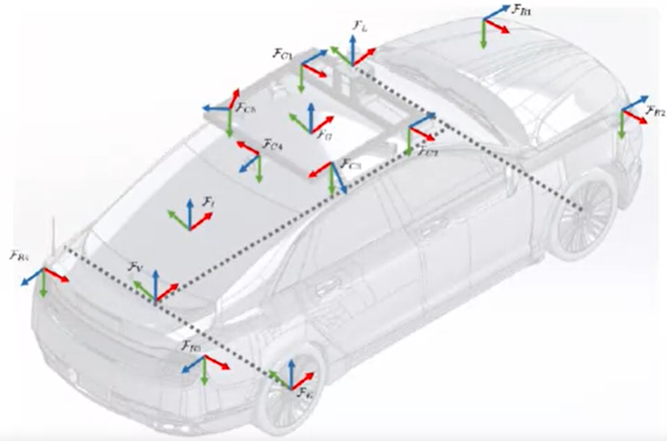

# Course-2 - W1 - MODULE 0 : State Estimation and Localization for Self-Driving Cars

## Overview 
- This module introduces you to the main concepts discussed in the course and presents the layout of the course. 
- The module describes and motivates the problems of state estimation and localization for self-driving cars. 
- An accurate estimate of the vehicle state and its position on the road is required at all times to drive safely.
  
**Course Objectives :**
- Understand the problem of state estimation and its relationship to vehicle localization
- Review the types of sensors introduced througout the course
- Review the main project offered in this course

## Introduction to State Estimation and Localization for Self-driving Cars

### Welcome to the Self-Driving Cars Specialization
- Ok => [course 1 - w1](..\Course1-Introduction-to-Self-Driving-Cars/course1-w1-notes.md)  
### Welcome to the Course

- Learn about sensors for state estimation & localization
- `state estimation` is the process of determining the best value of some physical quantity from what are typically **noisy measurements**
- measurements are noisy because sensors are not perfect (random results for the same input signal)
- state estimation is fundamental to any device with sensor  
- Localization is one the most important types of state estimation for self-driving cars
- `Localization:` is the process of determining `where` the car is in world and `how` is moving

**Course overview**

- Understand the method of least squares for parameter and state estimation
- Apply the linear Kalman filter and its nonlinear variants, the extended and unscented Kalman filters, to state estimation problems
- Develop models for typical localization sensors like GPS receivers, inertial sensors, and LIDAR range sensors
- Learn about LIDAR scan matching and the iterate closest point (ICP) algorithm
- Use these tools to fuse data from multiple sensors streams into a single state estimate for self-driving car
- `Final Project:` A full vehicle state estimator for self-driving cars using the CARLA simulator.

### Course Prerequisites: Knowledge, Hardware & Software
- [Course Prerequisites](../Course1-Introduction-to-Self-Driving-Cars/resources/Course-Prerequisites-Knowledge-Hardware-Software.md)
### How to Use Discussion Forums
- OK
### Get to Know Your Classmates
- OK
### How to Use Supplementary Readings in This Course
- OK
## Meet the Self-Driving Car Experts

### Meet the Instructor, Jonathan Kelly 
- OK
### Meet the Instructor, Steven Waslander 
- OK 
### Meet Diana, Firmware Engineer
- Ok
### Meet Winston, Software Engineer 
- OK 
### Meet Andy, Autonomous Systems Architect 
- OK 
### Meet Paul Newman, Founder, Oxbotica & Professor at University of Oxford - OK 
- All already done [course 1 - w1](..\Course1-Introduction-to-Self-Driving-Cars/course1-w1-notes.md)
### The Importance of State Estimation
- Why is state estimation so critical for self-drving cars ? 
  - you need to know where you are
  - all you get as input is sensor data 
  - the state is an answer to where the car is, how it is moving, how fast it is turning
  - state estimation allows to process sensor data at highest level
  - state estimation is a challenging problem to solve because the sensor datas are often foul and noisy 
# Module 1: Least Squares

## Overview 

- The method of least squares, developed by Carl Friedrich Gauss in 1795, is a well known technique for estimating parameter values from data. 
- This module provides a review of least squares, for the cases of unweighted and weighted observations. 
- There is a deep connection between least squares and maximum likelihood estimators (when the observations are considered to be Gaussian random variables) and this  connection is established and explained. Finally, the module develops a technique to transform the traditional 'batch' least squares estimator to a recursive form,  suitable for online, real-time estimation applications.

**Course Objectives:**

- Understand the squared error optimization criterion and its use
- Explain how least squares is employed in parameter estimation problems
- Apply the unweighted and weighted least squares methods to parameter estimation
- Apply a recursive version of least squares to update parameter estimates as new measurements arrive
- Explain how Jacobian matrices are used

### Lesson 1 (Part 1): Squared Error Criterion and the Method of Least Squares
### Lesson 1 (Part 2): Squared Error Criterion and the Method of Least Squares
### Lesson 1 Supplementary Reading: The Squared Error Criterion and the Method of Least Squares
### Lesson 1: Practice Quiz
### Practice Quiz•6 questions
### Lesson 1 Practice Notebook: Least Squares

## Recursive Squares 

### Lesson 2: Recursive Least Squares
### Lesson 2 Practice Notebook: Recursive Least Squares
### Lesson 2 Supplementary Reading: Recursive Least Squares
### Lesson 3: Least Squares and the Method of Maximum Likelihood
### Lesson 2: Practice Quiz
### Lesson 3 Supplementary Reading: Least Squares and the Method of Maximum Likelihood
### Module 1: Graded Quiz

# References

# Appendices