# Course-2 - W2 - MODULE 2 : State Estimation - Linear and Nonlinear Kalman Filters

## Overview 
- Any engineer working on autonomous vehicles must understand the Kalman filter, first described in a paper by Rudolf Kalman in 1960. 
- The filter has been recognized as one of the top 10 algorithms of the 20th century, is implemented in software that runs on your smartphone and on modern jet aircraft, and was crucial to enabling the Apollo spacecraft to reach the moon. 
- This module derives the Kalman filter equations from a least squares perspective, for linear systems. The module also examines why the Kalman filter is the best linear unbiased estimator (that is, it is optimal in the linear case). 
- The Kalman filter, as originally published, is a linear algorithm; however, all systems in practice are nonlinear to some degree. Shortly after the Kalman filter was developed, it was extended to nonlinear systems, resulting in an algorithm now called the ‘extended’ Kalman filter, or EKF. 
- The EKF is the ‘bread and butter’ of state estimators, and should be in every engineer’s toolbox. 
- This module explains how the EKF operates (i.e., through linearization) and discusses its relationship to the original Kalman filter. 
- The module also provides an overview of the unscented Kalman filter, or UKF, a more recently developed and very popular member of the Kalman filter family.


**Course Objectives :**
- Describe the relationship between least squares and the linear Kalman filter
- Explain the (in)sensitivity of the Kalman filter to new data and the need for process noise
- Describe how the linear Kalman filter can be extended to nonlinear systems via linearization
- Describe how the EKF uses first-order linearization to turn a nonlinear problem into a linear one
- Contrast the linearization approach of the EKF with that of the UKF, and explain why the UKF is superior for many problems
- Assess the performance of the extended Kalman filter and its variants


## The Linear Kalman Filter

- The Kalman filter remains an important tool to fuse measurements from **several sensors** to **estimate in real-time the state** of a robotic system such as a self-driving car

### Lesson 1: The (Linear) Kalman Filter

- The Kalman filter algorithm was published in `1960` by Rudolf E. Kalman
- Adopted by [NASA](https://www.nasa.gov/) earlier after its publication for the Apollo Guidance Computer to sent Man into space

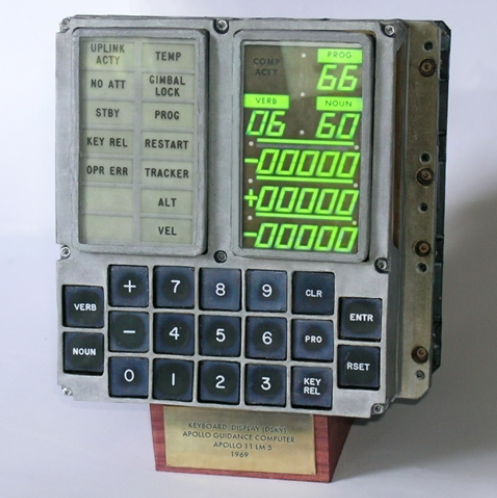

- The filter helped guided spacecraft accurately throught its **circumlunar orbit**

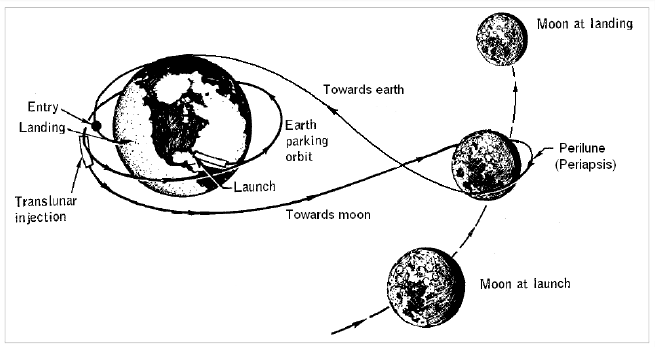

- The (extended) Kalman Filter became widely known after its use in the
Apollo Guidance Computer for circumlunar navigation.

**Prediction and Correction**
- Very similar to the linear Recursive Least Squares (RLS) Filter 
- While RLS updates the estimate of a static parameter, 
- `KF updates and estimates of an evolving state` 
- The `Goal` of KF: take a probabilistic estimate of this state and update it in real time using two steps : 
- 1. **Prediction**
- 2. **Correction**

Study Case : problem of estimating the 1D position of the vehicle

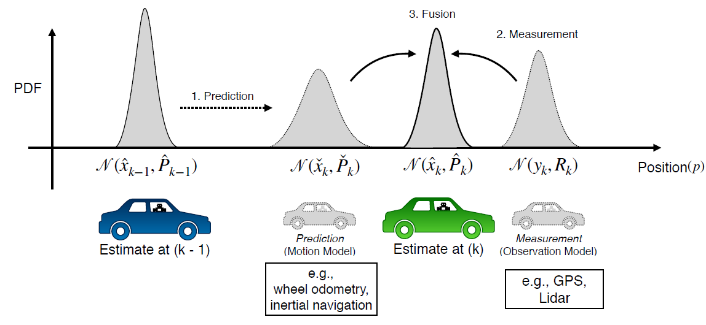

- This can be broken down into 3 steps : 
1. Initial probabilistic Estimate at time $k-1$
2. Use **Motion Model** (which can be derived from Wheel odometry or Inertial sensor measurement)to predict our new state
3. Use **Obesrvation Model** (derived from GPS, LIDAR) to correct that prediction at time $k$ to find the final state
- Notice : All the states (initial, predicted and final) are all random variables specify by their means and covariances

``` 
- KF can seen as a technique/tool to fuse informations from several sensors to produce a final estimate the unkown state in real-time, taking into account uncertainty in motion and in our measurements
```

**Linear Dynamical System**

- The Kalman Filter requires the following motion and measurement models:

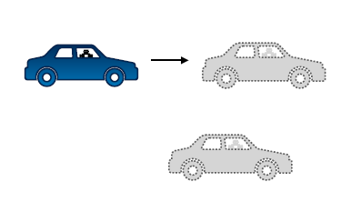

**Motion model** : linear combination btw the estimate at time step $k-1$, control input and zero-mean noise

$$
\displaystyle x_{k} = 
F_{k−1}x_{k−1} + G_{k−1}u{k−1} + w{k−1}
$$

where :
- $F_{k−1}, G_{k−1}$ , the gain ?  
- $u_{k−1}$, is the input signal/control input (can be a wheel torque applied to speed up & change lanes )
- $w_{k−1}$, is zero-mean noise

**Measurement model**: 

$$
\displaystyle y{k} = 
H_{k}x{k} + v_{k}
$$

where :

- $v_{k}$, is the measurement noise
  
**With the following noise properties:**
  
- Measurement Noise : 

$$
vk ∼ 𝒩(0,R_{k})
$$

- Process or Motion Noise : govern how certain we are that our linear dynamical system is actually correct/ how uncertain we are about the effects of our control inputs

$$
w{k} ∼ 𝒩(0,Q_{k})
$$

**Recursive Least Squares + Process Model**

- The Kalman filter is a recursive least squares estimator that also includes a motion model

- `1.` Prediction

$$
\displaystyle \check{x}_{k} = 
F_{k−1}x_{k−1} + G_{k−1}u_{k−1}
$$

,

$$
\displaystyle \check{P}_{k} = 
F_{k−1} \check{P}_{k−1}F_{k−1}^T + Q_{k−1}
$$

- `2a.` Optimal Gain


$$
\displaystyle K_{k} = 
\check{P}_{k}H_{k}^T(H_{k} \check{P}_{k}H_{k}^T + R_{k})^−1
$$

- `2b.` Correction

$$
\displaystyle \hat{x}_{k} = 
\check{x}_{k} + K_{k}(y_{k} − H_{k}\check{x}_{k})
$$

,

$$
\displaystyle \hat{P}_{k} = 
(1 − K_{k}H_{k})\check{P}_{k}
$$

where : 
- $(y_{k} − H_{k}\check{x}_{k})$, is often called the `innovation`
- $\check{x}_{k}$, Prediction (given motion model) at time $k$
- $\hat{x}_{k}$, Corrected prediction (given measurement) at time $k$

**Process Recap : Prediction & Correction**

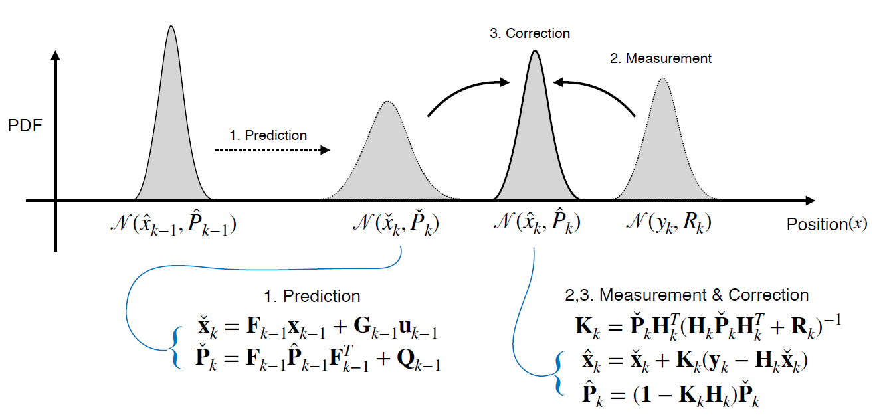

**Short example**

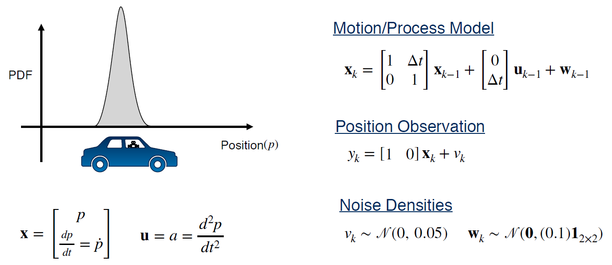

Where : 
- PDF : Probability Density Function 
- $a$ : is a constant acceleration from dynamic controller
- we assume, the vehicle position is measured by a GPS 


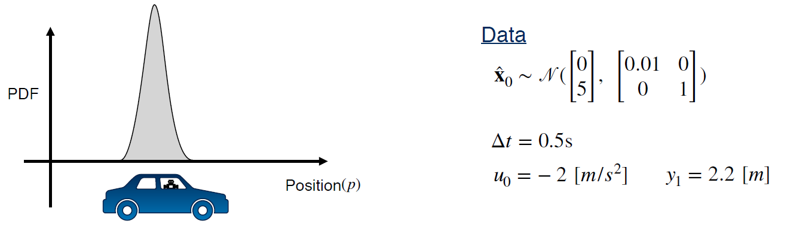

What's our corrected position estimate after we perform one prediction step and one correction step using KF? 

**Solution:**

- Prediction 

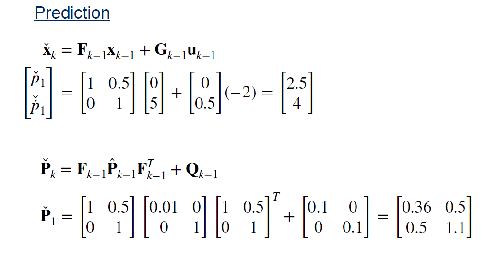

- Correction 

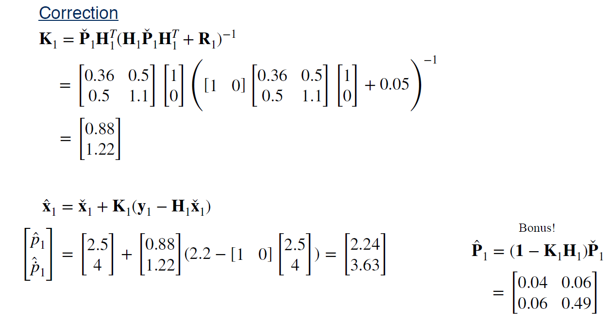

Result analysis : 
- The final corrected state **covariance is smaller**
- More certain about the car's position after we incorporate the position measurement
- Measurement noise variance is quite small


**Summary | The Kalman Filter**

- The Kalman Filter is very similar to RLS but includes a motion model that tells
us how the state evolves over time
- The Kalman Filter updates a state estimate through two stages:
  1. prediction using the **motion model**
  2. correction using the **measurement model**
### Lesson 1 Supplementary Reading: The Linear Kalman Filter

To learn more about the Linear Kalman Filter, check out the resources below: 

- Here's an interesting [blog post by Tim Babb explaining the Kalman filter](https://www.bzarg.com/p/how-a-kalman-filter-works-in-pictures/).  Babb is the Lighting Optimization Lead for Pixar Animation Studios.

- You can find an extensive, detailed treatment of the Kalman filter in Chapter 3, Section 3 of [Timothy D. Barfoot, State Estimation for Robotics (2017)](http://asrl.utias.utoronto.ca/~tdb/bib/barfoot_ser17.pdf) (available for free).

- Read another detailed explanation in Chapter 5, Section 1 of [Dan Simon, Optimal State Estimation (2006)](http://asrl.utias.utoronto.ca/~tdb/bib/barfoot_ser17.pdf).

- Explore a variety of great resources related to the Kalman filter on [this page](https://www.cs.unc.edu/~welch/kalman/) maintained by Greg Welch from the University of Central Florida and Gary Bishop from the University of North Carolina at Chapel Hill.

- Read Kalman's [original article](https://www.cs.unc.edu/~welch/kalman/kalmanPaper.html) on the linear filter, courtesy of Welch and Bishop and hosted at UNC at Chapel Hill (available for free).

### Lesson 2: Kalman Filter and The Bias BLUEs

**Bias in State Estimation**

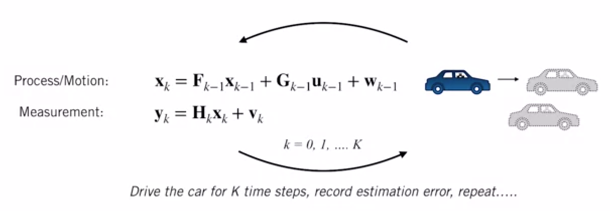

- We say an estimator or filter is unbiased if it produces an `average` error of zero at a particular time step $k$, over many trials.
- Graphically : 

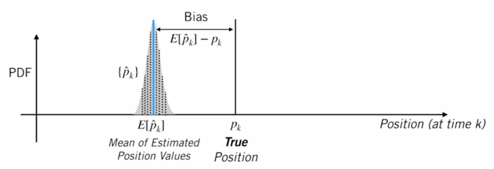
 
- We build a histogram of the positions that our filter reports over multiple trials
- We compute the difference btw the avg of these estimates and the true position.
- If the difference doesnot approach zero, the estimate is `biased`
- Otherwise, the filter is `unbiased`

$$
\displaystyle E[\hat{e}_{k}] = 
E[\hat{p}_{k} - p_{k}] = E[\hat{p}_{k}] - p_{k} = 0
$$

How can we compute this analytically for the Kalman filter?
- consider the error dynamics : 
  - Predicted state error : $\displaystyle \check{e}_{k} = \check{x}_{k} + x_{k}$
  - Corrected estimate error : $\displaystyle \hat{e}_{k} = \hat{x}_{k} + x_{k}$   
- Using the KF equations, we can derive : 

- PE : 

$$\displaystyle \check{e}_{k} = 
F_{k-1}\check{x}_{k-1} + w_{k}
$$

- CE :

$$\displaystyle \hat{e}_{k} = 
(1-K_{k}H_{k})\check{x}_{k} + K_{k}v_{k}
$$   

For the KF, for all $k$,

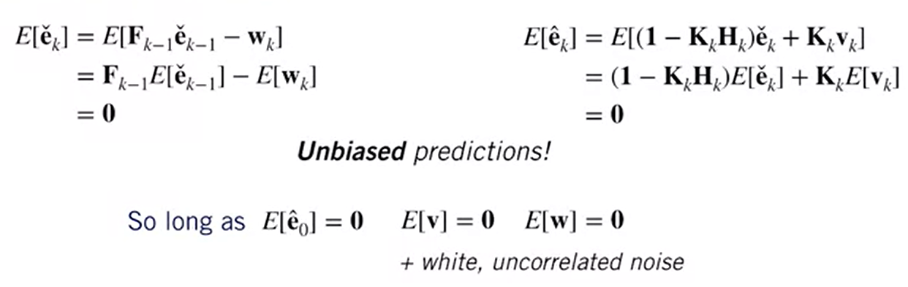

**Note** : this does not mean that the error on a given trial will be zero, but that, with enough trials, our expected error is zero!

**Consistency in State Estimation**

- By concistency we mean that for all time steps $k$, the filter covariance $\hat{p}_{k}$ matches the espected value of the square of our error.
- for scalar parameters, this means that the empirical variance of the estimate should match the variance reported by the filter
  - The filter is consistent if for all $k$,
  
$$
\displaystyle E[\hat{e}_{k}^2] = 
E[(\hat{p}_{k} - p_{k})^2] = \hat{P}_{k}
$$

- In practice, this means that our filter is neither *overconfident*, nor *underconfident* in the estimate it has producted
- A *overconfident* filter and inconcistent will report a covariance that is optimistic
- The filter will place too much emphasis on its own estimate and will be less sensitive to future measurement updates which may be `critical`
- This may cause negative or dangerous effect on the performance self-driving cars 


**The Kalman Filter is the BLUE (Best Linear Unbiased Estimator)**

- We're shown that given our linear formulation, and zero-mean, white noise the KF is **unbiased**
- We can also say that the filter is **consistent**
  - $E[\hat{e}_{k}] = 0$
  - $E[\hat{e}_{k}\hat{e}_{k}^T] = \hat{P}_{k}$
- In general, if we have white, uncorrelated zero-mean noise, the Kalman filter is the best (i.e.., lowest variance) unbiased estimator that uses only a linear combination of measurements
- For this reason, we call it the `BLUE`

**Summary**

The KF is : 
- unbiased
- consistent
- the lowest variance estimator that uses a linear combination of measurements: Best Linear Unbiased Estimator (**BLUE**)

### Lesson 2 Supplementary Reading: The Kalman Filter - The Bias BLUEs
To learn more about the Kalman filter, check out the resources below:

- Read an overview of the properties of the Kalman filter in Chapter 5, Section 2 of [Dan Simon, Optimal State Estimation (2006)](https://onlinelibrary.wiley.com/doi/book/10.1002/0470045345).

- Read more about estimator bias on [Wikipedia](https://en.wikipedia.org/wiki/Bias_of_an_estimator).

### The Nonlinear Kalman Filter
### Lesson 3: Going Nonlinear - The Extended Kalman Filter
### Lesson 3 Supplementary Reading: Going Nonlinear - The Extended Kalman Filter

### Lesson 4: An Improved EKF - The Error State Extended Kalman Filter
### Lesson 4 Supplementary Reading: An Improved EKF - The Error State Kalman FIlter

### Lesson 5: Limitations of the EKF 

### Lesson 6: An Alternative to the EKF - The Unscented Kalman Filter
### Lesson 6 Supplementary Reading: An Alternative to the EKF - The Unscented Kalman Filter

### Weekly assigment

- Module 2 Graded Notebook: Estimating a Vehicle Trajectory
- Module 2 Graded Notebook (Submission): Estimating a Vehicle Trajectory


# References

# Appendices

- [Gaussian filter](https://en.wikipedia.org/wiki/Gaussian_filter)
- [Filtre de Kalman](https://fr.wikipedia.org/wiki/Filtre_de_Kalman)
- [Finite Impulse Response (FIR)](https://en.wikipedia.org/wiki/Finite_impulse_response)
- [Infinite Impulse Response (IIR)](https://en.wikipedia.org/wiki/Infinite_impulse_response)
- [Convolution](https://en.wikipedia.org/wiki/Convolution)

