# Course-2 - W2 - MODULE 2 : State Estimation - Linear and Nonlinear Kalman Filters

## Overview 
- Any engineer working on autonomous vehicles must understand the Kalman filter, first described in a paper by Rudolf Kalman in 1960. 
- The filter has been recognized as one of the top 10 algorithms of the 20th century, is implemented in software that runs on your smartphone and on modern jet aircraft, and was crucial to enabling the Apollo spacecraft to reach the moon. 
- This module derives the Kalman filter equations from a least squares perspective, for linear systems. The module also examines why the Kalman filter is the best linear unbiased estimator (that is, it is optimal in the linear case). 
- The Kalman filter, as originally published, is a linear algorithm; however, all systems in practice are nonlinear to some degree. Shortly after the Kalman filter was developed, it was extended to nonlinear systems, resulting in an algorithm now called the ‘extended’ Kalman filter, or EKF. 
- The EKF is the ‘bread and butter’ of state estimators, and should be in every engineer’s toolbox. 
- This module explains how the EKF operates (i.e., through linearization) and discusses its relationship to the original Kalman filter. 
- The module also provides an overview of the unscented Kalman filter, or UKF, a more recently developed and very popular member of the Kalman filter family.


**Course Objectives :**
- Describe the relationship between least squares and the linear Kalman filter
- Explain the (in)sensitivity of the Kalman filter to new data and the need for process noise
- Describe how the linear Kalman filter can be extended to nonlinear systems via linearization
- Describe how the EKF uses first-order linearization to turn a nonlinear problem into a linear one
- Contrast the linearization approach of the EKF with that of the UKF, and explain why the UKF is superior for many problems
- Assess the performance of the extended Kalman filter and its variants


## The Linear Kalman Filter (LKF)

- The Kalman filter remains an important tool to fuse measurements from **several sensors** to **estimate in real-time the state** of a robotic system such as a self-driving car

### Lesson 1: The (Linear) Kalman Filter

- The Kalman filter algorithm was published in `1960` by Rudolf E. Kalman
- Adopted by [NASA](https://www.nasa.gov/) earlier after its publication for the Apollo Guidance Computer to sent Man into space

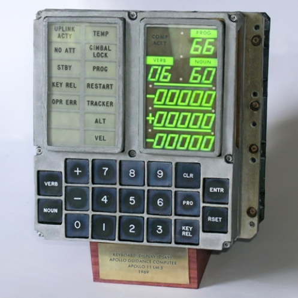

- The filter helped guided spacecraft accurately throught its **circumlunar orbit**


- The (extended) Kalman Filter became widely known after its use in the
Apollo Guidance Computer for circumlunar navigation.

**Prediction and Correction**
- Very similar to the linear Recursive Least Squares (RLS) Filter 
- While RLS updates the estimate of a static parameter, 
- `KF updates and estimates of an evolving state` 
- The `Goal` of KF: take a probabilistic estimate of this state and update it in real time using two steps : 
- 1. **Prediction**
- 2. **Correction**

Study Case : problem of estimating the 1D position of the vehicle

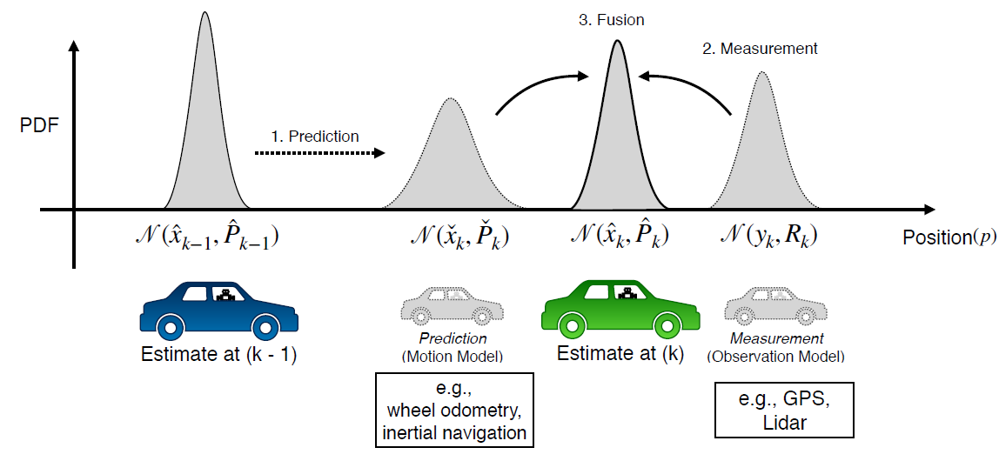

- This can be broken down into 3 steps : 
1. Initial probabilistic Estimate at time $k-1$
2. Use **Motion Model** (which can be derived from Wheel odometry or Inertial sensor measurement)to predict our new state
3. Use **Obesrvation Model** (derived from GPS, LIDAR) to correct that prediction at time $k$ to find the final state
- Notice : All the states (initial, predicted and final) are all random variables specify by their means and covariances

``` 
- KF can seen as a technique/tool to fuse informations from several sensors to produce a final estimate the unkown state in real-time, taking into account uncertainty in motion and in our measurements
```

**Linear Dynamical System**

- The Kalman Filter requires the following motion and measurement models:

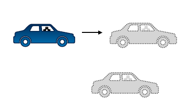

**Motion model** : linear combination btw the estimate at time step $k-1$, control input and zero-mean noise

$$
\displaystyle x_{k} = 
F_{k‚àí1}x_{k‚àí1} + G_{k‚àí1}u{k‚àí1} + w{k‚àí1}
$$

where :
- $F_{k‚àí1}, G_{k‚àí1}$ , the gain ?  
- $u_{k‚àí1}$, is the input signal/control input (can be a wheel torque applied to speed up & change lanes )
- $w_{k‚àí1}$, is zero-mean noise

**Measurement model**: 

$$
\displaystyle y{k} = 
H_{k}x{k} + v_{k}
$$

where :

- $v_{k}$, is the measurement noise
  
**With the following noise properties:**
  
- Measurement Noise : 

$$
vk ∼ 𝒩(0,R_{k})
$$

- Process or Motion Noise : govern how certain we are that our linear dynamical system is actually correct/ how uncertain we are about the effects of our control inputs

$$
w{k} ∼ 𝒩(0,Q_{k})
$$

**Recursive Least Squares + Process Model**

- The Kalman filter is a recursive least squares estimator that also includes a motion model

- `1.` Prediction

$$
\begin{cases}
\displaystyle \check{x}_{k} = 
F_{k‚àí1}x_{k‚àí1} + G_{k‚àí1}u_{k‚àí1} \\
\displaystyle \check{P}_{k} = 
F_{k‚àí1} \check{P}_{k‚àí1}F_{k‚àí1}^T + Q_{k‚àí1}
\end{cases}
$$


- `2a.` Optimal Gain

$$
\displaystyle K_{k} = 
\check{P}_{k}H_{k}^T(H_{k} \check{P}_{k}H_{k}^T + R_{k})^‚àí1
$$

- `2b.` Correction

$$
\begin{cases}
\displaystyle \hat{x}_{k} = 
\check{x}_{k} + K_{k}(y_{k} ‚àí H_{k}\check{x}_{k}) \\
\displaystyle \hat{P}_{k} = 
(1 ‚àí K_{k}H_{k})\check{P}_{k}
\end{cases}
$$

where : 
- $(y_{k} ‚àí H_{k}\check{x}_{k})$, is often called the `innovation`
- $\check{x}_{k}$, Prediction (given motion model) at time $k$
- $\hat{x}_{k}$, Corrected prediction (given measurement) at time $k$

**Recap : Prediction & Correction**

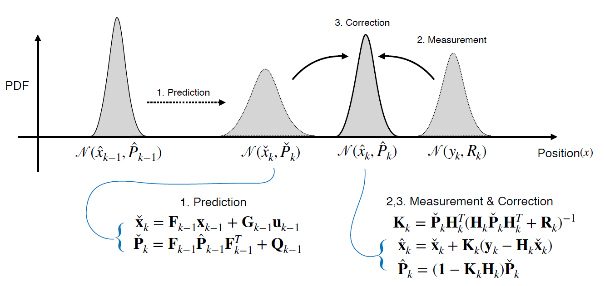

**Short example**

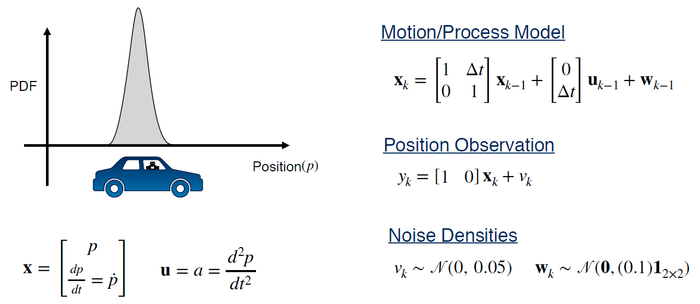

Where : 
- PDF : Probability Density Function 
- $a$ : is a constant acceleration from dynamic controller
- we assume, the vehicle position is measured by a GPS 


What's our corrected position estimate after we perform one prediction step and one correction step using KF? 

**Solution:**

- Prediction 


- Correction 


Result analysis : 
- The final corrected state **covariance is smaller**
- More certain about the car's position after we incorporate the position measurement
- Measurement noise variance is quite small
- [Implementation notebook](https://github.com/afondiel/Self-Driving-Cars-Specialization-Coursera/blob/main/Course2-State-Estimation-and-Localization-for-Self-Driving-Cars/resources/w1/lab/linear_kalman_filter.ipynb)


**Summary | The Kalman Filter**

- The Kalman Filter is very similar to RLS but includes a motion model that tells
us how the state evolves over time
- The Kalman Filter updates a state estimate through two stages:
  1. prediction using the **motion model**
  2. correction using the **measurement model**
### Lesson 1 Supplementary Reading: The Linear Kalman Filter

To learn more about the Linear Kalman Filter, check out the resources below: 

- Here's an interesting [blog post by Tim Babb explaining the Kalman filter](https://www.bzarg.com/p/how-a-kalman-filter-works-in-pictures/).  Babb is the Lighting Optimization Lead for Pixar Animation Studios.

- You can find an extensive, detailed treatment of the Kalman filter in Chapter 3, Section 3 of [Timothy D. Barfoot, State Estimation for Robotics (2017)](http://asrl.utias.utoronto.ca/~tdb/bib/barfoot_ser17.pdf) (available for free).

- Read another detailed explanation in Chapter 5, Section 1 of [Dan Simon, Optimal State Estimation (2006)](http://asrl.utias.utoronto.ca/~tdb/bib/barfoot_ser17.pdf).

- Explore a variety of great resources related to the Kalman filter on [this page](https://www.cs.unc.edu/~welch/kalman/) maintained by Greg Welch from the University of Central Florida and Gary Bishop from the University of North Carolina at Chapel Hill.

- Read Kalman's [original article](https://www.cs.unc.edu/~welch/kalman/kalmanPaper.html) on the linear filter, courtesy of Welch and Bishop and hosted at UNC at Chapel Hill (available for free).

### Lesson 2: Kalman Filter and The Bias BLUEs

**Bias in State Estimation**


- We say an estimator or filter is unbiased if it produces an `average` error of zero at a particular time step $k$, over many trials.
- Graphically : 

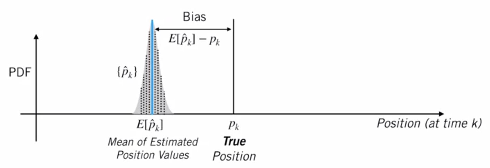
 
- We build a histogram of the positions that our filter reports over multiple trials
- We compute the difference btw the avg of these estimates and the true position.
- If the difference doesnot approach zero, the estimate is `biased`
- Otherwise, the filter is `unbiased`

$$
\displaystyle E[\hat{e}_{k}] = 
E[\hat{p}_{k} - p_{k}] = E[\hat{p}_{k}] - p_{k} = 0
$$

How can we compute this analytically for the Kalman filter?
- consider the error dynamics : 
  - Predicted state error : 

$$\displaystyle \check{e}_{k} = 
\check{x}_{k} + x_{k}
$$
  - Corrected estimate error : 
  
$$\displaystyle \hat{e}_{k} = 
\hat{x}_{k} + x_{k}
$$   

- Using the KF equations, we can derive : 

- PE : 

$$\displaystyle \check{e}_{k} = 
F_{k-1}\check{x}_{k-1} + w_{k}
$$

- CE :

$$\displaystyle \hat{e}_{k} = 
(1-K_{k}H_{k})\check{x}_{k} + K_{k}v_{k}
$$   

For the KF, for all $k$,

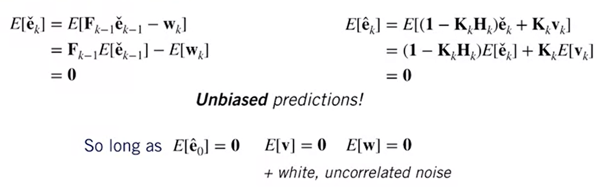

**Note** : this does not mean that the error on a given trial will be zero, but that, with enough trials, our expected error is zero!

**Consistency in State Estimation**

- By concistency we mean that for all time steps $k$, the filter covariance $\hat{p}_{k}$ matches the espected value of the square of our error.
- for scalar parameters, this means that the empirical variance of the estimate should match the variance reported by the filter
  - The filter is consistent if for all $k$,
  
$$
\displaystyle E[\hat{e}_{k}^2] = 
E[(\hat{p}_{k} - p_{k})^2] = \hat{P}_{k}
$$

- In practice, this means that our filter is neither *overconfident*, nor *underconfident* in the estimate it has producted
- A *overconfident* filter and inconcistent will report a covariance that is optimistic
- The filter will place too much emphasis on its own estimate and will be less sensitive to future measurement updates which may be `critical`
- This may cause negative or dangerous effect on the performance self-driving cars 


**The Kalman Filter is the BLUE (Best Linear Unbiased Estimator)**

- We're shown that given our linear formulation, and zero-mean, white noise the KF is **unbiased**
- We can also say that the filter is **consistent**


  - $E[\hat{e}_{k}] = 0$


  - $E[\hat{e}_{k} \hat{e}_{k}^T] = \hat{P}_{k}$


- In general, if we have white, uncorrelated zero-mean noise, the Kalman filter is the best (i.e.., lowest variance) unbiased estimator that uses only a linear combination of measurements
- For this reason, we call it the `BLUE`

**Summary**

The KF is : 
- unbiased
- consistent
- the lowest variance estimator that uses a linear combination of measurements: Best Linear Unbiased Estimator (**BLUE**)
- Limitations : 
  - self-driving generally uses nonlinear quantities : vehicle poses, position and orientation in 2D and 3D

### Lesson 2 Supplementary Reading: The Kalman Filter - The Bias BLUEs
To learn more about the Kalman filter, check out the resources below:

- Read an overview of the properties of the Kalman filter in Chapter 5, Section 2 of [Dan Simon, Optimal State Estimation (2006)](https://onlinelibrary.wiley.com/doi/book/10.1002/0470045345).

- Read more about estimator bias on [Wikipedia](https://en.wikipedia.org/wiki/Bias_of_an_estimator).

## The Nonlinear Kalman Filter
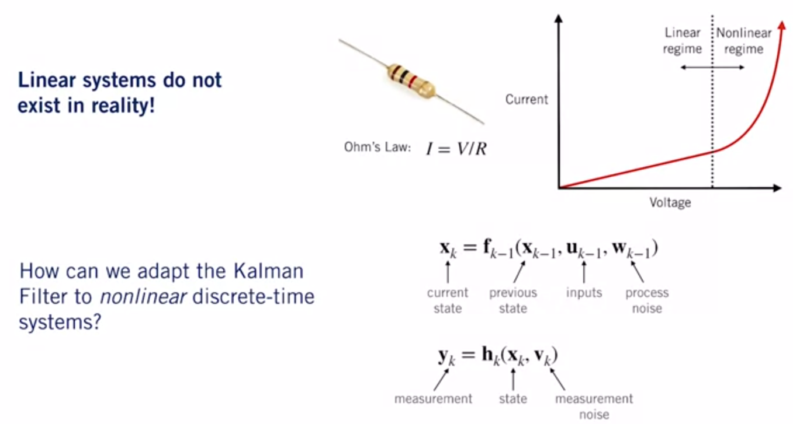

- Design to work w/ non linear systems, also considered as workhorses of state estimation because of its multiple applicatioins
  
### Lesson 3: Going Nonlinear - The Extended Kalman Filter (EKF)

- Choose an operation point $a$ and approximate the nonlinear function by a tangent line at point


- Mathematically, we compute this linear approximation using a first-order Taylor expansion:

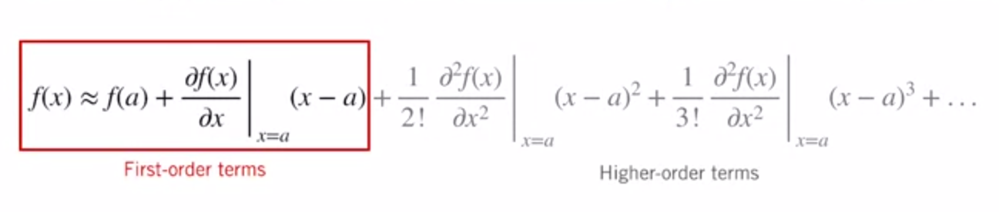

- For the EKF, we choose the **operating point** to be our most recent state estimate, our known input and zero noise: 

- Linearized motion model : 

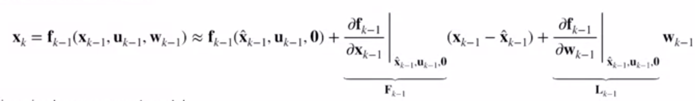

-  Linearized measurement model : 

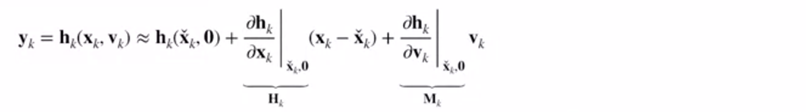

- We now have a linear system in state-space! The matrices $F_{k-1}$ , $L_{k-1}$ , $H_{k}$ , and $M_{k}$ , are called the `Jacobian` matrices of the system.

**Computing Jacobian Matrices**

In vector calculus, a Jacobian matrix is the matrix of the all first-order partial derivatives of a vector-values function 

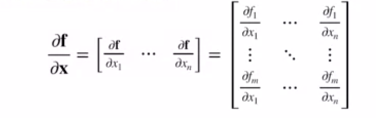

Intuitively, the Jacobian matric tells you how fast each output of the function is changing along each input dimension

- For example : 

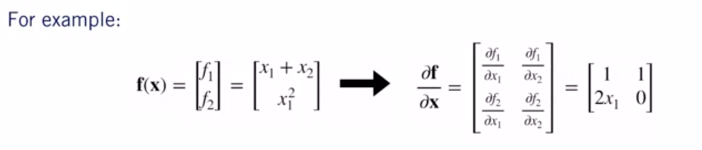

**Putting it all together**

With our **linearized models** and **Jacobians**, we can now use KF equations : 

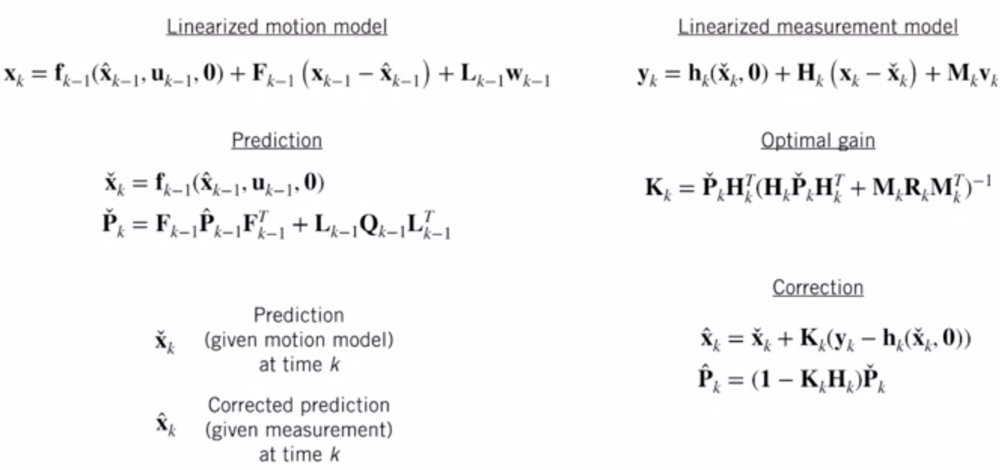

- We still using the nonlinear models to propagate the mean of the estimate and to compute the residual & innovation
  - after linearization of our previous state estimate of the motion  models, and measurement model about the predicted estate
- The nonlinear model always concises with linear model at the operating point
- The second difference is the matrice $L$ & $M$ => process and measurement noise
- $L$ & $M$ are in general **identity matrix** since noise is assumed to be additive (offset), but it's not always the case

**Short Example**
```
Tracking the position and velocity of the car moving along the rail, instead of receiving periodic GPS measuremens that tells us our position, we use on-board sensor like *camera* to measure the altitude distant landmarks relative to the horizon
```
- Assumptions :
  -  we know, both the **height** of landmarks (Repères) and its **position** in a global reference frame


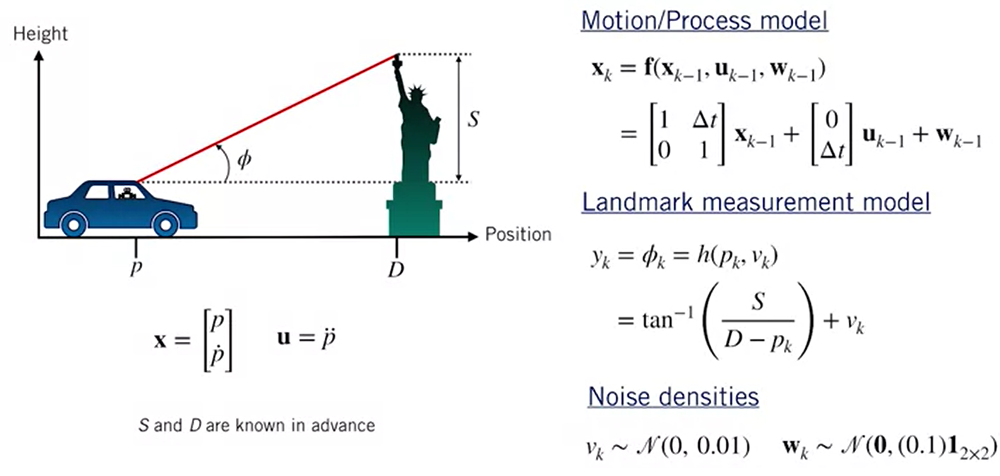

- Because our sensor is measured angle ( $\phi$ ), the measurement model has a nonlinear dependence on the position of the car (motion model)
  - S/(D - pk) : Non-linearity expression!!!
  - (D - pk) shall be different to `zero`
- Measurement model needs to be linearized
- Motion model Jacobian is always linear in state


- Data : 

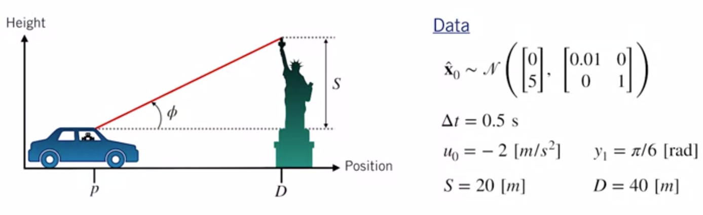

**Solution**

- Prediction
  
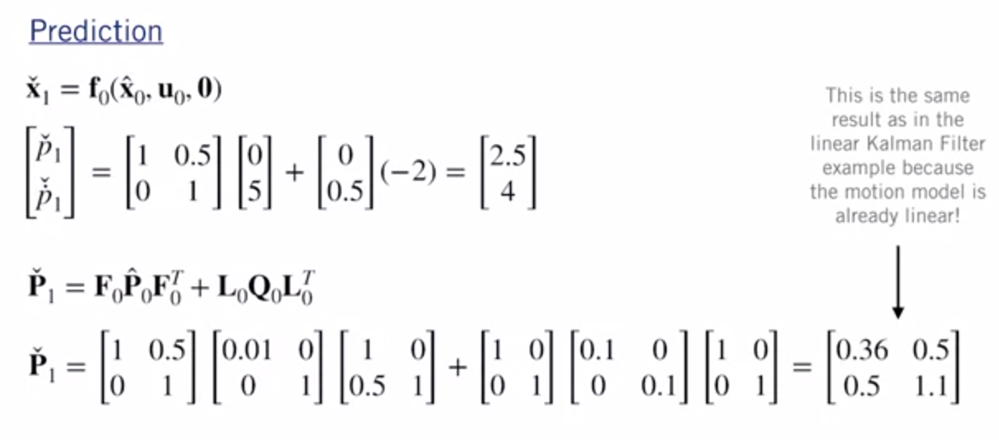


- Correction

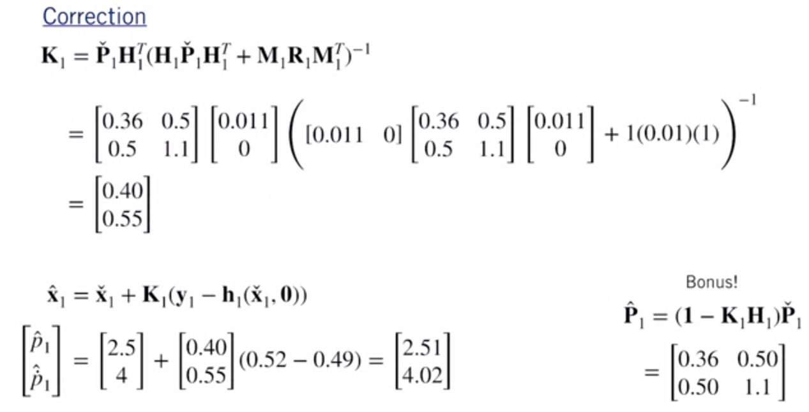

**Results analysis**
- The prediction result is the same as the LKF example (lesson1)
- The correction result, the corrected covariance doesnot change much compared to LKF because of angle change slowly with the distance doesnot provide too much info about the vehicle state compared to GPS measurement
- [Implementation code here](./resources/w2/lab/Extend_Kalman_filter_EKF.ipynb)


**Summary**
- The EKF uses *linearization* to adapt the KF to nonlinear systems
- Linearization works by computing a local linear approximation to a nonlinear function about a chosen operating point
- Linearization relies on computing *Jacobian matrices*, which contain all the **first-order** partial deritatives of a function

### Lesson 3 Supplementary Reading: Going Nonlinear - The Extended Kalman Filter

To learn more about the nonlinear Kalman filtering and the extended Kalman filter, check out the resources below:

- To learn more about nonlinear Kalman filtering, check out [this article](https://www.embedded.com/design/connectivity/4025693/Using-nonlinear-Kalman-filtering-to-estimate-signals) by Dan Simon (available for free).

- A detailed explanation of linearization and how it relates to the EKF can be found in Chapter 13,  Sections 1 and 2 of [Dan Simon, Optimal State Estimation (2006)](https://onlinelibrary.wiley.com/doi/book/10.1002/0470045345).


### Lesson 4: An Improved EKF - The Error State Extended Kalman Filter (ES-EKF)

**What's in a state?**

We can think of the vehicle state as composed of two parts : $\displaystyle x = \hat{x} + \delta x$
- where : 
  - $x$ : true state 
  - $\hat{x}$ : nominal state ("large")
  - $\delta x$ : error state ("small")

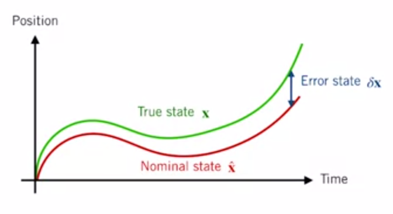

- We can continuously update the nominal state by integrating the motion model
- Modeling errors and process noise accumulate into the error state
- `Goal` : use the error state as correction to bring the nominal state closer to the true state
- Instead of doing Kalman filtering on the full state which might have lots of complicated non-linear behaviors, we use the EKF to estimate the Error-State instead.Then use the estimate of the error state as a correction to the nominal state

- `The ES-EKF estimates the error state directly and uses it as a correction to the nominal state`:

Mathematically: 

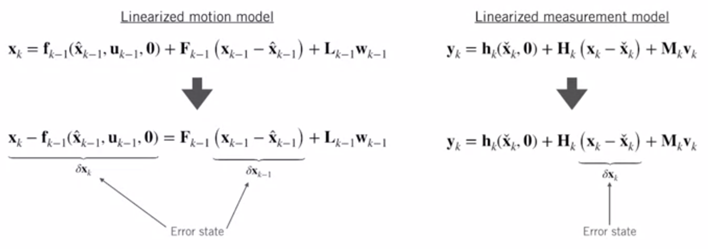

- where the new equation in f( $\delta xk$ ... ) is called  **the error state kinematics**

**Algorithm Loop**
1. Update nominal state w/ motion model : $\displaystyle \check{x}_{k} = f_{k-1}(x_{k-1}, u_{k-1},0)$
2. Propagate uncertainly : $\check{P}_{k}$ 
3. If a measurement is available : 
   1. Compute the Kalman Gain : $K_{k}$
   2. Compute the error state : $\displaystyle \delta\hat{x}_{k} = K_{k}(y_{k} - h_{k}(\check{x}_{k}, 0))$
   3. Correct the nominal state : $\displaystyle \hat{x}_{x} = \check{x}_{k} + \delta\hat{x}_{k}$
   4. Correct the state covariance : update $\hat{P}_{k}$ 


**Why Use the ES-EKF?**

1. Better performance compared to the vanilla EKF
   - The "small" error state is more amenable to linear filtering than the "large" nomminal state, which can be integrated nonlinearly

2. Easy to work with constrained quantities (e.g., rotations in 3D)
   - We can also break down the state using a generalized composition operator

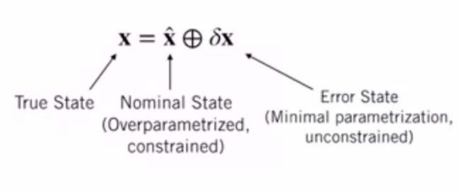


### Lesson 4 Supplementary Reading: An Improved EKF - The Error State Kalman FIlter

To learn more about the Error State Kalman Filter, check out the resources below:

- Review an important paper by Stergios Roumeliotis et al. on the use of the [error-state Kalman filter for mobile robot localization](https://ieeexplore.ieee.org/document/772597). This paper deals with the important case of aided localization, which in the topic of Module 5.

- Read Section 5 of a technical report by [Joan Solà, Quaternion kinematics for the error-state Kalman filter, 2017 (available for free)](https://arxiv.org/pdf/1711.02508.pdf). Note that this is an advanced reading.

### Lesson 5: Limitations of the EKF 

**Linearization error**

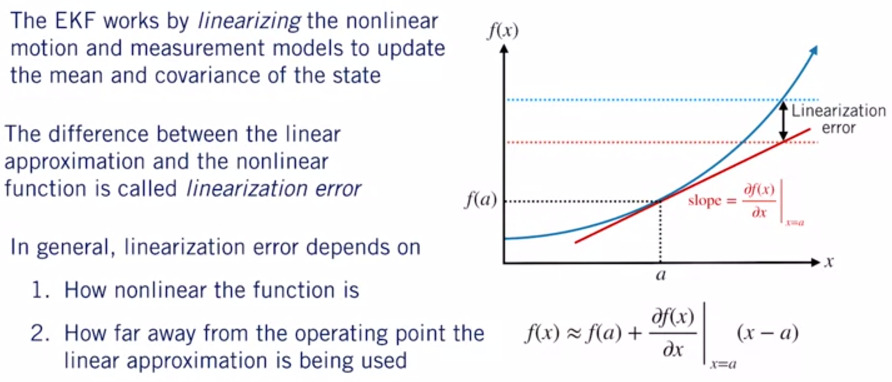

**Example**

Let's look at an ex. of how linearization affects the mean and convariance of two random variables transformed by a non-linear function:
- Non-linear transformation from Polar coordinates ( $r, \theta$ ) to cartesian coordinates ( $x, y$ )
- Commonly used to work w/ `LiDARs` (laser scanners) to report range and bearing measurements, just as scanners on many self-driving cars do

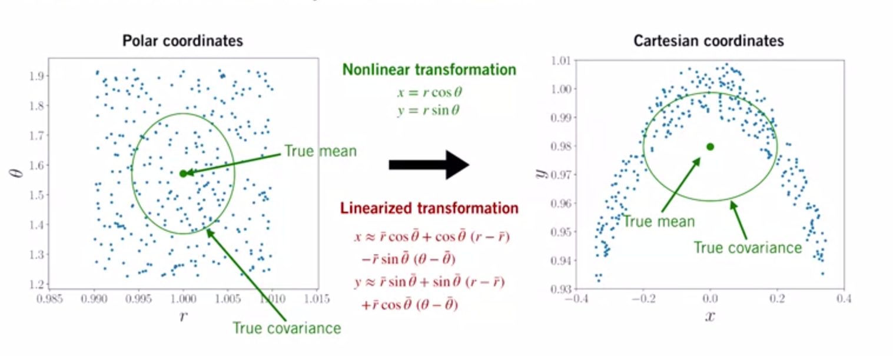

After transformation : 

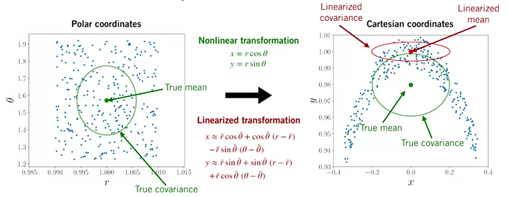

The EKF is prone to linearization error when : 
1. The system dynamics are highly nonlinear
2. The sensor sampling time is slow relative how fast the system is evolving

This has two important consequences:
1. The estimated `mean` state can become very different from the true uncertainty in the state
2. The estimated state `covariance` can fail to capture the true uncertainty in the state

<h3 style="text-align: center;"><i>Linearization error can cause the estimator to be overconfident in a wrong answer</i></h3>

**Computing Jacobians**

Computing Jacobian matrices for complicated nonlinear functions is also a common source of error in EKF implementations!
- Analytical differentiation is prone to human error
- Numericanl differentiation can be slow and stable
- Automatic differentiation (e.g., at compile time) can also behavior unpreditably

> **What if one or more of our models is non-differentiable ?** 

> **Do we really need linearization for nonlinear Kalman Filtering ?**

**Summary**
- The EKF uses analytical local linearization and, as a result, is sensitive to linearization error
- For highly nonlinear systems, the EKF estimate can diverge and become unreliable
- Computing complex Jacobian matrices is an error-prone process and must be done w/ substantial care

### Lesson 6: An Alternative to the EKF - The Unscented Kalman Filter (UKF)
- Alternative approach to Nonlinear KF that relies on something called the Unscented Transform, to pass probability distributions through nonlinear funtions
- Gives a much higher accuracy than the EKF style linearization, for similar amount of computation without needing to compute any Jacobians 

**The Unscented Transform (UT)**
- **It's easier to approximate a probability distribution** than it is to approximate an arbitrary nonlinear function" - S. Julier, J. Uhlmann, and H. Durrant-Whyte (2000)

- 1D Gaussian distribution (left graph) transformed trrough Nonlinear function into a more complicated 1D distro (right graph)
- This is possible by using `UT`.

- `UT has 3 steps` : 

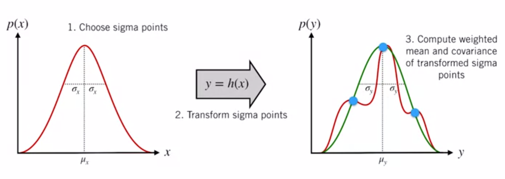

- Sigma points are deterministic samples chosen to a certain number of `std`, away from the mean (because of that the UT are sometimes called the Sigma Point Transform)
- Each point is then passed(transformed) through the nonlinear function $h(x)$, producing a new set of sigma points belonging to the output distribution
- We compute the sample mean and the covariance w/ some chosen weights this gives us a good approximation of estimate (mean and covariance) of the true output distribution

**Choosing sigma points**
- In general we need 2 sigma points : 
  - One for the **mean**
  - the rest symmetrically distributed about the mean
- For an N-Dimensional PDF $\mathcal{N}(\mu_{x}, \Sigma_{xx})$ , we need $2N+1$ sigma points. For ex. In 1D we need 3 sigma points and in 2D we need 5.

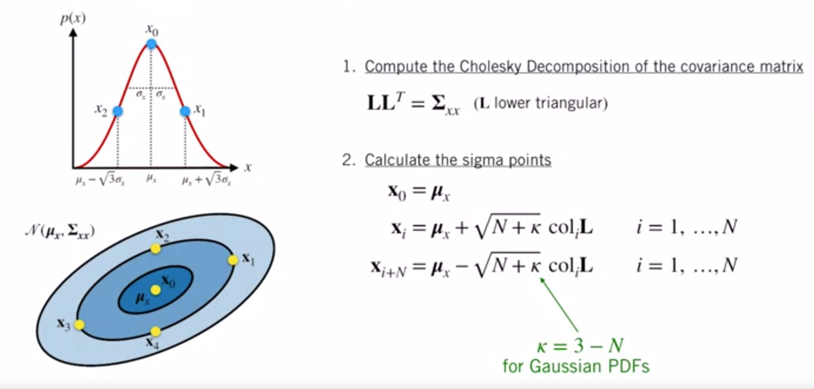

- The first to determine where the sigma points should be is applying the Cholesky decomposition of the covariance matrix associated w/ the input distribution
- The Cholesky Decomposition performes as a square root operation that operates on symetric positive define matrices such as covariance matrices
- If the input PDF is one-dimensional, the Cholesky decomposition is just the square root of the variance == std ($\sigma$)
- To compute the Cholesky decomposition in MATLAB we use the `chol` function or the Cholesky function NumPy

**Transforming and recombining**

Next we pass each of our $2N+1$ sigma points through the nonlinear function $h(x)$

$$
\displaystyle y_{i} = 
h(x_{i}) \qquad i=0, ..., 2N
$$

And finally compute the mean and covariance of thee output PDF


**The UT vs Linearization**

Let's revisit our nonlinear transformation ex, from the previsous chapiter

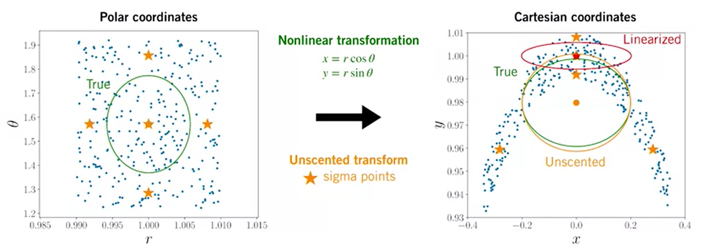

```
We can see in this ex, that the `UT` gives a much better approximation for similar work.
```

**The Unscented Kalman Filter (UKF)**

- We can easily use the UT in our KF framework w/ nolinear models : 

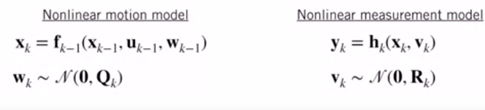

- Instead of approximating the system equations by linearizing, we will calculate sigma points and use the UT to approximate the PDFs directly

**Prediction step**

To propagate the state from time $(k-1)$ to time $k$, apply the UT using the current best guess for the mean and covariance

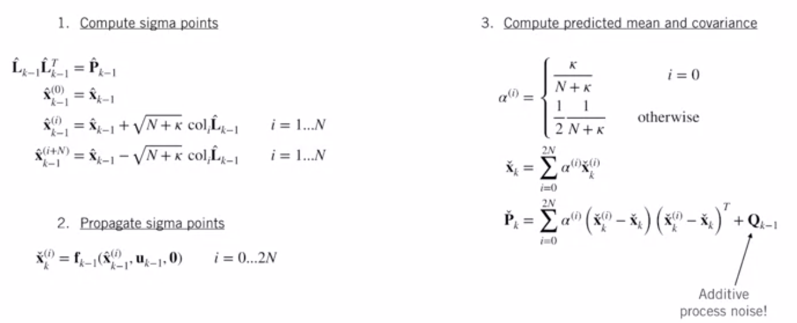

**Correction step**

To correc the state estimate using measurements at time $k$, use the nonlinear measurements model and the sigma points from the prediction step to predict the measurments

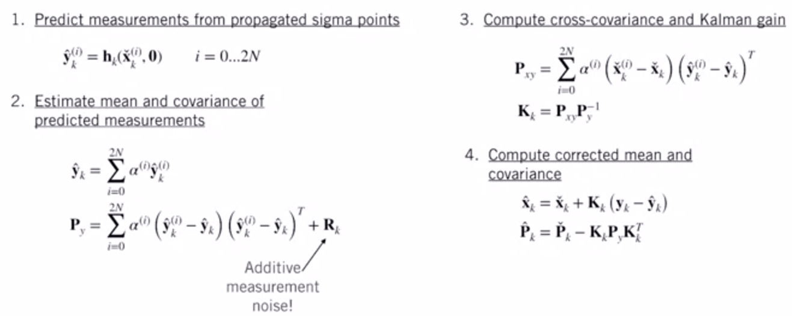

-  The UKF follows the same prediction-coorection pattern as EKF, we just replaced the analytical linearization step w/ the Unscented Transformation.
  
**Short example**

```
- track the position and velocity of a moving car that we're controlling by pressing on the gas pedal or the brake, the car has a sensor onboard that measures the angle btw the distance landmark and the horizon 
- the motion model is linear, but the measurement model is nonlinear 

```
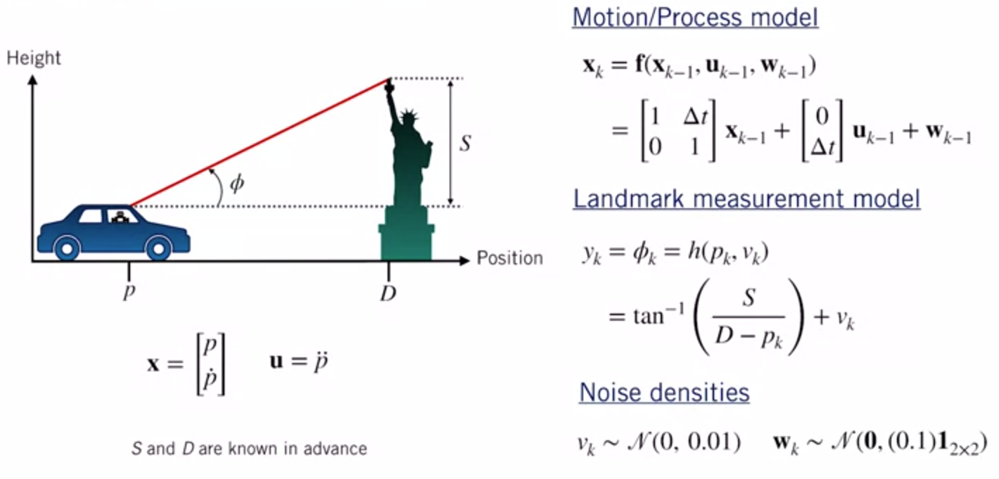

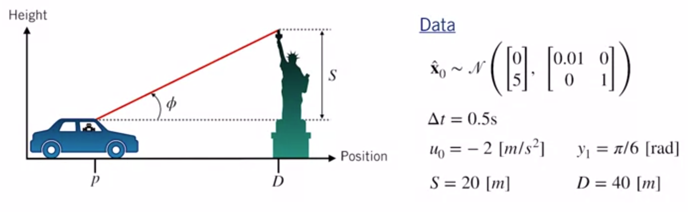

**Solution**

- Prediction : 
  
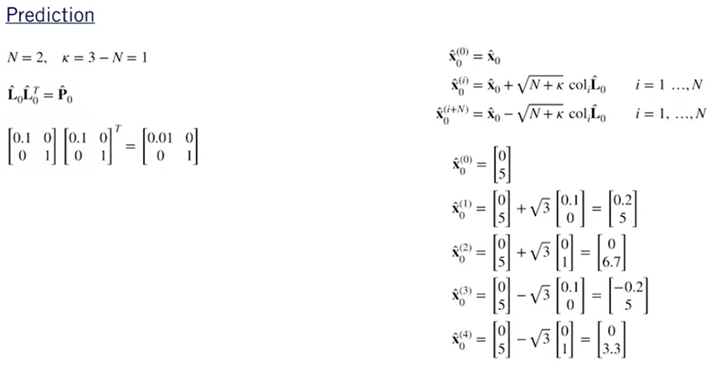

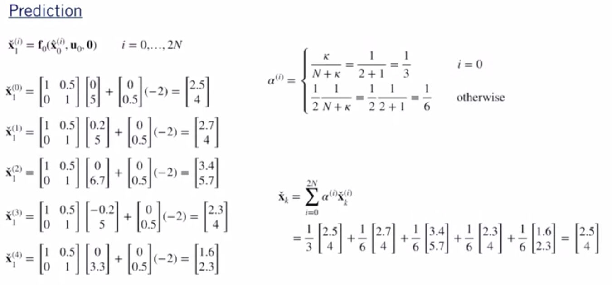

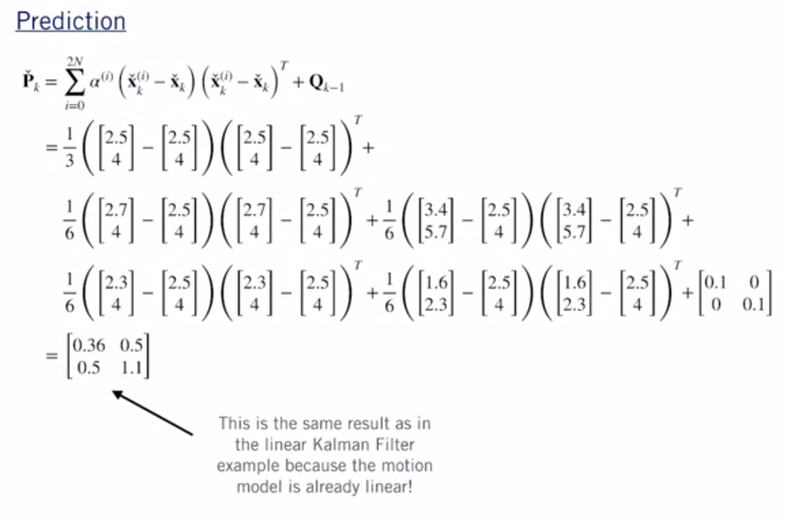

- Correction 

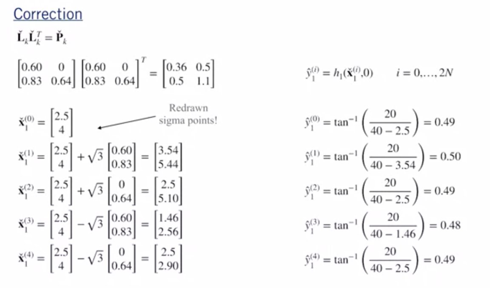

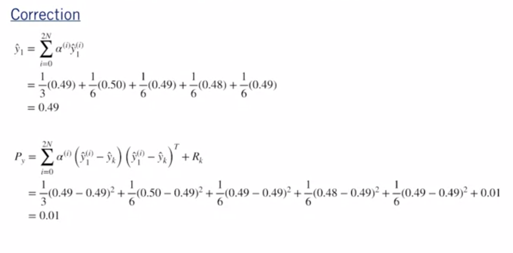

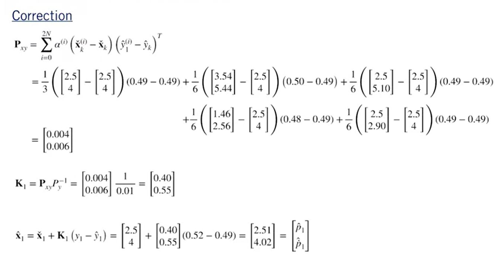


**Summary 1**
- The UKF uses the unscented transform to adapt the KF to nonlinear systems
- The unscented transform works by passing a small set of carefully chosen samples through a nonlinear systemn, and computing the mean and covariance of the outputs
- The unscented transform does a better job of approximating the output distribution than analytical local linearization, for similar computational cost

**Summary 2 - The LKF**

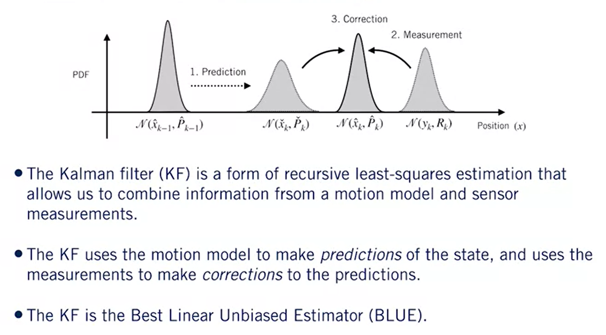

**Summary 3 - The NonLinear KF**

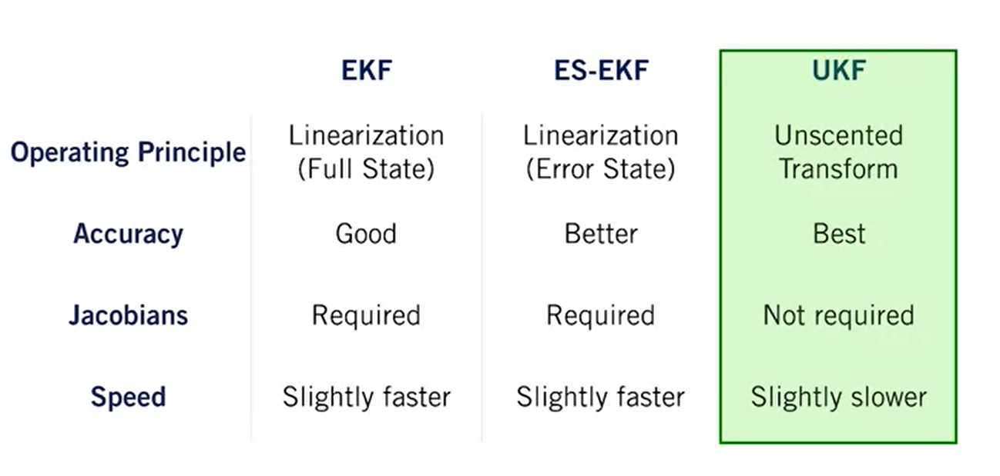

- Because of the accuracy and simplicity, it preferable to use the UKF over the EKF instead
- If EKF is used instead :
  - Use error state formulation
  - be aware of linearization error
  - strongly ensure that the Jacobians are correct  

### Lesson 6 Supplementary Reading: An Alternative to the EKF - The Unscented Kalman Filter

To learn more about Unscented Kalman Filters, check out the resources below:

- A research paper on [The Unscented Kalman Filters for Nonlinear Estimation](https://www.seas.harvard.edu/courses/cs281/papers/unscented.pdf) by the Oregon Graduate Institute of Science & Technology (free)

- Read a tutorial on the [Unscented Kalman Filter](https://www.cse.sc.edu/~terejanu/files/tutorialUKF.pdf) by Gabriel A. Terejanu from the University of Buffalo (available for free).

- Dig into the [original article](http://www.cs.unc.edu/~welch/kalman/media/pdf/Julier1997_SPIE_KF.pdf) by Simon Julier and Jeffrey Uhlmann that introduced the unscented Kalman filter.

### Weekly assigment
- Module 2 Graded Notebook: Estimating a Vehicle Trajectory


# References

Mathworks : 
- [Learning the Extended (Non-Linear) Kalman Filter](https://blogs.mathworks.com/pick/2010/07/09/learning-the-extended-non-linear-kalman-filter/?s_tid=srchtitle_EKF_1)

- [Extended and Unscented Kalman Filter Algorithms for Online State Estimation](https://www.mathworks.com/help/ident/ug/extended-and-unscented-kalman-filter-algorithms-for-online-state-estimation.html)

# Appendices

- [Gaussian filter](https://en.wikipedia.org/wiki/Gaussian_filter)
- [Filtre de Kalman](https://fr.wikipedia.org/wiki/Filtre_de_Kalman)
- [Finite Impulse Response (FIR)](https://en.wikipedia.org/wiki/Finite_impulse_response)
- [Infinite Impulse Response (IIR)](https://en.wikipedia.org/wiki/Infinite_impulse_response)
- [Convolution](https://en.wikipedia.org/wiki/Convolution)
- [Unscented Transform](https://en.wikipedia.org/wiki/Unscented_transform)
