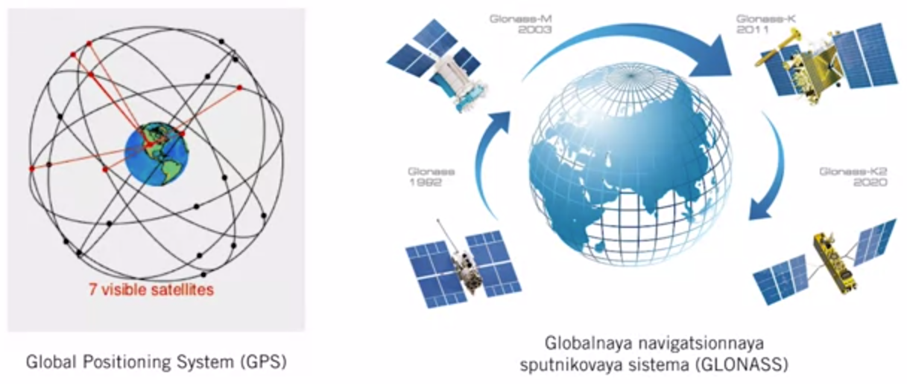

# Course-2 - W3 - MODULE 3 : GNSS/INS Sensing for Pose Estimation

## Overview 

- To navigate reliably, autonomous vehicles require an estimate of their pose (position and orientation) in the world (and on the road) at all times.
- Much like for modern aircraft, this information can be derived from a combination of GPS measurements and inertial navigation system (INS) data.
- This module introduces sensor models for inertial measurement units and GPS (and, more broadly, GNSS) receivers; performance and noise characteristics are reviewed.
- The module describes ways in which the two sensor systems can be used in combination to provide accurate and robust vehicle pose estimates.

**Course Objectives :**

- Explain the operation of the two most common sensors used for pose estimation in autonomous driving, inertial measurement units and GNSS receivers.
- Understand the concept of coordinate acceleration and the fundamental equation of inertial navigation.
- Apply gyroscope and accelerometer measurement models in the context of navigation.
- Describe the process of trilateration and justify why four satellites must be visible to obtain a 3D position fix from a GPS (GNSS) receiver.
- Understand why ionospheric delays and multipath effects can degrade the performance of GPS.

## GNSS/INS Sensing for Pose Estimation
### Lesson 1: 3D Geometry and Reference Frames 

**Coordinates Rotations**

- `Vector`: is a geometric object that has a magnitude and a direction.
- Also refered as Vector coordinates/set of numbers that represents the vectors direction and magnitude


**Transformation**

- Coordinate points changes when we move to one coordinate frame to another
- For ex. :  we may know the position of a building in some frame, and we want its position in our current vehicle frame 
- To compute this, use vector addition in order to express all of the coordinates in the `same` reference frame
 


**How can we represent a rotation**
- A critical component of tracking reference frames is tracking their orientation or rotation with respect to some base reference frame.
- Rotations are particularly tricky mathematical objects and they can be the source of major bugs if not dealt with carefully and diligently.

1. Rotation Matrix


- The inverse of rotation matrix is its transpose

2. Unit quaternions

- It can be represented as a 4D vector of unit of length


- Where : 
  - $q = [q_{v} \quad q_{x} \quad q_{y} \quad q_{z}]^{T}$ , and 
  - $Re(q) = q_{v}$
  - $Im(q) = q_{x}, q_{y}, q_{z}$
- We can **convert a quaternion to a rotation matrix** by using the algebra expression below : 


- Why use quaternions? 
  - They don't suffer from singularities and need 4 parameters instead of 9.

**Quaternion Multiplication and Rotations**
- Quaternions multiplication is a special operation that is associative but is not commutative in general(just like matrix multiplication)
  


- Quaternions is a complex number ( $\mathbb{C}$ )

Sequential rotation operations can also be performed by taking advantage of quaternion multiplication

$$
C( p \bigotimes q) = C(p)C(q)
$$

Where **p** and **q**, are rotation matrices

1. Euler angles


- Euler angles are a parsimonious representations requiring only three pa rameters instead of nine for a full rotation matrix.
- The cons of Euler angles is that they are singulaties. Singularites complicate state estimation because they represent particular rotation from which two euler angles are indistinguishable, in opposite of rotation and quaterunions


**Which rotation representation should I use?**


- It depends on the use case. Each of representation has pros & cons. 

**Reference Frames - Earth-Centred Inertial Frame (ECIF)**


**Reference Frames - Earth-Centred Earth-Fixed Frame (ECEF)**


- Where : RHR is the Right Hand Rule


- ECEF is fixed to the earth, while the ECIF is fixed with respect to the distance stars.  
- Useful for satelites and inertial sensing onboard aircraft

**Reference Frames - Navigation**

- For pratical vehicle application we use a frame that is fixed with respect to the ground
- For ex. : the navigation frame or local tangent frame


- A very common navigation frame is one that is attached to some known starting point and aligns the `x-axis pointing north`, the `y-axis pointing east`, and the `z-axis pointing down`. This is called the NED frame (North, East, Down). 
- A closely related frame is the ENU frame which aligns the `x-axis pointing east`, the `y-axis pointing north`, and the `z-axis pointing up`, where ENU (Easting Northing Up). 


**Reference Frames - Sensor & Vehicle**


 
- A sensor frame that is rigidly attached to a sensor like a **LIDAR, a GPS receiver or an Inertial Measurement Unit**. 
- This frame will typically be distinct from the general vehicle frame which can be placed anywhere on the vehicle that is convenient, at the center of mass, for example. 
- For localization, we will often ignore the distinction between the vehicle and sensor frame and assume that if we can track the sensor, we should be able to track any point on the vehicle, given proper calibration

**Summary - 3D geometry and Reference Frames**

- Vector quantities can be expressed in different reference frames
- Rotations can be parametrized by rotation matrices, quaternions or Euler angles
- ECEF, ECIF and Navigation frames are important in localization

### Lesson 1 Supplementary Reading: 3D Geometry and Reference Frames

For more information on 3D geometry and reference frames, check out the resources below:

- Read Chapter 6, Sections 1 to 3 of [Timothy D. Barfoot, State Estimation for Robotics (2017)](http://asrl.utias.utoronto.ca/~tdb/bib/barfoot_ser17.pdf) (available for free).

- Make use of this online [interactive quaternion calculator](https://quaternions.online/) and a handy online [3D rotation converter](https://www.andre-gaschler.com/rotationconverter/).

- Read the [Wikipedia article](https://en.wikipedia.org/wiki/Rotation_matrix) on rotation matrices.

### Lesson 2: The Inertial Measurement Unit (IMU)

- IMU measures the movement of a body in the inertial space.
- Today a certain type of cheap masss manufactured IMU is found in every smartphone such as iphone X.
- IMU are often  used for tasks like : step counting for health tracking, and recently in augmented reality devices
- IMU aided transoceanic fights long before GPS it was crutial to the  apollo used in onboard guidance navigation and control systems


- In the Apollo spacecraft relied on an IMU to accurately track both the position and the orientation of the vehicle in its way to the moon
- In space there are few landmarks to rely on for guidance, one can track the fixed stars but it not easy to do so
- The onboard IMU operated without the need for landmarks, enabled safe navigation to the moon's surface  
  
- IMU plays the similar role in the modern self-driving cars 
- filling in during the periods when navigation informations from other sensors is either unavailable or unreliable


- An IMU is typically composed of : 
  - **gyroscopes** : measure angular rotation rates about three separate axes
  - **accelerometers** : measure accelerations along three orthogonal axes
- IMUs come in many shapes and form factors; cost varies from ~$10 to ~$100K (this might changed today 2023 ...)

**The Gyroscope**


- Microelectromechanical systems (MEMS) are much smaller and cheaper
  - Measure rotational rates instead of orientation directly
  - Measurements are noisy and drift over time


**The accelerometer**
- Measures acceleration relative to free-fall (this also called the proper acceleration or specific force)


$$
\displaystyle a_{meas} = f =
\frac{F_{non-gravity}}{m}
$$

```
Sitting still at your desk, your proper acceleration is $g$ upwards (think of the normal force holding you up)
```
In localization, we typically require the acceleration relative to a fixed reference frame : 
- coordinate acceleration
- computed using Newton fundamental equation for accelerometers in a gravity field:

$$
\displaystyle f + g = \ddot{r}_{i}
$$

**Examples**


- An accelerometer in a stationary car measures g 'upwards' because the coordinate acceleration is zero, ignoring the rotation of the earth: 

$$
\displaystyle f = 
\ddot{r}_{i} - g \approx 0 - g \approx -g
$$

- Accelerometer on the International Spce Station (ISS) measures 0g. The entire ISS is free-fall together with the astronauts inside it.


$$
\displaystyle f = 
\ddot{r}_{i} - g \approx g  - g \approx 0g 
$$

- the value of g is less in low Earth orbit by about 10% when compared to the value on the surface of the Earth
- In other terms, this is that the proper acceleration with respect to free fall is 0, since the ISS is in free fall
- Althought, in reality residual atmospheric drag and structural vibrations will create some measured accelerations but they are typically as low as 10 to the -6g


- Althought gyroscope do measure the rotation of the Earth, it's often safe to ignore this for application where we care only about motion over a short duration.


**Inertial Navigation - Important Notes**

- When using an IMU for localization, keep in mind : 
1. If we inaccurately keep track of $C_{sn}(t)$ , we incorporate components of $g_{n}$ into $\ddot{r}_{n}^{sn}(t)$ , this will ultimately lead to terrible estimates of position : $\ddot{r}_{n}^{sn}(t)$
2. Both measurement models ignore the effect of **Earth's rotation**
3. We only consider **strapdown IMUs** - where the individual sensors are rigidly attached to the vehicle and are gimballed

**Summary**
- A 6-DOF IMU is composed of three gyroscope and three accelerometers, monted orthogonally
- A strapdown gryroscope measures a rotationa rate in the sensor frame
- A strapdown accelerometer measures a specific force (or acceleration relative to free-fall) in the sensor frame
### Lesson 2 Supplementary Reading: The Inertial Measurement Unit (IMU)

To learn more about IMUs and their applications, check out the resources below:

- Read the [page](https://en.wikipedia.org/wiki/Inertial_measurement_unit) about IMUs on Wikipedia.

- Follow along with the PDF slides from Gordon Wetzstein's [lecture on IMUs at Stanford University](http://stanford.edu/class/ee267/lectures/lecture9.pdf).

- Examine a technical description of inertial navigation in Chapter 11, [Section 1 of Jay A. Farrell, Aided Navigation (2008)](https://books.google.ca/books/about/Aided_Navigation_GPS_with_High_Rate_Sens.html?id=yNujEvIMszYC&redir_esc=y).

- Reflect on 4o years of advances in inertial navigation, summarized in this [article by Anthony King (1998)](http://citeseerx.ist.psu.edu/viewdoc/summary?doi=10.1.1.616.1248) from the magazine GEC Review.


### Lesson 3: The Global Navigation Satellite Systems (GNSS)

- Just like the IMU, nearly every modern smartphone has at least one type of GNSS receiver
- The first modern system of global positioning satallites (GPS) was built for military use during the 1980s
- The second version of the system was fully operational in 1995, GPS was made available to the public for free


**The Korean Air Line Flight 007**


- Korean Ait Flight 007 was shot down in 1983 after deviating into Soviet airspace due to improper use of their Inertial Navigation System
- This prompted the US to open GPS for worldwide use (ordered by US President Ronald Reagan)     

**GNSS - Accurate Global Positioning**

Although GPS was original system of navigation satellites used for global postioning
- **Global Navigation Satellite System (GNSS)** is catch-all term for a satellite system(s) that can be used to pinpoint a receiver's position anywhere in the world



- **GLONASS** Russian equivalent GPS
- Several other systems are nearing completion including the European Galileo constellation 

**Global Positioning System (GPS)**
- The GPS constellation is composed of 24 to 32 satellites in 6 orbital planes
  - Altitude of ~20,200km (12,550 miles)
  - Orbital period of ~12 hours 


- Each satellite isn't a medium Earth orbit an altitude of roughly 20000 kilometers with an orbital period of just under 12hours
- The constellation is designed such that at leat four satellites are visible at any surface point on earth at all times
- Each satellite broadcasts on two frequencies : 
  - L1 (1575.42 MHz, civilian + military)
  - L2 (1227.6 MHz, military)

- Other GNSS systems operate on similar principles 

**GPS - Computing Position**


Each GPS satellite transmits a signal that encodes
1. Its potision (via accurate ephemeris information)
2. Time of signal transmission (via onboard atomic clock)

- To compute a GPS position fix in the Earth-centred frame, the receiver users the speed of light to compute distance to each satellite based on time of signal arrival
- At least four satellites are required to solve for 3D position, three if only 2D is required (e.g., if altitude is known)

**Trilateration**

- For each satellite, we measure the **pseudorange** as follows : 

$$
\displaystyle \rho^{(i)} =  c(t_{r} - t_{s}) = 
\sqrt{(p^{(i)} - r)^T(p^{(i)} - r)} + c\Delta t_{r} + c\Delta t_{a}^{(i)} + \eta^{(i)}
$$


- Each pseudorange measurement defines a circle in 2D or a sphere in 3D

If we have more than 4 satellites we can use the method of least squares to find the maximum likelihood position assuming Gaussian noise


**GPS - Error Sources (I)**

- GPS suffers from multiple error sources
  


- **Ephemeris & clock errors**
  - A clock error of 1 x $10^{-6}$ s gives a 300m position error  


- **Geometric Dilution of Precision (GDOP)**
  - The configuration of the visible satellites affects position precision


**GPS - Improvements**


**Summary**

- A GNSS works through trilateration via pseudoranging from at least 4 satellites (for a 3D position fix)

- GNSS error can be caused by ionospheric delays, multipath effects, and precision is also affected by GDOP.

- For GPS, differential GPS and RTK GPS are potential methods to substantially improve performance

### Lesson 3 Supplementary Reading: The Global Navigation Satellite (GNSS)

To learn more about the evolution of GNSS, check out the resources below:

- Read this [article](https://www.geospatialworld.net/article/global-navigation-satellite-system-gnss/) about the evolution of the various GNSS constellations.

- Review overviews of the [Galileo](https://m.esa.int/Our_Activities/Navigation/Galileo/Galileo_satellites) global navigation satellite system developed by the European Union, the [GLONASS](https://gssc.esa.int/navipedia/index.php/GLONASS_General_Introduction) system developed by the Russian Federation, and [COMPASS (BeiDou-2)](https://en.wikipedia.org/wiki/BeiDou_Navigation_Satellite_System) developed by the People's Republic of China.


## Learning from Industry Expert (Paul Newman)
### Why Sensor Fusion?
- State estimation is important for self-driving cars
- It's full of complexity, because of `the data association` and the `data complexity`
  - To solve this problem, instead of using `one sensor type we should use many`
- This might get rid of the confusion btw corner of building and corner of bus from laser by using a camera
- This leads to two modalities the appearance from a camera in the form of what color the pixels are and we're getting metters in geometry from the bus on how far away stuff is, and so you might find that gets a lot easier
- we could even add a Doppler RADAR I could measure how fast it's going as well 
- We have now a `rate` + `appearance` + `shape` and we could use gyro and accelerometer to compute the rate of change of my own state
- We want now to feed all of those into my `state estimation`. 
- We want to use all of those different sensor streams to do a better jox of figuring out where I am and what's arrounf me and what those third party entities are doing       

- A combination of these sensors seems to be the clever way to do it. And then the art of a good AV Engineer and a good algorithms Engineer in this space 

- Sensor function is like a big optimization function/module that uses all of those sensor streams and computes the minimum (of the function) that explains all of the sensor data
- This allows us to have a clear idea `where We are` (th ego vehicle) and what the actual state is (in case of Localization)

### Supplementary Reading: Sensor Fusion

- Wikipedia article [Sensor Fusion ](https://en.wikipedia.org/wiki/Sensor_fusion)

## Weekly Assignement

# References

- [Course 1 - W4 - MODULE 4: Vehicle Dynamic Modeling (VDM) -  Lesson 1: Kinematic Modeling in 2D](https://github.com/afondiel/Self-Driving-Cars-Specialization-Coursera/blob/main/Course1-Introduction-to-Self-Driving-Cars/course1-w4-notes.md)

- [EE267 Getting Started with Unity - Stanford Computational Imaging Lab](https://www.youtube.com/watch?v=tFMwG2Ee-D4)
# Appendices
- [3D Space](https://en.wikipedia.org/wiki/Three-dimensional_space)
- [3D pose estimation](https://en.wikipedia.org/wiki/3D_pose_estimation)
- [Rotation Matrix](https://en.wikipedia.org/wiki/Rotation_matrix)
- [Coordinate System](https://en.wikipedia.org/wiki/Coordinate_system)
- [Spherical Coordinate System - Earth coordinates](https://en.wikipedia.org/wiki/Spherical_coordinate_system)
- [Horizontal Coordinate System](https://en.wikipedia.org/wiki/Horizontal_coordinate_system)
- [Pose (computer vision)](https://en.wikipedia.org/wiki/Pose_(computer_vision))
- [Computer Vision](https://en.wikipedia.org/wiki/Computer_vision)
- [Camera Resectioning](https://en.wikipedia.org/wiki/Camera_resectioning)
- [Optics](https://en.wikipedia.org/wiki/Optics)
- [Geometrical Optics](https://en.wikipedia.org/wiki/Geometrical_optics)
- [Bayesian Network](https://en.wikipedia.org/wiki/Bayesian_network)
- [Bayesian inference](https://en.wikipedia.org/wiki/Bayesian_inference)
- [Bayesian Statistics](https://en.wikipedia.org/wiki/Bayesian_statistics)

