# Course-2 - W4 - MODULE 4 : LIDAR Sensing 

## Overview 

- LIDAR (light detection and ranging) sensing is an enabling technology for self-driving vehicles. LIDAR sensors can ‘see’ farther than cameras and are able to provide accurate range information. 
- This module develops a basic LIDAR sensor model and explores how LIDAR data can be used to produce point clouds (collections of 3D points in a specific reference frame). 
- Learners will examine ways in which two LIDAR point clouds can be registered, or aligned, in order to determine how the pose of the vehicle has changed with time (i.e., the transformation between two local reference frames).

**Learning  Objectives**

- Explain how LIDAR sensors are able to generate range data from time-of-flight measurements
- Understand inverse and forward sensor models for a basic scanning LIDAR
- Apply standard transfomations (translation, rotation, and scaling) to LIDAR point cloud data
- Summarize how the problem of motion distortion can affect LIDAR scans acquired from a moving vehicle
- Utilize the iterative closest point (ICP) algorithm to align point clouds from consecutive LIDAR scans

## LIDAR Sensing 

- LIDAR has been an enabling technology for self-driving cars because it can see in all directions and is able to provide very accurate range information. 

- In fact, with few exceptions, most self-driving cars on the road today are equipped with some type of LIDAR sensor.

### Lesson 1: Light Detection and Ranging Sensors (LIDAR)

- Some self-driving cars equiped with LiDAR
  

Waymo

Uber 

- LiDAR job is to provide detailed 3D scans (mapping) of the environment around the vehicle.
- Other applications : Rototics

They can be found in many different shapes and sizes as well as for different applications: from measuring the distance to a single point, a 2D slice of the world or perform a full 3D scan

Some of the most popular models/brand used today : 
- **Velodyne** (in California, USA)  

- **Hokuyo** in Japan and **SICK** in Germany 
  

For the purpose of this course we will using the Velodyne LiDAR but the basic techniques applied to other types of LiDARs too

**Measuring Earth, Sea and Sky**

- LiDAR was originated in the 1960s shortly after the invention of the laser
  

- First used by meteorologists to clouds, but these ground-based celiometers are still in use today not only to measure water cloud but also to detect volcanic ash and air polution

- Airborne LiDAR sensors are commonly used today to survey and map the earth's surface for agriculture, geology, military, and other uses

- The first application that brought LiDAR into public consciousness was Apollo 15
- the fourth manned mission to land on the moon, and the first to use a laser altimeter to map the surface of the moon.

**Measuring Distance with Time-of-Flight**

- LiDAR can be used to measure distances and create a certain type of map, but how it works in context of self-driving cars ? 
- To build a basic LIDAR in 1D, 3 components are needed : 
1. A laser
2. A photodetector
3. A very precise stop watch

- The laser first emits a short pulse of light usually in the near infrared frequency band along some known ray direction
- At the same time the stopwatch starting counting
- The laser pulse travels outwards from the sensor at the speed of light and hits a distant target (It maybe another vehicle in front of us on the road or a stationary object like a stop sign or a building.)

- As long as the surface of the target isn't too polished or shiny, the laser pulse will scatter off the surface in all directions, and some of that reflected light will travel back along the original ray direction. 

- The photodetector catches that return pulse and the stopwatch tells you how much time has passed between when the pulse first went out and when it came back. 

- That time is called the **round-trip time**. 
- Now, we know the speed of light, which is a bit less than 3x$10^8 m/s$.
- So, we can multiply the speed of light by the round-trip time to determine the total round trip distance traveled by the laser pulse

- Since light travels much faster than cars, it's a good approximation to think of the LIDAR and the target as being effectively stationary during the few **nanoseconds** that it takes for all of this to happen. 
- That means that the distance from the LIDAR to the target is simply half of the round-trip distance we just calculated
- This technique is called **time-of-flight ranging**. Although it's not the only way to build a LIDAR, it's a very common method that also gets used with other types of ranging sensors like **radar** and **sonar**
- It's worth mentioning that the photodetector also tells you the intensity of the return pulse relative to the intensity of the pulse that was emitted
- This intensity information is less commonly used for self-driving, but it provides some extra information about the geometry of the environment and the material the beam is reflecting off of
- intensity data is useful, bacause it's possible to create 2D images from LIDAR intensity data that you can then use the same computer vision algorithms 
- Since LIDAR is its own light source, it actually provides a way for self-driving cars to see in the dark
- So, now we know how to measure a single distance to a single point using a laser, a photodetector, a stopwatch, and the time-of-flight equation, but obviously it's not enough to stay laser focused on a single point ahead

- So, how do we use this technique to measure a whole bunch of distances in 2D or in 3D?

**Measuring Distance with Time-of-Flight** 

- The trick is to build a rotating mirror into the LIDAR that directs the emitted pulses along different directions. 

- As the mirror rotates, you can measure distances at points in a 2D slice around the sensor
- If you then add an up and down nodding motion to the mirror along with the rotation, you can use the same principle to create a scan in 3D

- For Velodyne type LIDARs, where the mirror rotates along the entire sensor body, it's much harder to use a knotting motion to make a 3D scan. 
- Instead, these sensors will actually create multiple 2D scan lines from a series of individual lasers spaced at fixed angular intervals, which effectively lets you paint the world with horizontal stripes of laser light

Here's an example of a typical raw LIDAR stream from a Velodyne sensor attached to the roof of a car

- The black hole in the middle is a blind spot where the sensor itself is located, and the concentric circles spreading outward from there are the individual scan lines produced by the rotating Velodyne sensor. 
- Each point in the scan is colored by the intensity of the return signal. 
- The entire collection of points in the 3D scan is called a `point cloud`

**Measurement Models for 3D LIDAR Sensors**

- 3D LiDAR sensors report *range*, *azimuth* angle and *elevetion angle*( + return intensity)

Before propagation of light 

After propagation of light 

- LIDARs measure the position of points in 3D using spherical coordinates : 
  - **range or radial distance** from the center origin to the 3D point ( $P(x,y,z)$ ), 
  - **elevation angle** measured up from the sensors XY plane
  - **azimuth angle** measured counterclockwise from the sensors x-axis.

- The azimuth and elevation angles tell you the direction of the laser pulse, and the range tells you how far in that direction the target point is located

-  The azimuth and elevation angles are measured using encoders that tell you the orientation of the mirror, and the range is measured using the time of flight as we've seen before

- For Velodyne type LIDARs, the elevation angle is fixed for a given scan line

- Now, suppose we want to determine the cartesian XYZ coordinates of our scanned point in the sensor frame, which is something we often want to do when we're combining multiple LIDAR scans into a map

- This gives us an inverse sensor model. We say this is the inverse model because our actual measurements are given in spherical coordinates, and we're trying to reconstruct the Cartesian coordinates at the points that gave rise to them
 
- To go the other way from Cartesian coordinates to spherical coordinates, we can work out the inverse transformation given here. 
- This is our forward sensor model for a 3D LIDAR, which given a set of Cartesian coordinates defines what the sensor would actually report.
 
**Measurement Models for 2D LIDAR Sensors**

- most of the time the self-driving cars we're working with use 3D LIDAR sensors like the Velodyne, but sometimes you might want to use a 2D LIDAR on its own, whether for detecting obstacles or for state estimation in more structured environments such as parking garages.

- For 2D LIDARs, we use exactly the same forward and inverse sensor models. But the elevation angle enhance the z component of the 3D point in the sensor frame are both zero. 
  
- In other words, all of our measurements are confined to the XY plane of the sensor, and our spherical coordinates collapsed to the familiar 2D polar coordinates. 

**Sources of Measurement Noise**

- First, there is uncertainty in the exact time of arrival of the reflected signal, which comes from the fact that the stopwatch we use to compute the time of flight necessarily has a limited resolution.
- Similarly, there is uncertainty in the exact orientation of the mirror in 2D and 3D LIDARs since the encoder is used to measure this also have limited resolution. 
- Interaction with the target (surface absorption, specular reflection, etc)
- Variation of propagation speed (e.g., throug materials)

- These factors are commonly accounted for by assuming additive **zero-mean Gaussian noise** on the spherical coordinates with an empirically determined or manually tuned covariance. 
- The Gaussian noise model is particularly convenient for state estimation even if it's not perfectly accurate in most cases.

**Motion Distortion** 

- Another very important source of error that can't be accounted for so easily is motion distortion, which arises because the vehicle the LIDAR is attached to is usually moving relative to the environment it's scanning. 

- Now, although the car is unlikely to be moving at an appreciable fraction of the speed of light, it is often going to be moving at an appreciable fraction of the rotation speed of the sensor itself, which is typically around 5-20 hertz when scanning objects at distances of 10 to a 100 meters. 

- This means that every single point in a LIDAR sweep is taken from a slightly different position and a slightly different orientation, and this can cause artifacts such as duplicate objects to appear in the LIDAR scans. 

- This makes it much harder for a self-driving car to understand its environment, and correcting this motion distortion usually requires an accurate motion model for the vehicle provided by GPS and INS for example

**Summary**

- LIDAR sensors measure distances by emitting pulse laser light and measuring the time of flight of the pulse. 
- 2D or 3D LIDAR is extend this principle by using a mirror to sweep the laser across the environment and measure distances in many directions.

### Lesson 1 Supplementary Reading: Light Detection and Ranging Sensors

For more information on LIDAR sensors, check out the resources below:

- Read Chapter 6, Section 4.3 of [Timothy D. Barfoot, State Estimation for Robotics (2017)](http://asrl.utias.utoronto.ca/~tdb/bib/barfoot_ser17.pdf) (available for free).

- Read the Wikipedia article on [LIDAR](https://en.wikipedia.org/wiki/Lidar) sensors.

- Read Chapter 4, Section 1.9 of [Roland Siegwart, Illah R. Nourbakhsh, Davide Scaramuzza, Introduction to Autonomous Mobile Robots (2nd ed., 2011)](https://mitpress.mit.edu/books/introduction-autonomous-mobile-robots-second-edition).

### Lesson 2: LIDAR Sensor Models and Point Clouds

- Study case : A LIDAR scans a nearby tree off on the side of the road, and produces a point cloud that looks like this : 

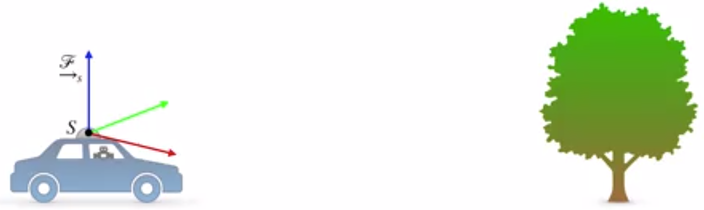

- Begin of the beam propogation 

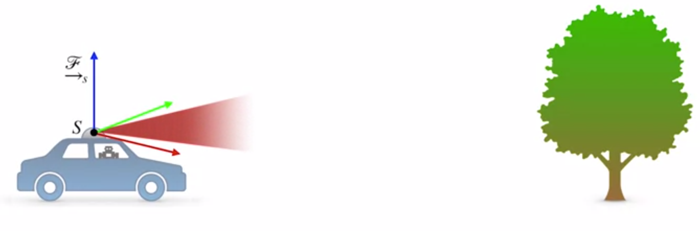

- Nearly to the target

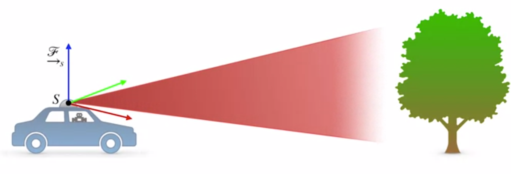

- Reach the target oject

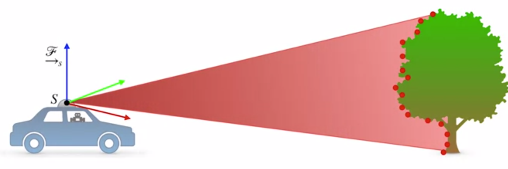

We only see points on the part of the tree that's facing us because the tree and the leaves reflect **infrared light**.

- *How do we keep track of all of these points? What kinds of data structures should we use to work with them?*

**Data Structures**

One common solution is to assign an index to each of the points, say point 1 through point n, and store the x, y, z coordinates of each point as a 3 by 1 column vector

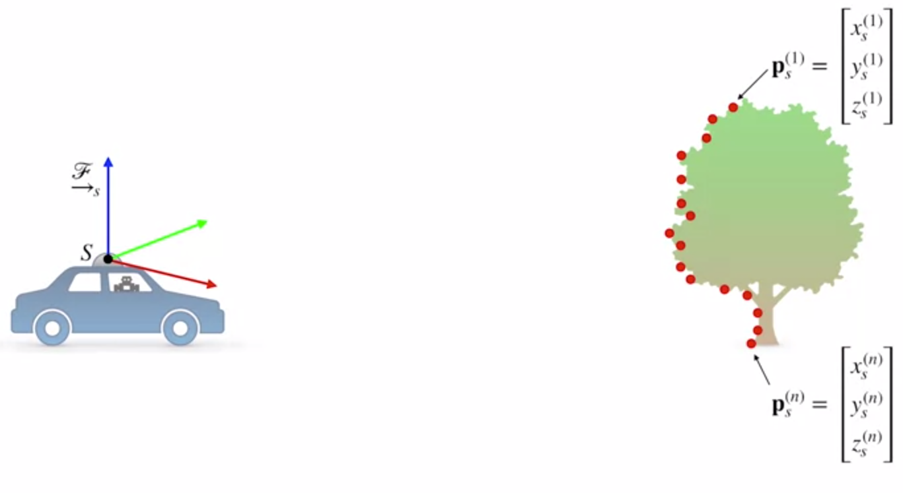

From there, you could think about storing each of these vectors in a list, or you could stack them side by side into a matrix that we'll call big $P$.

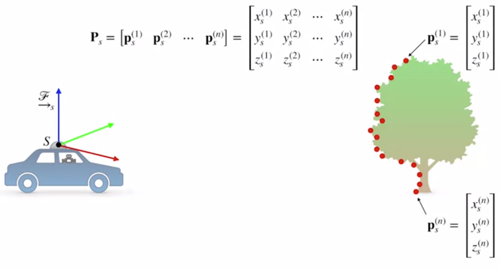

Doing it this way make it easier to work with the standard linear algebra libraries, like the Python NumPy library, which lets us take advantage of fast matrix operations rather than iterating over a list and treating each vector independently.

There are 3 basic spatial operations that are important for carrying out state estimation with point clouds : 

**Operations on Point Clouds**

- Translation : 

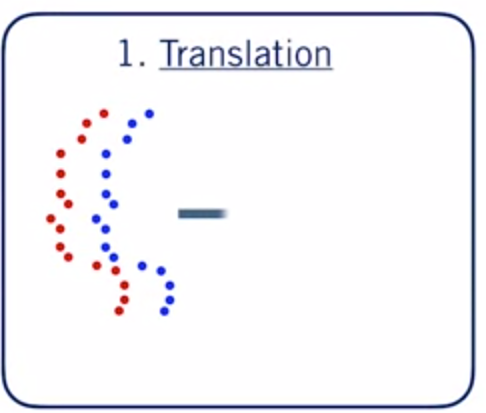

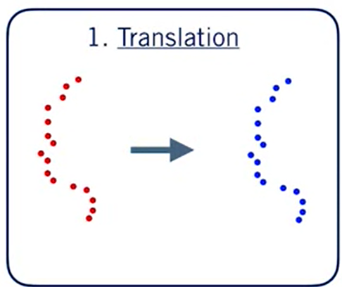

- Rotation : 

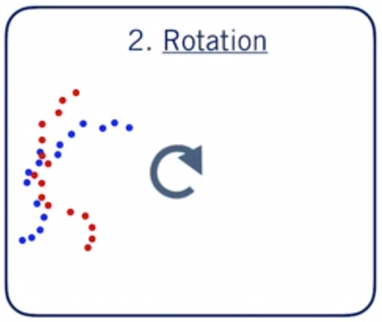

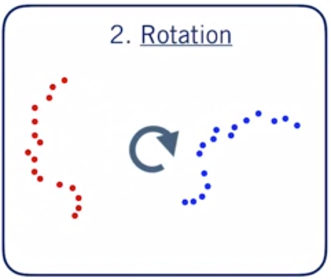

- Scaling : 

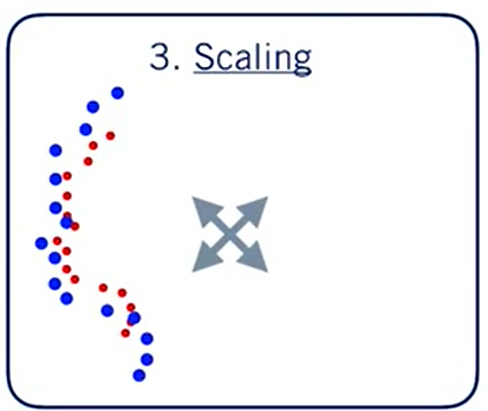

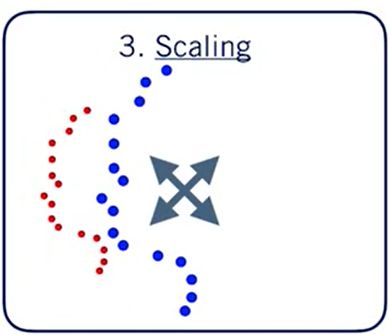

- When we think about spatial operations on point clouds, our intuition might be to think in terms of physically manipulating the point cloud while our reference frame stays fixed.

- But for state estimation, it's more useful to think about things the other way around.
- Objects in the world mostly stay put while the reference frame attached to the vehicle moves and observes the world from different perspectives.

**Translation**

- How translating our reference frame, say, by driving for a $10 m$ will affect our perception of a single point in point cloud

- We can start by drawing the vector from the origin of our sensor frame, S, to a point, P.

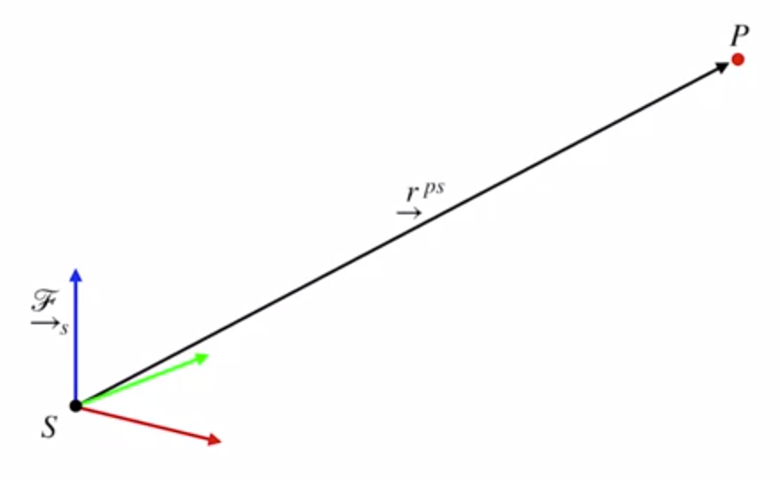

- Consider a second frame, S-prime, whose origin has been translated relative to S due to motion of the vehicle.
- Note that the basis vectors of frame S-prime are the same as the basis vectors of frame S. Only the origin has moved.

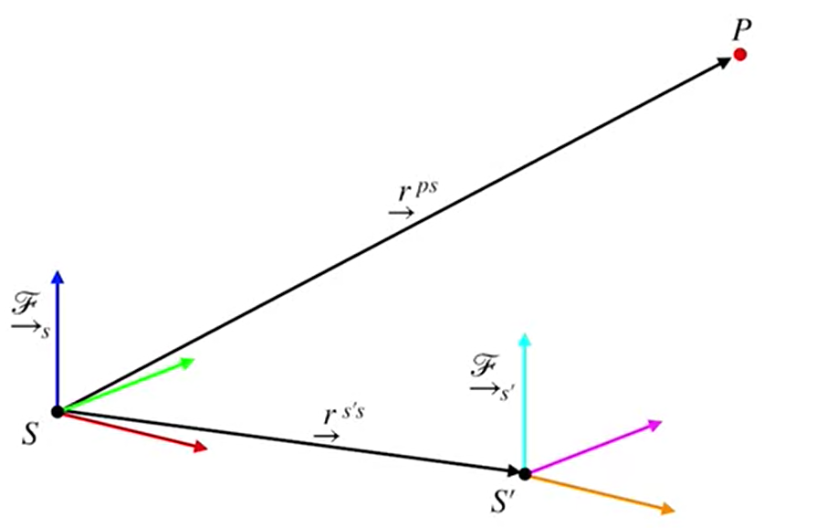

- We can draw another vector from the origin of S-prime to the point P
- We notice the resulting vector, indicated here, is just the tip to tail sum of the other two vectors.

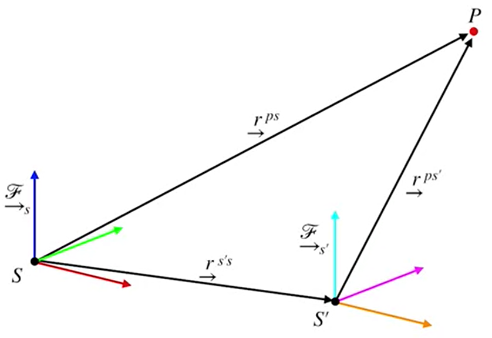

- And these vectors are just geometric objects until we express them in a coordinate system. 
- And what we're after are the coordinates of the point P in frame S-prime
- We can get these easily by just subtracting the frame-to-frame translation vector from the coordinates of P in frame S. 

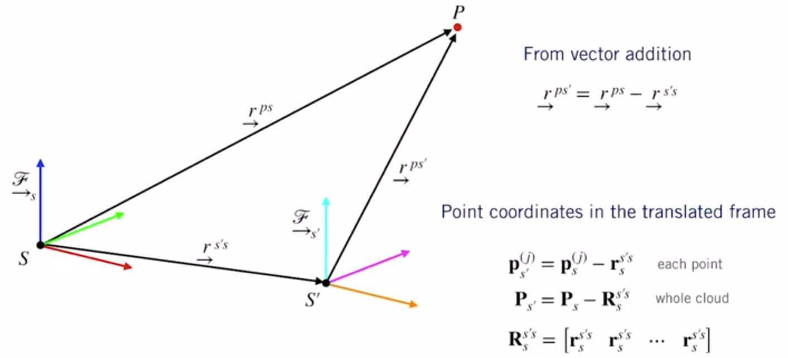

- This extends easily to a batch operation on the full point cloud by simply tiling the frame-to-frame translation in a big matrix R, and subtracting it from the point cloud matrix
- Depending on the language or linear algebra library you're using, you probably won't need to build this R matrix explicitly
- In Python, for example, the NumPy library is smart enough to repeat the frame-to-frame translation implicitly using broadcasting semantics

**Rotation** 

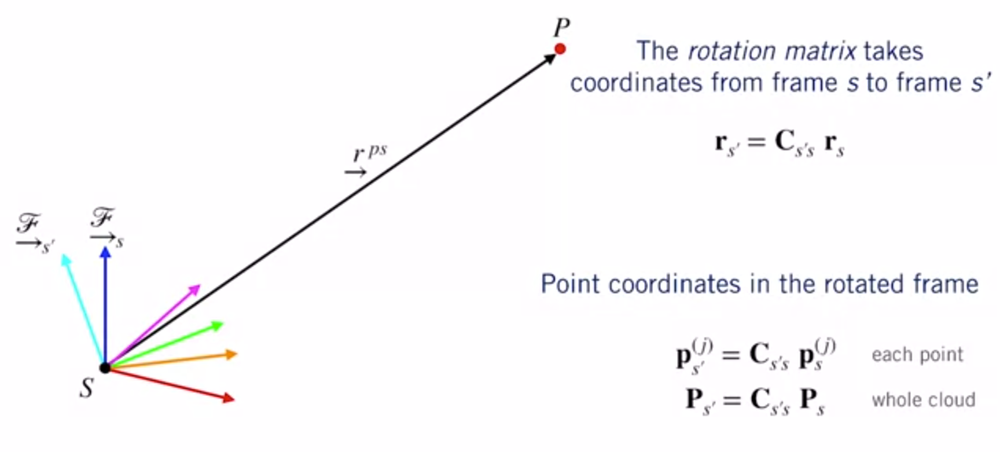

- Again, keep in mind that we're not changing the physical point P, only our view of it. 
- So in this case, we only have to think about one vector from the origin of frame S to P
- What does change in this case is actually the set of basis vectors we use to express the coordinates of the vector $S$ to $P$.
- Remember that the rotation matrix $C$ tells us how to find the coordinates of a vector in a rotated frame from the coordinates of the vector in the original frame.
- So if we know the rotation matrix from frame S to frame S-prime, all we have to do is multiply it against the coordinates of P in frame S to get the coordinates of P in frame S-prime. 
- To determine the coordinates of the entire rotated point cloud, the operation is exactly the same, thanks to the properties of matrix multiplication.

**Scaling**

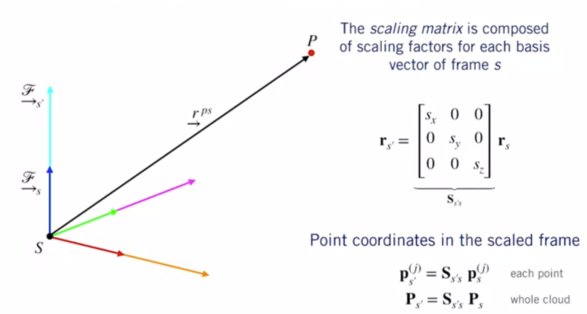

- Scaling, which works very similarly to rotation, but instead of changing the direction of the basis vectors in our coordinate system, we're changing their lengths
- Mathematically, this just means pre-multiplying the coordinates of each point by a diagonal matrix S whose non-zero elements are simply the desired scaling factors along each dimension.
- Often but not always these scaling factors are the same, and the matrix multiplication is equivalent to multiplying by a scaler.
- In these cases, we say that the scaling is isotropic or equal in every direction.
- We can use the same matrix multiplication for individual points or for the entire point cloud, just like we did for rotations.

**Putting Them All Together**

Usually, the transformations we're interested in are a combination of translation and rotation and sometimes scaling.

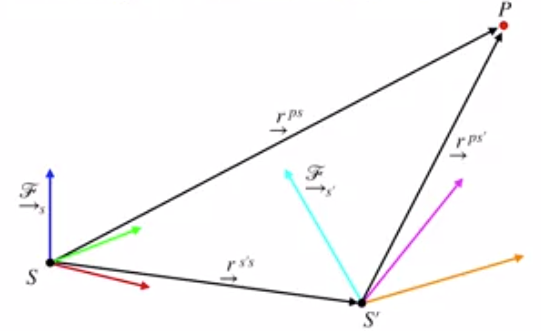

For example, we're often interested in estimating the translation and rotation that best aligns to point clouds so that we can estimate the motion of our self-driving car.

Fortunately for us, it's easy to combine all three operations into a single equation By first translating each vector, then rotating into the new frame, and finally applying any scaling.

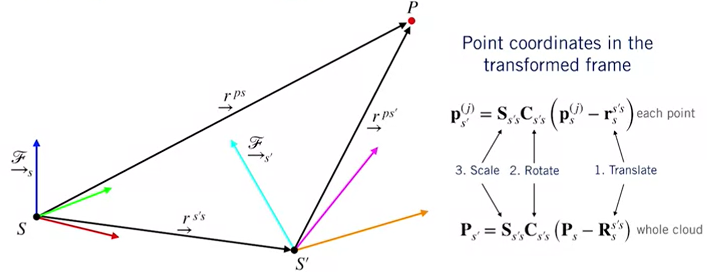

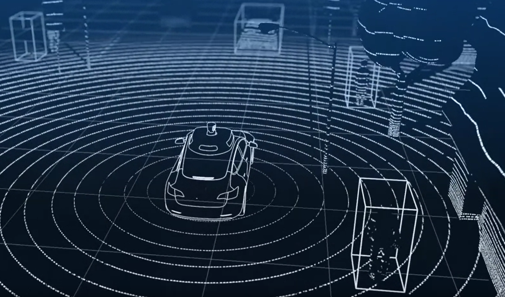

**Finding the Road with 3D Plan  Fitting**

- Allows to figuring out where the road surface is and predicting where it's going to be as the car continues driving 

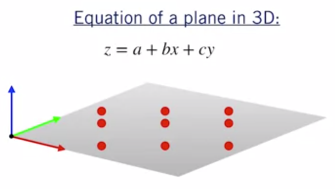

- The eq. of a plane in 3D, tells you how the height of the plane z changes as you move around in the x and y directions. 
- And it depends on three parameters, a, b, and c, which tells you the slope of the plane in each direction and where the z axis intersects the plane.

- So in our case, we have a bunch of measurements of x, y and z from our LIDAR point cloud, and we want to find values for the parameters a, b, and c that give us the plane of best fit through these points
- We'll start by defining a measurement error e for each point in the point cloud. And e is just going to be the difference between the predicted value of our dependent variable z-hat and the actual observed value of z.

- We get z-hat simply by plugging our current guess for the parameters a-hat, b-hat, and c-hat, and the actual values of x and y in
- In this case, the error, e, that we are considering, is for a bumpy road surface, for example. That is, a surface which is not exactly planar.

We can stack all of these error terms into matrix form so we have a big matrix of coefficients called a, multiplied by our parameter vector x, minus our stack measurements b.
- You can work out the matrix multiplication yourself to see that we get back the same measurement error equations we started out with.

Now, all we have to do is minimize the square of this error and we'll have our solution.
- This works exactly the same way as the resistor problem we worked through in module one.
- We can start by multiplying out the square to get a matrix polynomial in the parameter vector x.

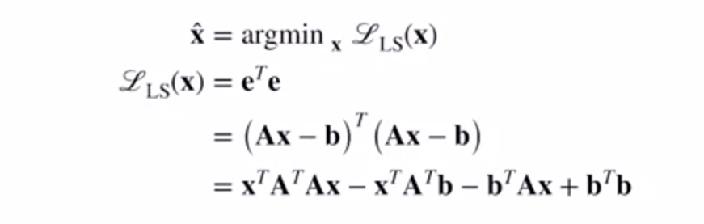

From there, we take the partial derivative of the squared error function with respect to the parameter vector x and set it to 0 to find the minimum. 

This gives us the linear system we'll need to solve to obtain the final least squares estimate.

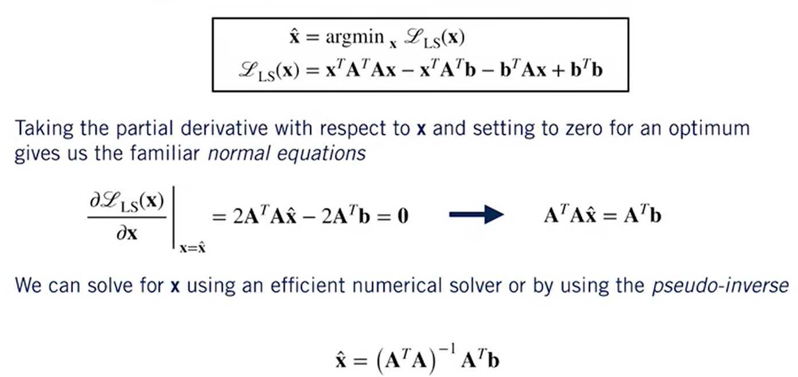

- We can solve this linear system using an efficient numerical solver like Python NumPy's solve function. Or just use the pseudo inverse to get our final answer for the plane parameters.
- One important thing to notice here is that we did not account for sensor noise in our x, y, zed measurements.
- All we've done is to find the plane of best fit through a set of points.
- It's certainly possible to set this problem up in a more sophisticated way that does account for sensor noise.
- You could use a batch approach similar to what we just discussed, or you could even think about including the road parameters in the column filter to estimate them on the fly as the sensor data comes in.
- The best solution for your self-driving application will depend on how much you trust your LIDAR data and how much thought you want to give to uncertainty in the road surface.
 
**The Point Cloud Library (PCL)**

**Summary**

- we've seen that point clouds are a way of capturing all of the measurements from a LIDAR scan. And they are often stored as a big matrix 
- We saw how we can use linear algebra to do useful operations on point clouds, like translating, rotating, and scaling.
- And we also saw how we can use the least squares algorithm to fit a 3D plane to a point cloud to find the road surface.
The Point Cloud Library, or PCL, implements a bunch of useful tools for working with point clouds in C++. 
One of the most useful algorithms in PCL is called the iterative closest point algorithm, or ICP, which is a common method for estimating the motion of a self-driving car using two LIDAR point clouds

### Lesson 2 Supplementary Reading: LIDAR Sensor Models and Point Clouds

To learn more about LIDAR sensor models and point clouds, check out the resources below:

- Read Chapter 6, Sections 1 and 2 of [Timothy D. Barfoot, State Estimation for Robotics (2016)](http://asrl.utias.utoronto.ca/~tdb/bib/barfoot_ser17.pdf) (available for free).

- Explore the functionality available in the Point Cloud Library (PCL) at http://pointclouds.org/.

### Lesson 3: Pose Estimation from LIDAR Data
### Lesson 3 Supplementary Reading: Pose Estimation from LIDAR Data
## Learn from Insdustry Experts
### Optimizing State Estimation
## Weekly Assignment
### Module 4: Graded Quiz

# References

# Appendices
