# Course-2 - W5 - MODULE 5 : Putting It together - An Autonomous Vehicle State Estimator

## Overview 
- This module combines materials from Modules 1-4 together, with the goal of developing a full vehicle state estimator. 
- Learners will build, using data from the CARLA simulator, an error-state extended Kalman filter-based estimator that incorporates GPS, IMU, and LIDAR measurements to determine the vehicle position and orientation on the road at a high update rate. 
- There will be an opportunity to observe what happens to the quality of the state estimate when one or more of the sensors either 'drop out' or are disabled.

**Course Objectives :**
- Apply filtering-based state estimation to determine the pose of a vehicle on the roadway
- Use LIDAR scan registration (to an existing map) to improve state estimates
- Test the effects of the loss of one or more sensors on the vehicle pose estimate

## State Estimation in Practice

**Learning Objectives**

- Now, that you've learned the basics of estimation theory, 3D geometry, and some common sensing modalities, it's time to put it into practice and think about how we can use all of these **tools** together to build an estimator we can use on a **real self-driving car**. 


- A real self-driving car like the autonomous will be equipped with many different kinds of sensors. For example, the autonomous is equipped with : `5 cameras`, a `3D LiDAR`, an `IMU`, `four radar units`, a `GPS` or `GNSS receiver`, and `a wheel encoder`. 

- All of these sensors give us different types of data at different rates. For example, the IMU might report accelerations and angular velocities 200 times per second, while the LiDAR completes a full scan only 20 times per second

- So, in this module, we're going to talk about how we can combine all the different information to get the best possible estimate of the vehicle state. This process is called `sensor fusion` and it's one of the most important techniques for self-driving cars. 

- But in order to do sensor fusion, we also need to **calibrate** our sensors to ensure that the sensor models are accurate and so that we know how the reference frames of all of the sensors are related to each other. 

- We'll also discuss what happens when one or more `sensors fails` and give you an overview of the final project where you'll have an opportunity to implement a full vehicle state estimator using sensors in the Carla simulator. 
- We'll give you a bird's-eye view of some practical considerations you should take into account when designing systems for self-driving cars
  - `sensor fusion`
  - `calibration`
  - `speed and accuracy requirements` 
  - `localization failures` 
  - how to cope(manage) with parts of the environment that are moving and changing around us. 
### Lesson 1: State Estimation in Practice

**State Estimation with Multiple Sensors**


- Starting with `sensor fusion`. If we have a car like the autonomous that's equipped with a number of different sensors, what we would like to do is figure out how to combine all of this different information to get the best possible estimate of the vehicle state.
  
- It might seem like a daunting task to fuse all of this data, but in fact, we already have the tools to do this. 

- In lesson two of this module, we'll discuss exactly how we can use the familiar tools like the extended Kalman filter(EKF) to combine all of the sensor data into a single consistent estimate of the vehicle state. 

**Calibration**

In order to do `sensor fusion`, we first need to know some things about our sensors and how they're configured on board the vehicle. 

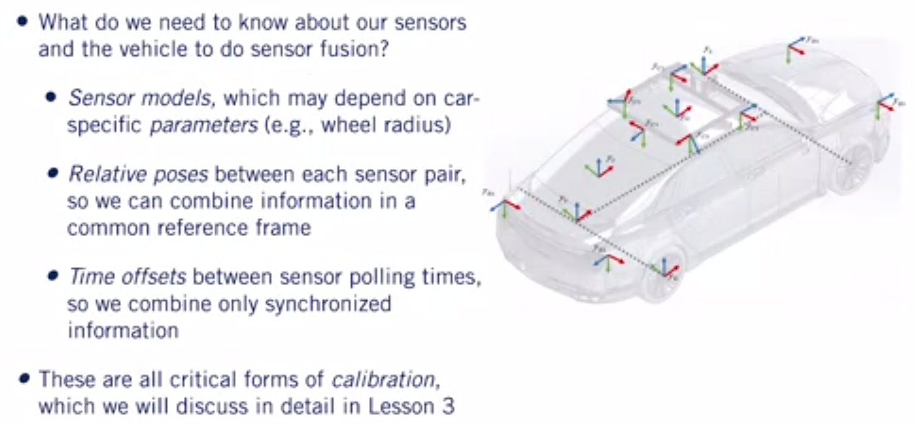

- Our sensor models might depend on parameters that are specific to the car or to th e sensor itself. A good example of this is using **wheel encoders** to measure the forward speed of the car. 
- A wheel encoder measures the angular velocity of the axle. But if we want to use that to get the forward velocity of the vehicle, we also need to know the radius of a tire. 
- Another thing we need to know about the vehicle is the pose or position and orientation of each sensor relative to the vehicle reference frame. 
- Because we're combining information from sensors located in different places, we need to know how to transform all of the measurements so they're expressed in a common reference frame. 
- Finally, we need to think about how well our sensor measurements are synchronized so that we can fuse them all properly. 
- Intuitively, you might expect that directly combining a LiDAR scan you just received with a GPS measurement you received, say, five seconds ago, won't produce as good of a result as if the LiDAR scan and the GPS measurement were taken at the same time. 
- So, the more accurately you can synchronize your sensors, the better your state estimate will be. 
- A part of this involves determining the time offset between when the sensor records a measurement and when the estimator receives it for processing. 
- 
All of these factors are critical forms of calibration which we'll discuss in more detail in lesson three. 

**Accuracy Requirements**

*How accurate does a estimator need to be for a self-driving car to drive safely on the road?* 


- Well, it depends on the size of the car, the width of the lanes, and the density of traffic, but to get a ballpark estimate, you might consider the margin of error available for a task leak lane keeping. 
- A typical car is about $1.8 m$ wide, an average highway lane might be about $3 m$ wide, give or take. 
- So, our estimator would need to be good enough to position the car within $60 cm$ or so on either side of the lane. That's assuming we know exactly where the lanes are and that there's no traffic. 
- For comparison, an optimistic range for GPS accuracy is between ( $1$ and $5 m$ ) depending on the specific hardware, the number of satellites that are visible, and other factors. 
- So, clearly, GPS alone is not enough even for lane keeping. This is one important reason why we'll need to combine information from many different sensors. 

**Speed Requirements**


*How fast we need to update the vehicles states whether the car can react to rapidly changing environments or unexpected events?*

- Well, this all depends on what kind of environment the car is operating in. Imagine that you're driving a car with your eyes closed, and you open your eyes exactly once every second to take a look at what's around you and make some adjustments. 
- This corresponds to an update rate of $1Hz$ . For driving down a street country road with no traffic in sight, maybe you'll feel relatively safe doing this. 

*But what if you're driving through a busy city intersection with dozens of other cars, and buses, and cyclists, and pedestrians around you?*

- You would probably feel much less safe opening your eyes once a second. As a rule of thumb, an update rate of $15 Hz$ to $30 Hz$ is a reasonable target for self-driving. But of course, there's a trade-off to think about here. 
- A self-driving car will only have so much on-board computing power available and the computer will need to juggle many different processes like **control** and **path planning** and **perception** in addition to **state estimation**. 

- What's more, the total amount of compute power available on board may be limited by restrictions on how much power the computer is actually allowed to consume. 
- Produce state estimation with fixed computational resources, there's a trade-off between how complicated our algorithms can be and the amount of time are allowed to spend computing a solution. 

```It's up to you as a self-driving car engineer to decide where your car is going to be on this trade off curve.``` 

**Localization Failures**

*Even if we had a fast and accurate estimation algorithm, there are going to be cases where our localization might fail. How could this happen? Well*


- For one thing, we might have one or more of our sensors report bad data or maybe even fail entirely. 

- A good example of this is GPS which doesn't work at all in tunnels and which can have a difficult time coping with reflected signals in cities with a lot of tall buildings. 

- We might also encounter errors in our state estimation algorithm itself. 

- For example, if we're using an extended common filter with a highly nonlinear sensor model, we might find that the inherent linearization error in the estimator means that we can lose accuracy in our state estimate even though the estimator is pretty confident in its output. Or maybe, our estimator is not very confident at all. 

- ``` Thinking back to the Kalman filter equations, you might remember that the uncertainty in our state grows as we propagate forward through the motion model and it only shrinks once we incorporate outside observations from LiDAR or GPS for example```

*If our LiDAR is broken and we're driving in a tunnel without GPS, how long can we rely on an IMU and a motion model before our estate uncertainty grows too large and it's no longer safe to drive?*

- We'll talk about strategies for detecting and coping with localization failures like these in lesson four. 

**Our Dynamic World**


- Finally, we need to think about the world the car lives in. For the most part, we've developed our models for sensors like LiDAR under the assumption that the world is static and unchanging. But of course, in reality, the world is always moving and changing. 

- For example, other **cars, pedestrians, and cyclists** are probably moving. **Lighting changes over the course of a day** and even **the geometry of the world can change with the seasons**. 

- One of the big challenges for self-driving cars is finding ways to account for these kinds of changes, whether by modeling them or by finding ways of identifying and ignoring objects that violate our assumptions. In fact, this is still a very active area of research. 

**Summary**

- State estimation in practice will typically rely on sensor fusion to combine information from many different kinds of sensors, like **IMUs, LiDAR, cameras, and GPS or GNSS receivers**. 
- In order for `sensor fusion to work` as intended, we need to `calibrate` the sensors by determining the parameters of our sensor models. 
- The relative positions and orientations of all of the sensors and any differences in polling times. 
- We also need to consider trade-offs between speed and accuracy in our algorithms which may be different depending on the type of self-driving car you're working on. 
- Ask yourself, how accurately do I need to know the vehicle state and how often do I need to update it for my particular use case? 
- Finally, we need to think about how to safely cope with localization failures and aspects of the world that do not conform to our assumptions such as moving objects. 

### Lesson 2: Multisensor Fusion for State Estimation

Let's put everything together :  


- In this lesson, we'll derive an error state Extended Kalman Filter that estimates position, velocity, and orientation of a self-driving car using an IMU, a GNSS receiver, and a LIDAR. 
- Although we'll make some simplifications, the basic structure of our pipeline will resemble one used in modern self-driving vehicles. 

**Why use GNSS with IMU & LIDAR**

*Before we dive into the algorithm details, it's always useful to take a step back and ask, why use these sensors? Can we do something more simple?*


- In our case, we'll be using an IMU with a GNSS receiver, and a LIDAR for several reasons. 

- First, whenever we fuse information for the purpose of state estimation, one important factor to consider, is whether or not the errors from different sensors will be correlated. 
- In other words, if one fails, is the other likely to fail as well. In this case, all three of our sensors use different measurement methods, and are unlikely to fail for the same reason. 
- Second, we should try our best to choose sensors that are complimentary in nature. In our case, the IMU acts as a high-rate smoother of GPS or GNSS position estimates, and GNSS data can mitigate errors that are due to IMU drift.
- It's also possible to use wheel odometry for this purpose. In this lecture, we'll stick to IMUs, as they can provide full position and orientation information in three-dimensions.Whereas wheel odometry is limited to two-dimensions. 
- Finally, LIDAR can compliment GNSS information, by providing very accurate position estimates within a known map and in sky obstructed locations. Conversely, GNSS can tell LIDAR which map to use when localizing. 

**Tightly vs Loseky Coupled**

For the purposes of EKF state estimation, we can implement either what's called a `loosely coupled` or a `tightly coupled` estimator.


- In a `tightly coupled EKF`, we use the raw pseudo range and point cloud measurements from our GNSS and LIDAR as observations. 

- In a `loosely coupled system`, we assume that this data has already been preprocessed to produce a noisy position estimate. 

Although the tightly coupled approach can lead to more accurate localization, it's often tedious to implement and requires a lot of tuning. For this reason, we'll implement a loosely coupled EKF here. 

**EKF : IMU + GNSS + LIDAR**

Here you can see a graphical representation of our system. 


We'll use the IMU measurements as noisy inputs to our motion model. 

This will give us our predicted state, which will update every time we have an IMU measurement. This can happen hundreds of times a second. 

At a much slower rate, we'll incorporate GNSS and LIDAR measurements whenever they become available, say once a second or slower, and use them to correct our predicted state. 

**Some preliminaries**


So what is our state? For our purposes, we'll use a 10-dimensional state vector that includes a 3D position, a 3D velocity, and a 4D unit quaternion that will represent the orientation of our vehicle with respect to a navigation frame. 


We'll assume that our IMU output specific forces and rotational rates in the sensor frame, and combine them into a single input vector $u$. 

It's also important to point out that we're not going to track accelerometer or gyroscope biases. 

These are often put into the state vector, estimated, and then subtracted off of the IMU measurements. For clarity, we'll emit them here and assume our IMU measurements are unbiased. 

**Motion Model**

Our motion model for the position, velocity and orientation will integrate the proper accelerations and rotational rates from our IMU.


The position update looks like this. Next is the velocity update and finally the orientation or quaternion update. We'll need to use several definitions as shown below. 

Remember that our quaternion will keep track of the orientation of our sensor frame s, with respect to our navigation frame n. Notice that the incremental orientation updates are applied via quaternion multiplication. 

Where the orientation change, that is the quaternion form of small omega times delta t, appears on the right-hand side because the orientation change is measured in the local sensor frame. 

**Linearized Motion Model**


Because of the orientation parameters, which we express as a rotation matrix, our motion model is not linear.

To use it in our EKF, we'll need to linearize it with respect to some small error or perturbation about our predicted state. 

To do this, we'll define an error state that consists of $\delta_{p}$ , $\delta_{v}$ and delta phi. Where $\delta_{phi}$ is a three by one orientation error. 

There are some advantages to representing the orientation error in the global or navigation frame, rather than in the local frame. So we'll proceed accordingly. 

This choice will impact the derivation of our Jacobian matrices, and also the exact form of the error state update. 

Using this error state, we can derive the aerodynamics with the appropriate Jacobians. 

**Measurement Model - GNSS**

For our measurement model, we'll use a very simple observation of the position, plus some additive Gaussian noise. 


We'll define a covariance $R$ sub GNSS for the GNSS position noise, and R sub LIDAR for our LIDAR position measurement noise. 


It's important here to note that we've assumed that our LIDAR and GNSS will supply position measurements in the same coordinate frame. 

In a realistic implementation, the GNSS position estimates may serve as a way to select a known map against which the LIDAR data can then be compared. 

With these definitions in mind, we can now describe our Extended Kalman Filter. 


Our filter will loop every time an IMU measurement occurs. We'll first use the motion model to predict a new state based on our last state. 

The last state may be a fully corrected state, or one that was also propagated using the motion model only.

Depending on whether or not we received the GNSS or LIDAR measurement at the last time step. 

Next, we'll propagate the state uncertainty through our linearized motion model. Again accounting for whether or not our previous state was corrected or uncorrected.


At this point if we don't have any GNSS or LIDAR measurements available, we can repeat steps one and two. 
 


If we do, we'll first compute the Kalman gain that is appropriate for the given observation. We'll then compute an error state that we will use to correct our predicted state. 
 
This error state is based on the product of the Kalman gain, and the difference between the predicted and observed position. 


We will then correct our predicted state using our error state. This correction is straightforward for a position of velocity. But some more complicated algebra is required to correct the quaternion. 
 
We'll need this special update because the quaternion is a constrained quantity that is not a simple vector. We have chosen to use a global orientation error. 

This means that the orientation update involves multiplying by the error state quaternion on the left. 

This is different from the propagation step, where we multiplied by the incremental quaternion defining the orientation change on the right. 


You should pay careful attention to this when completing the final project for this course. 


Finally, we'll update our state covariance in the usual way. That's it. There you have it. Your very own `localization pipeline`. 

If you followed everything up until now, congratulations. You're well on your way to becoming a *localization guru*. 

**Summary**

Before we end this lesson, let's review a few of the assumptions we've made when putting our pipeline together. 


- We used a loosely coupled Extended Kalman Filter framework to fuse inertial measurements from an IMU together with the position measurements from a GNSS receiver and LIDAR. 
 
- We assume that the GNSS and LIDAR provided us with position estimates in the same coordinate frame, which requires some preprocessing, but is possible to do in a realistic implementation. Second, we did not account for accelerometer or gyroscope biases in our IMU measurements. 
 
- This simplified our algebra, but is not a realistic assumption. Luckily, if you followed along with what we've done here, adding biases is not a significant leap.
 
 
- Next, we did discuss Filter State initialization. This is often taken to be some known state at the start of the localization process. 
  
- Finally, we also assumed that our sensors were all spatially and temporally aligned. 

- We assumed that our sensors were calibrated, in the sense that we didn't worry about varying time steps or how we can get several sets of measurements all aligned into one coordinate frame. 
  
- Performing this ladder step is a very important part of constructing an accurate localization pipeline. We'll discuss it next.
### Lesson 2 Supplementary Reading: Multisensor Fusion for State Estimation

To learn more about Multisensor fusion, check out the resources below:

- Read Sections 5.1-5.4 and Section 6.1 of a technical report by [Joan Solà, Quaternion kinematics for the error-state Kalman filter, 2017](https://arxiv.org/pdf/1711.02508.pdf) (available for free). Note that this is an advanced reading.

- Read a [research paper](https://www.sciencedirect.com/science/article/pii/S2405896317323674) by Jay Farrell and Paul Roysdon that provides a tutorial for autonomous driving state estimation.

- Read a [Medium article](https://medium.com/@wilburdes/sensor-fusion-algorithms-for-autonomous-driving-part-1-the-kalman-filter-and-extended-kalman-a4eab8a833dd) about sensor fusion algorithms for autonomous driving (Kalman filters and extended Kalman filters).

- Review an [article](https://www.technologyreview.com/s/608321/this-image-is-why-self-driving-cars-come-loaded-with-many-types-of-sensors/) from MIT Technology Review that explains the need for sensor fusion to enable robust autonomous driving.


### Lesson 3: Sensor Calibration - A Necessary Evil

Now that we've seen how we can combine multiple sources of sensor data to estimate the vehicle state, it's time to address a topic that we've so far been sweeping under the rug.

That topic is Sensor Calibration, and it's one of those things that engineers don't really like talking about but it's absolutely essential for doing state estimation properly. 

Personally, calibration is near and dear to me since my doctoral research focused on calibration for cameras and IMUs, and it's a topic that my students are continuing to research today.

In this video, we'll discuss the three main types of sensor calibration and why we need to think about them when we're designing a state estimator for a self-driving car. 

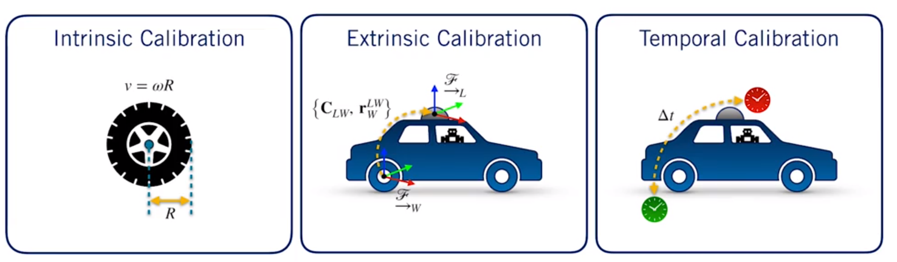

The three main types of calibration will talk about are : 
- Intrinsic calibration : which deals with sensors specific parameters
- extrinsic calibration : which deals with how the sensors are positioned and oriented on the vehicle
- Temporal calibration : which deals with the time offset between different sensor measurements. 

**Intrinsic Sensor Calibration**

In intrinsic calibration, we want to determine the fixed parameters of our sensor models, so that we can use them in an estimator like an extended Kalman filter.

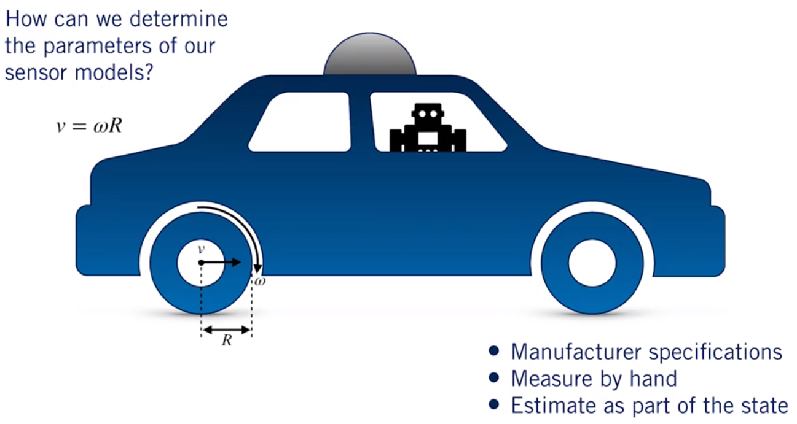

Every sensor has parameters associated with it that are unique to that specific sensor and are typically expected to be constant. For example, we might have an encoder attached to one axle of the car that measures the wheel rotation rate omega. 

If we want to use omega ( $\omega$ ) to estimate the forward velocity $v$ of the wheel, we would need to know the radius $R$ of the wheel, so that we can use this in the equation $v$ equals omega times $R$ . 

In this case, $R$ is a parameter of the sensor model that is specific to the wheel the encoder is attached to and we might have a different R for a different wheel. 

Another example of an intrinsic sensor parameter is the elevation angle of a scan line in a LiDAR sensor like the Velodyne. 

The elevation angle is a fixed quantity but we need to know it ahead of time so that we can properly interpret each scan. So, how do we determine intrinsic parameters like these? Well, there are a few practical strategies for doing this. 

The easiest one is just let the manufacturer do it for you. Often, sensors are calibrated in the factory and come with a spec sheet that tells you all the numbers you need to plug into your model to make sense of the measurements. 

This is usually a good starting point but it won't always be good enough to do really accurate state estimation because no two sensors are exactly alike and there'll be some variation in the true values of the parameters. 

Another easy strategy that involves a little more work is to try measuring these parameters by hand. This is pretty straightforward for something like a tire, but not so straightforward for something like a LiDAR where it's not exactly practical to poke around with a protractor inside the sensor. 

A more sophisticated approach involves estimating the intrinsic parameters as part of the vehicle state, either on the fly or more commonly as a special calibration step before putting the sensors into operation. 

This approach has the advantage of producing an accurate calibration that's specific to the particular sensor and can also be formulated in a way that can handle the parameters varying slowly over time. 

For example, if you continually estimate the radius of your tires, this could be a good way of detecting when you have a flat. 
**Calibration by Estimation**

Now, because the estimators we've talked about in this course are general purpose, we already have the tools to do this kind of automatic calibration. 

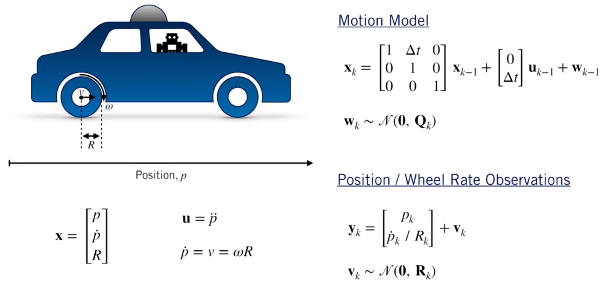

- To see how this works, let's come back to our example of a car moving in one dimension. So, we've attached an encoder to the back wheel to measure the wheel rotation rate. 

- If we want to estimate the wheel radius along with position and velocity, all we need to do is add it to the state vector and work out what the new motion and observation model should be. 

- For the motion model, everything is the same as before except now there's an extra row and column in the matrix that says that the wheel radius should stay constant from one time step to the next. 

- For the observation model, we're still observing position directly through GPS but now we're also observing the wheel rotation rate through the encoder. 

- So, we include the extra non-linear observation in the model. From here, we can use the extended or unscented Kalman filter to estimate the wheel radius along with the position and velocity of the vehicle. 
- 
**Extrinsic Sensor Calibration**

So, intrinsic calibration is essential for doing state estimation with even a single sensor. But extrinsic calibration is equally important for fusing information from multiple sensors. 

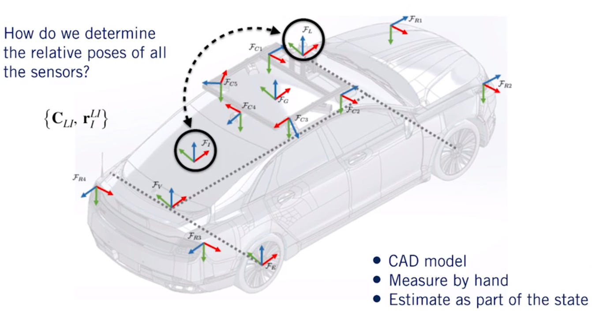

In extrinsic calibration, we're interested in determining the relative poses of all of the sensors usually with respect to the vehicle frame. 

For example, we need to know the relative pose of the IMU and the LiDAR. So, the rates reported by the IMU are expressed in the same coordinate system as the LiDAR point clouds. 

Just like with intrinsic calibration, there are different techniques for doing extrinsic calibration. 

If you're lucky, you might have access to an accurate CAD model of the vehicle like this one, where all of the sensor frames have been nicely laid out for you. 

If you're less lucky, you might be tempted to try measuring by hand. Unfortunately, this is often difficult or impossible to do accurately since many sensors have the origin of their coordinate system inside the sensor itself, and you probably don't want to dismantle your car and all of the sensors. 

Fortunately, we can use a similar trick to estimate the extrinsic parameters by including them in our state. 

This can become a bit complicated for arbitrary sensor configurations, and there is still a lot of research being done into different techniques for doing this reliably. 

**Temporal Calibration** 

Finally, an often overlooked but still important type of calibration is temporal calibration. 

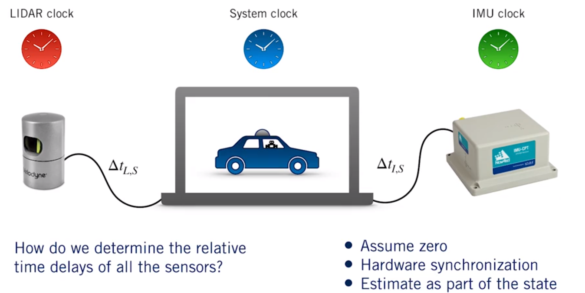

In all of our discussion of multisensory fusion, we've been implicitly assuming that all of the measurements we've combined are captured exactly the same moment in time or at least close enough for a given level of accuracy. 

*But how do we decide whether two measurements are close enough to be considered synchronized?*

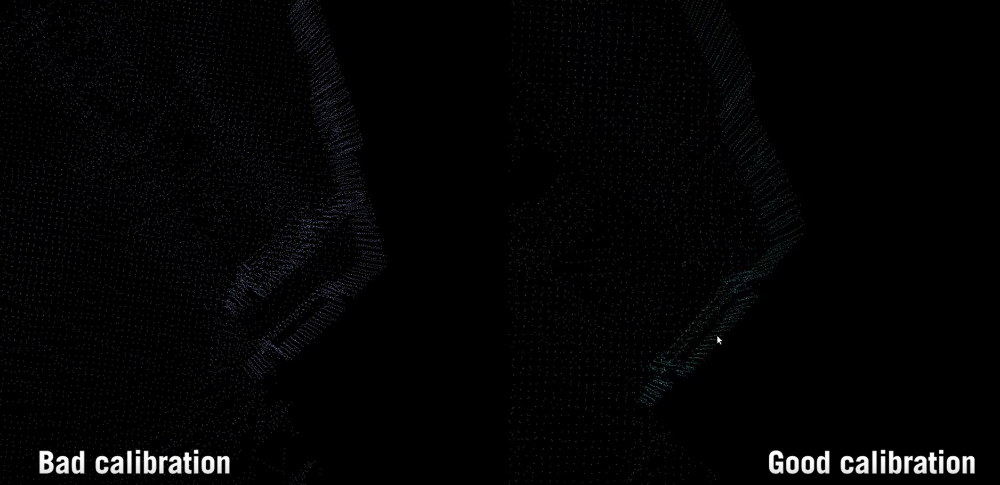

- Well, the obvious thing to do would just be to timestamp each measurement when the on-board computer receives it, and match up the measurements that are closest to each other. 

- For example, if we get LiDAR scans at $15 Hz$ and IMU readings at $200 Hz$, we might want to pair each LiDAR scan with the IMU reading whose timestamp is **the closest match**. 

- But in reality, there's an unknown delay between when the LiDAR or IMU actually records an observation and when it arrives at the computer. 

- These delays can be caused by the time it takes for the sensor data to be transmitted to the host computer, or by pre-processing steps performed by the sensor circuitry, and the delay can be different for different sensors. 

So, if we want to get a really accurate state estimate, we need to think about how well our sensors are actually synchronized, and there are different ways to approach this. 

The simplest and most common thing to do is just to assume the delay is zero. You can still get a working estimator this way, but the results may be less accurate than what you would get with a better temporal calibration. 

Another common strategy is to use hardware timing signals to synchronize the sensors, but this is often an option only for more expensive sensor setups.

As you may have guessed, it's also possible to try estimating these time delays as part of the vehicle state, but this can get complicated. 

```In fact, an entire chapter of my PhD dissertation was dedicated to solving this temporal calibration problem for a camera IMU pair.```

So, we have seen the different types of calibration we should be thinking about when designing an estimator for a self-driving car, but how much of a difference does good calibration really make in practice? 

Here's a video comparing the results of good calibration and bad calibration for a LiDAR mapping task. 

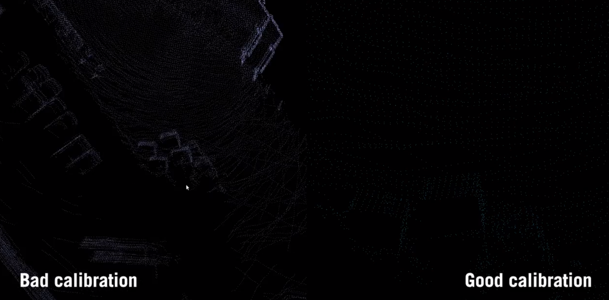

- You'll notice in the video that the point cloud in the calibrated case is much more crisp than the point cloud in the uncalibrated case. 
- In the uncalibrated case, the point cloud is fuzzy, it's smeared and you may see objects that are repeated or objects that are in fact entirely missed, because the LiDAR is not correctly aligned with the inertial sensor. 

**Summary**

- Sensor fusion is impossible without calibration. In this video, you learned about intrinsic calibration, which deals with calibrating the parameters of our sensor models. 
- Extrinsic calibration, which gives us the coordinate transformations we need to transform sensor measurements into a common reference frame. 
- Temporal calibration, which deals with synchronizing measurements to ensure they all correspond to the same vehicle state. 
- While there are some standard techniques for solving all of these problems, calibration is still very much an active area of research. 
- In the next video, we'll take a look at what happens when one or more of our sensors fails, and how we can ensure that a self-driving car is able to continue to operate safely in these cases.

### Lesson 3 Supplementary Reading: Sensor Calibration - A Necessary Evil

For more information on sensor calibration, check out the resources below:

- Read an [interesting article](https://www.rscal.com/all-you-need-to-know-about-sensor-calibration/) on why sensor calibration is necessary.

- Read a [blog post](https://aimotive.com/blog/content/1227) from AImotive about the need for sensor spatial calibration and temporal synchronization.

- Explore the [cloud-based calibration](http://apollo.auto/platform/perception.html) service for self-driving cars provided by Baidu's Apollo initiative.


### Lesson 4: Loss of One or More Sensors

If you've ever had to create any sort of moving robotics platform, you'll probably recall how finicky any piece of hardware can be. Sensing hardware is no different. 

In long-term autonomy applications like self-driving vehicles, sensors can malfunction or dropout for a number of different reasons, like weather damage, firmware failures, or something as simple as a loose wire. 

We've seen in this module that even if all of our sensors are working normally, it's still beneficial to have multiple complimentary sensors to provide robust accurate localization estimates. 

*But what happens if one of the sensors fails?* 
- So far, we've discussed **GNSS receivers, IMUs, and Lidars**, but most modern autonomous vehicles also includes **sensors like wheel encoders, radar, sonar, and multiple cameras.** 
  
**Multiple Sensors are Essential**

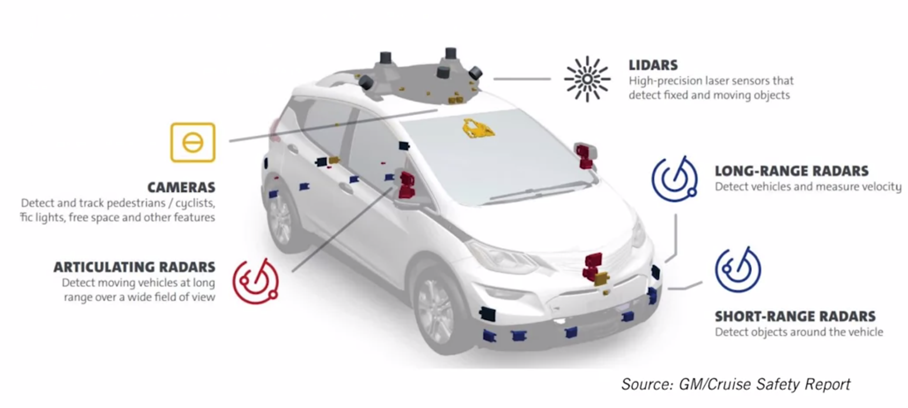

In order to build a safe vehicle, it's crucial to understand and characterize what happens when one or more sensors malfunctions, and the minimal sensing we need to maintain safe operation. 


In this lesson, we'll discuss the importance of sensor redundancy for robust localization and explore several examples of sensing failures in localization. 

One important consideration for this type of analysis is sensor range and operating limitations.

**Sensing Failures**

A GNSS receiver will not work under a bridge and may have reduced accuracy between tall buildings. An IMU may be sensitive to temperature and may require periodic recalibration.

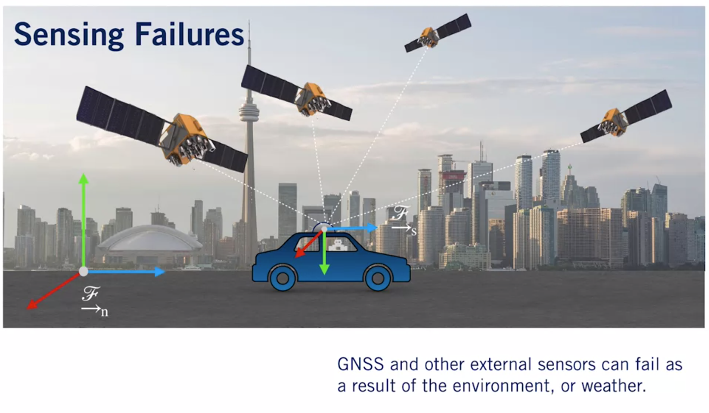

**Sensors Measurement Ranges**

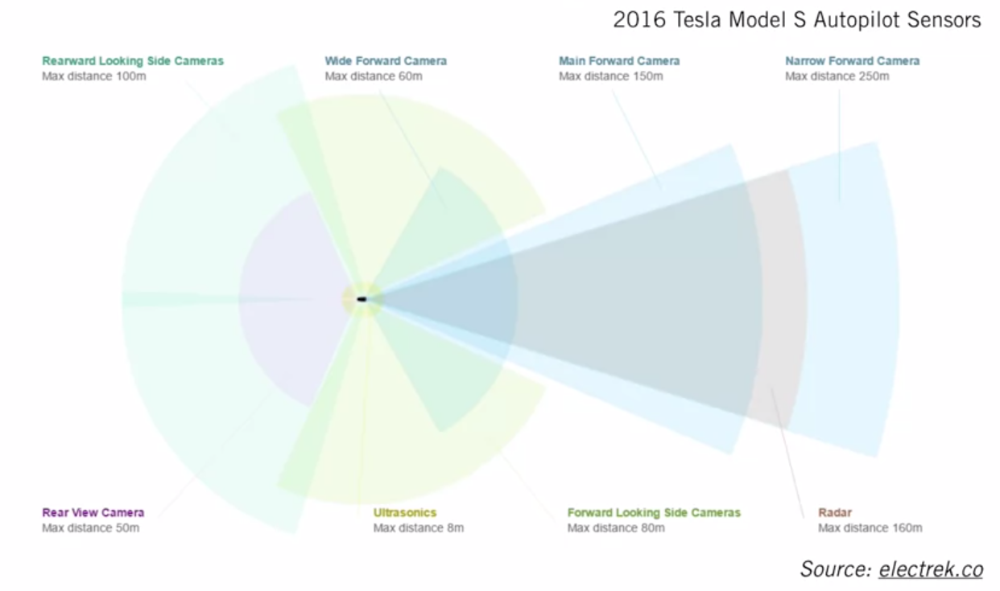

What's more, for sensors that observe the external world like Lidars, sonar, cameras, or radars, their sensing range plays a very important role in safe operation. 

Most cars have long, medium, and short range sensing. If one of these malfunctions, it's often important to restrict movement so the malfunction doesn't affect safety. 

For example, in localization, we may use short range sensors for parking and to ensure we're not colliding with nearby vehicles. Medium range sensors may help in pedestrian and cyclist detection and in lane keeping. 

Longer range sensors can help us detect and predict the motion of approaching distant obstacles. 

If one of these fails, we have to take appropriate action to ensure that the safety of the car occupants or the people around us is not compromised.

This means that a self-driving car engineer will have to consider the minimal allowable sensing equipment necessary to perform each of these steps. 

**Redudant Systems: 777 PFC**

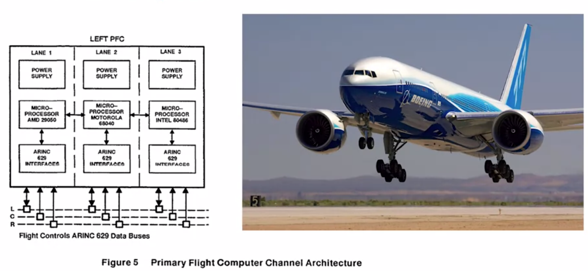

For this type of redundant system design, we can look at examples from an industry known for its rigorous safety standards, commercial aviation. 

As an example of a redundant system, consider the primary flight computer of the Boeing 777. The 777 operates on a triple redundancy principle. 

All major systems, including this flight computer, have two backups, each with independent power and separate programming and specifications. 

Here you can see that each of the flight computers has a different processor to ensure that a bug in the architecture itself doesn't affect all three computers. 

If one of the computers fails or malfunctions, the 777 uses a consensus algorithm to seamlessly switch to another one.

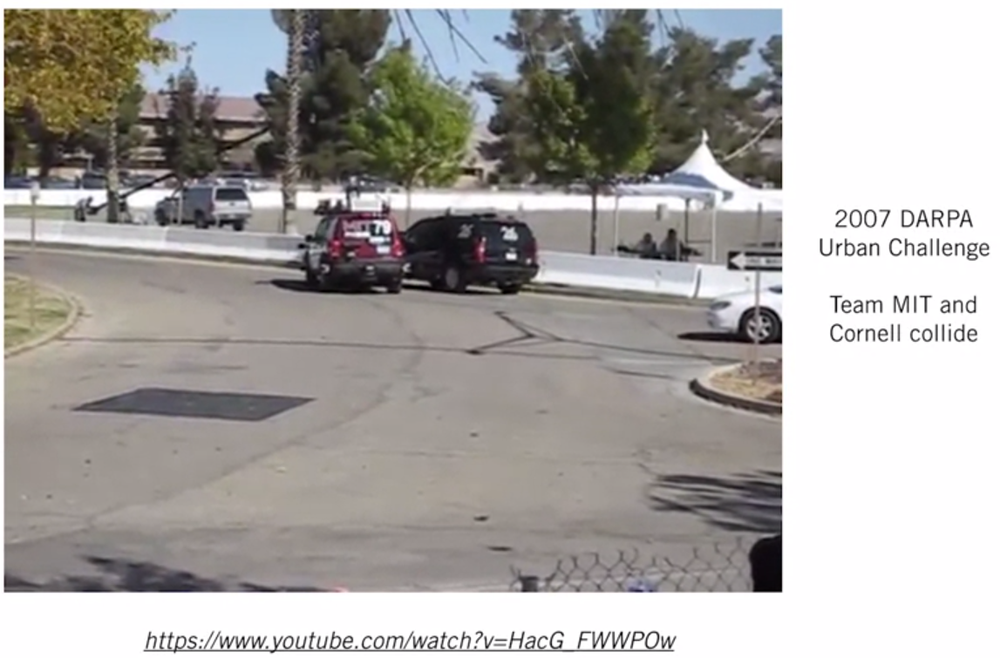

Although self-driving technology has come a long way, we're still only a decade beyond some of the first self-driving challenges, like the 2007 DARPA Urban Challenge. 

Here you can see how a lack of safety redundancy leads the MIT and Cornell teams to crash into each other. If this crash occurred at higher speeds, the results may have been much worse. 

Taking a more recent example, here's a car from the 2015 International Driver's Vehicle Conference that fails to apply its autonomous breaking appropriately and crashes into a blown-up kangaroo. 

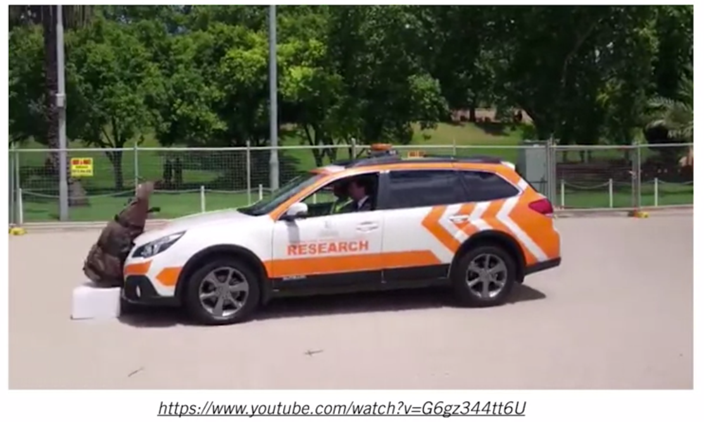

Finally, consider this now infamous recording of a Tesla Model S driving almost straight into a dividing barrier on a freeway in California. 

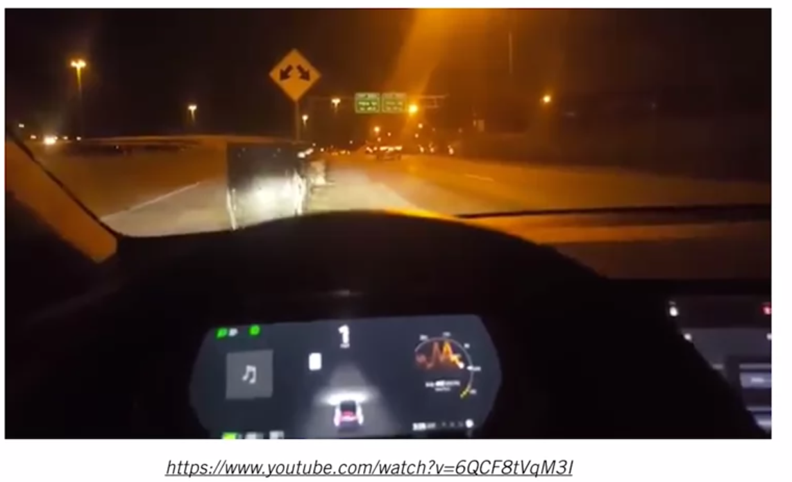

This was a sobering reminder that it is crucial for the engineers and architects who design self-driving vehicles, to carefully consider and characterize the different failure modes of the different sensing paradigms used in order to assure that one malfunctioning component doesn't cause tragedy. 

**Summary**

It's always important to consider the limitations of any set of sensors and use `multiple complimentary sensors for robust localization`. 


## Learn From Industry Expert
### The Challenges of State Estimation
## Final Project: Vehicle State Estimation on a Roadway
### Final Lesson: Project Overview
## Lesson3-Congratulations 
### Your Learning Journey
### Congratulations on Completing Course 2!

# References

# Appendices

