# Course-3 - W1 - MODULE 0 : Visual Perception for Self-Driving Cars

## Overview 

- This module introduces the main concepts from the broad and exciting field of computer vision needed to progress through perception methods for self-driving vehicles. 
- The main components include camera models and their calibration, monocular and stereo vision, projective geometry, and convolution operations.  

**Learning  Objectives**

- Review the layout of the courses in the Specialization
- Review the main projects offered in this course

## Course Introduction
### Welcome to the Self-Driving Cars Specialization!
- ok  

### Welcome to the course 

- Camera is one of the most versatile sensors for the self-driving car. `Cameras act as the eyes of the self-driving car`. 
- The cars use cameras to detect agents on the road, model their movement, and model their behaviors. 
- Images from the camera can also be used to detect and localized road markings, signals, and signs to allow for safe and lawful driving behavior. 
- `We can use cameras for localization similar to the LIDAR sensors`. 
- By the end of this course, you'll be able to use and calibrate these cameras to build a `baseline perception stack` for self-driving cars

- **MODULE 1 : Basics Of 3D Computer Vision**
  - Image formation
  - Camera Projective Geometry
  - Camera Calibration 
  - Visual Depth Perception
  - Image filtering

- **MODULE 2 : Visual Features**
  - Image features
    - Detection
    - Description
    - Matching
  - Visual Odometry 

- **MODULE 3 : FeedForward & Convolutional Neural Network**
  - Feedforward neural networks
  - how to train these networks 
  - how to evaluate their performance. 
  - you will learn about a special type of feedforward neural network,
  - Convolutional neural networks
  - That are tailored to process images from cameras

- **MODULE 4 : Use Neural networks to perform 2D object detection**
  - Use Neural networks to perform 2D object detection, classification and regression task. 
  - You will learn how to formulate the 2D object detection problem, 
  - how to evaluate 2D object detection models, 
  - how to build neural networks that perform the 2D object detection task, 
  - and how to use the output of 2D object detectors in the context to self-driving cars. 
  - Specifically, you will use 2D object detection results to predict 3D position and track objects of interest in road scenes. 

- **MODULE 5 : Semantic segmentation** 
  - You will learn to formulate the semantic segmentation problem, evaluate semantic segmentation models, 
  - and perform semantic segmentation tasks using convolutional neural networks.  
  - Finally, you will learn how to use semantic segmentation output to perform drivable space estimation and line boundary detection

- **MODULE 6 : Final Project**
  - For the final week of the course, you will apply everything you've learned to the final course project. 
  - This project will require you to `implement a self-driving car obstacle avoidance system using only camera data` as your input. 


### Course Prerequisites
- [Course Prerequisites Knowledge Hardware Software](../Course1-Introduction-to-Self-Driving-Cars/resources/Course-Prerequisites-Knowledge-Hardware-Software.md)
### How to Use Discussion Forums
- Ok 
### Get to Know Your Classmates
- Ok 
### How to Use Supplementary Readings in This Course
### Recommended Textbooks

- **Forsyth, David A., and Jean Ponce** - "A modern approach." Computer vision: a modern approach (2003): 88-101.
- **Goodfellow, I., Bengio, Y., Courville, A., & Bengio, Y. (2016)**. Deep learning (Vol. 1). Cambridge: MIT press. [PDF available online](https://www.deeplearningbook.org/)
- **Szeliski, R. (2010). Computer vision: algorithms and applications. Springer Science & Business Media**. [PDF available online](http://szeliski.org/Book/drafts/SzeliskiBook_20100903_draft.pdf)
- Hartley, R., & Zisserman, A. (2003). Multiple view geometry in computer vision. Cambridge university press.

## Meet the Instructors
### Meet the Instructor, Steven Waslander
- Ok 
### Meet the Instructor, Jonathan Kelly
- Ok

# Course-3 - W1 - MODULE 1 : Basics of 3D Computer Vision

## Overview 

- This module introduces the main concepts from the broad and exciting field of computer vision needed to progress through perception methods for self-driving vehicles. 
- The main components include camera models and their calibration, monocular and stereo vision, projective geometry, and convolution operations.  

**Learning  Objectives**

- Build a pinhole camera model and define the model parameters to be found in calibration
- Define the projective geometry required to interpret points in 3D as observed in the image plane
- Formulate the equations and constraints for stereo sensors
- Compute disparity from rectified images
- Understand cross-correlation, convolutions, the difference between them, and what they are used for

## The Camera Sensor

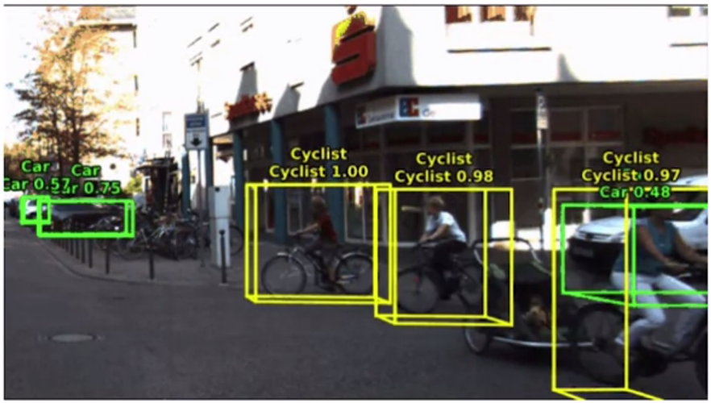

- Most major players in the autonomous driving industry have a **camera** as their primary sensor in their vehicle sensor suite. 

- ```The camera is a rich sensor that captures incredible detail about the environment around the vehicle but requires extensive processing to make use of the information that's available in that image.``` 

- Throughout this course, you will get hands on experience on how to algorithmically manipulate camera images to extract information, useful, not just for autonomous driving but for robotic perception in general. 
- In the first module in week one of this course, we will provide you with an overview of important concepts related to cameras and computer vision. 
- This module is only meant as a high level summary of the basics of computer vision. So, we'll move quickly through a large number of topics to develop more in-depth knowledge in this area, have a look at the computer vision courses also available on Coursera. 
- In this first video, we will highlight **why the camera is a critical sensor for autonomous driving**. We will then briefly introduce the concept of image formation and present `the pinhole camera model` which captures the essential elements of how a camera works in a simple and elegant manner. 
- We'll then show you an example of a historic camera design which used the `pinhole principle` to create some of the earliest images ever recorded. 
- The pinhole model will form the basis of our discussions in the next video where we investigate how to project points from the world into the camera imaging sensor. 
 
### Lesson 1 Part 1: The Camera Sensor

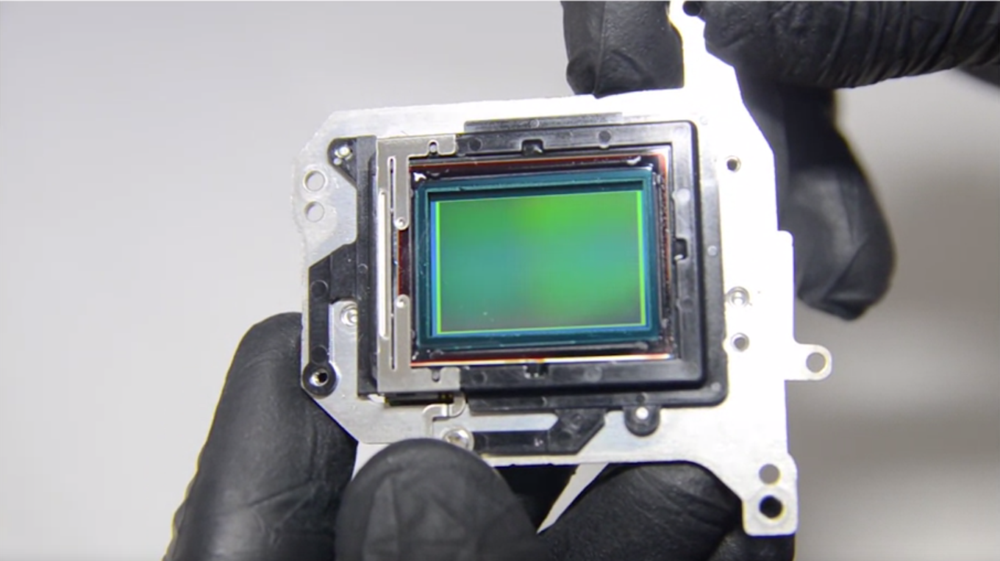

Of all the common self-driving car sensors, the camera is the sensor that provides the most detailed appearance information from objects in the environment. 

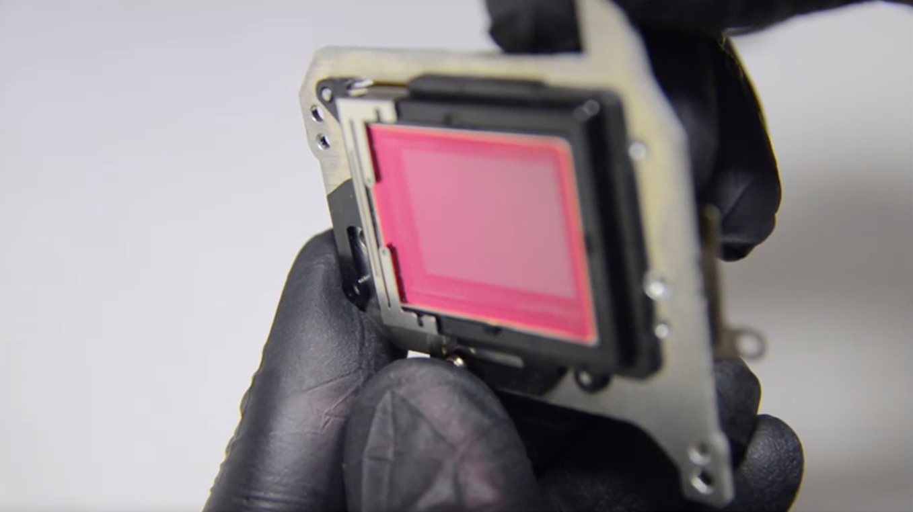

- Appearance information is particularly useful for scene understanding tasks such as object detection, segmentation and identification. 

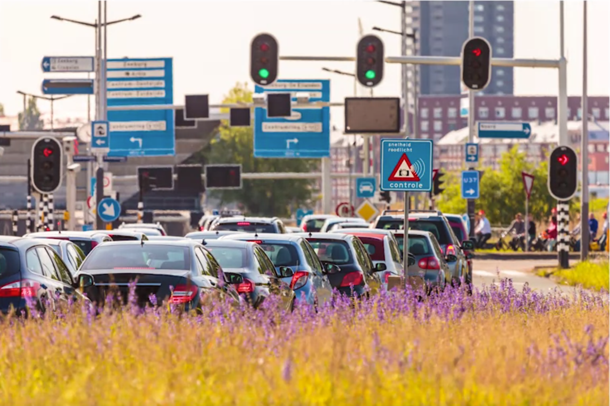

- Appearance information is what allows us to distinguish between road signs or traffic lights states, to track turn signals and resolve overlapping vehicles into separate instances.

- Because of its high resolution output, the camera is able to collect and provide orders of magnitude, more information than other sensors used in self-driving while still being relatively inexpensive. 
- The combination of `high valued appearance information` and `low cost` make the camera an essential component of our sensor suite.

**Image Information** 

Let us see how the camera manages to collect this huge amount of information. 

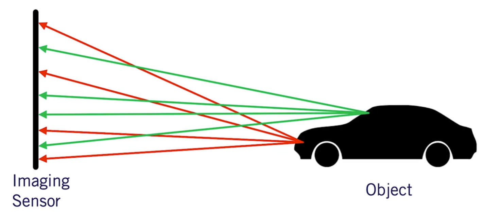

- A camera is a passive external receptive sensor. 
- It uses an imaging sensor to capture information conveyed by light rays emitted from objects in the world. 
- This was originally done with film but nowadays we use rather sophisticated silicon chips to gather this information. 
- Light is reflected from every point on an object in all directions, and a portion of these rays travel towards the camera sensor. 

Look at the car's reflected rays collected by our imaging surface.

*Do you think we will get a good representation of the car on the image sensor from this ray-pattern?* 

- Unfortunately, no. 
- Using this basic open sensor camera design, we will end up with **blurry images** because our imaging sensor is collecting `light rays` from multiple points on the object at the same location on the sensor. 
- The solution to our problem is to put a barrier in front of the imaging sensor with a tiny hole or aperture in its center. 

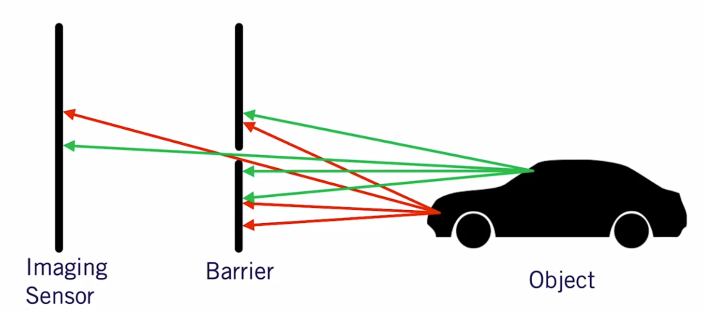

- The barrier allows only a small number of light rays to pass through the aperture, reducing the blurriness of the image. 

**Pinhole Camera Model**

- `The pinhole camera model` : describes the relationship between a point in the world and it's corresponding projection on the image plane.

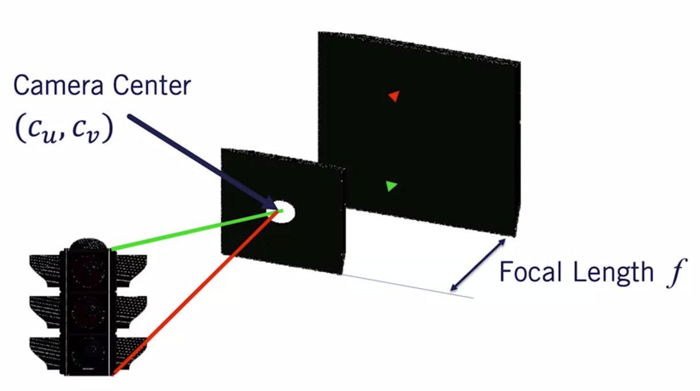

- The two most important parameters in a pinhole camera model are the distance between the pinhole and the image plane which we call the focal length, the focal length defines the size of the object projected onto the image and plays an important role in the camera focus when using lenses to improve camera performance. 

- The coordinates of the center of the pinhole, which we call the camera center, these coordinates to find the location on the imaging sensor that the object projection will inhabit. 

**Camera Obscura: 1544 A.D.**

Although the pinhole camera model is very simple, it works surprisingly well for representing the image creation process.
-  By identifying the focal length and camera's center for a specific camera configuration, we can mathematically describe the location that a ray of light emanating from an object in the world will strike the image plane. 
-  This allows us to form a measurement model of image formation for use in state estimation and object detection. 

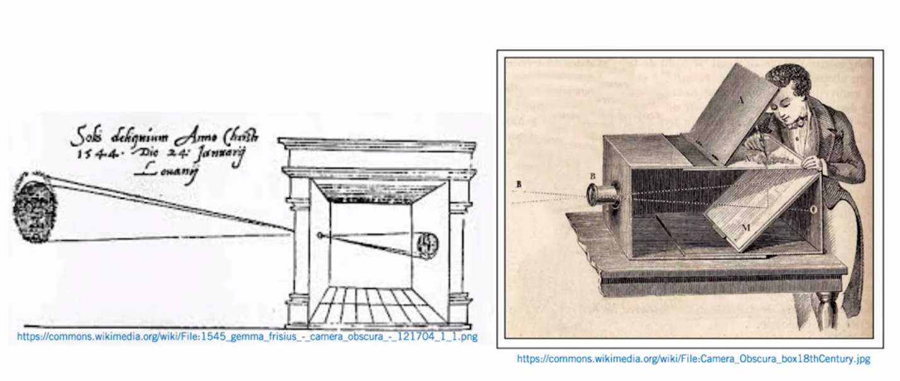

-  A historical example of the pinhole camera model is the camera obscura, which translates to dark room camera in English. Historical evidence shows that this form of imaging was discovered as early as 470 BC in Ancient China and Greece. 
-  It's simple construction with a pinhole aperture in front of an imaging surface makes it easy to recreate on your own, and is in fact a safe way to watch solar eclipse if you're so inclined. 

**Modern Day Cameras**

We've come a long way since the invention of the camera obscura. Current-day cameras allow us to collect extremely high resolution data. 

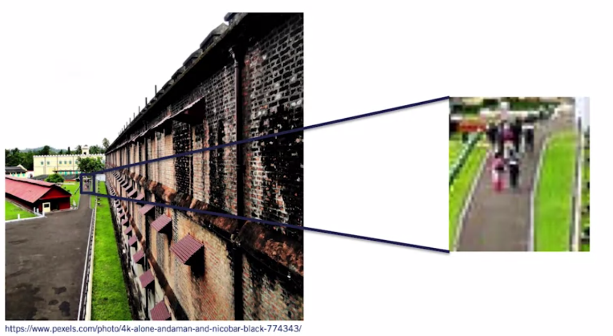

-  They can operate in low-light conditions or at a long range due to the advanced lens optics that gather a large amount of light and focus it accurately on the image plane
-  The resolution and sensitivity of camera sensors continues to improve, making cameras one of the most ubiquitous sensors on the planet. 

**Ubiquitous Imaging devices**

*How many cameras do you think you own?* You'd be surprised if you stop to count them all. 

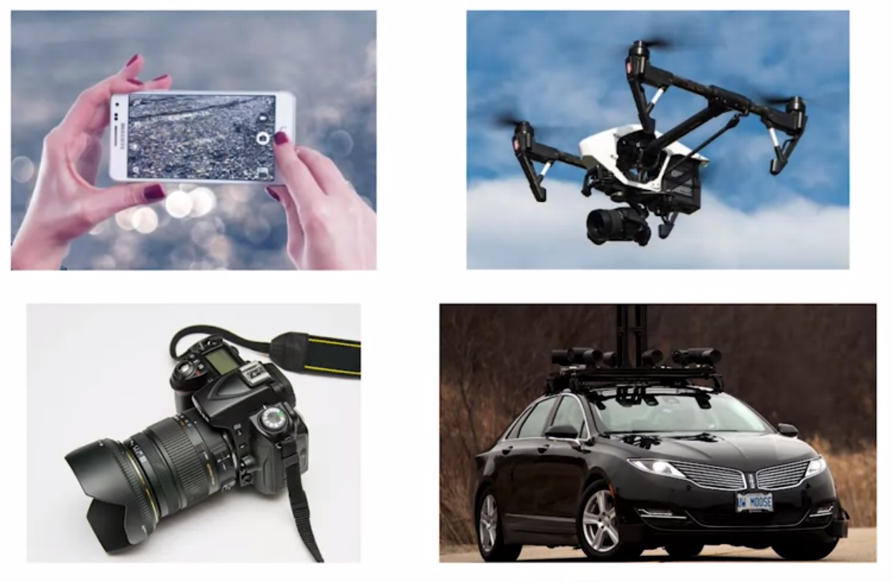

- You'll have cameras in your **phones**, in your **car**, on your **laptop**, they are literally everywhere and in every device we own today. 
-  These advances are also extremely beneficial for understanding the environment around a self-driving car. 
-  As we discussed in [course 1](https://github.com/afondiel/Self-Driving-Cars-Specialization-Coursera/blob/main/Course1-Introduction-to-Self-Driving-Cars/course1-w2-notes.md), cameras specifically designed for autonomous vehicles need to work well in a wide range of lighting conditions and in distances to objects. 
-  These properties are essential to driving safely in all operating conditions. 

**Summary**

-  In this introductory lesson, you've learned the usefulness of the camera as a sensor for autonomous driving. 
-  You also saw the pinhole camera model in its most basic form, which we'll use throughout this course to construct algorithms for visual perception. 

### Lesson 1 Part 2: Camera Projective Geometry

*How to model the cameras projective geometry through the coordinate system transformation.*

- These transformations can be used to project points from the world frame to the image frame, building on **the pinhole camera model**.
- You will then model these transformations using matrix algebra and apply them to a 3D point to get it's 2D projection onto the image plane. 
- Finally, you will learn how camera 2D images are represented in software. 
- Equipped with the projection equations in image definitions, you will then be able to create algorithms for detecting objects in 3D and localizing the self-driving car later on in the course. 

**Projection : World $\to$ Image(Real Camera)**

First, let's define **the problem we need to solve**. 

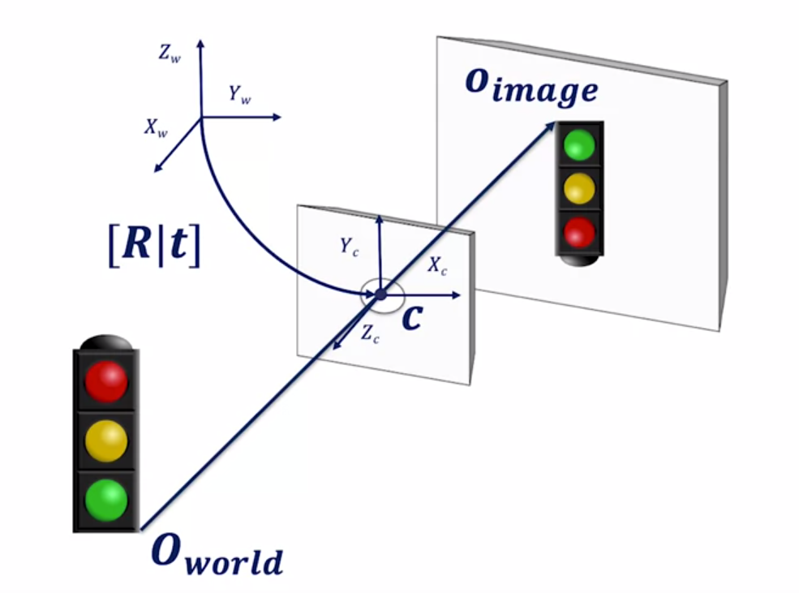

Let's start with a point $O$ world defined at a particular location in the world coordinate frame. 

We want to project this point from the world frame $\to$ the camera image plane. 

- Light travels from the $O$ world on the object through the camera aperture to the sensor surface. 
- You can see that our projection onto the sensor surface through the aperture results in flipped images of the objects in the world. 
- To avoid this confusion, we usually define a virtual image plane in front of the camera center. 
- Let's redraw our camera model with this sensor plane instead of the real image plane behind the camera lens. 
  
**Projection : World $\to$ Image(Simplified Camera)**

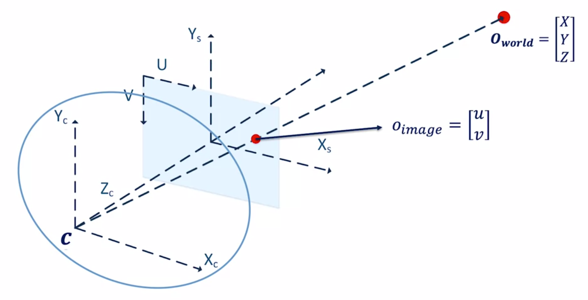

- We will call this model the simplified camera model, and need to develop a model for how to project a point from the world frame coordinates $x$ , $y$ and $z$ to image coordinates $u$ and $v$. 
- We begin by defining the following characteristics of the cameras that are relevant to our **problem**. 
- First, we select a world frame in which to define the coordinates of all objects and the camera.
- We also define the camera coordinate frame as the coordinate frame attached to the center of our lens aperture known as the `optical sensor`. 

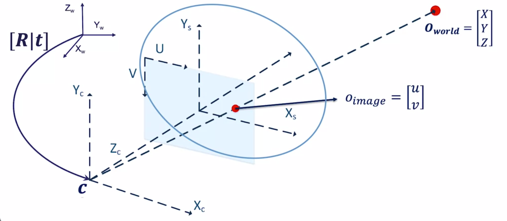

- As described from [Course 2](https://github.com/afondiel/Self-Driving-Cars-Specialization-Coursera/blob/main/Course2-State-Estimation-and-Localization-for-Self-Driving-Cars/course2-w4-notes.md), we can define a translation vector and a rotation matrix to model any transformation between a world coordinate frame and another, and in this case, we'll use the world coordinate frame and the camera coordinate frame. 

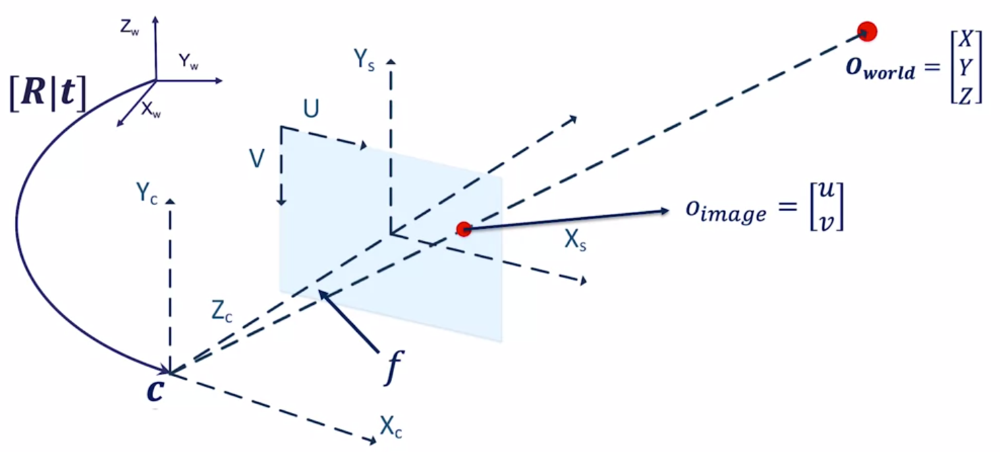

- We refer to the parameters of the camera pose as the `extrinsic parameters`, as they are external to the camera and specific to the location of the camera in the world coordinate frame.

- We define our image coordinate frame as the coordinate frame attached to our virtual image plane emanating from the optical center. 

- The image pixel coordinate system however, is attached to the top left corner of the virtual image plane.

- So we'll need to adjust the pixel locations to the image coordinate frame. 

- Next, we define the focal length is the distance between the camera and the image coordinate frames along the z-axis of the camera coordinate frame.

**Computing the Projection**

Finally, our projection problem reduces to two steps. 

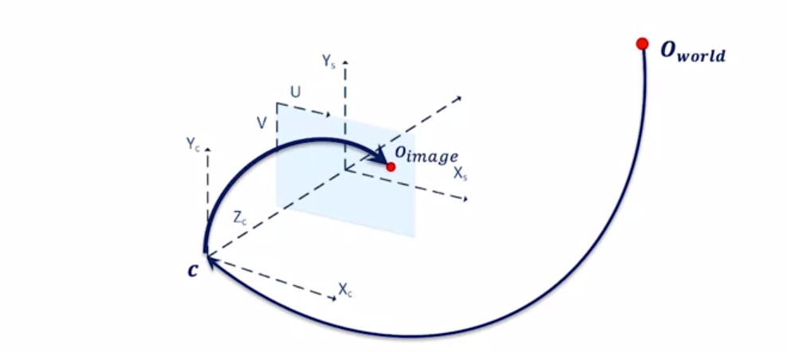

1. We first need to project from the world $\to$ the camera coordinates
2. We project from the camera coordinates $\to$ the image coordinates.

- We can then transform image coordinates to pixel coordinates through **scaling** and **offset**.

- We now have the geometric model to allow us to project a point from that world frame to the image coordinate frame, whenever we want.

Let us formulate the mathematical tools needed to perform this projection using linear algebra. 

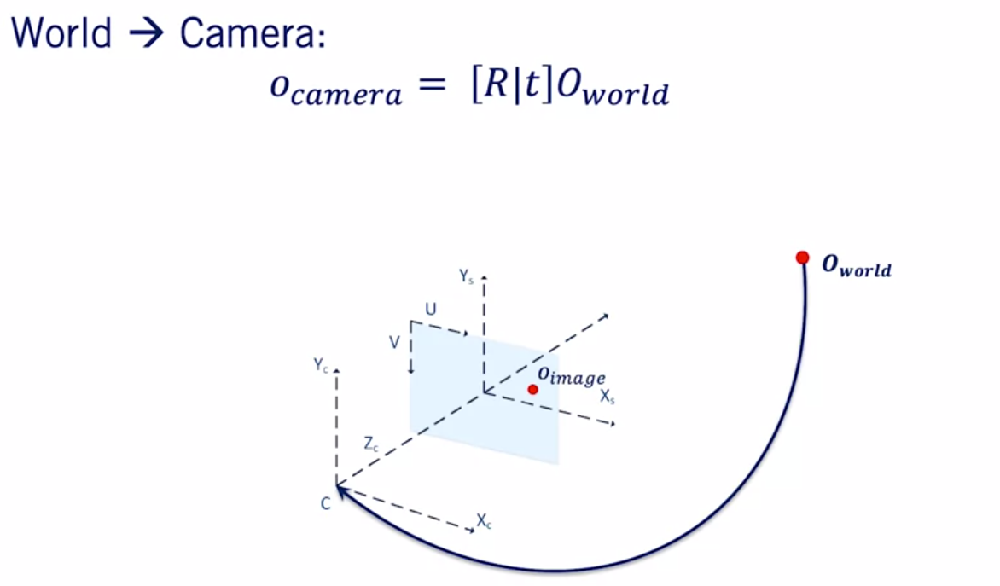

- First, we begin with the transformation from the world to the camera coordinate frame. 

- This is performed using the rigid body transformation matrix $T$ , which has $R$ and little $t$ in it. The next step is to transform camera coordinates to image coordinates.

- To perform this transformation, we define the matrix $K$ as a 3x3 matrix.

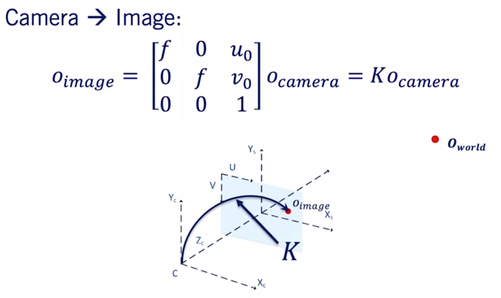

- This matrix depends on camera intrinsic parameters, which means it depends on components internal to the camera such as the camera geometry and the camera lens characteristics.

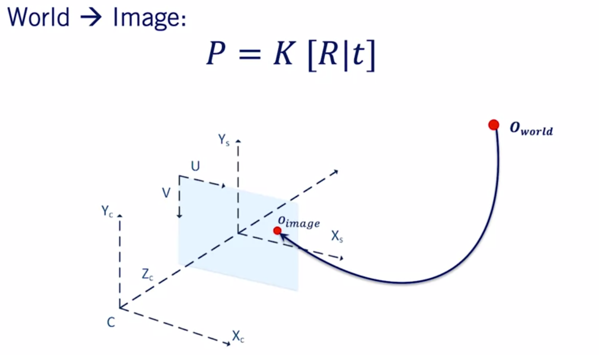

- Since both transformations are just matrix multiplications, we can define a matrix $P$ as $K$ times $R$ and $t$, that transforms from the world coordinate frame all the way to the image coordinate frame. 

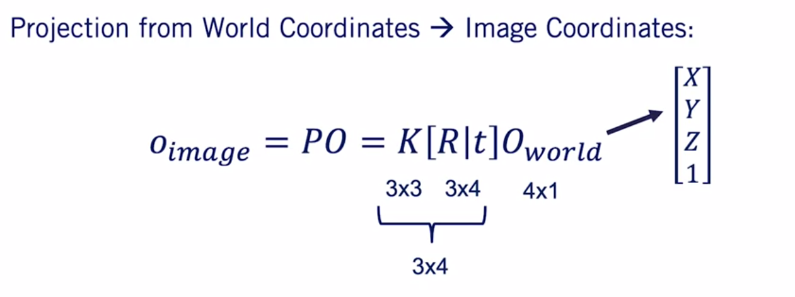

- The coordinates of point $O$ in the world frame can now be projected to the image plane via the equation $O$ sub image is equal to $P$ times $O$ sub world, which is $k$ times $R$ and $t$ of $O$ sub world. 

- So, let's see what we're still missing to compute this equation. When we expect the matrix dimensions, we noticed that the matrix multiplication cannot be performed. 

- To remedy this problem, we transform the coordinates of the point $O$ into homogeneous coordinates, and this is done by adding a one at the end of the $3D$ coordinates as we saw in the second state estimation course. 

- So, now the dimensions work and we're all ready to start computing our projections. 

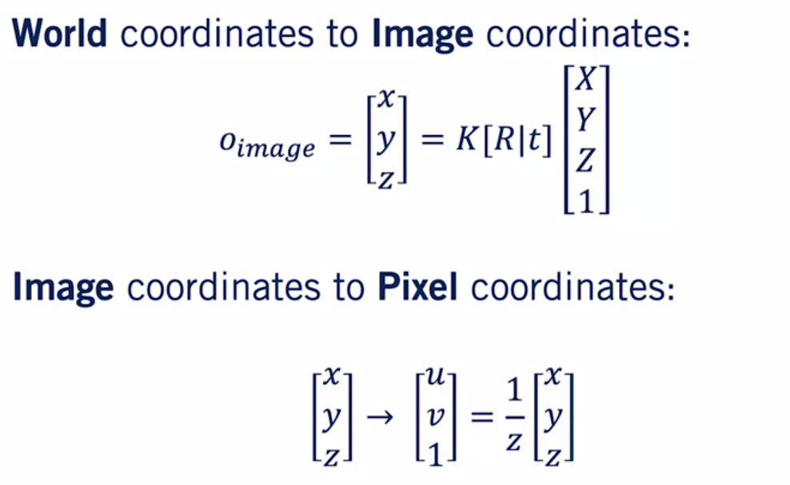

- Now, we need to perform the final step, transforming the image coordinates to pixel coordinates. 

- We do so by dividing $x$ and $y$ by $z$ to get homogeneous coordinates in the image plane. You have completed the basic camera projection model. 

- In practice, we usually model more complex phenomena such as :
  - Non-square pixels
  - Camera access skew
  - Distortion 
  - Non unit aspect ratio. 

- Luckily, this only changes the camera K matrix, and the equations you have learned can be used as is with a few additional parameters. 

**The Digital Iamge: Greyscale**

Now that we have formulated the coordinates of projection of a 3D point onto the 2D image plane, we want to define what values go into the coordinates in a 2D color image. 

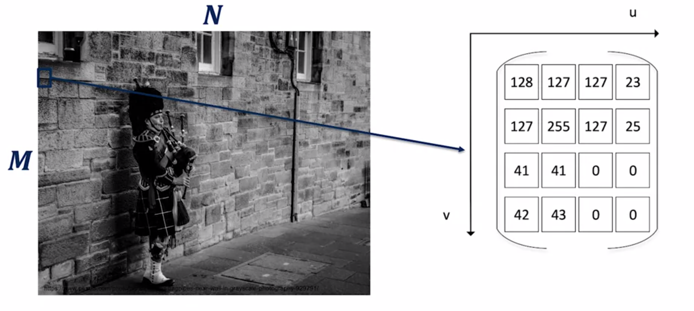

- We will start with a grayscale image. We first define a width $N$ and a height $M$ of an image, as the number of rows and columns the image has. 
- Each point in 3D projects to a pixel on the image defined by the uv coordinates we derived earlier. 

- Zooming in, we can see these pixels is a grid. In grayscale, brightness information is written in each pixel as an unsigned eight bit integer. Some cameras can produce unsigned 16-bit integers for better quality images. 

**The Digital Iamge: Color**

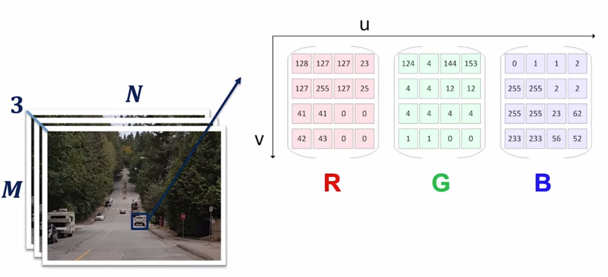

- For color images, we have a third dimension of value three we call depth. Each channel of this depth represents how much of a certain color exists in the image. 

- Many other color representations are available, but we will be using the **RGB** (Red, Green, Blue) representation, throughout this course

- In short, an image is represented digitally as an $MxNx3$ array of pixels, with each pixel representing the projection of a 3D point onto the 2D image plane. 

**Summary**

- So, in this video, you learned how to project 3D points in the world coordinate frame to 2D points in the image coordinate frame. 
- You saw that the equations that perform this projection rely on camera intrinsic parameters as well as on the location of the camera in the world coordinate frame. 
- As we'll see later throughout the course, this projection model is used in every visual perception algorithm we develop, from object detection to derivable space estimation. 
- Finally, you've learned how images are represented in software as an array(unsigned 8 bit, 16 bit integers) representing pixel locations. 
- You're now ready to start working directly with images and software, as you'll do in this week's assessments.

### Supplementary Reading: The Camera Sensor

- Forsyth, D. A. and J. Ponce. (2003). Computer vision: a modern approach (2nd edition). New Jersey: Pearson. Read sections 1.1, 1.2, 2.3, 5.1, 5.2.

- Szeliski, R. (2010). Computer vision: algorithms and applications. Springer Science & Business Media. Read sections 2.1, 2.2, 2.3 (PDF available online: http://szeliski.org/Book/drafts/SzeliskiBook_20100903_draft.pdf)

- Hartley, R., & Zisserman, A. (2003). Multiple view geometry in computer vision. Cambridge university press. Read sections 1.1, 1.2, 2.1, 6.1, 6.2

### Lesson 2: Camera Calibration
### Supplementary Reading: Camera Calibration
### Lesson 3 Part 1: Visual Depth Perception - Stereopsis
### Lesson 3 Part 2: Visual Depth Perception - Computing the Disparity
### Supplementary Reading: Visual Depth Perception
### Lesson 4: Image Filtering
### Supplementary Reading: Image Filtering
### Lab
### Grade : Module 1 Graded Quiz

# References

# Appendices

- [Computer Vision](https://en.wikipedia.org/wiki/Computer_vision)

- Environment : 
  - [Color Theory](https://en.wikipedia.org/wiki/Color_theory)
  - [3D space](https://en.wikipedia.org/wiki/Three-dimensional_space)
  - [Optics](https://en.wikipedia.org/wiki/Optics)
  - [Machine Perception](https://en.wikipedia.org/wiki/Machine_perception)

- [Multidimensional Signal Processing](https://en.wikipedia.org/wiki/Category:Multidimensional_signal_processing)
  - [Image Processing](https://en.wikipedia.org/wiki/Category:Image_processing)
  - [Video Processing](https://en.wikipedia.org/wiki/Category:Video_processing)
  - [Geometry Processing](https://en.wikipedia.org/wiki/Category:Geometry_processing)

