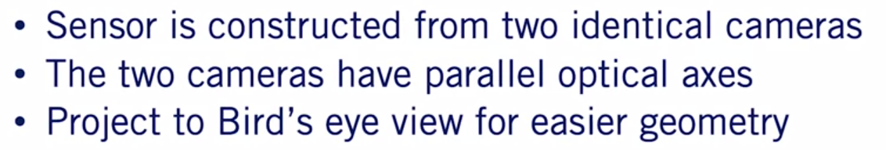
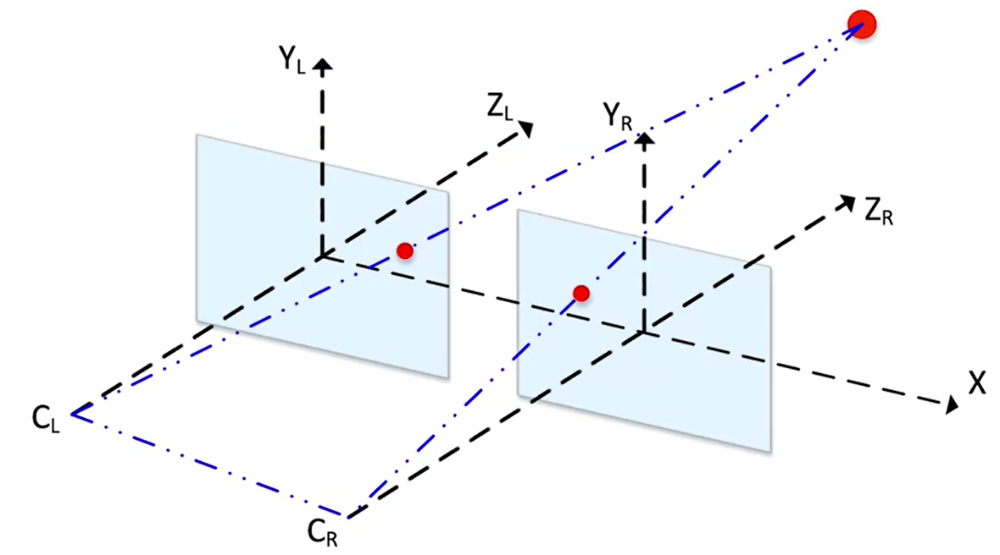
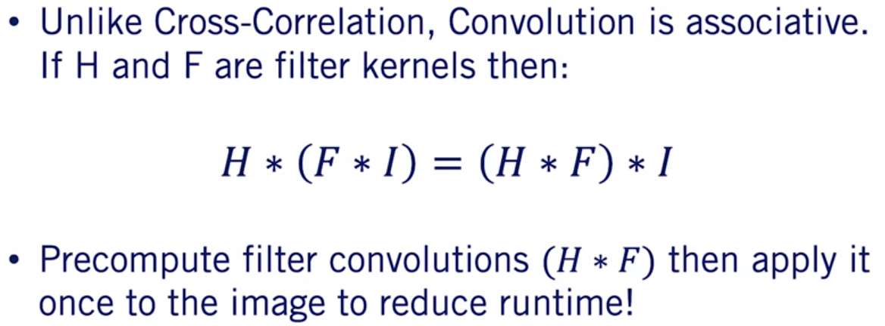

# Course-3 - W1 - MODULE 0 : Visual Perception for Self-Driving Cars

## Overview 

- This module introduces the main concepts from the broad and exciting field of computer vision needed to progress through perception methods for self-driving vehicles. 
- The main components include camera models and their calibration, monocular and stereo vision, projective geometry, and convolution operations.  

**Learning  Objectives**

- Review the layout of the courses in the Specialization
- Review the main projects offered in this course

## Course Introduction
### Welcome to the Self-Driving Cars Specialization!
- ok  

### Welcome to the course 

- Camera is one of the most versatile sensors for the self-driving car. `Cameras act as the eyes of the self-driving car`. 
- The cars use cameras to detect agents on the road, model their movement, and model their behaviors. 
- Images from the camera can also be used to detect and localized road markings, signals, and signs to allow for safe and lawful driving behavior. 
- `We can use cameras for localization similar to the LIDAR sensors`. 
- By the end of this course, you'll be able to use and calibrate these cameras to build a `baseline perception stack` for self-driving cars

- **MODULE 1 : Basics Of 3D Computer Vision**
  - Image formation
  - Camera Projective Geometry
  - Camera Calibration 
  - Visual Depth Perception
  - Image filtering

- **MODULE 2 : Visual Features**
  - Image features
    - Detection
    - Description
    - Matching
  - Visual Odometry 

- **MODULE 3 : FeedForward & Convolutional Neural Network**
  - Feedforward neural networks
  - how to train these networks 
  - how to evaluate their performance. 
  - you will learn about a special type of feedforward neural network,
  - Convolutional neural networks
  - That are tailored to process images from cameras

- **MODULE 4 : Use Neural networks to perform 2D object detection**
  - Use Neural networks to perform 2D object detection, classification and regression task. 
  - You will learn how to formulate the 2D object detection problem, 
  - how to evaluate 2D object detection models, 
  - how to build neural networks that perform the 2D object detection task, 
  - and how to use the output of 2D object detectors in the context to self-driving cars. 
  - Specifically, you will use 2D object detection results to predict 3D position and track objects of interest in road scenes. 

- **MODULE 5 : Semantic segmentation** 
  - You will learn to formulate the semantic segmentation problem, evaluate semantic segmentation models, 
  - and perform semantic segmentation tasks using convolutional neural networks.  
  - Finally, you will learn how to use semantic segmentation output to perform drivable space estimation and line boundary detection

- **MODULE 6 : Final Project**
  - For the final week of the course, you will apply everything you've learned to the final course project. 
  - This project will require you to `implement a self-driving car obstacle avoidance system using only camera data` as your input. 


### Course Prerequisites
- [Course Prerequisites Knowledge Hardware Software](../Course1-Introduction-to-Self-Driving-Cars/resources/Course-Prerequisites-Knowledge-Hardware-Software.md)
### How to Use Discussion Forums
- Ok 
### Get to Know Your Classmates
- Ok 
### How to Use Supplementary Readings in This Course
### Recommended Textbooks

- **Forsyth, David A., and Jean Ponce** - "A modern approach." Computer vision: a modern approach (2003): 88-101.
- **Goodfellow, I., Bengio, Y., Courville, A., & Bengio, Y. (2016)**. Deep learning (Vol. 1). Cambridge: MIT press. [PDF available online](https://www.deeplearningbook.org/)
- **Szeliski, R. (2010). Computer vision: algorithms and applications. Springer Science & Business Media**. [PDF available online](http://szeliski.org/Book/drafts/SzeliskiBook_20100903_draft.pdf)
- Hartley, R., & Zisserman, A. (2003). Multiple view geometry in computer vision. Cambridge university press.

## Meet the Instructors
### Meet the Instructor, Steven Waslander
- Ok 
### Meet the Instructor, Jonathan Kelly
- Ok

# Course-3 - W1 - MODULE 1 : Basics of 3D Computer Vision

## Overview 

- This module introduces the main concepts from the broad and exciting field of computer vision needed to progress through perception methods for self-driving vehicles. 
- The main components include camera models and their calibration, monocular and stereo vision, projective geometry, and convolution operations.  

**Learning  Objectives**

- Build a pinhole camera model and define the model parameters to be found in calibration
- Define the projective geometry required to interpret points in 3D as observed in the image plane
- Formulate the equations and constraints for stereo sensors
- Compute disparity from rectified images
- Understand cross-correlation, convolutions, the difference between them, and what they are used for

## The Camera Sensor


- Most major players in the autonomous driving industry have a **camera** as their primary sensor in their vehicle sensor suite. 

- ```The camera is a rich sensor that captures incredible detail about the environment around the vehicle but requires extensive processing to make use of the information that's available in that image.``` 

- Throughout this course, you will get hands on experience on how to algorithmically manipulate camera images to extract information, useful, not just for autonomous driving but for robotic perception in general. 
- In the first module in week one of this course, we will provide you with an overview of important concepts related to cameras and computer vision. 
- This module is only meant as a high level summary of the basics of computer vision. So, we'll move quickly through a large number of topics to develop more in-depth knowledge in this area, have a look at the computer vision courses also available on Coursera. 
- In this first video, we will highlight **why the camera is a critical sensor for autonomous driving**. We will then briefly introduce the concept of image formation and present `the pinhole camera model` which captures the essential elements of how a camera works in a simple and elegant manner. 
- We'll then show you an example of a historic camera design which used the `pinhole principle` to create some of the earliest images ever recorded. 
- The pinhole model will form the basis of our discussions in the next video where we investigate how to project points from the world into the camera imaging sensor. 
 
### Lesson 1 Part 1: The Camera Sensor


Of all the common self-driving car sensors, the camera is the sensor that provides the most detailed appearance information from objects in the environment. 


- Appearance information is particularly useful for scene understanding tasks such as object detection, segmentation and identification. 


- Appearance information is what allows us to distinguish between road signs or traffic lights states, to track turn signals and resolve overlapping vehicles into separate instances.

- Because of its high resolution output, the camera is able to collect and provide orders of magnitude, more information than other sensors used in self-driving while still being relatively inexpensive. 
- The combination of `high valued appearance information` and `low cost` make the camera an essential component of our sensor suite.

**Image Information** 

Let us see how the camera manages to collect this huge amount of information. 


- A camera is a passive external receptive sensor. 
- It uses an imaging sensor to capture information conveyed by light rays emitted from objects in the world. 
- This was originally done with film but nowadays we use rather sophisticated silicon chips to gather this information. 
- Light is reflected from every point on an object in all directions, and a portion of these rays travel towards the camera sensor. 

Look at the car's reflected rays collected by our imaging surface.

*Do you think we will get a good representation of the car on the image sensor from this ray-pattern?* 

- Unfortunately, no. 
- Using this basic open sensor camera design, we will end up with **blurry images** because our imaging sensor is collecting `light rays` from multiple points on the object at the same location on the sensor. 
- The solution to our problem is to put a barrier in front of the imaging sensor with a tiny hole or aperture in its center. 


- The barrier allows only a small number of light rays to pass through the aperture, reducing the blurriness of the image. 

**Pinhole Camera Model**

- `The pinhole camera model` : describes the relationship between a point in the world and it's corresponding projection on the image plane.


- The two most important parameters in a pinhole camera model are the distance between the pinhole and the image plane which we call the focal length, the focal length defines the size of the object projected onto the image and plays an important role in the camera focus when using lenses to improve camera performance. 

- The coordinates of the center of the pinhole, which we call the camera center, these coordinates to find the location on the imaging sensor that the object projection will inhabit. 

**Camera Obscura: 1544 A.D.**

Although the pinhole camera model is very simple, it works surprisingly well for representing the image creation process.
-  By identifying the focal length and camera's center for a specific camera configuration, we can mathematically describe the location that a ray of light emanating from an object in the world will strike the image plane. 
-  This allows us to form a measurement model of image formation for use in state estimation and object detection. 


-  A historical example of the pinhole camera model is the camera obscura, which translates to dark room camera in English. Historical evidence shows that this form of imaging was discovered as early as 470 BC in Ancient China and Greece. 
-  It's simple construction with a pinhole aperture in front of an imaging surface makes it easy to recreate on your own, and is in fact a safe way to watch solar eclipse if you're so inclined. 

**Modern Day Cameras**

We've come a long way since the invention of the camera obscura. Current-day cameras allow us to collect extremely high resolution data. 


-  They can operate in low-light conditions or at a long range due to the advanced lens optics that gather a large amount of light and focus it accurately on the image plane
-  The resolution and sensitivity of camera sensors continues to improve, making cameras one of the most ubiquitous sensors on the planet. 

**Ubiquitous Imaging devices**

*How many cameras do you think you own?* 


- You'll have cameras in your **phones**, in your **car**, on your **laptop**, they are literally everywhere and in every device we own today. 
-  These advances are also extremely beneficial for understanding the environment around a self-driving car. 
-  As we discussed in [course 1](https://github.com/afondiel/Self-Driving-Cars-Specialization-Coursera/blob/main/Course1-Introduction-to-Self-Driving-Cars/course1-w2-notes.md), cameras specifically designed for autonomous vehicles need to work well in a wide range of lighting conditions and in distances to objects. 
-  These properties are essential to driving safely in all operating conditions. 

**Summary**

-  In this introductory lesson, you've learned the usefulness of the camera as a sensor for autonomous driving. 
-  You also saw the pinhole camera model in its most basic form, which we'll use throughout this course to construct algorithms for visual perception. 

### Lesson 1 Part 2: Camera Projective Geometry

*How to model the cameras projective geometry through the coordinate system transformation.*

- These transformations can be used to project points from the world frame to the image frame, building on **the pinhole camera model**.
- You will then model these transformations using matrix algebra and apply them to a 3D point to get it's 2D projection onto the image plane. 
- Finally, you will learn how camera 2D images are represented in software. 
- Equipped with the projection equations in image definitions, you will then be able to create algorithms for detecting objects in 3D and localizing the self-driving car later on in the course. 

**Projection : World $\to$ Image(Real Camera)**

First, let's define **the problem we need to solve**. 


Let's start with a point $O$ world defined at a particular location in the world coordinate frame. 

We want to project this point from the world frame $\to$ the camera image plane. 

- Light travels from the $O$ world on the object through the camera aperture to the sensor surface. 
- You can see that our projection onto the sensor surface through the aperture results in flipped images of the objects in the world. 
- To avoid this confusion, we usually define a virtual image plane in front of the camera center. 
- Let's redraw our camera model with this sensor plane instead of the real image plane behind the camera lens. 
  
**Projection : World $\to$ Image(Simplified Camera)**


- We will call this model the simplified camera model, and need to develop a model for how to project a point from the world frame coordinates $x$ , $y$ and $z$ to image coordinates $u$ and $v$. 
- We begin by defining the following characteristics of the cameras that are relevant to our **problem**. 
- First, we select a world frame in which to define the coordinates of all objects and the camera.
- We also define the camera coordinate frame as the coordinate frame attached to the center of our lens aperture known as the `optical sensor`. 


- As described from [Course 2](https://github.com/afondiel/Self-Driving-Cars-Specialization-Coursera/blob/main/Course2-State-Estimation-and-Localization-for-Self-Driving-Cars/course2-w4-notes.md), we can define a translation vector and a rotation matrix to model any transformation between a world coordinate frame and another, and in this case, we'll use the world coordinate frame and the camera coordinate frame. 


- We refer to the parameters of the camera pose as the `extrinsic parameters`, as they are external to the camera and specific to the location of the camera in the world coordinate frame.

- We define our image coordinate frame as the coordinate frame attached to our virtual image plane emanating from the optical center. 

- The image pixel coordinate system however, is attached to the top left corner of the virtual image plane.

- So we'll need to adjust the pixel locations to the image coordinate frame. 

- Next, we define the focal length is the distance between the camera and the image coordinate frames along the z-axis of the camera coordinate frame.

**Computing the Projection**

Finally, our projection problem reduces to two steps. 


1. We first need to project from the world $\to$ the camera coordinates
2. We project from the camera coordinates $\to$ the image coordinates.

- We can then transform image coordinates to pixel coordinates through **scaling** and **offset**.

- We now have the geometric model to allow us to project a point from that world frame to the image coordinate frame, whenever we want.

Let us formulate the mathematical tools needed to perform this projection using linear algebra. 


- First, we begin with the transformation from the world to the camera coordinate frame. 

- This is performed using the rigid body transformation matrix $T$ , which has $R$ and little $t$ in it. The next step is to transform camera coordinates to image coordinates.

- To perform this transformation, we define the matrix $K$ as a 3x3 matrix.


- This matrix depends on camera intrinsic parameters, which means it depends on components internal to the camera such as the camera geometry and the camera lens characteristics.


- Since both transformations are just matrix multiplications, we can define a matrix $P$ as $K$ times $R$ and $t$, that transforms from the world coordinate frame all the way to the image coordinate frame. 


- The coordinates of point $O$ in the world frame can now be projected to the image plane via the equation $O$ sub image is equal to $P$ times $O$ sub world, which is $k$ times $R$ and $t$ of $O$ sub world. 

- So, let's see what we're still missing to compute this equation. When we expect the matrix dimensions, we noticed that the matrix multiplication cannot be performed. 

- To remedy this problem, we transform the coordinates of the point $O$ into homogeneous coordinates, and this is done by adding a one at the end of the $3D$ coordinates as we saw in the second state estimation course. 

- So, now the dimensions work and we're all ready to start computing our projections. 


- Now, we need to perform the final step, transforming the image coordinates to pixel coordinates. 

- We do so by dividing $x$ and $y$ by $z$ to get homogeneous coordinates in the image plane. You have completed the basic camera projection model. 

- In practice, we usually model more complex phenomena such as :
  - Non-square pixels
  - Camera access skew
  - Distortion 
  - Non unit aspect ratio. 

- Luckily, this only changes the camera $K$ matrix, and the equations you have learned can be used as is with a few additional parameters. 

**The Digital Iamge: Greyscale**

Now that we have formulated the coordinates of projection of a 3D point onto the 2D image plane, we want to define what values go into the coordinates in a 2D color image. 


- We will start with a grayscale image. We first define a width $N$ and a height $M$ of an image, as the number of rows and columns the image has. 
- Each point in 3D projects to a pixel on the image defined by the uv coordinates we derived earlier. 

- Zooming in, we can see these pixels is a grid. In grayscale, brightness information is written in each pixel as an unsigned eight bit integer. Some cameras can produce unsigned 16-bit integers for better quality images. 

**The Digital Iamge: Color**


- For color images, we have a third dimension of value three we call depth. Each channel of this depth represents how much of a certain color exists in the image. 

- Many other color representations are available, but we will be using the **RGB** (Red, Green, Blue) representation, throughout this course

- In short, an image is represented digitally as an $MxNx3$ array of pixels, with each pixel representing the projection of a 3D point onto the 2D image plane. 

**Summary**

- So, in this video, you learned how to project 3D points in the world coordinate frame to 2D points in the image coordinate frame. 
- You saw that the equations that perform this projection rely on camera intrinsic parameters as well as on the location of the camera in the world coordinate frame. 
- As we'll see later throughout the course, this projection model is used in every visual perception algorithm we develop, from object detection to derivable space estimation. 
- Finally, you've learned how images are represented in software as an array(unsigned 8 bit, 16 bit integers) representing pixel locations. 
- You're now ready to start working directly with images and software, as you'll do in this week's assessments.

### Supplementary Reading: The Camera Sensor

- Forsyth, D. A. and J. Ponce. (2003). Computer vision: a modern approach (2nd edition). New Jersey: Pearson. Read sections 1.1, 1.2, 2.3, 5.1, 5.2.

- Szeliski, R. (2010). Computer vision: algorithms and applications. Springer Science & Business Media. Read sections 2.1, 2.2, 2.3 (PDF available online: http://szeliski.org/Book/drafts/SzeliskiBook_20100903_draft.pdf)

- Hartley, R., & Zisserman, A. (2003). Multiple view geometry in computer vision. Cambridge university press. Read sections 1.1, 1.2, 2.1, 6.1, 6.2

### Lesson 2: Camera Calibration

The camera calibration problem is defined as finding these unknown intrinsic and extrinsic camera parameters, shown here in red given n known 3D point coordinates and their corresponding projection to the image plane.

**Camera Calibration: Problem Formulation**


- Our approach will comprise of getting the $P$ matrix first and then decomposing it into the intrinsic parameters $K$ and the extrinsic rotation parameters $R$ and translation parameters $t$ .


- For calibration, we use a scene with known geometry to get the location of our 3D points from the 2D image, resolving the scale issue by measuring the actual 3D distance between the points that are observed in the image.

- The most commonly used example would be a 3D checkerboard, with squares of known size providing a map of fixed point locations to observe. 

- We define our word coordinate frame, in yellow and compute our 3D point coordinates and their projections in the image.

- Associating 3D points to 2D projections can be done either manually, by clicking on the purple points, for example or automatically, with checkerboard detectors. 

- We can then set up a system of equations to solve for the unknown parameters of $P$ . Now, let us form the system of linear equations that needs to be solved. 


- First, we expand the projection equations to three equations through matrix multiplication. 
  


- To get zero on the right-hand side of these equations, we move the right hand side to the left-hand side for each one. 


- Then, we substitute the third equation into equations one and two, and end up with two equations per point. 


Therefore, if we have $n$ points, we have $2n$ associated equations. Putting these equations in matrix form gives us the shown homogeneous linear system. 

Since this is a **homogeneous linear system**, we can use the pseudo-inverse or even better, the singular value decomposition to get `the least squares solution`.

**Camera Calibration: Linear Methods**

Our simple linear calibration approach has several advantages. 

- It's **easy to formulate**
- Has a **closed form solution**
- Often provides really **good initial points for non-linear calibration approaches.**

*Can you think of some disadvantages of a simple linear system?*

- One disadvantage of solving for $P$ , is that we do not directly get the intrinsic and extrinsic camera parameters. 
- Furthermore, our linear model does not take into account complex phenomena, such as radial and tangential distortion. 
- Finally, since we are solving via the linear least squares method, we cannot impose constraints on our solution, such as requiring the focal length to be non-negative. 

The camera projection matrix $P$ by itself, is useful for projecting 3D points into 2D, but it has several drawbacks: 
- It doesn't tell you the cameras pose 
- it doesn't tell you about the camera's internal geometry

**Factoring the P matrix**

Fortunately, we can factorize $P$ into intrinsic parameter matrix K and extrinsic rotation parameters R and translation parameters t, using a linear algebra operation known as the `RQ factorization`.

*How we perform this factorization?* 


- First, we alter the representation of $P$ to be a function of the camera center $C$ . $C$ is the point that projects to zero when multiplied by $P$ . 
- We multiply $K$ into the matrix to form two sub-matrices, $KR$ and minus $KRC$. We will refer to the combination of $K$ and $R$ as the $M$ matrix. 


- We can now express our projection matrix $P$ as $M$ and minus $MC$ . From here, we use the fact that any square matrix can be factored into an upper triangular matrix $R$ and an orthogonal basis to decompose $M$ into upper triangular R and orthogonal basis $Q$ . 


- In linear algebra, this procedure is known as **RQ factorization**, which is a variant of the more commonly referred to `QR factorization`. In QR factorization, we have the orthogonal $Q$ first and then the upper triangular $R$. 
  
- Note here that the $R$ and the output of RQ factorization, is a different variable than our rotation matrix $R$. `So, don't get those confused`. 

Let's now see how we can use the output of RQ factorization of the matrix $M$ to retrieve $K$ , $R$ , and $t$ by aligning these two expressions. 


- The intrinsic calibration matrix $K$ is the output $R$ of the $RQ$ factorization of $M$ . The rotation matrix $R$ is the orthogonal basis $Q$ . 

- Finally, we can extract the translation vector directly from $K$ in the last column of the $P$ matrix. RQ factorization is a great tool to compute $K$ , $R$ , and $t$ from the camera $P$ matrix. 

- `However, some mathematical assumptions need to be performed to guarantee a unique solution for these matrices`. 

- We will explore these assumptions in further detail with this lesson's practice Jupiter notebook. 

**Camera Calibration**

Monocular camera calibration is a well-established tool that has excellent implementations in **C++, Python and MATLAB**. 

 

You can test out some of the most common implementations by following the links we've included in the [supplemental materials](#supplementary-reading-camera-calibration)

**Summary**

- In this lesson, you've learned that the camera projection matrix $P$ can be found through a process known as **camera calibration**. 

- You've learnt that this matrix can be factored into the camera intrinsic matrix $K$ and the camera's extrinsic parameters $R$ and $t$ , through **RQ factorization**. 

### Supplementary Reading: Camera Calibration

- Orsyth, D. A. and J. Ponce. (2003). Computer vision: a modern approach (2nd edition). New Jersey: Pearson. Read sections 5.3.

- Szeliski, R. (2010). Computer vision: algorithms and applications. Springer Science & Business Media. Read sections 6.1, 6.2. 6.3 (PDF available online: http://szeliski.org/Book/drafts/SzeliskiBook_20100903_draft.pdf)

- Hartley, R., & Zisserman, A. (2003). Multiple view geometry in computer vision. Cambridge university press. Read sections 7.1, 7.2, 7.4, 8.4, 8.5

- Camera Calibration with OpenCV: https://docs.opencv.org/3.4.3/dc/dbb/tutorial_py_calibration.html


### Lesson 3 Part 1: Visual Depth Perception - Stereopsis

Self-driving cars require accurate depth perception for the safe operation of our autonomous vehicles. 

*If you don't know how far away the cars are in front of you, how can you avoid them while driving?*

- **Lidar** and **Radar** sensors are usually thought of as the primary 3D sensors available for `perception tasks`. 
- However, we can get **depth information** from two or more cameras using `multi-view geometry` ( [Tesla Self-Driving Cars?](https://www.youtube.com/watch?v=eZOHA6Uy52k) ). 
- Specifically, we'll be describing the process of getting depth from two axis aligned cameras a setup known as `the stereo cameras`. 

**Stereopsis**

The process of stereo vision, was first described by **Charles Wheatstone** back in **1838**. 

- He recognized that because each eye views the visual world from a slightly different horizontal position that each eye's image differs from the other. 

- Objects at different distances from the eye project images into the two eyes that differ in their horizontal position giving depth cues of horizontal disparity that are also known as binocular disparity.

 

- However, historical evidence suggests that stereopsis was discovered much earlier than this. In fact some drawings by **Leonardo da Vinci** depict accurate geometry of depth through stereopsis. 

**Stereoscopes: A 19th Century Pastime**

Up to the 19th century, the phenomenon of stereopsis was primarily used for entertainment. 

 

Anaglyphs were used to provide a stereoscopic 3D effect when viewed with 2D color glass, where each lens employs different chromatically opposite colors, usually red and cyan. 

**Stereo Cameras**

Nowadays, we use stereopsis with complex algorithms to derive depth from two images using a similar concept to Da Vincis drawings. 

 

Now, let us delve into the geometry of a stereo sensor. 

**Stereo Cameras Model**

`A stereo sensor is usually created by two cameras with parallel optical axes`. 

 

To simplify the problem even more, most manufacturers align the cameras in 3D space so that the two image planes are aligned with only an offset in the x-axis. 

Given a known rotation and translation between the two cameras and a known projection of a point $O$ in 3D to the two camera frames resulting in pixel locations $OL$ and $OR$ respectively, we can formulate the necessary equations to compute the 3D coordinates of the point $O$ . 

To make our computation easier, we will state some assumptions. 
1. we assume that the two cameras used to construct the stereo sensors are identical. 

2. we will assume that while manufacturing the stereo sensor, we tried as hard as possible to keep the two cameras optical axes aligned. 


Let's now define some important parameters of the stereo sensor. 
- The focal length $f$ is, once again, the distance between the camera center and the image plane. 
- Second, the baseline $b$ is defined as the distance along the shared x-axis between the left and right camera centers. 

By defining a baseline to represent the transformation between the two camera coordinate frames, we are assuming that the rotation matrix is identity and there is only a non-zero x component in the translation vector. 

The $R$ and $T$ transformation therefore boils down to a single baseline parameter $B$. 

**Stereo Sensor: Assumptions**

Before proceeding, we will project the previous figure to bird's eye view for easier visualization. 

 

Now, let's define the quantities we would like to compute.

- We want to compute the x and z coordinates of the point $O$ with respect to the left camera frame. 

 

- The $y$ coordinate can be estimated easily after the $x$ and $z$ coordinates are computed. Remember, we are given the baseline, focal length, and the coordinates of the projection of the point $O$ onto the left and right image planes.
  
 

- We can see two similar triangles formed by the left camera measurement as follows. 

- The triangle formed by the depth $z$ and the position $x$ is similar to the triangle formed by the focal length $f$ and the left measurement $x$ component $xl$. 
- From this similarity we can construct the equation z over equals $x$ over $xl$ . 

 

- The same can be done for the right measurements but with the offset for the baseline included. In this case, the two triangles are defined by $z$ , and the distance $x$ minus $b$ and the focal length $f$ and the right measurement $x$ component $xr$ . 

- Similarly, we can get a second equation relating $z$ to $x$ via the right camera para meters in measurements. 

 

From these two equations, we can now derive the 3D coordinates of the point $O$ .

**Computing the 3D Point coordinates**

 

- We define the disparity $d$ to be the difference between the image coordinates of the same pixel in the left and right images. 
- We can easily transform between image and pixel coordinates using the $x$ and $y$ offsets $u_{0}$ and $v_{0}$. 
- We then use the two equations from the similar triangle relations to solve for the value of z as follows. From there we use the value of $z$ to compute x with the following expression. 

 

- Finally, we can repeat the process in the $y$ direction with the same derivation to arrive at the following expression for $y$ . 

- The three components of the point position are now explicitly available from the two sets of pixel measurements available to us. 

- Now that we have established the equations needed for 3D coordinate computation from the stereo sensor, two problems arise to be able to perform this computation. 

 

- First, we need to compute the focal length baseline and $x$ and $y$ offsets. That is, we need to calibrate the stereo camera system. 
- Second, we need to find the correspondence between each left and right image pixel pair to be able to compute their disparity. 

`Fortunately, the calibration problem can be solved using stereo camera calibration.` 

This is an extension of the **monocular process** we discussed in the previous video, for which well-established implementations are available. 

```
The correspondence problem however, requires specialized algorithms to efficiently perform the matching and compute the disparity between left and right image pixels, which we'll discuss further in the next video. 
```

**Conclusion**

- The output depth from stereopsis suffers from some limitations particularly as points move further away from the stereo camera.

- However, given a good disparity estimation algorithm, the output is still useful for self-driving cars as a dense source of depth information and closer range which exceeds the density we can get from common Lidar sensors.``` 

**Summary**

- To summarize this lesson, you've learned some historical background on stereopsis. 

- You also learned the equations required to estimate 3D coordinates of a pixel given the geometric transformation between the two cameras sensors and the disparity between pixels. 

### Lesson 3 Part 2: Visual Depth Perception - Computing the Disparity

**Part 1 Review : Computing 3D Point Coordinates**

 

- We identified two primary issues with the visual depth estimation from stereo images. 
- The first is that the camera parameters focal length F baseline B and camera pixel centers $U_{0}$ and $V_{0}$ , need to be estimated from stereo camera calibration. 
- It's great to see you again. Welcome back. So far we have learned the essential equations to extract 3D information from a stereo pair. However, we were faced with some unknown parameters that we have to estimate. 

In this `part 2` you will learn : 
- **How to estimate these missing parameters** such as the disparity through `stereo matching`. 
- You will also learn that efficient disparity estimation is possible due to `epipolar constraints`. 

Similar to monocular camera calibration, **stereo calibration** is a well-studied problem with lots of user-friendly free software capable of performing in.

`This lesson we'll be targeting the second problem, mainly stereo matching to compute disparities`. 

As a reminder, **disparity** is the difference in the image location of the same 3D point as observed by two different cameras. 

 

To compute the disparity we need to be able to find the same point in the left and right stereo camera images. This problem is known as **the stereo correspondence problem**. 

The most naive solution for this problem is an `exhaustive search`, where we searched the whole rate image for every pixel in the left image. 

- Such a solution is extremely inefficient and will usually not run in real time to be used on self-driving cars. 

 

- It's also unlikely to succeed as many pixels will have similar local characteristics, making it difficult to match them correctly. 

Luckily for us, we can use `stereo geometry` to constrain our search problem from 2D over the entire image space to a 1D line. 

Let's revisit our stereo camera setup and see why such a simplification is valid. 

**Epipolar Constraint for Correspondence**

We've already determined, how a single point is projected to both cameras. 

 

- Now, let's move our 3D point along the line connecting it with the left cameras center. Its projection on the left camera image plane does not change. 

- However, what can you notice about the projection on the right camera plane, the projection moves along the horizontal line.

- This is called an epipolar line and follows directly from the fixed lateral offset and image plane alignment of the two cameras in a stereo pair. 

- We can constrain our correspondence search to be along the epipolar line, reducing the search from 2D to 1D.

 

**Non-Parallet Optical Axles**

 

- One thing to note is that horizontal epipolar lines only occur if the optical axes of the two cameras are parallel. 
- In the case of non parallel optical axis, the epipolar lines are skewed. 
- In such cases we will have to result to multiple view geometry rather than the stereo equations we have developed, which is out of the scope of this lesson.

**Disparity Computation**

In the case of two calibrated use such as our stereo camera, a skewed epipolar line is not a huge problem.

In fact, we can work the optical axis to be parallel through a process known as `stereo rectification`. 

 

- After rectification we arrive back to our horizontal epipolar line.
- We will not go through how to perform rectification as implementations are available in standard computer vision packages such as `OpenCV` and `MATLAB`. 

 


**A Basic Stereo Algorithm**

To put it all together we will go over our first basic stereo algorithm. 


- For each epipolar line take a pixel on this line in the left image, compare these left image pixels to every pixel in the right image on the same epipolar line.
- Next, select the right image pixel that matches the left pixel the most closely which can be done by minimizing the cost. For example, a very simple cost here can be the squared difference in pixel intensities. 
- Finally, we can compute the disparity by subtracting the right image location from the left one. 


**Stereo matching**

Stereo matching is a very well-studied problem in computer vision. 

 

- Many more complex costs and search regions can be defined, which attempts to improve either computational efficiency or disparity accuracy. 
 
- There are a wide range of approaches including both local and global methods, which differ in the main image region considered when identifying correspondences and computing disparities. 
 
- As with most problems in computer vision, the stereo vision algorithms are evaluated on a public benchmark. The most famous of which is `the middlebury stereo benchmark`. 

- If you are interested, many of the top-performing stereo matching algorithms have results published there and have code available too. 

**Summary**

- With this lesson, you should now know how a stereo sensor generates depth from images through disparity estimation.

- This week's assignment will give a chance to compute your own disparity maps and to use them to create your own distance to impact driver assist module. 
 

### Supplementary Reading: Visual Depth Perception

- Forsyth, D.A. and J. Ponce (2003). Computer Vision: a modern approach (2nd edition). New Jersey: Pearson. Read sections 11.1, 12.1, 12.2.
- Szeliski, R. (2010). Computer vision: algorithms and applications. Springer Science & Business Media. Read sections 11.1 (PDF available online: http://szeliski.org/Book/drafts/SzeliskiBook_20100903_draft.pdf)
- Hartley, R., & Zisserman, A. (2003). Multiple view geometry in computer vision. Cambridge university press. Read section 9.1, 10.1, 11.12
- Epipolar Geometry (OpenCV): https://docs.opencv.org/3.4.3/da/de9/tutorial_py_epipolar_geometry.html
- Depth Map from Stereo Images (OpenCV): https://docs.opencv.org/3.4.3/dd/d53/tutorial_py_depthmap.html 

### Lesson 4: Image Filtering

**Image Filtering**

*Why we would use image filtering?*

**The image formation process**: is susceptible to lots of different noise sources`

- In the image below you can see the camera man, a very famous photo created at MIT that is used for testing computer vision algorithms. 

 

Now let us add salt and pepper noise to this image, by randomly turning some of its pixels white and others black.

*How can we retrieve a reasonable visual appearance of the original image from such a noisy one?*

 

- `Image filtering is as simple and efficient method to eliminate noise.`


You will also see that depending on the filter, a variety of operations can be performed on images in an efficient manner. 

But first, let us see how image filtering helps reduce salt and pepper noise as a motivating example. 

 

- If we look at the image array, we noticed that salt and pepper noise usually results in outlier pixels, low-value pixels in a high-value neighborhood or high-value pixels in a low-value neighborhood. 

 

- One idea to reduce this noise is to compute the `mean` of the whole neighborhood, and replace the outlier pixel with this mean value. 

- Let us define $G$ as the output of our filter operation. The equation of the mean can be described in terms of $k$, $u$ and $v$ . Here, $2k + 1$ one is the filter size. 
- In this case, the size of our neighborhood which is three leads to a $k$ that's equal to one. $u$ and $v$ are the center pixel image coordinates. 
- Computing the mean results in $80$ for the top neighborhood and $10$ for the bottom one. 
- The final step is to replace the center pixel of each of those neighborhoods by the corresponding mean. 
  
```
We have successfully reduced the noise and smooth the image array values in this neighborhood. 
```

**Cross-Correlation**

The mean equation can be generalized by adding a weight to every pixel in the neighborhood.

 


- The weight matrix $H$ is called a `kernel`. This generalized form is termed cross-correlation, as it defines a correlation between each pixel and every other pixel in the neighborhood. 

- For the mean filter defined above, we now represented with the following kernel. A 3x3 matrix filled with the value one-ninth. 
- Another kernel for noise reduction is `the Gaussian kernel`, where the center pixel is weighted more than the neighboring pixels and the weights follow a Gaussian distribution. 

Now let's apply these kernels to our camera man image. 

 
 
- We can see that our kernels successfully reduces the salt and pepper noise.
- However, it also blurred our image, an inevitable consequence of these linear filters. 
- This blur can be reduced by tuning the parameters specific to each type of filter. 

**Convulation**

A Convolution :  is a cross-correlation, where the filter is flipped both horizontally and vertically before being applied to the image. 

 

- To apply the convolution, we take each row of our kernel, flip it and replace it at its corresponding symmetric position from the middle row.


Mathematically convolution can be described as the following equation. 

 

- Note that we simply manipulated the image coordinates instead of flipping the kernel.
 
*What are the advantages of using a convolution over a kernel?* 


  
- Unlike correlation, convolution is associative, meaning the order of multiplication of kernels does not matter. 

We can therefore apply as many consecutive linear kernels to an image as we want by precomputing the combined convolution of all the kernels, and then performing a single convolution of the resulting kernel with the image. 

- As an example, we apply two linear kernels, $H$ and $F$, by computing $H$ times $F$ and then applying it to the image. 
- This results in a substantial reduction in runtime, especially if we need to process images in real-time while moving in a vehicle. 

**Applications: Template Matching**

Now let's present some important applications of cross-correlation and convolution operations. 
- Cross-correlation can be used for template matching.

 

- Template matching is the problem where we are given a pattern or a template, and we want to find its location in the image. 
- This can be done by finding the location of the highest value of the output of cross-correlation, between the template and the image. 

To visualize this better, let's superimpose the colorized output of cross-correlation on top of our target image. 

 

- Here red is a high cross-correlation response, while blue is a very low response. 
- The location of the template and the image is then the $u$ , $v$ coordinates of the pixel with the highest value from the output of the cross-correlation.

- We can check that our correlation is correct by superimposing the template on the $u$ , $v$ coordinates we just found.

 

- This method can be used as a starting point for the identification of signs, and even for lean detection, although challenges arise with the approach in practice. 

**Applications: Image Gradient Computation**

Another important application that can be performed using convolutions, is `image gradient computation`. 

 

- Image gradients can be computed by a convolution with a kernel that performs finite difference. 

- We can rotate our kernel in different orientations to get vertical, horizontal or even diagonal gradients of an image at a pixel.

- Image gradients are extremely useful for detection of edges and corners, and are used extensively in self-driving for image feature and object detection, for example. 

**Summary**

- In this lesson, you learned how to perform cross-correlation and convolution as well as some of the uses of these operations. 

- These operations will prove to be very useful later on in the course when we discuss convolution neural networks. 

- Next week we will deal deeper into image processing to learn how to distill useful information from these high dimensional objects. 

**Skills acquired**

- By now you should know how to represent a digital image. How points in 3D relate to pixels in an image. 
- How to compute 3D point coordinates from a pair of images, and how to process images using cross-correlation and convolution operations.
- For this week's assignment, we will use what we've learnt as building blocks for a simple distance to impact perception module for self-driving cars. Good luck.

### Supplementary Reading: Image Filtering

- Forsyth, D.A. and J. Ponce (2003). Computer Vision: a modern approach (2nd edition). New Jersey: Pearson. Read sections 7.1, 7.2. 

- Szeliski, R. (2010). Computer vision: algorithms and applications. Springer Science & Business Media. Read sections 3.2, 3.3 (PDF available online: http://szeliski.org/Book/drafts/SzeliskiBook_20100903_draft.pdf)

- Image filtering (OpenCV), Detailed Description section of the following document: https://docs.opencv.org/3.4.3/d4/d86/group__imgproc__filter.html

### Lab
### Grade 

# References

Tesla Vision vs Lidar : 
- [Tesla autonomy neural networks How AI neural networks function in Tesla - By Andrej Karpathy](https://www.youtube.com/watch?v=eZOHA6Uy52k)
- [Tesla Vision vs LIDAR](https://www.youtube.com/watch?v=W-ubNvS0RGU)
- [How Tesla Is Using Artificial Intelligence to Create The Autonomous Cars Of The Future](https://bernardmarr.com/how-tesla-is-using-artificial-intelligence-to-create-the-autonomous-cars-of-the-future/)
- [LiDAR vs Computer Vision: Does Waymo Have A Better Strategy Than Tesla? - Joe Scott](https://www.youtube.com/watch?v=HmjuEikY4ew)
- [Tesla Vision vs UltraSonics Sensors (USS)](https://www.youtube.com/watch?v=1imyiPbYB24)

Tesla AI Day : 
- [Tesla Autonomy Day - 2019](https://www.youtube.com/watch?v=Ucp0TTmvqOE)
- [Tesla Battery Day - 2020 - during covid](https://www.youtube.com/watch?v=l6T9xIeZTds)
- [Tesla AI Day - 2021](https://www.youtube.com/watch?v=j0z4FweCy4M&t=37s)
- [Tesla AI Day - 2022](https://www.youtube.com/watch?v=ODSJsviD_SU&t=5646s)

Notes

- [The Complete Self-Driving Car Course Applied Deep-Learning - Udemy - Notes](https://github.com/afondiel/The-Complete-Self-Driving-Car-Course-Udemy/blob/main/self-driving-cars-dl-notes.md)
- [Research Notes - cv resources](https://github.com/afondiel/research-notes/blob/master/computer-vision-notes/cv-notes.md)
- [CONVOLUTIONAL NEURAL NETWORK (CNN)](https://github.com/afondiel/research-notes/blob/master/ai/ml-notes/deep-learning-notes/neural-nets-architecture-notes.md)

# Appendices

CV : 
- [Computer Vision](https://en.wikipedia.org/wiki/Computer_vision)
- [Machine Perception](https://en.wikipedia.org/wiki/Machine_perception)
- [Depth Perception](https://en.wikipedia.org/wiki/Depth_perception)

Environment : 
  - [Light](https://en.wikipedia.org/wiki/Light)
  - [Optics](https://en.wikipedia.org/wiki/Optics)
  - [Color Theory](https://en.wikipedia.org/wiki/Color_theory)
  - [3D space](https://en.wikipedia.org/wiki/Three-dimensional_space)

- [Multidimensional Signal Processing](https://en.wikipedia.org/wiki/Category:Multidimensional_signal_processing)
  - [Image Processing](https://en.wikipedia.org/wiki/Category:Image_processing)
  - [Video Processing](https://en.wikipedia.org/wiki/Category:Video_processing)
  - [Geometry Processing](https://en.wikipedia.org/wiki/Category:Geometry_processing)

- [Stereometry or Solid Geometry - 3D (Objects) Geometry](https://en.wikipedia.org/wiki/Solid_geometry)
