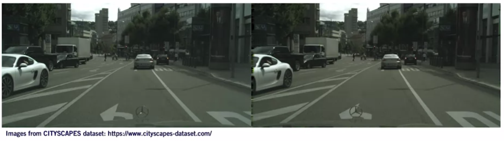
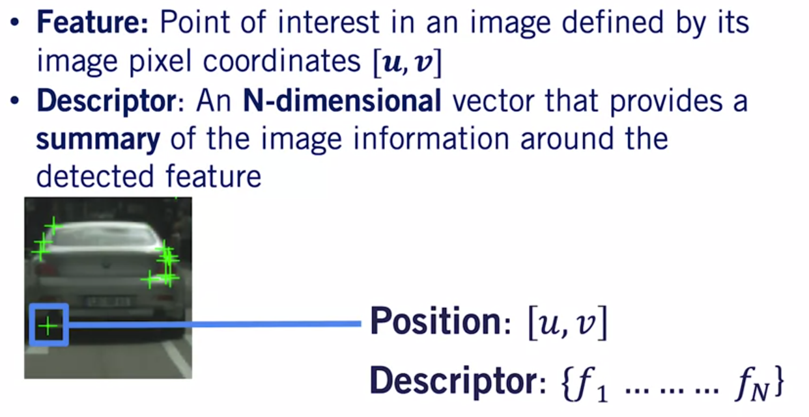
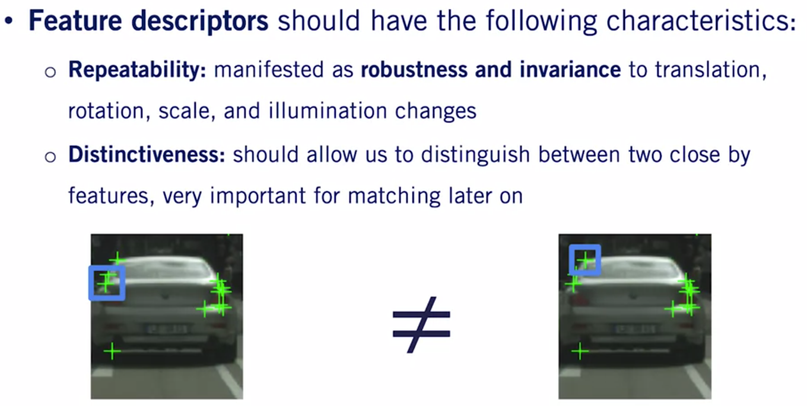
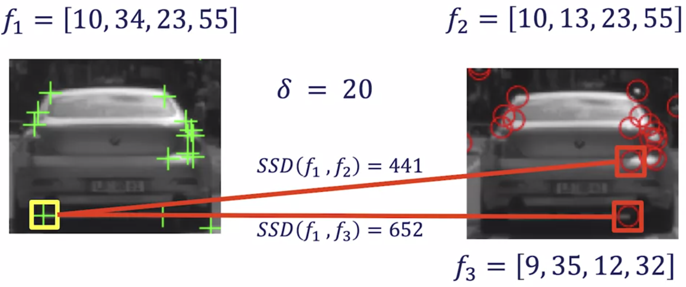
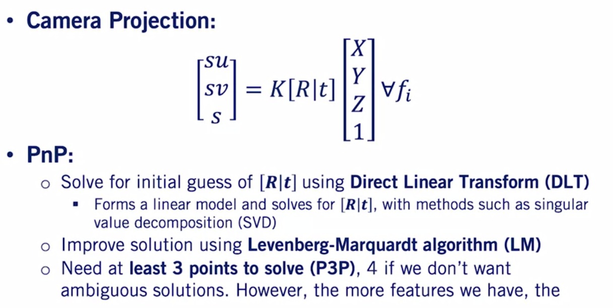

# Course-3-W2-MODULE 2: Visual Features - Detection, Description and Matching

## Overview 
- Visual features are used to track motion through an environment and to recognize places in a map. 
- This module describes how features can be detected and tracked through a sequence of images and fused with other sources for localization as described in Course 2. 
- Feature extraction is also fundamental to object detection and semantic segmentation in deep networks, and this module introduces some of the feature detection methods employed in that context as well.
  
**Course Objectives :**
- Apply feature detection methods to driving images
- Distinguish between different feature detectors and descriptors
- Match image features using brute-force matching
- Perform improved image feature matching with maximum likelihood and KLT
- Formulate and solve visual odometry for a self-driving car dataset
Improve VO performance through outlier rejection

## Image Features and Feature Detectors

### Lesson 1: Introduction to Image features and Feature Detectors

**Image Features: A General Process**

- Let's begin describing this process by taking a real application, image stitching. 
- We're given two images from two different cameras, and we would like to stitch them together to form a panorama. 



- First, we need to identify distinctive points in our images. We call this point image features.
   


- Second, we associate a descriptor for each feature from its neighborhood.


- Finally, we use these descriptors to match features across two or more images. 


- For our application here, we can use the matched features in an `image stitching algorithm` to align the two images and create lovely panorama. 


- Take a look at the details of the stitched panorama. You can see the two images have been stitched together from some of the artifacts at the edge of the image. 

*So how do we do it?* 

**Feature Detection**

But first, let's begin by defining what an image feature really is. 

- **Features** are points of interest in an image. 

This definition is pretty vague, as it poses the following question. 
*What is considered an interesting point?*


- Points of interest should be `distinctive`, and identifiable, and different from its immediate neighborhood. 
- Features should also be `repeatable`. That means that we should be able to extract the same features from two independent images of the same scene. 
- Third, features should be `local`. That means the features should not change if an image region far away from the immediate neighborhood changes. 
- Forth, our features should be `abundant` in an image. This is because many applications such as calibration and localization require a minimum number of distinctive points to perform effectively.
- Finally, generating features `should not require a large amount of computation`, as it is usually used as a pre-processing step for the applications that we've described. 

**Point Of Interest (POI)**

Take a look at the following images. *Can you think of pixels that abide by the above characteristics?*


**Feature Extraction**

- Repetitive texture less patches are very hard to localize. So these are definitely not feature locations. 


- You can see that the two red rectangles located on the road are almost identical. 
  


- Patches with large contrast change, where there's a **strong gradient**, are much easier to localize, but the patches along a certain **image edge** might still be confusing. 
- As an example, the two red rectangles on the edge of the same lane marking look very similar. So again, these are challenging locations to use as features. 


The easiest concept to localize in images is that of a `corner`. A corner occurs when the gradients in at least two significantly different directions are large. Examples of corners are shown in the red rectangles. 


- The most famous corner detector is the `Harris Corner Detector`, which uses image gradient information to identify pixels that have a strong change in intensity in both x and y directions. 

- Many implementations are available online in different programming languages. 

**Feature Detection: Algorithms**

- However, the corners detected by Harris corner detectors are not scale invariant, meaning that the corners can look different depending on the distance the camera is away from the object generating the corner. 
- To remedy this problem, researchers proposed the Harris-Laplace corner detector. `Harris-Laplace detectors` detect corners at different scales and choose the best scale based on the Laplacian of the image.
- Furthermore, researchers have also been able to `machine learn corners`. 
- One prominent algorithm, the fast corner detector, is one of the most used feature detectors due to its very high computational efficiency and solid detection performance. 
- Other scale invariant feature detectors are based on the concept of blobs such as `the Laplacian of Gaussian` or the difference of Gaussian feature detectors of which there are many variance. 
- We will not be discussing these detectors in great depth here, as they represent a complex area of ongoing research, but we can readily use a variety of feature extractors. 
- Thanks to robust open source implementations like OpenCV. 

**Feature Extraction: Harris Corners**

- Now let's see some examples of these detectors in action. 


- Here you can see corners detected by the Harris Corner Detector. 
- The features primarily capture corners as expected, where strong illumination changes are visible. 
- Here you can see Harris-Laplace features on the same image. 
- By using the Laplacian to determine scale, we can detect scale and variant corners that can be more easily matched as a vehicle moves relative to the scene. 
- Scale is represented here by the size of the circle around each feature. The larger the circle, the larger the principal scale of that feature. 

**Summary**

- In this lesson, you learn what characteristics are required for good image features. 
- You also learn the different methods that can be used to extract image features. 
- Most of these methods are already implemented in many programming languages including `Python` and `C++`, and are ready for you to use whenever needed.
- As a matter of fact, you will be using the `OpenCV Python implementation of the Harris-Laplace corner detector` for this week's programming assignment. 

### Lesson 2: Feature Descriptors

Mathematically, we define a feature point by its coordinates $u$ and $v$ in the image frame.



- We define a descriptor $f$ as an n dimensional vector associated with each feature.
- The descriptor has the task of providing a summary of the image information in the vicinity of the feature itself, and can take on many forms.
  
Similar to the design of feature detectors we also have some favorable characteristics required for the design of descriptors to allow for robust feature matching.
 


- As with feature detectors descriptors should be `repeatable`, that means that regardless of shifts in position, scale, and illumination, the same point of interest in two images should have approximately the same descriptor. 
- This invariance in transformations is one of the most researched topics when it comes to descriptor design. 
- And a large amount of work has been done to provide descriptors that are invariant to scale, illumination, and other variables in image formation.

The second important characteristic of a feature descriptor is `distinctiveness`. 



- Two nearby features should not have similar descriptors, as this will confuse our feature matching process later on. 
- Finally, descriptors should be `compact` and `efficient to compute`. 
- This is because we will usually require matching to be performed in real time for autonomous driving applications.

```
- A wide variety of effective descriptors have been developed for feature matching. 
- So let's take a look at a specific case study on the design of a single feature descriptors to give you sense for descriptors work. 
```

**Designing Invariant Descriptors: SIFT**

We will describe how to compute the shift features descriptors specifically designed by `David Lowe` in 1999. 

- The procedure for computing shift feature descriptors is as follows:


- Given a feature in the image, the shift descriptor takes a 16 by 16 window of pixels around it, we call this window the features local neighborhood.
- We then separate this window in to four, 4 by 4 cells such that each cell contains 16 pixels. 
- Next we compute the edges and edge orientation of each pixel in each cell using the gradient filters we discussed in module one.
- For stability of the descriptor, we suppress weak edges using a predefined threshold as they are likely to vary significantly in orientation with small amounts of noise between images.
- Finally, we compute a 32 dimensional histogram of orientations for each cell. 
- And concatenate the histograms for all four cells to get a final 128 dimensional histogram for the feature at hand, we call this histogram or descriptor. 

Some additional post processing is done as well in that it helps the 128 dimensional vector retain stable values under variable contrast, game, and other fundametric variations.

**Scale Invariant Feature Transform**


- **SIFT** is an example of a very well human engineered feature descriptor, and is used in many state-of-the-art systems. 
- It is usually computed over multiple scales and orientations for better scale and rotation invariants. 
- Finally, when combined with a scale invariant feature detector, such as the difference of Gaussian's detector, it results in a highly robust feature detector and descriptor pair.

**Other Descriptors** 

- It is worth mentioning that there is huge literature out there for feature detectors and descriptors. 
- The surf descriptive for example uses similar concepts to **SIFT** while being significantly faster to compute. 

Many other variants exist in the literature including : 


- The Gradient Location-Orientation Histogram or GLOH descriptor. 
- The Binary Robust Independent Elementary Features descriptor (BRIEF)
- The Oriented Fast and Rotated Brief descriptor or ORB. 
- But you may see them in the implementations available for use in Open Source Computer Vision Libraries. 

We've now completed our discussion on feature detectors and descriptors.

- Although most of the discussed algorithms have open source implementations, some like `SIFT` and SURF are patented and should not be used commercially without approval of the authors. 
- Fortunately, the feature detector and descriptor literature up there is vast and some really good algorithms such as ORB match the performance of SIFT and SURF and are free to use even commercially.

**Summary**

- In this lesson, you learned what comprises a feature descriptor, what characteristics are favorable when designing these descriptors. 
- And different algorithms that are available in the open source libraries to extract feature descriptors as you need them.
- In combination with the feature extractors we talked about in the previous video, you're now ready to take on the challenging tasks of matching features between images using their computed descriptors. 

### Supplementary Reading: Feature Detectors and Descriptors

- You can find implementation resources here: https://opencv-python-tutroals.readthedocs.io/en/latest/py_tutorials/py_feature2d/py_table_of_contents_feature2d/py_table_of_contents_feature2d.html
- Textbook: Forsyth, D.A. and J. Ponce (2003). Computer Vision: a modern approach (2nd edition). New Jersey: Pearson. Read section 9.4.
- Haris Corner Detection: https://docs.opencv.org/4.0.0/dc/d0d/tutorial_py_features_harris.html
- Introduction to SIFT (Scale-Invariant Feature Transform): https://docs.opencv.org/4.0.0/da/df5/tutorial_py_sift_intro.html

### Lesson 3 Part 1: Feature Matching

**Image Features: A General Process - Review**

how we intend to use features for a variety of perception tasks. 

- First, we identify image features, distinctive points in our images. 


- Second, we associate a descriptor for each feature from its neighborhood.


- Finally, we use descriptors to match features across two or more images. 

Afterwards, we can use the matched features for a variety of applications including `state estimation`, `visual odometry`, and `object detection`. 

- It is essential to identify matches correctly however, as these applications are susceptible to catastrophic failures if incorrect matches are provided too frequently. 
- As a result, feature matching plays a critical role in robust perception methods for self-driving cars. 

**Feature Matching**

Here's an example of a feature matching problem. Given a feature and it's descriptor in image one, we want to try to find the best match for the feature in image 2 . 


*So how can we solve this problem?*

**Brute Force Feature Matching**

The simplest solution to the matching problem is referred to as brute force feature matching, and is described as the following. 


- First, define a distance function d that compares the descriptors of two features $fi$ and $fj$ , and defines the distance between them. The more similar the two descriptors are to each other, the smaller the distance between them. 
- Second, for every feature $fi$ in image one, we apply the distance function $d$ to compute the distance with every feature $fj$ in image 2 . 
- Finally, we will return the feature which we'll call $fc$ from image 2  with the minimum distance to the feature $fi$ in image 1 as our match. 

This feature is known as `the nearest neighbor`, and it is the closest feature to the original one in the descriptor space. 

**Distance Function**

The most common distance function used to compare descriptors is the sum of squared distances (SSD).


- Which penalizes variations between two descriptors quadratically making it sensitive to large variations in the descriptor, but insensitive to smaller ones. 
- Other distance functions such as the sum of absolute differences or the Hamming distance are also viable alternatives. 
- The sum of absolute difference penalizes all variations equally while the Hamming distance is used for binary features, for which all descriptor elements are binary values. 

We will be using the SSD distance function for our examples to follow. 
Our matching technique and distance choices are really quite simple. 

**Brute Force Feature Matching**

*But what do you think might go wrong with our proposed nearest neighbor matching technique?* 

- Let's look at our first case and see how our brute force matcher works in practice. Consider the feature inside the yellow bounding box. 


- For simplicity, this feature has a four-dimensional descriptor, which we'll call $f1$ . 
- Let's compute the distance between $f1$ and the first feature in the image 2 , which we'll label $f2$ . We get a sum of squared difference or SSD value of nine. 
- We then compute the distance between $f1$ and the second feature in image 2 , which we'll label $f3$ . 
- Here, we get an SSD of 652. We can now repeat this process for every other feature in the second image and find out that all the other distances are similarly large relative to the first one. 


- We therefore choose feature $f2$ to be our match as it has the lowest distance to $f1$ . 
- Visually, our brute force approach appears to be working. As humans, we can immediately see that feature $f1$ in the image is indeed the same point of interest as feature $f2$ in image 2 . 

Now, let us consider a second case where our feature detector tries to match a feature from image one, for which there is no corresponding feature in image 2 . 


- Let's take a look at what the brute force approach will do when our feature detector encounters this situation. 
- Following the same procedure as before, we compute the $SSD$ between the descriptors of a feature $f1$ in image one, and all the features in image 2 .
- Assume that $f2$ and $f3$ are the nearest neighbors of $f1$ and with $f2$ having the lowest score. 
- Although at 441, it is still rather dissimilar to the $f1$ feature descriptor from the original image. 

As a result, $f2$ will be returned as our best match. Clearly, this is not correct. Because feature $f1$ is not the same point of interest as feature f2 in the scene. 
  


*So how can we solve this problem?* 
- We can solve this problem by setting a **distance threshold Delta** on the acceptance of matches. 



- This means that any feature in image 2  with a distance greater than Delta to $f1$ , is not considered a match even if it has the minimum distance to $f1$ among all the features in image 2 .

**Brute Force Feature Matching - Algorithm update**

Now, let's update our brute force matcher algorithm with our threshold. 


- We usually define Delta empirically, as it depends on the application at hand and the descriptor we are using. 

- Once again, we define our distance function to quantify the similarity of two feature descriptors. We also fix a maximum distance threshold Delta for acceptable matches. 

- Then, for every feature in image one, we compute the distance to each feature in image 2  and store the shortest distance or nearest neighbor as the most likely match. 

**Feature Matching**


- Brute force matching is suitable when the number of features we want to match is reasonable, but has quadratic computational complexity making it ill-suited as the number of features increases. 
- For large sets of features, special data structures such as `k-d trees` are used to enhance computation time.
- Both brute force and k-d tree-based matchers are implemented as part of OpenCV, making them easy for you to try out. 
- Just follow the links shown at the bottom of this slide. As a reminder, you can download these lecture slides for your review. 

**Summary**

- By now, you should have a much better understanding of **feature detection**, **description**, and **matching**. 
- These 3 steps are required to use features for various self-driving applications, such as **visual odometry and object detection**. 
- Our brute force matcher is pretty deep, but still `far from perfect`. 
- We really need precise results to create safe and reliable self-driving car perception. 

### Supplementary Reading: Feature Matching

- Feature Matching: https://docs.opencv.org/4.0.0/dc/dc3/tutorial_py_matcher.html

### Lesson 3 Part 2: Feature Matching: Handling Ambiguity in Matching

We're almost ready to start applying **feature detection**, **description**, and **matching** to self-driving car perception.

**Brute Force Feature Matching: Case 1**

But first, let's review the two feature matching cases we discussed in the last lesson : 

- In the first case, we have a useful feature descriptor that clearly gives a small distance to the feature $f2$ and a large distance to other features in the second image. 


- In this case we can successfully identify the correct match to the feature f1 and image one.
- Our brute force matching algorithm works well with this descriptor and as seamlessly capable of finding the right match in image 2 . 

**Brute Force Feature Matching: Case 2**

In the second case, the feature $f1$ in image 1 does not have a match at all in image 2 . 


- We modified our brute force matching algorithm with a threshold delta to eliminate incorrect matches in this case. 
- Since both features and image 2  have a distance greater than the distance threshold Delta, the brute force matcher rejects both the features $f2$ and $f3$ as potential matches and no match is returned. 

**Brute Force Feature Matching: Case 3**

But, let us consider a third case, once again we are trying to match feature $f1$ in image 1 to a corresponding feature in image 2 . 


- With the feature vectors presented here, feature $f1$ gets an SSD value of nine with feature two in image 2 . We test another feature $f3$ , and we also get an SSD of nine. 
- Both of these features have an SSD less than Delta which was 20 in this case, and as such are valid matches. 

*So what should we do?*

- We refer to feature $fi$ in case 3 as a feature with ambiguous matches. 

**Distance Ratio [Lowe 1999]**

An elegant solution to this problem was proposed by David Lowe in 1999. 
The solution goes as follows. 


- First, we compute the distance between feature $fi$ in image 1 and all the features $fj$ in image 2 , similar to our previous algorithm, we choose the feature $fc$ in image 2  with the minimum distance to feature $fi$ in image of one as our closest match. 
- We then proceed to get feature $fs$ the feature in image 2  with the second closest distance to the feature $fi$ . 
- Finally, we find how much nearer our closest match $fc$ is over our second closest match $fs$. 
- This can be done through the distance ratio. The distance ratio can be defined as the distance computed between feature $fi$ in image 1 and $fc$ the closest match in image 2 . 
- Over the distance computed between feature $fi$ and $fs$ , the second closest match in image 2 . 
- If the distance ratio is close to one, it means that according to our descriptor and distance function, $fi$ matches both fs and $fc$.

- In this case, we don't want to use this match in our processing later on, as it clearly is not known to our matcher which location in image 2  corresponds to the feature in image one. 

**Brute Force Feature Matching: Updated**

Let us update our brute force matcher algorithm with the distance ratio formulation. 

- The updates replace the distance with the ratio of distance as our metric to keep matches.


We usually set the distance ratio threshold which we'll refer to as row somewhere around 0.5, which means that we require our best match to be at least twice as close as our second best match to our initial features descriptor.

**Brute Force Feature Matching: Case 3 (Suite)**

Revisiting case 3, we can see that using the distance ratio and a corresponding threshold row set to 0.5, we discard our ambiguous matches and retain the good ones.


**Summary**

- In this video, you've learned what ambiguous matches are, and how to handle these ambiguous matches through the distance ratio formulation. 
- Unfortunately, even with the **distance ratio** formulation, as much as 50 percent of typical matches can still be wrong when using modern descriptors. 
- This is because, repetitive patterns in images and small variations in pixel values, are often sufficient to confuse the matching process. 
- We call these `erroneous matches outliers`. 

### Supplementary Reading: Feature Matching

- Feature Matching + Homography to find Objects: https://docs.opencv.org/4.0.0/d1/de0/tutorial_py_feature_homography.html

## Outlier Rejection & Visual Odometry

### Lesson 4: Outlier Rejection

**Image Features: Localization** 

The three-step feature extraction framework for the real-world problem of vehicle localization. 

Our **localization problem** is defined as follows: given any two images of the same scene from different perspectives, find the translation $T$ , between the coordinate system of the first image shown in red, and the coordinate system of the second image shown in green.


In practice, we'd also want to solve for the `scale` and `skew` due to different viewpoints. But we'll keep this example simple to stay focused on the current topic. 


To solve this localization problem, we need to perform the following steps : 

- First, we need to find the displacement of image 1 on the u image axis of image 2 . We call this displacement $t_{u}$ . 
- Second, we need to find the displacement of image 1 on the $v$ axis of image 2 , and we'll call this displacement $t_{v}$ .


- We will find $t_{u}$ and $t_{v}$ by matching features between the images, and then solving for the displacements that best align these matched features. 

We begin by computing features and their descriptors in image 1 and image 2 . 


- We then match these features using the brute force matcher we developed in the previous lesson. 

*Do you notice anything a little off in the results from our brute force match?* 

- Don't worry. We will come back to these results in a little bit.
- But first, let's define the solution of our problem mathematically in terms of our matched features. 


- We denote a feature pair from images one and two, as $f1_{i}$ and $f2_{i}$. 

- Where $i$ ranges between $0$ ... $n$, the total number of feature pairs returned by our matching algorithm. 
- Each feature in the feature pair is represented by its pixel coordinates $ui$ and $vi$. 
- Note that every pixel in the image ones should coincide with its corresponding pixel in image 2  after application of the translation $t_{q}$ and $t_{v}$ . 
- We can then use our feature pairs to model the translation as follows: the location of a feature in image 1is translated to a corresponding location in image 2  through model parameters $t_{u}$ and $t_{v}$. 
- Here the translations on the $u$ image axis $t_{u}$ , and the $v$ image axis $t_{v}$ , are the same for all feature pairs. Since we assume a rigid body motion. 


- Now we can solve for $t_{u}$ and $t_{v}$ using **least squares estimation**. 
  - The solution to the least squares problem will be the values for $t_{u}$ and $t_{v}$ that minimize the sum of squared errors between all pairs of pixels. 

**Outliers**

Now that we have our localization problem defined, let's return to the results of our feature matching. 


- By observing the feature locations visually, it can be seen that the feature pair in the purple circles is actually an incorrect match. 
- This happens even though we use the distance ratio method, and is a common occurrence in feature matching. We call such feature pairs `outliers`. 
- **Outliers** can comprise a large portion of our feature set, and typically have an out-sized negative effect on our model solution, especially when using least squares estimation. 

- Let us see if we can identify these outliers and avoid using them in our least squares solution. 

``` 
Outliers can be handled using a model-based outlier rejection method called Random Sample Consensus (RANSAC).
```

**Random Sample Consensus (RANSAC)**

- RANSAC developed by Martin Fischler and Robert Bolles in 1981 is one of the most used model-based methods for outlier rejection in robotics. 


- The RANSAC algorithm proceeds as follows: 

1. given a model for identifying a problem solution from a set of data points, find the smallest number M of data points or samples needed to compute the parameters of this model. 
  - In our case, the problem localization and the model parameters, are the t sub u and t sub v offsets of the least square solution. 
2. Second, randomly select M samples from your data. 
3. Third, compute the model parameters using only the M samples selected from your data set
4. Forth, use the computed parameters and count how many of the remaining data points agree with this computed solution. The accepted points are retained and referred to as inliers. 
5. Fifth, if the number of inliers C is satisfactory, or if the algorithm has iterated a pre-set maximum number of iterations, terminate and return the computed solution and the inlier set. Else, go back to step two and repeat. 
6. Finally, recompute and return the model parameters from the best inlier set. The one with the largest number of features. 

Now we can revisit our localization problem and try to accommodate for the outliers from our feature matcher. 

As a reminder, our model parameters $t_{u}$ and $t_{v}$, shift each feature pair equally from the first image to the second. To estimate $t_{u}$ and $t_{v}$, we need one pair of features. 


**RansaC - Iteration 1**

- Now, let us go through the RANSAC algorithm for this problem. 


- First, we randomly select one feature pair from the matched samples. Now, we need to estimate our model using the computed feature pair. 
- Using the feature pair, we compute the displacement along the u image axis, $t_{u}$, and the displacement along the $v$ image axis, $t_{v}$. We now need to check if our model is valid by computing the number of `inliers`.
- Here, we use a tolerance to determine the inliers, since it is highly unlikely that we satisfy the model with a 100% precision. 


- Unfortunately, our first iteration chose a poor feature match to compute the model parameters.
- When using this model to compute how many features in image 1 translate to their matched location in image 2 , we notice that none of them do. 

**RansaC - Iteration 2**

Since our number of inliers is zero, we go back and choose another feature pair at random, and restart the RANSAC process. 


Once again, we compute $t_{u}$ and $t_{v}$, using a new randomly sampled feature pair to get our new model parameters. 


Using the model, we compute how many features and image 1 translate to their match in image 2 . This time we can see that most of the features actually fit this model. 


- In fact 11 out of 12 features are considered in inliers. Since most of our features are inliers, we're satisfied with this model, and we can stop the RANSAC algorithm. 

**Summary**

- At this point you should now understand the proper use of image features for an autonomous vehicle applications. 
- You've learned what outliers are within the scope of feature matching, and how to handle outliers through the RANSAC algorithm. 
- Outlier removal is a key process in improving robustness when using feature matching, and greatly improves the quality of localization results.

### Supplementary Reading: Outlier Rejection

- Forsyth, D.A. and J. Ponce (2003). Computer Vision: a modern approach (2nd edition). New Jersey: Pearson. Read section 19.1-19.3.

### Lesson 5: Visual Odometry

**Visual Odometry** 

```Visual odometry (VO) can be defined as the process of incrementally estimating the pose of the vehicle by examining the changes that motion induces on the images of its onboard cameras.```


- It is similar to the concept of wheel odometry you learned in the second course, but with `cameras` instead of `encoders`.

*What do you think using visual odometry might offer over regular wheel odometry for autonomous cars?*

**Pros**
- Visual odometry does not suffer from wheel slip while turning or an uneven terrain and tends to be able to produce more accurate trajectory estimates when compared to wheel odometry. 
- This is because of the larger quantity of information available from an image. 
  
**Cons**
- However, we usually cannot estimate the absolute scale from a single camera. 
- What this means is that estimation of motion produced from one camera can be stretched or compressed in the 3D world without affecting the pixel feature locations by adjusting the relative motion estimate between the two images. 
- As a result, we need at least one additional sensor, often a second camera or an inertial measurement unit, to be able to provide accurately scaled trajectories when using VO. 
- Furthermore, cameras are sensitive to extreme illumination changes, making it difficult to perform VO at night and in the presence of headlights and streetlights. 
- Finally, as seen with other odometry estimation mechanisms, pose estimates from VO will always drift over time as estimation errors accumulate. For this reason, we often quote VO performance as a percentage error per unit distance traveled. 

**Problem Formulation**

Let's define the visual odometry problem mathematically. 


- Given two consecutive image frames, I_k minus one and I_k, we want to estimate a transformation matrix T_k defined by the translation T and a rotation R between the two frames.
-  Concatenating the sequence of transformations estimated at each time step k from k naught to capital K will provide us with the full trajectory of the camera over the sequence of images. 

`Since the camera is rigidly attached to the autonomous vehicle, this also represents an estimate of the vehicle's trajectory.` 

**Visual Odometry - Model**

Now we'll describe the general process of visual odometry.


-  We are given two consecutive image frames, I_k and I_k minus one, and we want to estimate the transformation T_k between these two frames. First, we perform feature detection and description. 
- We end up with a set of features f_k minus one in image k minus one and F_k in image of k. We then proceed to match the features between the two frames to find the ones occurring in both of our target frames. 
- After that, we use the matched features to estimate the motion between the two camera frames represented by the transformation T_k. 
- Motion estimation is the most important step in VO, and will be the main theme of this lesson. 

**Motion estimation** 

- The way we perform the motion estimation step depends on what type of feature representation we have. 
- In 2D-2D motion estimation, feature matches in both frames are described purely in image coordinates. 


- This form of visual odometry is great for tracking objects in the image frame. This is extremely useful for visual tracking and image stabilization in videography, for example. 
- In 3D-3D motion estimation, feature matches are described in the world 3D coordinate frame. This approach requires the ability to locate new image features in 3D space, and is therefore used with depth cameras, stereo cameras, and other multi-camera configurations that can provide depth information. 
- These two cases are important and follow the same general visual odometry framework that we'll use for the rest of this lesson. 

**3D-2D motion estimation**

- Let's take a closer look at 3D-2D motion estimation, where the features from frame k minus one are specified in the 3D world coordinates while their matches in frame k are specified in image coordinates. 


- Here's how 3D-2D motion estimation is performed. 
- We are given the set of features in frame k minus one and estimates of their 3D world coordinates. Furthermore, through feature matching, we also have the 2D image coordinates of the same features in the new frame k.
-  Note that since we cannot recover the scale for a monocular visual odometry directly, we include a scaling parameter S when forming the homogeneous feature vector from the image coordinates. 
-  We want to use this information to estimate the rotation matrix R and a translation vector t between the two camera frames.
   
*Does this figure remind you of something that we've learned about previously?* 
- If you're thinking of camera calibration, you're correct. 
-  In fact, we use the same projective geometry equations we used for calibration in visual odometry as well. 
-  A simplifying distinction to note between calibration and VO is that the camera intrinsic calibration matrix k is already known.So we don't have to solve for it again. 

-  Our problem now reduces to the estimation of the transformation components $R$ and $t$ from the system of equations constructed using all of our matched features. 

**Perspective N Point algorithm(PNP)**

-  One way we can solve for the rotation and translation t is by using the **Perspective-n-Point algorithm**. 



-  Given feature locations in 3D, their corresponding projection in 2D, and the camera intrinsic calibration matrix $k$ , PnP solves for the extrinsic transformations as follows. 
-  First, PnP uses the Direct Linear Transform to solve for an initial guess for $R$ and $t$ . 
-  The DLT method for estimating $R$ and $t$ requires a linear model and constructs a set of linear equations to solve using standard methods such as SVD. 
-  However, the equations we have are nonlinear in the parameters of $R$ and $t$. In the next step, we'll refine the initial DLT solution with an iterative nonlinear optimization technique such as the **Luvenburg Marquardt method(LM)**. 
-  The PnP algorithm requires at least 3 features to solve for $R$ and $t$ . When only three features are used, 4 possible solutions results, and so a fourth feature point is employed to decide which solution is valid. 
-  Finally, **RANSAC** can be incorporated into PnP by assuming that the transformation generated by PnP on 4 points is our model. 
-  We then choose a subset of all feature matches to evaluate this model and check the percentage of inliers that result to confirm the validity of the point matches selected. 
-  The PnP method is an **efficient approach to solving the visual odometry problem**, but uses only a subset of the available matches to compute the solution. 
-  We can improve on PnP by applying **the batch estimation techniques** you studied in course 2. 
-  By doing so, we can also incorporate additional measurements from other `onboard sensors and incorporate vision into the state estimation pipeline`. 
-  With vision included, we can better handle GPS-denied environments and improve both the accuracy and reliability of our pose estimates. 

**Perspective N Point algorithm(PNP)**

There are many more interesting details to consider when implementing VO algorithms : 


- Fortunately, the PnP method has a robust implementation available in OpenCV. 
- In fact, OpenCV even contains a version of PnP with RANSAC incorporated for outlier rejection. 
-  You can follow the link in the supplementary reading for a description on how to use PnP in `OpenCV`. 

**Summary**

-  In this lesson, you learned why visual odometry is an attractive solution to estimate the trajectory of a self-driving car 
-  How to perform visual odometry for 3D-2D correspondences. 

**Module Conclusion**

-  By this point, you've now finished the second week of visual perception for self-driving cars. 
-  Don't worry if you did not acquire a full grasp of all the material explained in this week. 
-  In this week's assignment, you'll be gaining hands-on experience on all of these topics. 
-  You'll use feature detection, matching, and the PnP algorithm to build your own autonomous vehicle visual odometry system in Python. See you in the next module.


### Supplementary Reading: Visual Odometry

- **SolvePnP** in OpenCV: https://docs.opencv.org/3.4.3/d9/d0c/group__calib3d.html#ga549c2075fac14829ff4a58bc931c033d
- **SolvePnPRansac** in OpenCV: https://docs.opencv.org/3.4.3/d9/d0c/group__calib3d.html#ga50620f0e26e02caa2e9adc07b5fbf24e


### Lab : Visual Odometry for Localization in Autonomous Driving
### Grade

# References
- [Open Source Computer Vision - opencv doc](https://docs.opencv.org/4.0.0/index.html)
- [OpenCV Course - Full Tutorial with Python - Notebook](https://colab.research.google.com/drive/1PqRkXtpaA-GhNSRXTS3W8aQVumX9CGjP#scrollTo=aS4_dZup6bhW)
- [Basics of Brute-Force Matcher](https://docs.opencv.org/4.0.0/dc/dc3/tutorial_py_matcher.html).
- [Computer Vision Datasets - Roboflow](https://public.roboflow.com/)
- [Computer Vision Dataset - Kaggle](https://www.kaggle.com/datasets?tags=13207-Computer+Vision)

Tesla AI Day : 
- [Tesla Autonomy Day - 2019](https://www.youtube.com/watch?v=Ucp0TTmvqOE)
- [Tesla Battery Day - 2020 - during covid](https://www.youtube.com/watch?v=l6T9xIeZTds)
- [Tesla AI Day - 2021](https://www.youtube.com/watch?v=j0z4FweCy4M&t=37s)
- [Tesla AI Day - 2022](https://www.youtube.com/watch?v=ODSJsviD_SU&t=3480s)
# Appendices

- [Harris Affine Region Detector](https://en.wikipedia.org/wiki/Harris_affine_region_detector)
- [15 Best Open-Source Autonomous Driving Datasets](https://medium.com/analytics-vidhya/15-best-open-source-autonomous-driving-datasets-34324676c8d7)
- [Vector Calculus](https://en.wikipedia.org/wiki/Vector_calculus)
- [Analyse Vectorielle - fr](https://fr.wikipedia.org/wiki/Analyse_vectorielle)
- [Differential operator](https://en.wikipedia.org/wiki/Differential_operator)
- [Geometry in Computer Vision](https://en.wikipedia.org/wiki/Category:Geometry_in_computer_vision)
  - [Wikipedia: Determining R and t from Essential Matrix(E)](https://en.wikipedia.org/wiki/Essential_matrix)


