# Course-3-W3-MODULE 3: Feedforward Neural Networks

## Overview

- Deep learning is a core enabling technology for self-driving perception. 
- This module briefly introduces the core concepts employed in modern convolutional neural networks, with an emphasis on methods that have been proven to be effective for tasks such as object detection and semantic segmentation. 
- Basic network architectures, common components and helpful tools for constructing and training networks are described.

## Learning Objectives
- Perform linear regression to estimate the driving road plane from image data
- Build a basic deep neural network for classification
- Define common loss functions for deep convolutional neural networks
- Use backpropagation to compute the gradient of a loss function with respect to network weights for training
- Train a deep convolutional neural network for an autonomous driving classification task

## Neural Networks
### Lesson 1: Feed Forward Neural Networks

**Feedforward Neural Network**

A feedforward neural network defines a `mapping` from an input $x$ to an output $y$ through a function $f$ of $x$ and $\theta$ . 

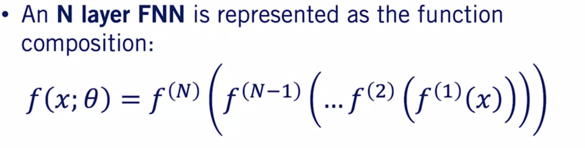

For example, we use neural networks to produce outputs such as **the location of all cars in a camera image**. 

- The function $f$ takes an input $x$, and uses a set of learned parameters $\theta$ , to interact with $x$ , resulting in the output $y$ . 
- The concept of learned parameters is important here, as we do not start with the correct form of the function $f$ , which maps our inputs to our outputs directly. 
- Instead, we must construct an approximation to the true function using a generic neural network. This means that neural networks can be thought of as `function approximators`. 

Usually we describe a feedforward neural network as a function composition :  


- In a sense, each function $f$ of $i$ is a layer on top of the previous function, $f$ of $i- 1$. 
- Usually we have $N$ functions in our compositions where $N$ is a large number, stacking layer upon layer for improved representation. 
- This layering led to the name `deep learning` for the field describing these sequences of functions. 

**Feedforward Neural Network - Example**

Now let us describe this function composition visually. Here you can see a `4-layer feedforward neural network`. 
- This neural network has an `input layer` which describes the data input $x$ to the function approximator.

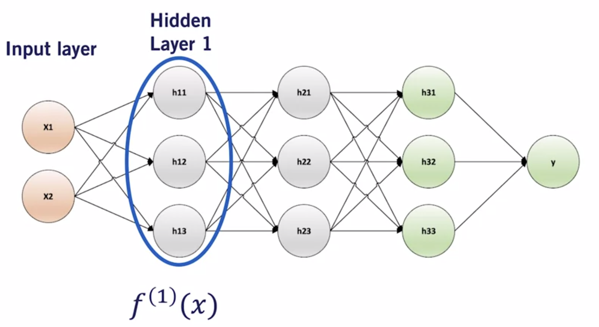

- Here $x$ can be a **scalar**, a **vector**, a **matrix** or even a `n-dimensional tensor` such as **images**.
- The input gets processed by the first layer of the neural network, the function $f1$ of $x$. 
- We call this layer the first hidden layer. Similarly, the second hidden layer processes the output of the first hidden layer through the function $f2$ of $x$. 
- We can add as many hidden layers as we'd like, but each layer adds additional parameters to be learned, and more computations to be performed at run time. 
- We will discuss how the number of hidden layers affects the performance of our system later on in the course. 
  
- The final layer of the neural network is called the `output layer`.

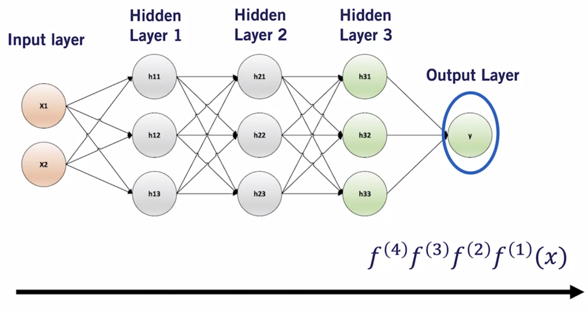

- It takes the output of the last hidden layer and transforms it to a desired output $Y$.

*Now, we should have the intuition on why these networks are called feedforward*.

`This is because information flows from the input $x$ through some intermediate steps, all the way to the output $Y$ without any feedback connections`

The terms are used in the same way as we use them in Course 1, when describing control for our self-driving car. 

**FNN**

Now let us go back to the network definition and check out how our visual representation matches our function composition. 

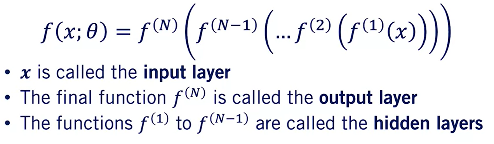

- In this expression we see $x$ , which is called the input layer. We see the outer most function $f_{N}$ , which is the output layer. And we see each of the functions $f1$ to $f_{N-1}$ in between, which are the hidden layers. 

Now before we delve deeper into these fascinating function approximators, let's look at a few examples of how we can use them for autonomous driving.   

`Remember, this course is on visual perception, so we'll restrict our input x to always be an **image**.` 

**FNN - Classification & Detection Example**

- The most basic perception task is that of `classification`. Here we require the neural network to tell us what is in the image via a label. 
- We can make this task more complicated by trying to estimate a location as well as a label for objects in the scene.This is called `object detection`

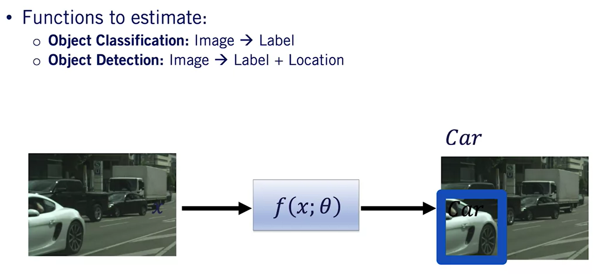

**FNN - Depth Estimation Example**

- Another set of tasks we might be interested in are pixel-wise tasks. As an example we might want to estimate a depth value for every pixel in the image. This will help us determine where objects are. 

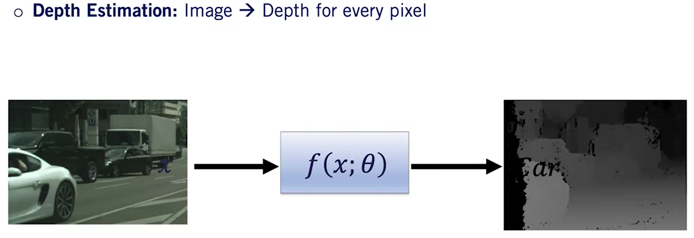

**FNN - Semantic Segmentation Example**

- Or, we might want to determine which class each pixel belongs to. This task is called `semantic segmentation`. 

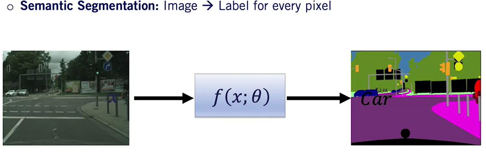

- In each case, we can use a neural network to learn the complex mapping between the raw pixel values from the image to the perception outputs we're trying to generate, without having to explicitly model how that mapping works. 

- This flexibility to represent hard-to-model processes is what makes neural networks so popular. 

**Mode Of Action Of Neural Networks**

Now let's take a look at how to learn the parameters needed to create robust perception models.

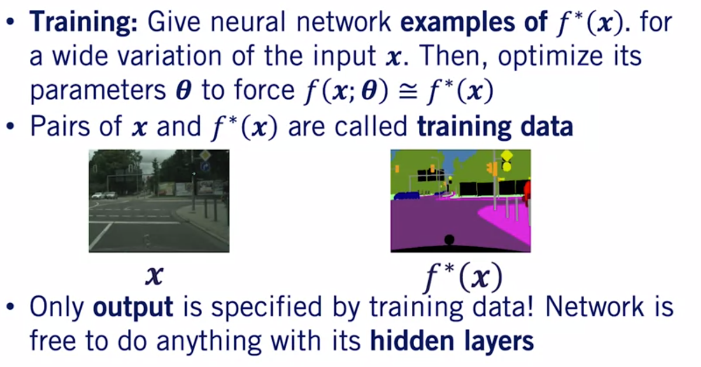

- During a process referred to as Neural Network Training, we drive the neural network function $f(x)$ and theta to match a true function $f*(x)$ by modifying the parameters theta that describe the network. 
- The modification of theta is done by providing the network pairs of input x and its corresponding true out output $f*(x)$ . 
- We can then compare the true output to the output produced by the network and optimize the network parameters to reduce the output error. 
- Since only the output of the neural network is specified for each example, the training data does not specify what the network should do with its hidden layers. 
The network itself must decide how to modify these layers to best implement an approximation of $f*(x)$ . As a matter of fact, hidden units are what make neural networks unique when compared to other machine learning models. 

**Hidden Units**

So let us define more clearly the hidden layer structure. 

- The hidden layer is comprised of an affine transformation followed by an element wise non-linear function $g$ . 

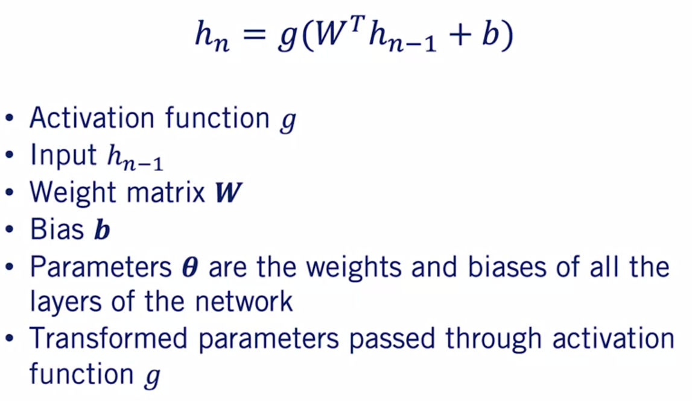

- This non-linear function is called the activation function. The input to the nth hidden layer is $h_{n-1}$ , the output from the previous hidden layer. 
- In the case where the layer is the first hidden layer, its input is simply the input image $x$. The affine transformation is comprised of a multiplicative weight matrix W, and an additive bias Matrix $B$ . 
- These weights and biases are the learn parameters theta in the definition of the neural network. 
- Finally, the transformed input is passed through the activation function $g$. Most of the time, $g$ does not contain parameters to be learned by the network. 

**The Rectified Linear Unit - ReLU**

As an example, let us take a look at the rectified linear unit (ReLU), **the default choice** of activation functions in most neural networks nowadays. 

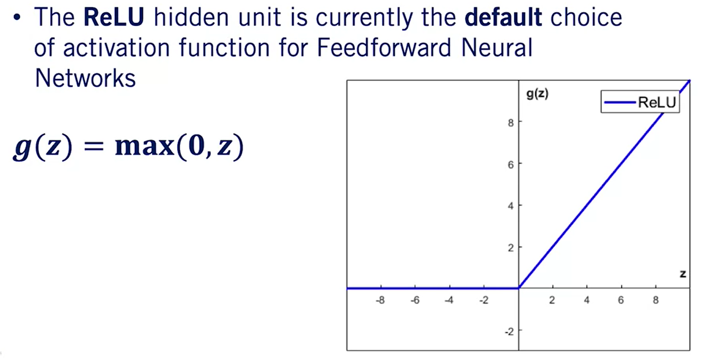

- **ReLUs** use the maximum between 0 and the output of the affine transformation as their element-wise non-linear function. 
- Since they are very similar to linear units, they're quite easy to optimize. 

**Example: Hidden Layer With RELU Activation Function**

Let us go through an example of a ReLU hidden-layer computation. 
- We are given the output of the previous hidden layer $h_{n-1}$ , the weight matrix $W$ , and the `bias matrix` $b$ . 

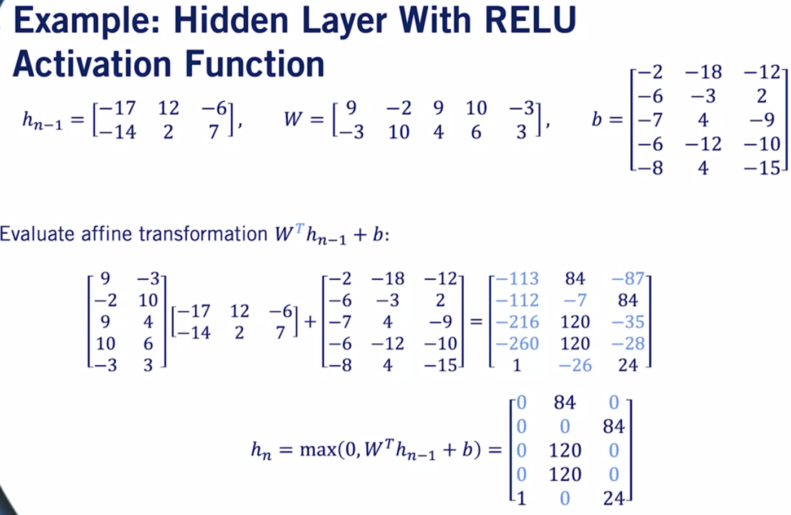

- We first need to evaluate the `affine transformation`. Remember, the weight matrix is transposed in the computation. 
- Let's take a look at the dimensions of each of the matrices in this expression. $h_{n-1}$ is a 2x3 matrix in this case. 
- $W$ is a 2x5 matrix. The final result of our affine transformation is a 5x3 matrix. 

Now, let us pass this matrix through the ReLU non-lineary. 
- We can see that the ReLU prevents any negative outputs from the affine transformation from passing through to the next layer. 

**Other activation functions in research field**

- There are many additional activation functions that can be used as element wise non-linearities in hidden layers for neural networks. 
- In fact, the design of hidden units is another extremely active area of research in the field and does not yet have many guiding theoretical principles. 
- As an example, certain neural network architectures use the sigmoid non-linearity, the hyperbolic tangent non-linearity, and the generalization of ReLU, the maxout non-linearity as their hidden layer activation functions. 

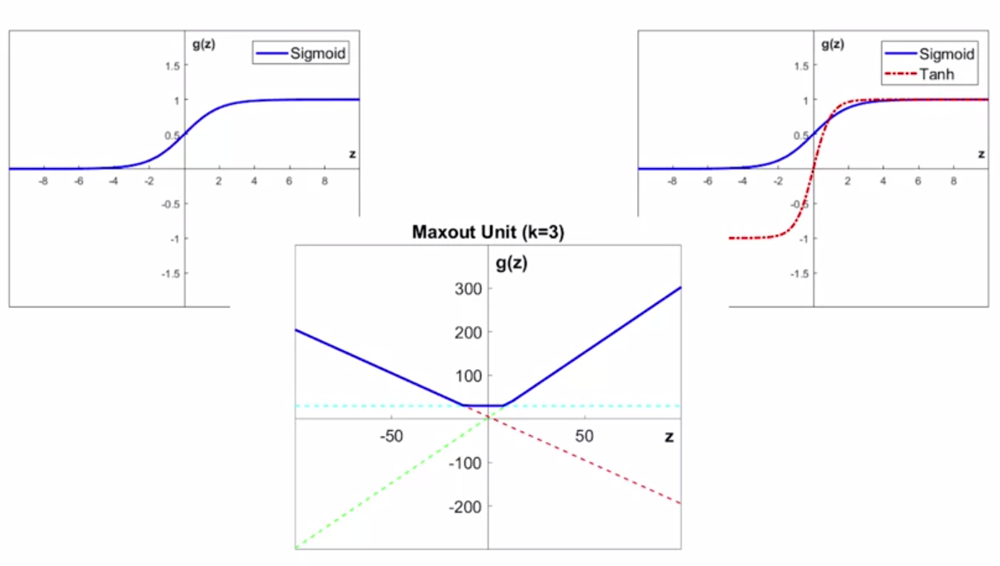

- If you're interested in learning more about neural network architectures, I strongly encourage you to check out some of the deep learning courses offered on Coursera. They're amazing. 

**Summary**

- In this lesson, you learned the main building blocks of feedfoward neural networks including the hidden layers that comprise the core of the machine learning models we use. 
- You also learned different types of activation functions with ReLUs being the default choice for many practitioners in the field. 

### Supplementary Reading: Feed-Forward Neural Networks

- Goodfellow, I., Bengio, Y., Courville, A., & Bengio, Y. (2016). Deep Learning (Vol. 1). Cambridge: MIT press. Read sections 6.1, 6.3. https://www.deeplearningbook.org/.

### Lesson 2: Output Layers and Loss Functions

**Machine Leaning Algorithm Design Process**

Generally, supervised machine learning models including neural networks have two modes of operation : 
- **inference** 
- **training**. 

Recall are basic neural network formulation. 
- Given a set of parameters data, the input $x$ is passed through the model $f(x:theta)$ to get an output $y$. 

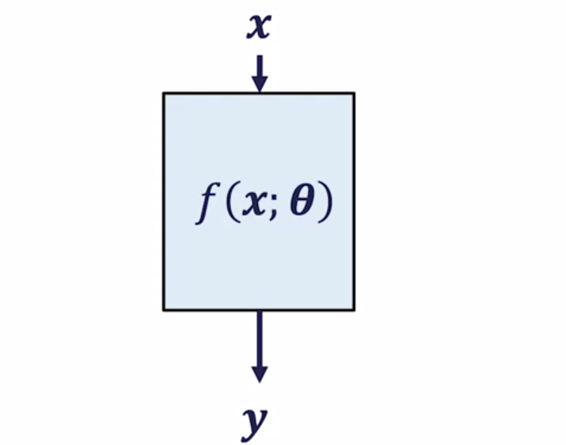

- This mode of operation is called `inference`, and is usually the one we usually `deploy` the machine learning algorithms in the real world. 
- The network and its parameters are fixed and we use it to extract perception information from new input data. 
- However, we still need to define how to obtain the parameter set data. 

Here we need a second mode of operation involving optimization over the network parameters. 

This mode is called `training` and has the sole purpose of generating a satisfactory parameter set for the task at hand. 

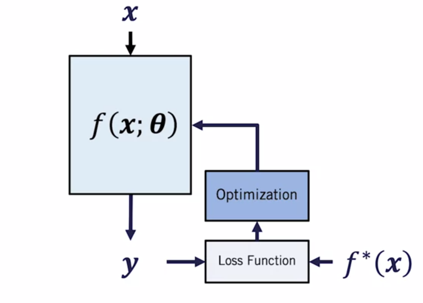

- We start with the same workflow as inference. However, during training we have training data. As such we know what $f^{*}(x)$ is, the expected output of the model.
- For self-driving, this training data often takes the form of human annotated images which take a long time to produce. 
- We compare our inference to a predicted output $y$ , to the true output $f^{*}(x)$ , through a loss or a cost function. 
- The loss function takes as an input the predicted output y from the network, and the true output $f^{*}(x)$ , and provides a measure of the difference between the two. 
- We usually try to minimize this measure by modifying the parameters data so that the output $y$ from the network is as similar as possible to the $f^{*}(x)$. 
- We do this modification to data via an optimization procedure. 
- This optimization procedure takes in the output of the loss function and provides a new set of parameters data that provide a lower value for that loss function. 


**Artificial Neural Networks**

By extending the design process to neural networks. 

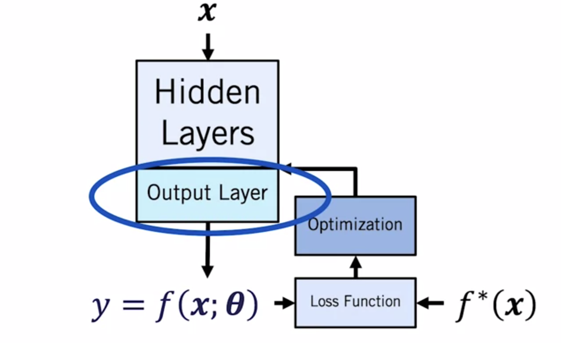

- We discussed in the last lesson a feed-forward neural network which takes an input $x$ , passes it through a sequence of hidden layers, then passes the output of the hidden layers through an output layer. 
- This is the end of the inference stage of the neural network. 
- For `training`, we pass the predicted output through the loss function, then use an optimization procedure to produce a new set of parameters data that provide a lower value for the loss function. 

```The major difference between the design of traditional machine learning algorithms in the design of artificial neural networks, is that the neural network only interacts with the loss function via the output layer```. 

- Therefore, it is quite reasonable that the output layer and the loss function are designed together depending on the task at hand. 

**Tasks: Classification and Regression**

Let's dig deeper into the major perception tasks we usually encounter in autonomous driving. 

- The first important task that we use for autonomous driving perception is `classification`. 

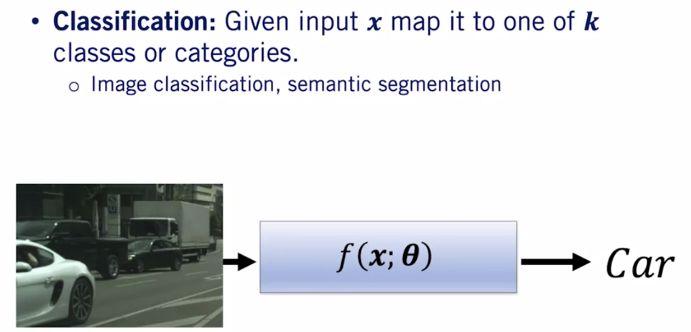

- **Classification** can be described as taking an input x and mapping it to one of k classes or categories. 
- Examples include : 
  - **image classification**, where we just want to map an image to a particular category, to say whether or not it contains cats or dogs for example
  - **semantic segmentation**, where we want to map every pixel in the image to a category.
 
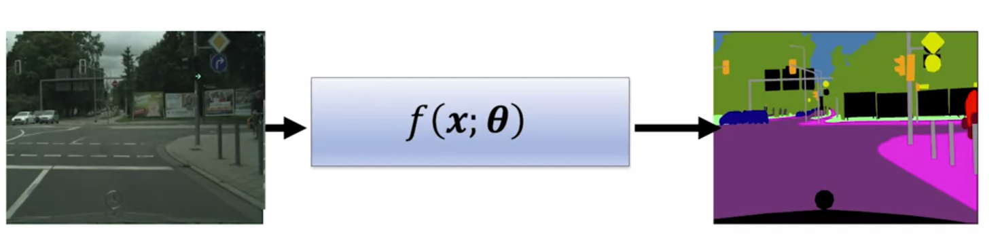

- The second task that we usually use for autonomous driving perception is a `regression`. 

- In regression, we want to map inputs to a set of real numbers. 
- Examples of regression include, 
  - depth estimation, where we want to estimate a real depth value for every pixel in an image. 

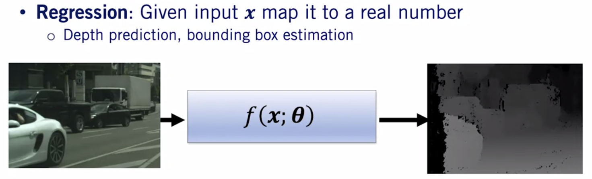

- We can also mix the two tasks together. 
  - For example : 
    - **object detection**is usually comprised of a regression task where we estimate the bounding box that contains an object 
    - **classification** task where we identify which type of object is in the bounding box.

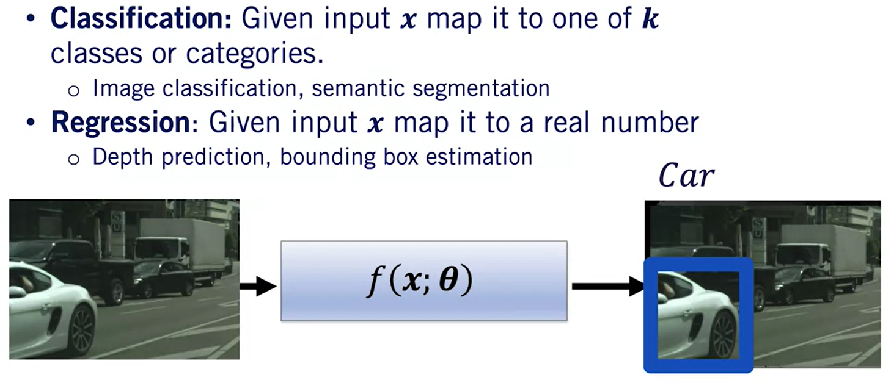

**Classification: Softmax Output  Layers**

We will now describe the output layer loss function pairs associated with each of these basic perception tasks. 

Let's start with the classification task first.Usually, for a $k$ class classification tasks, we use the `softmax output layer`. 

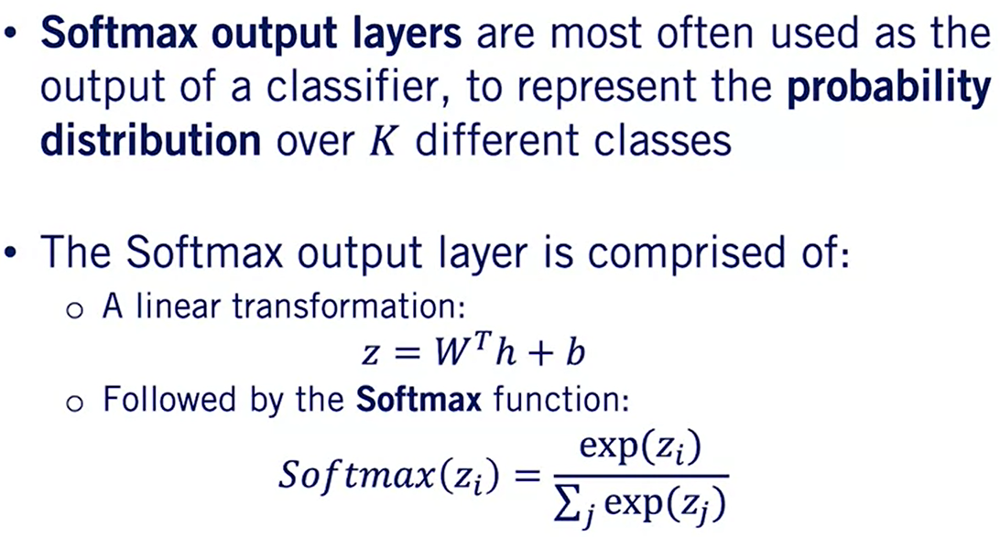

- **Softmax output layers** are capable of representing a probability distribution over $k$ classes. 
- The softmax output layer takes as input $h$, the output of the last hidden layer of the neural network. 

- It then passes it through an affine transformation resulting in a transformed output vector $z$. 
- Next, the vector $z$ is transformed into a discrete probability distribution using the softmax element-wise function. 
- For each element $z_{i}$, this function computes the ratio of the exponential of element $z_{i}$ over the sum of the exponentials of all of the elements of $z$.
- The result is a value between zero and one and the sum of all of these elements is one, making it a proper probability distribution. 

Let's take a look at a numerical example to better explain the softmax output layer. 

In this example, we'd like to classify images containing a cat, a dog or a fox. 

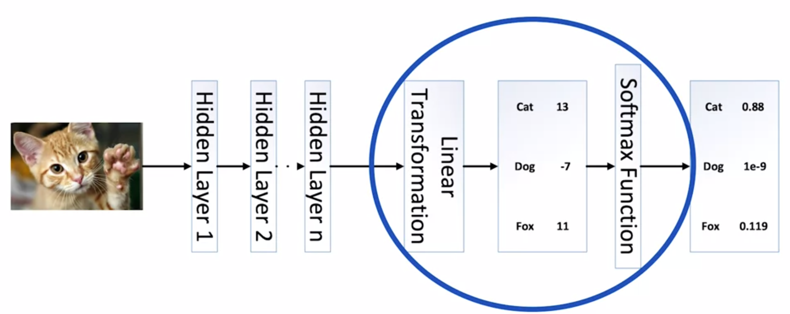

- First we define the first element of our output vector to correspond to the probability that the image is a cat according to our network. 
- The ordering of classes is arbitrary and has no impact on network performance. 
- Taking the output of the affine transformation, we compute the probability by dividing the exponential of each elements of the output by the sum of the exponentials of all of the elements. 
- Given values of 13 minus seven and 11 as the outputs of the linear transformation layer, we achieve a probability of 88% that this image is a cat, 11.9% that this image is a fox and a very low probability that this image is a dog. 

**Classification: Cross-Entropy Loss Function**

Now, let's see how to design a loss function that uses the output of the softmax output layer to show us how accurate our estimate is. 

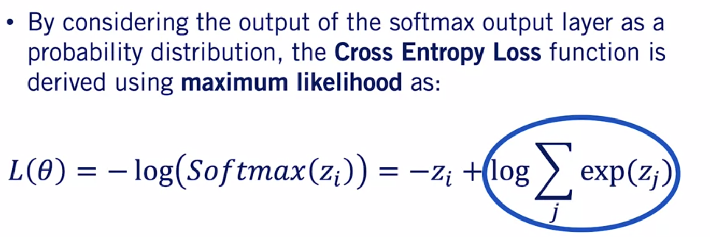

- The standard loss function to be used with the softmax output layer is the `Cross-Entropy Loss`, which is formed by taking the negative log of the softmax function. 
- The Cross-Entropy Loss has two terms to control how close the output of the network is to the true probability. 
- $Z_{i}$ is the output of the hidden layer corresponding to the true class before being passed through the softmax function.

- This is usually called the class logit which comes from the field of logistic regression.
- When minimizing this loss function, the negative of the class logit $z_{i}$ encourages the network to output a large value for the probability of the correct class.   
- The second term on the other hand, encourages the output of the affine transformation to be small. 

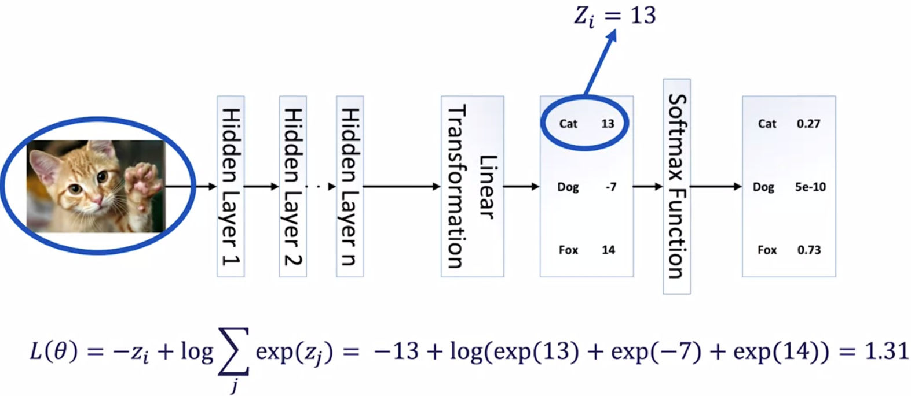

- The two terms together encourages the network to minimize the difference between the predicted class probabilities and the true class probability. 
- To understand this loss better. Let's take a look at a numerical example on how the Cross-Entropy Loss is computed from the output of a classification neural network. 

**Classification: Softmax Output Layers**

Revisiting our previous example, we first need to choose what our $z_{i}$ is. 

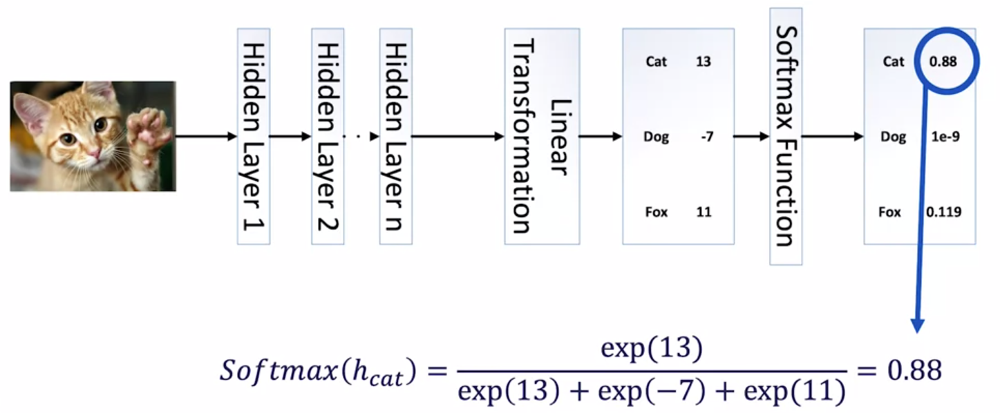

- $Z_{i}$ is the linear transformation output corresponding to the true class of inputs. 
- In this case, $z_{i}$ is the element of the output of the linear transformation corresponding to the cat class. 
- Once we determine $z_{i}$ , we use the Cross-Entropy to compute the final loss value. 
- In this case, the network correctly predicts that the input is a cat and sees a loss function value of **0.12**. 
- Let us now do the computation again but with an erroneous network output. The input to the network is still a cat image. 
- The network still assigns the value of **13** to the cat entry of the output of the linear transformation. But this time the fox entry will get a value of **14**. 
- Computing the Cross-Entropy Loss, we find that it evaluates to **1.31** more than ten times the value of the previous slide. 
- Note how the loss function heavily penalizes erroneous predictions even when the difference in output is only one. 

```This difference accelerates the learning process and rapidly steers network outputs to the true values during training.```

**Regression: Linear Output Layers**

Let's now go through the most common output layer for the regression task. 

The linear output layer is mostly used for regression tasks to model statistics of common probability distributions. 

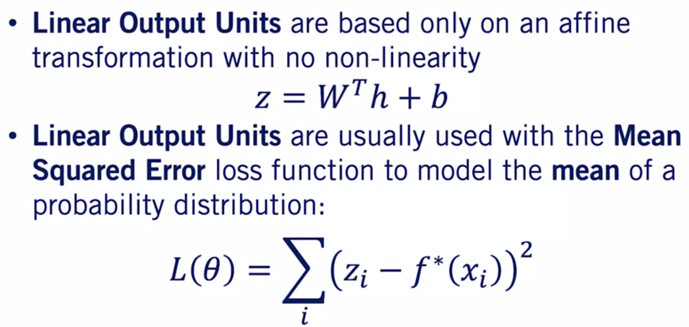

- The linear output layer is simply comprised of a single affine transformation without any non-linearity. 
- The statistics to be modeled with the linear output layer depends on the loss function we choose to go with it. 

For example, to model the mean of a probability distribution, we use `the mean squared error` as our loss function. 
- The linear and softmax output units described above are the most common output layers used in neural networks today and can be coupled with a variety of tasks specific loss functions to perform a variety of useful perception tasks for autonomous driving. 

- Many other output layers and loss functions exist and this remains an active area of research in deep learning. 

**Summary**

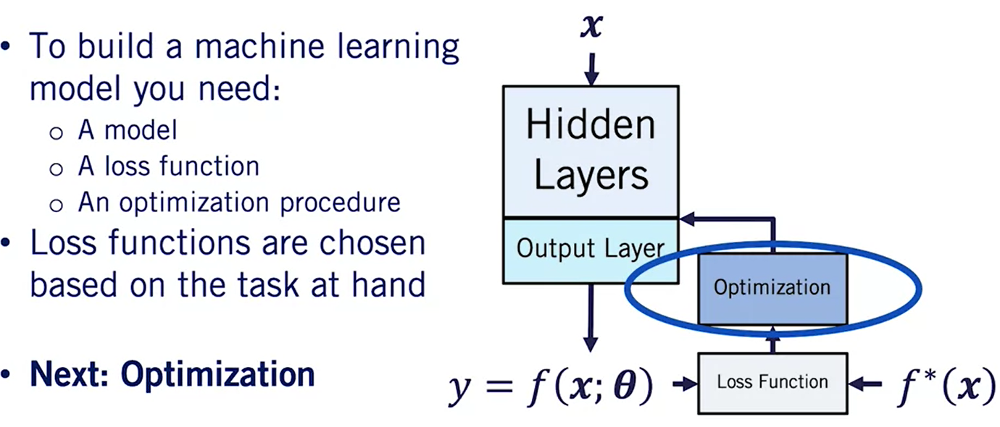

- In this lesson, you learned that to build a machine learning model you need to define a **network model**, a **loss function** and an **optimization procedure** to learn the network parameters. 
- You also learn what loss function to choose based on the task that needs to be done by the neural network model. 

### Supplementary Reading: Output Layers and Loss Functions

- Goodfellow, I., Bengio, Y., Courville, A., & Bengio, Y. (2016). Deep Learning (Vol. 1). Cambridge: MIT press. Read sections 6.2, 6.4. https://www.deeplearningbook.org/


### Lesson 3: Neural Network Training with Gradient Descent


So far in this module, we have reviewed what comprises a feedforward neural network model, and how to evaluate the performance of a neural network model using loss functions. 

- This lesson will explain the final major component of designing neural networks, the training process. Specifically, we will be answering the following question. 

*How can we get the best parameter set theta for a feedforward neural network given training data?*
- The answer lies in using an iterative optimization procedure with proper parameter initialization. 

**Review: Artificial Neural Networks**

Let us first revisit the feedforward neural network training procedure we described previously. 

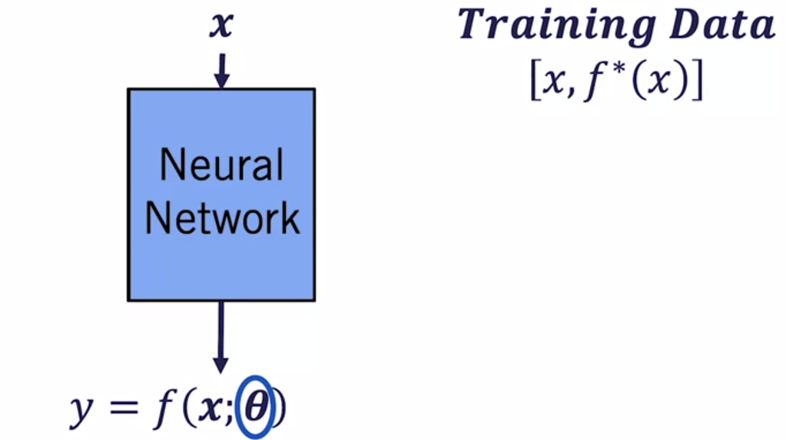

- Given a training data input $x$ and the corresponding correct output, $f(x: \theta )$ , we first pass the input $x$ through the hidden layers, then through the output layer to get the final output $y$. 
- We see here that the output $y$ is a function of the parameters $\theta$ . And remember, that theta comprises the weights and the biases of our affine transformations inside the network. 
- Next, we compare our predicted output $f(x: \theta )$ and theta with the correct output, $f^{*}(x)$ through the loss function.
  
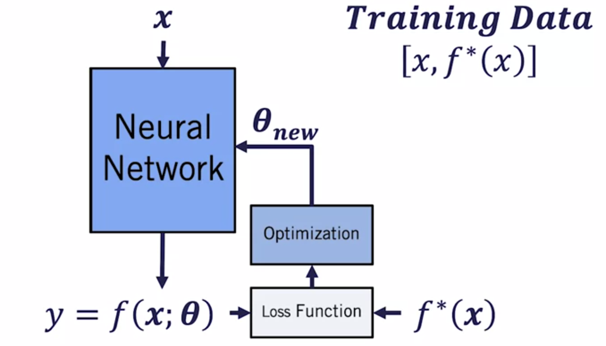

- Remember that the loss function measures how large the error is between the network output and our true output. 
- Our goal is to get a small value for the loss function across the entire data set. 
- We do so by using the loss function as a guide to produce a new set of parameters theta that are expected to give a lower value of the loss function. 
- Specifically, we use the gradient of the loss function to modify the parameters theta.This optimization procedure is known as `gradient descent`. 

**Review: Neural Networks Loss Functions**

Before describing gradient descent in detail, let's take another look at the neural network loss function. 

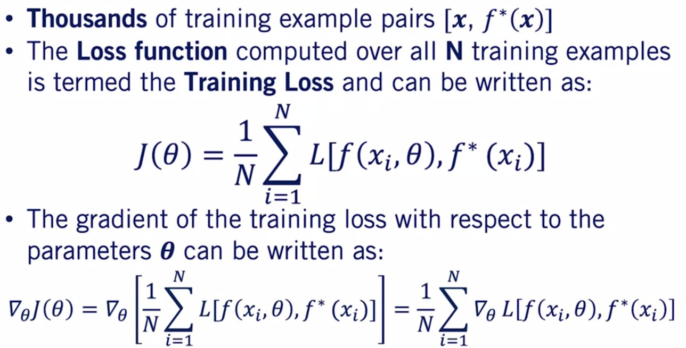

- Usually, we have thousands of training example pairs, $x$ and $f^{*}(x)$ , available for autonomous driving tasks. 
- We can compute the loss over all training examples, as the mean of the losses over the individual training examples. 
- We can then compute the gradient of the training loss with respect to the parameters theta which is equal to the mean of the gradient of the individual losses over every training example. 
- Here we use the fact that the gradient and the sum are linear operators. So the gradient of a sum is equal to the sum of the individual gradients. 
- Using the formulated gradient equation, we can now describe `the batch gradient descent optimization algorithm`. 

**Batch gradient descent**

- **Batch gradient descent** is a linear first order optimization method. 

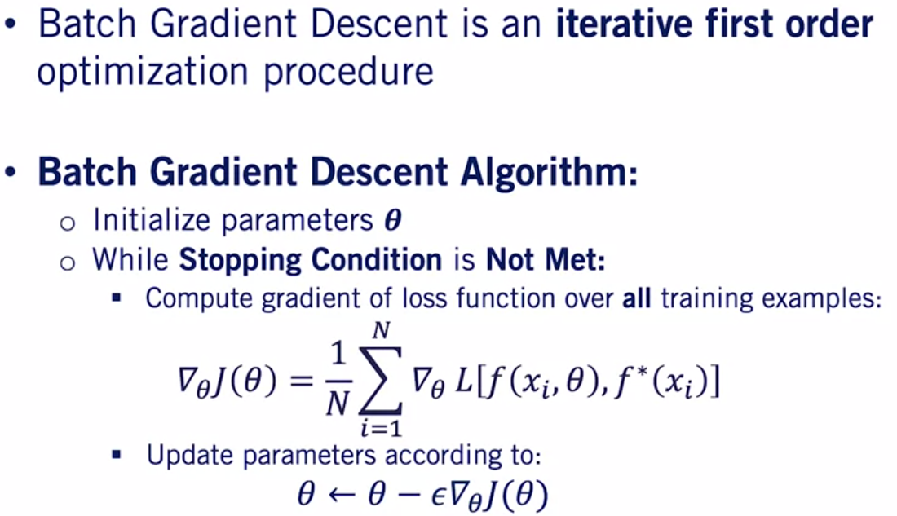

- Iterative means that it starts from an initial guess of parameters theta and improves on these parameters iteratively. 
- First order means that the algorithm only uses the first order derivative to improve the parameters theta. Batch gradient descent goes as follows. 
  - First, the parameters theta of the neural network are initialized. 
  - Second, a stopping condition is determined, which terminates the algorithm and returns a final set of parameters. 
  - Once the iterative procedure begins, the first thing to be performed by the algorithm is to compute the gradient of the loss function with respect to the parameters $\theta$ , denoted $V_{\theta}$ . 
  - The gradient can be computed using the equation we derived earlier. 
  - Finally, the parameters theta are updated according to the computed gradient. 
  - Here, $\epsilon$ is called **the learning rate** and controls how much we adjust the parameters in the direction of the negative gradient at every iteration. 

Let's take a look at a visual example of batch gradient descent in the 2D case. 

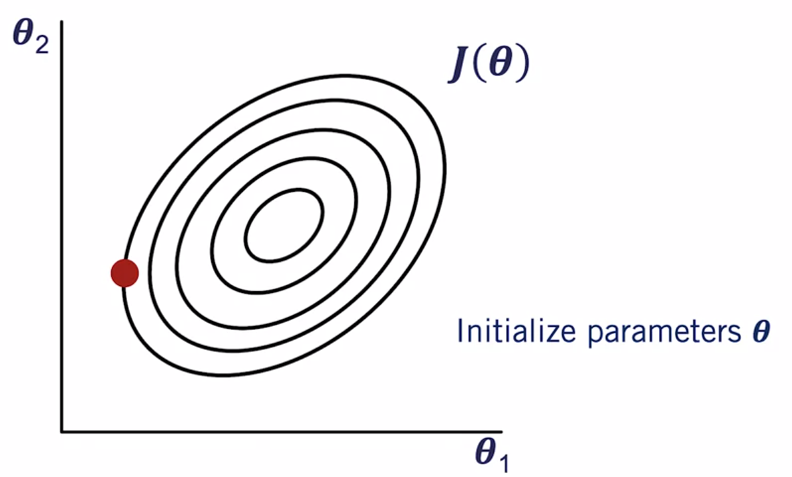

- Here, we are trying to find the parameters $\theta_{1}$ and $\theta_{1}$ that minimize our function $J_{\theta}$ . 
- Theta is shaped like an oblong ball shown here with contour lines of equal value. 
- Gradient descent iteratively finds new parameters theta that take us a step down the bowl at each iteration. 
- The first step of the algorithm is to initialize the parameters theta. Using our initial parameters, we arrive at an initial value for our loss function denoted by the red dot. 
- We start gradient descent by computing the gradient of the loss function at the initial parameter values  $\theta_{1}$ and  $\theta_{2}$. 

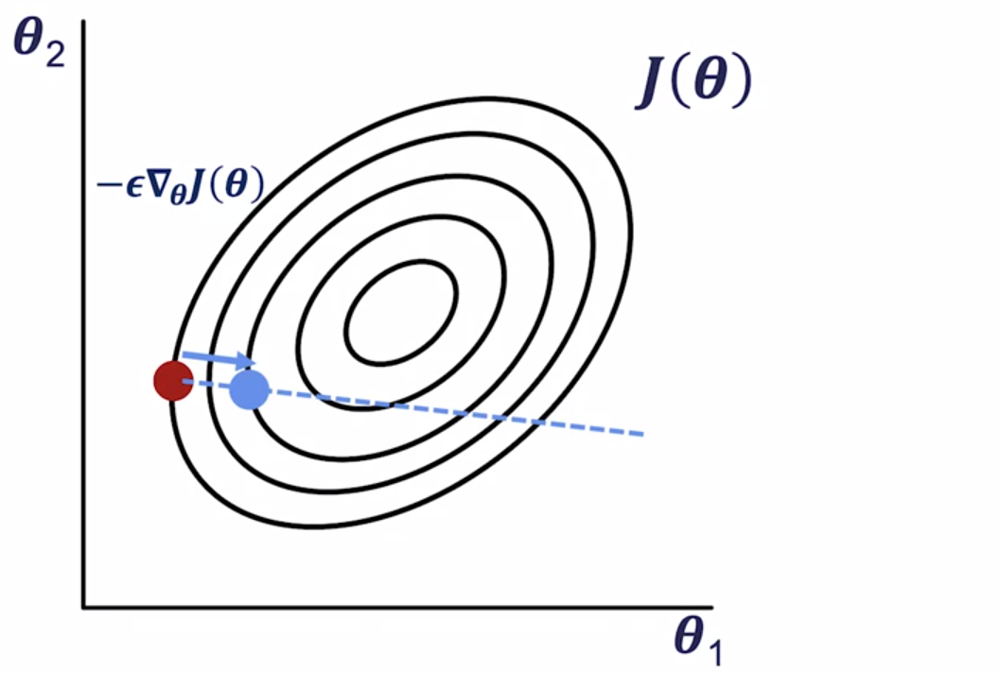

- Using the update step, we then get the new parameters to arrive at a lower point on our loss function. 
- We repeat this process until we achieve our stopping criteria. 

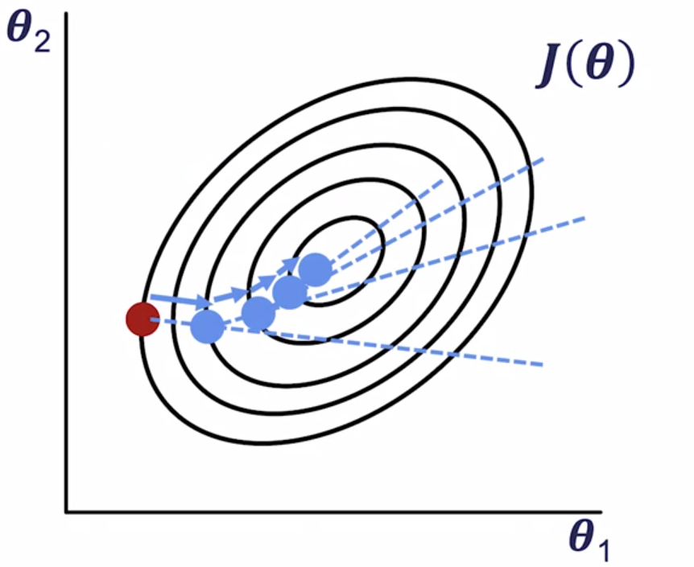

- We then get the last set of the parameters, $\theta_{1}$ and  $\theta_{2}$ as our optimal set that minimizes our loss function. 

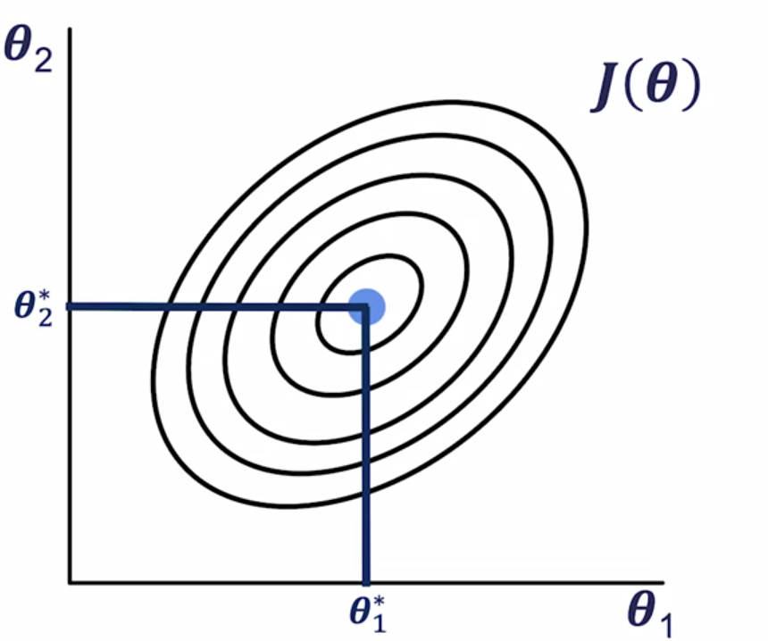

Two pieces are still missing from the presented algorithm : 
- How do we initialize the parameter's data
- how do we decide when to actually stop the algorithm?

- The answer to both of these questions is still highly based on heuristics that work well in practice. 


**Parameter Initialization and Stopping Conditions**

For parameter initialization, we usually initialized the weights using a standard normal distribution and set the biases to 0.

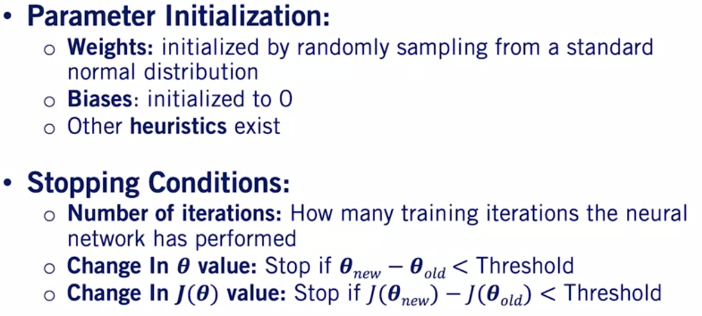

- It is worth mentioning that there are other heuristics specific to certain activation functions that are widely used in a literature. We provide some of these heuristics in a supplementary material. 
- Defining the gradient descent's stopping conditions is a bit more complex. There are three ways to determine when to stop the training algorithm. 
- Most simply, we can decide to stop when a predefined maximum number of gradient descent iterations is reached. 
- Another heuristic is based on how much the parameters $\theta$ changed between iterations. 
- A small variation means the algorithm is not updating the parameters effectively anymore, which might mean that a minimum has been reached. 
- The last widely used stopping criteria is the change in the loss function value between iterations. 
- Again, as the changes in the loss function between iterations become small, the optimization is likely to have converged to a minimum. 
- Choosing one of these stopping conditions is very much a matter of what works best for the problem at hand.
- We will revisit the stopping conditions in the next lesson, as we study some of the pitfalls of the training process, and how to avoid them. 

Unfortunately, the batch gradient descent algorithm suffers from severe `drawbacks`.

- To be able to compute the gradient we use `backpropogation`. 

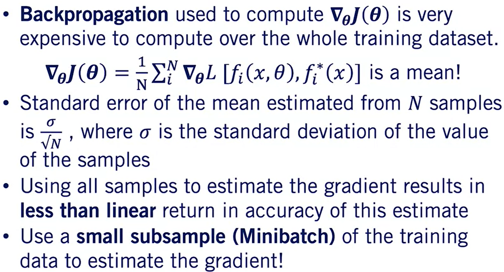

- **Backpropogation** involves computing the output of the network for the example on which we would like to evaluate the gradient. 
- **And batch gradient descent evaluates the gradient over the whole training set**. Making it very slow to perform a single update step. 
- Luckily, the laws function as well as its gradient are means over the training dataset.
- For example, we know that the standard error in a mean estimated from a set of N samples is sigma over the square root of N.

- Where sigma is the standard deviation of the distribution and N as the number of samples used to estimate the mean. 
- That means that the rate of decrease in error in the gradient estimate is less than linear in the number of samples. 

- This observation is very important, as we now can use a small sub-sample of the training data or a mini batch to compute our gradient estimate. 

*So how does using mini batches modify our batch gradient descent algorithm?*

**Stochatisc (minibatch) Gradient Descent**

The modification is actually quite simple. 

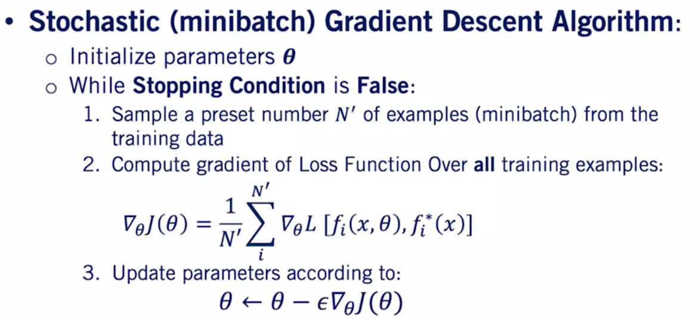

- The only alteration to the base algorithm is at the sampling step. Here we choose the sub sample $N$ prime of the training data as our mini batch. 
- We can now evaluate the gradient and perform the update steps in an identical manner to batch grading descent. 
- This algorithm is called `stochastic or minibatch gradient descent`, as we randomly select samples to include in the minibatches at each iteration. 

However, this algorithm results in an additional parameter to be determined, which is the size of the minibatch that we want to use. 

**What Minibatch Size to Use?**

To pick an appropriate minibatch, it has to be noted that some kinds of hardware achieve better runtime with specific sizes of data arrays. 

- Specifically when using GPUs, it is common to use power of two mini batch sizes which match GPU computing and memory architecture as well. And therefore, use the GPU resources efficiently. 
- Let's look at some of the factors that drive batch size selection.  

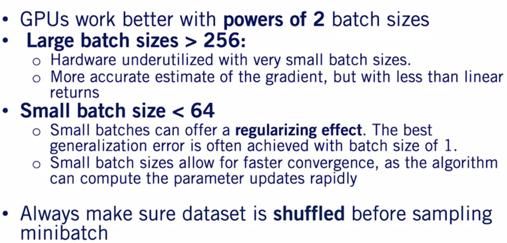

- Multi-core architectures such as GPUs are usually under-utilized by extremely small batch sizes, which motivates using some absolute minimum batch size below which there's no reduction in the time to process a minibatch. 

- Furthermore, large batch sizes usually provide a more accurate estimate of the gradient. Ensuring descent in a direction that improves the network performance more reliably.
- However as noted previously, this improvement in the accuracy of the estimate is less than linear. Small batch sizes on the other hand have been seen to offer a regularlizing effect.
- With the best generalization often seen at a batch size of one. If you're not sure what we mean by generalization, don't worry. As we'll be exploring it more closely in the next lesson. 
- Furthermore, optimization algorithms usually converge more quickly if they're allowed to rapidly compute approximate estimates of the gradients and iterate more often rather than computing exact gradients and performing fewer iterations. 
- As a result of these trade-offs, typical power of two mini batch sizes range from 32 to 256, with smaller sizes sometimes being attempted for large models or to improve generalization. 
- One final issue to keep in mind is the requirement to shuffle the dataset before sampling the minibatch. 

`Failing to shuffle the dataset at all can reduce the effectiveness of your network`. 


**SGD Variations**

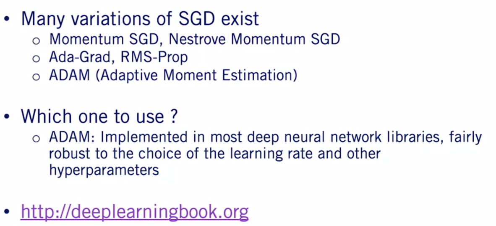

- There exist many variants of stochastic gradient descent in the literature, each having their own advantages and disadvantages. 
- It might be difficult to choose which variant to use, and sometimes one of the variants works better for certain problem than another. 
- As a simple rule of thumb for autonomous driving applications, a safe choice is the **ADAM optimization method**. It is quite robust to initial parameters theta, and widely use. 
- If you are interest in learning more about this variance, have a look at the resources listed in the supplemental notes. 

**Summary**

- In this lesson, you learned how to optimize the parameters of a neural network using batch gradient descent. 
- You also learned that there are a lot of proposed variance of this optimization algorithm, with a safety fault choice being `ADAM`. 
- Congratulations, you've finished the essential steps required to build and train an neural network. 


### Supplementary Reading: Neural Network Training with Gradient Descent

- Goodfellow, I., Bengio, Y., Courville, A., & Bengio, Y. (2016). Deep Learning (Vol. 1). Cambridge: MIT press. Read sections 6.5, 8.1-8.5. https://www.deeplearningbook.org/.


## Neural Networks Continued
### Lesson 4: Data Splits and Neural Network Performance Evaluation


**Data splits**

Let's begin by describing the usual data splits we use to evaluate a machine learning system. 

Let's take as an example a real life problem. We're given a dataset of 10,000 images of traffic signs with corresponding classification labels. 

We want to train our neural network to perform traffic sign classification. 
- How do we approach this problem? 
- Do we train on all the data and then deploy our traffic sign classifier? 

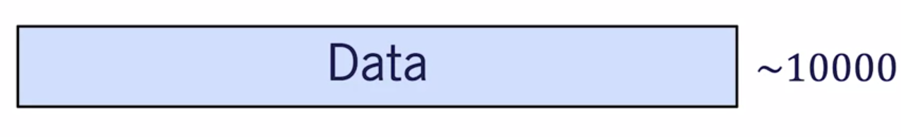

- That approach is guaranteed to fail for the following reason. 
  - Given a large enough neural network, we are almost guaranteed to get a very low training loss. 
  - This is due to the very large number of parameters in a typical deep neural network allowing it to memorize the training data to a large extent given a large enough number of training iterations. 

- A better approach is to split this data into three parts, the training split, the validation split, and the testing split.

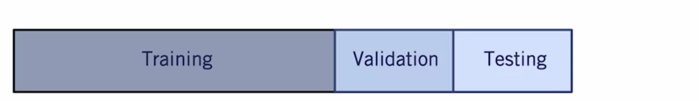

```As the name suggests, the training split is directly observed by the model during neural network training```. 

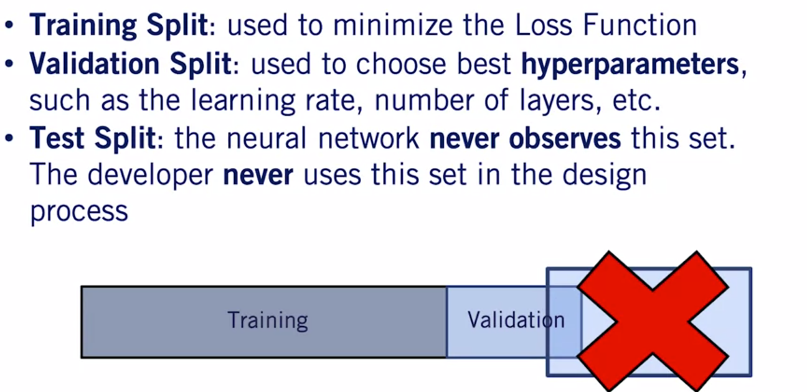

- **The loss function** is directly minimized on this training set. But as we've stated earlier, we are expecting the value of this function to be very low over the set. 
- **The validation split** is used by developers to test the performance of the neural network when `hyperparameters` are changed. 
- **Hyperparameters** are those parameters that either modify our network structure or affect our training process, but are not a part of the network parameters learned during training. 
- Examples include :  `the learning rate`, `the number of layers`, `the number of units per layer`, and `the activation function type`. 
- The final split is called the testing split and is used to get an unbiased estimate of performance. 
- The test splits should be off limits when developing a neural network architecture so that the neural network never sees this data during the training or hyperparameter optimization process. 
- The only use of the test set should be to evaluate the performance of the final architecture and hyperparameter set before it is deployed on a self-driving vehicle. 

Let us now determine what percentage of data goes into each split. 
- Before the big data era, it was common to have datasets on the order of thousands of examples. 

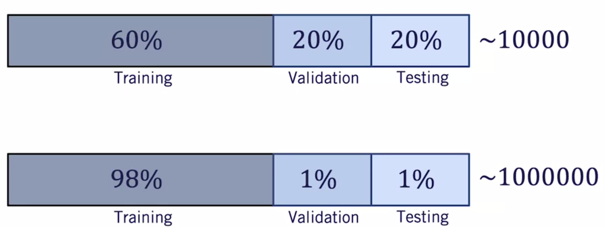

- In that case, the default percentage of data that goes into each split was approximately 60 % for training, 20% for validation, and 20% held in reserve for testing. 
- However, nowadays, it is not uncommon to have datasets on the order of millions of examples having 20 % of the data in the validation and test sets is unnecessary as the validation and test would contain far more samples than are needed for the purpose. 
- In such cases, we would find that a training set of 98% of the data with a validation and test set of 1% of the data each is not uncommon. 

Let us go back to our traffic sign detection problem. 

We assume that our traffic sign dataset is comprised of **10,000 labeled** examples. 

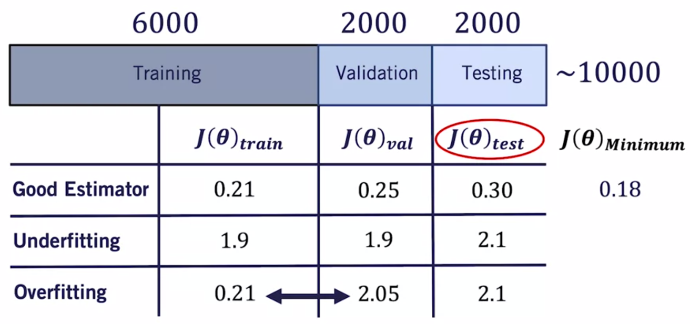
 
- We can separate our dataset into a training validation and testing split according to the 602020 **small dataset heuristic**. 
- We now evaluate the performance of our neural network on each of these splits using the loss function. 
- For a classification problem, the loss function is defined as the cross entropy between the prediction and the ground truth labels. 
- **Cross entropy** is strictly greater than zero, so the higher its value, the worse the performance of our classifier. 
- Keep in mind that the neural network only directly observes the training set. 
- All the developers use the validation set to determine the best hyperparameters to use. 
- The ultimate goal of the training is still minimizing the error on the test set since it is an unbiased estimate of performance of our system and the data has never been observed by the network. 


Let us first consider the following scenario. 

- Let us assume that our estimator gave a cross entropy loss of 0.21 on the training set, and a loss of 0.25 on the validation set, and finally, a loss of 0.3 on the test set. 
- Furthermore, due to errors in the labels of the dataset, the minimum cross entropy loss that we can expect is 0.18. 
- In this case, we have quite a good classifier as the loss on the three sets are fairly consistent and the loss is close to the minimum achievable loss on the entire task. 

Let's consider a second scenario where the training loss is now 1.9 around ten times that of the minimum loss. 

- As we discussed in the previous lesson, we expect any reasonably sized neural network to be able to almost perfectly fit the data given enough training time. 
- But in this case, the network was not able to do so. We call this scenario where the neural network fails to bring the training loss down underfitting. 
- One other scenario we might face is when we have a low training set loss but a high validation and testing set loss. 

- For example, we might arrive at the case where the validation loss is around ten times that of the training loss. 
- This case is referred to as overfitting and is caused by the neural network optimizing its parameters to precisely reproduce the training data output. 
- When we deploy on the validation set, the network cannot generalize well to the new data. 
- The gap between training and validation loss is called `the generalization gap`. We want this gap to be as low as possible while still having low enough training loss.

**Reducing the Effect of Underffiting and Overfitting**

Let's see how we can try to go from the underfitting or overfitting regime to a good estimator. We begin with how to remedy underfitting. 

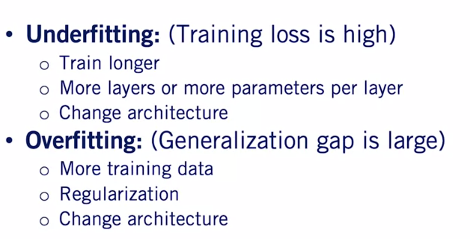

- The first option to remedy underfitting is to train longer. If the architecture is suitable for the task at hand, training longer usually leads to a lower training loss.
- If the architecture is too small, training longer might not help. 
- In that case, you would want to add more layers to your neural network or add more parameters per layer. 
- If both of the above options don't help, your architecture might not be suitable for the task at hand and you would want to try a different architecture to reduce underfitting. 
- Now, let's proceed to the most common approaches to reduce overfitting. In the case of overfitting, the easiest thing to do is to just collect more data. 
- Unfortunately, for self-driving cars, collecting training data is very expensive as it requires engineering time for data collection and a tremendous amount of annotator time to properly define the true outputs. 
- Another solution for overfitting is regularization. Regularization is any modification made to the learning algorithm with an intention to lower `the generalization gap` but not the training loss. 
- If all else fails, the final solution is to revisit the architecture and check if it is suitable for the task at hand. 

**Summary**

- In this lesson, we have learned how to interpret the different performance scenarios of our neural network on the training, validation, and test splits. 
- If it is determined that our network is underfitting, the easiest solution is to train for a longer time or to use a larger neural network. 
- However, a much more commonly faced scenario in self-driving car perception is overfitting where good performance on the training data does not always translate to good performance on actual robots. 

### Supplementary Reading: Data Splits and Neural Network Performance Evaluation

- To learn more about this topic, we highly recommend taking the Structuring Machine Learning Projects course by Andrew Ng, co-founder of Coursera. 

### Lesson 5: Neural Network Regularization

In this lesson, we'll explore some ways to reduce overfitting by applying regularization strategies during training. 

As a result of regularization, our networks will generalize well to new data, and we'll be able to use them more effectively outside of the lab. 

**Toy Example**

Let's walk through an iteration of neural network development on a toy example. 

- We want to separate a 2D Cartesian space into two components, orange and blue. 

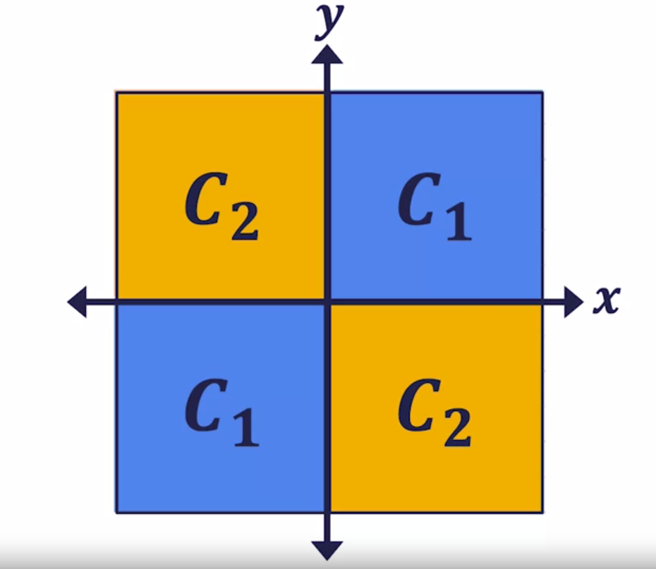

- Any point belonging to the blue space should be labelled class 1, while any point belonging to the orange space should be labelled class 2. 

However, we do not have direct access to these classes or their boundaries. 

- Instead we only have access to sensor measurements that provide us with examples of points and their corresponding class. 
- Unfortunately, our sensor is also noisy, that means it sometimes provides the incorrect label. 
  
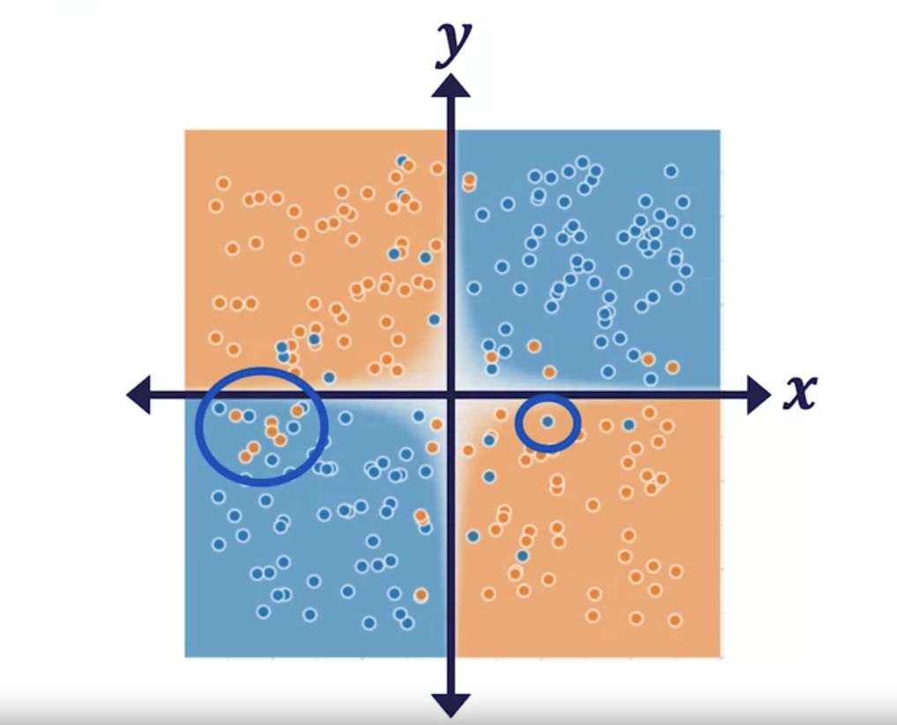

- The label points in the `blue` space as `class 2`, and in `orange` space as `class 1`. Our problem amounts to finding the space classification from the noisy sensor data. 

- We begin by collecting data from the sensor and splitting them into 60-40 training validation splits. 

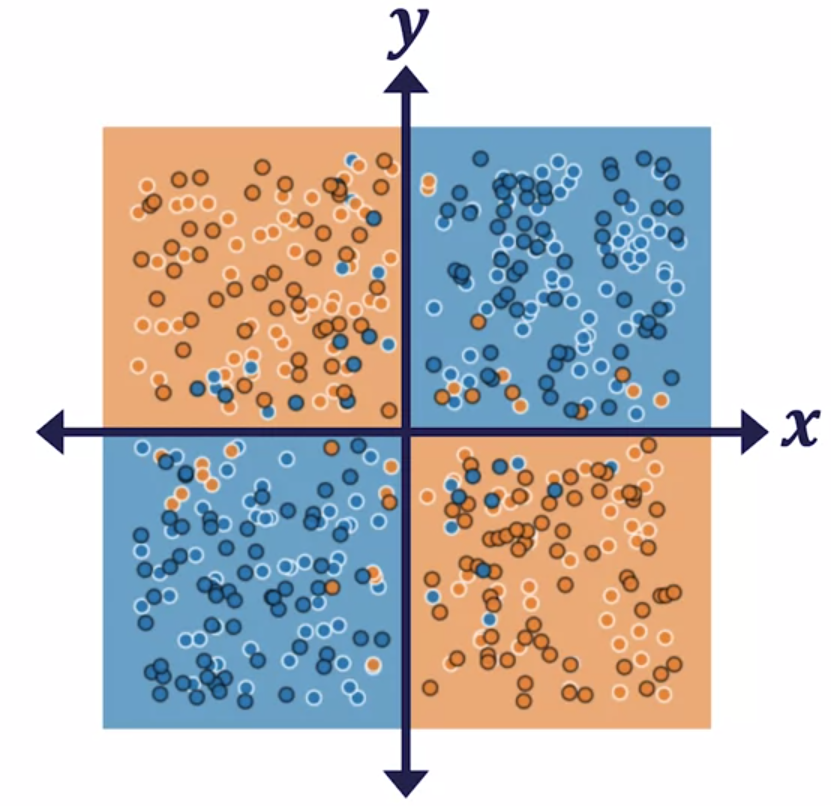

- The training splits is shown here as points with white out lines, and the validation splits is shown here as points with black out lines. 


- Let's use a simple neuron network with one layer and two hidden units per layer to classify measurements. Using this design choice, we get that following space classification. 
  
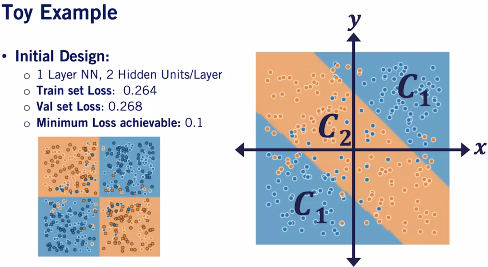

- The training set loss is 0.264 close to the validation set loss of 0.2268. 
- But it's still much higher than the minimum achievable loss of 0.1. This is a clear case of underfitting. 
- When we compare the results of our network classification to the true space classification, we see that the neural network fail to capture the complexity of the problem at hand, and did not correctly segment the space into four compartments as required. 
- To resolve underfitting issues, we increase the network size by adding five additional layers, and increase the number of hidden units to six units per layer. 
- Our model is now much more expressive, so it should be able to better represent the true classification. 
- We go ahead and train our model again, then test to see how well we have done. 
- We noticed that our validation set loss result of 0.45 is much higher than our training set loss result of 0.1. 
- The training set loss, however, is equal to the minimum achievable loss of 0.1 on this task. We are in a state of overfitting to the training data. 

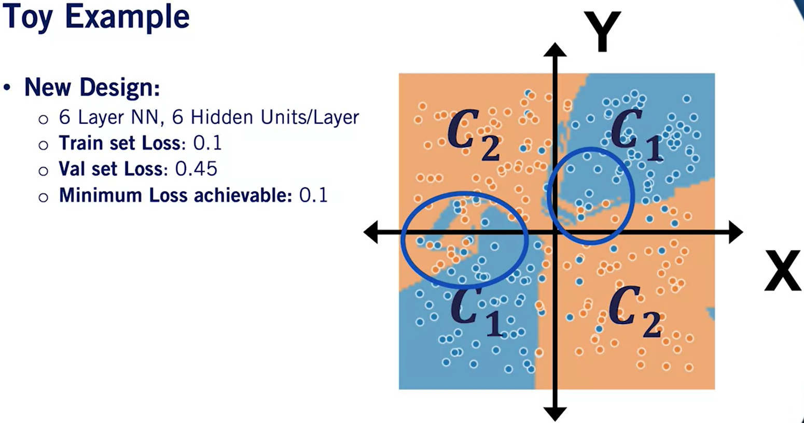

- Overfitting is caused by the network learning the noise in the training data. 
- Because the neural network has so many parameters, it is able to curve out small regions in the space that correspond to the noisy training examples as shown inside the red circles. 
- This usually happens when we increase the network size too much for the problem at hand. 
- Again, we have learned that one way to remedy over fitting is through `regularization` (or/instead of adding more training data which are sometimes difficult to collect). 


**Parameter Norm Penalties**

Let's check out the first regularization method commonly used for neural networks.

The most traditional form of regularization applicable to neural networks is the concept of parameter norm penalties. 

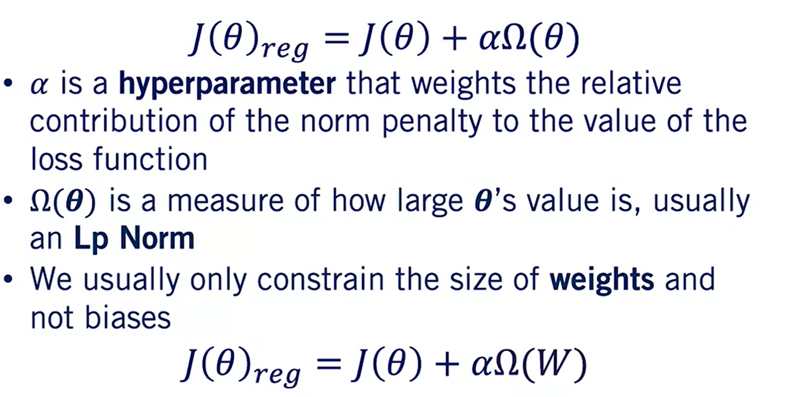

- This approach limits the capacity of the model by adding the penalty omega of theta to the objective function. 
- We add the norm penalty to our existing loss function using our weighting parameter `alpha`. 
- Alpha is a new hyperparameter that weights the relative contribution of the norm penalty to the total value of loss function. 
- Usually, omega of theta is a measure of how large the value of theta is. Most commonly this measure is an Lp Norm. 
- When P is 1 we have an absolute sum, and when P is 2 we get the quadratic sum, etc. Furthermore, we usually only constrain the weights of the neural network. 
- This is motivated by the fact that the number of weights is much larger than the number of biases in the neural network. 
- So weight penalty have a much larger impact on the final network performance. 

**L2-Parameter Norm Penalties**

The most common norm penalty used in neural networks is the L2-norm penalty. 

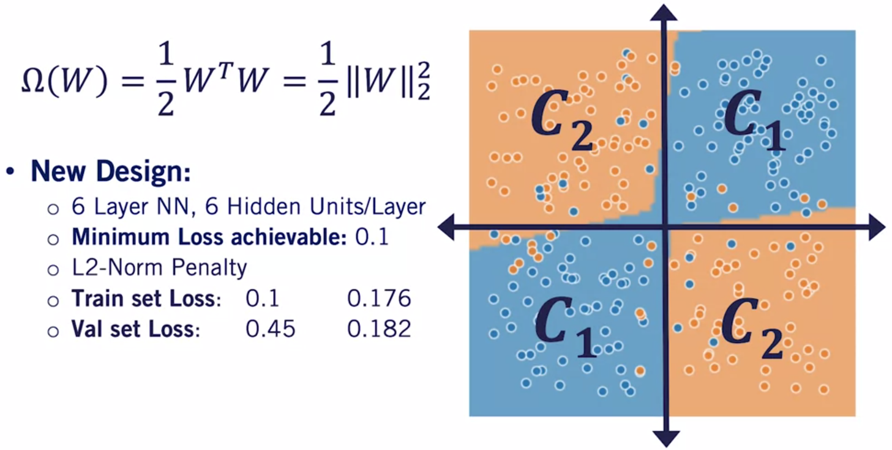

- The L2-norm penalty tries to minimize the L2-norm of all the weights in each layer of the neural network. 
- Let's take a look at the effect of the L2-norm penalty applied to our problem. Remember that our latest design resulted in overfitting on the training data set. 
- Adding the L2-norm penalty the loss function results in a much better estimate of the space classification, due to a lower validation set loss over the unregularized network. 
- However, this lower validation set loss is coupled with an increase in the training set loss from 0.1 to 0.176. 
- In this case the decrease in the generalization gap is higher than the increase in training set loss. 
- Do be careful not to regularize too much, however, to avoid falling into the underfitting regime once again. Adding a norm penalty is quite easy in most neural network packages. 
- If you suspect over fitting, L2-norm penalties might be a very easy remedy that will prevent a lot of waste of time during the design process.

**Dropout**

- As we mentioned earlier in this video, researchers have developed regularization mechanisms that are specific to neural networks. One powerful mechanism used regularly is called `dropout`. 

Lets see how dropout gets applied during network training. 

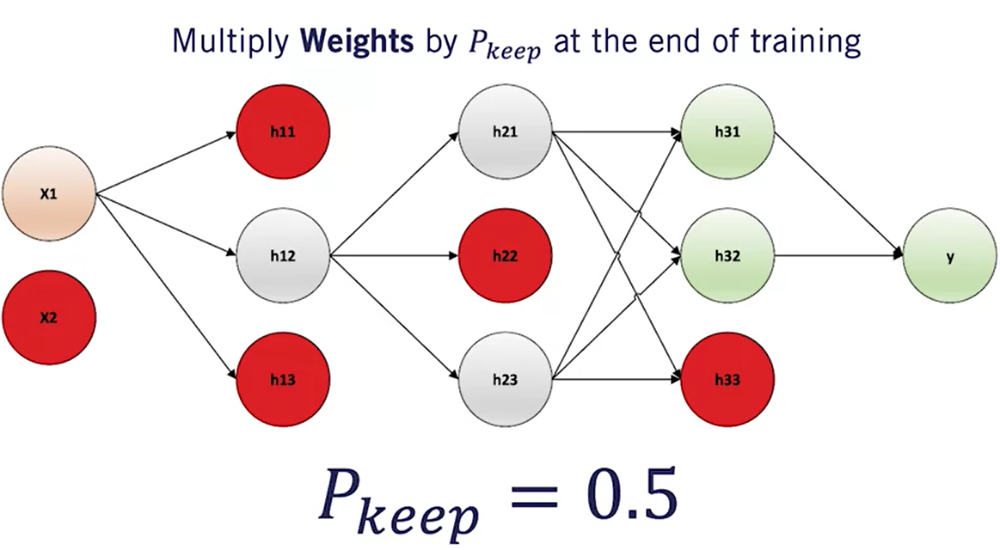

- The first step of dropout is to choose a probability which we'll call P sub keep. 
- At every training iteration, this probability is used to choose a subset of the network nodes to keep in the network. These nodes can be either hidden units, output units, or input units. 
- We then proceed to evaluate the output y after cutting all the connections coming out of this unit. 
- Since we are removing units proportional to the keep probably, P sub keep, we multiply the final weights by P sub keep at the ending of training. 
- This is essential to avoid incorrectly scaling the outputs when we switch to inference for the full network. 
- Dropout can be intuitively explained as forcing the model to learn with missing input and hidden units. Or in other words, with different versions of itself. 
- It provides a computationally inexpensive but powerful method of regularizing a broad family of neural network models during the training process, leading to significant reductions in over feeding and practice. 
- Furthermore, dropout does not significantly limit the type or model of training procedure that can be used. 
- It works well with nearly any model that uses a distributed over parameterized representation, and that can be trained with **stochastic gradient descent**. 


- Finally, all neural network libraries have a dropout layer implemented and ready to be used. 
- We recommend using drop out whenever you have dense feed forward neural network layers.

**Early Stopping**

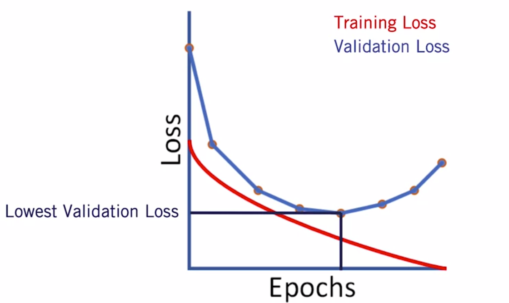

- The final form of regularization you should know about is early stopping. To explain early stopping visually, we look at the evolution of the loss function of a neuro network evaluated on the training set. 
- Given enough capacity, the training loss should be able to decrease to a value close to zero, as the neuro network memorizes the training data. 
- However, if we have independent training and validation sets, the validation loss reaches a point where it starts to increase. 
- This behaviour is typical during the overfitting regime, and can be resolved via a method known as `early stopping`. 
- We discussed earlier that we can stop the optimization according to various stopping criteria.
- Early stopping ends training when the validation loss keeps increasing for a preset number of iterations or epochs. 
- This is usually interpreted at the point just before the neural network enters the overfitting regime.
- After stopping the training algorithm, the set of parameters with the lowest validation loss is returned. 

```
- As a final note, early stopping should not be use as a first choice for regularization. 
- As it also limits the training time, which may interfere with the overall network performance. Congratulations, you are now ready to start building your own neural networks. 
```

**Summary**

- In this lesson, you learned how to improve the performance of the neural network in the key as it falls into an overfitting regime. 
- There are many more interesting aspects to neural network design and training, and I urge you to keep exploring this fascinating field through the additional resources that we've included with this module. 

### Supplementary Reading: Neural Network Regularization

- Goodfellow, I., Bengio, Y., Courville, A., & Bengio, Y. (2016). Deep learning (Vol. 1). Cambridge: MIT press. Read sections  7.1, 7.8, 7.12. https://www.deeplearningbook.org/.  


### Lesson 6: Convolutional Neural Networks
### Supplementary Reading: Convolutional Neural Networks
### Grade : Feed-Forward Neural Networks

# References
- [Machine Learning Resources - Personal Research Notes](https://github.com/afondiel/research-notes/tree/master/ai/ml-notes)
- [Deep Learning Resources - Personal Research Notes](https://github.com/afondiel/research-notes/tree/master/ai/ml-notes/deep-learning-notes)
- [Neural Network (NN) Architecture - Notes](https://github.com/afondiel/research-notes/blob/master/ai/ml-notes/deep-learning-notes/neural-nets-architecture-notes.md)

# Appendices


