# Course-3 - W4 - MODULE 4: 2D Object Detection

## Overview 
- The two most prevalent applications of deep neural networks to self-driving are object detection, including pedestrian, cyclists and vehicles, and semantic segmentation, which associates image pixels with useful labels such as sign, light, curb, road, vehicle etc. 
- This module presents baseline techniques for object detection and the following module introduce semantic segmentation, both of which can be used to create a complete self-driving car perception pipeline.
  
**Course Objectives**
- Define the object detection problem for autonomous driving as an extension of object classification
- Identify quality datasets and their characteristics for training deep network detectors
- Perform basic 2D object detection for a self-driving dataset
- Track a set of moving objects detected by a 2D detector

## 2D Object Detection
### Lesson 1: The Object Detection Problem

**Brief History of Object Detection**


- The history of 2D object detection begins in **2001** when **Paul Viola** and **Michael Jones** invented a very efficient algorithm for face detection. 
- This algorithm now called `the Viola, Jones Object Detection Framework`, was the first object detection framework to provide reliable, **real-time 2D object detections** from a simple `webcam`. 
- The next big breakthrough in object detection happened four years later when Navneet Dalal and Bill Triggs formulated the histogram of oriented gradient feature descriptor. 
- Their algorithm applied to the 2D pedestrian detection problem, outperformed all other proposed methods at the time. 
- The Dalal, Triggs algorithm remained on the top of the charts until 2012 when **Alex Krizhevsky**, **Ilya Sutskever** and **Geoffrey Hinton** from the Computer Science Department here at **the University of Toronto**, shook the computer vision world with their `convolutional neural network dubbed AlexNet`. 
- AlexNet won the ImageNet Large Scale Visual Recognition Challenge in 2012 with a wide margin over the algorithm that took second place. 
- In 2012, it was the only deep learning-based entry in the challenge. But since then, all winning entries in this competition are based on convolutional neural networks with the entry surpassing the human recognition rate of 95 percent recently. 
- This performance extended from 2D object recognition to 2D object detection with current day detectors being almost exclusively based on convolutional neural networks. 
- Before we go through how to use ConvNets for object detection and self-driving cars, let's formulate the general 2D object detection problem. 

**The Object Detection Problem**

Given a 2D image's input, we are required to estimate the location defined by a bounding box and the class of all objects in the scene. Usually, we choose classes that are relevant to our application. 

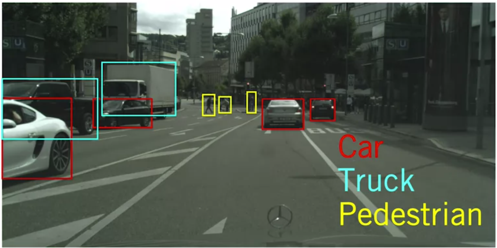

- For self-driving cars, we usually are most interested in object classes that are dynamic, that is ones that move through the scene. 
- These include **vehicles** in their **subclasses**, **pedestrians**, and **cyclists**.

**Object Detection Is Not Trivial**


- The problem of 2D object detection is not trivial. The extent of objects we require to estimate are not always fully observed in the image space. 
- As an example, background objects are usually occluded by foreground objects. This requires any algorithm we use to be able to hallucinate the extent of objects to properly detect them.
- Furthermore, objects that are near the edge of the image are usually truncated. 
- This phenomenon creates huge variability in the bounding box sizes, where the size of the estimated bounding box depends on how truncated the object is. 
- Another issue faced by 2D object detection algorithms is that of scale. Objects tend to appear very small as they go further away from our censor. 


- Our algorithm is expected to determine the class of these objects at variable scales. 
- Finally, our algorithm should also be able to handle illumination changes. 

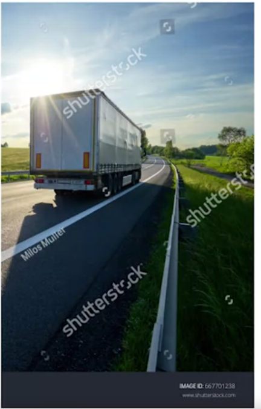

- This is especially important in the context of self-driving cars, where images can be affected by whole image illumination variations from bright sun to night driving, and partial variations due to reflections, shadows, precipitation, and other nuisance effects. 


**Mathematical Problem Formulation**

Now that we've intuitively understood what object detection is, let us formalize the problem mathematically. 

Object detection can be defined as a `function estimation problem`.


- Given an input image $x$ , we want to find the function $f(x; \theta)$ that produces an output vector that includes the coordinates of the top-left of the box, x_min and y_min, and the coordinates of the lower right corner of the box, x_max and y_max, and a class score $S_{class1}$ to $S_{classk}$ . 

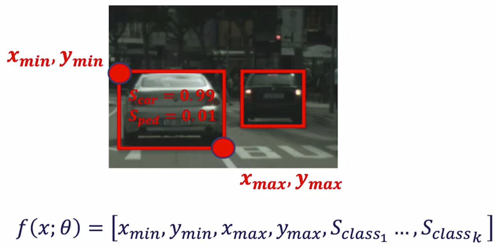

- Sclassi specifies how confident our algorithm is that the object belongs to the class $i$ , and $i$ ranges from one to $k$ , where $k$ is the number of classes of interest.

*Can you think of any way to estimate this function?* 
- Convolutional neural networks, which we described last week are an excellent tool for estimating this kind of function. 


- For object detection, the input data is defined on a 2D grid, and as such, we use ConvNets as our chosen function estimators to perform this task. 
- We will discuss how to perform 2D object detection with ConvNets in the next lesson. But first, we need to figure out how to measure the performance of our algorithm. 

**Evaluation Metrics**

Given the output of a 2D object detector in red, we want to be able to compare how well it fits the true output, usually `labeled by humans`. 

We call the true output our `ground truth bounding box`. 


- The first step of our evaluation process is to compare our detector localization output to the ground truth boxes via the **Intersection-Over-Union metric** (IOU). 


- IOU is defined as the area of the intersection of two polygons divided by the area of their union. However, calculating the intersection-over-union does not take into consideration the class scores. 
  
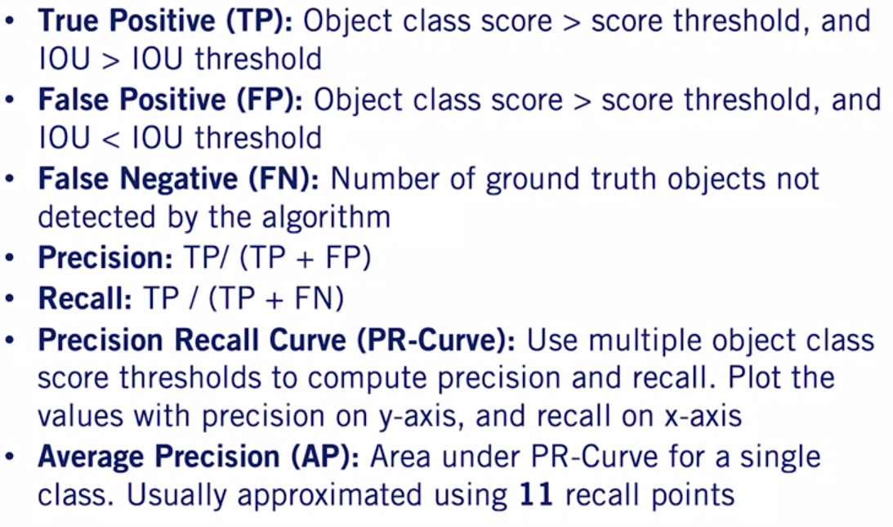

- To account for class scores, we define true positives. **True positives** are output bounding boxes that have an IOU greater than a predefined threshold with any ground truth bounding box.   

- In addition, the class of those output boxes should also match the class of their corresponding ground truth. That means that the 2D detector should give the highest class score to the correct class, have a score that is greater than a score threshold.
- On the other hand, **false positives** are the output boxes that have a score greater than the score threshold, but an IOU less than the IOU threshold with all ground truth bounding boxes. 
- This can be easily computed as the total number of detected objects after the application of the score threshold minus the number of true positives. 
- The final base quantity we would like to estimate is the number of false negatives. False negatives are the ground truth bounding boxes that have no detections associated with them through IOU. 
- Once we have determined the true positives, false positives, and false negatives; we can determine the **precision** and **recall** of our 2D object detector according to the following. 
- The precision is the number of true positives divided by the sum of the true positives and the false positives. 
- The **recall** on the other hand is the number of true positives divided by the total number of ground truth objects, which is equal to the number of true positives added to the number of false negatives. 
- Once we determine the precision and recall, we can vary the object class score threshold to get a precision recall curve, and finally, we determine **the average precision** as the area under the precision-recall curve. 
- The area under the curve can be computed using numerical integration, but is usually approximated using an average of the precision values at 11 recall points ranging from zero to one. 
I know these are quite a few concepts to understand the first time through. But don't worry, as you'll soon get a chance to work through a step-by-step practice notebook on how to code all of these methods in Python in the assessments. 

**Example**

Let's work through an example on how to assess the performance of a 2D object detection network using the learned metrics. 

- We are interested in detecting only cars in a road scene.That means that we have a single class of interest, and therefore only one set of scores to consider. 

- We are given ground truth bounding boxes of cars labeled by human beings and shown in green. 

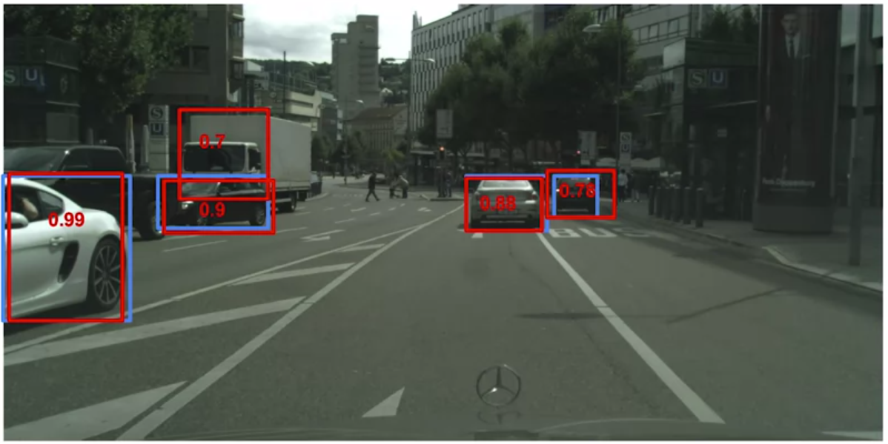
 
- We process our image with a ConvNet to get the detection output bounding boxes, shown in red. You can notice that the network mistakenly detects the front of a large truck as a car. 
- Looking at the scores, we see that our ConvNet gave this miss detection quite a high score of being a car. 

Let's now evaluate the performance of our ConvNet using average precision. 

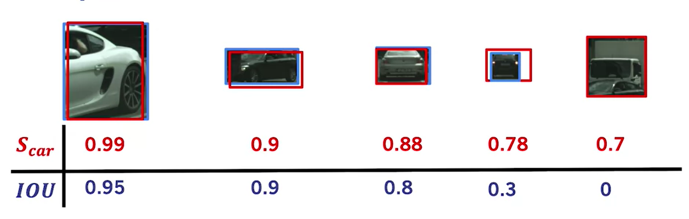
 
- The first step is to take all of our estimated bounding boxes and sort them according to object class score. 
- We then proceed to compute the IOU between each predicted box and the corresponding ground truth box. 
- If a box does not intersect any ground-truth boxes, it's IOU is set to zero. 


- First, we said a class score threshold, let's say 0.9. This threshold means that we only trust our network prediction, if it returns a score that is greater than 9, and we eliminate any bounding boxes with a score less than 0.9. 
- Next, we set an IOU threshold, we'll use 0.7 in this case and proceed to eliminate any remaining predictions with an IOU less than 0.7. 
- In this case, both the remaining predictions have an IOU of greater than 0.7, and so we don't eliminate any. 
- We can now compute the number of true positives as the number of remaining bounding boxes after the application of both the score and the IOU thresholds, which in this case is two. 
- The number of false positives is zero in this case, since all boxes remaining after the application of the score thresholds also remain after the application of the IOU threshold.
- Finally, the number of false negatives are boxes in the ground truth that have no detections associated with them after the application of both the score and the IOU thresholds. 
- In this case, the number of false negatives is 2. The precision of our neural network is computed as the number of true positives divided by their sum with the number of false positives. 
- In this case, we don't have false positives. So the precision is 2 over 2 equal to 1. 

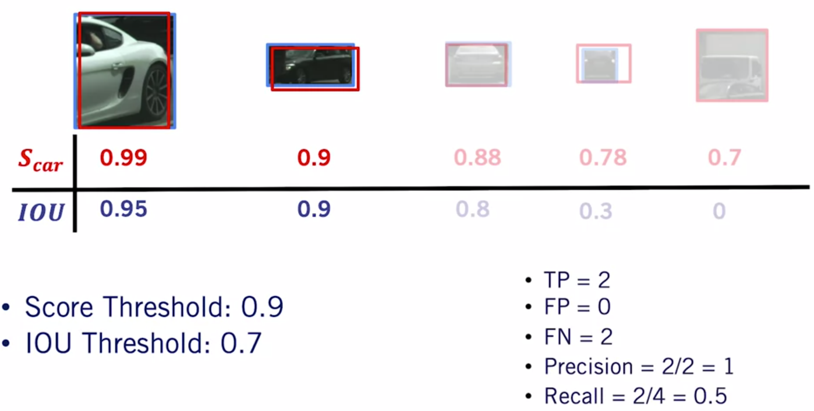
 
- To compute the recall, we divide the number of true positives by the number of ground truth bounding boxes, which is equal to the number of false positives summed with the number of false negatives. The recall in this case is 2 over 4. 
- The detector in this case is a **high precision - low recall detector**. This means that the detector misses some objects in the scene, but when it does detect an object, it makes very few mistakes in category classification and bounding box location. 
 
Let's see how the performance of our detector changes when we decrease the score threshold from 0.9 to 0.7. 

- All bounding boxes have a score greater than 0.7, so we do not eliminate any of them through score thresholding. 

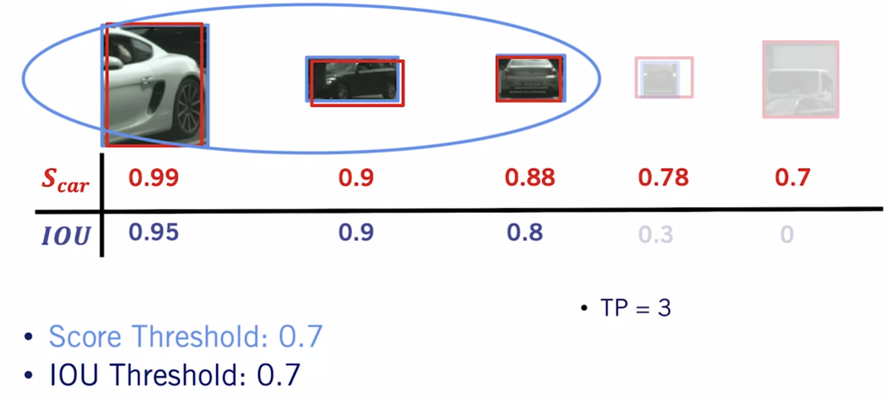

- However, when we examine the IOU of the remaining boxes, we can see that two of them have an IOU less than 0.7. By eliminating these two boxes, we get three true positives.


- To compute the number of false positives, we need to look at how many detections remained after the application of the score threshold, but before the application of the IOU threshold. In this case, the number of false positives is two. 
- Finally, we take a look at the number of ground truth bounding boxes that have remained without an associated detection after the application of both the IOU and score thresholds to get one as the number of false negatives.
- Notice that the precision has dropped after decreasing the score threshold from one to 0.6, while the recall has increased from 0.5 to 0.75. 
- We can conclude that the effect of lowering the score threshold is less accurate detection results at the expense of detecting more objects in the scene. 

- If we continue this process and estimate the score threshold at decrements of 0.01, we arrive at the following table. 

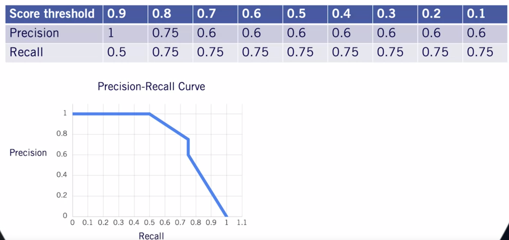

- We then proceed to plot the precision-recall curve, using the precision values on the y-axis and the recall values on the x-axis. 
- Note that we also add the precision recall points of one and zero as the first in the plot, and zero one as the final point in the plot. 
- This allows us to approximate the average precision by calculating the area under the P-R curve using 11 recall points between zero and one, at 0.01 recall increments. 

 

- Computing this average produces an $AP$ of $0.75$ for a car detector. 
- The value of the average precision of the detector can be thought of as an average of performance over all score thresholds allowing objective comparison of the performance of detectors without having to consider the exact score threshold that generated those detections. 

**Summary**

In this video, you learned how to **formulate the 2D object detection problem** and how **to evaluate a 2D object detectors performance** using **the average precision performance metric**.
 
Next lesson, you will learn how to use ConvNet as 2D object detectors for self-driving cars. See you then.

### Supplementary Reading: The Object Detection Problem

- Implementation Resources: https://github.com/tensorflow/models/tree/master/research/object_detection (Fully implemented models ready to be used, from Google team)

### Lesson 2: 2D Object detection with Convolutional Neural Networks

**Review - The Object Detection Problem**

Let's begin by reviewing the 2D object detection problem. 


Given an image as an input, we want to simultaneously localize all objects in the scene and determine which class they belong to. 

**ConvNets For 2D Object Detection**

Let's see how we can perform this task using a ConvNet. 

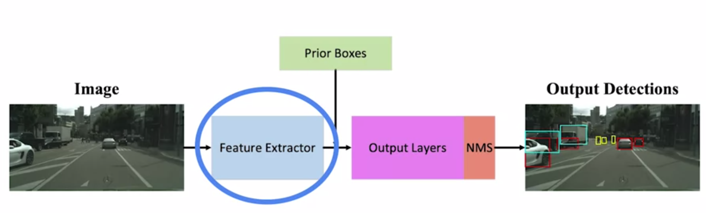

This figure shows the basic ConvNet configuration used for 2D object detection. We call this configuration a neural network architecture. 

The architecture takes as an input an image and a set of manually crafted prior boxes.

- First, the image is processed using a feature extractor. 
- Second, a set of fully connected layers take as an input, the output of the feature extractor and provide a location refinement of each 2D prior box as well as a classification. 
- Finally, non maximum suppression is performed on the output of the fully connected layers to generate the final detections. 

**The Feature Extractor**

- Let's delve deeper into each of these steps. We will begin our discussion with the feature extraction stage. 
 
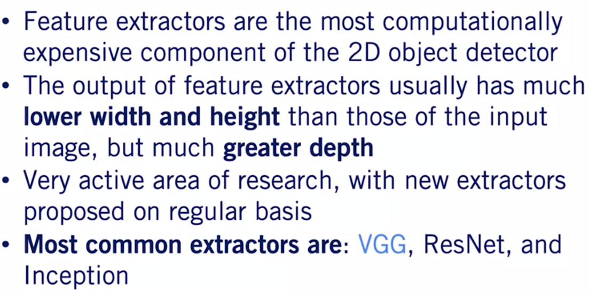

- Feature extractors are the most computationally expensive component of the 2D object detector. 
- It is typical to have as much as 90 percent of the total architectures required computation used at this stage. 
- The output of feature extractors usually has much lower width and height than those of the input image. 
- However, its depth is usually two to three orders of magnitude greater than that of the input image.
- The design of feature extractors is a very active area of research with new extractors emerging on a regular basis. 

```The most common feature extractors used are : VGG, ResNet, and Inception```.
 
**VGG Feature Extractor**

We will be focusing on the VGG feature extractor as our running example throughout the rest of this lesson. 

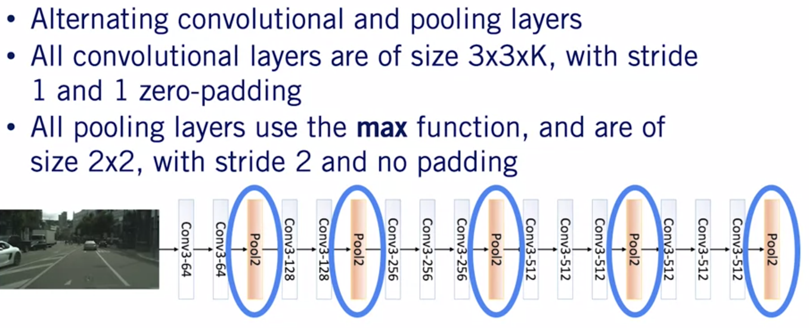

- **The VGG feature extractor** is based on the convolutional layers of the VGG 16 classification network proposed by the Visual Geometry Group at Oxford University. 
- It is one of the first feature extractors to be proposed for detection and is quite simple to build. 
- As with most ConvNets, the VGG feature extractor is built by alternating convolutional layers and pooling layers. 
- All convolutional layers are of size 3x3xK , with a stride of 1 and a zero-padding of 1, by which we mean that the padding of size one is filled with zeros. 
- All max-pooling layers are of size 2x2 with stride 2 and no padding. These particular hyper parameters were arrived at through intensive experimentation and have performed extremely well in a wide range of problems making VGG and extremely popular extractor. 


Let's see how these layers affect our output volume shape. 

- Last week, we derive the three equations for the output width, height, and depth based on the input volume after it has been passed through the convolutional layer. 

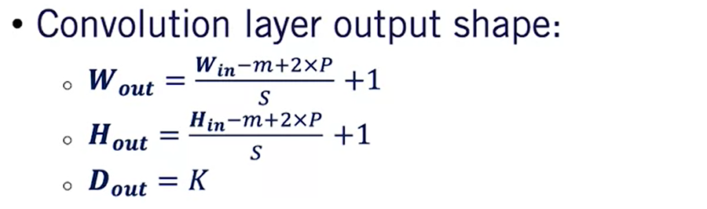 

- For the VGG feature extractor, all convolutions are of size 3x3xK, with a stride of one and zero padding of one.
 
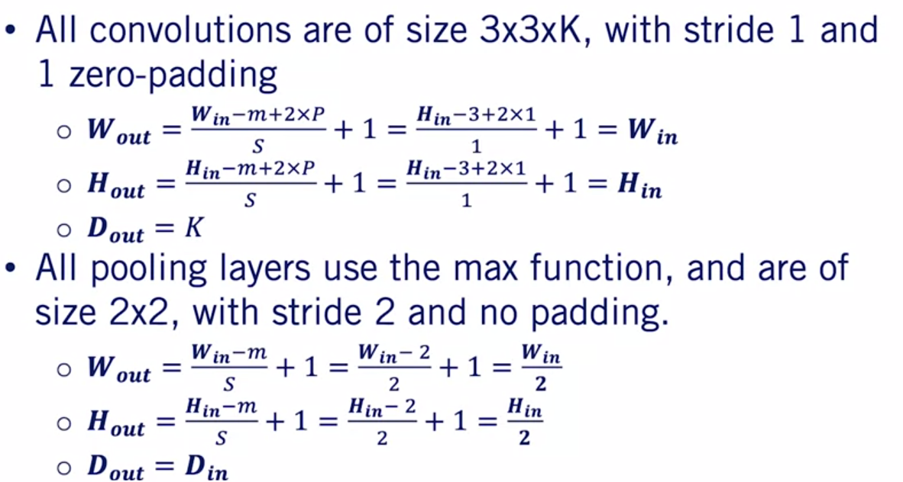 

- That means the passing an input volume through any of the convolutional layers only changes its depth to $K$ . 
- On the other hand, the pooling layers of the VGG extractor are 2x2 with stride 2 and no padding. 
- Repeating the same analysis using the equations for the pooling layer, we noticed that the max-pooling layers of VGG extractors reduce the width and height of the input volume by two, while maintaining the depth constant. 

Let's now see how the VGG extractor processes an input image.

- Given an MxNx3 input image, we pass it through the first two convolutional layers of depth 64 followed by the first pooling layer. 

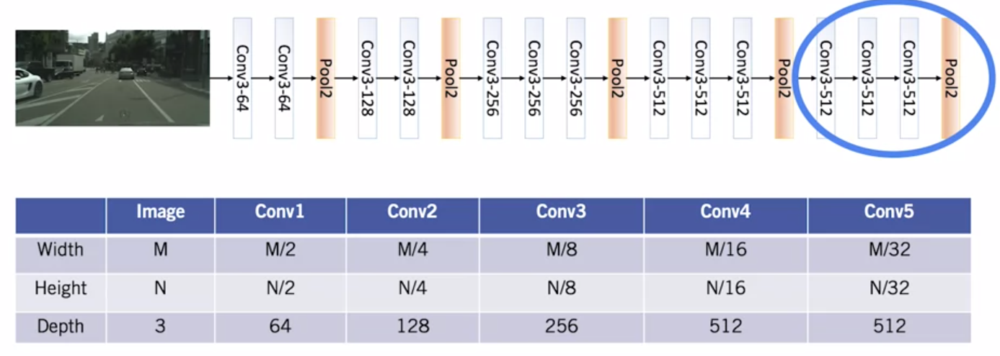 
 
- At this point, the output volume width and height are reduced by a factor of two, while the depth is expanded to 64. 
- We can separate the VGG feature extractor into subsections, where each subsection ends with a pooling layer. 
- The first subsection is called the Conv1 subsection of the VGG extractor. 
- We then proceed to pass the output volume through the rest of the five subsections to arrive at our final output volume of shape M over 32, N over 32, and 512. 

As an example, if we have a 1,240x960x3 image as our input, our final output volume shape will be 40x30x512. 

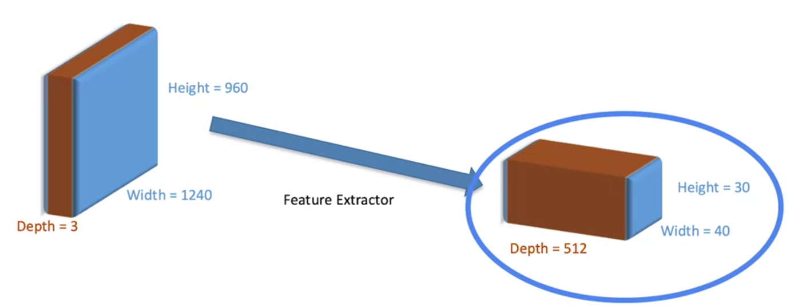 

- We will be using this output volume to generate our final detections. 

**Prior/Anchor Bounding Boxes** 

- The next step to describe in our neural network architecture is the concept of prior boxes. Also called `anchor boxes`. 

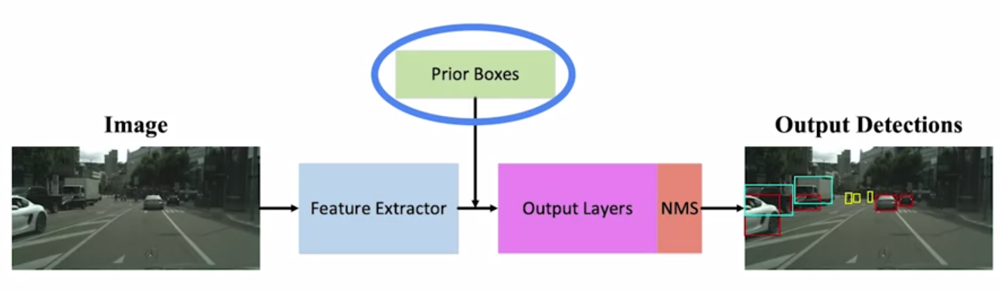 

- To generate 2D bounding boxes, we usually do not start from scratch and estimate the corners of the bounding box without any prior. 

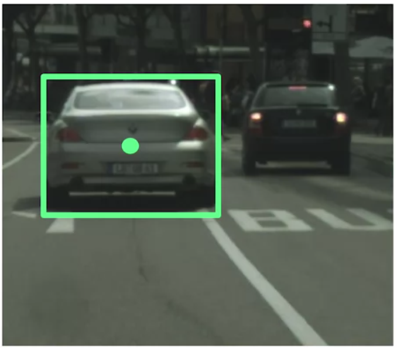

- We assume that we do have a prior on where the boxes are in image space and how large these boxes should be. 

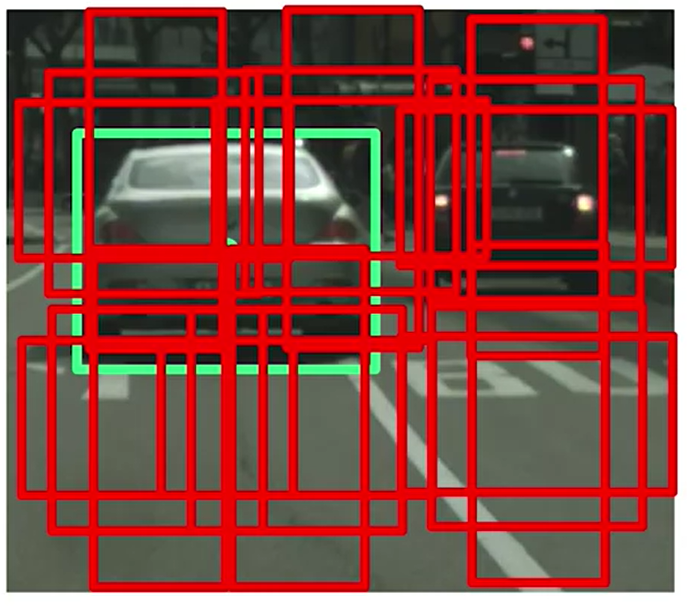 

- These priors are called anchor boxes and are manually defined over the whole image usually on an equally-spaced grid. 

Let's assume that we have a set of anchors close to our ground-truth boxes.

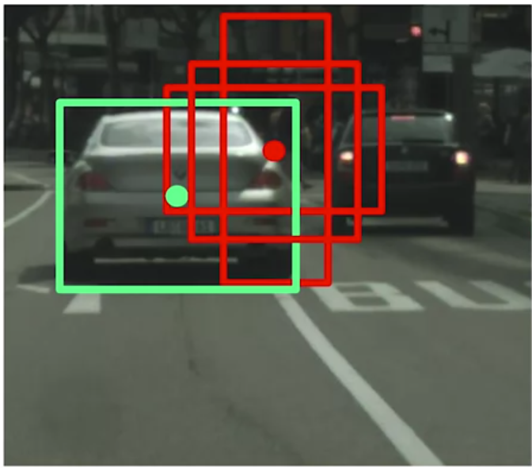 

- During training, the network learns to take each of these anchors and tries to move it as close as possible to the ground truth bounding box in both the centroid location and box dimensions. 

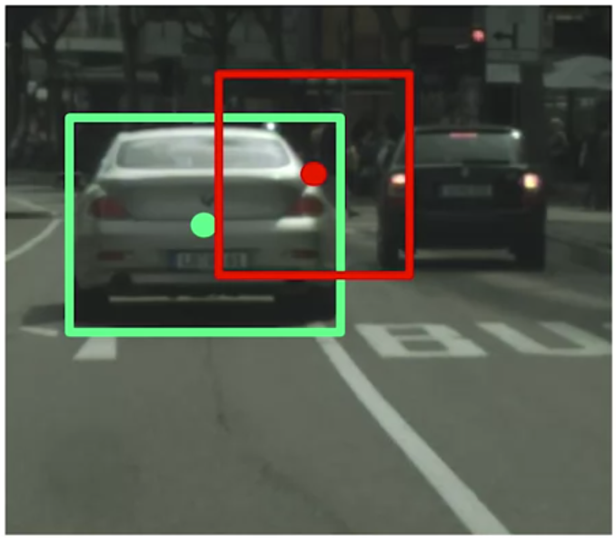 

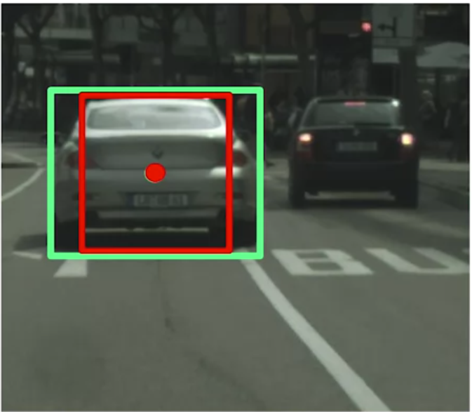 

- This is termed residual learning and it takes advantage of the notion that it is easier to nudge and existing box a small amount to improve it rather than to search the entire image for possible object locations.

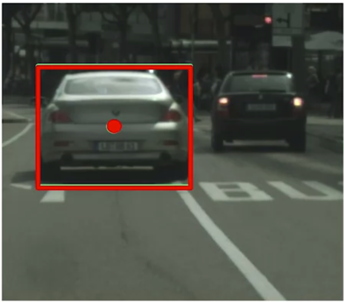 

- In practice, residual learning has proven to provide much better results than attempting to directly estimate bounding boxes without any prior.

Many different methods have been proposed in the literature on how to use the anchor bounding boxes to generate the final prediction. 

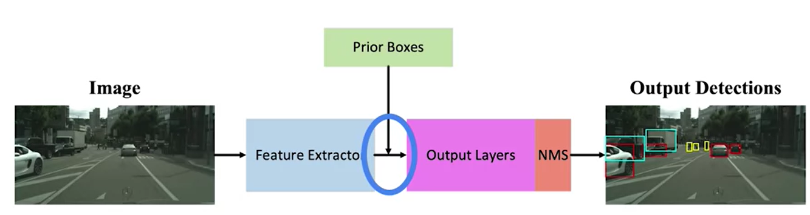 

- Usually, the anchors interact with the feature map to generate fixed sized feature vectors for every anchor. 
- We'll explain one of the first methods proposed for this interaction by **Microsoft Research in their architecture Faster R-CNN** . 
- However, keep in mind that this is not the only way to perform such an interaction. 
- The Faster R-CNN interaction method is quite simple. For every pixel in the feature map, we associate k anchor boxes. 

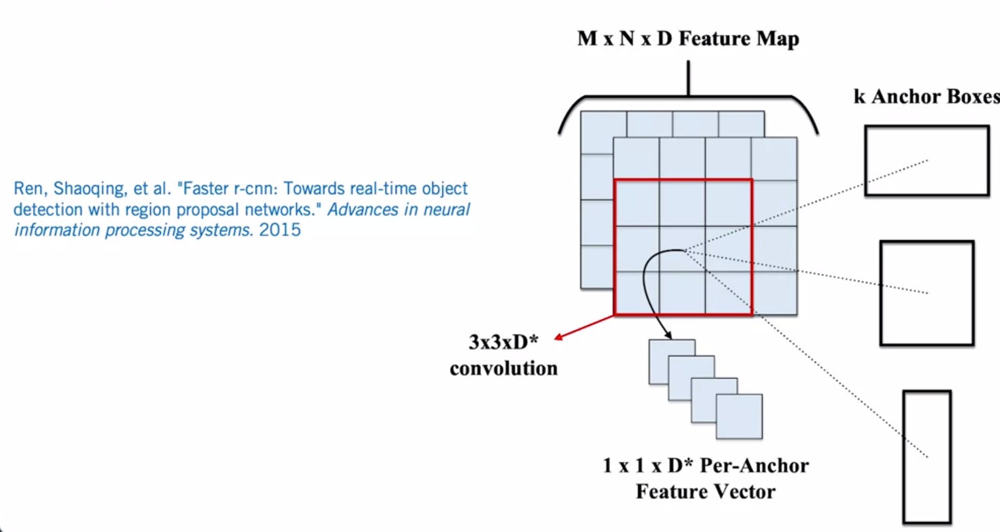 

- We then perform a three by three by D star convolution operation on that pixels neighborhood. 
- This results in a one by one by D star feature vector for that pixel. 
- We use this one by one by D star feature vector as the feature vector of every one of the k anchors associated with that pixel.

**Output Layers**

- We then proceed to feed the extracted feature vector to the output layers in the neural network. 

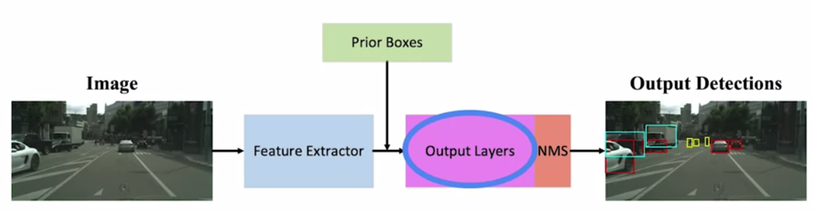 

**Classification VS Regression Heads**

- The output layers of a 2D object detector usually comprise of a regression head and a classification head. 
 
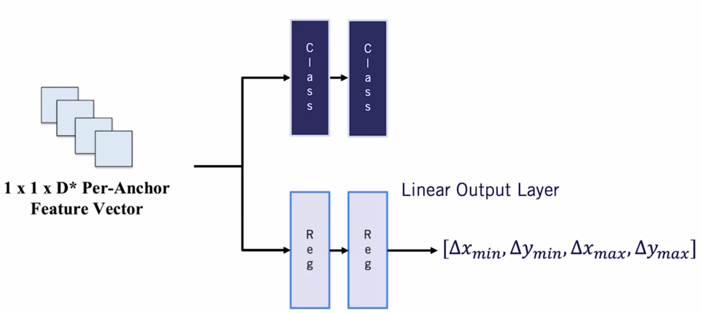 

- **The regression head** usually includes multiple fully-connected hidden layers with a linear output layer.
- The regressed output is typically a vector of residuals that need to be added to the anchor that hand to get the ground truth bounding box. 
- Another method to update the dimension of the anchors is to regress a residual from the center of the anchor to the center of the ground truth bounding box in addition to two scale factors that correct the ground truth bounding box width and height when multiplied with an anchor's width and height. 


- **The classification head** is also comprised of multiple fully-connected hidden layers, but with a final softmax output layer. 

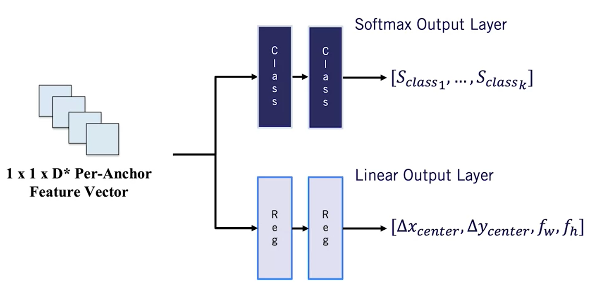 

- The **softmax** output is a vector with a single score per class. The highest score usually defines the class of the anchor at hand. 
- You might note that based on what we described so far, we will end up with k bounding boxes per pixel of the output feature map. 
- Even if we consider boxes with high classification score for all classes of interest, we still will have many redundant detections in the image.
- During average precision computation, we only consider one detection per ground truth bounding box. 
- Any redundant detections are considered false positives and results in lower precision and thus a lower average precision overall. 

**Output Handling**

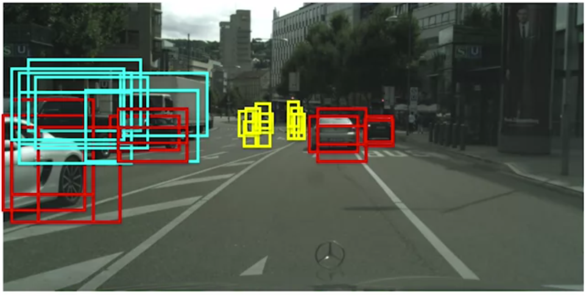 

- Recall, we're aiming for perfect detection, which means we want an output of one box per object in the image.

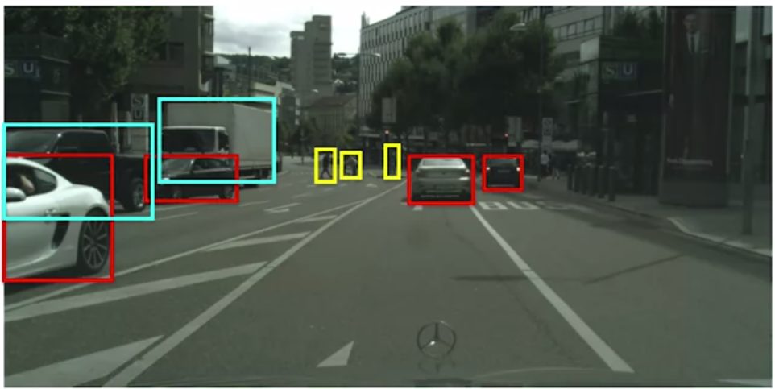 

- So, we will need to do something to eliminate the many redundant detections produced by our network. 
- In fact, this is only an issue of inference and it turns out to be beneficial to drive the network to output the best possible residuals for every anchor during training. 

  
**Summary**

- Before going deeper into this issue, let's summarize what you learned this lesson. 
- First, you learned that convolutional neural networks can be used to solve the 2D object detection problem and study the details of the VGG feature extractor architecture. 
- Second, you learned how to use anchor boxes as object location priors and estimate the bounding box residuals to output the final object locations. 

### Supplementary Reading: 2D Object detection with Convolutional Neural Networks

- Everingham, M., Van Gool, L., Williams, C. K., Winn, J., & Zisserman, A. (2010). The pascal visual object classes (voc) challenge. International journal of computer vision, 88(2), 303-338. (For understanding the problem + the metrics)

### Lesson 3: Training vs. Inference

**Review : 2D Object Detector Training**

Last lesson we learned a baseline approach to perform object detection using ConvNets. 

However, processing all the anchors in our anchor grid led to multiple bounding boxes being detected per object rather than the expected single locks per object.

This lesson, we will discuss the final components we need to **build and train convolutional neural networks for 2D object detection**.

Specifically, you will learn how to handle multiple regressed anchors per object during **training** through `mini batch selection` and during **inference** through `non-maximum suppression`. 

Let's begin by reviewing neural network training. We are given our ConvNet model and training data pairs, $x$ , the input image, and $f^{*}(x)$ , the bounding box locations and class.

We want to approximate f star of x with our output bounding boxes y equal to $f(x:theta)$ . 

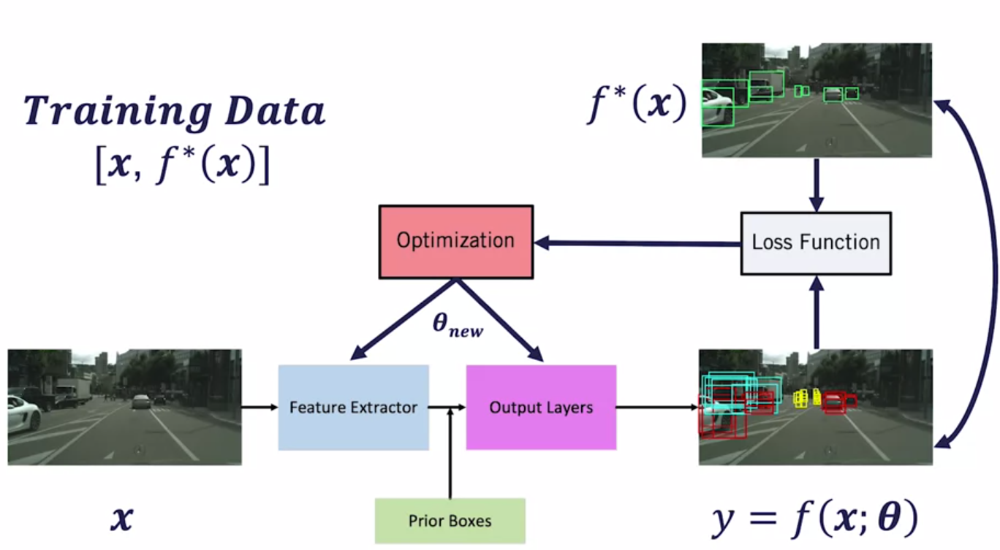 

- Recall from last week that we performed training by first evaluating a loss function that measures how similar our predicted bounding boxes are to the ground truth bounding boxes.
- Then we feed the resultant loss function to our optimizer that outputs a new set of parameters theta to be used for the second iteration.
- Notice that both the feature extractor and the output layers are modified during training.
- Now if f star of x and f of x theta are one to one, our problem would have been easy. 
- However, the outputs of our network is multiple boxes that can be associated with a single ground truth box.


**Mini Batch selection**

Let's see how we can work to resolve this issue.Remember that for each pixel in the feature map, we associate k anchors.

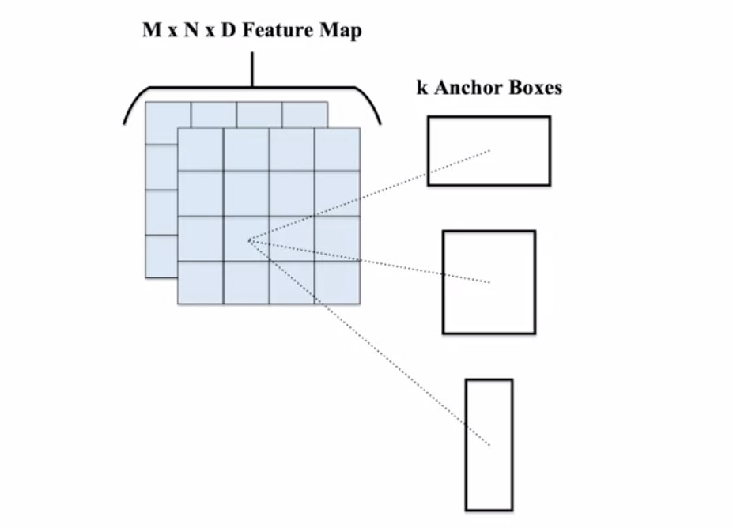 

*Where do these anchors appear in the original image?*

- As we've learnt earlier, our feature extractor reduces the resolution of the initial input by a factor of 32. 

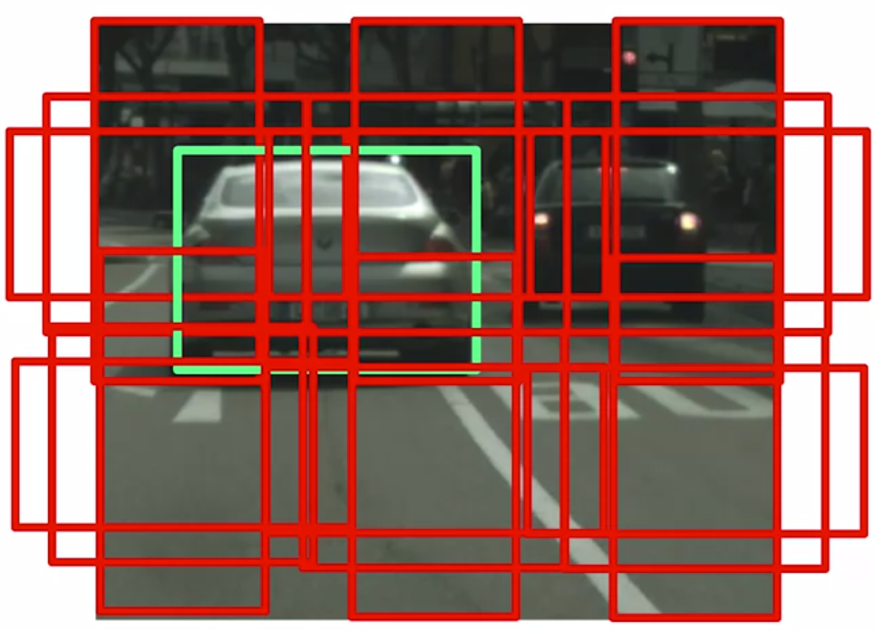 

- That means that if we associate every pixel in the feature map with a set of anchors, these anchors will be transferred to the initial image by placing them on a grid with stride 32. 
- We can then visualize the ground truth bounding box alongside these anchors. You can notice that some anchors overlap and some don't.
- We quantify this overlap with IOU and categorize the anchors into two categories. 

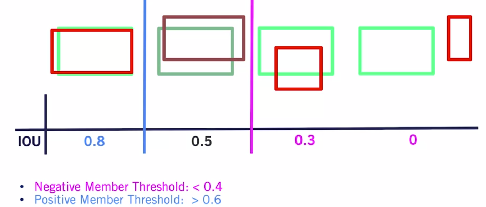

- We first specify two IOU thresholds, a positive anchor threshold, and a negative anchor threshold.
- Any anchor with an IOU greater than the positive anchor threshold is called a **positive anchor**. 
- And similarly, any anchor with an IOU less than the negative anchor threshold is called a **negative anchor**.
- Any anchor with an IOU in between the two thresholds is fully discarded.

*So now, how do we use these positive and negative anchors in training?* 

- Let's now see how to assign the classification and regression targets for the positive and negative anchors. 

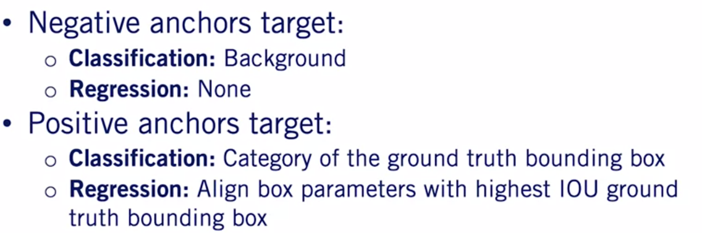

- For classification, we want the neural network to predict that the negative anchors belong to the background class. 
- Background is usually a class we add to our classes of interest to describe anything non-included in these classes.
- On the other hand, we want the neural network to assign ground truth class to any positive anchor intersecting that ground truth.
- For regression, we want to shift the parameters of the positive anchor to be aligned with those of the ground truth bounding box. 
- The negative anchors are not used in bounding box regression as they are assumed to be background.

This approach of handling multiple regressed anchors during training is not free from problems.

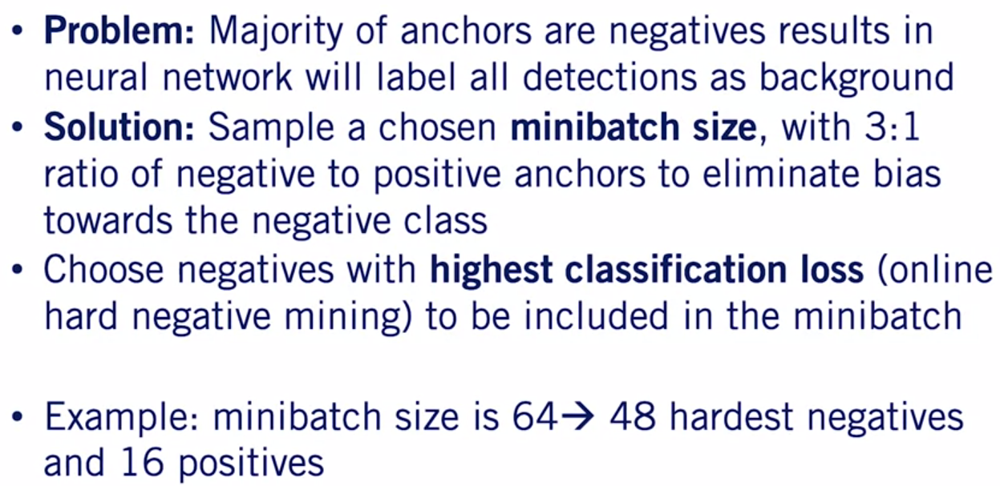 

- The proposed IOU thresholding mechanism results in most of the regressed anchors being negative anchors. 
- When training with all these anchors, the network will be observing far more negative than positive examples leading to a biased towards the negative class.
- The solution to this problem is actually quite simple, instead of using all anchors to compute the lost function, we sample the chosen minibatch size with a three to one ratio of negative to positive anchors.
- The negatives are chosen through a process called `online hard negative mining`, in which negative minibatch members are chosen as the negative anchors with the highest classification loss.
- This means that where we've training to fix the biggest errors in negative classification.

- As an example, if we have a minibatch of 64 examples, the negative minibatch will be the 48 negative examples with the highest classification loss, and the 16 remaining anchors will be positive anchors. 

- If the number of positives is less than 16, we either copy some of the positives to pad the minibatch or fill the remaining spots with negative anchors.

**Classification Loss**

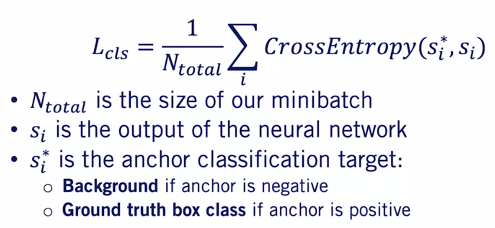 

- As we described earlier last week, we used the cross entropy loss function for the classification head of our ConvNet. 
- The total classification loss is the average of the cross entropy loss of all anchors in the minibatch.
- The normalization constant and total is the chosen minibatch size.
Si is the output of the classification head. 
- And Si star is the ground truth classification which is set to background for negative anchors and to the class of the ground truth bounding box for the positive anchors.

**Regression Loss**

- For regression, we use the L2 norm loss in a similar manner. However, we only attempt to modify an anchor if it is a positive anchor. 

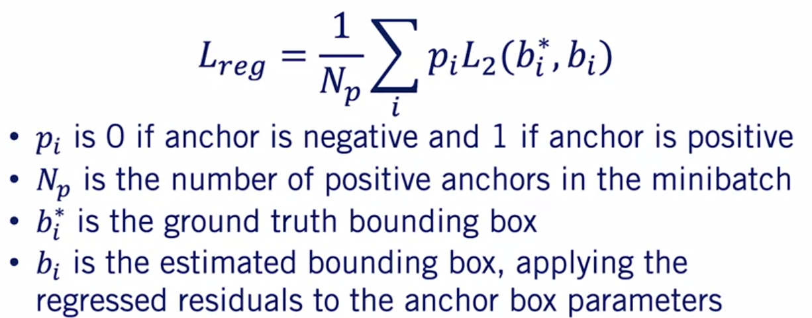 

- This is expressed mathematically with a multiplier Pi on the L2 norm. It is 0 if the anchor is negative and 1 if the anchor is positive.
- To normalize, we divide by the number of positive anchors, and just as a reminder, `bi star` is the **ground truth bounding box representation**, while `bi` is the estimated bounding box.
- Remember that we don't directly estimate box parameters, but rather, we modify the anchor parameters by an additive residual or a multiplicative scale. 
- So bi must be constructed from the estimated residuals.

**Visual Representation Of Training**

- Let's visualize what we are trying to teach the neural network to learn with these loss functions.

- Given an input image, a ground truth bounding box, and a set of input anchors from the anchor prior, we are teaching the neural network to classify anchors as containing background in purple or a car in blue. 
- This is done by minimizing **the cross entropy loss** defined above. 

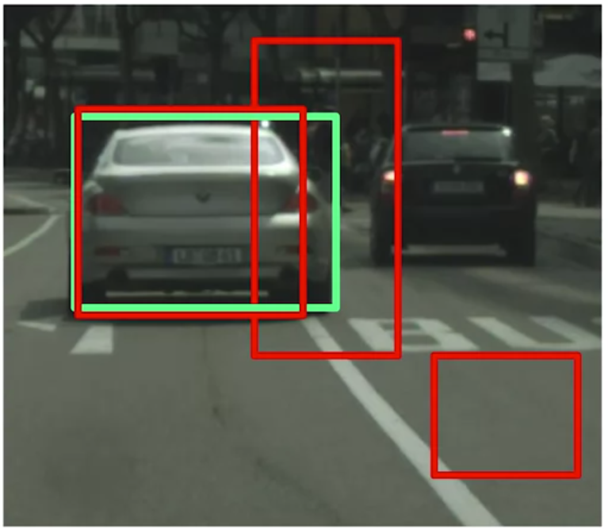 

- Then we want the neural network to move only anchors that contain a class of interest, in a way that matches the closest ground truth bounding box. 
- This is done by minimizing **L2 norm loss** defined above.

**Inference Time**

- By now, you should have a good grasp on how to handle multiple output boxes for object during training. 

*But what do we do when we run the neural network in real time during inference?* 

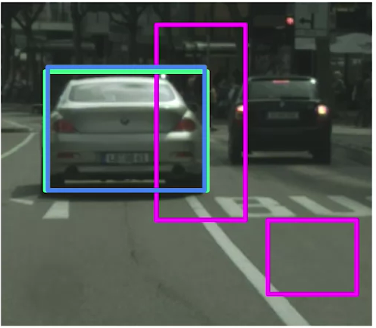 

- Remember, during inference, we do not have ground truths to determine positive and negative anchors and we do not evaluate loss functions. 
- We just want a single output box per object in the scene.
- Here is when non max suppression comes into play, an extremely powerful approach to improving inference output for anchor based neuron networks. 

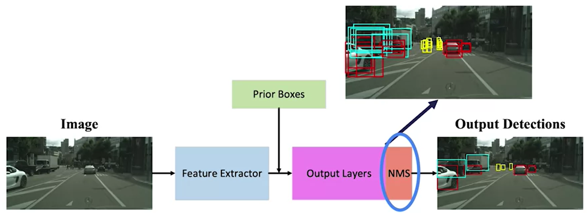 

**Non-Maximum suppression**

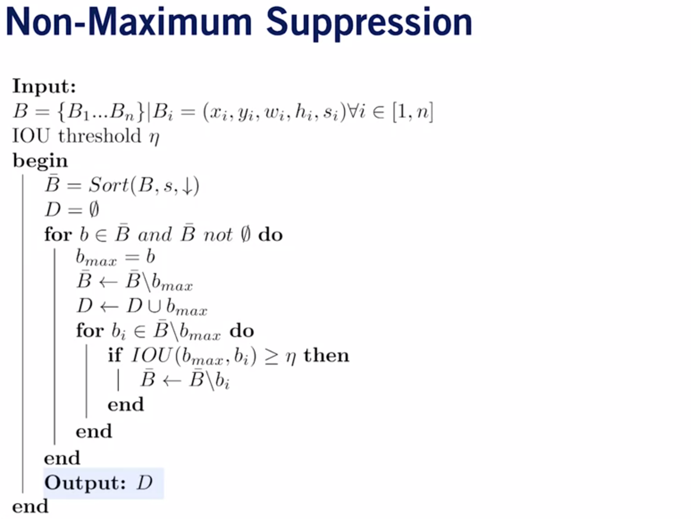 

- Non-max suppression takes as an input a list of predicted boundary boxed b, and each bounding blocks is comprised of the regressed coordinates in the class output score.
- It also needs as an input a predefined IOU threshold which we'll call ada.
- The algorithm then goes as follows, we first sort the bounding boxes in list B according to their output score. 
- We also initialize an empty set D to hold output bounding boxes.
- We then proceed to iterate overall elements in the sorted box list B bar. Inside the for loop, we first determine the box B max with the highest score in the list B, which should be the first element in B bar.
- We then remove this bounding box from the bounding box set D bar and add it to the output set D.
- Next, we find all boxes remaining in the set B bar that have an IOU greater than ada with the box B max. 
- These boxes significantly overlap with the current maximum box, B max. 
- Any box that satisfies this condition gets removed from the list B bar. 
- We keep iterating through the list B bar until is empty, and then we return the list D.
- D now contains a single bounding box per object.

Let's go through a visual example to understand how non-max suppression algorithms work in practice.

Let's assume that we have sorted the bounding box list in decreasing order.

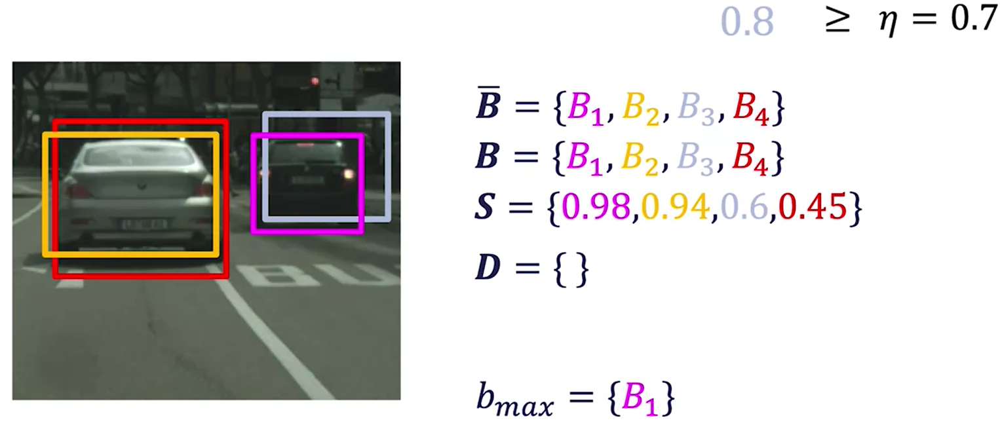 

- We also show the score list explicitly here for better visibility on how non-max suppression works. 
- b max will be the first bounding box of the sorted list B bar.
- We then proceed to compare each bounding box to b max. In this case, only one box, B3, has a non zero IOU with b max. We compute that IOU and compare it with our IOU threshold ada. 
- In this case, the IOU is greater than the threshold ada, so we remove box 3 from the list B bar. 
- We repeat the process for the next highest score that remains in the list.

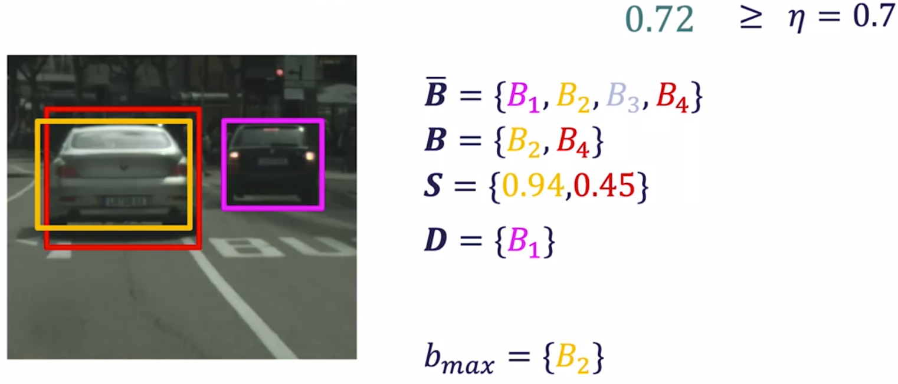

- Again, only one box has a non-zero IOU with b max, box 4 in this case.

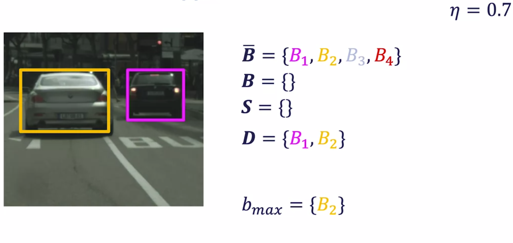 

- Computing the IOU and comparing with the threshold, we eliminate box 4 from list B bar, and add box 2 to the output list D.
- We notice that our initial list, B bar, is now empty. 
- So our non-max suppression algorithm exits and returns the output box list D that contains one bounding box per object as expected.

**Summary**

- Congratulations, you have now completed the content required to train and deploy ConvNet based 2D object detectors for self-driving cars. 
- In this video, we explored how to adjust network output during training to maintain class balance, and to restrict network output during inference to select one output bounding box per object.
- 
### Supplementary Reading: Training vs. Inference

- Ren, S., He, K., Girshick, R., & Sun, J. (2015). Faster r-cnn: Towards real-time object detection with region proposal networks. In Advances in neural information processing systems (pp. 91-99).
- Liu, W., Anguelov, D., Erhan, D., Szegedy, C., Reed, S., Fu, C. Y., & Berg, A. C. (2016, October). Ssd: Single shot multibox detector. In European conference on computer vision (pp. 21-37). Springer, Cham. https://arxiv.org/abs/1512.02325
- Lin, T. Y., Goyal, P., Girshick, R., He, K., & Doll√°r, P. (2018). Focal loss for dense object detection. IEEE transactions on pattern analysis and machine intelligence. (State of the art)

### Lesson 4: Using 2D Object Detectors for Self-Driving Cars

**3D Object Detection**

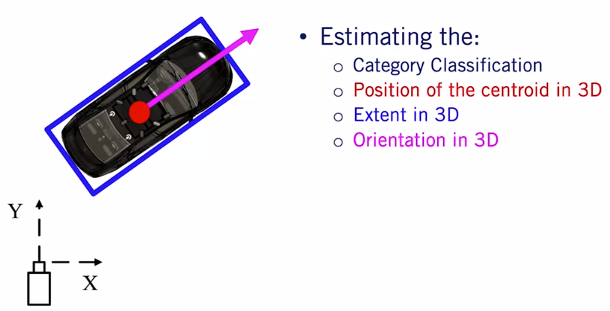 

- Self-driving cars require scene understanding in 3D to be able to safely traverse their environment. 
- Knowing where pedestrians, cars, lanes, and signs are around the car entirely defines what actions can be taken safely when autonomous. 
- This means that detecting objects in the image plane is not enough. 
- We need to extend the problem from 2D to 3D, and locate the detected objects in the world frame. 
- 3D object detection with ConvNets is a relatively new topic, and results in this domain are constantly changing. 
- As with it's 2D counterpart, 3D object detection requires category classification. 
- This is essential for tracking objects as cars move differently from pedestrians, for example, so better predictions are possible if the object class is known. 
- In addition, we want to estimate the position of the objects centroid in 3D, the extent in 3D, and the orientation in 3D. 
- In each case, this detailed state information improves motion prediction, and collision avoidance, and improves the cars ability to move in traffic.
- This object's state can be expressed as a 3D vector for centroid position expressed as the x, y, z position of the object. 

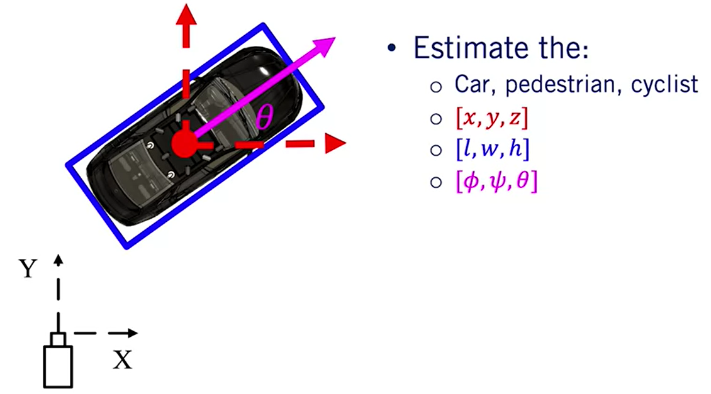 

- A 3D vector for extense, expressed as the length, width, and height of an object. 
- A 3D vector of orientation angles expressed as the roll, pitch, and yaw angles of an object. 
- For road scenes, the orientation angle we are interested in is usually only the **yaw angle** as most road agents cannot vary their roll and pitch angles beyond what the ground surface dictates for the most part. 
- It is therefore sufficient to only track the yaw angle. 

**From 2D To 3D Object Detection**

*But how do we get from a 2D bounding box to an accurate 3D estimation of the location and extent of an object?* 

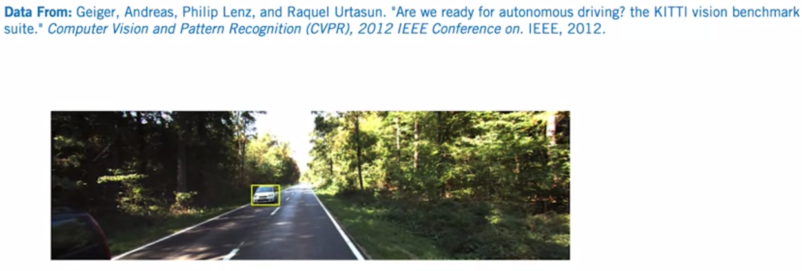

- The most common and successful way to extend 2D object detection results in 3D is to use **LiDAR point clouds**. 

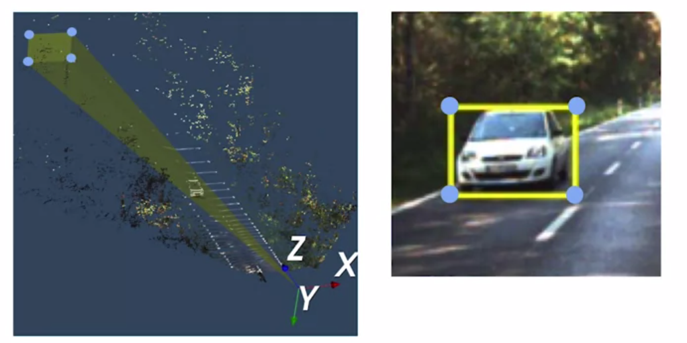 

- Given a 2D bounding box in an image space and a 3D LiDAR point cloud, we can use the inverse of the camera projection matrix to project the corners of the bounding box as rays into the 3D space. 
- The polygon intersection of these lines is called a `frustum`, and usually contains points in 3D that correspond to the object in our image. 

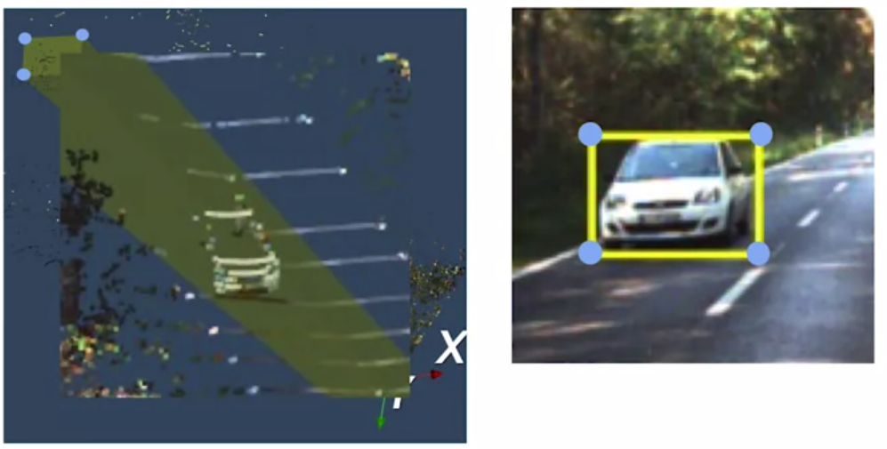 

- We then take the data in this frustum from the LiDAR, transform it to a representation of our choice, and train a small neural network to predict the seven parameters required to define our bounding box in 3D. 

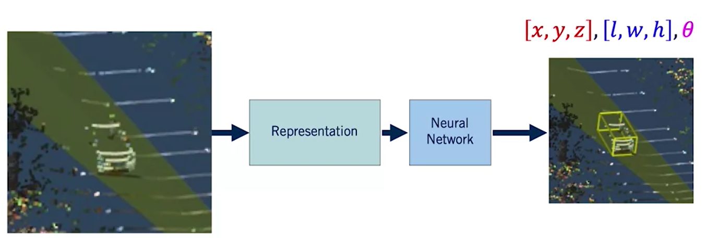 

*Now, which representation of the LiDAR points in the frustum should we input to the neural network?* 

- Some groups choose to directly process the raw point cloud data. 

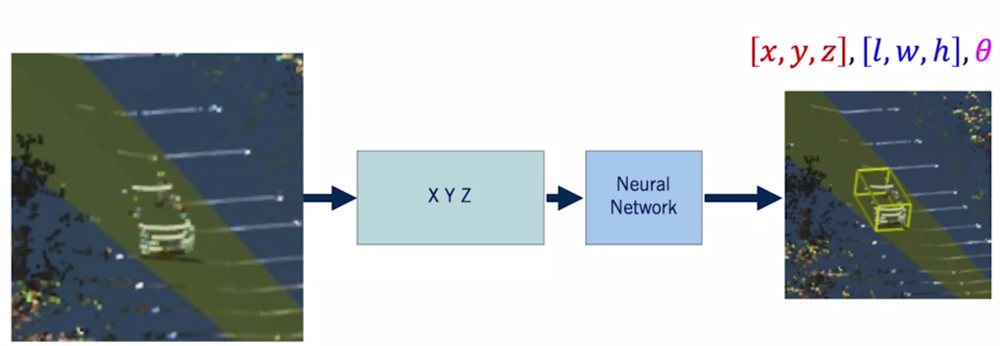 

- Others choose to normalize the point cloud data with respect to some fixed point such as the center of the frustum. 

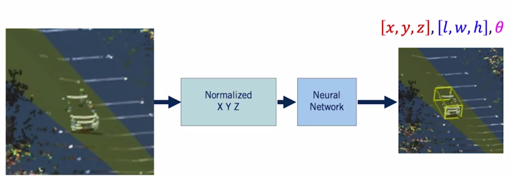 

- Finally, one could also preprocess the points to build fixed length representations such as a histogram of x, y, z had points, for example, making their use as an input to a continent much more convenient. 

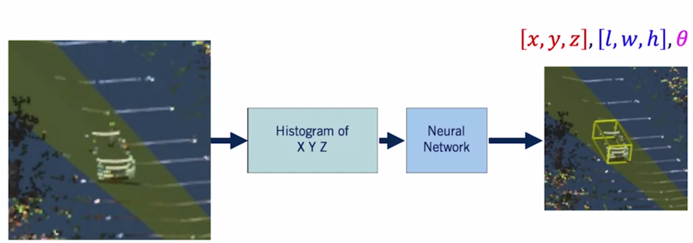

**Typical 3D object detectionn results**

- Whatever representation we use, 

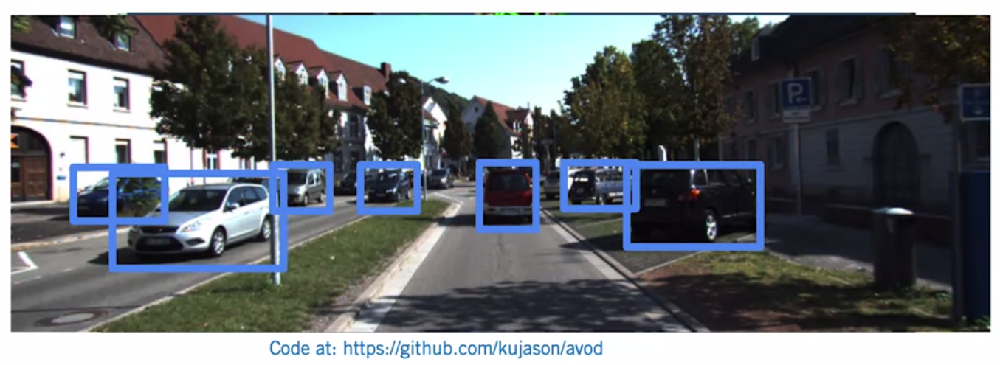 

- We are expected to get results in the form of oriented 3D bounding boxes. 
  
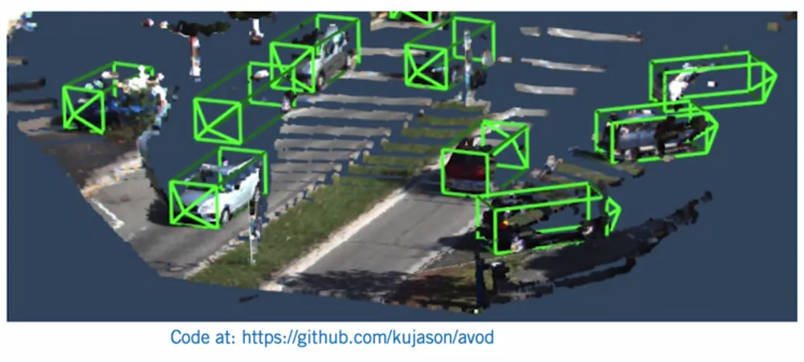

- Keep in mind that the procedure discussed above is only one way of performing 3D object detection. 

*So, why would we choose to extend 2D detections to 3D rather than detecting objects directly in 3D?* 

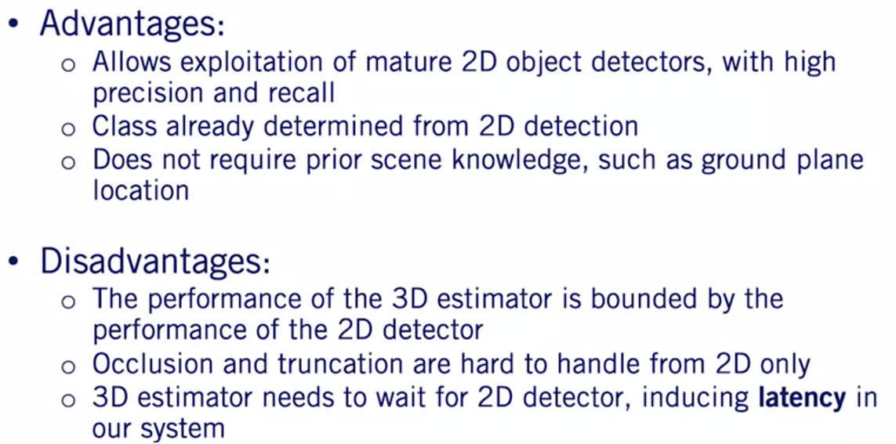 

**Pros :**
- First, 2D object detectors are much more well-established than 3D object detectors. 
  - We are usually able to get a very high precision and recall from a mature 2D object detector. Something that is still not available when working in the 3D object detection literature. 
- Second, we get classification for free from the 2D object detector results.
- There is no need to use LiDAR data or pass 3D information into the network to determine whether we are looking at a car or a post. This is eminently visible in the image data in 2D. 
- Finally, searching a 3D space for possible objects is quite computationally expensive if no assumptions can be made about where the object should be found.
- Extending 2D object detectors to 3D, usually allows us to limit the search region for object instances keeping real-time performance manageable. 

**Cons :**
- However, extending 2D object detectors to 3D also incurs a set of unique problems. 
  - One prominent problems stemming from using this approach for 3D object detection is that we bound the performance of the 3D pose estimator by an upper limit which is the performance of the 2D detector. 
  - Furthermore, 2D to 3D methods usually fail when facing severe occlusion and truncation from the cameras viewpoint which may not affect the LiDAR data
  - Finally, the latency induced by the serial nature of this approach is usually not negligible. Latency is manifested as delayed perception which means that our car will see an object on the road after a certain delay. 
- If this delay is significant, the system might not be safe enough to operate as vehicle reaction time is limited by perception latency. 

**2D Object Tracking**

Another very important application of 2D to 3D object detection is object tracking.

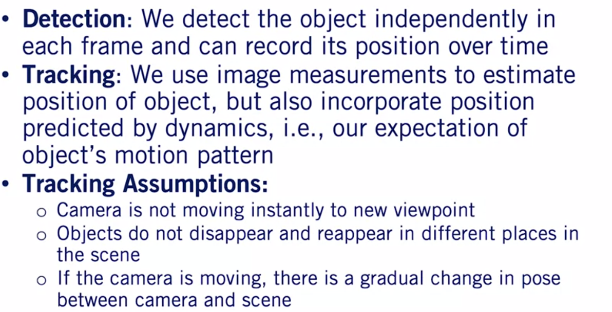 

- Tracking involves stitching together a sequence of detections of the same object into a track that defines the object motion over time. 
- We will begin by describing a simple tracking method that can be used both in 2D and in 3D which will hopefully sound familiar from course 2
- When we perform object detection, we usually detect objects independently in each frame. 
- In tracking however, we incorporate a predicted position usually through known object dynamic models. 
- Tracking requires a set of assumptions constraining how quickly a scene changes. 
- For example, we assume that our camera and the tracked objects cannot teleport to different locations within a very short time. 
- Also, we assume that the scene changes smoothly and gradually. 
- All of these assumptions are logically valid in roads scenes. 


Let's visually see what object tracking looks like. 

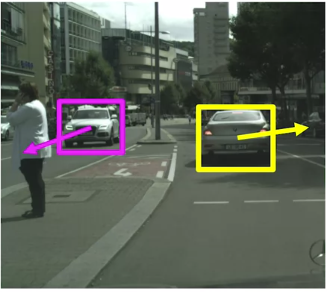 

- Given a detected object in the first frame along with their velocity vectors, we begin by predicting where the objects will end up in the second frame

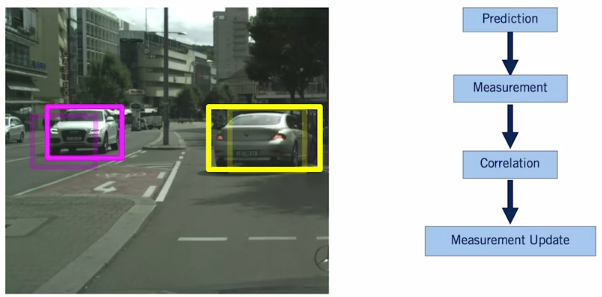 
- If we model their motion using the velocity vector, we then get new detections in the second frame. 
- We call these detections or measurements, we correlate each detection with a corresponding measurement, and then update our object prediction using the correlated measurement. 

**Object Tracking: Prediction**

Let's describe each of the necessary steps. First, we define a block state as its position and velocity in image space. 

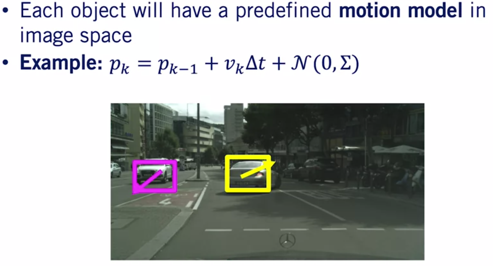 

- Each object will have a motion model that updates its state. As an example, the constant velocity motion model shown here is used to move each bounding box to a new location in the second frame.


- Notice that, we added a zero mean Gaussian noise to our motion model as the model is not perfect. 

**Object Tracking: Correlation**

- After the prediction step, we get the second frame measurement from our 2D object detector. 

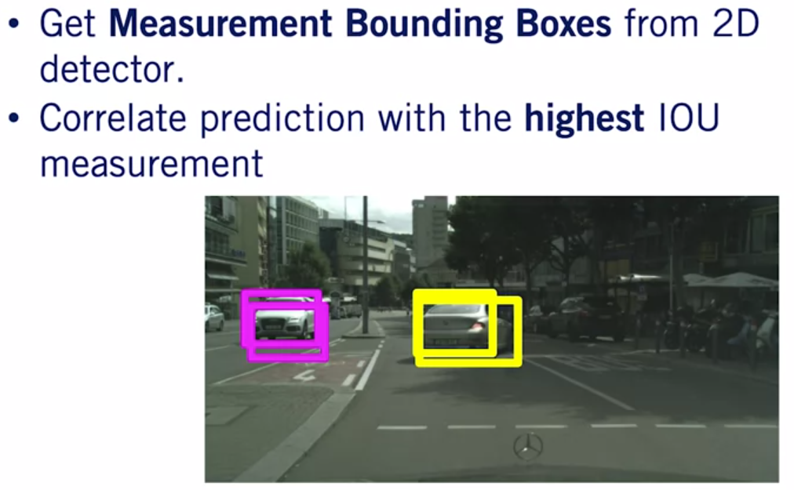 

- We then proceed to correlate each measurement to a prediction by computing the IOU between all predictions and all measurements. 
- A measurement is correlated to a corresponding prediction if it has the highest IOU with that prediction. 

**Object Tracking: Update**

The final step consists of using a Kalman filter to fuse the measurement and prediction updates. 

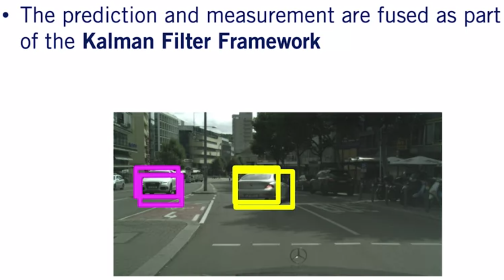 

- We recommend reviewing the Kalman filter equations presented in course 2 to remember how this step is performed. 
- The Kalman filter updates the whole object state including both the position and the velocity, and we can use that in our subsequent prediction step. 
- Note that, we do not need to track the object sizes but can rely on the detector instead. We usually assign an object the size of its last known measurement. 

**Object Tracking**

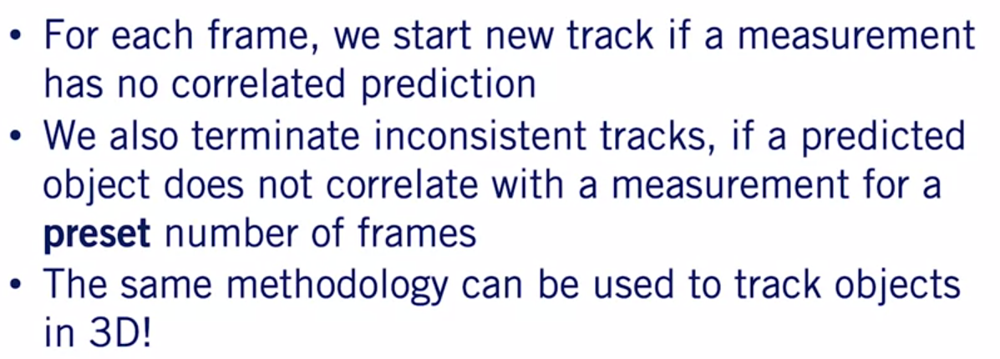 

A few intricacies remain to be tackled, specifically how to initiate tracks and how to terminate them. 

- We initiate new tracks if we get 2D detector results not correlated to any previous prediction. 
- Similarly, we terminate inconsistent tracks, if a predicted object does not correlate with a measurement for a preset number of frames. 
- Finally, we need to note that by defining IOU in 3D, we can use the same methodology for 3D object tracking. 

**3D Object Tracking**

Let's take a look at a video from the autonomous vehicle 3D object tracking in action. 


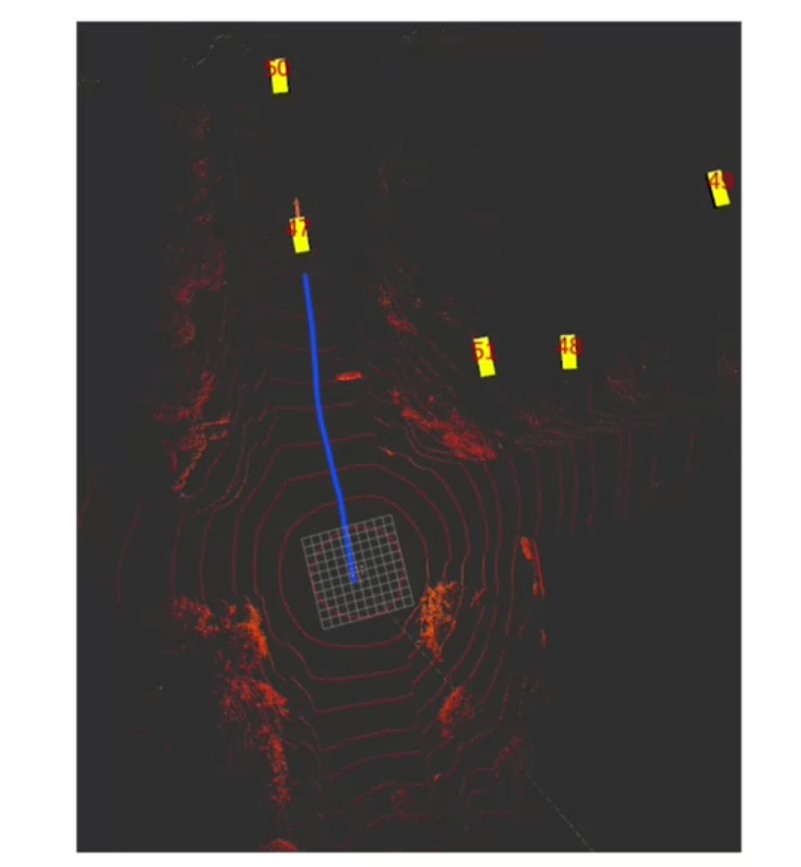 

- Note that, the tracks are slightly jittery because the detections have some noise in their frame to frame position estimates, and the motion model used in this code does not include accurate vehicle kinematic or dynamic models. 

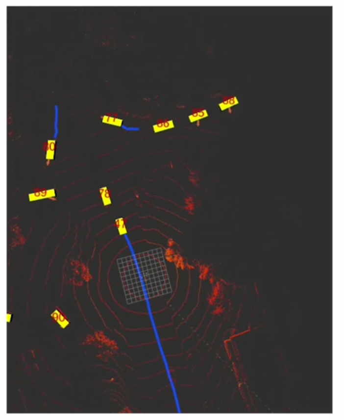 

- This is because of a lack of knowledge of the other vehicles steering and acceleration inputs. 

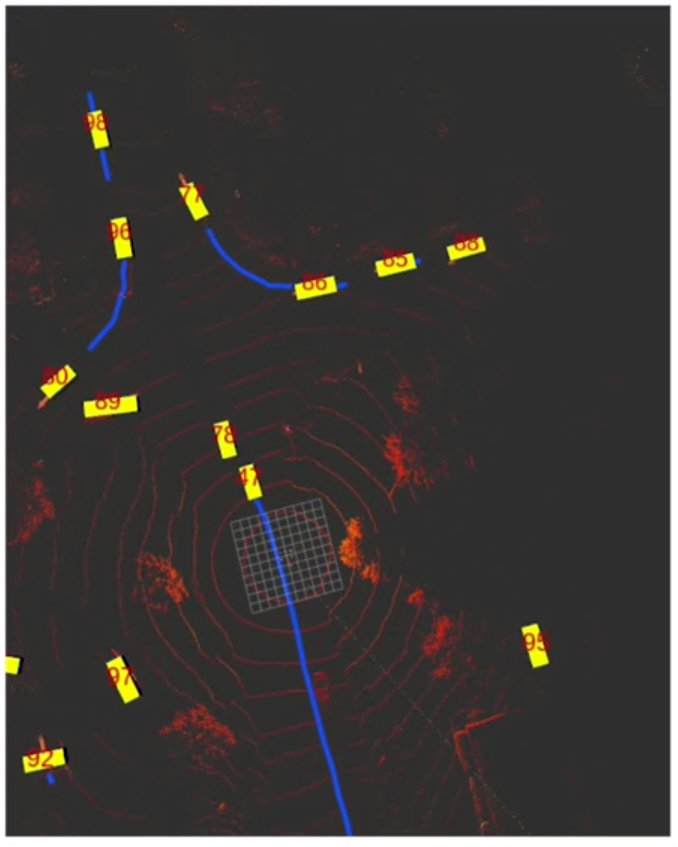 

- Nonetheless, we can still accurately detect multiple vehicles moving through the environment and make careful decisions about precedence and safe interaction along the way. 

**Traffic Sign and Traffic Signal Detection**

One final concept we will describe within the framework of 2D object detection, is detection of traffic signs and traffic signals. 

- The correct detection of these road rule indicators guides the self-driving car as it drives legally on busy streets. 
- However, the detection task incurs its own separate set of challenges. 
- Let's take a look at the most prominent ones. Here you can see a typical dash cam style image from a camera mounted on a self-driving car. 

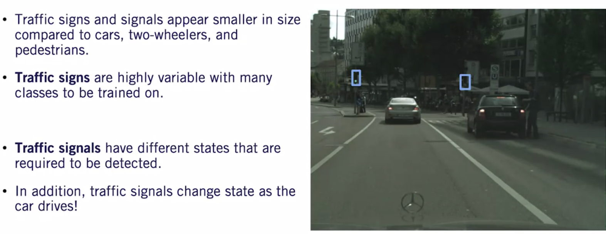 

- Usually, traffic signs and traffic signals have to be detected at long range for a car to know how to react properly in a timely manner. 
- At long range, traffic signs and signals occupy a very small number of pixels in the image making the detection problem particularly challenging. Furthermore, traffic signs are highly variable. 
- Usually, including as many as 50 classes that need to be classified reliably. 
- Traffic lights on the other hand might appear differently in different areas of the world, and have multiple states that need to be detected for a self-driving car to safely maneuver through signalized intersections. 
- In addition, traffic lights change state as the car moves. 
- This might cause some problems when trying to track traffic signals in image space. 
- As the appearance changes with respect to the state the traffic light is in

**Traffic Sign and Traffic Signal Detection - 2**

- Luckily, standard object detectors we have described so far can be used without major modifications to detect traffic signs and signals. 

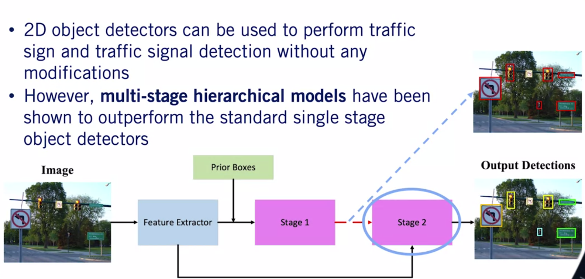 

- However, current approaches rely on multistage hierarchical models to perform this detection task more robustly. 
 
Let's consider the two-stage model shown here. The two stages share the output of the feature extractor to perform their respective task.

- In this example, the first stage outputs class agnostic bounding boxes that point to all traffic signs and signals in the image, without specifying which class each box belongs to. 
- The second stage then takes all of the bounding boxes from the first stage and classifies them into categories such as red, yellow or green signals stop signs etc. 
- In addition, some methods also use the second stage to further refine the bounding boxes provided in the first stage. 

```
- This multi-stage approach is not specific to traffic signs and signals, and many of the general object detection frameworks employ multi-stage methods to generate accurate object class and location. 
- If interested, we have provided some of these approaches as supplementary reading materials. 
```

**Summary**

- In this video, we saw that the output of the 2D object detectors can be used to produce 3D object locations, we studied how tracking can be performed on a 2D object detector output in consecutive image frames to create object tracks through the environment, and we explored how 2D object detectors can be used to detect traffic signs and traffic signals without major modifications. 
- However, specialized methods that exploit hierarchical models usually perform better than standard methods. 
- We now have the tools needed for the main types of object detection used in self-driving cars. 
- Congratulations. You've successfully completed this module on 2D object detection. 
- This module has been quite involved and we recommend that you check our provided resources for more information, on how to use neural networks for 2D and 3D object detection and tracking. 


- ### Supplementary Reading: Using 2D Object Detectors for Self-Driving Cars

- Qi, C. R., Liu, W., Wu, C., Su, H., & Guibas, L. J. (2017). Frustum pointnets for 3d object detection from rgb-d data. arXiv preprint arXiv:1711.08488. (3D object detection from 2D)

- Forsyth, D.A. and J. Ponce (2003). Computer Vision: a modern approach (2nd edition). New Jersey: Pearson. Read section 18.2 (Tracking)


## Grade : Object Detection For Self-Driving Cars

# References
Tesla AI Day : 
- [Tesla Autonomy Day - 2019](https://www.youtube.com/watch?v=Ucp0TTmvqOE)
- [Tesla Battery Day - 2020 - during covid](https://www.youtube.com/watch?v=l6T9xIeZTds)
- [Tesla AI Day - 2021](https://www.youtube.com/watch?v=j0z4FweCy4M&t=37s)
- [Tesla AI Day - 2022](https://www.youtube.com/watch?v=ODSJsviD_SU&t=3480s)

# Appendices

- [Jaccard index](https://en.wikipedia.org/wiki/Jaccard_index)


  