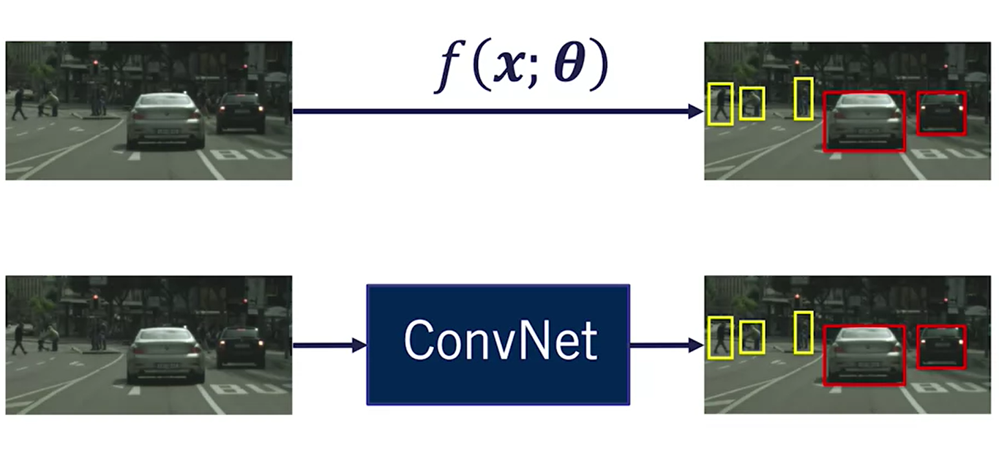

# Course-3 - W4 - MODULE 4: 2D Object Detection

## Overview 
- The two most prevalent applications of deep neural networks to self-driving are object detection, including pedestrian, cyclists and vehicles, and semantic segmentation, which associates image pixels with useful labels such as sign, light, curb, road, vehicle etc. 
- This module presents baseline techniques for object detection and the following module introduce semantic segmentation, both of which can be used to create a complete self-driving car perception pipeline.
- 
**Course Objectives**
- Define the object detection problem for autonomous driving as an extension of object classification
- Identify quality datasets and their characteristics for training deep network detectors
- Perform basic 2D object detection for a self-driving dataset
- Track a set of moving objects detected by a 2D detector

## 2D Object Detection
### Lesson 1: The Object Detection Problem

**Brief History of Object Detection**

- The history of 2D object detection begins in **2001** when **Paul Viola** and **Michael Jones** invented a very efficient algorithm for face detection. 
- This algorithm now called `the Viola, Jones Object Detection Framework`, was the first object detection framework to provide reliable, **real-time 2D object detections** from a simple `webcam`. 
- The next big breakthrough in object detection happened four years later when Navneet Dalal and Bill Triggs formulated the histogram of oriented gradient feature descriptor. 
- Their algorithm applied to the 2D pedestrian detection problem, outperformed all other proposed methods at the time. 
- The Dalal, Triggs algorithm remained on the top of the charts until 2012 when **Alex Krizhevsky**, **Ilya Sutskever** and **Geoffrey Hinton** from the Computer Science Department here at **the University of Toronto**, shook the computer vision world with their `convolutional neural network dubbed AlexNet`. 
- AlexNet won the ImageNet Large Scale Visual Recognition Challenge in 2012 with a wide margin over the algorithm that took second place. 
- In 2012, it was the only deep learning-based entry in the challenge. But since then, all winning entries in this competition are based on convolutional neural networks with the entry surpassing the human recognition rate of 95 percent recently. 
- This performance extended from 2D object recognition to 2D object detection with current day detectors being almost exclusively based on convolutional neural networks. 
- Before we go through how to use ConvNets for object detection and self-driving cars, let's formulate the general 2D object detection problem. 

**The Object Detection Problem**

Given a 2D image's input, we are required to estimate the location defined by a bounding box and the class of all objects in the scene. Usually, we choose classes that are relevant to our application. 

- For self-driving cars, we usually are most interested in object classes that are dynamic, that is ones that move through the scene. 
- These include **vehicles** in their **subclasses**, **pedestrians**, and **cyclists**.

**Object Detection Is Not Trivial**

- The problem of 2D object detection is not trivial. The extent of objects we require to estimate are not always fully observed in the image space. 
- As an example, background objects are usually occluded by foreground objects. This requires any algorithm we use to be able to hallucinate the extent of objects to properly detect them.
- Furthermore, objects that are near the edge of the image are usually truncated. 
- This phenomenon creates huge variability in the bounding box sizes, where the size of the estimated bounding box depends on how truncated the object is. 
- Another issue faced by 2D object detection algorithms is that of scale. Objects tend to appear very small as they go further away from our censor. 

- Our algorithm is expected to determine the class of these objects at variable scales. 
- Finally, our algorithm should also be able to handle illumination changes. 

- This is especially important in the context of self-driving cars, where images can be affected by whole image illumination variations from bright sun to night driving, and partial variations due to reflections, shadows, precipitation, and other nuisance effects. 

**Mathematical Problem Formulation**

Now that we've intuitively understood what object detection is, let us formalize the problem mathematically. 

Object detection can be defined as a `function estimation problem`.

- Given an input image $x$ , we want to find the function $f(x; \theta)$ that produces an output vector that includes the coordinates of the top-left of the box, x_min and y_min, and the coordinates of the lower right corner of the box, x_max and y_max, and a class score $S_{class1}$ to $S_{classk}$ . 

- Sclassi specifies how confident our algorithm is that the object belongs to the class $i$ , and $i$ ranges from one to $k$ , where $k$ is the number of classes of interest.

*Can you think of any way to estimate this function?* 
- Convolutional neural networks, which we described last week are an excellent tool for estimating this kind of function. 

- For object detection, the input data is defined on a 2D grid, and as such, we use ConvNets as our chosen function estimators to perform this task. 
- We will discuss how to perform 2D object detection with ConvNets in the next lesson. But first, we need to figure out how to measure the performance of our algorithm. 

**Evaluation Metrics**

Given the output of a 2D object detector in red, we want to be able to compare how well it fits the true output, usually labeled by humans. 

We call the true output our `ground truth bounding box`. 

- The first step of our evaluation process is to compare our detector localization output to the ground truth boxes via the **Intersection-Over-Union metric** (IOU). 

- IOU is defined as the area of the intersection of two polygons divided by the area of their union. However, calculating the intersection-over-union does not take into consideration the class scores. 
  

- To account for class scores, we define true positives. **True positives** are output bounding boxes that have an IOU greater than a predefined threshold with any ground truth bounding box.   

- In addition, the class of those output boxes should also match the class of their corresponding ground truth. That means that the 2D detector should give the highest class score to the correct class, have a score that is greater than a score threshold.
- On the other hand, **false positives** are the output boxes that have a score greater than the score threshold, but an IOU less than the IOU threshold with all ground truth bounding boxes. 
- This can be easily computed as the total number of detected objects after the application of the score threshold minus the number of true positives. 
- The final base quantity we would like to estimate is the number of false negatives. False negatives are the ground truth bounding boxes that have no detections associated with them through IOU. 
- Once we have determined the true positives, false positives, and false negatives; we can determine the **precision** and **recall** of our 2D object detector according to the following. 
- The precision is the number of true positives divided by the sum of the true positives and the false positives. 
- The **recall** on the other hand is the number of true positives divided by the total number of ground truth objects, which is equal to the number of true positives added to the number of false negatives. 
- Once we determine the precision and recall, we can vary the object class score threshold to get a precision recall curve, and finally, we determine **the average precision** as the area under the precision-recall curve. 
- The area under the curve can be computed using numerical integration, but is usually approximated using an average of the precision values at 11 recall points ranging from zero to one. 
I know these are quite a few concepts to understand the first time through. But don't worry, as you'll soon get a chance to work through a step-by-step practice notebook on how to code all of these methods in Python in the assessments. 

**Example**

Let's work through an example on how to assess the performance of a 2D object detection network using the learned metrics. 

- We are interested in detecting only cars in a road scene.That means that we have a single class of interest, and therefore only one set of scores to consider. 

- We are given ground truth bounding boxes of cars labeled by human beings and shown in green. 

 
- We process our image with a confinet to get the detection output bounding boxes, shown in red. You can notice that the network mistakenly detects the front of a large truck as a car. 
- Looking at the scores, we see that our confinet gave this miss detection quite a high score of being a car. 

Let's now evaluate the performance of our confinet using average precision. 

 
- The first step is to take all of our estimated bounding boxes and sort them according to object class score. 
- We then proceed to compute the IOU between each predicted box and the corresponding ground truth box. 
- If a box does not intersect any ground-truth boxes, it's IOU is set to zero. 

- First, we said a class score threshold, let's say 0.9. This threshold means that we only trust our network prediction, if it returns a score that is greater than 9, and we eliminate any bounding boxes with a score less than 0.9. 
- Next, we set an IOU threshold, we'll use 0.7 in this case and proceed to eliminate any remaining predictions with an IOU less than 0.7. 
- In this case, both the remaining predictions have an IOU of greater than 0.7, and so we don't eliminate any. 
- We can now compute the number of true positives as the number of remaining bounding boxes after the application of both the score and the IOU thresholds, which in this case is two. 
- The number of false positives is zero in this case, since all boxes remaining after the application of the score thresholds also remain after the application of the IOU threshold.
- Finally, the number of false negatives are boxes in the ground truth that have no detections associated with them after the application of both the score and the IOU thresholds. 
- In this case, the number of false negatives is 2. The precision of our neural network is computed as the number of true positives divided by their sum with the number of false positives. 
- In this case, we don't have false positives. So the precision is 2 over 2 equal to 1. 

 
- To compute the recall, we divide the number of true positives by the number of ground truth bounding boxes, which is equal to the number of false positives summed with the number of false negatives. The recall in this case is 2 over 4. 
- The detector in this case is a **high precision low recall detector**. This means that the detector misses some objects in the scene, but when it does detect an object, it makes very few mistakes in category classification and bounding box location. 
 
Let's see how the performance of our detector changes when we decrease the score threshold from 0.9 to 0.7. 

- All bounding boxes have a score greater than 0.7, so we do not eliminate any of them through score thresholding. 

- However, when we examine the IOU of the remaining boxes, we can see that two of them have an IOU less than 0.7. By eliminating these two boxes, we get three true positives.

- To compute the number of false positives, we need to look at how many detections remained after the application of the score threshold, but before the application of the IOU threshold. In this case, the number of false positives is two. 
- Finally, we take a look at the number of ground truth bounding boxes that have remained without an associated detection after the application of both the IOU and score thresholds to get one as the number of false negatives.
- Notice that the precision has dropped after decreasing the score threshold from one to 0.6, while the recall has increased from 0.5 to 0.75. 
- We can conclude that the effect of lowering the score threshold is less accurate detection results at the expense of detecting more objects in the scene. 

- If we continue this process and estimate the score threshold at decrements of 0.01, we arrive at the following table. 

- We then proceed to plot the precision-recall curve, using the precision values on the y-axis and the recall values on the x-axis. 
- Note that we also add the precision recall points of one and zero as the first in the plot, and zero one as the final point in the plot. 
- This allows us to approximate the average precision by calculating the area under the P-R curve using 11 recall points between zero and one, at 0.01 recall increments. 

 

- Computing this average produces an AP of 0.75 for a car detector. 
- The value of the average precision of the detector can be thought of as an average of performance over all score thresholds allowing objective comparison of the performance of detectors without having to consider the exact score threshold that generated those detections. 

**Summary**

In this video, you learned how to **formulate the 2D object detection problem** and how **to evaluate a 2D object detectors performance** using **the average precision performance metric**.
 
Next lesson, you will learn how to use confinet as 2D object detectors for self-driving cars. See you then.

### Supplementary Reading: The Object Detection Problem

- Implementation Resources: https://github.com/tensorflow/models/tree/master/research/object_detection (Fully implemented models ready to be used, from Google team)

### Lesson 2: 2D Object detection with Convolutional Neural Networks
### Supplementary Reading: 2D Object detection with Convolutional Neural Networks
### Lesson 3: Training vs. Inference
### Supplementary Reading: Training vs. Inference
### Lesson 4: Using 2D Object Detectors for Self-Driving Cars
### Supplementary Reading: Using 2D Object Detectors for Self-Driving Cars
## Grade : Object Detection For Self-Driving Cars

# References

# Appendices

  