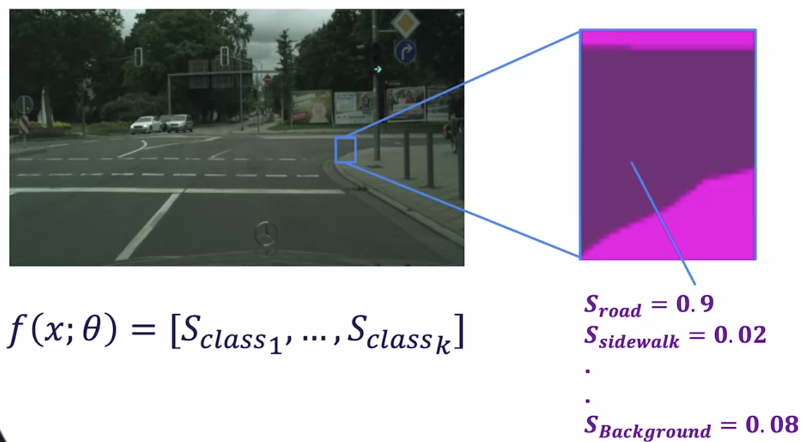

# Course-3 - W5 - MODULE 5: Semantic Segmentation

## Overview 
- The second most prevalent application of deep neural networks to self-driving is semantic segmentation, which associates image pixels with useful labels such as sign, light, curb, road, vehicle etc. 
- The main use for segmentation is to identify the drivable surface, which aids in ground plane estimation, object detection and lane boundary assessment. 
- Segmentation labels are also being directly integrated into object detection as pixel masks, for static objects such as signs, lights and lanes, and moving objects such cars, trucks, bicycles and pedestrians.
  
**Learning Objectives**

## Semantic Segmentation

- This module will be dedicated to another important perception task for self-driving cars, semantic segmentation. 
- Semantic segmentation is useful for a range of self-driving perception tasks such as identifying where the road boundaries are and tracking motion relative to lane markings. 
- By the end of this module, you will also be able to use semantic segmentation results to aid in 2D object detection. 
- Semantic segmentation is also very important for domains other than self-driving cars. 
- Medical image segmentation is a rapidly growing field with recent methods using the models you will learn this week to perform tasks ranging from tumor segmentation in CAT scans to cavity segmentation in tooth x-ray images. 
- In fact, during an international medical imaging segmentation challenge in 2017, ConvNets demonstrated abilities within one percent of human level performance. 
- The semantic segmentation models we will learn about in this course are versatile and usually transfer well to tasks outside the domain of self-driving cars. 
- In this lesson, you will learn how to formulate the problem of semantic segmentation. 
- You will also learn how to evaluate semantic segmentation models using common evaluation metrics such as the class IOU. 

### Lesson 1: The Semantic Segmentation Problem

Let's begin by defining the semantic segmentation problem. Given an input image, we want **to classify each pixel** into a** set of preset categories**. 

- The categories can be static road elements such as roads, sidewalk, pole, traffic lights, and traffic signs or dynamic obstacles such as cars, pedestrians, and cyclists. 

Also, we always have a background class that encompasses any category we do not include in our preset categories. 

**Mathematical Problem Formulation**

As with object detection, we realize the semantic segmentation through a **function estimator**. 

*So, how do we adapt our generic neural network to work for segmentation?*

Given an image, we take every pixel as an input and output a vector of class scores per pixel. 

- A pixel belongs to the class with the highest class score. Therefore, we want our estimator to give the highest score to the correct class for every pixel in an image. 

As an example, a road pixel should have a very high road score and much lower scores for other classes. 

- When we look at a pixel belonging to the sidewalk, the function estimator should provide a higher sidewalks score than all other class scores. 

**Semantic segmentation is a non-trivial problem**

- When attempting to perform semantic segmentation, we usually face many of the same problems as object detection. As such, semantic segmentation is a non-trivial problem.
- **Occlusion** and **truncation**, for example, make it hard to accurately predict object boundaries. 
- **Scale** is also a major issue as we need to handle both close-by objects with fine detail and far away objects captured by only a few pixels. 
- We also need to be able to handle **illumination changes** in the scene. 

However, semantic segmentation also has a major problem specific difficulty.

 
- This difficulty is caused by an ambiguity of boundaries in image space, especially for thin objects such as poles, similar looking objects such as a road and a sidewalk and far away objects. 

Later on, we will see how to handle this problem when designing semantic segmentation algorithms. 

*What algorithms do you think we can use to solve semantic segmentation?*

- If you answered ConvNets, you are correct. Similar to object detection ConvNets have proven to be very efficient options for solving semantic segmentation problems. 

- We will discuss the details of this solution in the next lesson, but first, let's determine how to measure the performance of a semantic segmentation network. 

**Evaluation Metrics**

Let's begin by reviewing some basic classification metrics. The first metric to define is the true positives. 

- The number of correctly classified pixels belonging to a certain class X.
- The second metric is the number of pixels that do not belong to the class X but are classified as that class. This metric is termed the false positives. 
- Finally, the false negatives are computed as the number of pixels that belong to the class X but are not classified as that class. 
- These terms are identical to those used in object detection. 
- Using these three metrics, we can compute the most commonly used semantic segmentation evaluation metric, the class IOU. 
- The class IOU is computed as the total true positives divided by the sum of the true positives, false positives, and false negatives. 

Let's take a look at a visual example of this calculation. 

The ground truth segmentation data is represented as a single class per pixel. 

Similarly, by taking the class with the maximum output score as our predicted class, the prediction can be put in a similar format. 

We now begin by computing the class IOU for the road class represented by R. The first metric to measure is the number of true positives. 

We can determine the true positives by counting the correctly classified road pixels in our prediction. In this case, 3. 

- The second metric, the false positives is zero in our case as our algorithm did not classify any of the sidewalk pixels as road. 
- Finally, our algorithm classified to road pixels as sidewalk, hence the false-negative count is two. 

Our final IOU for the road is then three-fifths. Let's follow this procedure for the **sidewalk** class.

- We can see that we have four correctly classified pixels, hence our true positive count as four.
- Furthermore, our algorithm mistakenly assigns two pixels to the sidewalk class where, in fact, they belong to the road class. Therefore, our false positive count is two. 
- Finally, the algorithm did not miss any sidewalk pixels, so it's false-negative count is zero. 

- We can then compute the sidewalk class IOU as four-sixths. We have performed the class IOU computation over a single image. 

- When performing this computation on multiple images, one has to keep in mind to compute the true positives, false positives, and false negatives over all of the images and then compute the IOU. 
- Computing the IOU per image and then averaging will actually give you an incorrect class IOU score. 
- Furthermore, it is usually a better idea to independently look at each class IOU score rather than averaging them. 
- This is because a global IOU measure is biased towards object incidences that cover a large image area. 
- In **street scenes** with their strong scale variation, this can be problematic. Other metrics such as per instance IOU are usually used to remedy this problem. 
- The **Cityscapes** benchmark is one of the most used benchmarks for evaluating semantic segmentation algorithms for self-driving cars. 
- The per class IOU is used as the main ranking metric for semantic segmentation models submitted to the Cityscapes benchmark. 
- Although, the instance level IOU is also computed for each model. 

**Summary**

- In this lesson, you learned that semantic segmentation consists of providing a class label for every pixel in a 2D image. 
- You also learned how to evaluate semantic segmentation models using the per class IOU. 
- In the next lesson, we will learn how to use convolutional neural networks to solve the semantic segmentation problem. See you then.

### Supplementary Reading: The Semantic Segmentation Problem

- Cordts, M., Omran, M., Ramos, S., Rehfeld, T., Enzweiler, M., Benenson, R., ... & Schiele, B. (2016). The cityscapes dataset for semantic urban scene understanding. In Proceedings of the IEEE conference on computer vision and pattern recognition (pp. 3213-3223). (For understanding the problem + the metrics)

- Neuhold, G., Ollmann, T., Bulò, S. R., & Kontschieder, P. (2017, October). The Mapillary Vistas Dataset for Semantic Understanding of Street Scenes. In ICCV (pp. 5000-5009).

### Lesson 2: ConvNets for Semantic Segmentation
### Supplementary Reading: ConvNets for Semantic Segmentation
### Lesson 3: Semantic Segmentation for Road Scene Understanding
### Supplementary Reading: Semantic Segmentation for Road Scene Understanding
### Grade : Semantic Segmentation For Self-Driving Cars

# References

# Appendices
