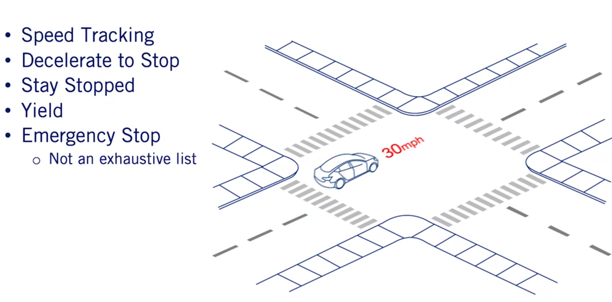
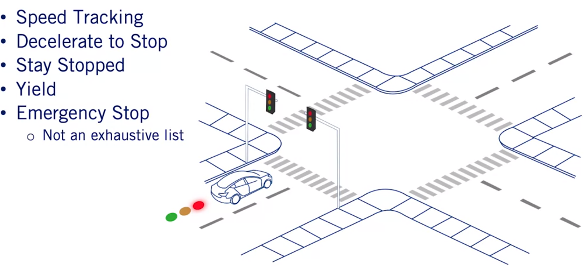

# Course-4 - W1 - MODULE 0: Motion Planning for Self-Driving Cars

## Overview

- This module introduces the motion planning course, as well as some supplementary materials.

**Learning Objectives**

- Understand the motion planning problem and how it applies to autonomous driving
- Review the main project offered in this course

## Course Introduction

### Welcome to the Self-Driving Cars Specialization!

- Ok

### Welcome to the Course

- In this course, we're going to focus on `motion planning problems`, as well as some of the techniques we can use to solve them. 
- ```At a very high level, the motion planning problem is the task of generating the path and velocities required to get the autonomous car from point A to point B.```
- To do this, we will require : 
  - **the perception**
  - **sensing information of the cars** 
- As motion planning requires having knowledge of the surrounding cars, pedestrians, and other obstacles in the environment. 
- Because of the complexity of the problem, it is common to decompose the planning problem into smaller sub-problems. 
- In this course, we will focus on 3 stage hierarchy of mission planning, which involves  : 
  - `map level navigation` which you are likely familiar with from planning trips with online mapping tools, 
  - `behavior planning` which ensures our driving behavior follows the rules of the road, 
  - `local planning` which ensures our paths are smooth and collision-free. 

- **MODULE 1 :** Once we've introduced the `motion planning` problem as well as our planning hierarchy, we will focus on methods to solve each of the planning sub-problems throughout the rest of the course. 
- **MODULE 2 :** we will discuss `mapping in the context of autonomous driving`, as well as how we represent static obstacles that our planner must avoid during the planning process. 
- Both of these maps are necessary components for generating a safe trajectory for our autonomous vehicle. 
- **MODELE 3:** Next, we will focus on `mission planning` , which is the highest level part of our planning problem. 
- We will use the maps generated in module two, to navigate as efficiently as possible to our destination. 
- **MODULE 4:** we will focus on how the autonomous vehicle interacts with other moving agents in the driving scene, which is a complex task that is essential to ensuring safety during the planning process. 
- **MODULE 5:** we will focus on the sub-problem of `behavioral planning`, which is the task of determining which behaviors the autonomous vehicle should exhibit, depending on the vehicles surrounding environment. 
- **MODULE 6:** From here, we will move to `local planning`. Where we introduce a reactive planner to generate trajectories for a bicycle model, which we introduced in course one. 
- **MODUEL 7:** we conclude by creating a decoupled path planner and velocity profile generator that builds upon our reactive planner. It can generate paths and velocity profiles, that can be used by an autonomous vehicle for on-road driving. 
- Throughout this course, we will be giving you assignments that will test your ability to implement the sub-components of our hierarchical motion planner. 
- This will give you the hands-on experience required to develop a fully integrated motion planning system in the final course project. Where you will develop a **full motion planning system** in the Carla simulator. 

### Meet the Instructor, Steven Waslander

- Ok 
  
### Meet the Instructor, Jonathan Kelly

- Ok 
  
### Course Readings

- S. M. LaValle. Planning Algorithms. Cambridge University Press, Cambridge, U.K., 2006. Available at http://planning.cs.uiuc.edu/.
- [Rapidly exploring Random Topics - S. M. LaValle - YT](https://www.youtube.com/watch?v=OjNFjruZgaw)

- S. Thrun, W. Burgard, and D. Fox, Probabilistic robotics. Cambridge, MA: MIT Press, 2010.

- N. J. Nilsson, “Artificial intelligence: A modern approach,” Artificial Intelligence, vol. 82, no. 1-2, pp. 369–380, 1996. 

### How to Use Discussion Forums

- Ok 

### Get to Know Your Classmates

- Ok 
  
### How to Use Supplementary Readings in This Course

- Ok 
  
# Module 1: The Planning Problem

## Overview

- This module introduces the richness and challenges of the self-driving motion planning problem, demonstrating a working example that will be built toward throughout this course. 
- The focus will be on defining the primary scenarios encountered in driving, types of loss functions and constraints that affect planning, as well as a common decomposition of the planning problem into behaviour and trajectory planning subproblems. 
- This module introduces a generic, hierarchical motion planning optimization formulation that is further expanded and implemented throughout the subsequent modules.

**Learning Objectives**

- Explain what the autonomous driving high-level mission entails.
- Recall the set of important basic driving scenarios.
- Develop a set of driving behaviours to handle most basic driving scenarios
- Recognize important constraints for autonomous driving motion planning.
- Explain the functionality of each step in a hierarchical motion planner.
- List some variants of each step of a hierarchical motion planner.

## The Planning Problem

- In this module, you will learn about `the motion planning` problem in autonomous driving.
- `The motion planning problem` is the task of navigating the ego vehicle to its destination in a safe and comfortable manner while following the rules of the road. 
- As discussed in the first course of this specialization, this task can be decomposed into a hierarchy of optimization problems. Each of which will have different constraints and objectives. 
- By the end of this module, you should have an understanding of the types of subproblems that need to be solved when performing motion planning for autonomous driving. In this video, we will discuss the autonomous driving mission. 


### Lesson 1: Driving Missions, Scenarios, and Behaviour

**The Autonomous Driving Mission** 

- `At a high level, the autonomous driving mission is to get from point A to point B`. 


- The autonomous driving mission views this from a navigation perspective, where we need to navigate from one point on a map or current position, to another point corresponding to our final destination. 
- In doing so, it should take the connection of different streets and their associated traffic into consideration. 
- In order to find the most efficient path in the road network in terms of travel time or distance. 
- Planning for an autonomous driving mission abstracts many of the important lower-level variables away from the problem in order to simplify the mission planning process. 
- However,these lower level variables such as roads structures, obstacles, and other agents on the road, are crucial to the autonomous driving motion planning problem. 
- These lower level variables defined different driving scenarios. We have discussed some of the driving scenarios already in Course 1. So this will serve as a refresher and will help put these scenarios into emotion planning context. 

**Road Structure Scenarios**

Some common scenarios related to the road structure : 
- By road structure, we mean the lane boundaries and the regulatory elements that are relevant to the driver. 
   


- The simplest scenario when driving is simply driving in a lane and this is often called `lane maintenance`. 
- In the nominal case, this is when the car follows the central line of it's current lane. 
- In this scenario, our goal is to minimize our deviation from the center line of the path as well as reaching our reference speed which is often the speed limit to ensure efficient travel to our destination. 

A more complex scenario would be when the car has to perform a lane change maneuver. 


- Even when there are no dynamic obstacles present in either lane, we will need to optimize the shape of the lane change trajectory within the constraints of lateral and longitudinal acceleration. 
- The speed limit of the road, and the time horizon for execution of the maneuver. 
- Clearly, all of these parameters will affect the shape of the trajectory, resulting in either slow passive lane changes, or more aggressive less comfortable lane changes. 

The third common scenario, is when the car needs to perform a left or right turn. This is often required when the autonomous car has **to handle intersections**. 


- As with the lane change, the shape and aggressiveness of the turn will vary depending on the situation. 
- In addition, the feasibility of actions and autonomous vehicle can take is affected by the state of the surrounding environment. 
- For example, the autonomous vehicle cannot perform a left turn at a red light even if the intersection is clear. 

As a final example, we have a U-turn. Which is important for navigating certain scenarios where the car needs to change direction efficiently. 


- As with a lane change and both the right turn and left turns, that you U-turn will have parameters that affect the shape of the trajectory. 
- The U-turn is also highly dependent on the state of the surrounding environment, as it is not always legal to perform a U-turn at an intersection depending on your home countries laws.

**Obstacle Scenarios**

- Now, road structure is not the only factor in on-road scenarios.
- Static and dynamic obstacles will dramatically change both the structure of the scenario as well as the difficulty in determining the required behavior for a scenario. 


- **Dynamic Obstacles:** are defined as `moving agents` in the planning workspace of the ego vehicle. 
- **Static Obstacles :** or obstacles that are not moving such as parked cars, medians, and curves.
- Static obstacles restrict which locations the autonomous car can occupy as it plans paths to its destination. 
- This is because the car occupies space as it travels along its path. If this overlaps with an obstacle, our plan will obviously results in a collision. 
- On the other hand, dynamic obstacles have a larger impact on our velocity profile and driving behavior. 
- A common example in driving is when there is a lead vehicle in front of our car while we are performing lane maintenance. 
- Clearly, this vehicle will have an impact on our decision-making. 
- Let's say this car is going 10 kilometers per hour slower than our reference speed. If we maintain our current reference speed, we will eventually hit the leading vehicle. 
- Ideally, we would like to maintain a time gap between ourselves and the lead vehicle which is defined as the amount of time until we reach the lead vehicles current position while maintaining our current speed. 
- So now we have two competing interests :  
  - We want to stay as close to **our reference speed** as possible, while **maintaining a time gap** between our car and the lead vehicle for safety. 

Dynamic obstacles will also affect our turn and lane change scenarios. Depending on their location and speed, there may only be certain time windows of opportunity for the ego vehicle to execute each of these maneuvers. 


- These windows will be estimates as they will be based on predictions of all other agents in the environment. 
- An example of this, is when we are waiting for an intersection to be clear before performing a left turn.
- The behaviors that are autonomous vehicle decides to execute will depend heavily on the behavior of oncoming traffic. 
- If there are nearby oncoming vehicles that are moving quickly towards us, then the only safe behavior would be to yield to them. 
- However, if there is a longer distance between the autonomous vehicles and oncoming traffic, the autonomous vehicle will have a window of opportunity to perform its turn. 


Now, not all dynamic obstacles are cars as there are other types such as cyclists, trucks, and pedestrians. 


- Each of them will have their own behaviors and have their own rules to follow on the road. 
- As you've seen throughout this specialization even though we've only defined the most likely core components of the driving task, there's clearly a rich and diverse set of potential scenarios that need to be handled. 

**Behaviours**

Despite this complexity, the majority of behaviors for these scenarios can be thought of as a simple composition of high-level actions or maneuvers.
- An example set of these **high-level maneuvers** would be  : 
  - speed tracking
  - deceleration to stop
  - staying stopped
  - yielding
  - emergency stopping.

Let's dig into what each of these high-level actions really mean. 

- Speed tracking is the nominal driving behavior. 



- We have a reference speed or speed limit and we maintain that speed while moving forward in our lane.

Decelerating to stop is pretty self-explanatory. 

- If we have a stop sign ahead, we need to smoothly slow down to a stop to maintain comfort.
  


- Staying stopped is required for certain regulatory elements.
- If we were at a red light, then we need to remain stopped until the light turns green. 


Yielding is also required for some regulatory elements.


- Most notably, if we're at a yield sign and there's traffic that has higher precedence than us, we need to slow down and wait until it is clear for us to proceed. 

Finally, emergency stops occur when an issue is detected by the autonomous car and the vehicle needs to stop immediately and pull over. 


- These high-level behaviors can also be augmented by navigational behaviors, such as performing lane changes and turns. 

- By bringing all of this together, we can now cover the most basic driving scenarios. 
- While this set of maneuvers has good coverage, it is important to note that this list of behaviors is in no way exhaustive and that there are many ways to increase behavioral complexity to handle evermore interesting scenarios. 

**Challenges**

- In terms of the set of driving scenarios, we've really only begun to scratch the surface. 
- There are many unusual instances that make the autonomous driving problem and extremely challenging task. 
- For example, suppose that you have a jaywalking pedestrian, we would then have an agent violating their rules of the road which makes their behavior unpredictable from a motion planning perspective. 


- Another example, is when a motorcyclist performs lane splitting, which may or may not be legal depending on your home country. 


- This behavior can be confusing for an autonomous car, which often uses the lane boundaries to inform the predictions of other agents on the road. 

**Hierarchical Planning Introduction**

As you can see, solving the motion planning problem is a complex task. 


- To solve for the optimal motion plan without any forms of selective abstraction and simplification, would simply be intractable. 
- To remedy this, we instead break the task up into a hierarchy of optimization problems. 
- By doing this, we can tailor the inputs and outputs of each optimization problem to the correct level of abstraction which will allow us to perform motion planning in real-time. 
- In this hierarchy, higher in the hierarchy means that the optimization problem is at a higher level of abstraction. 
- At the top of this hierarchy is mission planning, which focuses on solving the autonomous driving mission of navigating to our destination at the map level which we discussed earlier. 
- Next, we have the behavior planning problem. Which decides which behaviors the autonomous vehicles should take depending on its current driving scenario. 
- Based on that maneuver, we then use the local planner to calculate a collision-free path and velocity profile to the required goal state. 
- In our case, we will decouple this process into **path planning** and **velocity profile generation** to improve performance. 
- Finally, our computed motion plan will be given to the controllers to track which we've designed in the first course. 
- Each of these optimization problems will have different objectives and constraints used to solve it. Which we will be discussing in the coming lessons. 

**Summary**

- We've identified the autonomous driving motion planning mission as the problem of navigating from the ego vehicles current position to a required destination. 
- We've also looked at some common on-road driving scenarios and how the road structure as well as the obstacles present dictate the nature of the scenario. 
- We then discussed some useful driving behaviors to navigate the scenarios we've identified. 
- Finally, we've described a hierarchy of motion planning optimization problems. Which we will discuss in detail throughout the remainder of this course. 
- Hopefully this lesson has given you some insight into the different scenarios that you as an autonomy engineer will encounter when designing a motion planner for an autonomous vehicle. 
- The key takeaway here is that while we've enumerated many of the basic scenarios and behaviors required for autonomous driving, there are still many open questions about how to plan safe and robust behaviors across all potential driving scenarios. 


### Lesson 2: Motion Planning Constraints
### Lesson 3: Objective Functions for Autonomous Driving
### Lesson 4: Hierarchical Motion Planning
### Module 1 Supplementary Reading
### Graded

# References

# Appendices
