# Course-4 - W2 - MODULE 2: Mapping for Planning

## Overview

- The occupancy grid is a discretization of space into fixed-sized cells, each of which contains a probability that it is occupied. 
- It is a basic data structure used throughout robotics and an alternative to storing full point clouds. 
- This module introduces the occupancy grid and reviews the space and computation requirements of the data structure. 
- In many cases, a 2D occupancy grid is sufficient; learners will examine ways to efficiently compress and filter 3D LIDAR scans to form 2D maps.

**Learning Objectives**

- Create an occupancy grid map to identify static obstacles in the environment.
- Apply the log odds update to efficiently update occupancy beliefs.
- Apply filtering and compression to map 3D lidar scans to 2D occupancy grids.
- Understand the impact of dynamic obstacles on occupancy grids.

### Lesson 1: Occupancy Grids

**Learning Objectives**

- In this module, we will discuss the creation of two environmental maps :  
  - the occupancy grid map 
  - the high-definition road map.
- Both of the maps we will discuss play a critical role in the task of motion planning, as we will see throughout this course.
- We will start by defining the occupancy grid map in detail, and understand how it can be created on an autonomous vehicle.
- We will then try to understand the noise inherent in measurement data used for the creation of an occupancy grid map.
- Finally, you will see how to handle this noise in the measurement data, by learning about Bayesian updates of occupancy grid beliefs.

**Occupancy grid**

An `occupancy grid` is a discretized grid which surrounds the current ego vehicle position.

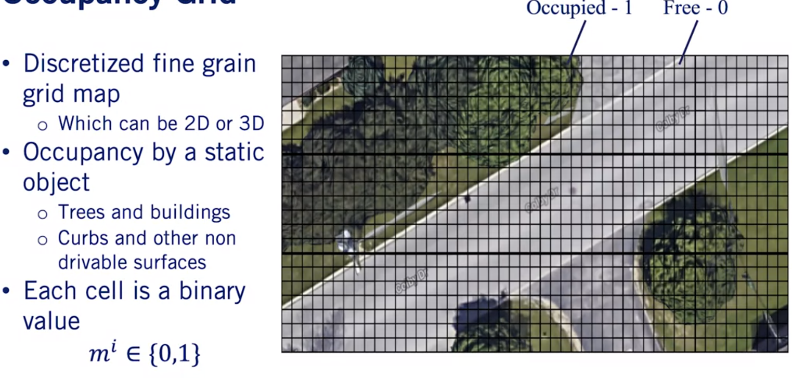

- This discretization can be done in two or three dimensions. The methods we discussed can be applied to both 2D and 3D problems.
- However, to simplify both the explanations as well as the computational requirements in this module, we will only be *focusing on the 2D version*.
- Each grid square of the occupancy grid indicates if a static or stationary object is present in that grid location. If so, that grid location is classified as `occupied`.

An example of static objects that would be classified as occupying a grid cell can include *trees, buildings, road signs, and light poles*.
- In the domain of autonomous vehicles, other objects which you might not think of as obstacles, should also be classified as occupying space, including all non drivable surfaces such as *lawns or sidewalks*.
- Each square of the occupancy grid noted by m_i, maps to a binary value in which one indicates that the square is occupied by a static object, and zero indicates that it is not.
- In the above map, we can see that the squares with trees and grass cover are labeled as $1$, whereas the road is labeled $0$ .

The resulting map looks like this : 

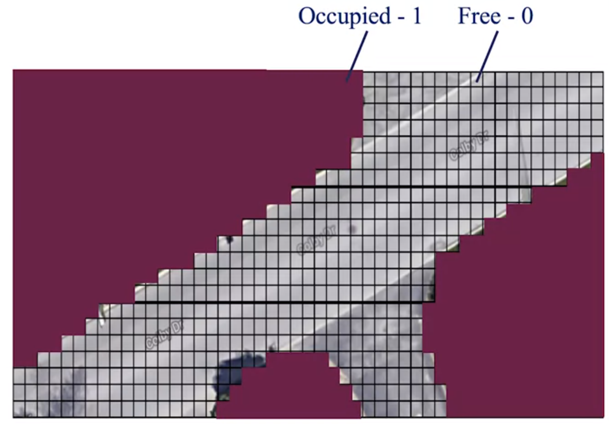

- All the occupied squares of the grid are purple, and the rest of the map corresponding to the drivable surfaces is left transparent.

**Assumption of Occupancy Grid**

We will now look at the set of assumptions that are made in order to create an accurate occupancy grid.

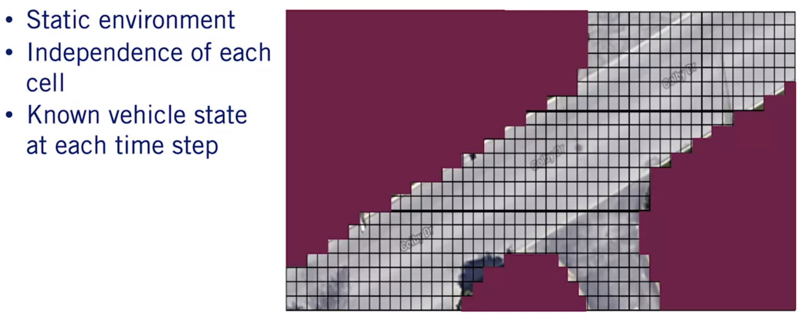

- First, the environment that is currently measured to create this occupancy grid only corresponds with static objects.
- Meaning, all dynamic objects or moving objects must be removed from the sensor data before it is used for occupancy grid mapping.
- Second, each grid cell is independent of all others. This assumption is made to simplify the update functions needed to create the occupancy grid.
- Finally, the current vehicle state is exactly known in relation to the occupancy map at every time step.

- In the domain of self-driving cars to observe distance between the car and the current state of the world, `the LIDAR sensor` is used most frequently.

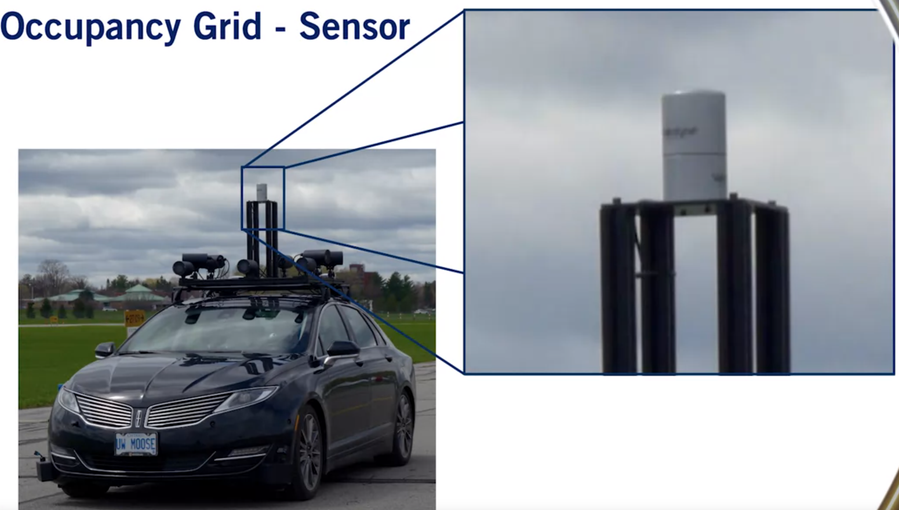

`As a quick reminder`: the LIDAR sensor uses pulses of light to measure the distance to all objects surrounding the car, and returns a point cloud of measurements throughout its field of view. 

**LIDAR Data Filtering**

- In this video, we can see the output of the LIDAR sensor.

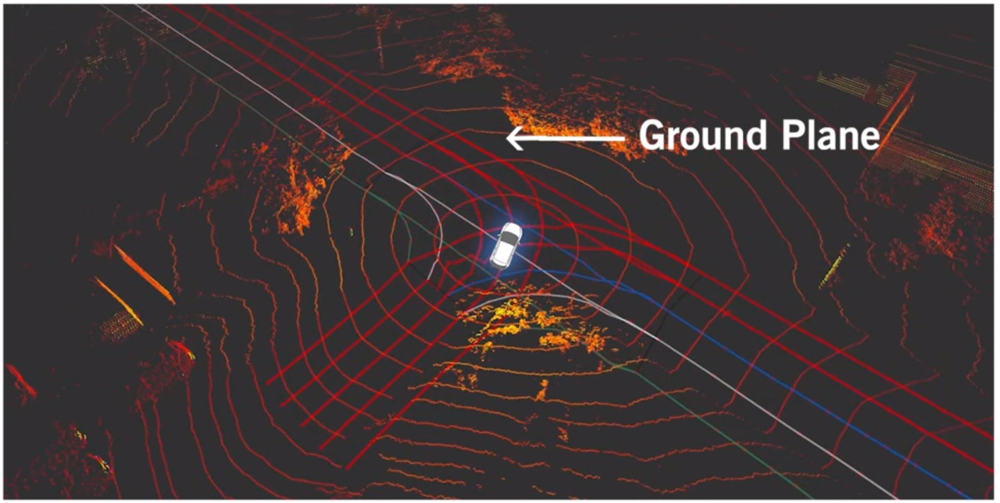

- Several components of the LIDAR data need to be filtered out before this data can be used to construct an occupancy grid.
- The first step is to filter all LIDAR points which comprise the ground plane.
- In this case, `the ground plane` is the road surface which the autonomous car can safely drive on.
- Next, all points which appear above the highest point of the vehicle are also filtered out.

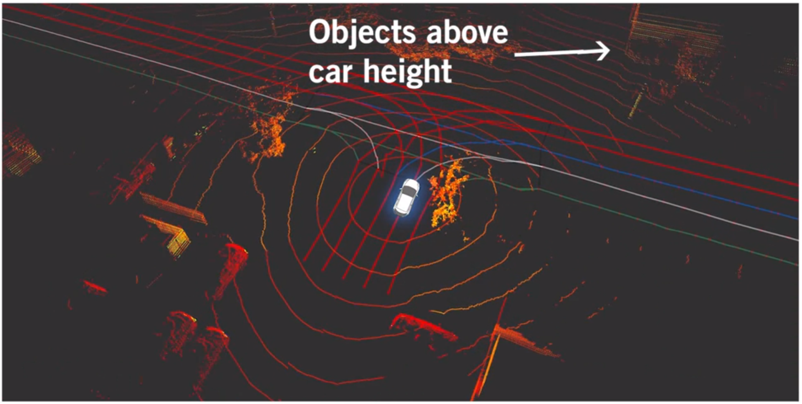

- This set of LIDAR points can be ignored as they will not impede the progression of the autonomous vehicle.

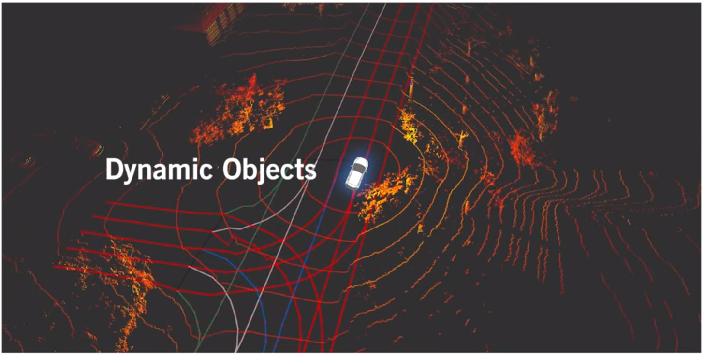

- Finally, all non-static objects which had been captured by the LIDAR need to be removed.

- This includes all vehicles, pedestrians, bicycles, and animals.
- Once all filtering of the LIDAR data is complete, the 3D LIDAR data will need to be projected down to a 2D plane to be used to construct our occupancy grid.

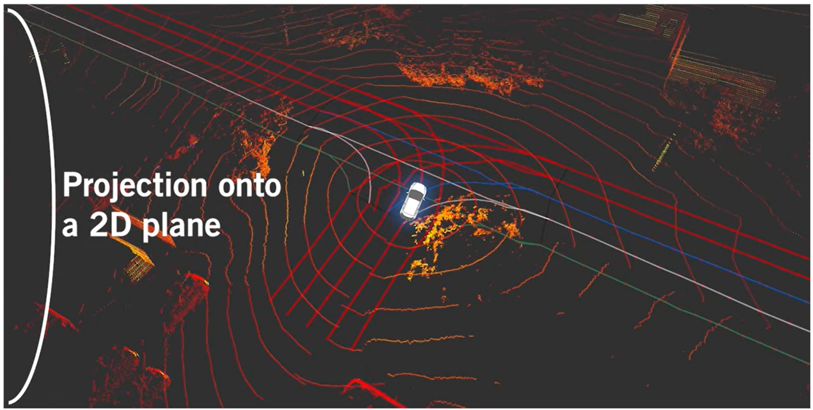

- The filtering and compression of the LIDAR data to create accurate occupancy grids for autonomous cars, will be covered in a later video in this module.

**Range Sensor**

The LIDAR data which is now filtered and compressed, resembles data from a high definition 2D range sensor, which accurately measures distance to all static objects around the vehicle in the plane.

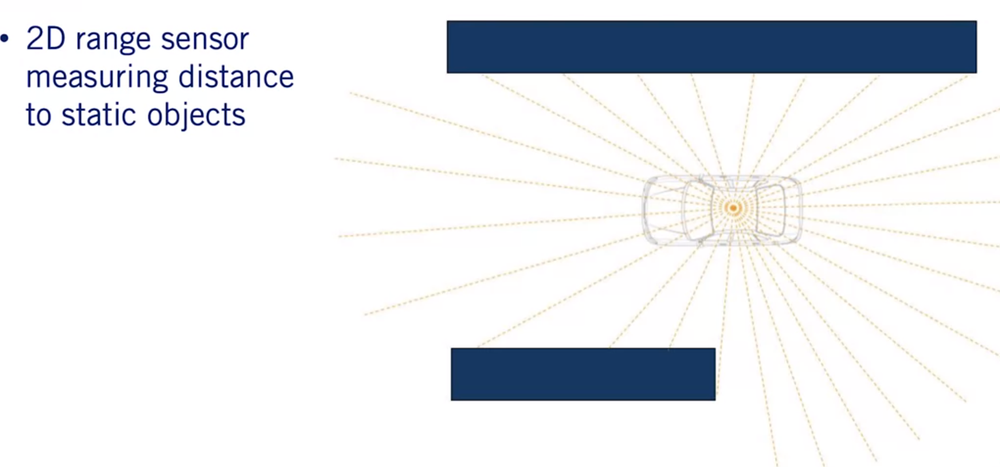

- However, there is still a problem. After all the filtering has been completed, there are still major map uncertainties due to the filtering methods used on the data, the complexity of the data at hand, and most of all, environmental and sensor noise.

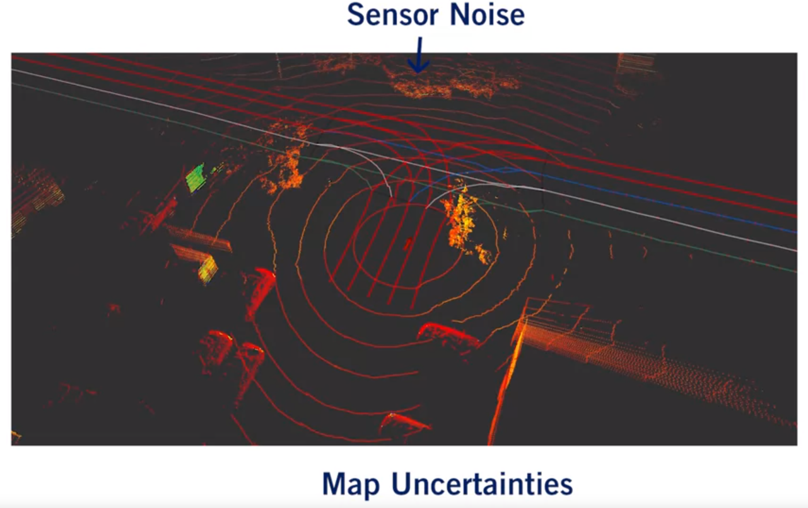

**Probabilistic Occcupancy Grid**

In order to handle this noise, the occupancy grid will be modified to be probabilistic.
  
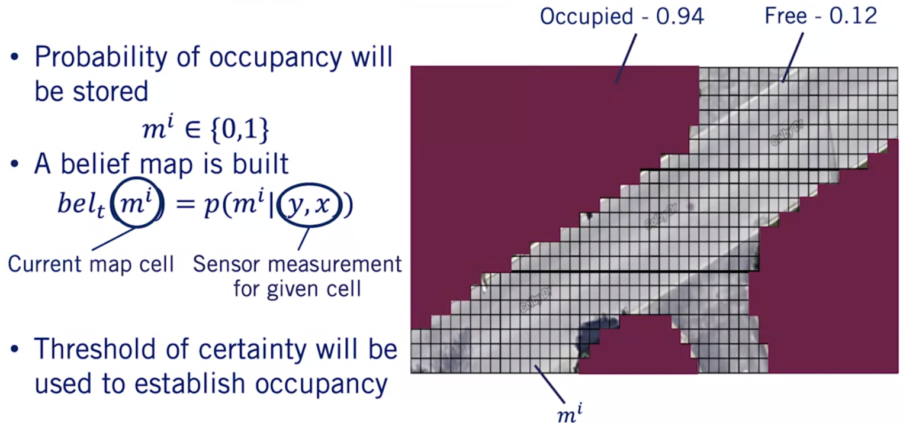

- Instead of cell i storing a binary value for occupied, now each cell i will store a probability between zero and one, corresponding to the certainty that the given square is occupied.
- The higher the value stored, the higher the probability that the given square is occupied.
- To use this set of probabilities, the occupancy grid can now be represented as a belief map denoted by the term $bel_{t}$ .
- To keep notations simple, m_i represents a single square of the occupancy grid, where $i$ can be constructed from measurements $Y$, and the vehicle location $X$ .
- The belief over m_i is equal to the probability that the current cell m_i is occupied given the sensor measurements gathered for that cell location.
- To convert back to a binary map, a threshold value can be established at which a given belief is confident enough to be classified as occupied.
- Any value below the set threshold will be set to free.

As an example, the occupied square in the figure to the left has a probability of 0.94, which classifies the square is occupied.
  
- On the other hand, the square found on the street only has a probability of 0.12 of being occupied, and thus will be classified as a free location.

**Bayesian Update of the Occupancy Grid**

- Multiple sets of measurements can be combined from time one to time t to achieve far more accurate belief of occupancy.

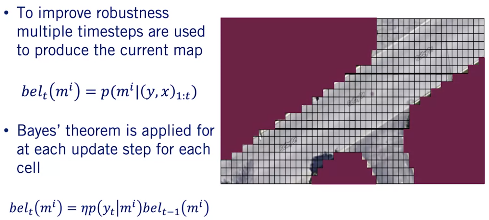

- In fact, we can update beliefs in a recursive manner so that at each time step t, we use all prior information from time one onwards to define our belief.
- The belief at time t over the map cell m_i is defined as the probability that m_i is occupied given all measurements and the vehicle position from time one to t.
- To combine multiple measurements into a single belief map, Bayes theorem can be applied.
- In the case of the occupancy grid, we get a Bayesian update step that takes the following form.
- The distribution p of y_t given m_i, is the probability of getting a particular measurement given a cell m_i is occupied.
- This is known as the measurement model, which you studied in detail in course two.
- The belief at time $t-1$ over m_i corresponds to the prior belief stored in our occupancy grid from the previous time step.
- We rely on `the Markov assumption`, that all necessary information for estimating cell occupancy is captured in the belief map at each time step.
- So no earlier history needs to be considered in the cell update equations.
- Finally, eta in this case corresponds to a normalizing constant applied to the belief map.
- This is needed to scale the results to make sure it remains a probability distribution.

**Occupancy Grid in Action**

Lets see an occupancy grid in action.

- In this video, we will follow the autonomous vehicle as it drives out of the driveway and down a road, while the occupancy grid is updating in real time.

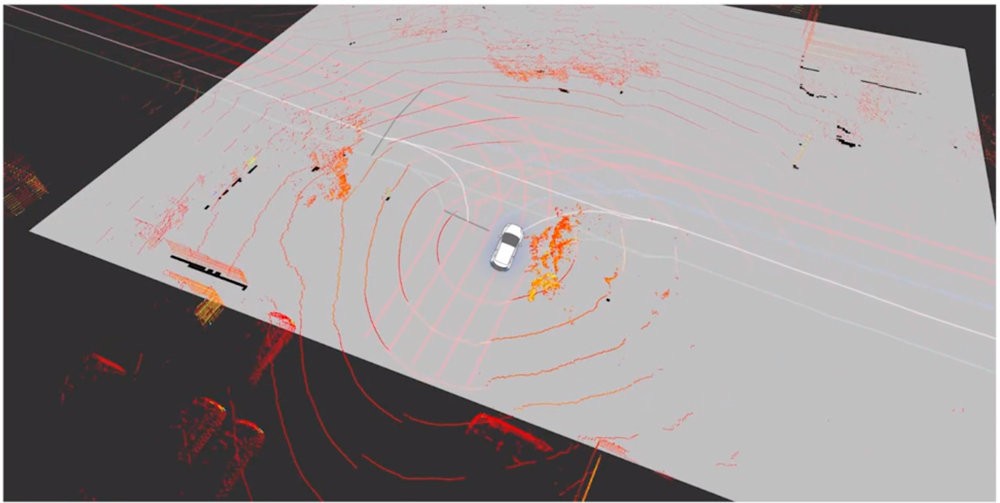

- The lighter grid cells represent free squares, whereas the black grid cells represent occupied squares.
- We can also see the raw LIDAR data in red, and the filtered outputs in orange.
- Notice how the map tracks the vehicle motion which is estimated using the same techniques as we've presented in [course 2](https://github.com/afondiel/Self-Driving-Cars-Specialization-Coursera/blob/main/Course2-State-Estimation-and-Localization-for-Self-Driving-Cars/course2-w1-notes.md).

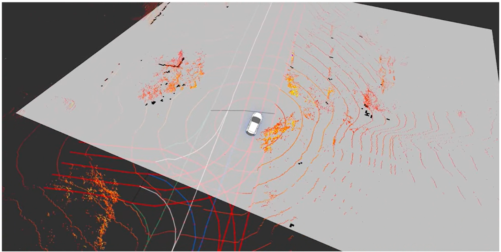
  
- In this video, the threshold of belief needed for an object to be classified as obstructing is set to very high, thus only large static objects are getting identified as occupied.
- Lowering this threshold value will result in more cells to be tagged as occupied, but will lead to noisier maps as well.

**Summary**

- you learned the basic definition of the Occupancy grid map, and saw how the LIDAR sensor data can be filtered and compressed to create an occupancy grid.
- You then learned how to represent the occupancy grid as a belief map, and applied Bayesian updates to incorporate new measurements in the occupancy grid.
- In the next video, we will discuss some of the numerical problems with our belief space map representation, and introduce the logit function as a solution to this problem.
- We will also look at an inverse measurement model which is needed to create the occupancy map grid from 2D LIDAR data using the logit function.

### Lesson 2: Populating Occupancy Grids from LIDAR Scan Data (Part 1)

- In this video, we will identify the issues with the Bayesian Probability Update step which we saw in the previous lesson.
- We will then present a solution to the issues highlighted using a log odds representation.
- Finally, in this video, we will see the derivation of the Bayesian log odds update step required to update the belief map.

**Bayesian Update of the Occupancy Grid - Summary**

As we have seen in the previous video, we can apply Bayes' theorem to combine the previous belief map with the current measurement information to create a highly accurate occupancy grid at each time step.

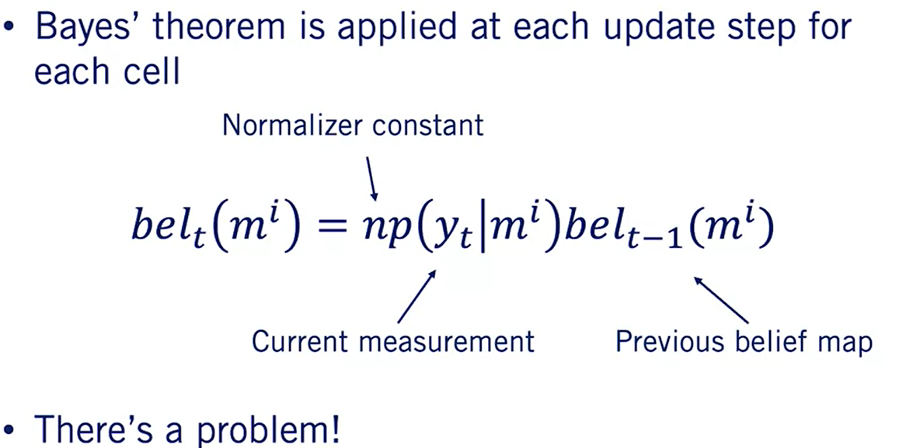

- This is achieved by the following function in which n represents a normalizing constant, p of yt given mi is the current measurement received, and the belief at time t minus 1 over mi is the previous belief map.
- There is, however, a problem with using this simple Bayesian update.
- To demonstrate the issue, we will look at an example of an update to an unoccupied cell of the occupancy grid with a new unoccupied measurement.

**Issue With Standard Bayesian Update**

Let's suppose we have a cell which previously had a low belief of occupation, 6.38*10 - 4, and the new measurement results in low probability as well, 1.2*10 - 5.
- This means that the resulting belief would be very low, or 8.0 * 10 - 7. As you can see, all of these beliefs are quite close to zero.

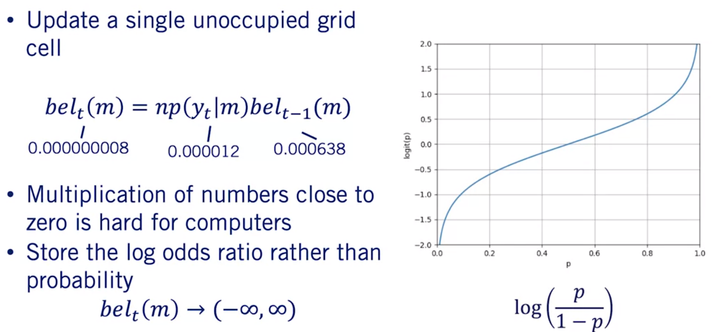

- Multiplication of floating-point numbers on a computer, however, can lead to significant rounding error when multiplying small numbers, which in turn can lead to instability in the estimate of the probabilities.
- Further, the multiplication of probabilities turns out to be an inefficient way to perform the belief update.
- So our basic application of Bayes' rules to update beliefs over the occupancy cells is `not looking good`.
- There is, however, a solution. Instead of storing the belief map with the values ranging from 0-1, we can convert our beliefs into log odds probabilities using the logit function. We first saw this logit function in course 3.
- This leads to cell values ranging from negative infinity to positive infinity avoiding the issue with numbers close to zero.
- The logit function takes the natural logarithm of the ratio of the probability p and 1-p. So it takes probability values from 0-1 and maps them to the entire real axis.

**Conversion**

It is also possible to transition from the log odds domain back to probabilities.

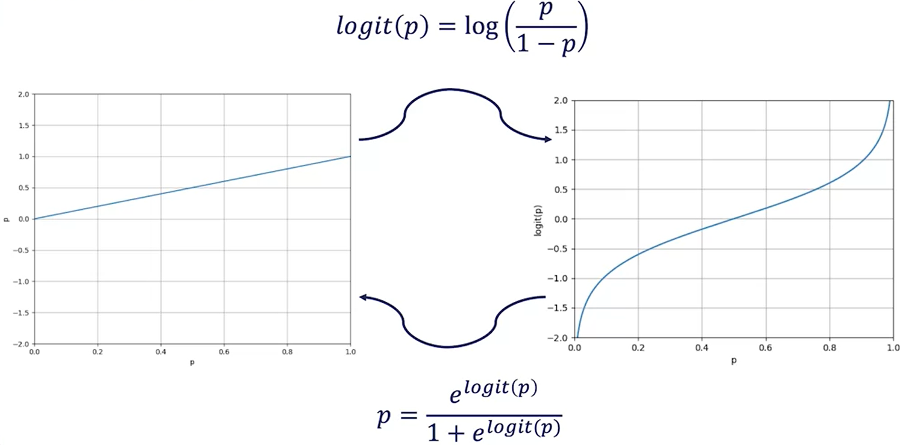

- This is done by taking the ratio of e raised to the logit of p divided by 1 plus e to the logit of p.
- We now have an alternative representation for our cell probabilities.

**Bayesian Log Odds Single Cell Update Derivation**

So let's see how this affects our Bayesian update equation.

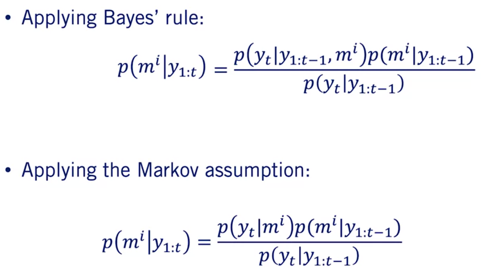

- We will start this derivation by the application of Bayes' rule to p of mi given y1 to t, where mi is the current occupancy grid map square at location i and y1 to t are the sensor measurements of that cell from time one to time t.
- Writing out the full Bayesian update for incorporating the latest measurements into our occupancy belief, we get the following equation.
- The first term in the numerator is the probability of getting measurement yt given the cell state at all previous measurements.
- The second term in the numerator is the probability a cell is occupied given all measurements to time t - 1, and the nominator is the probability of getting the measurements yt given all previous measurements up to time t - 1.
- It should be noted that the measurement yt is separated from the rest of the measurements of y1 to t - 1.
- This is done as we would like to update the occupancy grid with only the most recent sensor measurement rather than storing all measurements and applying them again every time.
- Next, we will apply `the Markov assumption` which ensures the current measurement is independent of previous measurements if the map state mi is known.

The next step is to expand the measurement model p of y given mi by the application of Bayes' rule once again.

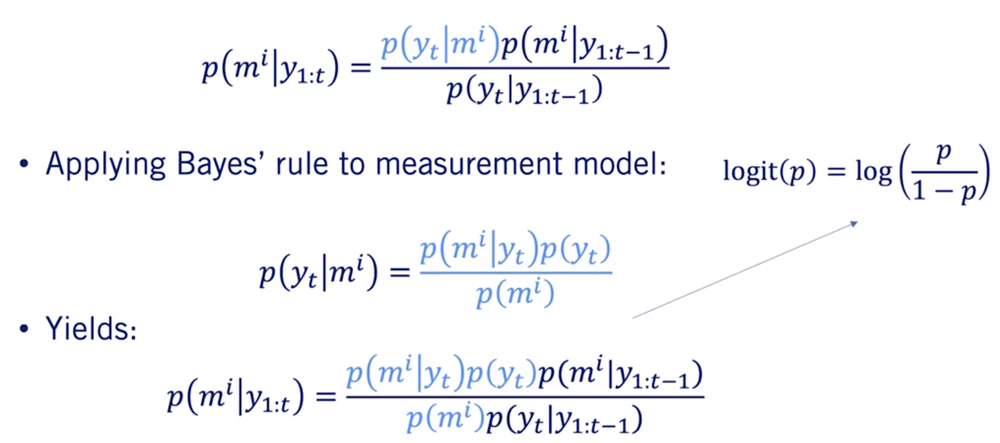

- This results in the probability of map cell mi being the current measurement multiplied by the probability of getting that measurement divided by the probability of grid cell mi is occupied.
- We now substitute the expanded measurement model in blue into the main Bayesian inference equation shown here.
- This leaves us with three terms in the numerator and two terms in the denominator.
- We will now pass this expanded form through the logit function and then start simplifying the resulting expression.
- Let's rearrange the term 1 minus p before we write out the resulting expression.
- The denominator portion of the log odds ratio 1 minus pmi given y1 to t can be constructed by negating the expression for the probability of a cell being occupied, which is of course, the probability that a grid cell is not occupied.
- Next, we form the log odds ratio which is simply the log of the ratio of the probability a cell is occupied to the probability it is not.

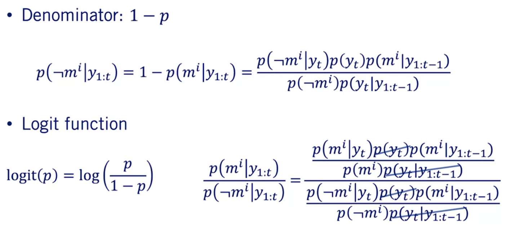

- There are many like terms in this expression which we can now cancel out as follows.
- We arrive at the following simplified expression for the odds ratio with only three terms each in the numerator and denominator.
- We rewrite the expression in the original 1 minus p notation.

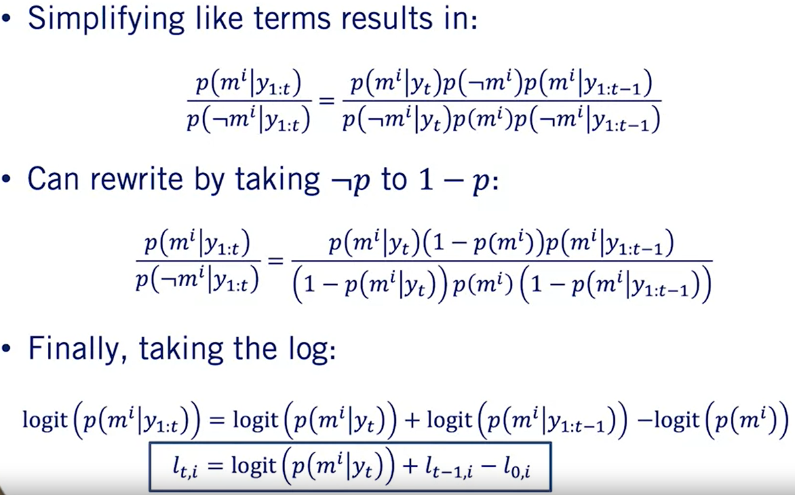

- As you may have noticed, this equation is better viewed as three ratios.
- The ratio of the probabilities to 1 minus the same probability.
- The first ratio is the probability of a cell being occupied given a measurement y.
- The second is the probability a cell is not occupied, and the third is the prior belief that a cell is occupied given all measurements up to time t minus 1.
- Finally, we apply the log to our series of probability ratios to arrive at the addition of three logit functions.
- This is our final update equation and has the nice property of simply requiring addition when a new measurement is required.
- The three terms can be written in a convenient shorthand where lt minus 1i is the logit of the belief that cell $i$ is occupied at time $t-1$. Similarly, l0i at time zero and lti at time t. 

**Bayesian log odds Update**

We now arrive at the convenient log odds update rule for Bayesian inference on occupancy grid maps.
- It is made up of the three terms that are combined at each time step based on the latest measurement data.

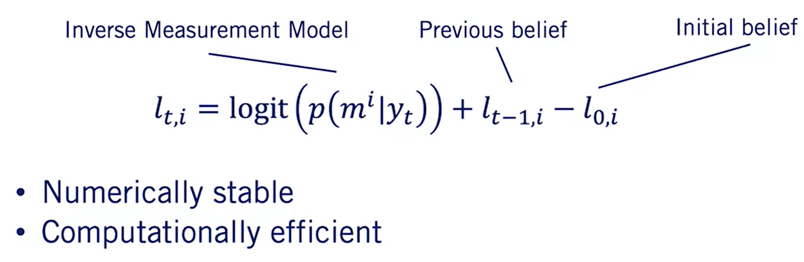

- The first term the logit of the probability of mi given yt is the logit formed using new measurement information.
- The probability distribution p of mi given yt is known as the inverse measurement model. We'll study how to do this in the next lesson for LIDAR data.
- Lt minus 1i is the previous belief at time t minus 1 for cell i, and l0i is the initial belief at time zero for the same cell.
- The initial belief represents the baseline belief that a grid cell is occupied, which is usually set to 50 percent uniformly as we don't expect to have prior information that improves on this value.
- It shows up in this equation at every time step, which is a bit surprising but is simply a result of the derivation that we studied in this video and adjusts the addition of the first two terms to ensure the updated belief is consistent with the log odds form.
- The Bayesian log odds has two strong advantages over directly updating probabilities.
- The update is numerically stable due to the logit mapping of 01 probabilities to the entire real axis, and computationally, it is also significantly more efficient as it relies exclusively on addition to complete all updates of the occupancy grid.

**Summary**

- We first identified some issues with storing and updating the occupancy grid with a straightforward Bayesian probability update.
- We then saw how this issue could be solved by employing the log odds representation of the probability space.
- Finally, we saw how the Bayesian log odds update is derived from Bayes' rule.

### Lesson 2: Populating Occupancy Grids from LIDAR Scan Data (Part 2)

- In this video, we will define the concept of an inverse measurement model and see how to build a simple inverse measurement model for a lidar sensor.
- We will also describe ray tracing which will significantly reduce computational requirements for the inverse measurement model.
  
**Inverse Measurement Module**

- Recall from the previous video that in order to perform the Bayesian update of our occupancy grid, we need to be able to evaluate the log-odds update rule.

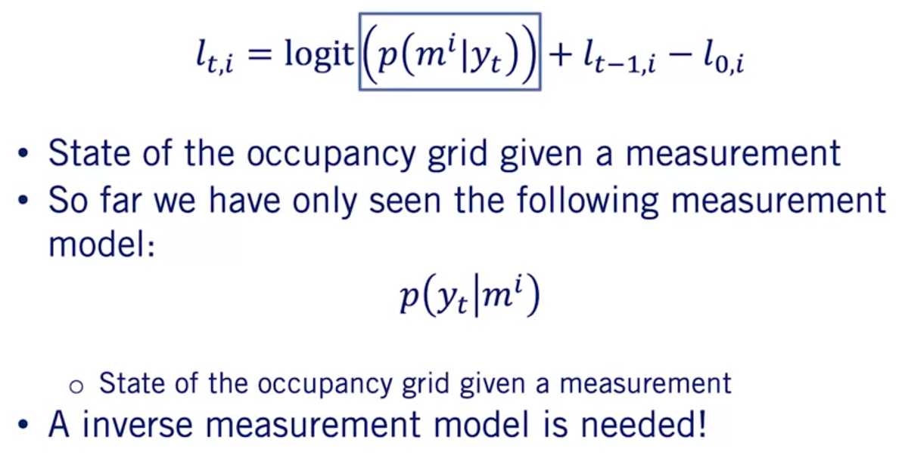

- To do this we need to compute p of mi given yt which represents the probability of a cell mi in the occupancy grid being occupied, given a certain measurement yt is obtained by the lidar.
- However, so far the measurement models we have seen have taken the form the probability of yt given mi, which is in the mapping case represents the probability of getting a certain lidar measurement, given a cell in the occupancy grid is occupied.
- So for occupancy grid updates, we need to flip this measurement model around.
- That is, we have to construct an inverse measurement model that constructs p of mi given yt for every new measurement received.

**Inverse Measurement Module - To be improved**

As mentioned in the first lesson of this module, for simplicity sake, we will only look at the lidar data as a 2D range data containing two sets of information.

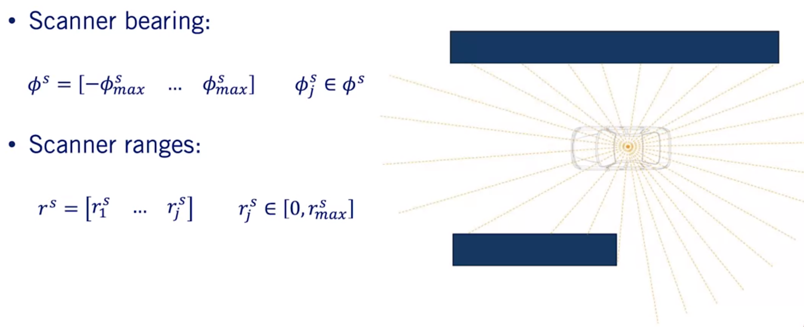

- The bearing at which each beam was fired and the range that the beam traveled.
- This is easily extended to 3D with the addition of an elevation angle.
- The bearing of each beam is represented by a set of angles Phi evenly spaced within a range defined by the minimum and maximum viewing angles of the sensor.
- Typical rotating lidar are able to capture data in all directions around the vehicle, we'll assume the available bearings in this course will cover all 360 degrees.
- The range of each beam corresponds to the distance it has traveled before impacting an object represented by r1 to rJ.
- The range is measured between minimum and maximum ranges r min and r max, and we'll assume r min is zero for simplicity.
- Most lidar today will also return a no echo signal, if a particular beam does not return an echo, indicating the absence of any object within range in that direction.
- As we proceed in this video, we will make an assumption here that the entire lidar scan measurements from a single rotation of the sensor is measured at the same instant in time.
- This is not an accurate model for a vehicle moving at speed with a rotating lidar head, as we must actually correct for the motion of the vehicle, the correction can be done using the state estimates you developed in course two, and interpolating the motion between these state estimates as needed.

**Inverse Measurement Module (cont'd)**

So the inverse measurement model will take the following form.

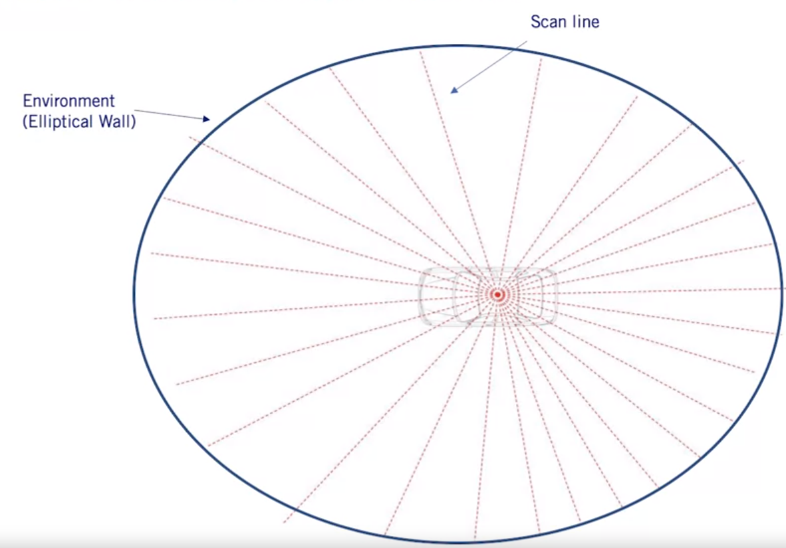

- Suppose this is the vehicle with a lidar sensor collecting range measurements at different bearings in the following environment.
- We construct a temporary occupancy grid that encompasses the maximum range of the beams in all directions.

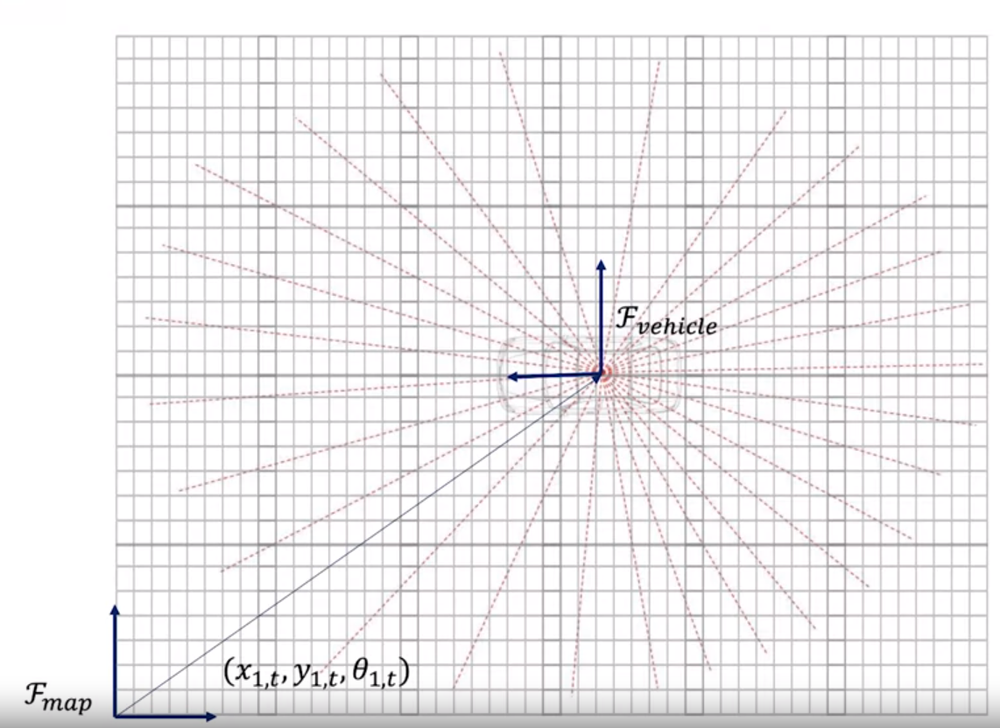

- The coordinate frame for this measurement grid uses the occupancy grid map frame and so we define a position x1 t and x2 t and an orientation x3 t of the sensor in the occupancy grid frame.
- In practice, this occupancy grid frame is set to the vehicle frame and the map is transformed at each step based on our state estimates.
- We're now ready to populate the temporary measurement grid with occupancy probabilities.
- Based on the current lidar data, we can define 3 distinct areas of the measurement grid.

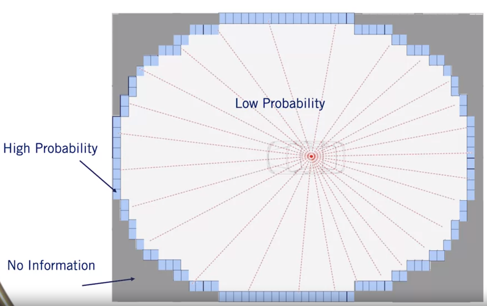

- First, there is an area of no information which none of the lidar beams had been able to reach.
- The current lidar scan provides no new information about the environment in this area.
- Then there is an area with low probability of an object, as all the beams have passed through this area without encountering anything.
- Finally, there is an area with high probability of an object, in which the lidar has come into contact with an object and has returned a non maximum range value.

**Inverse Measurement Module - To be fixed**

To translate these areas onto the measurement grid, each grid square will be assigned a range in bearing relative to the vehicles current location.

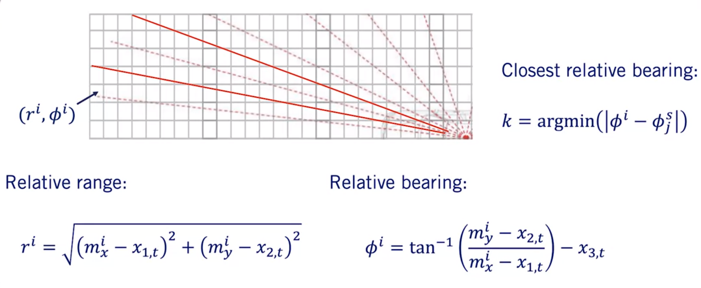

- The relative range of each cell is simply the Euclidean distance from the sensor to the cell, defined as follows, where ri is the range to grid cell i and mxi and myi are the x and y coordinates of the center of the grid cell.
- Finally, x1 t and x2 t are the sensor location at the current time t.
- The relative bearing to each cell is computed using the tan inverse function.
- Here Phi identifies the bearing to the given cell in reference to the sensor's coordinate frame.
- For each cell, we associate the most relevant lidar beam by finding the measurement with the minimum error between its beam angle and the cell bearing.

We then define two parameters Alpha and Beta, which define a sector around each beam in which cell occupancy should be determined based on the beam range.

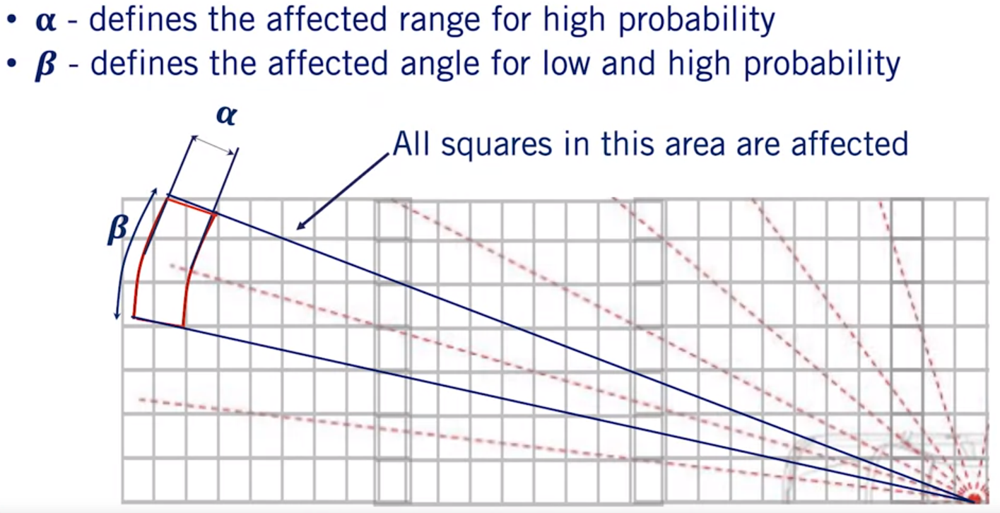

- This essentially creates a region around each beam which will get assigned the measurement information of that particular beam.
- $\alpha$ controls the range cells at the range of the beam which will be tagged as high probability.
- $\beta$ controls the angle of the beam for which cells will be marked as either low or high probability.

**Inverse Measurement Module - Algorithm**

- We are now ready to assign a probability that any cell is occupied given the lidar measurements received based on these 3 types of cells.

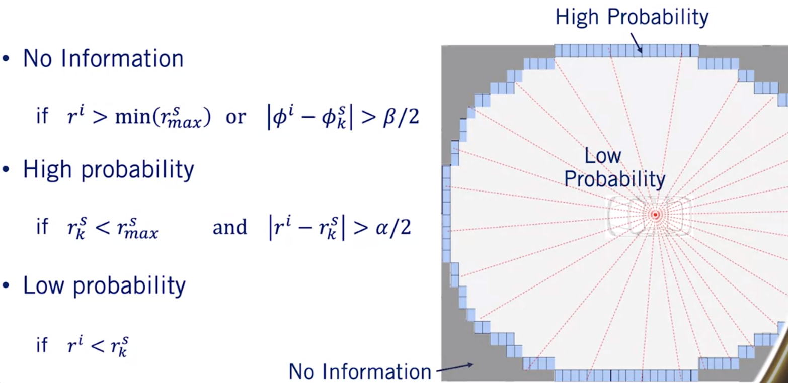

- The no information zone corresponds to all cells with a greater range, than the measured range or outside the angle Beta sized cone for the measurements associated with it.
- We assign a probability of an obstacle equal to the prior probability of a cell being occupied which is usually 0.5.
- The high information zone defines cells that fall within Alpha over two of the range measurement and within Beta over two of the angle of the measurement associated with it.
- We assign an occupied probability of greater than 0.5. to these cells.
- Finally, the low information zone is defined by cells that have a range less than the measured range minus Alpha over two and lie within the Beta sized cone about the measurement.
- We assign an occupied probability of less than 0.5 to these cells.

For example, let's say a lidar scan returns a range to an object at the location marked by a red X.

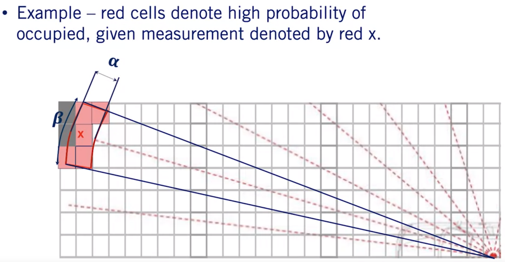

- The affected area which will be tagged as high probability is given in red.
- Increasing the value of Alpha will increase the range of the affected region and increasing the value of Beta affects the angle of the affected region.
- We can now construct the full inverse measurement model to be used in our log-odds update.

**Inverse Measurement Module - With Ray Tracing**

However, this simple inverse measurement model can be computationally expensive.

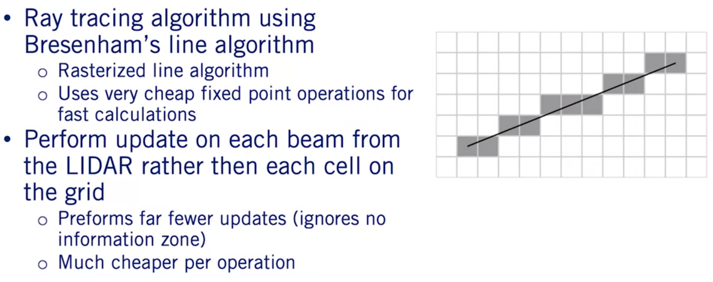

- It requires a full update of every cell in the measurement map, and relies on multiple floating-point operations to identify which measurements correspond to which cells.
- An alternative, is to use a ray tracing algorithm, such as the computer science classic, the Bresenham's line algorithm.
- `Bresenham's line algorithm` was originally designed in the early 1960's to efficiently solve the line plotting problem for displays and printing on the available hardware of the day.
- By ray tracing along the beams of the lidar scan, we reduce the number of cells that need to be processed and identify them more quickly relying on integer addition subtraction and bit shifting to move through the grid along the lidar beams.
- Interestingly, many beams go through the same cells near the car greatly increasing the confidence in measurements nearby.
- This concludes our discussion of the inverse measurement model for log odds occupancy grid mapping.

**Summary**

- In this video, we constructed a simple inverse measurement model for lidar data needed in the log-odds update step.
- We also briefly covered a potential improvement by using ray tracing to speed computations.

### Lesson 3: Occupancy Grid Updates for Self-Driving Cars

- Welcome to the third video in the Environmental Mapping Module.
- In this video, we will cover the autonomous vehicle-specific requirements to convert a Lidar scan into a filtered representation that can be used to create an occupancy grid.
- We will first look at several filtering methods which must be applied to the 3D Scan.
- Then we will see how a 3D Lidar scan is projected down to the 2D Space and converted into a belief map.
- Finally, we will discuss the tuning of several parameters required to make accurate occupancy grids.

**Filtering of 3D LIDAR**

Here we have a typical Lidar scan acquired by the autonomous vehicle as it drives along of local road.

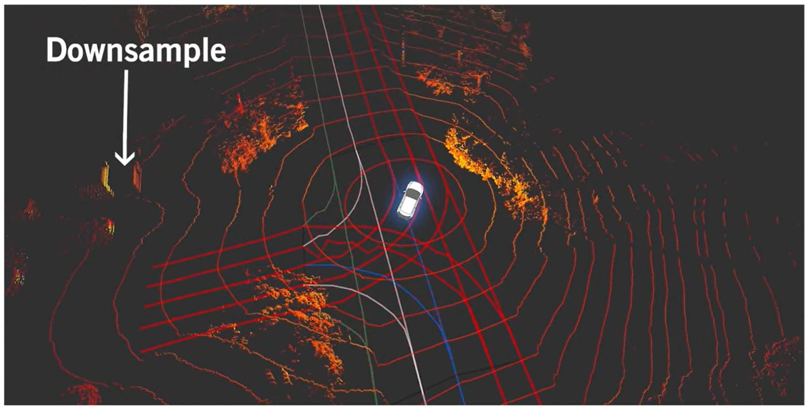

- We will highlight several filters that must be applied to the Lidar scan before it can be used to populate an occupancy grid.

- First, in order to make update operations run in real-time, it is usually desirable to downsample the number of points of a Lidar scan to a smaller amount.

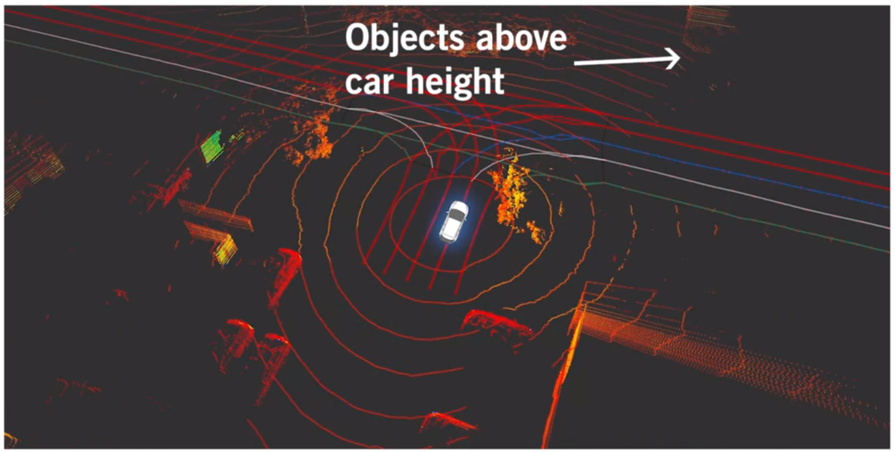

- Second, to remove objects that don't affect driving, we filter out all Lidar points which are above the autonomous car.

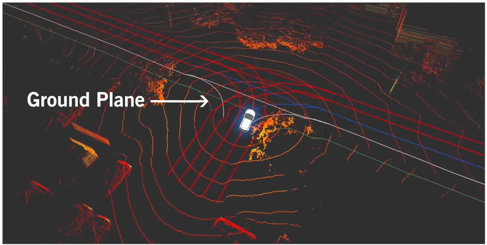

- Third, we do not want to label the drivable surfaces occupied.
- So we remove all Lidar points which have hit the drivable surface or ground plane.
- This drivable surface comes from the perception modules which you studied in course three.

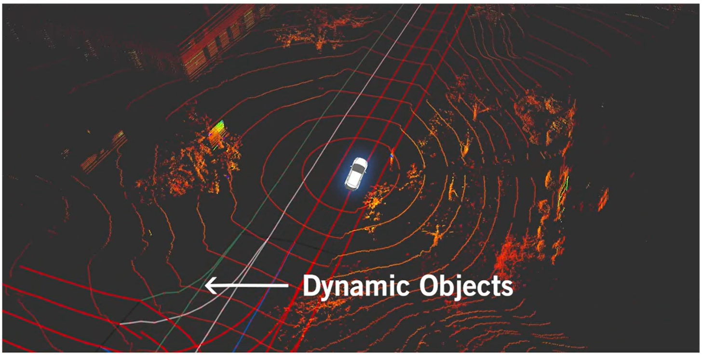

- Finally, we remove all dynamic or moving objects such as cars or pedestrians that are in motion, again relying on the Perception stack to identify their locations.

**Downsampling**

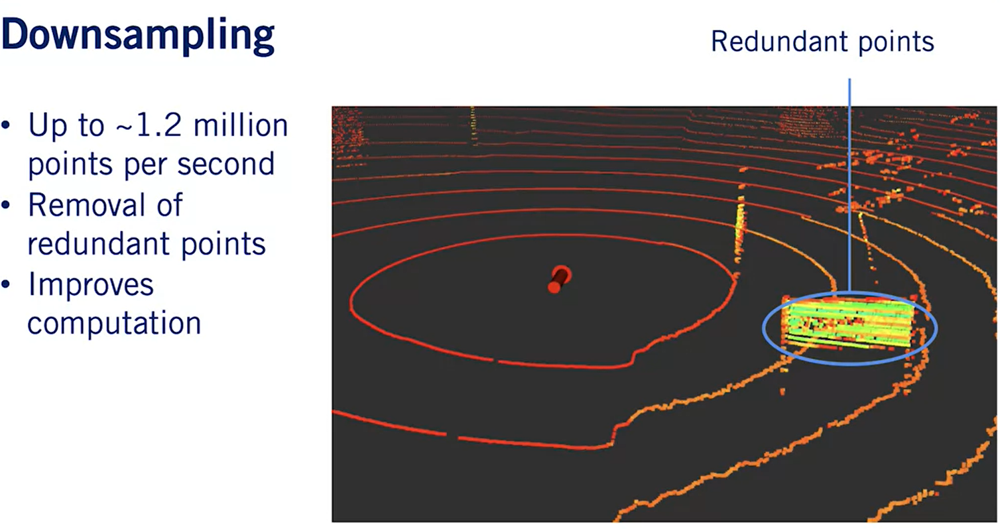

- `Downsampling` is the process of reducing the number of Lidar points to be considered by removing or ignoring redundant Lidar points.
- Common Lidar used in autonomous driving can produce up to 1.2 million points every second which provide very rich geometric descriptions of all the objects around the vehicle.
- Many of the generated points are actually redundant however due to the fact that there are many points that surround them capturing the same object information.
- In this example, we see a road sign that is densely covered in Lidar points where a small fraction of the points would suffice to indicate the location of the obstacle for Occupancy Grid Mapping.
- Most importantly, it is computationally impractical to deal with the 1.2 million points.
- The second, that some points must be removed to improve computations for all future operations.
- Downsampling can be performed in a variety of ways. The simplest of which is to use a systematic filter that keeps every nth point along the Lidar scan ring.
- It is also possible to apply *image downsampling techniques* in the range image and to search spatially in a 3D grid replacing collections of points with a single occupancy measurement.
- In each case, these methods are readily available in *open source Point Cloud Libraries such as PCL* or computer vision libraries such as *OpenCV*.

**Removal of Overhanging objects**

Our second filter is a trivial one which simply removes points above the vehicle height.

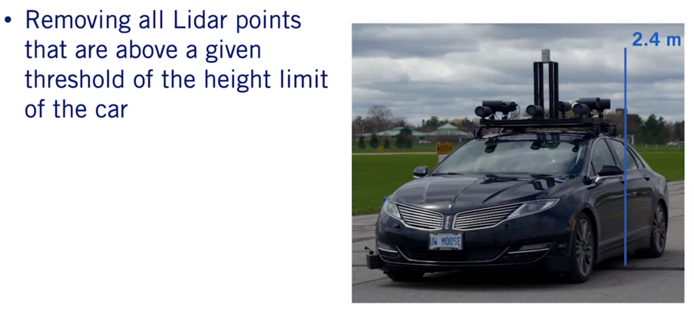

- In this case, above 2.4 meters. This filter usually presumes a flat ground plane however, and so you should be aware that this is a `dangerous` assumption to apply blindly.
- That value of eliminating overhanging trees, wires, bridges, and signs is significant however so it is worth including in this discussion.

**Removal of ground plane**

The next filter involves removing points that are deemed to fall on the drivable surface.

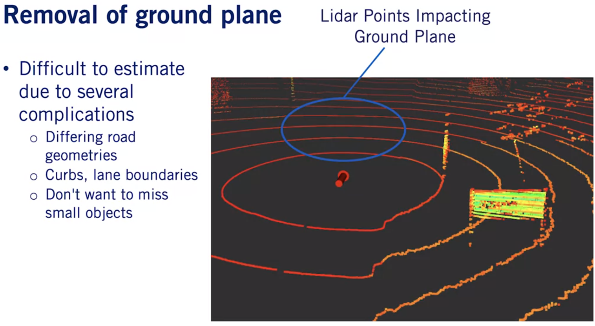

- Due to the nature of the Lidar scan, many of the concentric circles seen in this image are due to the Lidar scan hitting the drivable surface.
- These points should not be confused with occupied cells in the Occupancy Grid Map.
- However, this proves to be a challenging task as several complications arise.
- First off, all roads have different road geometries including variable concavity for drainage, different slopes and bank angles, curvatures, etc. 
- This change is also very difficult to predict. However, if the ground plane is not removed the occupancy grid might have artifacts which can result in deadlock in which the car cannot continue driving as it believes the roadway is `blocked`.
- The second problem is that curbs have different heights at different locations and road boundaries are not always clearly defined in Lidar data.
- These variations can lead to parts of the curbs or non-drivable areas being removed as parts of the ground plane.
- Finally, the need to detect small objects on the road such as a soccer ball or a turtle means that simple geometric methods working on point clouds have a hard time resolving the true state of the roadway ahead.

**Ground Plane Classification**

The best approach to dealing with this sort of issue is to take advantage of vision, and deep neural networks through semantic segmentation as you studied in course 3.
- This can be seen in the segmented image in which the ground plane is shown in dark purple.

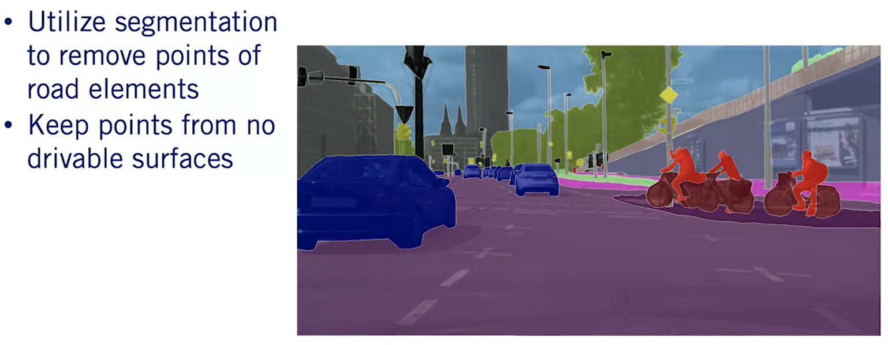

- The task then becomes a mapping of the drivable surface detected in the vision data to the Lidar Point Cloud masking out all those points that fall within the projected boundaries of the drivable surface.

**Removal of Dynamic Objects**

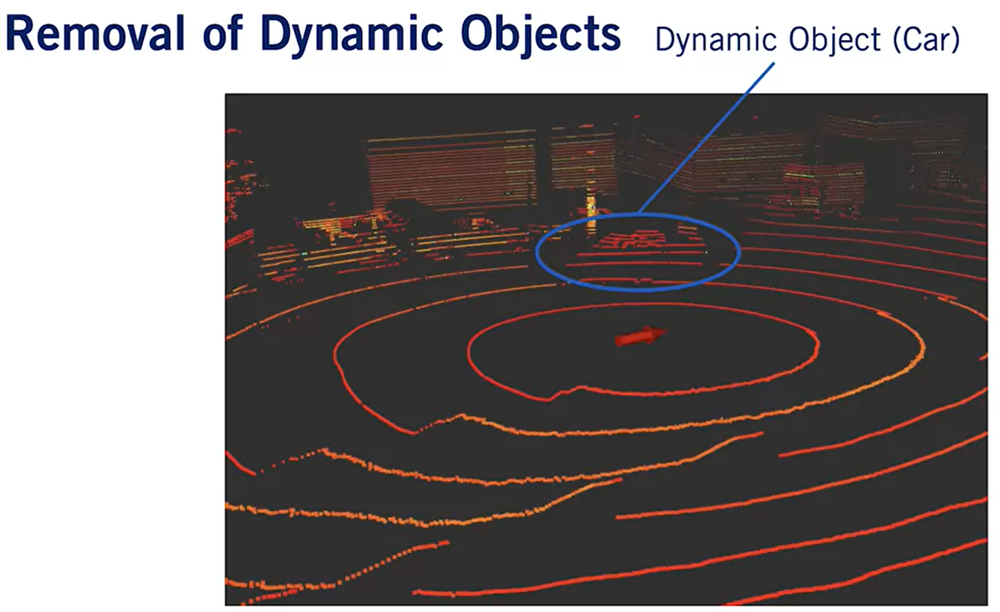

- The final filter that is required is the removal of all dynamic objects such as moving cars or pedestrians.

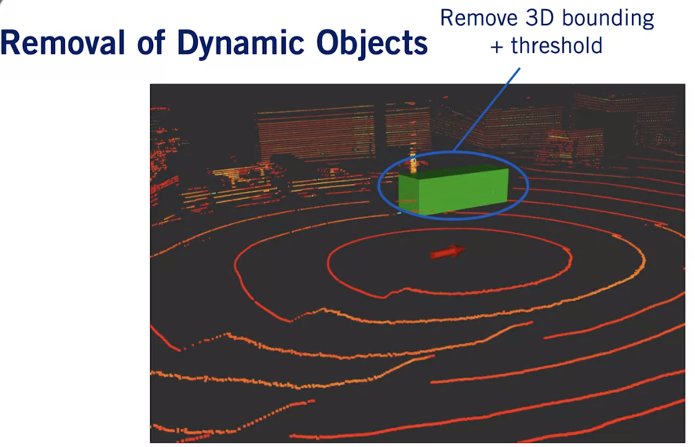

- This can be done once again with the reliance on the perception stack which must detect and track all dynamic objects in the scene.
- The 3D bounding box of the detected dynamic object is used to remove all the points in the affected area.
- A small threshold is also added to the size of the bounding box used to account for any small mistakes in the perception algorithm object location estimate increasing robustness of the point remove filter.

**Removal of Dynamic Objects - Improvement**

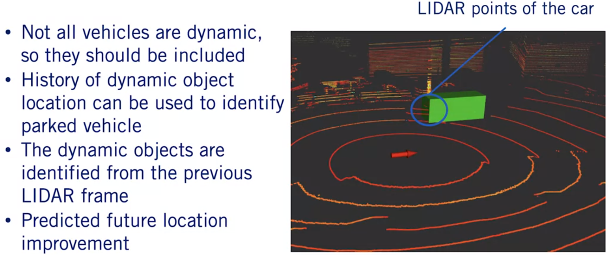

However, a lot of the time, this is unsatisfactory for two reasons.

- **First**, not all instances of dynamic object classes that are detected are actually moving.
  - Some vehicles may be parked at the side of the road and thus can be considered as part of the occupancy grid as they are indeed static.
  - To handle this issue, perception needs to use dynamic object tracks to identify those objects that are currently static so the occupancy mapper can avoid removing them.
- **Second**, due to the computing time required by the Perception Stack usually, the dynamic object is only detected after some delay.
  - This results in the update to the occupancy grid using out-of-date object positions which leads to the bounding boxes missing large portions of the Lidar points on a dynamic vehicle.
  - Instead, we can rely on predictions of the moving objects motion based on their object tracks.
  - The bounding box is shifted forward along the predicted path leading to a greater amount of the points of the dynamic object being removed from the most recent Lidar scan.
- After all this filtering, the Lidar data is finally ready to be projected from 3D down to 2D.

**Projection of LIDAR Onto a 2D Plane**

Let's now look at a simple yet effective technique for this final step.

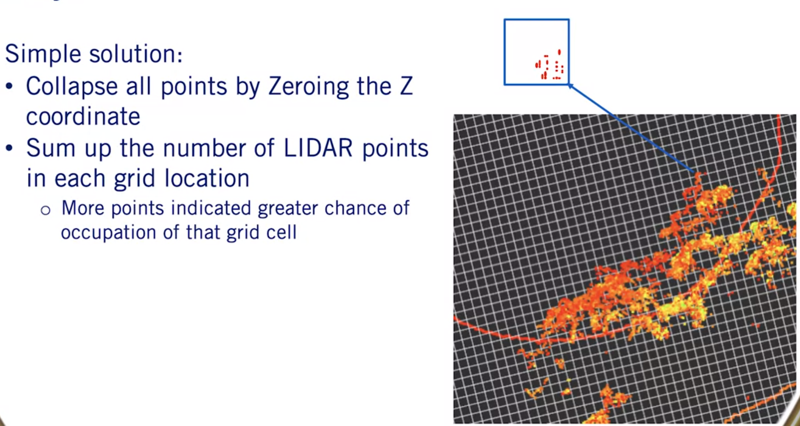

- First, the Z value which stores the height of the Lidar point is set to zero which collapses the Lidar grid to a plane.
- The 2D scan plane is divided into the same grid pattern as the occupancy grid.
- For each cell of the occupancy grid, all the Lidar points that fall within it are counted.
- This value will then be used as the measure of the occupancy belief.
- The more points in a cell, the greater the chance that there is a measurement of a static object in that cell of the occupancy grid.

**Summary**

- In this video, we saw the filtering techniques required to make a Lidar point clouds suitable for use as an occupancy grid.
- These include downsampling, removing Lidar points above the car, ground plane removal and finally, removal of dynamic objects.
- Then, we saw a simple yet effective method to transform 3D Lidar data down to 2D belief maps which as explained in lesson one can be used to create an occupancy grid.
- Finally, we saw all the different areas that an occupancy grid must be tuned in and adjusted carefully.

### Lesson 4: High Definition Road Maps

**Leaning Objectives**

- We will finish this week on mapping by looking at another essential map type, the High Definition Road Map.
- In this lesson, we will define a High-Definition Road Map.
- We will then see how this map can effectively be stored by looking at a datatype called the lanelet Map.
- We will then take a look at two main elements of the lanelet map; the lanelets and the intersection elements, and discuss how they are connected.
- Each of the elements will then be broken down into its components, so we can explore the full extent of this mapping data structure.
- Next, we look at the different operations that can be performed on lanelet elements.
- Finally, we will explore different methods of recording and creating lanelet maps.

**High Detailed Road Maps**

A High-Definition Road Map is similar to traditional paper-based maps or online maps.

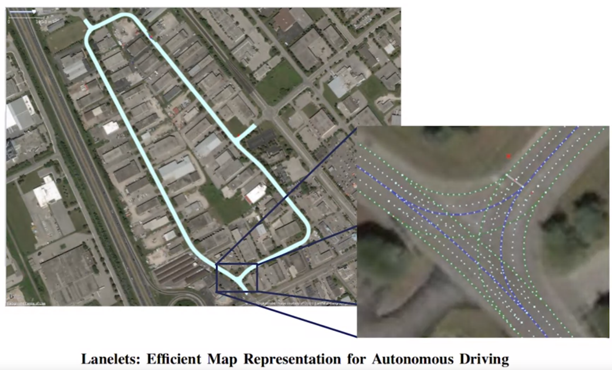

- However, the information contained within the High Definition map or HD map is significantly more detailed.
- While a traditional map stores the approximate locations of roads, the High Definition Road Maps stores the precise road locations including all lanes down to a few centimeters accuracy.
- Along with this, the High Definition Road Maps stores all of the locations of road signs and signals which might effect the autonomous vehicle.
- Due to the detailed and interconnected nature of the data, an effective method is required to store all information contained within the map.

**Lanelet Map**

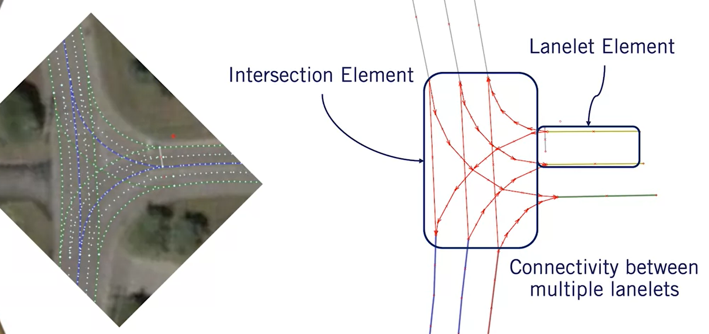

- The lanelet concept was proposed in a 2014 publication entitled, Lanelets: Efficient Map Representation for Autonomous Driving by Philip Bender, Julius Ziegler, and Christoph Stiller.
- Due to this method's effectiveness in storage and communication of the complex set of information needed for HD mapping, it is widely used.
- We'll look at this framework for the rest of the course, and they will play a key role in our behavior planning methods in particular.
- The lanelet map has two main components, which we will discuss in greater detail in this lesson.
- A lanelet element which stores all information connected to a small longitudinal segment of a lane on a road which it represents.
- An intersection element which stores all lanelet elements which are part of a single intersection for simple retrieval during motion planning tasks.
- This will be followed by an explanation of the connectivity between all the different lanelet elements.

**Lanelet Element**

A lanelet elements has several sets of information that stores about the segment of road that it represents.

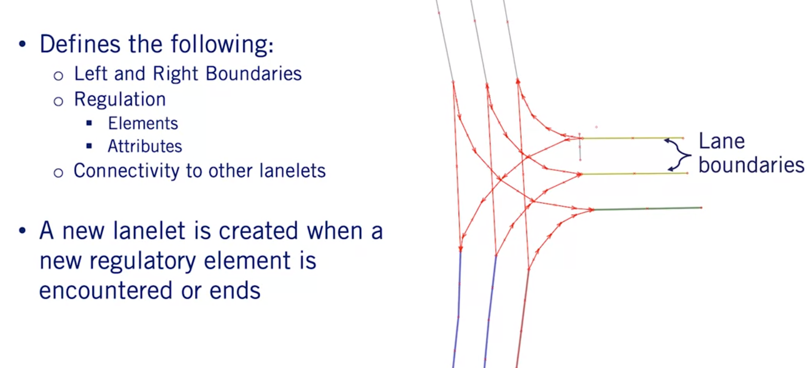

- First, a lanelet stores the left and right boundaries of the given lane.
- Second, a lanelet stores any regulatory elements that might be present at the end of the lanelet element, such as a stop sign line or a static sign line.
- Note that we only store a line for any regulatory element as this is the point that the autonomous vehicle treats as the active location for that regulatory element.
- Third, a lanelet stores all regulatory attributes that might affect that segment of the road, such as the speed limit.
- Fourth, a lanelet stores the connectivity of itself to other lanelet elements around it.
- This allows for easy traversal and calculations through the graph created by the set of lanelets in an HD map.
- Each lanelet ends as a regulatory element or a change to a regulatory attribute is encountered.
- This means that a lanelet element can be as short as only a few meters in the case of a lanelet, which is part of an intersection, or can be hundreds of meters long for a highway road segment.
- Boundaries of the lanelet are represented as the edges of the lanelet.
- These boundaries capture either marked lane boundaries or curves which inhibit driving.
- Lane boundaries are stored as a set of points creating a continuous polygonal line.
- Each point stores its x, y, and z GPS coordinates. The distance between points can be as fine as a few centimeters, or as course as a few meters depending on the smoothness of the polyline in question.
- Using this polygonal line structure, many useful operations can be performed to gather data for the task of motion planning.
- The ordering of the points defines the direction of travel and heading for the lanelet.
- The road curvature of any part of the lanelet can be precomputed from that lanelet as well.
- A center line between the two boundaries can be interpolated, which can be used as the desired path of travel for the autonomous vehicle in that lane.

- There are two types of lanelet regulations: 
  - **Regulation Elements**, which come at the end of the lanelet, 
  - **Regulation attributes**, which affect the entirety of the lanelet.

- Regulatory elements are represented as lines which are defined by a set of co-linear points.

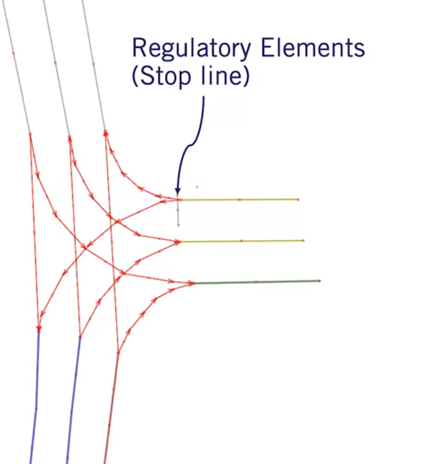

- Regulation elements usually require an action or decision to be made, such as in the case of a traffic light, or the decision to proceed must be based on the current state of that traffic light.
- Regulatory attributes persist for the entirety of the lanelet.

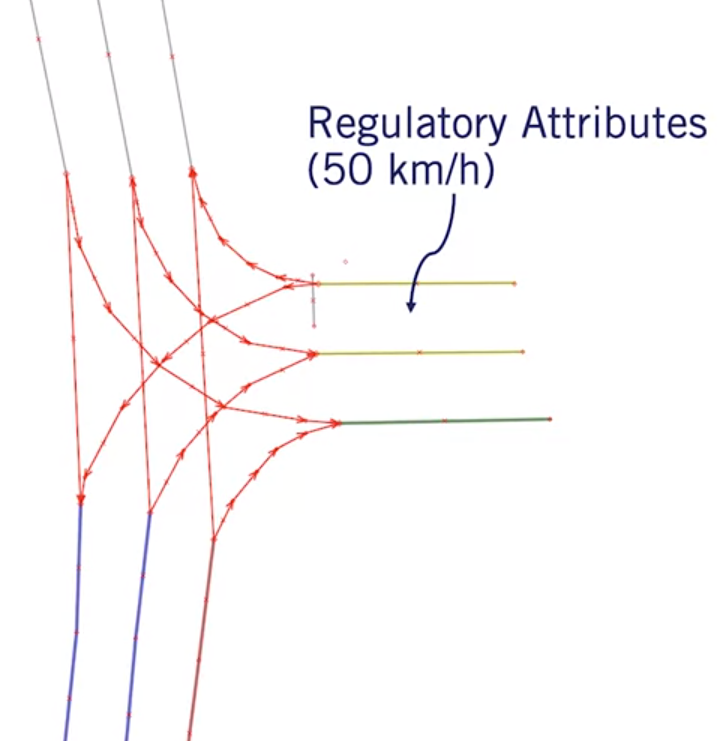

- Examples include speed limits, or whether this lanelet crosses another lanelet as in an intersection or merge.

- Each lanelet has four possible connections: Lanelets directly to the left, lanelets directly to the right, lanelet preceding it, and lanelet following it.

**Lanelet Boundaries**

- The entire lanelet structure is connected in a directed graph, which is the base structure of the HD map.

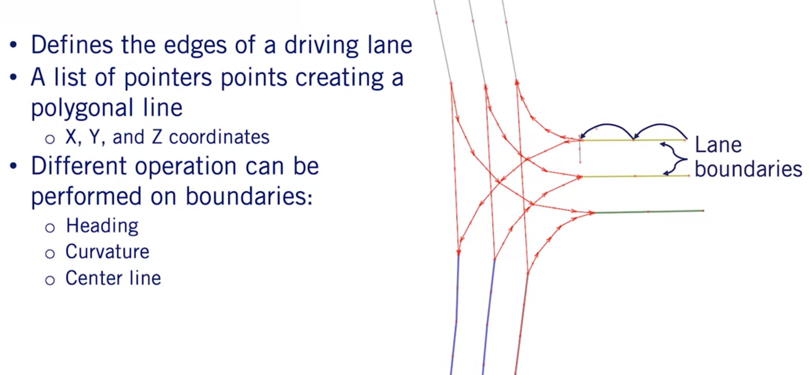

**Lanelet Regulations**

- It should be noted there could be more than one lanelet preceding the current lanelet, or more than one following lanelet as in the case of an intersection.

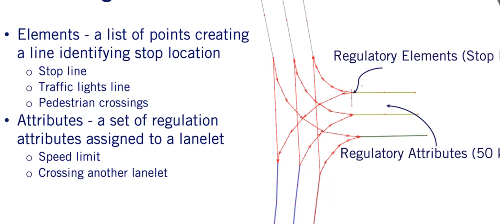

- To better understand this concept, let's take a look at a simple example using this particular set of lanelets for a 3-way intersection.

**Lanelet Connectivity**

- As you can see, some of the lanelets are numbered and represented as nodes on the graph, which therefore represent only a portion of the complete lanelet graph with this intersection.

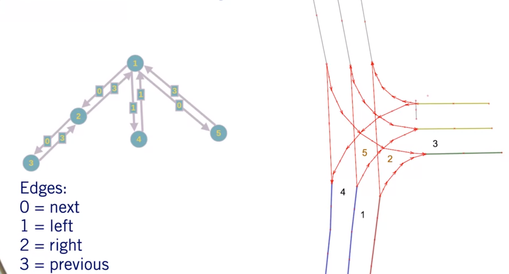

- The nodes or vertices are labeled one through 5 on the lane that figure, and form the vertices of the lanelet graph.
- All edges of this graph are directed and are labeled to denote the relationship between the two vertices the edge connects.
- An edge marked as zero represents the transition to the next lanelet.
- A one indicates a connection to the left lanelet.
- An edge labeled two represents a connection to the right lanelet, and a three represents previously lanelets.

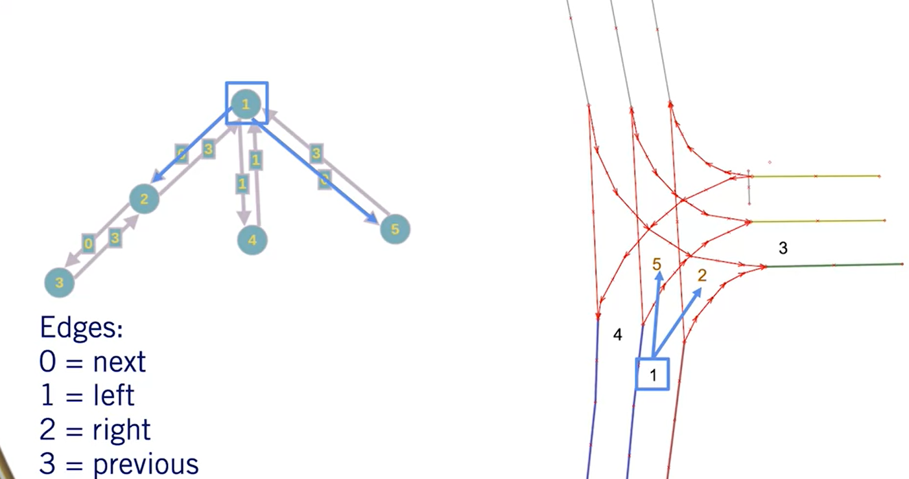

- The lanelet element, which is represented by the number 1 in this picture, has in fact two possible next elements.
- Lanelet element 5 and lanelet element two are two possible next lanelets that can be driven on after leaving lanelet 1, as they are two ways through this intersection.
- Similarly, lanelet element 4 is connected to lanelet 1 with a one edge, as lanelet 4 is to the left of lanelet 1.

**Intersections**

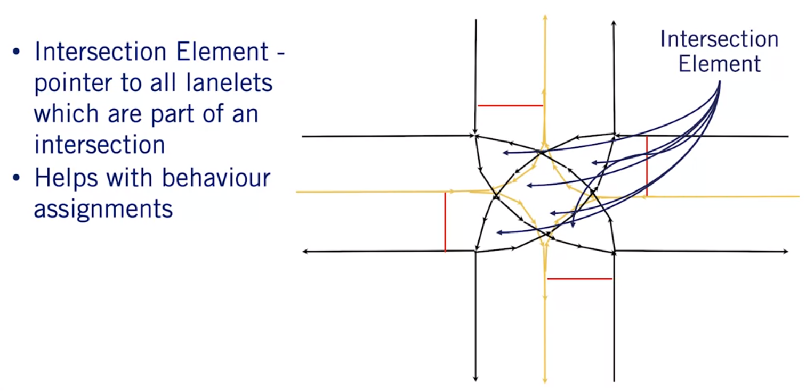

- The intersection elements simply holds a pointer to all regulatory elements, which make up the intersection of interest.
- All lanelet elements which are part of an intersection also point to this intersection element.
- This structure acts much like a container and simplifies look-ups throughout the lanelet structure when assigning behaviors.

**Operations Done On Lanelets**

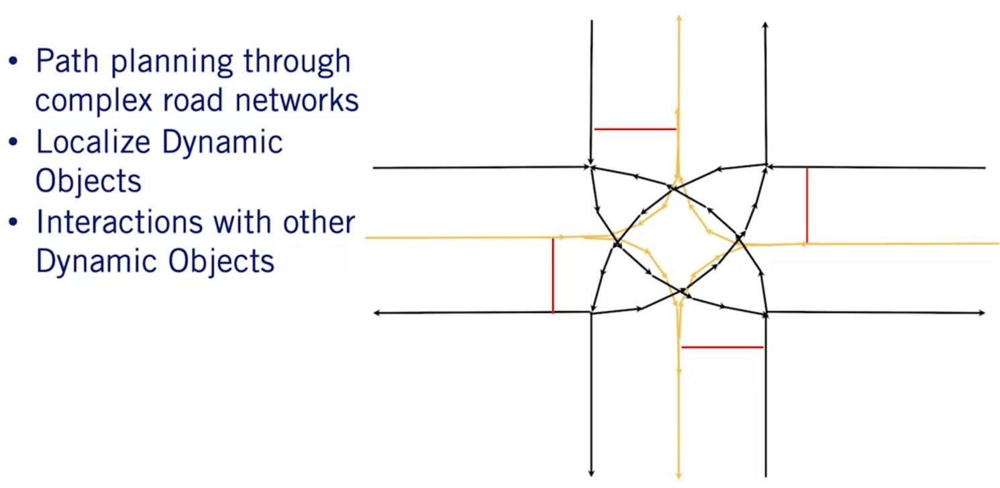

- A big advantage of the lanelet data structure is that it makes parts of the motion planning process simpler and more computationally efficient.
- The process of path planning through complex multi-lane road networks, which require multiple link changes well in advance of turning, are made possible with this data structure as each lanelet is treated as a separate vertex.
- Localizing dynamic objects to a known map improves path predictions, as we shall see in module 4.
- This type of localization ability also improves interactions with dynamic objects by providing an easy method to plan the behavior of an autonomous car through a busy intersection, as we'll see in module 5.

**The Creation Of Lanelets**

The creation of such a map can be done in three ways: 

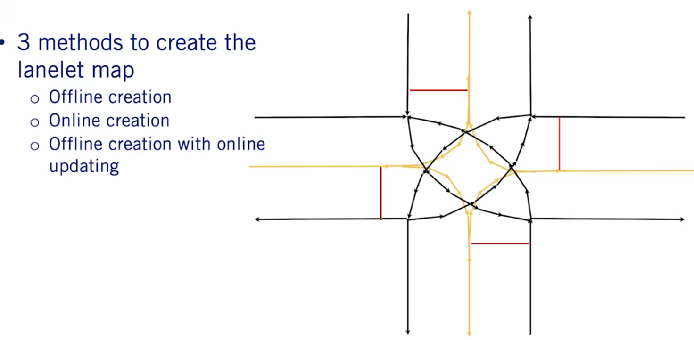

- **The first** is creating the map offline by driving the road network several times and collecting information, and then fusing both segmentation as well as localization information to improve the accuracy of the map.
  - In this method, hand corrections are also possible if any mistakes are noted from the algorithms.
- **The second method** is to create a lanelet map online while driving a road network for the first time.
  - With the use of existing traditional maps and heavily relying on segmentation and object detection, it is possible to create the map as the autonomous vehicle drives through the road network for the first time.
  - This method is highly computationally expensive both in terms of the motion planning task, as well as the perception tasks.
  - Not to mention highly error-prone and thus is rarely deployed.
- **The third approach** for creating HD maps is to create the maps offline and then update them online if changes are detected.
  - One such change might be a new construction zone resulting in a new regulatory element, and this is something that could not have been predicted during map creation.
  - In fact, all of these methods use the same underlying calculations to identify lanelet elements, attributes, and intersections.

- In practice, offline map construction with live confirmation and updating captures the best of both worlds, ensuring high precision on static elements that do not change frequently, and yet still capturing the novelty in the environment and allowing the vehicle to adapt to it.
- There is much more detail that can be included in this discussion about HD mapping.
- So we've added some links to the supplemental materials if you'd like to dive in deeper.

**Summary**

- Congratulations, you've made it to the end of this module.
- In this module, you've learned all about the creation of two types of environment maps, which are required for motion planning.
- We started by looking at the construction of occupancy grid maps from rider data for self-driving cars.
- It's Bayesian log-odds update steps, and all the required filtering needed to create meaningful maps or static objects to be avoided.
- We also looked at High Definition Road Maps using the lanelet model.
- We discussed the various components which make up these maps and how they can be used for fundamental motion planning operations.
- In the next module, we will look into the mission planning problem, the first step in the task of developing safe and effective trajectories for self-driving cars.

### Module 2 Supplementary Reading

- S. Thrun, W. Burgard, and D. Fox, [Probabilistic robotics.](http://www.probabilistic-robotics.org/) Cambridge, MA: MIT Press, 2010. Read Chapter 9 - Occupancy Grid Mapping for an overview of how occupancy grids are generated.

- P. Bender, J. Ziegler, and C. Stiller, “[Lanelets: Efficient map representation for autonomous driving,](http://static.aixpaper.com/pdf/d/f5/gs.2014.81cd3b9828.v1.pdf)” 2014 IEEE Intelligent Vehicles Symposium Proceedings, 2014. Introduces the concepts of lanelets used in mapping.

### Lab : Occupancy Grid Generation

### Grade : Occupancy Grid Generation

# References

Tesla AI Day : 
- [Tesla Autonomy Day - 2019](https://www.youtube.com/watch?v=Ucp0TTmvqOE)
- [Tesla Battery Day - 2020 - during covid](https://www.youtube.com/watch?v=l6T9xIeZTds)
- [Tesla AI Day - 2021](https://www.youtube.com/watch?v=j0z4FweCy4M&t=37s)
- [Tesla AI Day - 2022](https://www.youtube.com/watch?v=ODSJsviD_SU&t=3480s)

MathWorks : 
- [Robotics System Toolbox - Design, simulate, test, and deploy robotics applications on MATLAB](https://www.mathworks.com/help/robotics/)

# Appendices

- [Motion Planning - path planning](https://en.wikipedia.org/wiki/Motion_planning)
- [Robot Navigation](https://en.wikipedia.org/wiki/Robot_navigation)
- [Occupancy Grid Mapping](https://en.wikipedia.org/wiki/Occupancy_grid_mapping)
- 
- [Lattice Graph](https://en.wikipedia.org/wiki/Lattice_graph)
- [Sertac Karaman (MIT) on Motion Planning in a Complex World - MIT Self-Driving Cars](https://www.youtube.com/watch?v=0fLSf3NO0-s&t=42s)