# Course-4 - W3 - MODULE 3: Mission Planning in Driving Environments

## Overview

- This module develops the concepts of shortest path search on graphs in order to find a sequence of road segments in a driving map that will navigate a vehicle from a current location to a destination. 
- The modules covers the definition of a roadmap graph with road segments, intersections and travel times, and presents `Dijkstra’s` and `A*` search for identification of the shortest path across the road network.

**Learning Objectives**

- Recall the mathematical concept of a graph.
- Understand how graphs can be used to represent road networks.
- Apply Breadth First Search (BFS) to an unweighted graph to find the shortest path to a destination.
- Apply Dijkstra's Search to a weighted graph for finding the shortest path in a more realistic road network.
- Apply heuristics through A* Search to improve shortest path search speed.


### Lesson 1: Creating a Road Network Graph

**Learning Objectives**

- In this module, we'll be discussing the mission planning problem in autonomous driving and how to solve it.
- If you recall from Module 1, the autonomous driving mission is the highest level portion of our motion planning task and it's crucial for navigating the autonomous car to its destination.
- In this lesson, we'll introduce the mathematical concept of a graph and how it can be used in our mission planner.
- In addition, we will discuss how a graph can be used to represent the road network that we are required to navigate through.
- Finally, we'll discuss the Breadth-First Search algorithm and how it can be applied to mission planning.

**Recall: Mission Planning.**

The objective of the autonomous driving mission is to find the optimal path for the ego vehicle from its current position to a given destination by navigating the road network while abstracting away the lower-level details like the rules of the road and other agents present in the driving scenario.

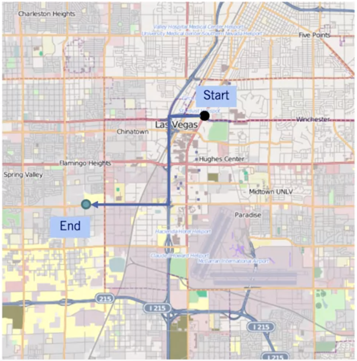

- ```In this module, we will think of `optimality` in terms of the amount of time or distance it takes for the car to reach its destination.```

- For autonomous driving, mission planning is considered the highest level planning problem.
- This is because the spatial planning scale of the mission planner is on the order of kilometers and the mission planner doesn't focus on low-level planning constraints such as obstacles or dynamics.
- Instead, the mission planner will focus on aspects of the road network when planning, such as *speed limits* and *road lengths*, traffic flow rates and road closures.
- Based on these constraints posed to us by the map, the mission planner needs to find the optimal path to our required destination.

One thing to note about the road network is that it is highly structured which is something we can exploit in our planning process to simplify the problem.

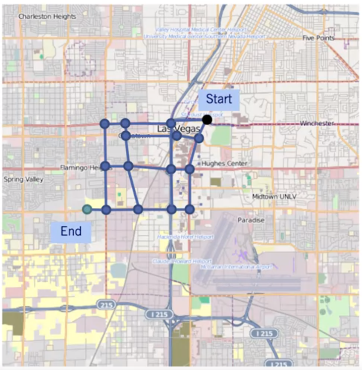

- By exploiting the structure, we can efficiently find the optimal path to our destination based on the map given to us.
- To do this, we will need to use a mathematical structure known as a `graph`, which we've overlaid onto our road network here.

**Graph**

- A graph is a discrete structure composed of a set of vertices denoted as $V$ and a set of edges denoted as $E$ .

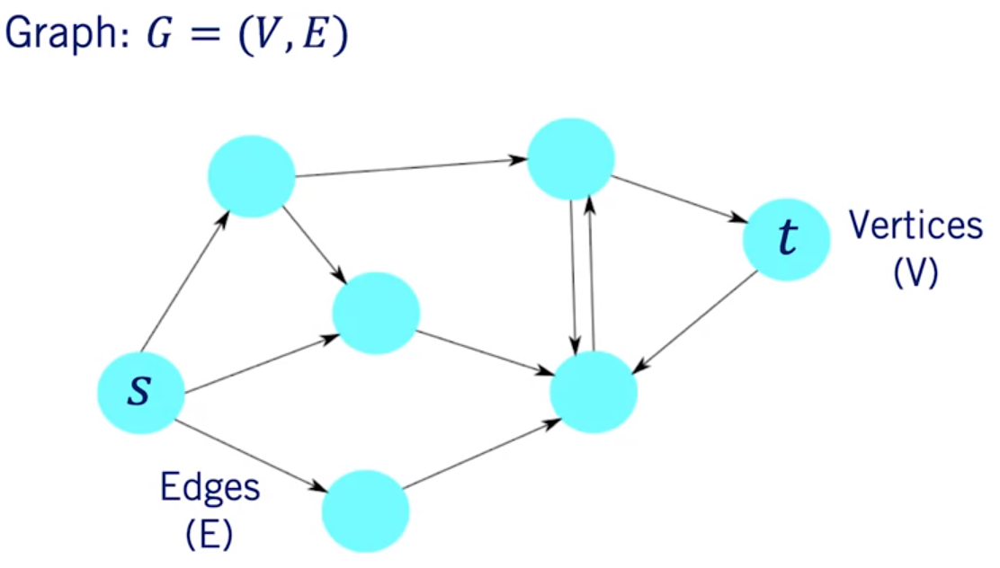

- For the mission planner, each vertex in V will correspond to a given point on the road network, and each edge E will correspond to the road segment that connects any two points in the road network.
- In this sense, a sequence of contiguous edges in the graph corresponds to a path through the road network from one point to another.
- For now, we will assume each road segment is of equal length, so the edges of this graph are all unweighted.
- However, in future lessons, we will relax this restriction.
- To generate a graph such as this, the road network needs to be `discreetly sampled`, which will give us the vertices of our graph.
- The edges will then be defined by the segments of the road that connect each sample point according to the rules of the road.
- Note that in general, just because point $A$ is adjacent to point $B$ using a road segment, it does not mean that point A can be reached from point $B$ from that same road segment.
- This is because in many cases there is only one direction that a road segment can be legally traversed.
- In this sense, the edges of our graph are `directed` in that the edge is only traversable in one direction. We've denoted this by using arrows for our edges in the graph to display their directionality.


*Now that we have are directed graph, how do we find an optimal path to our destination?* 

- First, we locate the vertices in the graph that correspond to our current ego vehicle position which we will denote as $S$ and our desired destination which we will denote as $t$ .
- These two vertices are shown on the graph here.
- Once we have these two vertices, we can use an efficient graph search algorithm to find the optimal or shortest path to our destination.
- Since our graph formulation is currently unweighted, a good candidate algorithm is the Breadth-First Search (BFS).

**Breadth-First Search (BFS)**

- At a high level, BFS can be thought of as iterating through all of the vertices in the graph but doing so in a manner such that all adjacent vertices are evaluated first before proceeding deeper into the graph.
- In this sense, the graph search proceeds like a moving wavefront through the graph or breadth-first.
- We construct 3 data structures to aid in our search : 
  - an `open queue` of vertices still to be assessed 
  - a `closed set` of vertices that have been assessed by the search algorithm and 
  - a `dictionary` of predecessors which store the results of the search.
- **A queue** is a first-in-first-out (FIFO) data structure, such that the first vertex pushed or added to the queue is the first one popped off or returned from the queue.
- **A dictionary** is an unordered set of `key-value` pairs and for each node in the closed set, stores a predecessor vertex that will identify momentarily.

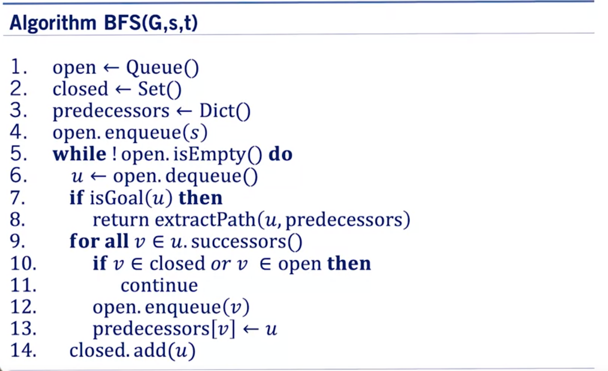

```
- The algorithm starts by adding our start vertex to the open queue.
- Then, while the open queue contains vertices, we take the first element from the open queue and check if it is the goal location.
- If so, we found our shortest path. If not, we then add all adjacent vertices not already in the open queue or closed set to the open queue.
- This prevents us from getting stuck in cycles during the graph search.
- Note that by adjacent, we mean all vertices that can be reached from the current vertex.
- Because we use a queue to store open vertices, we ensure that all adjacent vertices at the current depth in the search are processed before proceeding deeper into the graph.
- So all vertices that are one step away from the start vertex will be processed before moving on to vertices that are two steps away.
- As a vertex is added to the open queue, we store its preceding vertex in the predecessor dictionary.
- This will help us reconstruct the optimal path once the goal is found.
- Finally, we add the currently active vertex to the closed set and return to the next element of the open queue to process.
```
- Because of the breadth-first nature of the BFS algorithm, by the time we reach the goal vertex, we have processed all possible predecessor vertices of the golden vertex that are closer to the start vertex then the goal vertex.
- This means that when we reach the goal vertex, we have found `the shortest path` to the goal vertex and we can terminate the algorithm.

- To solidify our understanding of this algorithm, let's work through a concrete example.

**Example - First Wavefront**

Suppose our mission planner needs to find the optimal path from point $s$ to our destination $t$ through the set of vertices in our graph which are now labeled. 

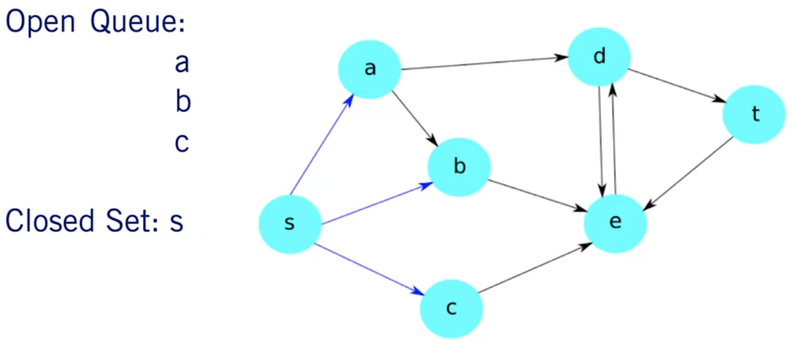

- The first step would be to process the origin $s$ and add all adjacent vertices to our queue and set their predecessors to $s$ .
- The outgoing edges that lead to the adjacent vertices are highlighted in blue.
- Once we've added these to our queue, we then add $s$ to our closed list.
- Next, we pop off vertex $a$ .

**Example - Second Wavefront**

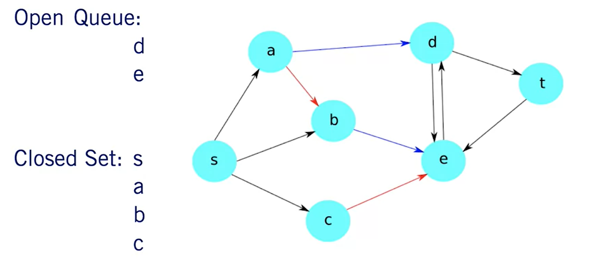

- The outgoing edges of a lead to $d$ and $b$, but $b$ is already in our queue, thus, we only add $d$ to the queue and mark $a$ as its predecessor.
- We've highlighted this duplicate path to be in red to show that we do not add b to the queue twice.
- We've now processed all adjacent edges from a and move it to the closed set.
- We repeat the same process for $b$ which adds $E$ to the queue with $b$ as its predecessor and $c$ which has no new adjacent vertices so does not add vertices to the open queue.
- Next, we process $d$ from the queue, which only adds $t$ to the queue with $d$ as its predecessor since $e$ has already been added.

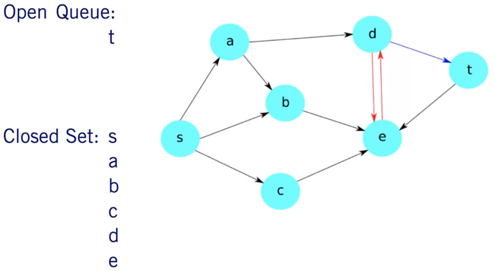

- When $e$ is popped off, it doesn't add $c$ or $d$ to the queue because both of these vertices have already been processed and are present in the closed set.

- Finally, we pop off $t$ from the queue. This is our goal vertex.

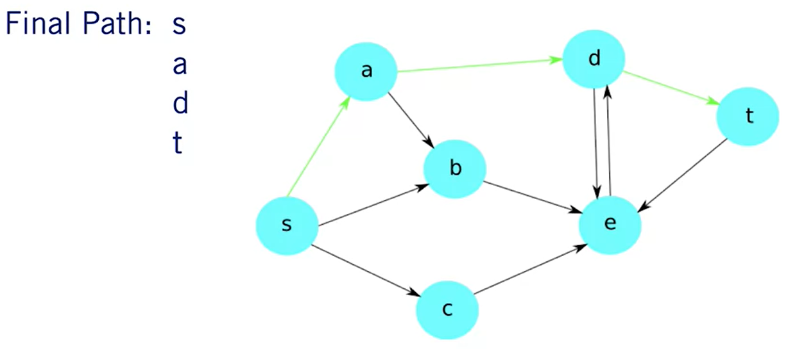

- So we now reconstruct the path from $s$ to $t$ by following the chain of predecessors from $t$ back to $s$.
- Once this is done, we've found the optimal path to our destination, which is highlighted in green.
- The sequence of edges corresponding to our optimal path in the graph can be turned into a root over the road network using our map, which can then be used to govern more detailed motion planning in the subsequent layers of our planning hierarchy.
- Before we wrap up this lesson, we should note that there is also the highly related `Depth-First Search algorithm` among many others.
- **Depth-First Search** (DFS) uses a last-in, first-out (LIFO) stack instead of a queue for the open set.
- This change means that the most recently added vertex is evaluated instead of the oldest.
- The result is a search that quickly moves deeper in the graph and then eventually backtracks to vertices added much earlier.

**Summary**

- From this lesson, you should have an understanding of the mission planning problem and how we construct and use graphs as a map level representation of our planning domain.
- In addition, you should now be comfortable with using Breadth-First Search to navigate an unweighted graph to find the shortest path to a given destination.


### Lesson 2: Dijkstra's Shortest Path Search

- In this lesson we'll modify our unweighted graph, from the previous lesson to contain edge weights.
- To give a more applicable representation for our mission planning problem.
- We'll then discuss how it impacts our algorithm, and how we can overcome this challenge while still planning efficiently.
- In particular by the end of this lesson, you should be able to understand the difference between weighted and unweighted graphs, and why weighted graphs are more useful for mission planning.
- You should have a firm grasp of the Dijkstra's algorithm.
- A graph search algorithm that is useful for weighted graphs.

**Unweighted Graph**

As a refresher, recall that for our mission planning problem, the goal is to find the optimal path in our road network from the ego vehicles current position, to the required final destination.

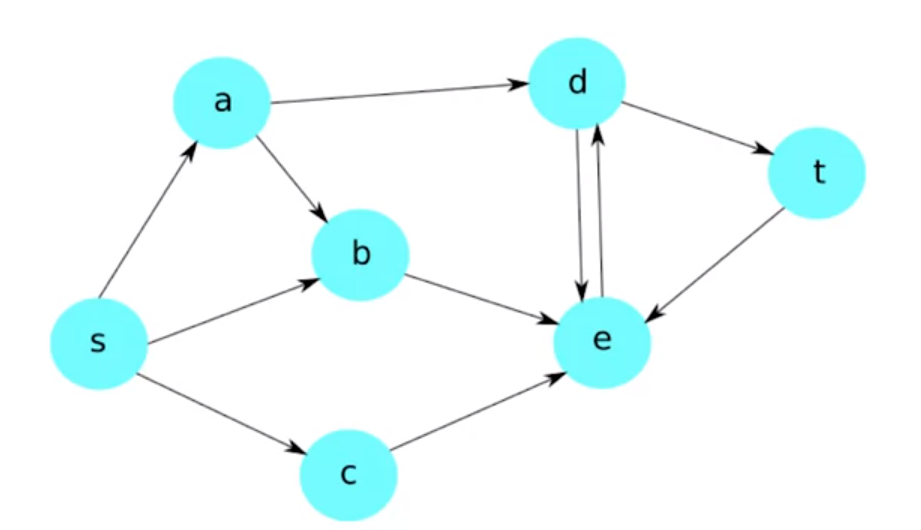

- In the last lesson we presented the breadth-first search algorithm to solve this problem.
- However, in the process we assume that all road segments have equal length, which is an overly simplistic assumption.
- Depending on factors such as road lengths, traffic, speed limits, and weather, different road segments can vary wildly in their traversal costs.
- For simplicity, we will initially focus purely on distance in our search graph.
- To reflect this, we will add edge weights to each edge in the graph, that correspond to the length of the corresponding road segment.

**Weighted Graph**

This is shown here, after updating our unweighted graph with appropriate edge weights.

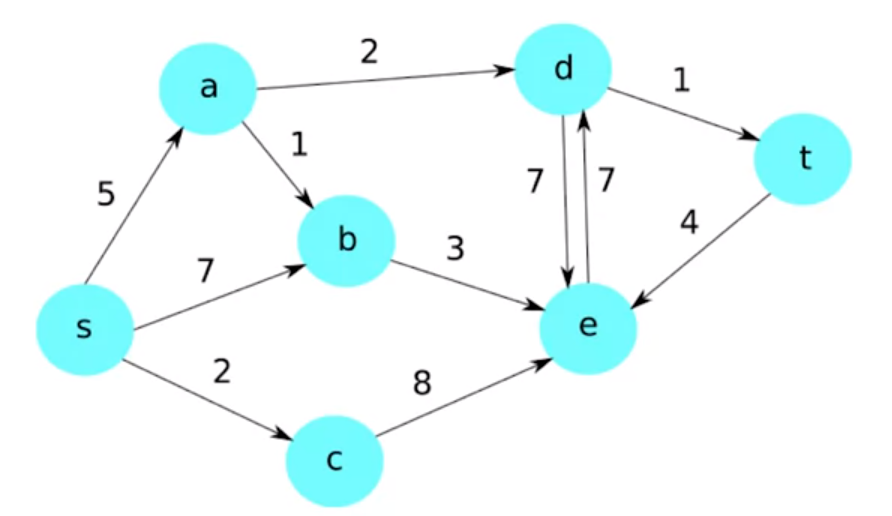

- The units of the weights are arbitrary, as long as they are common to all edges.
- For this instance, suppose the edge weights are the number of kilometers it takes to travel across that road segment.
- As before, the goal is to find the optimal path from the vertex of the ego vehicles current position S to the final destination vertex T.
- Unfortunately, our BFS algorithm doesn't take edge weights into consideration.
- So it isn't guaranteed to find the optimal path in this situation.
- We instead need to use a different more powerful algorithm. This is where `Dijkstra's algorithm` comes in.

**Dijkstra's algorithm**

- `Edsger Dijkstra`, a Dutch computer scientist, first conceived of this algorithm in 1956.
- In an interview in 2001, he explains that he was shopping with his fiance at the time, and got tired and they sat down for a coffee.
- He had been puzzling with the shortest path problem in his head, and within 20 minutes he worked out his algorithm without pen or paper.
- It took him three more years to write a paper on this topic, but he credits the simplicity and elegance of the idea with being forced to work through the solution entirely in his head.

The overall flow of Dijkstra's algorithm is quite similar to BFS.
- The main difference is in the order we process the vertices. We've highlighted the differences from the BFS algorithm in `blue`.
  
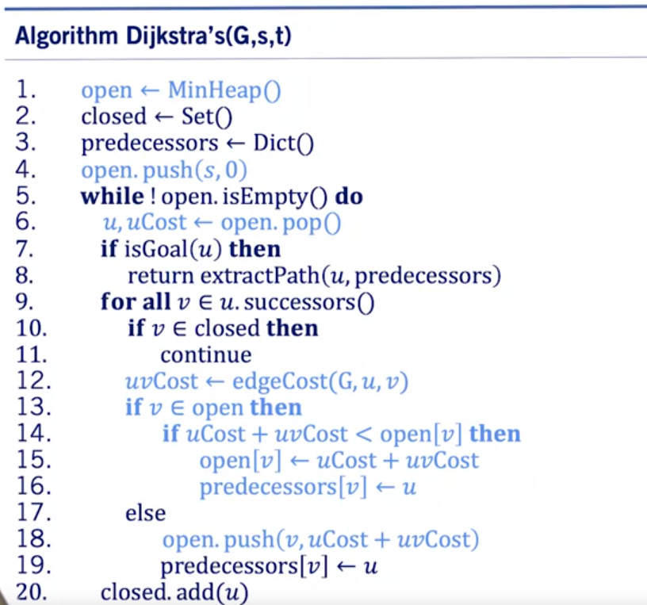

- As before, we keep track of the vertices we have already processed in the closed set, and the vertices we've discovered but not yet processed in the open set.
- The key difference is that instead of using a `queue` for the open set, we'll be using a `min heap`.
- ```A min heap is a data structure that stores keys and values, and sorts the keys in terms of their associated values from smallest to largest```.
- In our case, the values of each key vertex in the graph will correspond to the distance it takes to reach that vertex, along the shortest path to that vertex we've found so far.
- In this sense, Dijkstra's algorithm processes vertices with a lower accumulated cost before other ones.
- Thus unlike BFS, a vertex that was added later in the search can be processed before when that was added earlier, so long as it's accumulated cost is lower.
- Other than that, Dijkstra's algorithm is largely the same as BFS.
- Progressing through the vertices, while adding and popping them off of the min heap until the goal vertex is processed.
- One interesting case however, is if we find a new path to a vertex that is already in the open heap but has not been processed yet.
- In this case, we have to check if the newly found path to this vertex is cheaper than the old path.
- If it is, we need to update its cost in the min-heap otherwise, no action is required.
- Once we process the goal vertex we must have necessarily processed all possible predecessor vertices of the goal node.
- Since a predecessor must have accumulated distance less than or equal to the goal vertex.
- Since all predecessor vertices have been processed, we will have found the shortest path to the goal vertex.
- Once the goal vertex has been processed, so the algorithm can terminate.
- To solidify our understanding, let's step through the application of Dijkstra's algorithm to our new weighted graph.

**Example - Processing S**

- For our graph as with BFS, the first vertex to process is $S$ , which then adds $A$ , $B$ and $C$ , to the min heap.

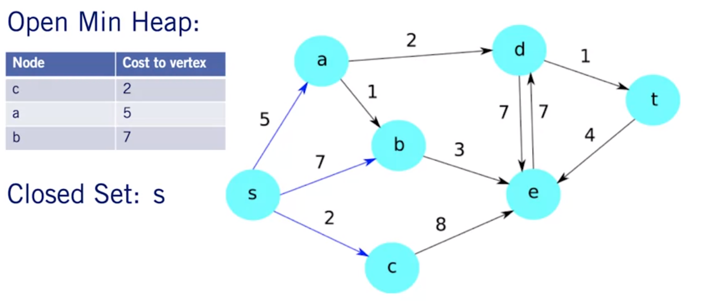

- By default, the accumulated cost of the origin $S$ is $0$ . So the cost to reach $A$, $B$ and $C$, is $5$, $7$ and $2$ respectively.
- Since we are using a min-heap instead of a queue for Dijkstra's algorithm, the order of the open vertices is now $CAB$ sorted from lowest cost to highest cost in the heap.
- We store each of these vertices predecessors as $S$, and then add $S$ to the closed set.

**Example - Processing C**

Next, we pop $C$ from the heap. Since it is the lowest cost vertex so far.

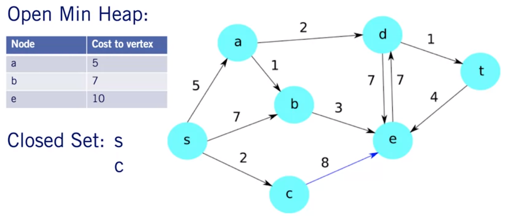

- $C$ is only connected to $E$ , which has not yet been discovered.
- So we add it to the min heap with a cost of $2$ plus $8$ is ten, along with C as its predecessor.
- Our new heap ordering is $A$ , $B$ and $E$ . We then add $C$ to the closed set.

**Example - Processing A**

The next vertex to pop off the heap is $A$ , which connects to both $D$ and $B$ .


- $D$ is not yet been explored, so we add it to the heap with a cost of $5$ plus 2 for $7$, and $b$ however has been explored as it currently has an accumulated cost of $7$.
- The edge $AB$ has weight one, so the new cost of going through $A$ is $5$ plus one for $6$ .
- Since this is lower than the current cost of $B$ which was $7$, we update the cost of $B$ in the heap to $6$ , and change its predecessor from $S$ to $A$ .
- To show that the cost of $B$ was updated, we have marked the new edge to be as purple.
- We then close vertex $A$ . Our vertex ordering in the min heap is now $B$ , $D$ and $E$ .

**Example - Processing B**

- We now pop $B$ off of the heap, which only connects to $E$. 
  
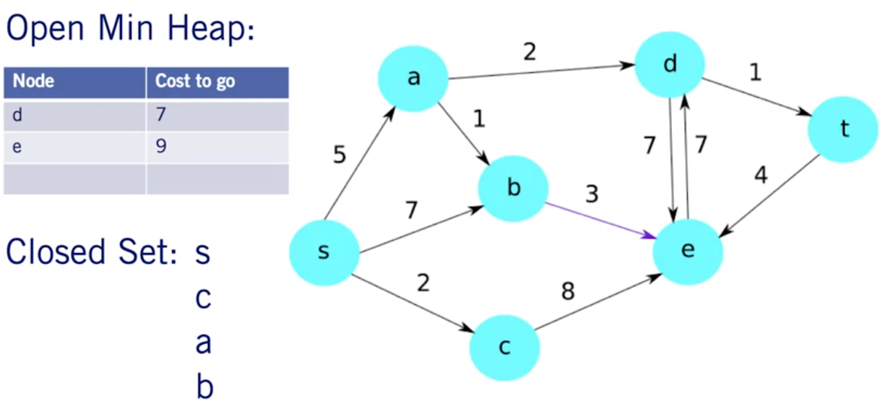

- The cost so far to reach $B$ is $6$ , which gives us a cost of nine to reach $E$ .
- $E$ was already stored in the min heap with a cost of ten.
- So, we need to update the cost of $E$ to nine, as well as change its predecessor from $C$ to $B$ .
- Finally, we close vertex $B$ . Our new vertex ordering in the min-heap is $D$ then $E$ .

**Example - Processing D**

Next, we pop $D$ off of the heap which connects both $E$ and $T$ .

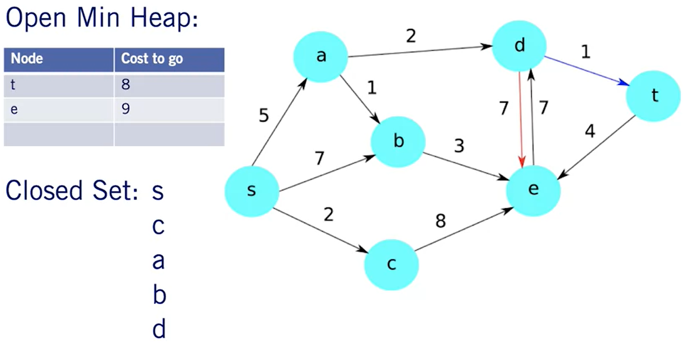

- $E$ is already in the heap with cost nine, and the new path from $D$ to $E$ has a cost of 14.
- Since this is higher than E's current cost, we can ignore this new path.
- To show that we've ignored it, we mark the new edge to $E$ as red instead of purple.
- We then add $T$ to the heap of a cost of $7$ plus one is $8$, setting D as its predecessor.
- Finally, we close vertex $D$ . Our new heap ordering is $T$ and then $E$ .

**Example - Optimal Path**

The final vertex that we pop off is T, which is our goal vertex.

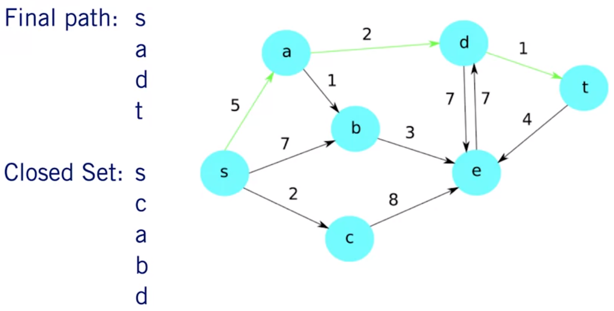

- This completes the planning process, and we now have an optimal path formed by chaining together the predecessors of T all the way back to the origin, as highlighted on this graph here.

**Search on a Map**

Next, let's take a look at how this mission planning problem looks on a real map.

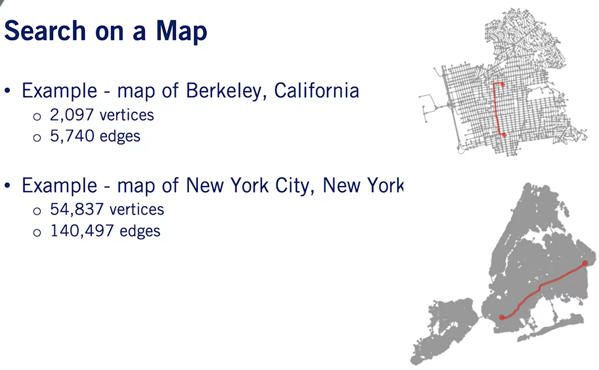

- Here we have a map of Berkeley, California. Where the vertices of the graph correspond to intersections, and the edges correspond to road segments as we discussed earlier.
- The two red dots, correspond to the start and end points of our required plan.
- We have to remember that certain roads are one-way roads. As such, the graph is directed.
- After running Dijkstra's algorithm, the shortest path between the two nodes is given by the red path.
- Dijkstra's algorithm is quite efficient, which allows it to scale really well to real-world problems such as the ones shown here.
- In fact, it even works with a much larger scale problems such as navigating over New York City. Whose road network graph is shown below.
- While Dijkstra's is an efficient algorithm, we can leverage certain heuristics to make it even faster in practice, which we'll discuss in our next lesson.

**Summary**

- We first introduced the concept of a weighted graph, and discussed that having the ability to make certain edges have higher weights than others, better reflects the autonomous driving mission.
- As different roads are longer than others.
- As a consequence of this, our breadth-first search algorithm no longer works.
- So we introduced Dijkstra's algorithm, to handle this added complexity.
- In our next lesson, we'll be discussing how to solve these problems more efficiently using search heuristics. We'll introduce the A-star algorithm.

### Lesson 3: A* Shortest Path Search

**Learning Objectives**

- In this lesson, we will build on Dijkstra's algorithm by introducing a new potentially faster approach that we can use for our mission planning problem.
- To do this, we'll leverage heuristics in our search, which will help us refine the search process to make it more efficient.
- By the end of this lesson, you should understand the role of heuristics in graph search and identify which heuristics are valid for our mission planning problem and which are not.
- You should also be able to leverage heuristics in our graph search problem, by using the A* search algorithm, and recognize how to apply A* search to variance of the mission planning problem we've discussed so far.

**Recall: Dijkistra's for Weighted Graph**

If you recall from the last lesson we introduced Dijkstra's algorithm to help us tackle the mission planning problem for the case of a weighted graph edges, which was more realistic than our previous unweighted graph instance because it let us take into account variable distances across different road segments.

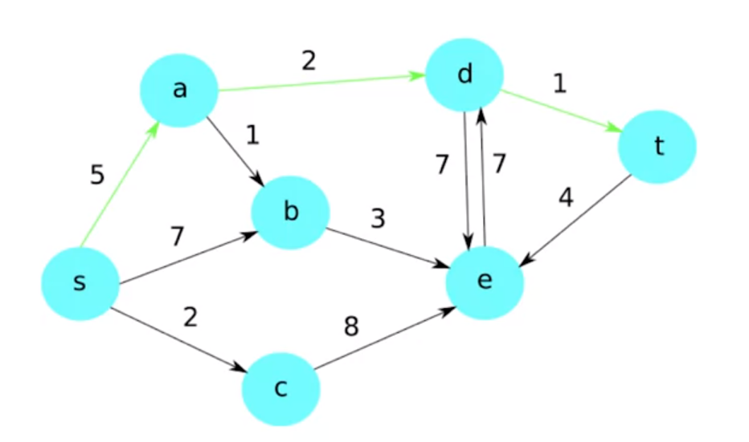

- However, Dijkstra's algorithm required us to search almost `all of the edges present` in the graph, even though only a few of them were actually useful for constructing the optimal path.
- Well, this wasn't a problem for our small example graph.
- It will cause issues when we scale our problem to more realistic proportions, such as a full road network for a city.
- To improve our efficiency in practice, we can instead rely on `a search heuristic` by using the A* algorithm to find our destination rather than Dijkstra's.

**Euclidean Heuristic**

In this context, **a search heuristic** is an estimate of the remaining cost to reach the destination vertex from any given vertex in the graph.

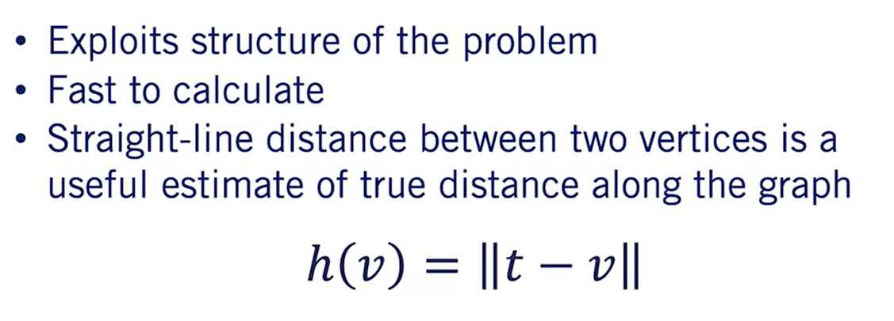

- Of course, any heuristic we use won't be exact as that would require knowing the answer to our search problem already.
- Instead, we rely on the structure of the problem instance to develop a reasonable estimate that is fast to compute.
- In our case, the vertices in the graph correspond to points in space, with the edges corresponding to segments of a road which have a weight corresponding to the length of those road segments.
- Therefore a useful estimate on the cost or length between any two vertices is the straight line or Euclidean distance between them, as shown here by $H(v)$ , for a given vertex $v$ and goal $t$.
  
**Euclidean Heuristic - Example**

- Therefore, for any vertex we encounter in our search, our estimate for the remaining cost to the goal vertex will just be the Euclidean distance between that vertex and the goal.

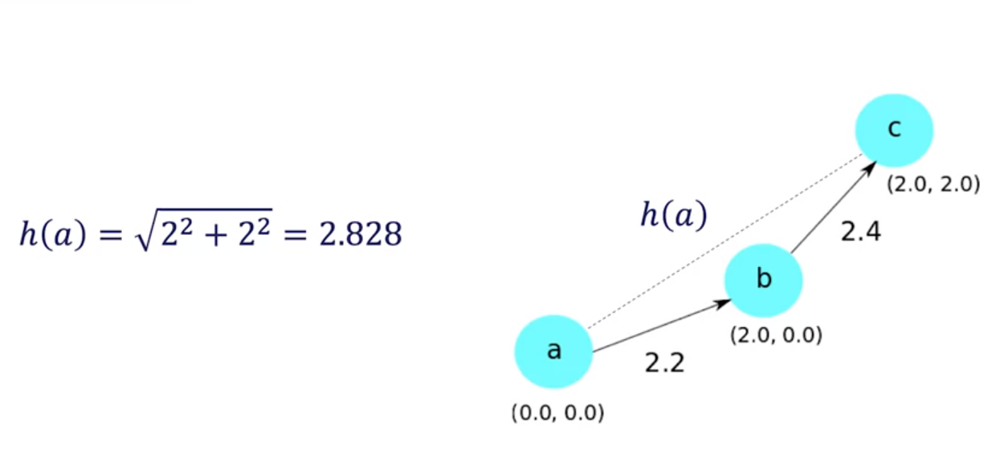

- Note that this estimate is always an underestimate of the true distance to reach the goal, since the shortest path between any two points is a straight line.
- This is an important requirement for A* search, and heuristics that satisfy this requirement are called `admissible heuristics`.

As an example calculation, suppose we have a start vertex a and a goal vertex c.

- Vertex a corresponds to the 0.0, and vertex b corresponds to 2.0. Vertex c in this case corresponds to 2.2. 
- Therefore, the Euclidean distance between a and c is 2.828, which is our heuristic estimate of the cost to the goal.
- Note that the edge cost between any two adjacent vertices is not equal to the distance between those vertices.
- This is because road segments are not straight line paths, and in general the road segment length will be influenced by the shape of the road.
- Because of the graphs simplicity, we can see that the actual cost of the path from a to c is 4.6, by summing up the ab and bc edge costs.
- As expected, our heuristic is an underestimate of the true cost.

**A\* Algorithm**

Let's use this new heuristic to better inform our graph search. Here, we have the pseudocode for the A* algorithm.

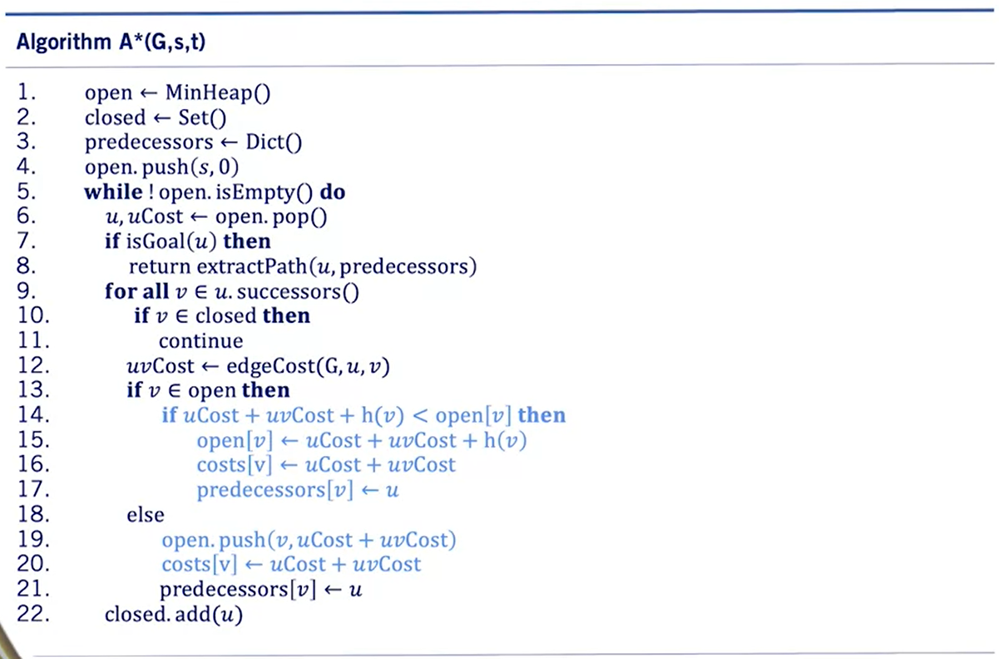

- It's largely the same as Dijkstra's algorithm, but it has a few key differences, which we've highlighted in blue.

Let's look more closely at the specific changes.

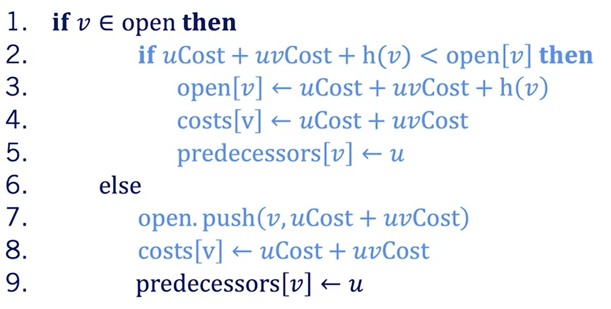

- Recall that in Dijkstra's algorithm, we push our open vertices onto a min heap along with their accumulated cost from the origin.
- The main heap then sorts the open vertices by their associated accumulated cost.
- The min difference between Dijkstra's algorithm and A* is that instead of using the accumulated cost, we use the accumulated cost plus hv, the heuristic estimated remaining cost to the goal vertex as the value we push onto the min heap.
- The min heap then essentially sorts the open vertices by the estimated total cost to the goal.
- In this sense, A* biases the search towards vertices that are likely to be part of the optimal path according to our search heuristic.
- Since we are storing a heuristic based total cost and the min-heap, we also need to keep track of the true cost of each vertex as well, which we store in the cost structure.
- An interesting thing to note is that if we take our heuristic to be zero for all vertices which is still an admissible heuristic, we then end up with Dijkstra's algorithm.
- As before with Dijkstra's algorithm, we will add the origin to the min heap, then pop each vertex off of the heap and add all adjacent vertices to the heap, until we process the goal vertex.
- Let's apply the A* algorithm to our example graph.

**Example - Origin Node**

Here we have our road network graph from the previous lessons, except now we've added the actual position of each vertex.

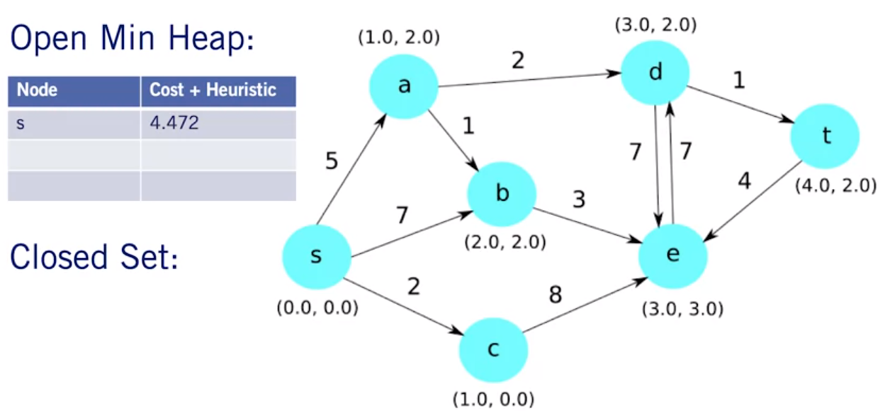

- Note that the figure is not to scale and the vertices are nicely spaced to make the figure more legible instead of being depicted in Euclidean space.
- However, you can see that the edge length between any two adjacent vertices are at least as long as their Euclidean distance.
- As always, the first vertex we add to the min heap is the origin s.
- There is zero accumulated cost and the Euclidean distance between s and t, which is a lower bound on our shortest path distance is 4.472. So we add vertex s with cost 4.472.

**Example - Processing S**

Next, we process the first node s and add the adjacent vertices a, b, and c to the min heap.

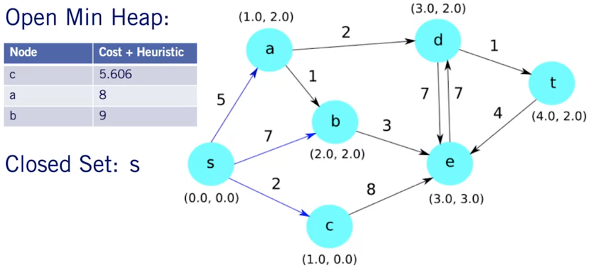

- Remember that we need to add the accumulated cost to the heuristic cost to the goal when adding each vertex to the min heap.
- Thus for vertex a, we have a cost of 5 plus 3 is 8. For vertex b, we have a cost of 7 plus 2 is nine, and for vertex c we have a cost of 2 plus the square root of 9 plus 4 is 5.6.
- The order of the vertices in the min heap is now cab. We also add s as the predecessor to the vertices a, b, and c and then add s to the closed set.

**Example - Processing C**

The next vertex to process is c, which only connects to vertex e.

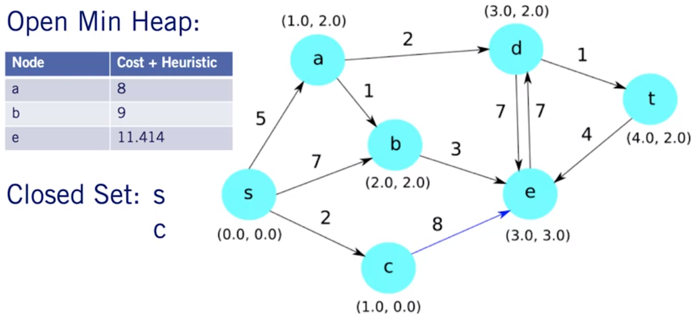


- The cost of e works out to 11.4. So we now have a vertex order abe.
- We then assign e's predecessor to be c and add c to the closed set.


**Example - Processing A**

Next, we pop a off of the min heap and we see that it has outgoing edges to vertex b and d.

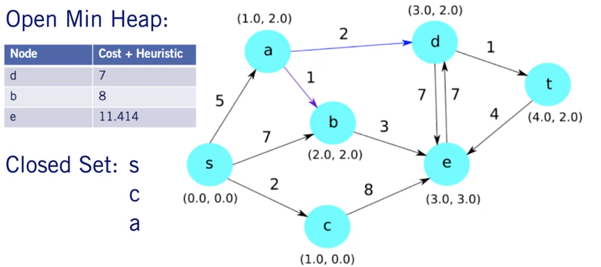

- The cost to b eight, which is lower than the original estimated cost for b.
- So we update its cost in a min heap and change its predecessor from s to a.
- To show we've updated its cost, we've highlighted the edge in purple.
- We also add vertex d to the min heap with cost of seven. The new heap ordering is thus dbe.
- We then assign a to be the predecessor of d and add a to the closed set.

**Example - Processing D**

The process continues with d, which has outgoing edges to e and t.

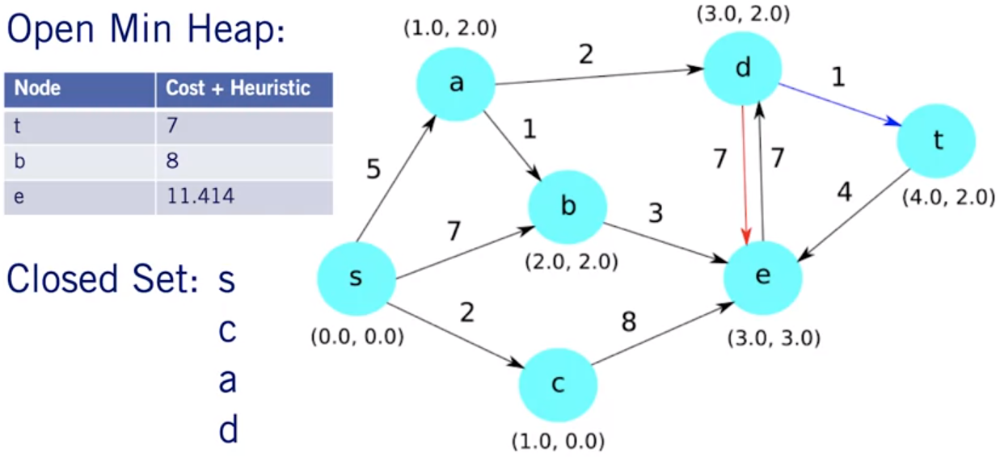

- The estimated cost of e is 15.4.
- Since this is higher than e's current cost in the min heap, we ignore this new path to e and as such we mark this edge and red.
- The estimated cost of t is seven.
- Since it is the goal node it has zero heuristic cost to goal.
- After doing this, the new min heap ordering is t b e.
- We set the predecessor of t to be d and add a to the closed set.

**Example - Final Path**
- Finally, we process the vertex t which is the goal vertex. So we are done.


- The final shortest path from s to t is shown on this graph here, and we are able to avoid processing both b and d, thanks to the A* approach.
- Unfortunately, this example graph is quite small in order to demonstrate how the algorithm works.
- However, as we scale the problem to much larger graph inputs, we will see that the heuristic used in the A* algorithm will cause it to explore far fewer vertices than the Dijkstra's algorithm.
- Asymptotically, A* will never do worse than Dijkstra's, and in practice A* will result in a much faster mission planning process.

**Extensions to Other Factors**

Now, in our examples, we've simplified the mission planning problems such that the edge weights or the distance along road segments in the map.

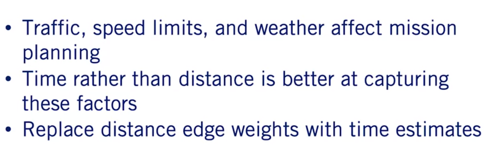

- However, if we were to include other factors such as traffic, speed limits, or weather into our mission planning problem, the road distance along the path would be too simplistic to capture the scope of the problem.
- To remedy this, we can instead take the estimated time to cross the road segment as our edge weights, and this takes all of the mentioned factors into consideration.

**Example**

However, this renders our Euclidean distance metric useless, as it no longer captures the true cost to the goal in terms of time.
- To remedy this, we can use a lower bound estimate of the time to the goal point as a Euclidean distance divided by the maximum speed allowed across all road segments.
- The car should not exceed the speed limit. So even in ideal traffic and weather conditions, as well as a straight line path to the goal, this is the absolute shortest amount of time the car can travel to that goal.
- This means it is a lower bound on the true cost to the goal at all times, and as such it is an admissible heuristic.
- For example, here we have set our maximum speed to be a 100 kilometers per hour, with the edge weights corresponding to the number of seconds it takes to traverse a path.

After computing our heuristic value of a 101.8 seconds, we can see that it is much lower than the true path length from a to c, which is a 165.6 seconds.

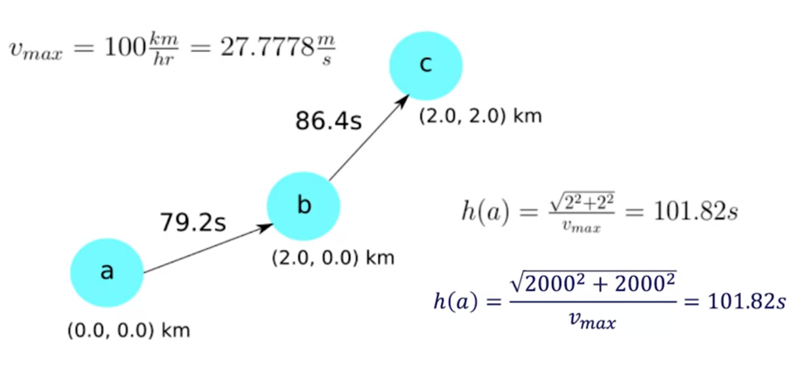

- This is because in general, this heuristic is a poor lower bound as the segments will often take much longer to traverse, than the computed minimum.
- Poor lower bounds can degrade the ability of our heuristic to guide our search to the goal for more complex problems, as compared to problem instances that were strictly focused on minimizing distance.
- More advanced methods are available which pre-compute additional values and consider modified heuristic definitions that allow large networks with time-based travel estimates to be searched efficiently.
- We've included some links in the supplemental material, if you're interested in learning more.
- In this lesson, we introduced the concept of the Euclidean heuristic and showed that it was an admissible heuristic for our motion planning problem.
- We then used it in our implementation of A* search for a motion planning problem.
- We also discussed how to modify the mission planning problem we've discussed so far, to include travel times instead of road lengths, and also how to modify our search heuristic to be admissible in this situation.

**Summary**

- You've reached the end of this module on mission planning.
- In this module, you learned to define the mission planning problem as a shortest path search over a directed graph, and you applied Dijkstra's and A* algorithms to find the shortest path efficiently.
- In the next module, you'll learn about dynamic object interactions and how these relate to the second stage of our motion planning hierarchy, the behavioral planner.
  
### Module 3 Supplementary Reading

- Steven M Lavalle, [Planning Algorithms](http://planning.cs.uiuc.edu/),  2006, Cambridge University Press. Chapter 2 covers discrete planning over graphs including Dijkstra's and A*.

- N. J. Nilsson, [“Artificial intelligence: A modern approach,”](http://aima.cs.berkeley.edu/) Artificial Intelligence, vol. 82, no. 1-2, pp. 369–380, 1996. Read Chapters 3.4-3.5 for an overview of search algorithms in graphs.

### Practice Assignment: Road Network Shortest Path Search


### Lab : Road Network Shortest Path Search
### Grade : Quiz

# References

Tesla AI Day : 
- [Tesla Autonomy Day - 2019](https://www.youtube.com/watch?v=Ucp0TTmvqOE)
- [Tesla Battery Day - 2020 - during covid](https://www.youtube.com/watch?v=l6T9xIeZTds)
- [Tesla AI Day - 2021](https://www.youtube.com/watch?v=j0z4FweCy4M&t=37s)
- [Tesla AI Day - 2022](https://www.youtube.com/watch?v=ODSJsviD_SU&t=3480s)


# Appendices

- [Motion planning - Wikipedia](https://en.wikipedia.org/wiki/Motion_planning)
- [Heuristic](https://en.wikipedia.org/wiki/Heuristic)
- [Problem Solving](https://en.wikipedia.org/wiki/Problem_solving)
- [Heuristic - Computer Science](https://en.wikipedia.org/wiki/Heuristic_(computer_science))
- [Heuristics From Amit’s Thoughts on Pathfinding - Stanford](http://theory.stanford.edu/~amitp/GameProgramming/Heuristics.html)
- [Cost Estimation Models In Software Engineering](https://www.geeksforgeeks.org/cost-estimation-models-in-software-engineering/)
