# Course-4 - W4 - MODULE 4: Dynamic Object Interactions

## Overview

- This module introduces dynamic obstacles into the behaviour planning problem, and presents learners with the tools to assess the time to collision of vehicles and pedestrians in the environment.

**Learning Objectives**

- Recall the different types of motion prediction assumptions, and the differences between them.
- Understand how map knowledge can be used for prediction.
- Understand how multi-hypothesis prediction can be used to predict multiple behaviours.
- Compute Time-to-Collision (TTC) through estimation and simulation methods.

### Lesson 1: Motion Prediction

- This week, we will discuss methods used within the motion planner, to handle interactions between dynamic objects and the ego vehicle.
- We will start this week, by looking at the prediction of dynamic object motion.
- We will then go on to understanding how we are able to use the dynamic object predictions, in order to calculate the time to collision between the ego vehicle and other dynamic objects.
- In this lesson, we will define motion prediction for dynamic objects and identify the importance of such predictions in the greater path planning problem.
- We'll describe the requirements to accurately and safely predict the motion of dynamic objects, and explore the challenges inherent in motion prediction.
- Finally, we'll perform our first predictions with the constant velocity prediction model.

**Motion prediction - Definition**

**Motion prediction** attempts to estimate the future positions, headings, and velocities of all dynamic objects in the environment over some finite horizon.

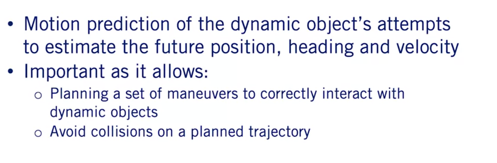

- This is crucially important for the motion planning problem, as it allows us to plan future actions and maneuvers for the autonomous vehicle, based on the expected motions of other objects.
- The predicted paths also allow us to make sure that the path which the ego vehicle plans to execute, will not collide with any future objects at a future time.


**Requirements for Motion Prediction Models**

In order to be able to predict the motion of moving objects, we must have access to some information about the environment around us.

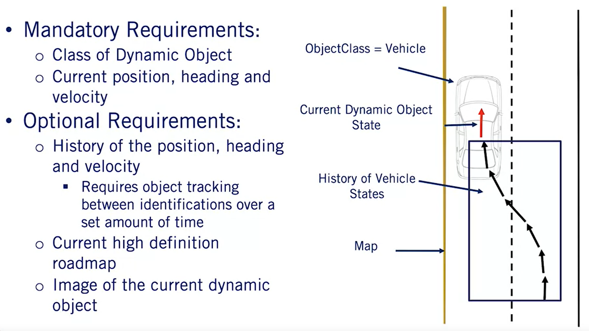

- Especially as it relates to dynamic objects.
- For all dynamic objects, we must first know the class of the object.
- This information is vitally important as most prediction models have different algorithmic approaches to vehicles as opposed to pedestrians.
- Next, we need to have information regarding the dynamic objects current state, its position, and velocity in the environment.
- Represented here by a red vector with the vector origin equal to the vehicle position, the vector magnitude equal to its speed, and the vector's direction equal to its current heading or direction of travel.
- Without this minimal information, no predictions can be made about the dynamic objects future states.
- Finally, there are many other pieces of information which although not required to make a prediction, can greatly improve the accuracy of the predictions.
- While this list that we'll present is not exhaustive, it does demonstrate some of the major sources of additional information to improve predictions.
- First is the history of the dynamic vehicle state or the vehicle track as it moves through the environment. This can be extremely useful.
- You've learned how to generate vehicle tracks from object detections in course three.
- We can use this information to get a better idea of how the object is maneuvering through the environment.
- As we can see in our example, we can see the vehicle state history shown as black arrow, with the position heading and speed represented as before.
- A high definition roadmap can also be used as an additional information source, to determine future behavior of dynamic objects.
- As will be discussed further in this module, vehicles tend to follow their respective lanes while driving down the road.
- This can provide strong cues to improve prediction accuracy.
- An image of the dynamic object in its current state can also be a useful source of information that can improve predictions.
- This is true for both vehicles and pedestrians.
- For vehicles, the image can provide information concerning the current indicator light or brake lights states, for example.
- Similarly, images of pedestrians can serve to show the current orientation of the person, which can help predict a future direction of travel, even if the pedestrian is currently stationary.

**Simplification of Motion Prediction - Cars**

Although the complexities of the task of motion prediction are quite large, there are several assumptions we can use to simplify the problem.

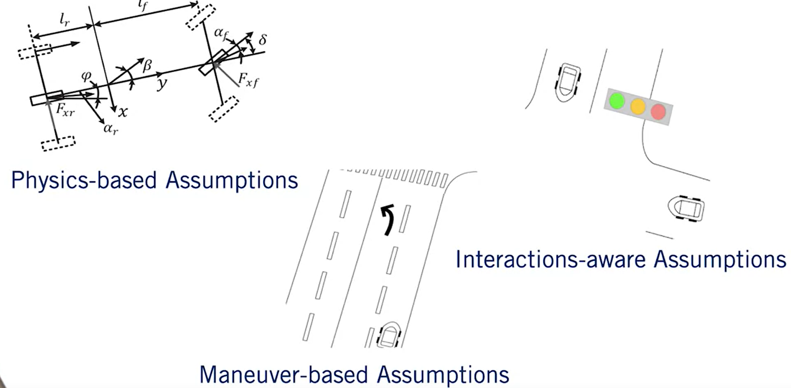

- We will start by looking at simplifications for vehicles and then move on to pedestrians.
- These are the two main categories we'll discuss, but you can imagine similar approaches needed for cyclists and animals such as dear, rodents, or even kangaroos.
- The `first class` of assumptions we rely on, is that vehicles must follow a set of physical constraints governing their movement.
  - As we saw in course one when we were discussing Vehicle Kinematics and Dynamics.
  - These very same vehicle dynamics can be applied to other vehicles in the environment to predict their motion.
  - We refer to this type of prediction as a `physics-based prediction`.
- The `second class` of assumptions that can be used are that almost all motions by a vehicle on the road, are made up of a finite set of maneuvers in a restricted domain in the environment.
  - In this case, we assume that vehicles which are on the road will stay on the road and follow the driving rules.
  - For example, they will most likely stay in their lane unless indicating otherwise and stop at regulatory elements requiring stops.
  - They are unlikely to drive over sidewalks or lawns or through obstacles.
  - We refer to this type of assumption as maneuver-based.
- Finally, the `third class` makes the same assumptions as `the maneuver-based assumptions`.
  
- However, instead of only evaluating each vehicle independently, we can also incorporate the assumption that the dynamic objects will react and interact with each other.
- An example of this type of prediction, is during a merge by a vehicle into an adjacent lane.
- Often, the vehicle in the destination lane will slow down to make more room for the incoming vehicle to maintain a safe following distance.
- These types of assumptions are referred to as interaction-aware assumptions.

**Complexities of Motion Prediction - Pedestrians**

For pedestrians, the same three categories can be used to summarize the assumptions we can make.

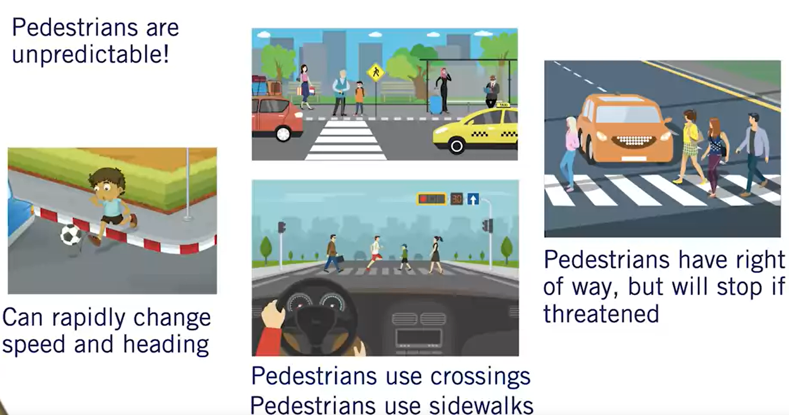

- In terms of physics-based assumptions, pedestrians tend to have a low top speed but can change their direction of motion and speed very quickly.
- This makes pedestrians quite challenging to predict reliably using purely physics-based assumptions, but the range of positions a pedestrian can reach in a short time frame is limited.
- For maneuver based assumptions, pedestrians tend not to interact directly with vehicles.
- As they primarily use sidewalks or other pedestrian exclusive zones when traveling.
- When entering the drivable areas of the environment such that they might come into contact with vehicles, they primarily use pedestrian crossings.
- Although restricting pedestrian motion to these regions is a reasonable assumption, it is not a hard constraint and the unpredictability of pedestrians requires maintaining multiple possible hypotheses about their future actions.
- Finally, pedestrians ultimately have the right of way and it is the self-driving cars duty to stop when necessary.
- Inattentive pedestrians may wander into a roadway without warning, but will often stop when threatened by an oncoming vehicle.
- These types of interactive assumptions can also be incorporated into motion prediction for pedestrians.

**Constant Velocity Prediction Model**

Now that we have a better understanding of motion prediction, let's have a look at a simple computationally efficient algorithm, that can be equally applied to both pedestrians and vehicles.

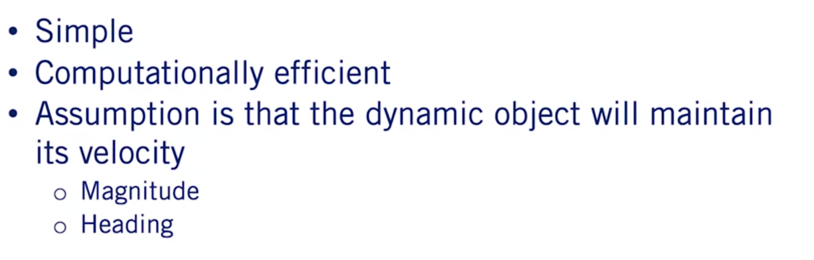

- This algorithm makes only one extreme assumption regarding the motion of the dynamic object.
- All dynamic objects will maintain their current velocity both in terms of magnitude as well as heading.
- Understanding this, let's now look at the algorithmic implementation of this simple constant velocity model.

**Constant Velocity Prediction Model - Algorithm**

- The algorithm takes three basic inputs t, the prediction horizon or the amount of time to predict the object's location into the future, dt, the update rate or path simulation frequency, that is the amount of time between state predictions, and x object, the current object's state which includes the position and velocity of the dynamic object.

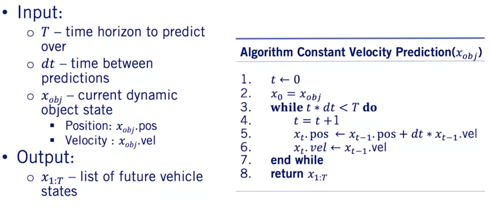

- This algorithm iterates from the current time zero until the end of the horizon t in increments of dt.
- As we saw in the trajectory rollout algorithm in the previous videos, updating the path with constant velocity model.
- The output of this algorithm is a list of predicted objects states, positions, and velocities for every time step in the prediction horizon.

**Constant Velocity Prediction Model - Example**

To see how well these predictions perform, let's look at a quick example.

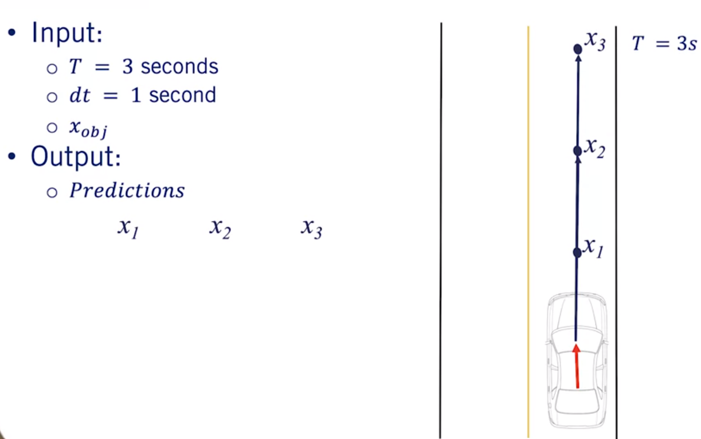

- We'll use a three second horizon with a one second update step and the current vehicles state as indicated by the red arrow in this figure.
- As expected, the predicted locations of the vehicle move in a constant direction with a fixed step size which corresponds very nicely with this straight line segment, with a constant speed limit.
- Simply put, this is because the constant velocity assumption is valid for this segment of roadway.

**Constant Velocity Prediction Model - Issues**

Where the constant velocity estimate fails, however, is everywhere else.

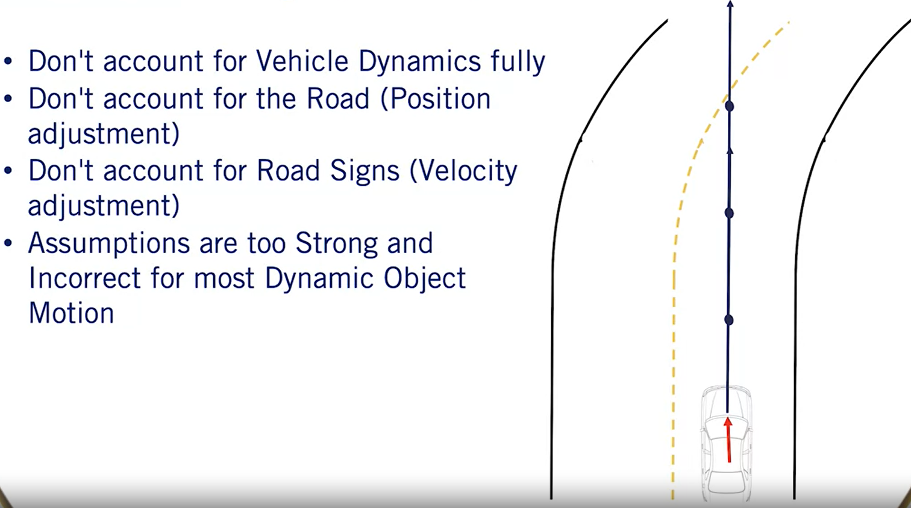

- While this algorithm weakly falls into the category of physics-based assumptions, it fails to capture the full complexity of vehicle dynamics models, or even the ability of a vehicle to accelerate or decelerate or apply a steering command other than zero.
- Another large flaw of the constant velocity assumption, is that it fails to account for vehicles tendency to follow changes in the road shape.
- At every point in this curved roadway example, the constant velocity model predicts the path will continue into the oncoming lane.
- These predictions are wholly unsuited to behavior planning.
- Similarly, the constant velocity prediction fails to account for road signs to make velocity adjustments.
- Vehicles approaching stop signs tend to slow down and vehicles leaving a stop line tend to accelerate.
- The assumption which this algorithm makes is quite strong and does not apply for most cases that dynamic objects may be observed in.
- The key challenge to motion prediction is really to select the most likely inputs, to a vehicle or pedestrian model given what information is available.
- Nonetheless, the constant velocity model is an excellent starting point and helps define the concept of motion prediction clearly.
- It relies on a minimum of information about the dynamic object, to form its predictions and can be used wherever additional cues are completely unavailable.


**Summary**

- In this lesson, we learned about the task of motion prediction for dynamic objects and its importance to autonomous driving.
- We then defined minimal and optional information requirements to create effective motion prediction algorithms for both vehicles and pedestrians.
- We then looked at a simple constant velocity algorithm for predicting the future location of objects and identified many of its limitations.


### Lesson 2: Map-Aware Motion Prediction

- In this lesson, we will be extending the topic of motion prediction of dynamic objects, to include information available from the HD road map.
- To begin, we will discuss the different assumptions relied on by map-aware where algorithms, for motion prediction, To keep the task simple and efficient.
- Then we will look at applying a lane following prediction approach, to improve position prediction components.
- Next, we'll explore map-based prediction when multiple lane options are available.
- Then we'll explore a velocity prediction around regulatory elements.
- Finally, we'll discuss some of the issues in short-falls of map-aware predictions that revolve around assumptions made regarding dynamic objects.

**Assumption to Improve Prediction**

In the previous video, we explored constant velocity motion prediction, which worked well only in a very limited number of scenarios.
- Map-aware algorithms make two broad categories of assumptions to improve the motion predictions particularly for vehicles.

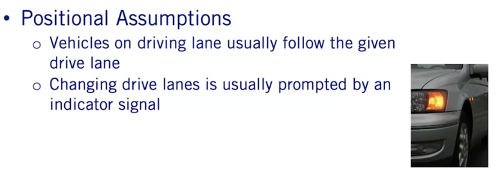

- **Position-based assumptions** to improve the position component of the vehicle state, and velocity-based assumptions to improve the velocity component.
- The first assumption made to improve the position component of the prediction, is that vehicles driving down a given lane usually follow that lane.
- Returning to our simple example scenario, if we have a vehicle on a curved roadway, the vehicle will most likely turn along with the roadway.
- The second assumption that can be made is that a drive lane change or direction prediction, can be made based on the state of the indicator light of the vehicle.
- If such a detection has been made by the perception stack for a vehicle, it is possible to switch the prediction to account for this additional information.

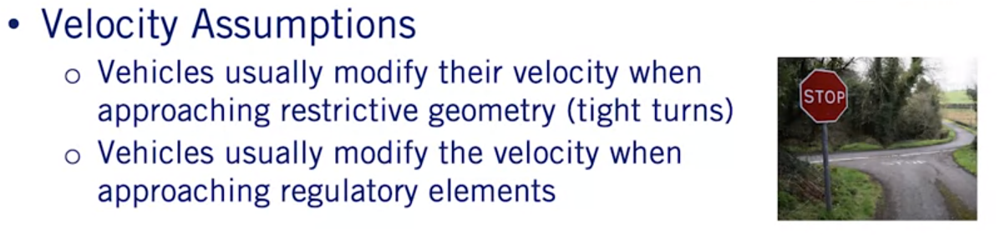

- **Velocity-based assumptions** are used to improve the velocity prediction of a dynamic object.
- All vehicles on the road are affected by road geometry. Thus, it is useful to assume that as a vehicle approaches a turn with significant curvature, the vehicle is likely to slow down to avoid exceeding its lateral acceleration limits.
- Finally, velocity prediction can be greatly enhanced if we also consider a regulatory elements, which the dynamic object may encounter.

- For example, if there is a stop sign at a close distance in front of a dynamic object, it is safe to assume that the vehicle will execute a decelerate to stop maneuver, resulting in a lower velocity over time.
- Well this is not a complete set of all assumptions that can be made to improve motion prediction using HD road maps, they are sufficient to illustrate the diversity of contextual information available to improve our predictions.
- Further, it is important to understand that the more constraints or assumptions that are added to a prediction model, the less generalizable it can be to all traffic scenarios.
- In fact, by the end of this lesson, we will see cases where even these generic assumptions can be overly constraining.


**Improvement of Position Estimation**

Let's now incorporate each of these map-based assumptions into our motion prediction methods.

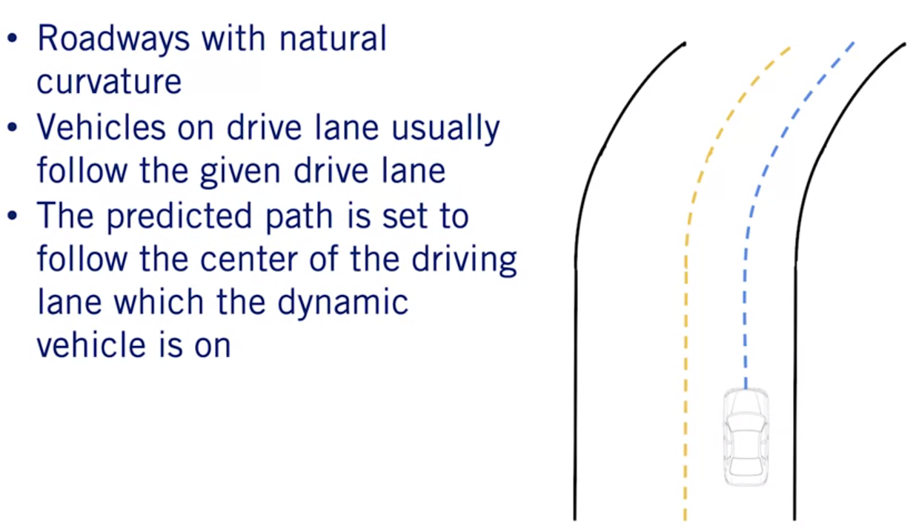


- For roadways with natural curvature, we make the assumption that a vehicle which is on a drive lane will likely follow that drive lane through the curve.
- Our motion predictions can be updated then by using the center line of the mainland map as the predicted path of the vehicle, instead of the straight line path generated by constant velocity predictions.
- Recall the lane that map definition from module two of this course which provides left, and right lane boundaries for every lane on the road from which there can be a center line to construct it.
- The center line of a lane lit is defined as a set of points making up a polyline that is equally spaced from both lane boundaries.
- While minor deviations from the exact center line can be expected, the center line can act as a good motion prediction approximation.
- This is a major step forward over constant velocity predictions on any roadway with curvature.

**Improvement of Path Prediction**

However, by restricting path predictions to the center line of any given lane lit, will result in two major issues.


- The first is that during normal driving, drivers routinely change lanes.
- So as mentioned earlier, such maneuver may be predicted based on indicator light perception.
- Although not all lean changes by human drivers are preceded by an indication.

- The second problem that arises is that it is regularly the case, that there is more than one center line to choose from. Such as in the case of an intersection.

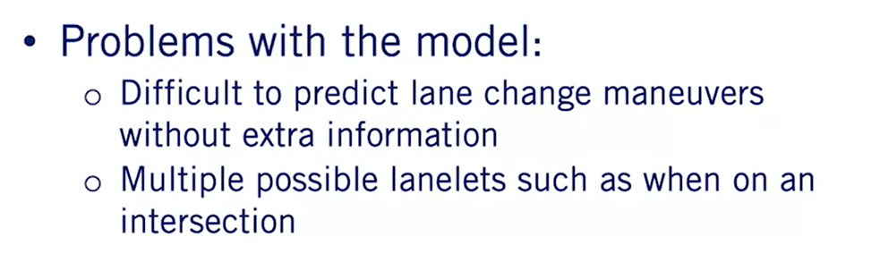

- For example, at this simple T junction, it is possible for the vehicle to turn either left or right.

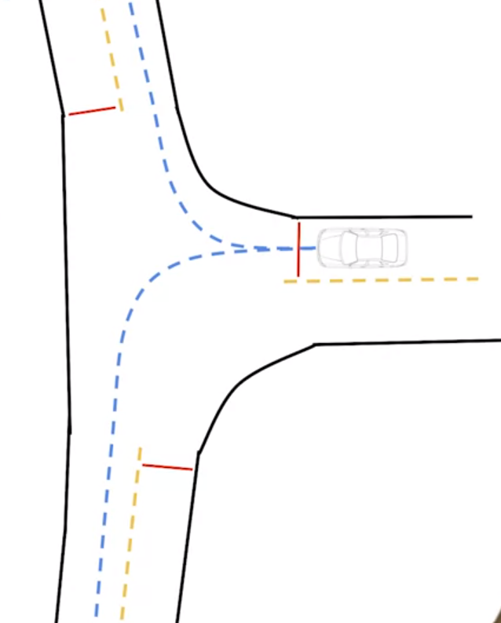

- This leads us to the need to consider multiple hypotheses based on likely behaviors of the other agents in the scene.


Again, we have two options: 
- we can identify the most likely behavior using objects state, appearance, and track information, and then construct a prediction based on the most likely behavior, 
- or we can construct a prediction for the most likely behaviors and associate a probability that the agents will follow a particular path based on the state appearance and track information.

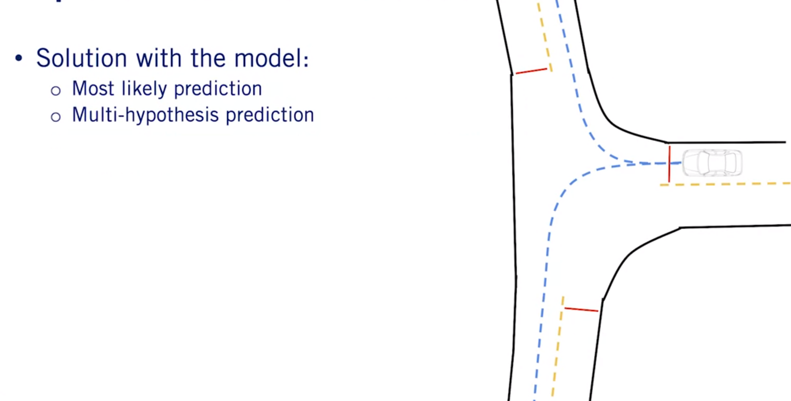

- The second approach is a slight generalization of the first. So we will focus our attention on it. We refer to this as `multi hypothesis prediction`.

**Multi-Hypothesis Approach**

In the case of multi-hypothesis prediction approaches, each nominal behavior of a vehicle based on the full range of possibilities available to it at its current location in the HD road map is considered.


- For the three-way intersection example, we can include three possibilities: turn left, turn right, or stay stationary.
- Based on corroborating evidence such as indicators signals, position to the left or right of the center line, and the state of the vehicle at the intersection.
- It is possible to evaluate each of the three hypotheses in terms of the likelihood the agent will execute each of them within the prediction horizon.
- These probabilities can be hard to quantify exactly.
- So can either be learned from training data of many vehicles proceeding through similar intersections, or can be engineered and refined from real-world testing.
- Such approaches traditionally provide more ambiguous information to the behavior planner, requiring this next stage of the planning process, to consider multiple scenarios simultaneously, and to handle the probabilistic representation of belief.
- However, if handled correctly, this approach can also be significantly safer, enabling defensive driving strategies, and rapid re-planning if probabilities shift based on new information.
- This approach also has an advantage of being able to adapt to human-based driving errors.
- Such as forgetting to signal when changing lanes.

**Improvements to Velocity Prediction**


Now that we understand how a road map can be used to improve the positional component of the predicted trajectories, let us now dive into the velocity component.

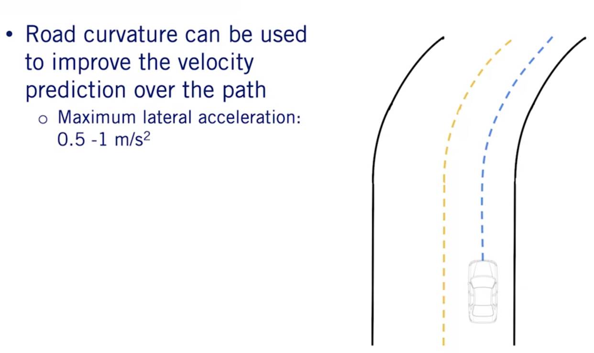

- The first improvement in this area is based on the known road geometry or curvature, and the prediction of how other vehicles will react to it.
- All vehicles no matter their making model, will reduce their velocity as they enter sharp curves or execute turns.
- We can use an expected maximum lateral acceleration, usually in the range of 0.5 to one meter per second squared, to improve velocity estimation along curves.

- The second and more significant improvement is to incorporate regulatory elements to improve velocity estimation.

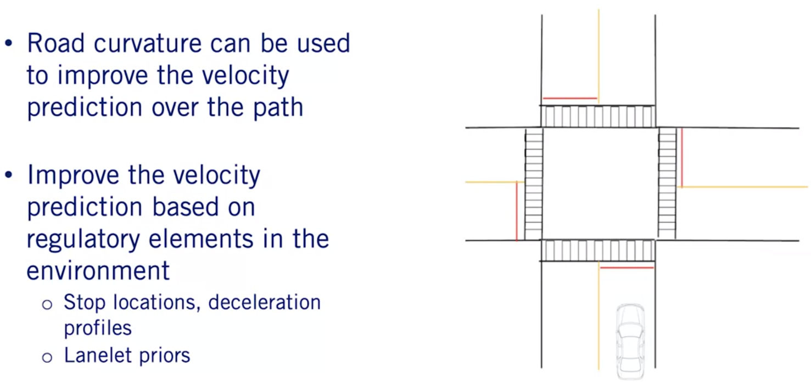

- Given the anticipated path of the vehicle, any roadway elements such as stop signs, yield signs, speed limit changes or traffic lights, can all inform the velocity prediction.
- In the case of traffic lights the lights state is also required.
- In each case a stop location can be predicted based on the regulatory element line, as defined in the road map.
- Then a smooth deceleration can be applied to the vehicle velocity prediction along its path.
- In fact, given a HD road map, it is possible to preprocess the map for nominal trajectories along each roadway, and to define lanelet specific multi-hypothesis priors, based on nominal driving behavior.
- This serves both as guidance for the ego vehicle in planning its behaviors and trajectories, and also in terms of refining the motion predictions for other agents.
- Of course obstructions in the lane ahead of a vehicle precedence of arrival information at intersections and lead vehicles in the lane, can all be integrated to improve predictions for other vehicles.
- Given the complexity of making decisions for a single self-driving car, there is a limit to how many variables and how much depth of information in logic can be used, to improve motion prediction.

**Issues with the Assumptions**

There is also a limit to how much we can rely on assumptions about expected dynamic object behavior, to predict future actions.

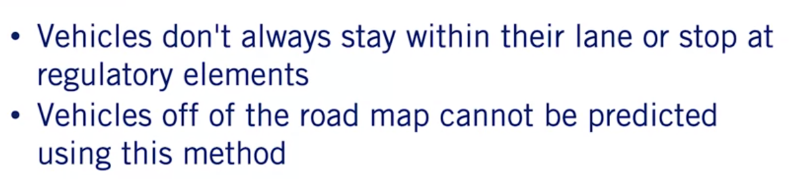

- Dynamic objects do not always behave according to the nominal behaviors expected of the drivers.
- They do not exactly follow the center line, do not drive at the speed limit, accelerate and decelerate at different rates for example.
- Further, they may react to information not yet available to the prediction system, such as a potholes in the road ahead or a bouncing ball.
- They may simply not observe a regulatory element as occurs when a vehicle accidentally runs a red light.
- All these variations must be accounted for which can be done to some extent with the multi-hypothesis approach.

```The best approach is therefore to track the evolution of beliefs over the set of hypotheses, and to update based on evidence from the perception stack at every time step.```

- There is a great deal of complexity embedded in these methods, and we encourage you to explore some of the challenging issues associated with motion prediction for self-driving cars, by digging into the references included in the supplementary materials.

**Summary**

- In today's lesson, we have described a set of assumptions for map-aware algorithms, to improve motion prediction of vehicles on drive lanes, defined position and velocity-based methods to improve motion prediction, described multi-hypothesis prediction as a way to maintain multiple beliefs about another vehicles future actions, and finally identified some of the issues with exclusively relying on map-aware motion prediction.
- I hope you will join us next time where we will see how to use our predicted paths, to calculate a time to collision, between pairs of dynamic objects.


### Lesson 3: Time to Collision
### Module 4 Supplementary Reading

### Grade: Quiz

# References

# Appendices
