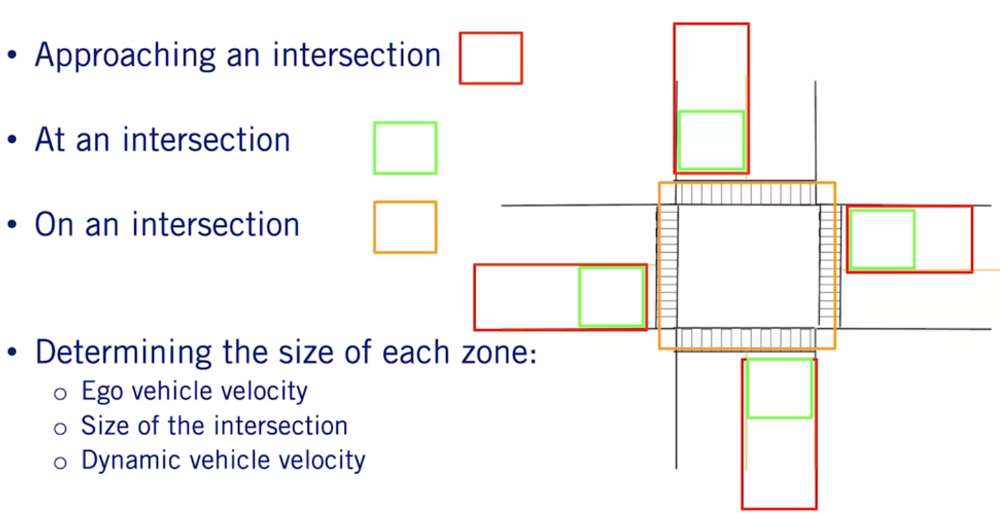
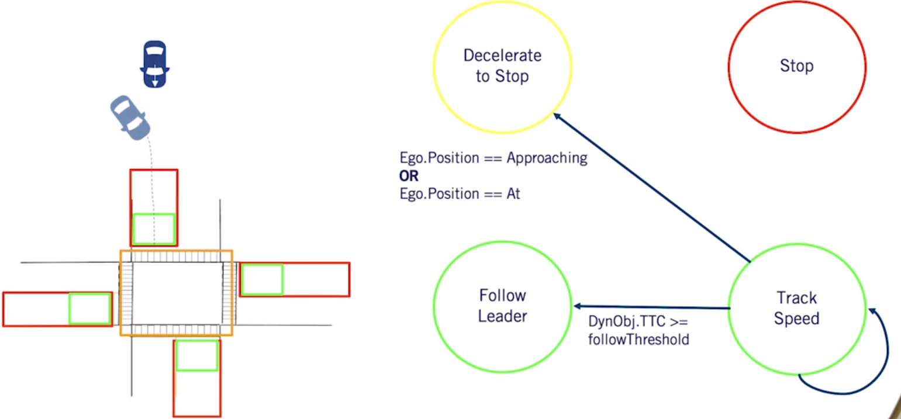

# Course-4 - W5 - MODULE 5: Principles of Behaviour Planning

## Overview

- This module develops a basic rule-based behaviour planning system, which performs high level decision making of driving behaviours such as lane changes, passing of parked cars and progress through intersections. 
- The module defines a consistent set of rules that are evaluated to select preferred vehicle behaviours that restrict the set of possible paths and speed profiles to be explored in lower level planning.

**Learning Objectives**

- Recall the role of the Behaviour Planner, as well as its inputs and outputs.
- Use state machines to perform behaviour planning, and recognize their advantages and disadvantages.
- Recognize which behaviours are required to handle certain scenarios.
- Understand the advantages and disadvantages of rule engines in behaviour planning.
- Understand the advantages and disadvantages of reinforcement learning in behaviour planning.

### Lesson 1: Behaviour Planning

Welcome to the fifth week of the motion planning course.
- In this module, we will be discussing a very important part of our motion planning architecture, behavior planning.
- We will start this module off by introducing the concept of behavior planning, and how to construct the behavior plan or using a state machine.
- Then, throughout the rest of the module, we will go through the process of creating a state machine-based behavior planner, able to handle multiple scenarios.
- Finally, we will finish off this module by looking at alternative approaches to the behavior planning problem, to understand their relative strengths and weaknesses.
- In this lesson, we will, define the requirements for a behavior planning system, explore the typical inputs and outputs to a behavior planning module, and finally, introduce the concept of finite state machines, and how they can be used to create a behavior planning system.

**Behavior Planning**

`A behavior planning system` plans the set of high level driving actions, or maneuvers to safely achieve the driving mission under various driving situations.

- The set of maneuvers which are planned should take into account, the rules of the road, and the interactions with all static and dynamic objects in the environment.
- The set of high level decisions made by the planner must ensure vehicle safety and efficient motion through the environment.
- We discussed many of these concepts already in course one of this specialization, and it is the behavior planner that needs to make the right decisions to keep us moving safely towards our goal.
- As an example of the role of the behavior planner, let's suppose the autonomous vehicle arrives at a busy intersection.
- The behavior planner must plan when and where to stop, how long to stay stopped for, and when to proceed through the intersection.
- The behavior planner has to perform this type of decision-making in a computationally efficient manner, so that it can react quickly to changes in the environment, and be deployed on an autonomous vehicle hardware.
- The behavior planners should also be able to deal with inputs that are both inaccurate, corrupted by measurement noise, and incorrect, affected by perception errors such as false positive detections and false negative detections.

**Driving Maneuvers**

- Now that we have the definition for the role of the behavior planner, let's build a list of basic behaviors that we'll work with for the rest of this module.
- We've described most of these in an earlier video in this course, and we'll use this list as a representation of the set of likely maneuvers or driving behaviors encountered throughout regular driving that an autonomous vehicle may need to execute.
- In all, we'll consider 5 behaviors.

  - The first is `track speed`.

- This behavior amounts to unconstrained driving on open road, meaning that the only restriction on forward progress is that the speed limit should be respected.
- Next, is `follow lead vehicle`.
- The speed of the vehicle in front of the ego vehicle should be matched and a safe following distance should be maintained.
- The third is `decelerate to stop`.

- A stop point exists in the ego vehicle's lane within the planning horizon, and the vehicle should decelerate to a standstill at that stop point.
- Every regulatory element that requires a complete stop triggers this behavior.

- Next, we have `stay stopped`.

- The vehicle should continue to stay stationary for a fixed amount of time.
- As an example, when the vehicle stops at a stop sign, it should stay stopped for at least `3 seconds`.

- Finally, we have the `merge behavior`.

- The vehicle should either merge into the left or right lane at this time.
- This basic list of maneuvers will serve us well in developing the principles of behavior planning.
- However, many more behaviors should be considered in practice, and the overall complexity of the behavior planner will grow as a result.

**Output of Behavior Planner**

The primary output of the behavior planner is a driving maneuver to be performed in the current environment.

- Along with the driving maneuver, the behavior planner also outputs a set of constraints, which constrain the local planning problem.
- The constraints which we will use and populate throughout this module include, the default path from the current location of the vehicle to the goal destination, for many behaviors, this is the center line of the ego vehicle's current lane.
- The speed limit along the default path.
- The lane boundaries of the current lane that should be maintained under nominal driving conditions.
- Any future stop locations which the vehicle needs to arrive at, and this constraint is only populated if the relevant maneuver is selected.
- Finally, the set of dynamic objects of high interest which the local planner should attend to.
- These dynamic objects may be important due to proximity or estimated future path.

**Input requirements**

In order for the behavior planner to be able to produce the required output, it needs a large amount of information from many other software systems in our autonomy stack.

- First, the behavior planner relies on full knowledge of the road network near the vehicle.
- This knowledge comes from the high definition road map.
- Next, the behavior planner must know which roadways to follow to get to a goal location.
- This comes in the form of a mission path over the road network graph.
- Further, the location of the vehicle is also vital to be able to correctly position HD roadmap elements in the local environment around the vehicle.
- Accurate localization information is also needed from the localization system as a result.
- Finally, the behavior planner requires all relevant perception information, in order to fully understand the actions that need to be taken, to safely activate the mission.
- This information includes, all observed dynamic objects in the environment, such as cars, pedestrians, or bicycles.
- For each dynamic object, its current state, predicted paths, collision points, and time to collision, are all required.
- It also includes, all observed static objects in their respective states, such as parked vehicles, construction cones, and traffic lights, with an indication of their state.
- Finally, it includes a local occupancy grid map defining the safe areas to execute maneuvers.
- With all the necessary information available to it, the behavior planner must select the appropriate behavior, and define the necessary accompanying constraints to keep the vehicle safe and moving efficiently.
- To do so, we will construct a set of rules either explicitly or implicitly that consider all of the rules of the road and all of the interactions with other dynamic objects.

**Finite State Machines**

One approach traditionally used to represent the set of rules required to solve behavior selection is a finite state machine.

- Throughout this module, we will go through a step-by-step process of constructing a finite state machine-based behavior planner.
- We'll discuss some of the limitations of this approach.
- To better understand the finite state machine approach, let's walk through a simple example of a finite-state machine for a single scenario, handling a stop sign intersection with no traffic.
- The first set of components of a finite state machine, is the set of states.
- For behavior planning system, the states will represent each of the possible driving maneuvers, which can be encountered.
- In our example, we will only need two possible maneuvers or states, track speed and decelerate to stop.
- The maneuver decision defined by the behavior planner is set by the state of the finite state machine.
- Each state has associated with it an entry action, which is the action that is to be taken when a state is first entered.
- For our behavior planner, these entry actions involve setting the necessary constraint outputs to accompany the behavior decision.
- For instance, as soon as we enter the decelerate to stop state, we must also define the stopping point along the path.
- Similarly, the entry condition for the track speed state, sets the speed limit to track.
- The second set of components of the finite state machine, are the transitions, which define the movement from one state to another.
- In our two-state example, we can transition from track speed to decelerate to stop, and from decelerate to stop back to track speed.
- Note that there can also be transitions which return us to the current state, triggering the entry action to repeat for that state.
- Each transition is accompanied with a set of transition conditions that need to be met before changing to the next state.
- These transition conditions are monitored while in a state to determine when a transition should occur.
- For our simple example, the transition conditions going from track speed to decelerate to stop involved checking if a stop point is within a threshold distance in our current lane.
- Similarly, if we have reached zero velocity at the stop point, we can transition from decelerate to stop back to track speed.
- These two-state example highlights the most important aspects of the finite state machine-based behavior planner.
- As the number of scenarios and behaviors increases, the finite state machine that is needed becomes significantly more complex, with many more states and conditions for transition.
- Finite state machines can be a very simple and effective tool for behavior planning.

**Advantages Of Finite State Machines in Behaviour Planning**

We can think of them as a direct implementation of the definition of behavior planning, which requires us to define maneuvers or states, and local planning constraints or entry actions that satisfy the rules of the road and check safe interaction with other dynamic and static objects in the environment or transition conditions.

- By keeping track of the current maneuver and state of the driving environment, only relevant transitions out of the current state need to be considered, greatly reducing the number of conditions to check at each iteration.
- As a result of the decomposition of behavior planning into a set of states with transitions between them, the individual rules required remain relatively simple.
- This leads to straightforward implementations with clear divisions between separate behaviors.
- However, as the number of states increases, the complexity of defining all possible transitions and their conditions explodes.
- There is also no explicit way to handle uncertainty and errors in the input data.
- These challenges mean that the finite-state machine approach tends to run into difficulties, as we approach full level five autonomy.
- But it is an excellent starting point for systems with restricted operational design domains, permitting a manageable number of states.
- We'll look into these limitations and alternative approaches to behavior planning in the final video in this module.

**Summary**

- In this video, we formulated a clear definition of the behavior planning problem and its role within the overall motion planning system.
- We discussed the standard inputs and outputs of the behavior planning module.
- We introduced the finite state machine and its components, and applied it to a two-state behavior planning problem.
- From here, we'll start to add more capabilities to our finite-state machine behavior planner.

### Lesson 2: Handling an Intersection Scenario Without Dynamic Objects

In the last video, we introduced the concept of a behavior planner, and described the basics of the finite state machine to implement behavior planning.
- In this video, we will see how to build out our system to handle a more complete intersection scenario.
- We will start by defining the specifics of the scenario that will be handled.
- We will then look at how we can discretize the intersection map into sections to establish clear transitions between states.
- Then we will define the states and transitions which are required to complete the given scenario safely and efficiently.
- To finish this video, we will highlight the testing procedure required to confirm the correctness and accuracy of our behavior planning system.

**Scenario Evaluation**

The scenario which we will be attempting to handle is a four-way intersection, with two lanes and stop signs for every direction.

- A diagram of such an intersection can be seen here, where the red lines represent the stop lines which the car is required to stop behind.
- By the end of the video, this vehicle should be able to travel left, right, or straight through this intersection.
- We'll leave dynamic objects out of the scenario for now, and we'll address them in the next video.
- We've now defined a very restricted operational design domain for our behavior planner to handle.
- It's now time to implement the behavior planner.

**Discretizing the Intersection**

Let's start by looking at how to discretize an intersection so that we can more simply make decisions in the environment.

 

- The area of the intersection where a vehicle should begin safely braking is defined as the approaching zone of the intersection, highlighted in red.
- The zone of the intersection in which the vehicle must stop and wait until the appropriate time to proceed will be known as the at zone, highlighted in green.
- Finally, the zone in which the vehicle is crossing the actual intersection is defined as on the intersection, and is highlighted in orange.
- The size of each of the above zones are dynamically changed based on two primary factors: the ego vehicle speed, at higher speed, we will require more distance to safely and comfortably stop, and the size of the intersection.
- The bigger the intersection, the bigger each zone has to be.

**State Machine States**

To handle this scenario, we will require three high-level driving maneuvers.

- Track speed, this maneuver state is only bounded by the current speed limit of the road.
- Traditionally, this is the maneuver given before entering any region of the intersection, or after entering the on the intersection zone safely.
- The state entry action sets the speed limit.
- Decelerate to stop, this maneuver state forces the future trajectory of the object to stop before reaching the stop point.
- The entry action defines the stop point location.
- Stop, this maneuver tells the vehicle to stay stopped in its current location.
- The entry action is to `start a timer` to wait for a fixed amount of time before proceeding through the intersection.
- We will now look at the different situations the ego vehicle will encounter in this scenario, and figure out the finite state machine elements needed to encode the correct behavior planning solution.

**State Machine Transitions**

- Let's start by looking at the ego vehicle before it enters the intersection region, where it has a single constraint to follow the speed limit of the road.

- This constraint is set based on the entry action of the track speed state.
- When the ego vehicle enters the approaching zone, the red zone, it must begin decelerating to the stop sign, thus will transition to the decelerate to stop state.
- The transition condition on moving from track speed to decelerate to stop is therefore entry into the approaching zone.
- Then, once decelerating, the next maneuver which the autonomous vehicle must execute is to come to a full stop before the stop line, or in the at zone of the intersection.

- To make sure this happens, the vehicle stays in the decelerate to stop state until it has both a zero velocity and a position within the at zone.
- The entry action in the decelerate to stop state is the establishment of a safe stop location.

- Due to the simplicity of this scenario, this is a single stop location, the stop line as given to the planner by the high-definition roadmap.
- This, however, we will see in the next lesson, will become harder to do once other dynamic objects interact with the ego vehicle.
- Once fully stopped, the car enters the stop state.

- As the entry action, a timer is started to make sure that the vehicle stays in the stopped state for three seconds before proceeding in accordance with typical driving rules.
- Once the timer is complete, the planner automatically transitions to the track speed state and follows the route provided to it by the mission planner through the intersection, be at left, right, or straight through.
- This is all the required computation to handle the simple four-way intersection with the finite state machine.
- Throughout this process, it is vitally important that we understand how we the human expert analyze the scenario, and what the specific capabilities of the resulting behavior planner are.
- These need to be captured in the operational design domain definition, and we need to ensure that we create a complete state machine able to handle every possible case that can arise for the given scenarios.

**Dealing With Environmental Noise**

- One particular issue that has a big impact on the performance of our state machine is the issue of noise in the inputs.

- The state transition conditions defined above are exact, and rely on the vehicle reaching the stop point and achieving a zero velocity exactly.
- Even with no other dynamic objects to detect, the localization estimates of the vehicle state may contain noise and not satisfy these conditions exactly.
- To handle this type of input noise, we can introduce noise threshold hyperparameters.
- This is a small threshold value allowing speeds close to zero to be accepted as stopped.
- We will continue to see these hyperparameters more and more in the next lesson, when handling more complex scenarios with dynamic objects.

**Behavior Palnning Testing**

*Now that we've finished creating the finite state machine, how do we test if it works?*

- Well, traditionally, there are four stages of testing required to confirm functionality of a behavior planning system, which follow from our discussion of safety assessment for the full vehicle in course 1.
- First, we perform code-based tests, which are done to confirm that the logic of the code is correct.

- For example, code-based tests can tell the programmer if the speed limits set in the roadmap will be the speed limit produced by the finite state machine.
- However, these checks are incapable of confirming if the state transitions are correct, or if the states are capable of handling all of the situations in a given scenario.
- For this, we have to see if the program code correctly handles all situations as intended.
- Next, we move to simulation testing, which is performed in a simulated environment like Carla, in which the state machine performs the scenarios which it was designed to handle.
- This type of testing is able to confirm if the state machine transitions and state coverage are correct.
- The number of tests performed in the simulation should be representative of all possible situations which can be seen when driving the scenario to catch any edge cases which programmers might have missed.
- Many times selecting a representative set of tests is not trivial, especially as the complexity of the scenarios increases.
- We then move into closed track testing, once confident that the state machine performs as intended in simulation.
- This type of testing tests specific scenarios which are hard to confirm exactly in simulation, such as parameter tuning and noise, and errors in the perception output in a real environment.
- Finally, we proceed to on-road validation testing.
- Whereas all previous tests were performed in a highly controlled environment, road tests can be highly unpredictable, and often break the system in a manner otherwise not imagined by engineers.
- New variations on scenarios can then be incorporated into earlier stages of the testing process.

**Summary**

- We first defined the scenario and the operational design domain to be handled, a single intersection scenario with a stop sign in all directions.
- We then saw how the intersection can be discretized so that each zone can be used when making the transitions of the state diagram.
- We then built up the states in transitions at the system to correctly define the required behaviors throughout the intersection.
- Finally, we reviewed four stages of testing that can be used to confirm proper behaviors in the scenario.
- In the next video, we will show you how to handle the same intersection scenario while interacting with other dynamic objects.
- As we will see, this makes the state machines significantly more complex and interesting.

### Lesson 3: Handling an Intersection Scenario with Dynamic Objects

Welcome to the third video this week on behavior planning.
- In the last video, we developed a basic behavior planner using a finite state machine for a four-way intersection without traffic.
- We now focus on incorporating traffic interactions in the same four-way intersection.
- In today's lesson, we will begin by reviewing some of the interactions with the dynamic object covered in previous modules, which we use throughout this lesson to safely interact with the other objects in the environment.
- We will then extend the state machine that we had built in the previous lesson to include these interactions with other vehicles.
- Finally, we will briefly discuss the many edge cases and various complexities that occur when dealing with dynamic objects.

**Review - Scenario Evaluation**

Once again, the scenario we study in this video is a single lane four-way stop intersection.

- We would like to be able to travel in any possible direction through this intersection, while now handling interaction with other vehicles.

**Review - Discretizing the Intersection**

Recall that in the previous lesson, we broke up the intersection into three areas or zones.

- The approaching zone highlighted in red, represents when a vehicle should decelerate to stop at the intersection.
- The ad zone highlighted in green, is where the vehicle should stop prior to entering the intersection.
- The on zone in orange, which represents the intersection itself.
- The zone's size can be shifted based on the ego and dynamic velocities, as well as the size of the intersection.

**Review - Interaction With Dynamic Objects**

Throughout this lesson, we will be focusing on the interactions with other dynamic objects, specifically other vehicles.

- In order to be able to safely deal with these vehicles, one important aspect is a measurement of the distance to various interaction points with the other objects.
- The first distance measure to consider, is the distance to dynamic objects.
- This is defined as the Euclidean distance between the current ego position to the center of any dynamic object in the environment.
- The second is the distance to collision point, which is the distance to a potential collision point with another dynamic object.
- Finally, the time to collision is the time it would take to reach the given collision point.
- Our approach to calculating this was discussed in the previous lesson.

**State Machine States**

Now let's expand a finite state machine to accommodate the added complexity of the dynamic objects.

- We will need to increase the required maneuvers to four in order to correctly handle all interactions with vehicles in this scenario.
- First, let's review the maneuvers we included in our first version of the finite state machine.

- These were: track speed, who's only constraint is the speed of the given road, decelerate to stop, which requires the ego vehicle to decelerate to a stop point at a specific location in the environment, and stop, where we remained in the stop position.
- The new maneuver we need to add is follow leader.
- This maneuver state requires the ego vehicle to follow the speed of and maintain a safe distance to a lead vehicle, which is any vehicle directly in front of it in its lane.
- The safe distance is speed dependent and both safe speed and safe distance are updated as entry actions on every iteration of the behavior planner.
- Now that we have all of the states defined for our expanded finite state machine, we turn to populating the transitions.
- We will do this in a similar fashion to the previous lesson, starting at a given state and then identifying all of the transitions out of that state before proceeding to the next.
- We'll display progress through the intersection as we define transitions in a pictorial representation of the scenario seen here on the left, and we'll build up the finite state machine on the right.
- In each pictorial representation, the autonomous ego vehicle will be denoted by a red arrow.

**State Machine Transitions - Track Speed**

- We will then start as we did in the previous lesson with the ego vehicle being located outside the intersection in the track speeds state.

- Much as we've seen in the previous lesson, the ego vehicle will only move to the decelerate to stop state once in the approaching zone.
- However, there is an additional concern, the situation in which another vehicle appears or enters the lane in front of the ego vehicle.
- In this case, we will move to attempt to follow the vehicle by performing a follow check.
- The follow check can be decomposed into two elements.
- A distance check and a same lane check.
- The distance check confirms that the vehicle is close enough such that it should be followed.
- In the same lane check confirms that the vehicle is actually in the same lane as the ego vehicle.
- In this case, we can use distance to dynamic object, which is the Euclidean distance to the object and compare that to a threshold.
- There are several methods which can be employed to check if the vehicle is in the same lane as the ego vehicle.
- However for simplicity, we will check if the lead vehicle is within the lane limits and if the heading of the dynamic object is within a given threshold to that of the ego vehicle indicating it is moving in the same direction.

**State Machine Transitions - Follow Leader**

- In the follow leaders state, we define only two transitions.

- First, the lead vehicle might exit the lean before the ego vehicle is approaching or at the intersection, resulting in a switch to the track speed state.
- Or the lead vehicle drives out of the current lane, usually, onto the intersection when the ego vehicle is already in the at or approaching zones, resulting in a direct transition to the decelerate to stop state.

- We add the transition condition, that the distance to collision is greater than the distance to the stop point when the ego vehicle is either in the approach or add zones.
- In this situation, the ego vehicles should transition to decelerate to stop and set the stop point to the correct location at the stop line of the intersection.

**State Machine Transitions - Decelerate to Stop**

- As before, in the decelerate to stop state, the ego vehicle continues decelerating until the time when it comes to a stop at the stop line.
- Which will result in a switch to the stop state as seen in our previous lesson.

- However, we once again have to take into account that a vehicle is able to pull in front of the autonomous car at an intersection, either from a driveway or an overtaking maneuver.

- Much as before, we perform the follow check throughout the decelerate to stop state when the ego vehicle is in the approaching or add zones, and transition to follow leader if the check returns true.
- In this case however, the distance check considers whether the lead vehicle distance to collision is less than the stop point distance, so that the leader following modes should take precedence.

**State Machine Transitions - Stop**

- Finally, to complete our expansion of the finite state machine, let's look at the situations we can face once stopped.

- To keep things simple, we'll assume a very conservative driving style, where our autonomous car waits until all vehicles have cleared the approaching, at, or on intersections zones before proceeding through it.

- We leave the implementation of precedents at the stop sign for you to explore on your own.
- Further, we'll define simple checks for a rectilinear intersections, that identify all vehicles direction of travel with four easy labels and only consider other vehicles moving straight through the intersection.
- Relative to the ego vehicles body frame, a vehicle object with a relative heading of between minus 45 and 45 degrees, will be labeled as going in the same direction as the ego vehicle.
- A vehicle between minus 45 and 135 degrees relative heading, will be labeled as heading to the right.
- Between minus 135 and 135 as heading towards the ego vehicle and finally, between 45-135 degrees relative heading, will be labeled as going to the left.
- This simplification can be improved using predicted paths for the dynamic objects, especially if additional perception information is available to improve prediction of the direction of travel through the intersection.
- We can now define the transitions out of the stop state.
- Will have two sets of transitions.
- Either follow leader or track speed, depending on whether a vehicle is present within the lane through the intersection that satisfies the follow check.
- In each case, the transition conditions change based on the path through the intersection required by our mission plan.
- When the ego vehicle needs to turn left, any vehicle approaching from the left, right, or any oncoming vehicle, must clear the on intersection zone before the ego vehicle can proceed.
- When the ego vehicle needs to go straight, only vehicles approaching from the left or right, need to clear the intersection.

- Finally, when the ego vehicle needs to turn right, only vehicles approaching from the left need to clear the intersection.

- From this simple definition of the transitions out of the stop state, we hope you can visualize the additional checks needed to handle the precedence due to arrival order at an intersection and the possibility that the other vehicles might also turn left or right.

**State Machine Transitions**

- The resulting full state machine includes the following states and transitions.
- While this state machine is unable to be used on a real autonomous vehicle due to the oversimplifications we relied on, it serves as a good demonstration of the process of converting a given operational design domain into a functional finite state machine.

- You're now ready to start tackling more complex scenarios with more complete dynamic object models.

**Dynamic Object Edge Cases Not Handled**

So far throughout the creation of a state machine, we have made one particularly strong assumption about how dynamic objects behave.

- Namely, that all dynamic objects obey the rules of the road.
- However, this is not always the case, and this difficulty leads to many edge cases that also need to be considered.
- Let's quickly discuss a few examples of what can go wrong with this strong assumption.

The first example would be when a driver unintentionally swerves into oncoming traffic, entering the lane of the ego vehicle.
- This actually happened to a `Waymo van in 2018`, when a driver careened over a median into oncoming traffic.

Another example, is of an aggressive driver racing through an intersection even as the ego vehicle has begun driving through it.

Another common example, is when a vehicle fails to stop at the intersection.

Finally, I will end with the case of a vehicle which is parked in close proximity to the intersection.
- If this vehicle is not tagged as parked, so that it might be treated as a static instead of dynamic object, our behavior planner may get stuck in a deadlock state waiting for this parked vehicle to move.
- This is by no means a complete set of all possibilities, and one of the primary objectives of behaviors safety assessment and testing, is to uncover as many variations of unexpected behaviors as possible, so that they also can be detected, categorized, and incorporated into the behavior planning design process.
- Just simply uncovering edge cases is not enough, however.
- Rather we must define how the autonomous vehicles should react to every one of these cases.
- For this emergency maneuvers such as a swerve or a hard break are required, with many more transitions and conditions to define.
- This is an active area of research and development and we've included some additional resources in the supplemental materials, if you'd like to find out more.

**summary**
- We learned how we can create a finite state machine, able to interact with dynamic objects which follow the rules of the road.
- We saw why dealing with dynamic objects is so challenging by looking at just a few of the many possible edge cases which they can create.
- In our next lesson, we will see how we can continue building our behavior planner to be able to handle multiple scenarios simultaneously.

### Lesson 4: Handling Multiple Scenarios
### Lesson 5: Advanced Methods for Behaviour Planning
### Module 5 Supplementary Reading

### Grade : Quiz

# References

# Appendices
