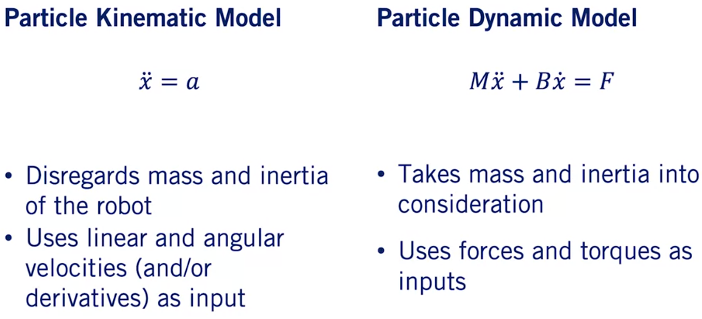
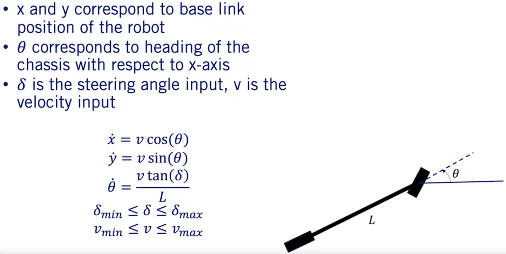
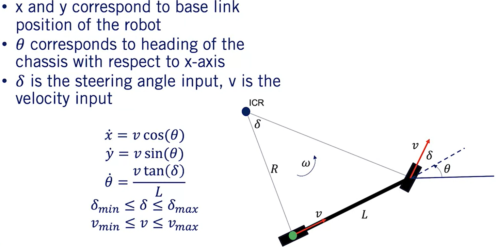
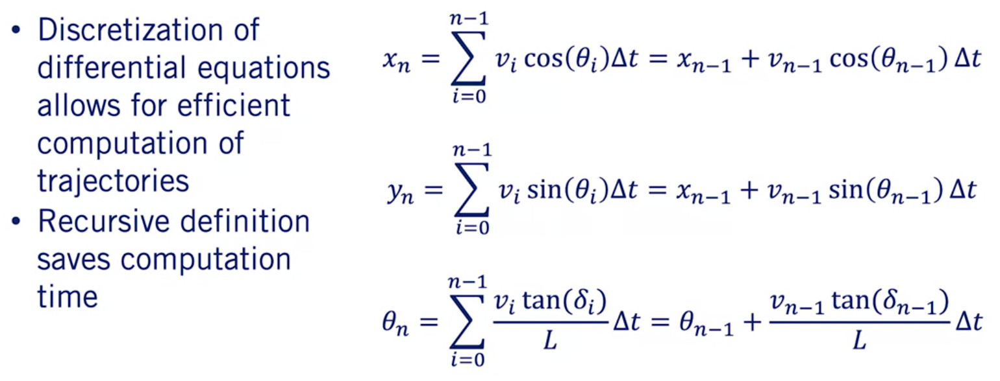
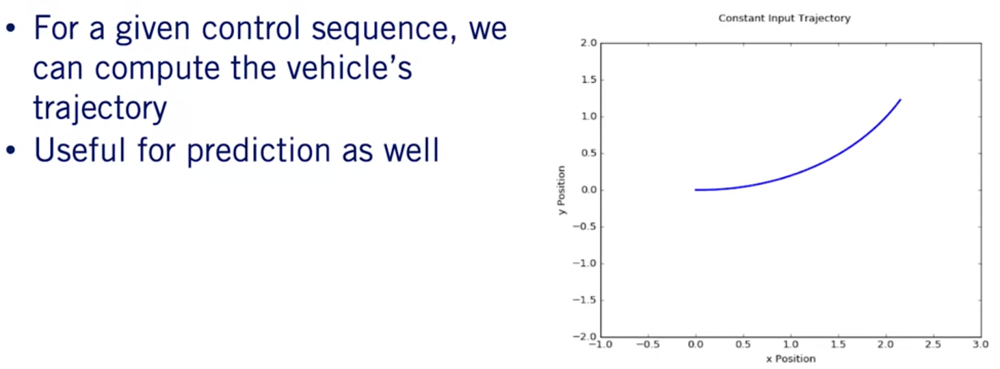
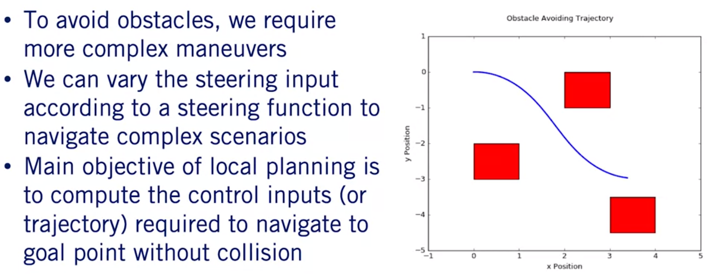

# Course-4 - W6 - MODULE 6: Reactive Planning in Static Environments

## Overview

- A reactive planner takes local information available within a sensor footprint and a global objective defined in a map coordinate frame to identify a locally feasible path to follow that is collision free and makes progress to a goal. 
- In this module, learners will develop a trajectory rollout and dynamic window planner, which enables path finding in arbitrary static 2D environments. 
- The limits of the approach for true self-driving will also be discussed.

**Learning Objectives**

- Given a kinematic model for a robot, calculate trajectories based on control inputs.
- Understand how to apply swath-based and circle-based collision checking.
- Implement the trajectory rollout algorithm.
- Understand the tradeoffs and advantages of applying dynamic windowing to the trajectory - rollout algorithm.

### Lesson 1: Trajectory Propagation

Welcome to the sixth module of our `Motion Planning` course.
- In this module, we'll introduce you to some of the concepts required for you to take a kinematic bicycle model and build a reactive motion planner from it.
- A reactive motion planner is one that takes in local information from the robot's surroundings in order to generate a trajectory that is collision-free and makes progress towards some goal location.
- We'll stick to static environments in this module as a first step on our way to planning behaviors and paths for self-driving cars.
- We'll also introduce the concepts of path prediction and collision checking as we go along.
- In this video, we'll be discussing how to generate trajectories in a discrete setting for a sequence of control inputs to our robot model.
- By the end of this video, you should understand the difference between a kinematic and dynamic motion model and you should have a firm grasp of the bicycle model that we introduced in course one.
- In addition, you should be able to generate trajectories from control inputs for our bicycle model.

**Kinematic vs Dynamic Model**

- First, we want to do a brief review of what a kinematic model is.

- A `kinematic model` gives the equations of motion for our robot while disregarding the impacts of mass and inertia on its motion.
- A `dynamic model` which instead takes mass and inertia into consideration at the cost of being more complex.
- Kinematic models focus on linear and angular velocities and occasionally, their derivatives as inputs, whereas dynamic models focus on forces and torques as inputs.
- To illustrate this, we have a kinematic particle model contrasted with the dynamic particle model with friction shown here.
- For path planning and trajectory optimization, we often focus on kinematic models to make the motion planning problem more computationally tractable and leave the issues raised by the simplification of the dynamics to the controller.

**Recall: Kinematic Bicyle Model**

- To give a concrete example, here we have the equations of motion for a bicycle model of our robot which you should recall from course one.

- What do these equations mean? Essentially, we define the base link of the robot as being in the position xy in a fixed coordinate frame.
- We also take the heading of the robot to be Theta relative to the x-axis.
- Taking these together, the xy position along with the heading Theta gives us the state of the robot at any point.
- For the bicycle model, the inputs given at each point in time are the velocity and the steering angle.
- These inputs along with the current state are what allow us to calculate how a trajectory will evolve with time according to the bicycle model kinematic equations.
 
One thing to take away from this is that we often do not have direct access to the state of the robot.

- We cannot tell the robot directly to go to a specific position in x and y.
- We can however, devise a sequence of control inputs, u sub n that will allow us to reach said xy position according to the kinematic equations.
- The sequence of control inputs will correspond to a trajectory that the robot will follow.

**Kinematic Model Discretization**

- Now that we've seen an example of some kinematic equations, you might be asking, *"How do we actually calculate a trajectory for a given sequence of inputs?"* 

- The kinematic equations we've given you essentially amount to a system of continuous time differential equations.
- For trajectory generation purposes, we'll be focusing on the discrete analog of these equations as discussed in course 1.
- By focusing on the discrete model, it allows us to easily and efficiently propagate trajectories for a given sequence of control inputs.
- Many methods exist for discretizing continuous time differential equations and we use a simple zero-order hold here and have provided you with additional resources in the supplemental materials if you'd like to see more.
- A consequence of the discretization of these equations is that we can implement the sum over all of the updates in the sequence recursively, which allows us to build up the full trajectory iteratively for a given sequence of inputs.
- This saves in computational effort because rather than recomputing a sum over all previous updates for each point in the trajectory, we can incrementally compute the next point of the trajectory using only the previously computed point.
- This is shown as the final right-hand side for each of the state variable equations.
- We will be using this recursive solution throughout this module.

**Constant Velocity and Steering Angle Example**

- If we now apply this discretization and step through an entire control input sequence, we will get an accurate approximation of the trajectory that the robot will follow.

- While this is useful for trajectory planning, it is also useful for motion prediction, where we know a kinematic model of a different agent in the driving scenario and we have an educated guess on the control inputs they will take.
- From this, we can estimate their future trajectory which can help us plan our motion to avoid collisions.
- As an example, suppose we take a constant velocity input as well as a constant steering angle to our bicycle model.
- As shown here in the animation, this results in the robot traversing the arc with constant speed while it's heading slowly changes with each time step.

**Varying Input for Obstacle Avoidance**

- If we instead vary the steering angle along the path according to some steering function, we can perform more complex maneuvers, which are critical for such tasks as obstacle avoidance.
  

- This is essentially the crux of the local planning problem, calculating the required control inputs to safely navigate to a given goal point.
- In the animation, we can see that driving with a constant steering angle as we did before would result in a collision.
- To remedy this, we have given the robot a sequence of different steering angle inputs in order to avoid the obstacle.
- We're now ready to start planning paths through environments with obstacles.

**Summary**

- In this video, we reviewed the difference between kinematic and dynamic models as well as the bicycle model that we introduced in course one.
- From there, we discussed how to compute trajectories for a given model and set of control inputs using our trajectory propagation algorithm.
- This algorithm will come in handy when we develop the rest of our motion planner in this module.
- Hopefully, this video has given you some insight on how to take a robot's kinematic model and generate a trajectory for it given arbitrary inputs.

### Lesson 2: Collision Checking
### Lesson 3: Trajectory Rollout Algorithm
### Lesson 4: Dynamic Windowing
### Module 6 Supplementary Reading

### Grade : Quiz

# References

# Appendices
