# Course-4 - W6 - MODULE 6: Reactive Planning in Static Environments

## Overview

- A reactive planner takes local information available within a sensor footprint and a global objective defined in a map coordinate frame to identify a locally feasible path to follow that is collision free and makes progress to a goal. 
- In this module, learners will develop a trajectory rollout and dynamic window planner, which enables path finding in arbitrary static 2D environments. 
- The limits of the approach for true self-driving will also be discussed.

**Learning Objectives**

- Given a kinematic model for a robot, calculate trajectories based on control inputs.
- Understand how to apply swath-based and circle-based collision checking.
- Implement the trajectory rollout algorithm.
- Understand the tradeoffs and advantages of applying dynamic windowing to the trajectory - rollout algorithm.

### Lesson 1: Trajectory Propagation

Welcome to the sixth module of our `Motion Planning` course.
- In this module, we'll introduce you to some of the concepts required for you to take a kinematic bicycle model and build a reactive motion planner from it.
- A reactive motion planner is one that takes in local information from the robot's surroundings in order to generate a trajectory that is collision-free and makes progress towards some goal location.
- We'll stick to static environments in this module as a first step on our way to planning behaviors and paths for self-driving cars.
- We'll also introduce the concepts of path prediction and collision checking as we go along.
- In this video, we'll be discussing how to generate trajectories in a discrete setting for a sequence of control inputs to our robot model.
- By the end of this video, you should understand the difference between a kinematic and dynamic motion model and you should have a firm grasp of the bicycle model that we introduced in course one.
- In addition, you should be able to generate trajectories from control inputs for our bicycle model.

**Kinematic vs Dynamic Model**

- First, we want to do a brief review of what a kinematic model is.

- A `kinematic model` gives the equations of motion for our robot while disregarding the impacts of mass and inertia on its motion.
- A `dynamic model` which instead takes mass and inertia into consideration at the cost of being more complex.
- Kinematic models focus on linear and angular velocities and occasionally, their derivatives as inputs, whereas dynamic models focus on forces and torques as inputs.
- To illustrate this, we have a kinematic particle model contrasted with the dynamic particle model with friction shown here.
- For path planning and trajectory optimization, we often focus on kinematic models to make the motion planning problem more computationally tractable and leave the issues raised by the simplification of the dynamics to the controller.

**Recall: Kinematic Bicyle Model**

- To give a concrete example, here we have the equations of motion for a bicycle model of our robot which you should recall from course one.

- What do these equations mean? Essentially, we define the base link of the robot as being in the position xy in a fixed coordinate frame.
- We also take the heading of the robot to be Theta relative to the x-axis.
- Taking these together, the xy position along with the heading Theta gives us the state of the robot at any point.
- For the bicycle model, the inputs given at each point in time are the velocity and the steering angle.
- These inputs along with the current state are what allow us to calculate how a trajectory will evolve with time according to the bicycle model kinematic equations.
 
One thing to take away from this is that we often do not have direct access to the state of the robot.

- We cannot tell the robot directly to go to a specific position in x and y.
- We can however, devise a sequence of control inputs, u sub n that will allow us to reach said xy position according to the kinematic equations.
- The sequence of control inputs will correspond to a trajectory that the robot will follow.

**Kinematic Model Discretization**

- Now that we've seen an example of some kinematic equations, you might be asking, *"How do we actually calculate a trajectory for a given sequence of inputs?"* 

- The kinematic equations we've given you essentially amount to a system of continuous time differential equations.
- For trajectory generation purposes, we'll be focusing on the discrete analog of these equations as discussed in course 1.
- By focusing on the discrete model, it allows us to easily and efficiently propagate trajectories for a given sequence of control inputs.
- Many methods exist for discretizing continuous time differential equations and we use a simple zero-order hold here and have provided you with additional resources in the supplemental materials if you'd like to see more.
- A consequence of the discretization of these equations is that we can implement the sum over all of the updates in the sequence recursively, which allows us to build up the full trajectory iteratively for a given sequence of inputs.
- This saves in computational effort because rather than recomputing a sum over all previous updates for each point in the trajectory, we can incrementally compute the next point of the trajectory using only the previously computed point.
- This is shown as the final right-hand side for each of the state variable equations.
- We will be using this recursive solution throughout this module.

**Constant Velocity and Steering Angle Example**

- If we now apply this discretization and step through an entire control input sequence, we will get an accurate approximation of the trajectory that the robot will follow.

- While this is useful for trajectory planning, it is also useful for motion prediction, where we know a kinematic model of a different agent in the driving scenario and we have an educated guess on the control inputs they will take.
- From this, we can estimate their future trajectory which can help us plan our motion to avoid collisions.
- As an example, suppose we take a constant velocity input as well as a constant steering angle to our bicycle model.
- As shown here in the animation, this results in the robot traversing the arc with constant speed while it's heading slowly changes with each time step.

**Varying Input for Obstacle Avoidance**

- If we instead vary the steering angle along the path according to some steering function, we can perform more complex maneuvers, which are critical for such tasks as obstacle avoidance.
  

- This is essentially the crux of the local planning problem, calculating the required control inputs to safely navigate to a given goal point.
- In the animation, we can see that driving with a constant steering angle as we did before would result in a collision.
- To remedy this, we have given the robot a sequence of different steering angle inputs in order to avoid the obstacle.
- We're now ready to start planning paths through environments with obstacles.

**Summary**

- In this video, we reviewed the difference between kinematic and dynamic models as well as the bicycle model that we introduced in course one.
- From there, we discussed how to compute trajectories for a given model and set of control inputs using our trajectory propagation algorithm.
- This algorithm will come in handy when we develop the rest of our motion planner in this module.
- Hopefully, this video has given you some insight on how to take a robot's kinematic model and generate a trajectory for it given arbitrary inputs.

### Lesson 2: Collision Checking

**Learning Objectives**

- In this video, we'll discuss the methods that we can use to ensure our motion plans don't collide with obstacles in the environment while we're making progress towards our goal.
- This step is clearly crucial in maintaining the safety of our autonomous car while it's driving.
- Specifically by the end of this video, you should understand some of the challenges of online collision checking.
- You should also understand to collision checking methods, swath-based collision checking, and circle-based collision checking.
- Finally, you should understand some of the hazards posed by imperfect information and discretization errors, and understand how we can mitigate these issues with conservative approximations.

**Collision Checking Challenges**

- At its core, collision checking in the context of motion planning is the process of ensuring a given trajectory or planned path when traversed by an object does not collide with any obstacles along the way.
  
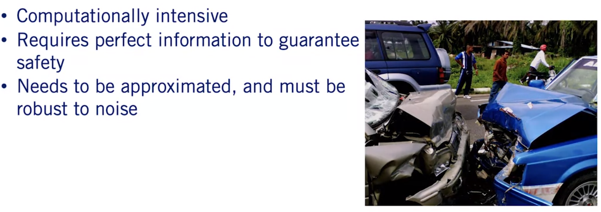

- An important aspect to note about collision checking is that it is a challenging, computationally intensive problem present in many domains, including autonomous driving and other robotic applications, gaming, 3D animation, and engineering design.
- Guaranteeing a safe collision-free optimal path not only requires perfect information about the environment, it also requires a prohibitive amount of computation power to compute in exact form especially for complex shapes and detailed environments.
- For autonomous driving which requires real-time planning, we have neither of these available to us.
- As you can recall from module two, the information given to us by the occupancy grid is an imperfect estimate, which means that we need to add buffers to our collision checking algorithms to make them more error tolerant.

**Swath Computation**

- In exact form, collision checking amounts to rotating and translating the footprint of a vehicle along every point of a given path.

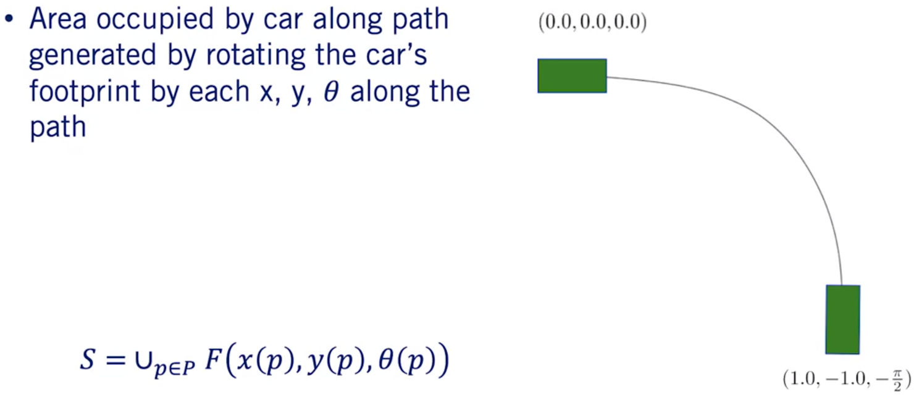

- Each point in the footprint is rotated by the heading at each path point and translated by the position of that same path point.
- This approach is summarized by the set S, where p is a path composed of a set of points p and F denotes a function that returns the set points contained in a footprint rotated by theta, and translated by x and y.
- For example, suppose I have a path point at one minus one and minus pi over two.
- To get the footprint at this point, I have to rotate the footprint by minus pi over two and then translate the base link of our car footprint by one and minus one.
- After performing this for every point along the path, the resulting swath of the car along the path is given by the union of each rotated and translated footprint.

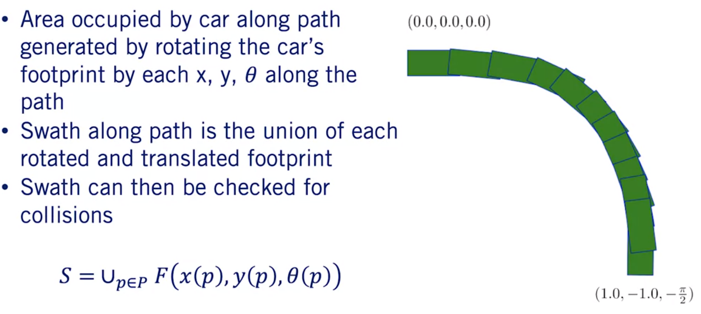

- We then check this entire set to see if there are any obstacles inside it.
- If there are, the path contains a collision and otherwise it's collision-free.

**Discretized Example**

- We now need to take the swath computation in its abstract form, and convert it to a discrete formulation that can be calculated by a computer.

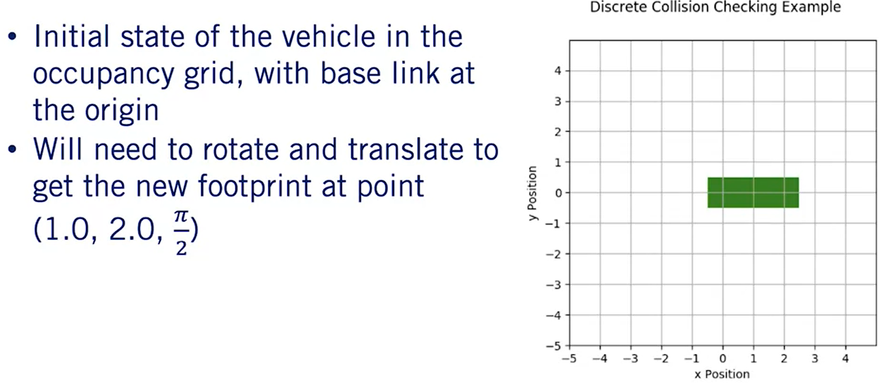

- Suppose we have a discrete representation of the cars footprint and the path in terms of the occupancy grid, which was discussed in module two.
- The cars footprint contains K points and the path is endpoints long.
- Algorithmically, computing the swath requires us to rotate and translate all K points in the cars footprint, and times one for each point in the path.
- Let's look at a concrete example of a rotation and translation using our occupancy grid.
- Suppose our occupancy grid has a resolution of one meter and our footprint occupies the following three grid points; zero, zero, one, zero, and two, zero.
- Suppose we have a path point that we would like to rotate and translate to at one, two and pi over 2.

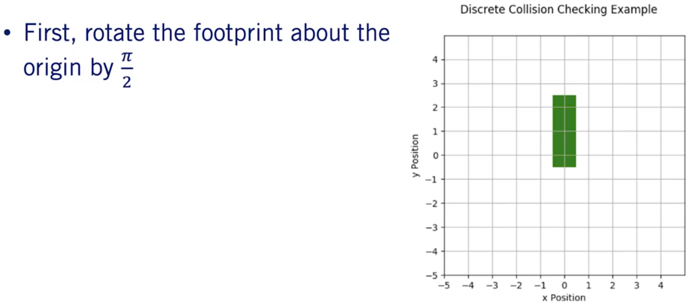

- First, we should rotate each point in the footprint about the origin by pi over two.

- Doing so, gives us new grid points at zero, zero, zero, one, and zero, two.
- To complete the footprint transformation, we then translate it by one and two.

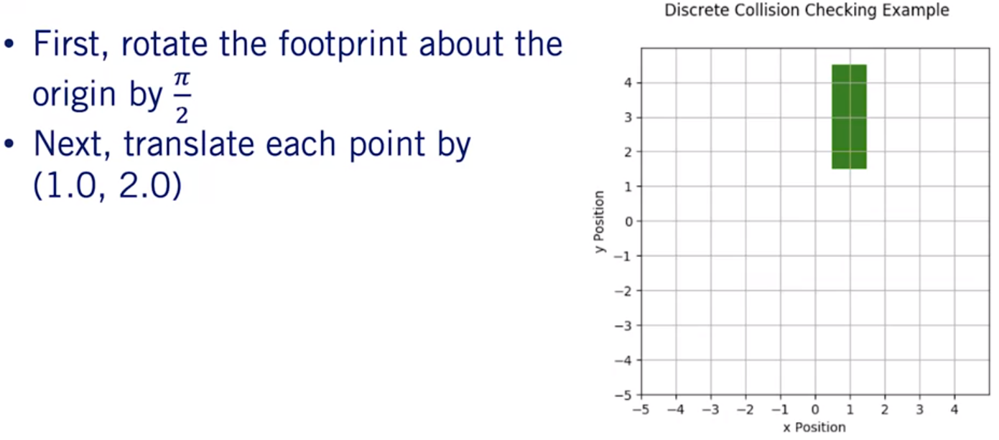

- Doing so, gives us the final grid points; one, two, one, three, and one, four.
- Recall that the order of the steps in this transformation matters.
- If we first translated and then rotate it about the origin, we would get an incorrect location for the transformed points.
- To get the actual occupancy grid index, we offset the x and y points by the capital x and y, which are the sizes of the x and y dimensions of the occupancy grid respectively.

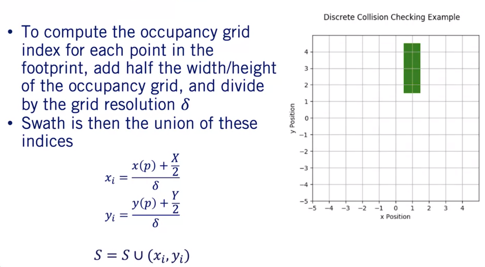

- We can then divide this by the grid resolution delta to get the associated indices in the occupancy grid.
- We then add each of these points to a set data structure.
- Since we are maintaining a set, we are ensuring that there are no duplicate points in our swath.
- As you can imagine, this computation becomes quite expensive as the problem scales, which makes it difficult to use when performing real-time planning.
- In addition, using the exact footprint when calculating the swath can be dangerous due to our imperfect information, as there is no buffer for errors in obstacle positions.

**Lattice Planner Swaths**

- Because this swath-based method is often computationally expensive, it is often useful when we are exploiting a lot of repetition in our motion planning algorithm as in the case in lattice planners.

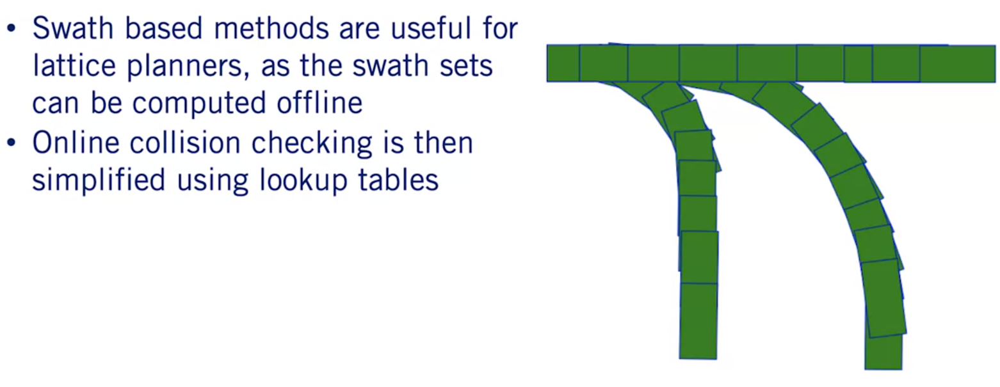

- Since we are constrained to a small set of control actions each step of a lattice planner, we are also constrained to a small set of swaths, so their union can be pre-computed offline.
- When performing collision checking online, the problem reduces to multiple array lookups.

**Speed and Robustness**

- To help mitigate both the challenge of imperfect information and extensive computation requirements, we often use conservative approximations to collision checking, sacrificing optimality to improve speed and robustness.

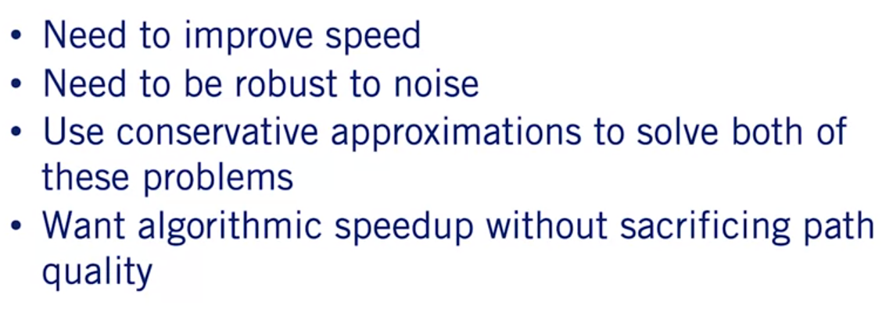

- In this context, optimality is defined by your selection of an appropriate objective function, some of which we discussed earlier in this course.
- Since we switched to approximate collision checking to gain computing performance, we must use approximations that are overly conservative.
- The goal in selecting a particular approximation is to find one that offers great algorithmic speed-up without compromising safety, but also minimizing the degree to which our trajectories become sub-optimal.

**Conservative Approximations**

*What do we mean by conservative approximation to collision checking?* 

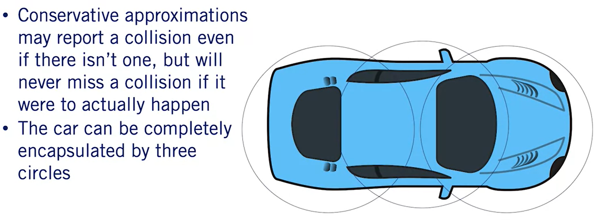

- In this context, a conservative approximation to collision checking would be one that may report a collision along a path even if there isn't one, but will never report no collision along a path if one does actually occur.
- For a concrete example, suppose we have a car as shown here.
- Now suppose we replaced the cars footprint with overlapping circles.
- The overlapping circles completely encompass the footprint of the cars rectangular body, which means the footprint of the car is a subset of the footprint of all three circles combined.
- No matter what trajectory we follow, the swath generated by the rectangle will be a subset of the swath generated by the overlapping circles.
- Why is this conservative? Suppose we have an obstacle inside the circle footprints but not inside the car footprint, this would result in a location being reported by the collision checker even though one wouldn't actually occur.
- However, if an obstacle lies outside of the circles, no collision will be detected and none will occur.
- This means that the collision checker may contain some false positive collisions, but will not contain a false negative.
- This results in a nice buffer for our car that helps alleviate the issues presented by the imperfect information provided to us.

**Circle Collision Checking**

- This circle approximation is useful for some algorithms because it is computationally cheap to check if a point lies within a circle.

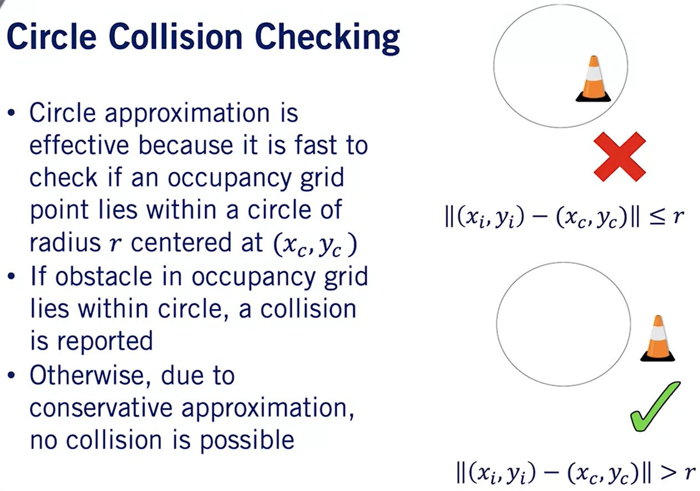

- All we need to do is check if the distance between any of the points of the obstacle and the center of the circle is less than the radius of the circle.
- For example, the position of this pylon from the center of the circle is less than the radius of the circle, so collision would be reported.
- However, for the second circle, the pylon lies outside the radius of the circle, which would result in this particular section of the path of the car being free from collision.
- If the occupancy grid is implemented such that it can provide the distance to the nearest object at each grid point, this can be a simple lookup in an array which is extremely efficient relative to checking for arbitrary polygon intersections.
- One thing to realize about conservative approximations, is that they may eliminate all feasible collision-free paths from a problem even though a path exists or eliminate safe passages through narrow openings.
- This can cause the planner to get stuck when it shouldn't or can cause the planner to compute a much more circuitous route than is necessary.
- Depending on which motion planning algorithm you use and the structure of your occupancy grid, different collision checking algorithms will be more efficient than others.
- It will be up to you as an autonomous driving engineer to decide which algorithm best suits your application.

**Discretization Resolution**

- One thing to note in all of these calculations is that they are all in discrete form since we are performing these computations on a computer.

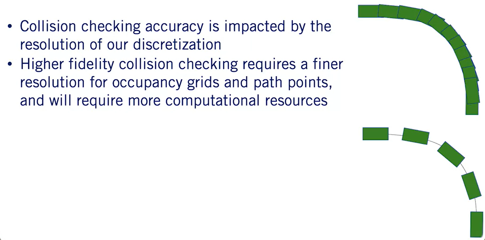

- Therefore, our collision checking accuracy is also influenced by the resolution that we choose when performing our discretizations.
- To illustrate this, suppose we have this same path and footprint but suppose one swath is computed with much coarser resolution than the other.
- We can see that the coarser resolution results in large gaps in our swath, which can result in errors if there are obstacles at those positions.
- The finer the resolution we choose for our collision checking, the more accurate it will be.
- However, higher resolution also incurs a computational cost.
- So you again, as an autonomous driving engineer will need to strike the right balance between accuracy and computational speed.
- Rest assured, there are many excellent collision checking libraries available and we've included some useful links for you to use in the supplemental materials.

**Summary**

- To summarize in this video, we discussed how we can use the occupancy grid developed in module two to solve the collision checking problem using swath-based collision checking.
- As well that we described the circle based collision checking method.
- We went over some examples to illustrate these algorithms and discussed in what situations each type of collision checking should be used.
- Hopefully, this video has given you some insight into how collision checking is done in an autonomous driving context.
- Performing quick and efficient collision checking especially with dynamic obstacles is currently an area of active research, and we hope that you too will help contribute to solving these challenging and interesting problems.
- In the next video, we will introduce a reactive planning algorithm for this module which is called the Trajectory Rollout algorithm.
- It will combine the collision checking approach we've developed here with the concepts covered in the trajectory propagation lesson.

### Lesson 3: Trajectory Rollout Algorithm

**Learning Objectives**

- In this video, we'll combine some of the knowledge we acquired from the two previous lessons, to develop a reactive motion planning algorithm known as the trajectory roll-out planner.
- This will introduce us to the task of trajectory planning, which will lay the groundwork for us to progress to more advanced planning methods presented later in module seven.
- By the end of this video, you should be able to implement the trajectory roll-out algorithm.
- This includes the trajectory propagation step, the collision checking step, and the path selection step in order to achieve the desired goal state.
- You should also understand how to apply the receding horizon concept to planning and the main drawbacks associated with this type of planner.

**Trajectory Rollout Planner**

- At a high level, the trajectory roll-out planner uses the method of trajectory propagation discussed in lesson one to generate a set of candidate trajectories that the robot can follow from its current point in the workspace.

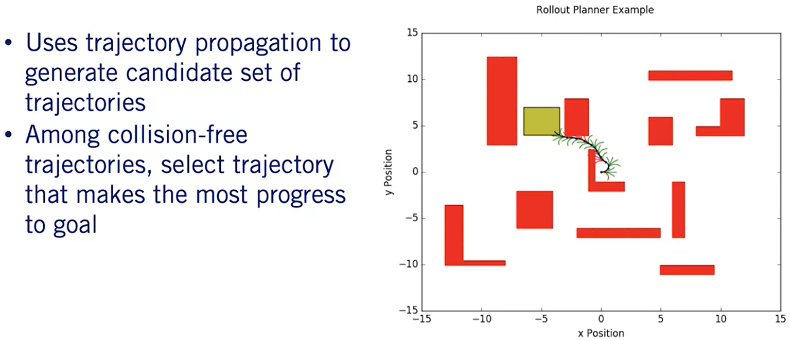

- We then take the obstacle information local to the robot and determine which paths are collision-free and which aren't.
- Of these collision-free paths, we then select the one that maximizes an objective function, which will include a term that rewards progress towards the goal.
- By performing this repeatedly, we end up with a receding horizon planner that reacts to the environment while making steady progress towards the goal.
- Let's go over each of these steps in more detail so you can implement this yourself.
- The first step of the algorithm is to generate the set of trajectories at each time step.

**Trajectory Set Generation**

- How do we do this? For trajectory roll-out, each trajectory will correspond to applying a fixed input to the robot for multiple steps over a constant time horizon.

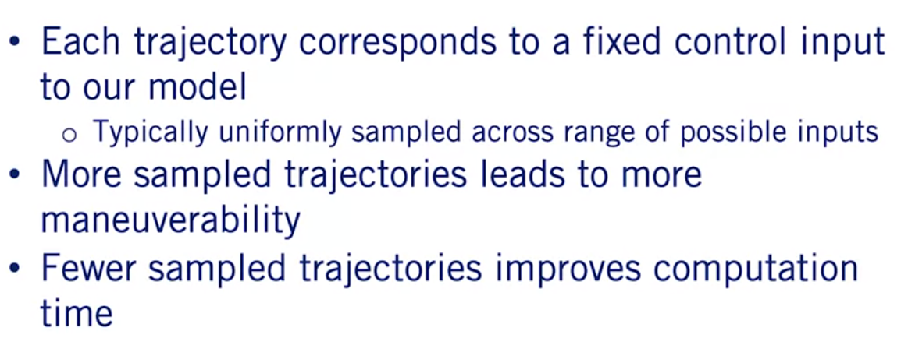

- We uniformly sample these fixed inputs across the range of available input values in order to generate a variety of potential candidate trajectories.
- By reaching a wide variety of trajectories across the input spectrum, we improve the quality of our trajectory search and our maneuverability as we are exploring a broader set of candidate paths for the robot to take.
- If we only use a small range of inputs, then our computation time improves.
- But there may be potential trajectory candidates that we miss out on in our computation, which could reduce the quality of the trajectory generated by our planner.
- However, sampling too many candidate trajectories means that we have additional computational overhead at each step as each additional trajectory will need to be generated, checked for collisions, and scored.

**Trajectory Propagation**

- Once we've chosen our set of inputs, we then need to generate the future states along the trajectory by propagating the state forward using the kinematic model of the vehicle as we discussed in lesson 1.

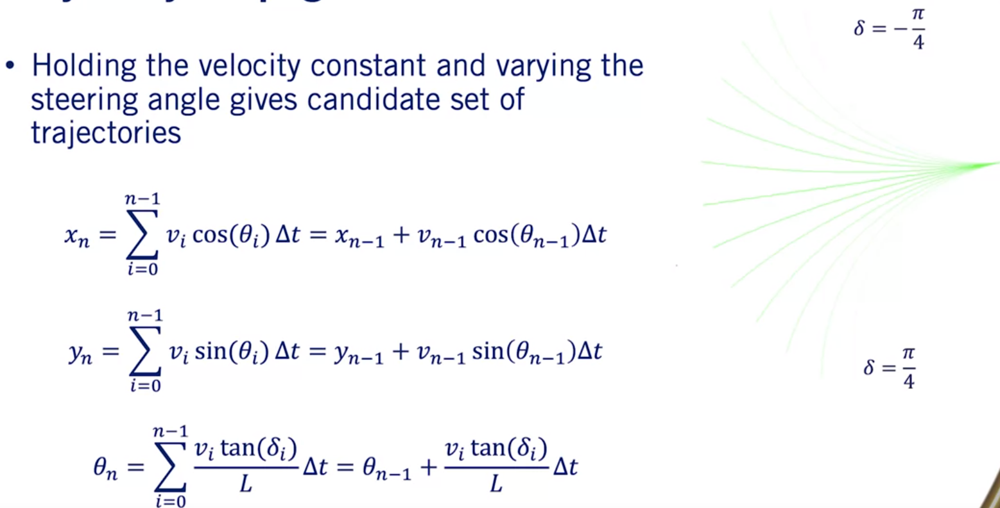

- Recall that for the bicycle model, the two inputs are the velocity in the steering angle.
- If we hold the velocity constant, but vary the steering angle across the range minus pie over four to pie over four, we now have a set of arcs as our candidate trajectories.
- These arcs are generated by evaluating the kinematic equations recursively as we discussed in lesson one.
- Now that we have the set of arcs, we can check to see which ones are collision-free.

**Swath Based Collision Checking**

- For a collision checking algorithm, we're going to assume that we are given an occupancy grid that represents a discretization of the vehicles workspace.

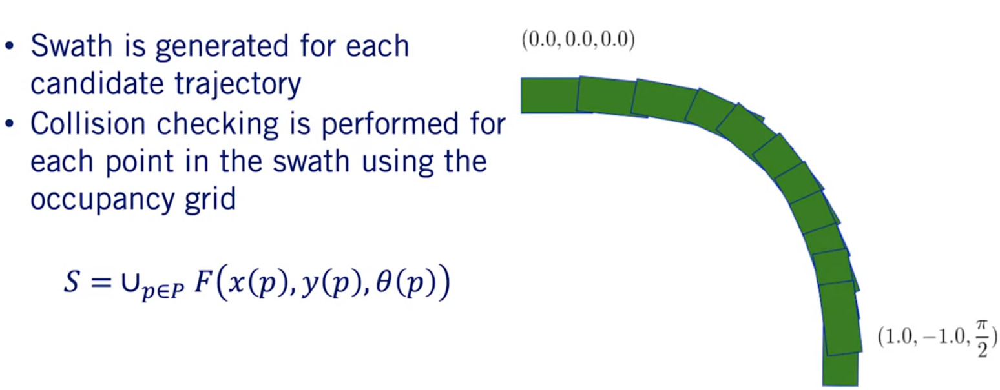

- This discretization will be stored in the form of a matrix where each value of the matrix will denote if the corresponding position in the workspace is occupied or not.
- We can then perform collision checking using the swath-based method we discussed in the previous lesson1.
- Recall that we generate the swath by sweeping the body of the robot along the path, and taking the union of all the footprints at each time step of a given trajectory.
- The footprint of the car will correspond to a set of indices in the occupancy grid.
- So each rotated and translated point along the path will also correspond to different indices in the occupancy grid.
- These indices will be stored in a set data structure to eliminate duplicates.
- We can then check each point of the swath to see which points of the swath overlap with occupied elements of the occupancy grid.
- We do this by iterating through each point in the swath set and checking the associated index in the occupancy grid for an obstacle.
- If any point in the swath is occupied, then that trajectory contains a collision.
- Once we've iterated through every trajectory generated in the previous step, we will be left with a set of collision-free kinematically feasible trajectories that we can then score using our objective function.

**Objective Function**

- The primary element that every objective function needs is some way of rewarding progress towards some goal point or region, which is the ultimate goal of our motion planning problem.

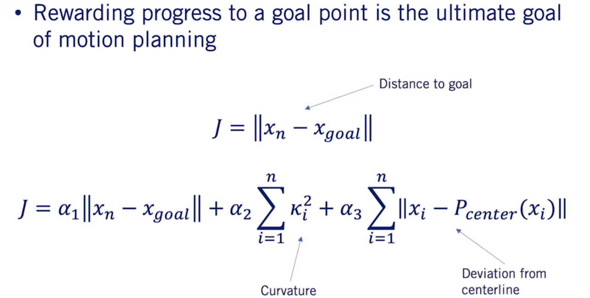

- A simple and effective way to do this is to have a term in the objective function that is proportional to the distance from the end of the candidate trajectory to the goal node.
- However, sometimes we will also want to encourage other behavior in our reactive planner.
- As we saw in module one, some examples of objective functions include minimizing the distance from the center line of a lane, we're penalizing the curvature of a path.
- Sometimes, we also want to reward paths that maximize the distance to the nearest obstacle, to maximize the flexibility of feasible paths available to future time steps in the planner.
- As we discussed in module one, there is no perfect objective function, and you will need to craft your own objective functions to fit your application.
- For our reactive planner, we will use the distance to the goal as our objective function to minimize, which is the first equation shown here.
- Once we have the objective function, we can iterate over the collision-free trajectories, and pick the path that maximizes the objective function, or minimizes the penalty depending on how you formulate the objective.

**Example**

- Let's go over a concrete example to bring the whole algorithm together.

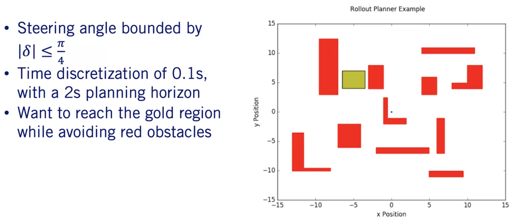

- Pictured here, we have the obstacles in the occupancy grid given in red, the goal region in yellow, and the initial point to the car at zero, zero, zero.
- Suppose our range of steering angles is between minus pie over four and pie over four with a pie over eight step size, and suppose we are using a constant velocity of 0.5 meters per second.
- In addition, let's assume our planner is using a time step of 0.1 seconds and each plan trajectory lasts for two seconds in total.
- If we apply our trajectory propagation algorithm that we outlined in lesson one using our bicycle kinematics model, we can then generate a set of paths for each selected steering angle in our steering range.

- The first trajectory has a steering angle of minus pie over four and as a result, we can see that the trajectory curves to the right.

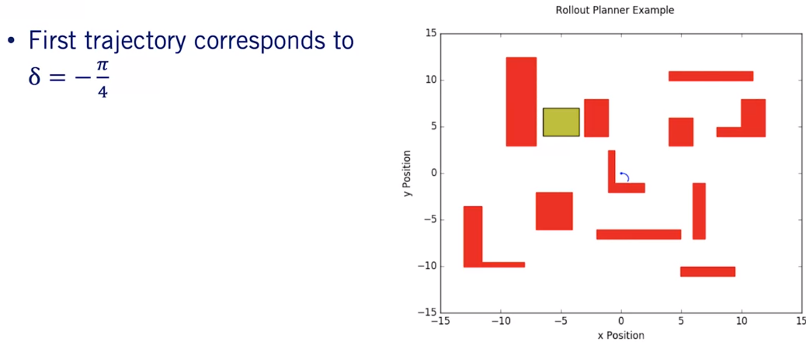

- Our next trajectory has a steering angle of minus pie over eight and as you can see, the trajectory generated has a smaller curvature than the first one.

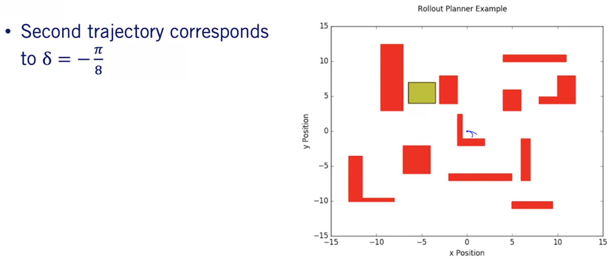

- Next, we have the zero steering angle trajectory which results in the car driving forward in a straight line.

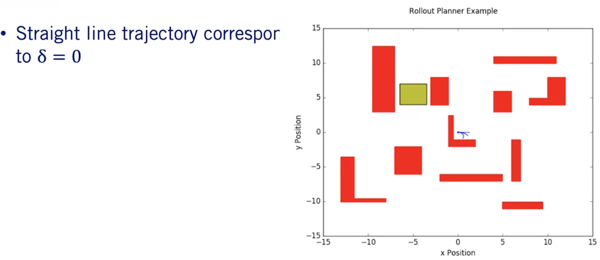

- The positive steering angle trajectories are symmetrical to the negative steering angle trajectories and as expected, turn the car to the left.

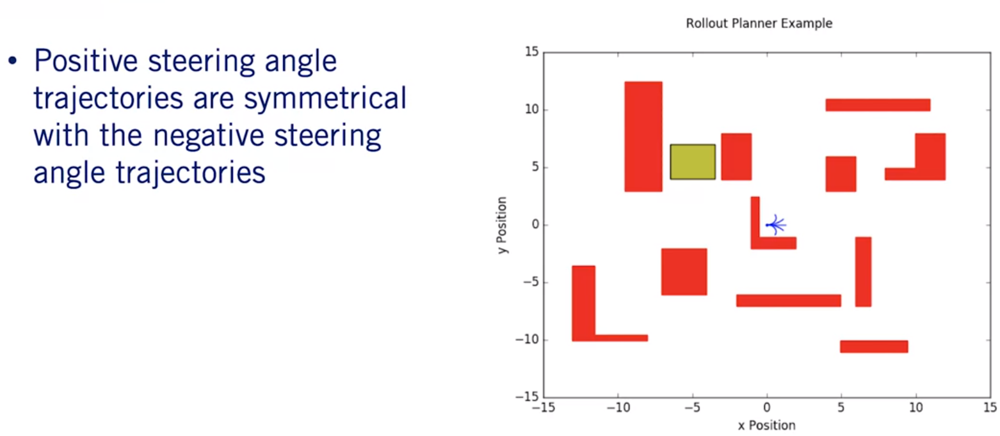

- Now that we have a candidate set of trajectories, we need to check each one to see if they are collision-free using the collision checking algorithm we outlined in the last video, and reviewed earlier in this one.

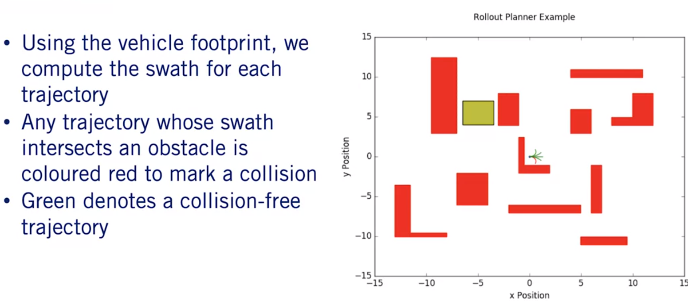

- After translating and rotating the footprints along each trajectory, we check each occupancy grid index in the resulting swath to see if an obstacle is present.
- If any of the indices contain an obstacle, then that path is marked as having a collision, which we've denoted by the color red.
- All collision-free paths are colored green, which we can then evaluate using our objective function to find the best one.
- Recall that our objective function is the distance to the goal.
- The path that minimizes this distance to the goal is now colored in black.
- This completes our first planning iteration.

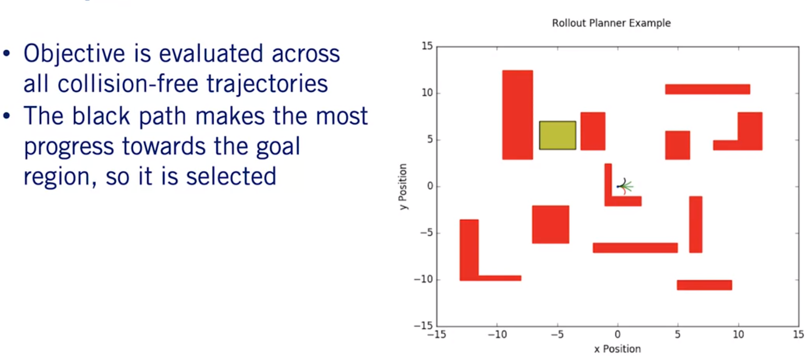

At this point, we now have a trajectory for the vehicle to execute.

- However, we will not fully execute this trajectory before the next planning cycle.

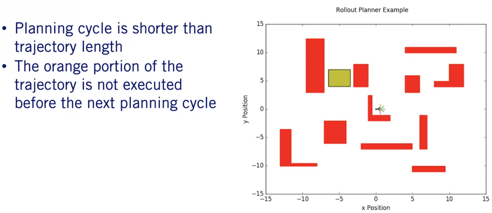

- Instead, the vehicle will execute only the first few points of the cycle.
- The exact number depends on the planning frequency and our planning horizon will be shifted forward depending on our progress.
- This is exactly the receding horizon approach you applied to vehicle control in the first course in this specialization.

**Receding Horizon Example**

- Bringing this all together, at each time step, we plan a 2 trajectory, but only execute 1 second of it at a time.
- By doing this, the end time of our planning horizon shifts forward by 1 second for each planning cycle.

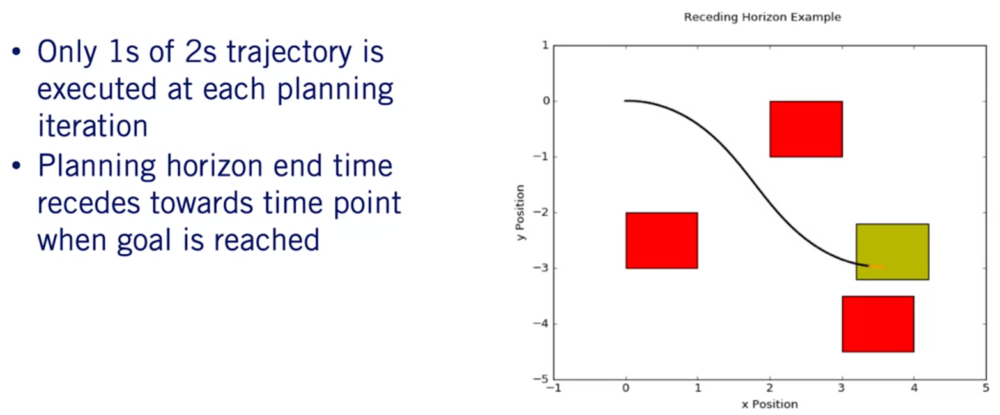

- This is known as a receding horizon planner because at each planning cycle we have a fixed planning time horizon whose n times slowly recedes towards the time point at which we reach the goal.
- This is illustrated here where the black is the portion of the trajectory that will be executed on the current cycle and the orange part is the leftover portion.

**Example**

- Once the next planning cycle begins, we repeat the whole process again.

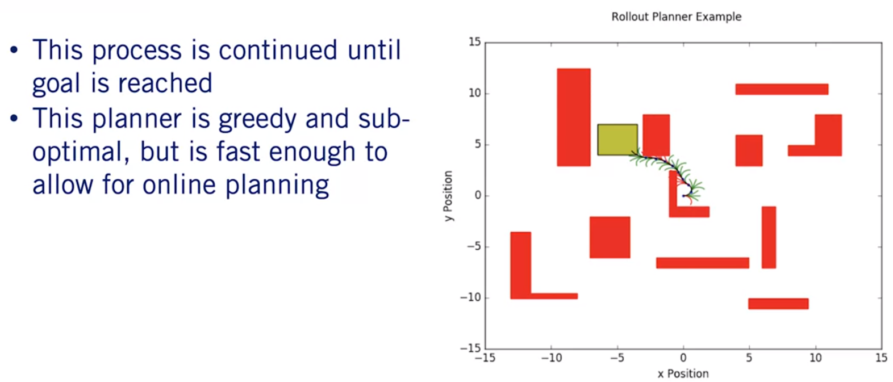

- We continue this process until we compute a trajectory that reaches the goal region, which we check at the end of each iteration.
- You can now see the rest of the steps that the planner took to the goal region in our example problem.
- One caveat to notice about this planner is that it is myopic.
- That is, it doesn't plan a path directly to the goal.
- It instead greedily sample sub-paths according to how close they get the robot to the goal.
- This can cause the planner to be shortsighted, to get stuck in dead ends, and in general, will cause the planner to find sub-optimal paths.
- However, this planner greatly reduces the complexity of the planning problem to the goal region and is fast enough that it can be used as an online planner.

**Summary**
- we introduce the steps of the trajectory roll-out motion planning algorithm.
- Combining the concepts introduced in the first two lessons regarding trajectory propagation, as well as, collision checking.
- To cement this concept, we went over an example from this algorithm in action.
- Finally, we introduced the concept of receding horizon planners and discussed how they can be shortsighted when planning to the goal region.
- By now, you should have a good idea of how the trajectory roll-out algorithm works.
- In our next lesson, we'll be discussing dynamic windowing, and how it can help our trajectory roll-out algorithm generate more comfortable trajectories.

### Lesson 4: Dynamic Windowing
### Module 6 Supplementary Reading

### Grade : Quiz

# References

# Appendices
