# Course-4 - W7 - MODULE 7: Putting it all together - Smooth Local Planning

## Overview

- Parameterized curves are widely used to define paths through the environment for self-driving.
- This module introduces continuous curve path optimization as a two point boundary value problem which minimized deviation from a desired path while satisfying curvature constraints.

**Learning Objectives**

- Recall the definition of parametric curves, motion planning constraints, and motion planning boundary conditions.
- Understand the differences between spirals and splines, and the tradeoffs of using either.
- Design optimization objectives suited to particular motion planning tasks.
- Use Python libraries to solve optimization problems.
- Implement a conformal lattice planner based on polynomial spiral optimization.
- Compute a velocity profile constrained by curvature, speed limits, and dynamic obstacles.

## Smooth Local Planning

### Lesson 1: Parametric Curves

**Learning Objectives**

- In this module, we'll discuss the lowest level of our hierarchical motion planner, which is the local planner.
- As a reminder, the local planner is the portion of the hierarchical planner that executes the maneuver requested by the behavior planner in a collision-free, efficient, and comfortable manner.
- This results in either a trajectory, which is a sequence of points in space at given times or a path and velocity profile, which is a sequence of points in space with the required velocities at each point.
- This plan can then be given as the reference input to the controllers that you developed in course one.
- In this module, we'll build upon the introductory reactive planner we developed back in module four, such that it is able to handle some of the nuances presence in the autonomous driving motion planning problem.
- In particular, we'll move from the discrete time to continuous time in order to produce smooth parameterized paths that are easy to track with our controllers.
- In this video, we'll introduce the path planning problem and its associated constraints and boundary conditions.
- As well, we'll discuss parametric curves and how they are useful for representing paths for this problem.
- In particular, you should understand the difference between splines and spirals in the context of motion planning, and the advantages and drawbacks of each.

**Boundary Conditions**

- The first step in understanding the path planning problem is to first understand its most fundamental requirements.

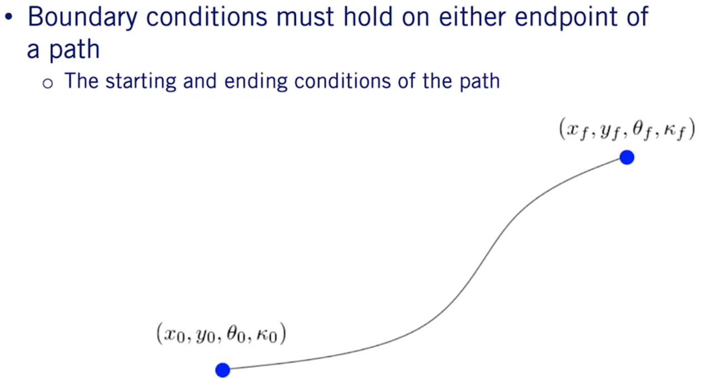

- For the path planning problem, this is given a starting position, heading, and curvature, find a path to an ending position heading and curvature that satisfies our kinematic constraints.
- In the context of an optimization, the starting and end values can be formulated as the boundary conditions of the problem, and the kinematic motion of the vehicle can be formulated as continuous time constraints on the optimization variables.
- In this context, the boundary conditions are the conditions that must hold on either end point of the path for a given optimization solution to be considered feasible.
- If these boundary conditions are violated, no matter how great the path is, we haven't achieved our core objective of actually getting to the point we want to get to.
- So the path is not useful to us.
- These boundary conditions will influence how we decide to set up the underlying structure of the optimization problem.

**Kinematic constraints** 

- For our path planner, our only kinematic constraint is going to be restricting the maximum curvature along the path.

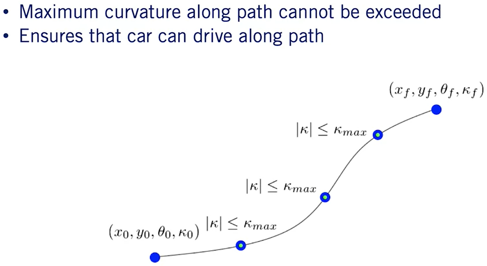

- In general, this is not easy to satisfy since there are infinitely many points along a continuous path.
- Instead, we will often take samples of the curvature at different points along the path, and constrain the curvature of each of these points.
- Assuming the path is relatively well-behaved, this will likely correspond to the curvature of the entire path satisfying the constraint.

**Parametric Curves**

- To simplify the representation of our optimization problem, we're going to define a path as a parametric curve.

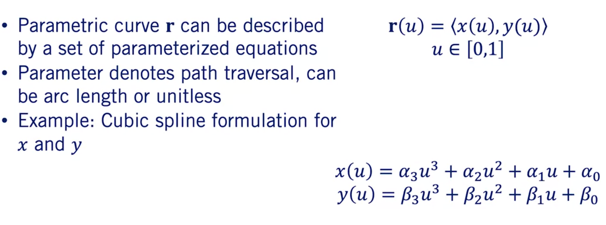

- **A parametric curve** is a curve that can be described as a set of equations with specific parameters.
- These parameters often denote path traversal, whether it will be through arc length or just varying from zero to one.
- For example, here we have a cubic spline set of parametric equations for the x and y positions of a path.
- The parameter of the equations u varies from zero to one, as we traveled from the start of the path to the end of the path.
- The vector valued function r contains the x and y position at each point corresponding to a given u value.

**Path Optimization**

- For autonomous driving, we often but not always require the path to be a `parametric curve`.

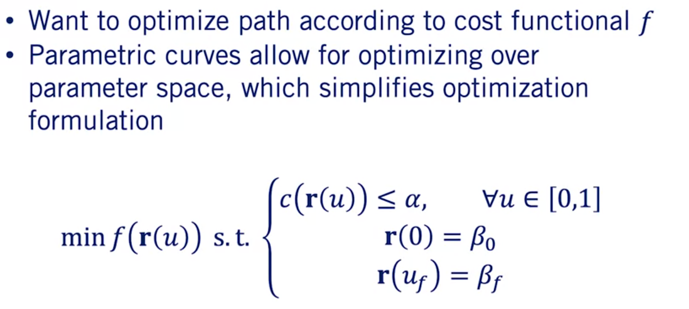

- We often focus on planning methods that optimize a given path according to boundary conditions shown here by Beta naught and Beta f, kinematic constraints shown here by Alpha, and an objective functional shown here by f.
- Having a parametric representation of the path make setting up the optimization problem simpler, as we have a function we can directly give to our objective functional f.
- Note that the term functional refers to mappings that takes a function as their argument and return a real value, so it can be used to define a cost over a space of functions or parametrized curves.

**Non-Parametric Path**

- We can contrast this parametric curve approach with the reactive planner in module four, where we represented the trajectory and the path with a sequence of points in space.

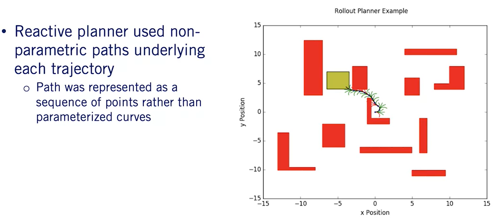

- This is known as a non-parametric path since the curve we followed did not have a parametric representation.

**Path Parameterization Examples**

- In the field of autonomous driving, there are two common types of path parameterizations.

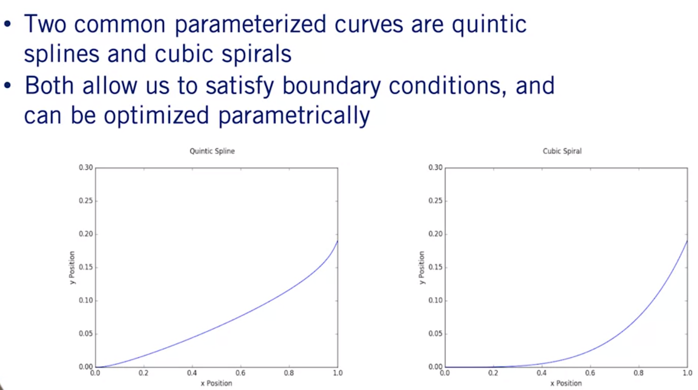

- The first are quintic splines which are fifth order polynomial functions of the x and y position of the car.
- The second type is the polynomial spiral, given by a polynomial curvature function with respect to arc length.
- Pictured here is a third order polynomial spiral, a cubic spiral, both of these parameterized curves give us the means to satisfy the boundary conditions we just discussed, and also offer us parameters to use in objective functions to craft the paths according to our requirements.
- Selecting either of these has associated tradeoffs.
  

**Quintic Splines**

- First, let's discuss the quintic spline.

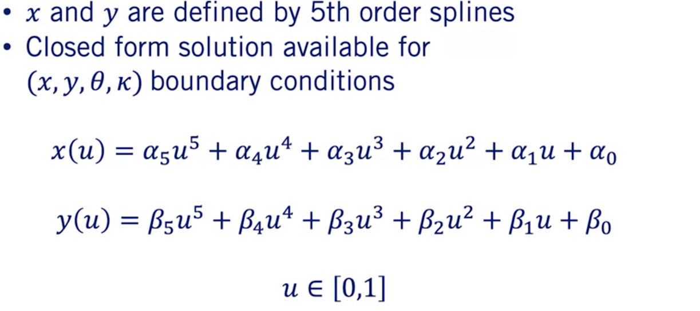

- The quintic spline is given by two equations, one for the progression of x along the spline and one for y.
- Here we can see that the quintic spline has 12 parameters, six for the x equation and six for the y equation.
- These parameters correspond to the polynomial coefficients that form the shape of the curve.
- The traversal parameter u is fairly arbitrary here.
- For simplicity, we take it to be in the range of zero to one.
- What this means is that u equals zero corresponds to the start of the path, and u equals one corresponds to the end.
- A nice property of the quintic spline is that for given position heading and curvature boundary conditions, there is an immediate closed form solution for the spline coefficients that satisfy them.
- The solution is quite long so we won't listed here, but it is still cheaper to evaluate than generating a path using an iterative optimization method.
- See the supplemental materials for a full listing.
- There are also additional degrees of freedom which can be further optimize depending on this application.
- This is desirable because it allows us to generate a feasible solution to the boundary conditions immediately, which can be further refined in anytime fashion.

**Quintic Splines Curvature**

- The downside with quintic splines is that it is often hard to constrain curvature within a certain set of bounds as is often required in autonomous driving.

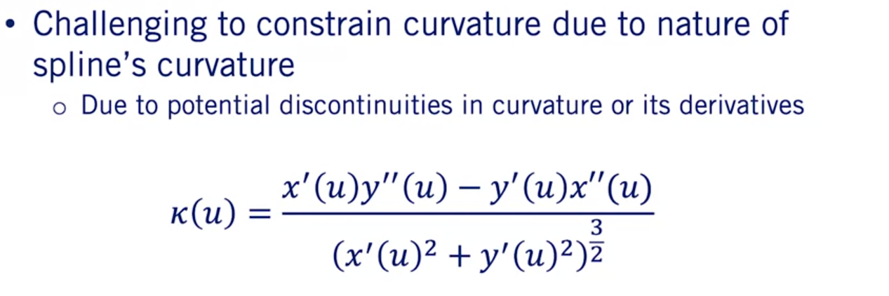

- If we look at the curvature equation for a parametric curve, we can see that for our quintic splines, the curvature as a function of arc length will not in general be a polynomial.
- This has the potential to introduce cusps or even discontinuities of the curvature in the spline, which makes it difficult to approximately satisfy curvature constraints across the entire domain of the spline.
- We will discuss these curvature constraints in more detail in our next lesson, where we set up the optimization problem for path planning.

**Polynomial Spirals**

- As an alternative approach, we can also employ polynomial spirals to represent our path.

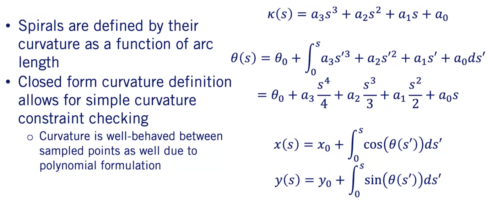

- These curves offer a closed form equation for the curvature of the curve along each point of its arc length.
- For autonomous driving, it is common to select a cubic polynomial as our curvature function of arc length.
- However, higher-order functions are also acceptable.
- The main positive of using polynomial spirals is that their structure is highly conducive to satisfying the approximate curvature constraints that are often required by the path planning problem.
- Since a spiral is a polynomial function of curvature, the curvature value will not change extremely quickly like it can in the case of quintic splines.
- This means we can constrain the curvature of only a few points in the spiral and the spiral will very likely satisfy the curvature constraints across the entire curve.
- This is highly useful when performing path optimization, as the number of constraints greatly increases the computational effort of each optimization step.

**Polynomial Spiral Position**

- The downside of using polynomial spirals is that there is no closed form solution of the position and heading of the spiral, unlike the case in the quintic spline.

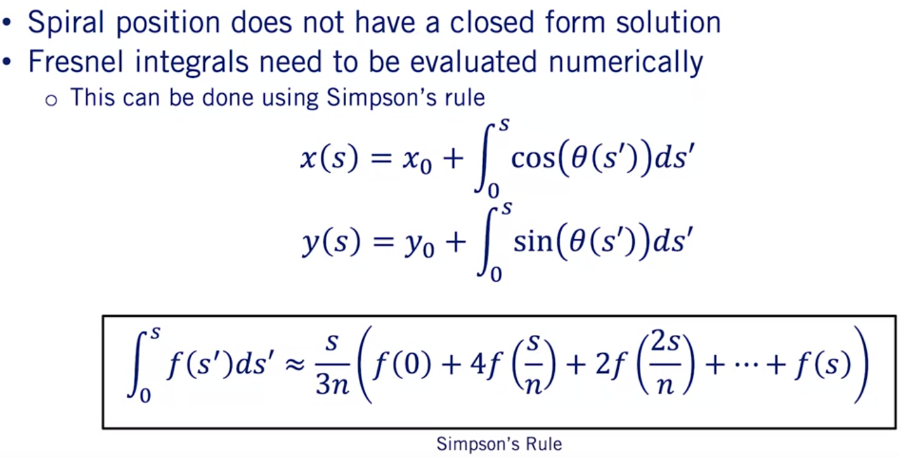

- Therefore, we must perform an iterative optimization in order to generate a spiral that satisfies our boundary conditions.
- As can be seen here, the position equations results in Fresnel integrals, which have no closed form solution.
- We therefore need to use numerical approximation techniques to compute the final end points of the spiral.
- In this module, we will approximate these Fresnel integrals using Simpson's rule shown here on the third line.
- Simpson's rule is more accurate with fewer points than other approximation methods, which will be useful when we setup our optimization problem.
- When it comes to the strengths and weaknesses of the spiral, we almost have a duality when compared to the spline, each has a weak point where the other is strong.
- The spline provides closed form solutions based on start and end points alone, whereas the spiral does not.
- The spiral ensures smooth curvature variation along the path, while the spline does not.
- You will therefore need to determine which method is appropriate depending on your specific application.
- As a brief shorthand, the spline leads to computational efficiency, while the spiral leads to easier implementation of curvature constraints.
- For this module, we will focus on the polynomial spirals as we develop our path planner, as we have a strong interest in ensuring the paths generated by our local planner can be executed smoothly and safely by the vehicle.
- However, many of the techniques described going forward can also be applied to quintic splines.

**Summary**

- We gave you an overview of the boundary conditions and parametric curves used in autonomous driving path planning, and we introduced splines and spirals as alternative path representations, and discuss their differences in the path planning context.
- In our next lesson, we'll be discussing how to set up the path planning optimization problem using the cubic spiral parametrization we discussed in this lesson, as well as the constraints and objective functions we defined earlier in this course.

### Lesson 2: Path Planning Optimization

**Learning Objectives**

- In this lesson, we will discuss how to incorporate some of the objectives and constraints we discussed in module one with the cubic spirals in boundary conditions we introduced in the last lesson to create a path planning optimization problem.
- By solving this problem, we'll be able to generate smooth, feasible paths that satisfy all of our constraints.
- By the end of this video, you should be able to: Identify the boundary conditions and constraints required for smooth path planning using polynomial spirals, approximate some of the required constraints to improve the tractability of the optimization problem, and know how to map the required parameters in such a way that the optimization problem converges quickly to a feasible solution.

**Cubic Spiral and Boundary Conditions**

- If you recall from the previous lesson, our boundary conditions described the absolute minimum requirements for a path being planned between two points.

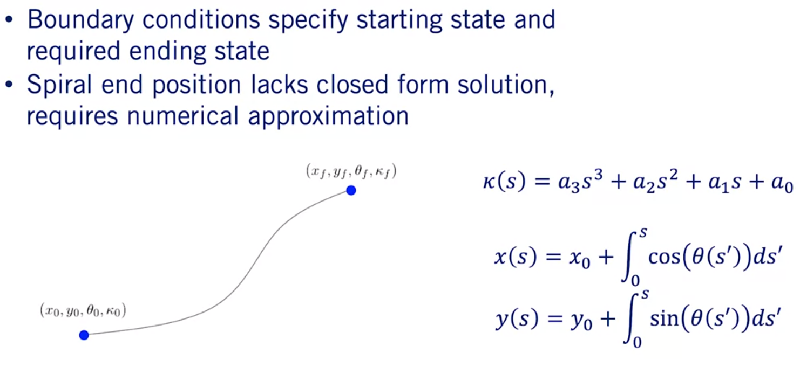

- Essentially, they require that for a given starting position heading and curvature, our planned path ends at a specific position heading and curvature as well.
- This will give us our first set of constraints on our optimization problem known as boundary conditions which we can see here.
- Unfortunately, as we discussed in the last lesson that cubic spiral does not have a closed form solution for the position at the end of the spiral.
- To write our constraints in terms of the parameters of the spiral, we will need to use a numerical integration technique.
- Many exist, but we'll apply `Simpson's rule` which we briefly mentioned in the previous lesson.

**Position Integrals and Simpson's Rule**

- Simpson's rule is a commonly used numerical integration technique that is generally more precise than other simpler numerical methods.

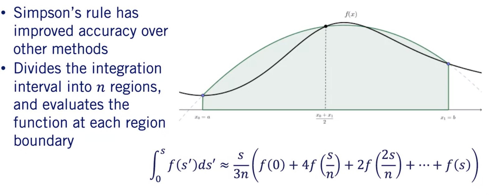

- This is because it evaluates the integral of the quadratic interpolation of the given function rather than the integral of the linear interpolation as in some methods such as midpoint and trapezoidal rules.
- Simpson's rule proceeds by defining a number of equally spaced divisions of the integration domain defined by n, and then summing terms at each division and boundary point.
- For example, if we choose n equal to four, then we are splitting the integration domain into four equally sized segments, and we therefore have five points to include in our sum.
- Each term in the sum is the function evaluated at the division point multiplied by the appropriate coefficient.
- In the interior of the Simpson's rule equation, we can see that we have alternating coefficients of four and two for each term except for the endpoint terms which have a coefficient of one.
- As one would expect, as n increases, we get a more accurate approximation to our integral.

**Applying Simpson's Rule**

- Let's apply this to our specific planning problem.

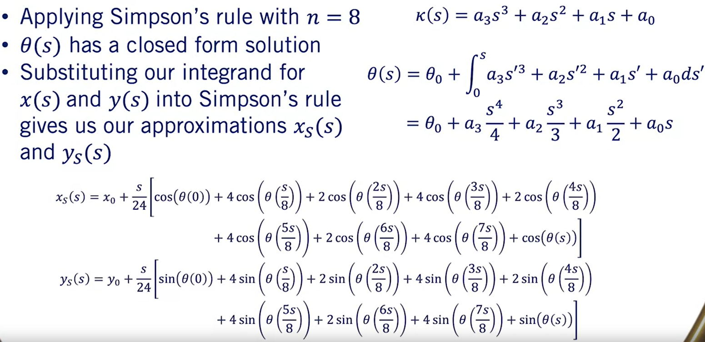

- If we take n equals eight in the Simpson's rule approximation, our approximation will be accurate enough for the optimizations we'll be performing without being too computationally expensive.
- Since the heading Theta is just the integral of the cubic spiral function, we can explicitly define a closed form solution for it which is a fourth order polynomial which is shown here.
- We can then use the values of Theta at each division point in a Simpson's rule approximation to compute the x and y positions of the cubic spiral.
- The integrands to be integrated for x and y are cosine of Theta of s and sine of theta of s respectively, which are substituted in for f in the Simpson's rule to form the following expressions.
- We now have a useful approximation to the X and Y position of the spiral at any given arc length point defined by our arc length parameter s.
- We will denote the approximations to x and y as computed using Simpson's rule as x sub s and y sub s.

**Boundary Conditions via Simpson's Rule**

- Returning to our boundary conditions, we now have an approximation for the path ending location and we can write out the boundary conditions in terms of the known parameters of the spiral.

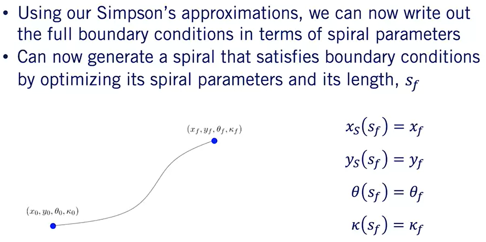

- We can now generate a spiral from one point to another that satisfies the given boundary conditions by iteratively optimizing the parameters of the spiral as well as its total arc length Sf.
- Before we do that, however, let's go over the kinematic constraints we would like to enforce.

**Approximate Curvature Constraints**

- Specifically for autonomous driving path planning, we're going to be focusing on curvature constraints.

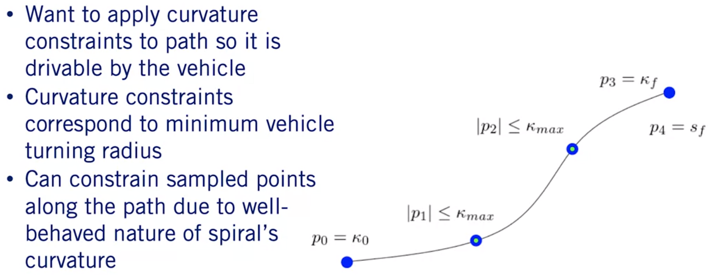

- Cars have an absolute minimum turning radius and need to stay within lateral acceleration limits to maintain wheel traction and ride comfort in the vehicle.
- We'll discuss these constraints in more detail in future lessons.
- For now, let's assume that our car can achieve a minimum turning radius of two meters.
- This corresponds to a maximum curvature of 0.5 arc meters.
- Now, it's quite difficult to write out this curvature constraint at every single point along the spiral.
- However, because of the polynomial nature of the spiral, we only have to constrain a few evenly spaced points.
- Because the polynomial function of curvature is continuous and well-behaved, we're likely to generate a spiral that satisfies our curvature requirements when performing the optimization.
- For simplicity, let's constrain the curvature at the one-third and two-third points of the curve.

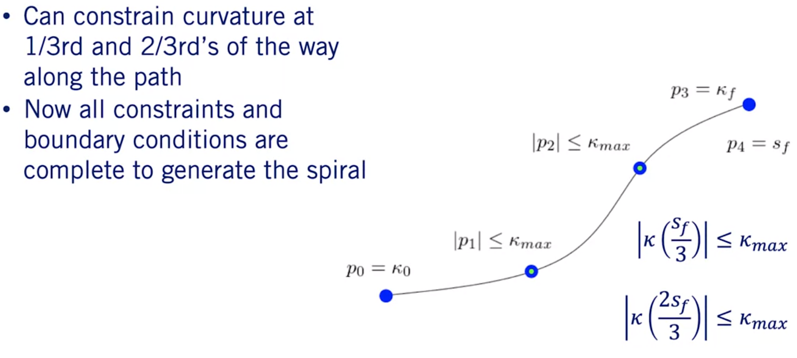

- The start and end point curvatures were already constrained in the boundary conditions.
- Once we've done this, we now have our curvature constraints as a function of the parameters of the spiral, and we have all of our required constraints to solve the optimization problem.

**Bending Energy Objective**

- The final piece of the puzzle is the actual objective function we wish to minimize.

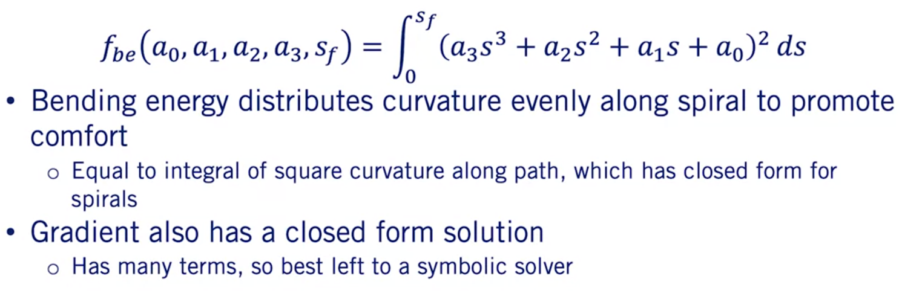

- We want to encourage smoothness and comfort along our planned path.
- One way to do so is to distribute the absolute curvature evenly along the path.
- This can be done by minimizing the bending energy of our planned parametric curve.
- The bending energy of a curve is the integral of its squared curvature along the entire arc length of the path.

- Since we have a polynomial function of curvature describing our cubic spiral, the bending energy integral has a closed form solution in terms of the spiral's parameters.
- In addition, its gradient also has a closed form solution.
- Both of these expressions have many terms however so it's best left to a symbolic solver to create them.
- The fact that the objective function and its gradient have closed form solutions make it an objective function that is highly conducive to nonlinear programming which we will discuss in our next lesson.

**Initial Optimization Problem**

- Now that we have our objective function, we can put everything together into our path planning optimization problems shown here.

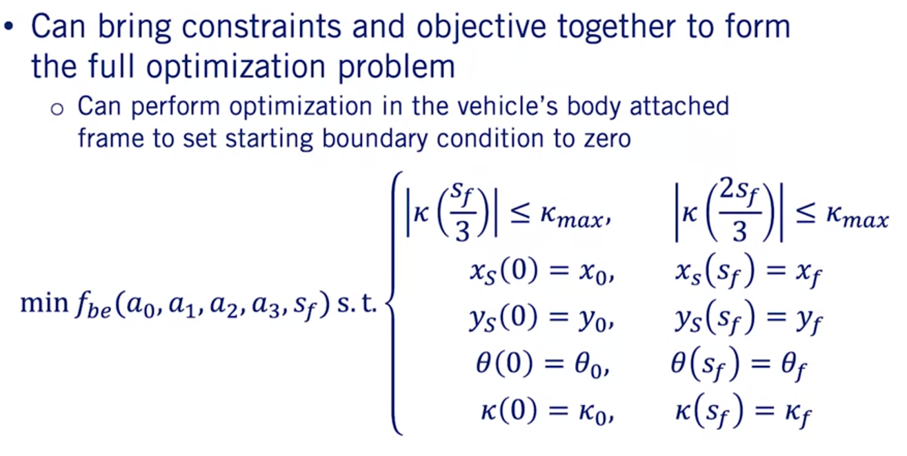

- For our purposes, we're going to assume the initial boundary conditions are zero, which means that we are defining our local planning problem in the vehicle frame and results in the simplified expressions for the heading and x and y approximations using Simpson's rule we've defined in this lesson.
- This means that the initial boundary value constraints can be removed since they are already accounted for in our integral calculations.
- Now we could very well stop here and use this as our path generating optimization problem.
- However, there is a practical issue with how this optimization problem is set up that may slow it down or cause it not to converge at all when solved using canonical non-linear programming solvers.

**Soft Constraints**

- The main issue we can see here has to do with the equality constraints of the final position and heading.

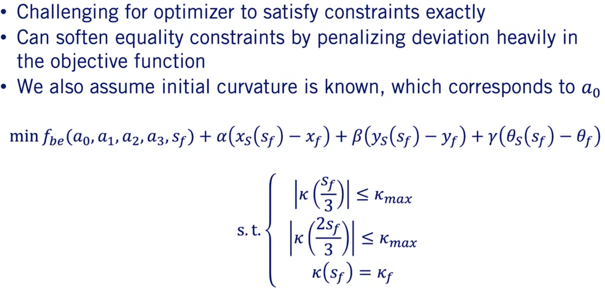

- Because equality constraints must be satisfied exactly, it is quite hard for a numerical optimizer to generate a feasible solution from an infeasible starting point which is often what is given to the optimizer for an arbitrary problem instance.
- To alleviate this issue, it is common in optimization to soft inequality constraints to improve optimizer performance.
- Soft constraints convert a strict constraint into a heavily penalized term in the objective function.
- By heavily penalized, we mean that the constraint penalty term coefficient should be at least an order of magnitude larger than the general optimization objective.
- Although this allows the optimizer to violate the boundary condition equality constraints, the optimizer will be strongly encouraged to converge to a solution that is as close as possible to the boundary conditions before the bending energy penalty term will be large enough to influence the optimizer.
- We will also assume that our initial curvature is known and is usually set to zero which corresponds to a naught equal to zero.
- This reduces the number of optimization variables by one.
- After softening these constraints, our new optimization problem is as follows.
- We have one further issue we need to address before defining the final version of our optimization to be implemented.

**Parameter Remapping**

- The final issue we can address has to do with the optimization parameters.

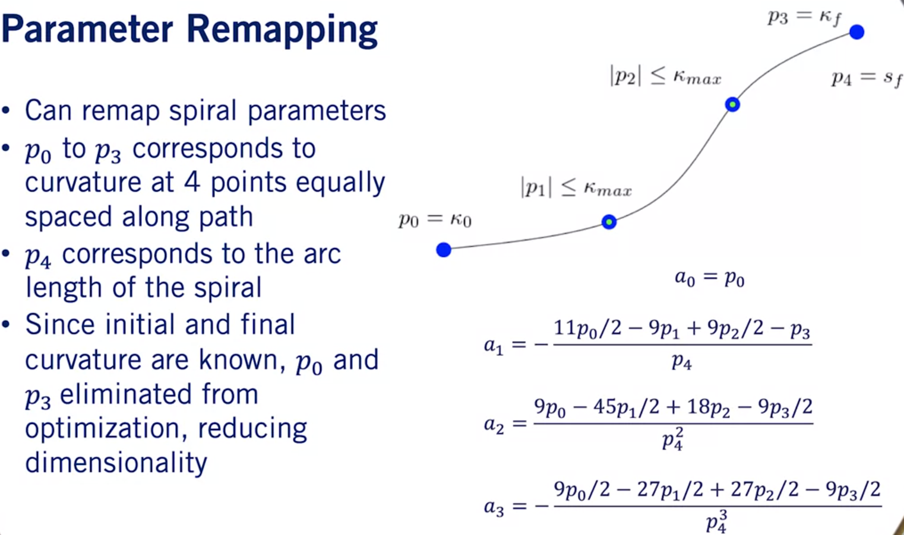

- While there is more intuition to using the cubic spiral coefficients in our objective function, we can actually reduce the number of parameters we are searching over by taking the final curvature boundary constraint into consideration.
- Let's redefine our cubic spiral using a different set of parameters denoted by the vector p where p has five elements.
- First, we have p naught through p3, which denote the curvature at the start, one-third point and two-thirds point and the endpoint.
- The final term p4 is the final arc length of the path.
- Conveniently, we have a closed form mapping between the curvature parameter and the spiral parameters as shown here.
- We can therefore easily compute all of our constraints and objective terms as a function of these new p variables instead of the coefficients of the spiral.
- Once the optimization is solved, we can use the equations here to map the results back to the spiral coefficients.
- Since we already know the initial and final curvature, we can eliminate two of the variables, p naught and p3.
- This leaves us with only three variables in our optimization problem p1, p2, and p4.
- By using the boundary conditions, we've reduced the dimensionality of the optimization problem which will result in a significant computational speedup.

**Final Optimization Problem**

- The resulting final optimization problem is as follows.

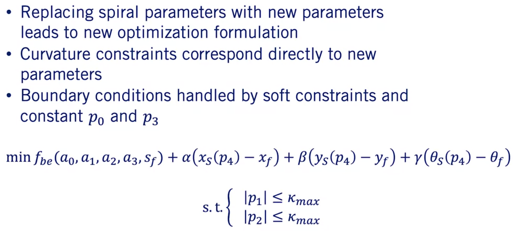

- We've replaced the function of the spiral parameters by the equivalent functions after remapping to our p parameters.
- Note that the initial and final path curvature p naught and p3 are constants.
- So the optimization variables are now only p1, p2, and p4.
- This simplification was possible due to the boundary conditions of the curvature being known at the start and the end of the path.
- Now that we've made these modifications, we can solve the path planning problem efficiently and with greatly reduced chance of getting stuck in poor local minima.

**Summary**

- First, we reviewed the required boundary conditions and constraints for this problem.
- We then discussed how to numerically compute the n positions of a spiral using Simpson's rule.
- We then introduced the bending energy objective to encourage smoothness and formed a generic spiral optimization problem.
- Finally, we re-map the parameters of the optimization function to ensure fast convergence to a feasible solution.
- Well, that was a lot of new information to take in.
- We hope that this lesson has given you an in-depth look at how to perform smooth path planning.
- This lesson has tied together many of the topics that we discussed in modules one and four.
- So if you felt like some of this material was challenging, feel free to review those modules before working through this lesson again.
- In our next lesson, we will be discussing how to perform optimization in Python in order to prepare you to implement a full path planner.

### Lesson 3: Optimization in Python

**Learning Objectives**

- In this lesson, we're going to go over the basics of optimization in Python to help cement some of the optimization concepts we've discussed in the previous lessons of this module, and in fact, throughout this specialization.
- In particular, we're going to go through some of the functions required to solve a generic non-linear optimization problem using the SciPy optimize library.
- By the end of this video, you should know how to set up and call a constrained optimization problem using this library.
- In particular, you should know how to pass Jacobians to the optimizer, as well as any required parameter bounds defined in the optimization problem.

**Minimize Function**

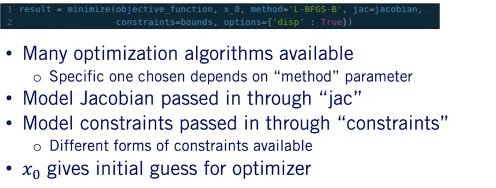

- The field of optimization is a wonderfully rich area of study which we cannot explore in detail in this specialization.
- The SciPy optimized library covers a handful of some of the most popular optimization algorithms making them easily accessible and ensuring reasonable efficiency in their implementation.
- Many of the implemented optimization methods have a similar structure in terms of what type of parameters they require.
- So to abstract this away into a simple interface, the SciPy optimized library contains a generic minimize function.
- Some examples of the available optimization methods include conjugate gradient, Nelder-Mead, dogleg, and BFGS.
- For more details on these methods, see the links in the supplemental materials.
- The specific optimization algorithm run by the library will depend on the method parameter that you pass to this function.
- The method parameter will also determine which additional parameters the optimization algorithm requires.
- For example, in the L-BFGS-B algorithm that we'll use, we require not only the model to minimize, but also the models Jacobian and variable bounds.
- In the case where the model is a single scalar valued function, the Jacobian reduces to the gradient.
- This Jacobian is passed to the minimize function through the jac parameter as shown in this function call.
- The actual function we wish to minimize is the first argument to the minimize function.
- The constraints are passed to the constraints variable as a list of constraint dictionaries or objects.
- In addition, there is also the optional options parameter which advanced users can use to customize things like what is output by the optimizer.
- These optimization algorithms also require an initial guess for the optimization variables for the model or objective function, and this is given by x naught in the function call.

**Objective Function and Jacobian**

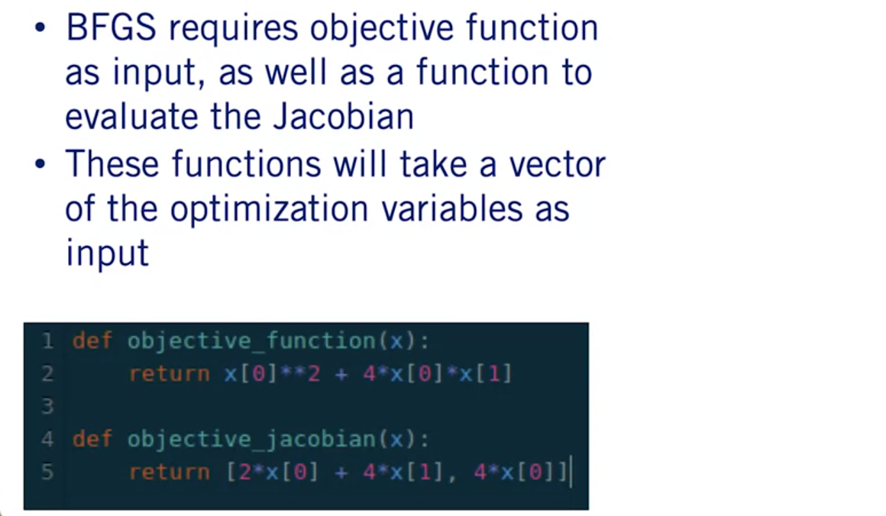

- Let's look at the BFGS algorithm for a concrete example of how to implement an optimization with SciPy.
- Essentially for the BFGS algorithm, we are required to pass in the function pointer to the actual objective function we wish to minimize as well as a function pointer to a function that evaluates the Jacobian of the objective function.
- These functions will take in a vector of all of the optimization variables in order to evaluate the objective function and the Jacobian at a specific point.

**Result**

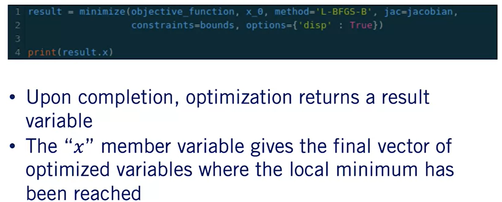

- Once the optimization is complete, the minimize function will return a result variable.
- The member variable of the results denoted by x will return the final vector of optimization variables where the local minima has been achieved.

**Bounds**

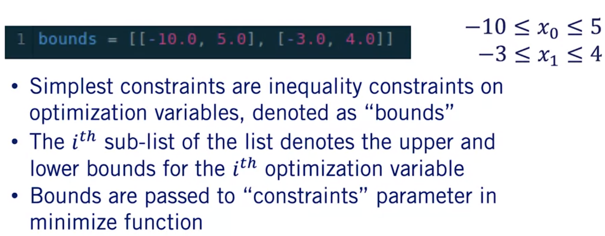

- As we mentioned earlier, we can also specify constraints for our optimization problems.
- For most algorithms, these constraints are given in the form of lists or dictionaries.
- The simplest type of constraints are inequality constraints on the objective variables called bounds.
- Bounds are specified by the L-BFGS-B algorithm as a list of lists, where each sub-list is of length two and contains the upper and lower bound for each optimization variable.
- In other words, the first sub-list corresponds to the bounds for x 0, and the second sub-list for x 1 etc.
- These bounds are then passed to the constraints optional parameter of the minimize function.

**Other Constraints**

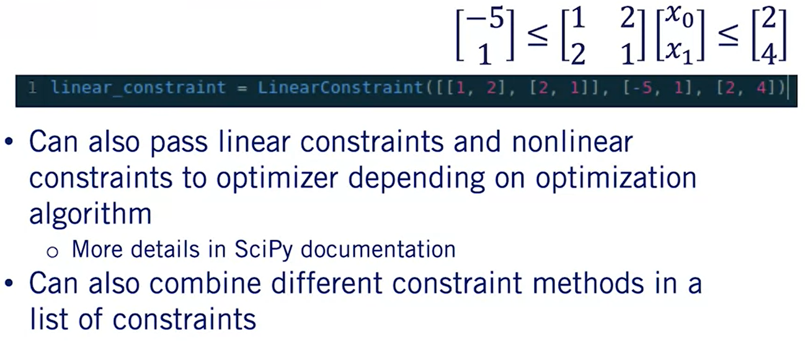

- Linear and non-linear constraints can also be passed to the optimizer, but for now we will focus on using bounds for optimization constraints.
- For more details, you can take a look at the SciPy optimization documentation online.
- You can also combine multiple types of constraints by passing in a Python list of each constraint object that you would like to use in the optimizer function.

**Summary**

- In this video we introduced how to set up an optimization problem using the SciPy optimization library.
- In particular, we discussed how to pass in user-defined objective functions in Jacobian's as well as parameter bounds to the optimizer.
- You should now have a good idea of how to solve general optimization problems using a Python library.
- For more information, you can consult the SciPy optimization library documentation.
- After this lesson, we have a programming assignment to give you a chance to practice the concepts we've discussed here and to prepare you for the end of module project.

### Lesson 4: Conformal Lattice Planning
### Lesson 5: Velocity Profile Generation
### Module 7 Supplementary Reading
## Final Project 

# References

# Appendices
