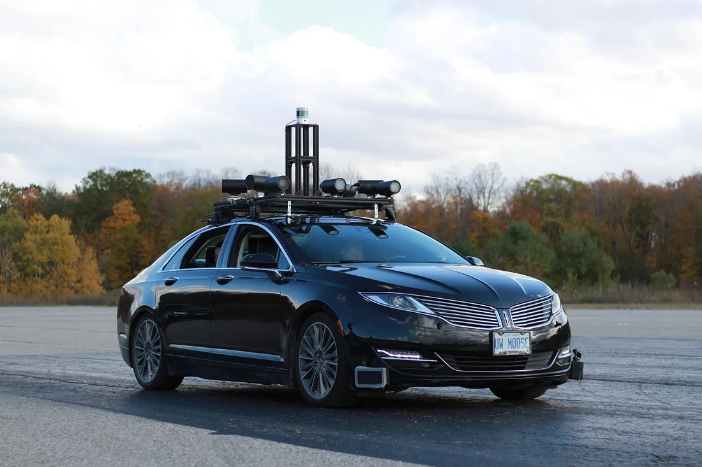

# Self-Driving Cars Specialization - Notes

## Overview

Notes and assignements of `Self-Driving Cars Specialization` course offered by Faculty of Appied Science and Engineering of [University of Toronto](https://www.autodrive.utoronto.ca/) on [Coursera](https://www.coursera.org/specializations/self-driving-cars). 

 

## What you will learn? 

1. Understand the detailed architecture and components of a self-driving car software stack
2. Implement methods for static and dynamic object detection, localization and mapping, behaviour and maneuver planning, and vehicle control
3. Use realistic vehicle physics, complete sensor suite: camera, LIDAR, GPS/INS, wheel odometry, depth map, semantic segmentation, object bounding boxes
4. Demonstrate skills in CARLA and build programs with Python

## Prerequisites

- List of prerequisites available [here](https://github.com/afondiel/SDCS-Prerequisites-UofT).

## Specialization Outline

|Course|Module & Chapters|Links|
|------|-----------------|-----|
|Course1-Introduction to Self-Driving Cars|- Module 1: The Requirements for Autonomy   - Module 2: Self-Driving Hardware and Software Architectures   - Module 3: Safety Assurance for Autonomous Vehicles   - Module 4: Vehicle Dynamic Modeling   - Module 5: Vehicle Longitudinal Control  - Module 6: Vehicle Lateral Control   - Module 7: Putting it all together|- [course1-w1-notes.md](./Course1-Introduction-to-Self-Driving-Cars/course1-w1-notes.md)   - [course1-w2-notes.md](./Course1-Introduction-to-Self-Driving-Cars/course1-w2-notes.md)  - [course1-w3-notes.md](./Course1-Introduction-to-Self-Driving-Cars/course1-w3-notes.md)  - [course1-w4-notes.md](./Course1-Introduction-to-Self-Driving-Cars/course1-w4-notes.md)  - [course1-w5-notes.md](./Course1-Introduction-to-Self-Driving-Cars/course1-w5-notes.md)  - [course1-w6-notes.md](./Course1-Introduction-to-Self-Driving-Cars/course1-w6-notes.md)  - [course1-w7-notes.md](./Course1-Introduction-to-Self-Driving-Cars/course1-w7-notes.md)|
|Course2-State Estimation and Localization for Self-Driving Cars|- Module 1: Introduction to Localization   - Module 2: Kalman Filters   - Module 3: Particle Filters   - Module 4: Sensor Fusion|- [course2-w1-notes.md](./Course2-State-Estimation-and-Localization-for-Self-Driving-Cars/course2-w1-notes.md)   - [course2-w2-notes.md](./Course2-State-Estimation-and-Localization-for-Self-Driving-Cars/course2-w2-notes.md)  - [course2-w3-notes.md](./Course2-State-Estimation-and-Localization-for-Self-Driving-Cars/course2-w3-notes.md)  - [course2-w4-notes.md](./Course2-State-Estimation-and-Localization-for-Self-Driving-Cars/course2-w4-notes.md)|
|Course3-Visual Perception for Self-Driving Cars|- Module 1: Introduction to Visual Perception   - Module 2: Visual Features   - Module 3: Object Detection   - Module 4: Semantic Segmentation|- [course3-w1-notes.md](./Course3-Visual-Perception-for-Self-Driving-Cars/course3-w1-notes.md)   - [course3-w2-notes.md](./Course3-Visual-Perception-for-Self-Driving-Cars/course3-w2-notes.md)  - [course3-w3-notes.md](./Course3-Visual-Perception-for-Self-Driving-Cars/course3-w3-notes.md)  - [course3-w4-notes.md](./Course3-Visual-Perception-for-Self-Driving-Cars/course3-w4-notes.md)|
|Course4-Motion Planning for Self-Driving Cars|- Module 1: Introduction to Motion Planning   - Module 2: Path Planning   - Module 3: Trajectory Planning   - Module 4: Behavior Planning|- [course4-w1-notes.md](./Course4-Motion-Planning-for-Self-Driving-Cars/course4-w1-notes.md)   - [course4-w2-notes.md](./Course4-Motion-Planning-for-Self-Driving-Cars/course4-w2-notes.md)  - [course4-w3-notes.md](./Course4-Motion-Planning-for-Self-Driving-Cars/course4-w3-notes.md)  - [course4-w4-notes.md](./Course4-Motion-Planning-for-Self-Driving-Cars/course4-w4-notes.md)|

## Final Project & Career

You’ll learn from a highly realistic driving environment that features 3D pedestrian modelling and environmental conditions. When you complete the Specialization successfully, you’ll be able to build your own `self-driving software stack` and be ready to `apply for jobs in the autonomous vehicle industry`.

## References

- [Main course - Coursera](https://www.coursera.org/specializations/self-driving-cars)
- I wrote a blog review, you can check it out [here](https://medium.com/@muntudiela/the-top-5-skills-i-learned-from-the-university-of-toronto-self-driving-cars-specialization-2023-6470b36fe7ed).
- I curated an awesome spreadsheet of prerequisites for the course, see [here](https://docs.google.com/spreadsheets/d/1VkTIZ3czhMvonNcRqsTJPW2s3aemIXe-1-XP_E3H5vk/edit?gid=0#gid=0).
- All projects [here](https://github.com/diesimo-ai/self-driving-car-projects)! 
- [My Certificate :) - Good Luck, You can do it too!.](https://www.coursera.org/account/accomplishments/specialization/SVJ5YGT8AW88?utm_source=link&utm_medium=certificate&utm_content=cert_image&utm_campaign=pdf_header_button&utm_product=s12n)

> ## "Self-driving cars are the natural extension of active safety and obviously something we should do." — Elon Musk 