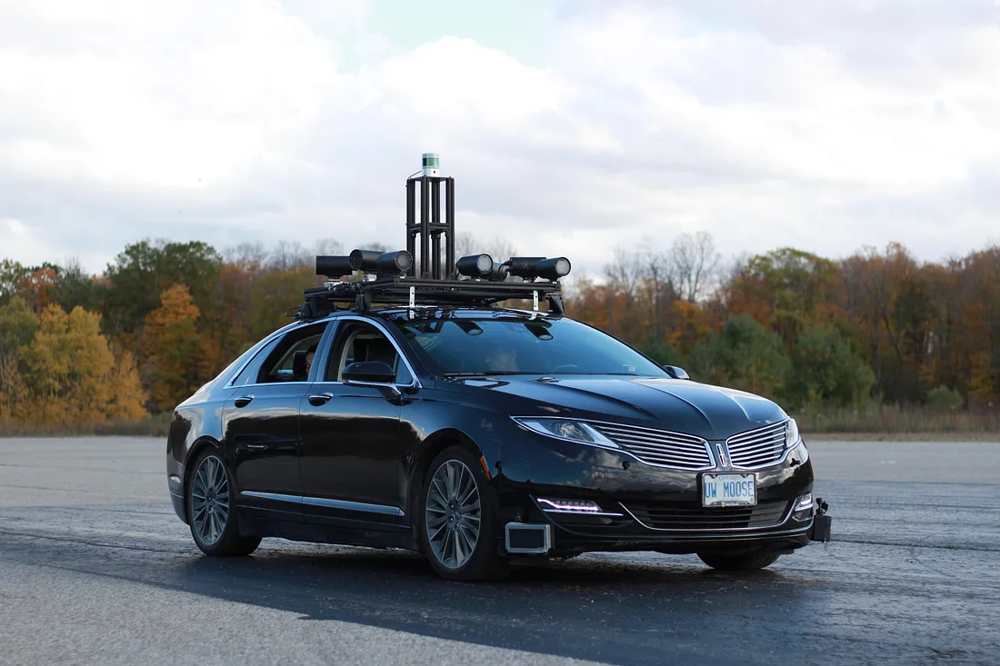

# Self-Driving Cars Specialization - Notes

## Overview

Notes and assignements of `Self-Driving Cars Specialization` course offered by Faculty of Appied Science and Engineering of [University of Toronto](https://www.autodrive.utoronto.ca/) on [Coursera](https://www.coursera.org/specializations/self-driving-cars). 

 

## What you will learn ? 

1. Understand the detailed architecture and components of a self-driving car software stack

2. Implement methods for static and dynamic object detection, localization and mapping, behaviour and maneuver planning, and vehicle control

3. Use realistic vehicle physics, complete sensor suite: camera, LIDAR, GPS/INS, wheel odometry, depth map, semantic segmentation, object bounding boxes

4. Demonstrate skills in CARLA and build programs with Python

## How long it will take ? 
- Recommended pace: 5h/week => 7m x (1x4wx5h) = 140h => **7 months**
- Medium Pace: if 7h/day  => 35h/week => (140h/35h) => 4 weeks => **1 month**
- Fast (Genius): if 10h/day => 70h/week => (140h/70h) => 2 weeks => **1/2 month**

## About this [Specialization](https://www.coursera.org/specializations/self-driving-cars#courses)

- Be at the forefront of the autonomous driving industry. With market researchers predicting a `$42-billion market` and more than 20 million self-driving cars on the road by 2025, the next big job boom is right around the corner.

- This Specialization gives you a comprehensive understanding of state-of-the-art engineering practices used in the self-driving car industry. You'll get to interact with real data sets from an autonomous vehicle (AV)―all through hands-on projects using the open source simulator CARLA.

- Throughout your courses, you’ll hear from industry experts who work at companies like Oxbotica and Zoox as they share insights about autonomous technology and how that is powering job growth within the field.

- You’ll learn from a highly realistic driving environment that features 3D pedestrian modelling and environmental conditions. When you complete the Specialization successfully, you’ll be able to build your own self-driving software stack and be ready to apply for jobs in the autonomous vehicle industry.

## Prerequisites

- It is recommended that you have some background in linear algebra, probability, statistics, calculus, physics, control theory, and Python programming. You will need these specifications in order to effectively run the CARLA simulator: Windows 7 64-bit (or later) or Ubuntu 16.04 (or later), Quad-core Intel or AMD processor (2.5 GHz or faster), NVIDIA GeForce 470 GTX or AMD Radeon 6870 HD series card or higher, 8 GB RAM, and OpenGL 3 or greater (for Linux computers).

## Applied Learning Project

You’ll learn from a highly realistic driving environment that features 3D pedestrian modelling and environmental conditions. When you complete the Specialization successfully, you’ll be able to build your own `self-driving software stack` and be ready to `apply for jobs in the autonomous vehicle industry`.

## References

- [Link to enroll the Specialization from Coursera](https://www.coursera.org/specializations/self-driving-cars)
- [My Certificate :) - You can do it too!](https://www.coursera.org/account/accomplishments/specialization/SVJ5YGT8AW88?utm_source=link&utm_medium=certificate&utm_content=cert_image&utm_campaign=pdf_header_button&utm_product=s12n)

> ## "Self-driving cars are the natural extension of active safety and obviously something we should do." — Elon Musk 